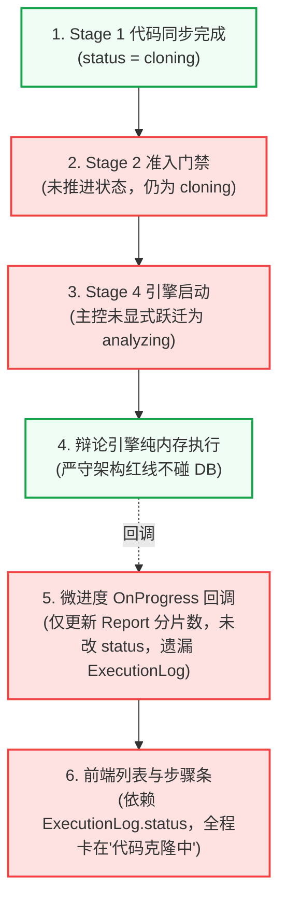
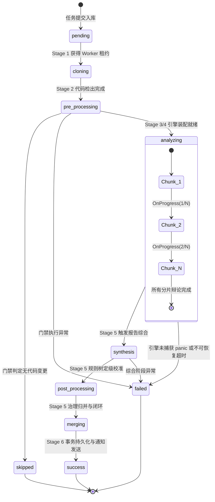

# 流水线全生命周期状态机推进与观测遥测架构设计

> **设计规范基准**：本文件为 Code-Shield 静态代码扫描执行流水线（Pipeline Runner）与任务遥测观测器（Pipeline Telemetry）的全局状态机流转与多端协同架构设计规范。  
> **归属领域**：`01-core-pipeline`（流水线与核心服务层架构）  
> **前置依赖**：[02-扫描引擎与执行流水线职责边界与协同模型深度设计.md](02-扫描引擎与执行流水线职责边界与协同模型深度设计.md)

---

## 1. 架构背景与现状断裂复盘

在 Code-Shield 完成服务层模块化与扫描引擎解耦重构后，系统确立了清晰的职责边界：**扫描引擎（Scanning Engine）是“领域业务算法专家”，完全保持纯内存计算，严禁操作数据库与全局任务状态机；执行流水线（Pipeline Runner）是“任务生命周期流程管家”，全面负责任务全局状态推进、资源管控与产物交付**。

然而在多智能体三权分立对抗辩论引擎（`DebateEngine`）全面上线后，前端控制台出现了**“扫描任务长期停滞在‘代码克隆中...’，后续分片分析与辩论进度无法实时感知”**的问题。深入排查后，暴露出系统在流水线状态推进与观测遥测上的 4 个关键断裂点：



### 核心断裂成因总结
1. **主控未履行显式跃迁职责**：流水线主控在 Stage 1 结束后，流转进入 Stage 2（前置检查）和 Stage 4（引擎驱动）时，未显式调用状态机跃迁。
2. **纯内存引擎的副作用剥离真空**：旧引擎依靠深层函数 `ExecuteAI` 的偶然副作用修改状态；新一代 `DebateEngine` 剥离了所有 DB 依赖，导致状态推进出现“真空期”。
3. **双表状态双写不一致 (Dual-Table Inconsistency)**：`task_reports` 与 `task_execution_logs` 未实现单一真实源原子收口，`ProgressReport` 仅局部更新 `task_reports` 的数字，未推进状态机。
4. **断点续跑被重置覆盖**：`resume.go` 开头虽然标记为 `analyzing`，但随后调用的 `PrepareAndSync` 又将其覆写为 `cloning`，缺乏生命周期连续性。

---

## 2. 核心设计理念与架构准则

针对上述问题，本设计提出三大核心架构准则：

1. **显式阶段主控跃迁（Explicit Stage Transition）**：  
   任务生命周期的推进是流水线主控的核心职责。流水线必须在每个 Stage 的入口和出口显式、确定性地推进任务状态，杜绝任何深层底层函数的隐式副作用。
2. **单一真实源原子遥测（Single Source of Truth Telemetry）**：  
   抽象统一的 `PipelineTelemetry`（流水线遥测观测器），统一封装对 `task_reports` 与 `task_execution_logs` 的原子双写，确保状态、进度、阶段描述与优先级的 100% 强一致。
3. **进度驱动的自愈与幂等（Self-Healing & Idempotency）**：  
   当遥测器接收到引擎回传的微进度事件时，若系统检测到当前状态仍滞后（如落后于 `analyzing`），遥测器自动执行自愈跃迁，确保哪怕引擎漏发阶段事件，系统状态也绝不假死停滞。

---

## 3. 全生命周期六阶段状态机模型

Code-Shield 扫描流水线标准生命周期包含 8 个标准化状态，与 6 大流水线阶段严格对应：

| 流水线阶段 | 状态枚举 (`status`) | 状态优先级 (`priority`) | 阶段中文名称 | 前端 UI 徽章与文案 |
| :--- | :--- | :--- | :--- | :--- |
| **Stage 0: 队列调度** | `pending` / `queued` | 1 | 排队就绪 | `排队中` (黄色等待) |
| **Stage 1: 代码准备** | `cloning` | 1 | 代码检出 | `代码克隆中...` (蓝色动态) |
| **Stage 2: 准入门禁** | `pre_processing` | 1 | 门禁前检 | `前置检查中...` (蓝色动态) |
| **Stage 3/4: 分析辩论** | `analyzing` | 1 | 核心分析 | `对抗辩论中 (x/y)...` / `分片检视中 (x/y)...` |
| **Stage 5: 报告综合** | `synthesis` | 1 | 报告总结 | `全仓报告总结中 (AI 排版生成)...` |
| **Stage 5: 缺陷后处理** | `post_processing` | 1 | 缺陷定级 | `缺陷状态同步中...` |
| **Stage 5: 治理归并** | `merging` | 1 | 闭环归并 | `问题归并与闭环中...` |
| **Stage 6: 终态交付** | `success` / `failed` / `skipped` | 2 | 完成交付 | `执行成功` / `执行失败` / `已跳过` |



---

## 4. 流水线遥测与观测器接口契约

为了彻底解耦主控流程与底层 GORM 操作，系统在 `services/runner` 包中沉淀统一的遥测与状态推进契约：

```go
// UpdateTaskStatus 原子同步更新 TaskReport 和关联 TaskExecutionLog 的运行状态
func UpdateTaskStatus(reportID uint, status string)

// UpdateTaskProgress 原子同步更新任务分片处理微进度，并在必要时自愈推进状态
func UpdateTaskProgress(reportID uint, total, processed, success int, currentChunk string)
```

### 4.1 核心实现逻辑
```go
func UpdateTaskProgress(reportID uint, total, processed, success int, currentChunk string) {
    if models.DB == nil || reportID == 0 {
        return
    }

    // 1. TaskReport 原子更新分片指标与状态自愈
    reportUpdates := map[string]interface{}{
        "total_chunks":     total,
        "processed_chunks": processed,
        "success_chunks":   success,
    }
    
    // 若当前仍处于克隆或前置检查状态，收到进度时自动纠正为 analyzing
    var currReport models.TaskReport
    if err := models.DB.Select("status").First(&currReport, reportID).Error; err == nil {
        if currReport.Status == models.StatusCloning || currReport.Status == models.StatusPreProcessing || currReport.Status == models.StatusPending {
            reportUpdates["status"] = models.StatusAnalyzing
        }
    }
    models.DB.Model(&models.TaskReport{}).Where("id = ?", reportID).Updates(reportUpdates)

    // 2. TaskExecutionLog 同步原子更新
    logUpdates := map[string]interface{}{
        "status":          models.StatusAnalyzing,
        "status_priority": models.GetStatusPriority(models.StatusAnalyzing),
    }
    models.DB.Model(&models.TaskExecutionLog{}).Where("task_report_id = ?", reportID).Updates(logUpdates)
}
```

---

## 5. 主流水线各阶段标准动作流

执行流水线在驱动任务时，严格按照以下次序执行显式状态跃迁：

```go
// 1. Stage 1: 代码克隆与同步
codesPath, err := PrepareAndSync(ctx.Ctx, ctx.Repo, ctx.Report.ID, repoURL)
// 内部: UpdateTaskStatus(reportID, models.StatusCloning)

// 2. Stage 2: 准入门禁
UpdateTaskStatus(ctx.Report.ID, models.StatusPreProcessing)
skipped, err := CheckPrecondition(ctx.Ctx, ctx.Report.ID, ctx.TaskType, ctx.CodesPath)

// 3. Stage 3 & 4: 引擎驱动与分析
UpdateTaskStatus(ctx.Report.ID, models.StatusAnalyzing)
engCtx.ProgressReport = func(total, processed, success int) {
    UpdateTaskProgress(ctx.Report.ID, total, processed, success, "")
}
result, runErr := engine.Run(engCtx)

// 4. Stage 5: 综合与后处理
// 报告综合中:
UpdateTaskStatus(ctx.Report.ID, models.StatusSynthesis)
// 后处理计算中:
UpdateTaskStatus(ctx.Report.ID, models.StatusPostProcessing)
// 治理归并中:
UpdateTaskStatus(ctx.Report.ID, models.StatusMerging)

// 5. Stage 6: 事务提交与通告
// Finalize 内部根据最终结果原子提交:
// UpdateTaskStatus(ctx.Report.ID, models.StatusSuccess / StatusFailed)
```

---

## 6. 断点续跑（Resume Pipeline）状态对齐

针对断点续跑场景（`services/runner/resume.go`），流程必须遵循相同的状态机语义：
1. **代码同步阶段**：调用 `PrepareAndSync`，状态临时为 `cloning`；
2. **分析恢复阶段**：代码同步完成后，**立即显式调用 `UpdateTaskStatus(reportID, models.StatusAnalyzing)`**；
3. **局部重试分片推进**：在每个失败分片重试完成时，通过 `UpdateTaskProgress` 实时累加 `processed_chunks` 与 `success_chunks`，保证前端步骤条平滑递增。

---

## 7. 前端自适应动态感知体系 (Adaptive Polling)

为了让用户在操作界面实时感知任务推进，同时避免空闲时对后端产生无效高频轮询压力，前端设计了**自适应轮询流控机制**：

```mermaid
flowchart TD
    Start["列表页载入"] --> CheckActive{"是否存在未完成任务?<br/>(cloning / pre_processing / analyzing / synthesis / post_processing / merging)"}
    CheckActive -->|是 (任务进行中)| HighFreq["启动高频感应轮询 (3~5s)"]
    CheckActive -->|否 (全部任务完结)| LowFreq["退回低频心跳轮询 (15~30s)"]
    HighFreq --> Fetch["请求 /api/executions"]
    LowFreq --> Fetch
    Fetch --> CheckActive
```

### 前端状态渲染增强
1. **执行列表页徽章**：
   - 当 `status === 'analyzing'` 时：根据 `total_chunks` 与 `processed_chunks` 动态呈现 `对抗辩论中 (2/5)...` 或 `分片检视中 (2/5)...`；
   - 当 `processed_chunks >= total_chunks` 时：自动显示 `全仓报告总结中 (AI 排版生成)...`；
2. **流水线步骤条 (`PipelineStepper`)**：
   - 准确高亮当前正处于活跃的 Step（1.代码准备 $\to$ 2.分片检视/对抗辩论 $\to$ 3.校准与增量比对 $\to$ 4.全仓报告综合 $\to$ 5.缺陷同步与归档）；
   - 彻底告别“前 4 步全灰、只有代码克隆在转圈”的假死体验。

---

## 8. 实施与交付计划

1. **核心服务层改造**：
   - 更新 [services/runner/finalize.go](file:///home/fugui/codes/code-shield/services/runner/finalize.go)：新增 `UpdateTaskProgress` 强类型原子更新；
   - 更新 [services/runner/runner.go](file:///home/fugui/codes/code-shield/services/runner/runner.go)：在 Stage 2、Stage 3/4 注入显式跃迁，对接 `UpdateTaskProgress`；
   - 更新 [services/runner/resume.go](file:///home/fugui/codes/code-shield/services/runner/resume.go)：代码拉取后重设 `analyzing`，分片重试增加微进度汇报；
   - 更新 [services/services.go](file:///home/fugui/codes/code-shield/services/services.go)：门面适配器同步对齐。
2. **前端交互优化**：
   - 更新 [frontend/src/pages/ExecutionLogs.tsx](file:///home/fugui/codes/code-shield/frontend/src/pages/ExecutionLogs.tsx)：增加自适应轮询逻辑，当有活跃任务时以 4 秒快速感应。
3. **测试验证与持续交付**：
   - 编写单元测试验证状态跃迁与自愈逻辑；
   - 运行本地构建与回归测试；
   - 代码检视确认无误后直接推送到 GitHub 仓库。
