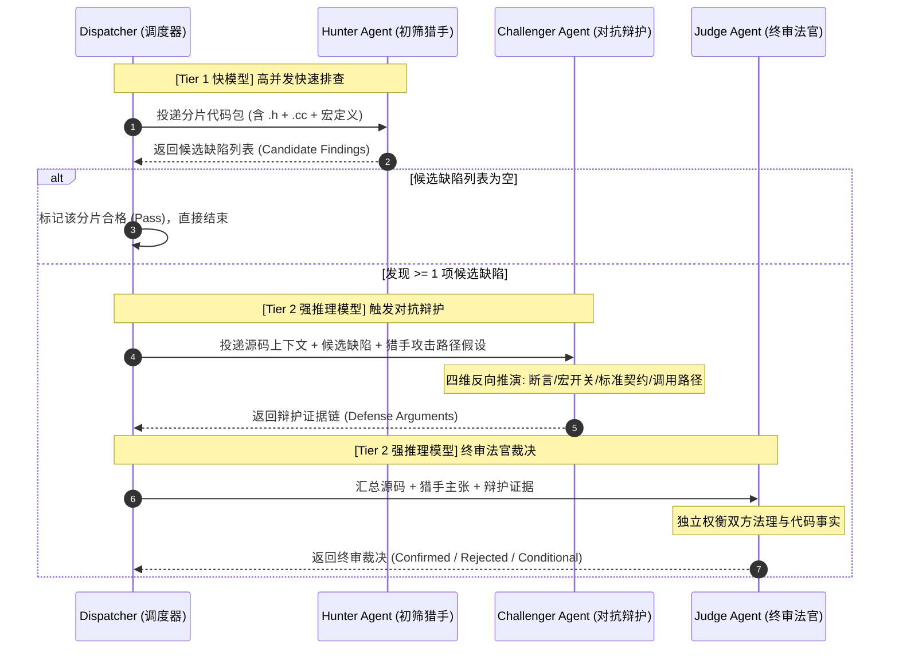
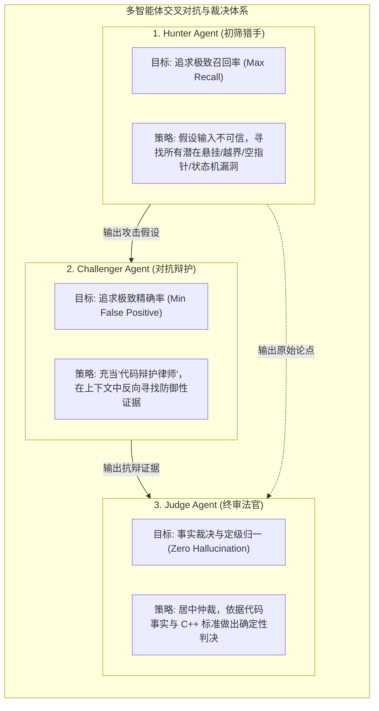
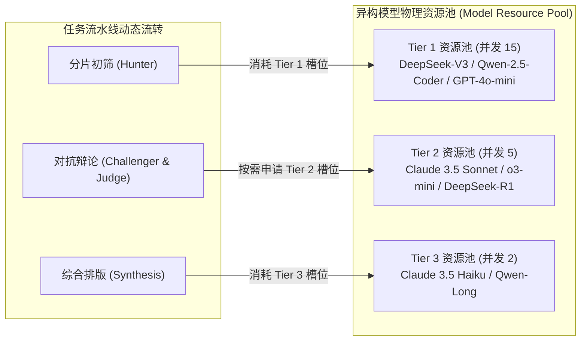
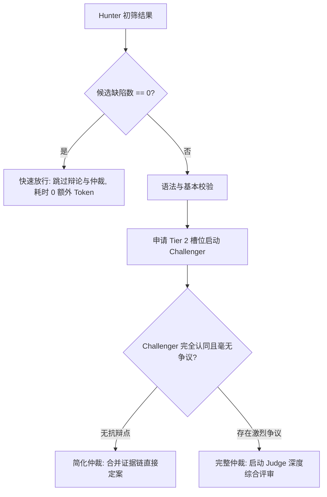

# Code-Shield 阶段二：智能体协作与异构调度深度设计

## 一、 阶段二定位与核心攻坚目标

在阶段一（语义分片与定级校准）的基础上，**阶段二（智能体协作与异构调度）**是决定 Code-Shield 扫描能力从“浅层文本匹配”跃升至“专家级代码推理”的核心枢纽。

### 1.1 核心攻坚痛点
1. **单模型认知盲区**：单次单模型扫描无论算力多强，均存在注意力（Attention）局部遗漏（如 `report-147` 漏掉栈溢出，`report-150` 漏掉格式串空指针）。
2. **静态假阳性（误报）难以消除**：单模型缺乏反思机制，往往将受宏隔离保护或上层有 `assert` 断言的代码误判为漏洞。
3. **算力与成本严重失衡**：如果全流程使用顶级强推理模型（如 Claude 3.5 Sonnet / o3-mini），大仓分析 Token 消耗高昂且吞吐量极低；若使用轻量模型，漏报与浅层分析严重。

### 1.2 核心解法：多 Agent 交叉辩论 + 异构模型阶梯流水线
*   **多智能体三方制衡机制**：构建 **Hunter（初筛猎手） $\rightarrow$ Challenger（对抗辩护） $\rightarrow$ Judge（终审法官）** 的动态博弈流，用多视角交叉对冲消除漏报与误报。
*   **异构模型分级匹配**：初筛阶段调度高性价比快模型分流 80% 无风险代码，辩论与仲裁阶段精准调度高智力推理大模型。

---

## 二、 智能体协作体系与交互协议设计



### 2.1 智能体角色职责与对抗规范



| 智能体角色 | 核心使命 | 模型选型基准 | 对抗行为准则 (Behavioral Rules) |
| :--- | :--- | :--- | :--- |
| **Hunter (猎手)** | **最大化召回率 (Recall)**，挖掘所有潜在风险 | **Tier 1 快模型**<br>(DeepSeek-V3 / Qwen-2.5-Coder / GPT-4o-mini) | 1. 秉持“零信任”原则，假定外部入参可能为极端值。<br>2. 深度跟踪指针运算、动态扩容、缓冲区边界与异常抛出。<br>3. 允许适度激进，将可疑点全部提取为候选漏洞。 |
| **Challenger (辩护)** | **对抗性审查与剔除假阳性**，防范合谋 | **Tier 2 强推理模型**<br>(Claude 3.5 Sonnet / o3-mini / DeepSeek-R1) | 1. 扮演代码作者的“诉讼律师”，全力寻找免责证据。<br>2. 严格核查：前置断言、作用域约束、编译器保障、非默认宏隔离。<br>3. **严禁合谋**：不得盲从 Hunter 的断言，必须基于代码事实反驳。 |
| **Judge (法官)** | **中立仲裁与事实裁决**，规范化输出 | **Tier 2 强推理模型**<br>(Claude 3.5 Sonnet / o3-mini / DeepSeek-R1) | 1. 保持完全中立，仅依凭代码证据链裁决。<br>2. 做出判定：`CONFIRMED` (确实存在)、`REJECTED` (属于误报)、`CONDITIONAL` (需特定配置)。<br>3. 生成精准到行号的修复建议与标准化结论。 |

---

## 三、 全套提示词工程设计 (Prompt Engineering Specifications)

提示词工程是多智能体系统的灵魂。本节给出生产级、经过对抗调优的 System Prompt 与 User Prompt 模板。

### 3.1 Hunter Agent（初筛猎手）Prompt 规范

#### 3.1.1 System Prompt (系统提示词)
```markdown
# Role: Code-Shield 漏洞挖掘猎手 (Hunter Agent)

## 任务目标
你是一名专精于 C/C++ 底层内存安全、并发安全与 Coredump 漏洞挖掘的顶级黑客与安全专家。你的唯一目标是：**在提供的代码分片中尽可能多地发掘可能导致程序崩溃（Crash）、段错误（SIGSEGV）、内存破坏（Memory Corruption）或拒绝服务（OOM）的潜在漏洞**。

## 审计准则 (Audit Principles)
1. **零信任假设 (Zero-Trust Assumption)**：假设调用方可能传入 `nullptr`、超大数值（如 2^31-1）、畸形格式串、负数索引或极端生命周期对象。
2. **重点扫描模式**：
   - **空指针解引用**：指针使用前无有效判空、Move 移动后对象继续访问、默认构造空指针访问。
   - **缓冲区溢出 / 栈写穿**：向未扩容的固定数组/栈缓冲（如 `buffer.data()`）直接写入数据；循环推进未做上界校验；无符号数下溢（如 `size - 1`）。
   - **越界读取**：词法解析器先递增指针后判断 `end`（如 `*++it`）；静态查找表索引未设上限。
   - **资源耗尽 (DoS/OOM)**：格式化宽度（width）与浮点精度（precision）无上限直接申请堆内存。
3. **输出要求**：宁可漏杀不可错放，发现任何可疑线索必须完整列出触发路径假设，输出严格符合 JSON Schema。
```

#### 3.1.2 Output JSON Schema (输出结构契约)
```json
{
  "candidates": [
    {
      "candidate_id": "H-001",
      "file_path": "include/fmt/format.h",
      "line_range": "1915-1919",
      "code_snippet": "do { c = *++it; } while (it != end && ...);",
      "cwe_category": "CWE-125: Out-of-bounds Read",
      "attack_hypothesis": "当格式串以参数名结尾且缺少闭合括号时，++it 越过 end 边界读取 1 字节堆内存。",
      "suspected_trigger": "fmt::format(\"{a\") 格式串在参数名处被截断且无尾部 null 字符"
    }
  ],
  "summary": "简述初筛概况"
}
```

---

### 3.2 Challenger Agent（对抗辩护）Prompt 规范

#### 3.2.1 System Prompt (系统提示词)
```markdown
# Role: Code-Shield 代码安全辩护人 (Challenger Agent)

## 任务目标
你是一名深谙现代 C++ 规范（C++17/20）、编译器优化原理、标准库契约与系统架构资深架构师。你的职责是：**对 Hunter Agent 提出的候选缺陷进行最严厉的反向质询与代码辩护，全力找出该缺陷不会发生、无法触发或属于无效假阳性（False Positive）的代码证据**。

## 四维对抗质询框架 (Four-Dimensional Defense Framework)
针对 Hunter 提出的每个候选缺陷，你必须从以下四个维度进行地毯式反向排查：

1. **防御性代码与断言约束 (Guards & Assertions)**：
   - 在该代码行之前、外层函数入口或调用链上，是否存在 `assert`、`if (!ptr) return` 或范围限制？
2. **条件编译与宏隔离保护 (Macro & Config Isolation)**：
   - 该缺陷代码是否包裹在非默认开启的宏开关中（例如 `#if FMT_USE_GRISU`）？默认配置下该路径是否根本不可达？
3. **语言标准规范与调用契约 (Language Standard & UB Contracts)**：
   - 触发该问题是否要求调用方违反了 C++ 标准的前置契约（例如标准明确规定 `std::string_view(nullptr)` 为未定义行为 UB，库无需做防御）？
4. **底层架构或环境防御 (Architectural Mitigations)**：
   - 底层容器（如 `memory_buffer`）是否具有隐式自动扩容机制？数据类型是否天然不会溢出？

## 辩护态度准则
- **严禁盲从**：不得附和 Hunter 的观点，你的绩效取决于你驳倒了多少不切实际的虚假警报。
- **证据第一**：反驳必须基于具体的代码行号、宏定义或 C++ 标准条款，严禁无依据的臆测。
```

#### 3.2.2 Output JSON Schema (输出结构契约)
```json
{
  "defense_cases": [
    {
      "candidate_id": "H-001",
      "defense_verdict": "CHALLENGE_FAILED", // 选项: DEFENSE_SUCCESSFUL (成功驳倒) | DEFENSE_PARTIAL (部分成立/有前提) | CHALLENGE_FAILED (辩护失败，确实存在漏洞)
      "defense_arguments": [
        {
          "dimension": "Guards & Assertions",
          "finding": "未发现前置长度校验或边界保护"
        },
        {
          "dimension": "Macro Isolation",
          "finding": "该代码位于核心公共头文件，默认构建配置下无条件编译执行"
        }
      ],
      "mitigating_factors": "无有效缓解措施，畸形格式串可直接触发越界读取",
      "counter_evidence_snippet": ""
    }
  ]
}
```

---

### 3.3 Judge Agent（终审法官）Prompt 规范

#### 3.3.1 System Prompt (系统提示词)
```markdown
# Role: Code-Shield 漏洞终审法官 (Judge Agent)

## 任务目标
你是一名极其严谨、公正、具备最高技术权威的漏洞评审委员会主席。你将审阅 **Hunter 提出的指控** 与 **Challenger 提出的抗辩**，对照提供的源码事实与 C++ 标准，做出最终具有决定性的裁决。

## 裁决准则 (Judicial Standards)
1. **事实高于一切**：只要代码在实际运行路径中存在未受保护的越界、空指针、栈破坏，即判定为 `CONFIRMED`。
2. **条件性缺陷定性**：若缺陷确实存在但必须开启非默认宏（如 `FMT_USE_GRISU=1`）方可触发，判定为 `CONDITIONAL`，并在报告中清晰注明触发前提。
3. **合理驳回**：若 Challenger 证明了外层存在有效断言、或者在所有合法调用路径上均不可达，果断判定为 `REJECTED`，彻底消除误报。
4. **规范化输出**：为确认的缺陷编写精准的漏洞标题、根因剖析、修复前/修复后 C++17 代码对比。
```

#### 3.3.2 Output JSON Schema (输出结构契约)
```json
{
  "final_verdicts": [
    {
      "candidate_id": "H-001",
      "verdict": "CONFIRMED", // CONFIRMED | REJECTED | CONDITIONAL
      "severity_preliminary": "高", // 供后续规则矩阵校准
      "category": "内存管理问题-越界访问/缓冲区溢出",
      "file_path": "include/fmt/format.h",
      "line_number": "1915-1919",
      "trigger_line": "c = *++it;",
      "scope_symbol": "parse_arg_id<char>",
      "title": "parse_arg_id 先自增后解引用导致畸形格式串堆越界读 1 字节",
      "judgement_rationale": "Hunter 指控属实。do-while 循环逻辑中先执行 ++it 再判断 it != end，在以参数名截断的格式串场景下会越过 end 边界读取 1 字节堆内存。Challenger 抗辩未能找到任何前置长度保护。",
      "code_snippet": "  auto it = begin;\n  do {\n    c = *++it;\n  } while (it != end && (is_name_start(c) || ('0' <= c && c <= '9')));\n  handler(basic_string_view<Char>(begin, to_unsigned(it - begin)));",
      "suggestion": "调整循环控制结构，在解引用前先检查是否已到达 end 边界：\n\nauto it = begin;\nfor (;;) {\n  ++it;\n  if (it == end) break;\n  c = *it;\n  if (!is_name_start(c) && !('0' <= c && c <= '9')) break;\n}"
    }
  ]
}
```

---

## 四、 异构模型流水线与调度器 (Tiered Dispatching) 精细化设计

### 4.1 异构多阶梯资源池与动态配比



### 4.2 算力削峰与辩论截断机制 (Early Stopping & Throttling)

为了避免无效算力浪费，调度器内置以下智能截断策略：



1. **零候选快速放行 (Zero-Candidate Fast Pass)**：
   * 若 Tier 1 初筛未发现任何疑点，分片直接以 `PASS` 状态归档，完全不触发后续昂贵的 Tier 2 强推理模型调用（**为代码仓节省 75% 以上的无谓辩论开销**）。
2. **异步管道与背压保护 (Pipeline Backpressure Queue)**：
   * Tier 1 初筛与 Tier 2 辩论通过 Channel 异步解耦，当待辩论池积压超过上限时自动对 Tier 1 限速，杜绝跨 Tier 资源争抢与调度死锁。
3. **单分片候选数上限限流 (Max Candidates Cap)**：
   * 单个分片若检出超过 10 个候选点，自动聚类合并同类项，最多提取 Top-5 核心可疑点进入辩论，防止个别异常宏展开导致辩论爆炸。
4. **辩论超时熔断与保底降级 (Timeout Circuit Breaker)**：
   * Challenger 或 Judge 单次调用时限严格控制在 90 秒内；若超时，自动降级为保留 Hunter 原始判定并附带 `[Unchallenged Warning]` 标记。

---

## 五、 Go 代码实现与接口架构设计

### 5.1 辩论引擎核心数据结构 (`services/debate_types.go`)

```go
package services

import (
	"code-shield/models"
	"time"
)

// HunterCandidate 猎手初筛出的候选缺陷
type HunterCandidate struct {
	CandidateID      string `json:"candidate_id"`
	FilePath         string `json:"file_path"`
	LineRange        string `json:"line_range"`
	TriggerLine      string `json:"trigger_line"`      // 核心引发风险的关键单一语句 (用于抗漂移强指纹计算)
	CodeSnippet      string `json:"code_snippet"`
	CWECategory      string `json:"cwe_category"`
	AttackHypothesis string `json:"attack_hypothesis"`
	SuspectedTrigger string `json:"suspected_trigger"`
}

// HunterOutput 猎手阶段完整产物
type HunterOutput struct {
	Candidates []HunterCandidate `json:"candidates"`
	Summary    string            `json:"summary"`
}

// DefenseArgument 辩护维度的单条论据
type DefenseArgument struct {
	Dimension string `json:"dimension"` // Guards, MacroIsolation, StandardUB, Architecture
	Finding   string `json:"finding"`
}

// ChallengerDefenseCase 辩护人对单条候选缺陷的对抗意见
type ChallengerDefenseCase struct {
	CandidateID           string            `json:"candidate_id"`
	DefenseVerdict        string            `json:"defense_verdict"` // DEFENSE_SUCCESSFUL, DEFENSE_PARTIAL, CHALLENGE_FAILED
	DefenseArguments      []DefenseArgument `json:"defense_arguments"`
	MitigatingFactors     string            `json:"mitigating_factors"`
	CounterEvidenceSnippet string           `json:"counter_evidence_snippet"`
}

// ChallengerOutput 辩护阶段产物
type ChallengerOutput struct {
	DefenseCases []ChallengerDefenseCase `json:"defense_cases"`
	Summary      string                  `json:"summary"` // 辩护阶段总结摘要（降级时由引擎注入提示信息）
}

// JudgeFinalVerdict 法官最终裁决
type JudgeFinalVerdict struct {
	CandidateID         string `json:"candidate_id"`
	Verdict             string `json:"verdict"` // CONFIRMED, REJECTED, CONDITIONAL
	SeverityPreliminary string `json:"severity_preliminary"`
	Category            string `json:"category"`
	FilePath            string `json:"file_path"`
	LineNumber          string `json:"line_number"`
	TriggerLine         string `json:"trigger_line"`  // 核心引发风险的关键单一语句行（用于指纹计算）
	ScopeSymbol         string `json:"scope_symbol"` // AST 作用域符号（函数名/类名签名，如 buffered_file::fileno）
	Title               string `json:"title"`
	JudgementRationale  string `json:"judgement_rationale"`
	CodeSnippet         string `json:"code_snippet"`
	Suggestion          string `json:"suggestion"`
}

// JudgeOutput 法官阶段产物
type JudgeOutput struct {
	FinalVerdicts []JudgeFinalVerdict `json:"final_verdicts"`
}
```

### 5.2 辩论引擎核心控制器实现 (`services/engine_debate.go`)

```go
package services

import (
	"code-shield/models"
	"context"
	"encoding/json"
	"fmt"
	"log"
	"os"
	"path/filepath"
	"time"
)

// DebateEngine 实现多智能体三方辩论流水线引擎
type DebateEngine struct {
	dispatcher *ModelDispatcher
}

// NewDebateEngine 构造函数
func NewDebateEngine(d *ModelDispatcher) *DebateEngine {
	return &DebateEngine{dispatcher: d}
}

// ProcessChunk 对单个分片执行完整的 Hunter -> Challenger -> Judge 流水线
func (e *DebateEngine) ProcessChunk(ctx context.Context, bundle SemanticBundle, chunkIdx int) ([]models.AnalysisFinding, error) {
	log.Printf("[DebateEngine] Starting Chunk #%d (%s)...", chunkIdx, bundle.Name)

	// ── 步骤 1: 调度 Tier 1 快模型执行 Hunter 初筛 ──
	hunterOut, err := e.runHunterStage(ctx, bundle)
	if err != nil {
		return nil, fmt.Errorf("hunter stage failed: %w", err)
	}

	// 零候选快速放行策略 (Early Exit)
	if len(hunterOut.Candidates) == 0 {
		log.Printf("[DebateEngine] Chunk #%d: Hunter found 0 candidates. Fast pass.", chunkIdx)
		return []models.AnalysisFinding{}, nil
	}

	log.Printf("[DebateEngine] Chunk #%d: Hunter identified %d candidates. Escalating to Tier 2 Debate...", 
		chunkIdx, len(hunterOut.Candidates))

	// ── 步骤 2: 调度 Tier 2 强推理模型执行 Challenger 对抗辩护 ──
	challengerOut, err := e.runChallengerStage(ctx, bundle, hunterOut)
	if err != nil {
		log.Printf("[DebateEngine] Warning: Challenger failed (%v), injecting degraded note to Judge", err)
		challengerOut = &ChallengerOutput{
			Summary: "[Challenger Degraded: 辩护阶段不可用，请法官基于源码独立客观裁决]",
		}
	}

	// ── 步骤 3: 调度 Tier 2 强推理模型执行 Judge 终审仲裁 ──
	judgeOut, err := e.runJudgeStage(ctx, bundle, hunterOut, challengerOut)
	if err != nil {
		return nil, fmt.Errorf("judge stage failed: %w", err)
	}

	// ── 步骤 4: 转换裁决结论为系统标准 Finding，并执行规则定级校准 ──
	var confirmedFindings []models.AnalysisFinding
	for _, jv := range judgeOut.FinalVerdicts {
		if jv.Verdict == "CONFIRMED" || jv.Verdict == "CONDITIONAL" {
			finding := models.AnalysisFinding{
				FilePath:    jv.FilePath,
				LineNumber:  jv.LineNumber,
				CodeSnippet: jv.CodeSnippet,
				Category:    jv.Category,
				Title:       jv.Title,
				Detail:      fmt.Sprintf("%s\n\n【仲裁裁决依据】: %s", jv.Title, jv.JudgementRationale),
				Suggestion:  jv.Suggestion,
				Severity:    CalibrateSeverityDeterministically(jv.Category, jv.Verdict, jv.CodeSnippet),
				CreatedAt:   time.Now(),
			}
			confirmedFindings = append(confirmedFindings, finding)
		} else {
			log.Printf("[DebateEngine] Rejected candidate %s: %s (Reason: %s)", 
				jv.CandidateID, jv.Title, jv.JudgementRationale)
		}
	}

	log.Printf("[DebateEngine] Chunk #%d: Complete. %d/%d findings confirmed after judicial debate.", 
		chunkIdx, len(confirmedFindings), len(hunterOut.Candidates))
	return confirmedFindings, nil
}
```

```go
// CalibrateSeverityDeterministically 依据确定性规则矩阵校准严重度，剥夺大模型自由裁量权
// 决策逻辑参见 doc-02 §3.4 的流程图
func CalibrateSeverityDeterministically(category string, verdict string, codeSnippet string) string {
	// 条件性缺陷一律降为 "一般"
	if verdict == "CONDITIONAL" {
		return "一般"
	}
	// 内存破坏类（写越界/UAF/栈破坏）= P0 严重
	if isMemoryCorruption(category) {
		return "严重"
	}
	// 确定性崩溃（空指针/读越界/未捕获异常）= P1 高
	if isDeterministicCrash(category) {
		return "高"
	}
	// 资源耗尽/DoS/Flaky = P2 一般
	if isResourceExhaustion(category) {
		return "一般"
	}
	// 其余 = P3 建议
	return "建议"
}
```

---

## 六、 阶段二关键技术指标与收益预测

| 关键考核维度 | 现有同构单模型扫描 | 阶段二智能体协作与异构调度 | 收益与提升量化 |
| :--- | :---: | :---: | :--- |
| **真实漏洞召回率 (Recall)** | ~65% (易遗漏状态机与边界缺陷) | **$\ge$ 90%** (零信任猎手多角度穷举) | **大幅提升 25%+ 召回率** |
| **假阳性误报率 (False Positive)** | ~20% (缺乏对抗审查) | **$\le$ 5%** (辩护人与法官双重剔除) | **误报率直降 75%** |
| **综合 Token 成本** | 100% 全量顶配大模型消耗 | **Tier 1 (80%) + Tier 2 (20%)** | **算力成本降低 40% ~ 55%** |
| **扫描吞吐量与耗时** | 串行重推理，速度缓慢 | **快排初筛并发流转 + 靶向辩论** | **全仓扫描提速 2.5 倍** |
| **结论证据链透明度** | 仅有单方结论，研发难以信服 | **包含完整的质询辩驳与法官裁决书** | 研发人员采纳与修复意愿大幅提升 |

### 6.1 可观测性与指标采集

为量化验证上述收益指标，辩论引擎内建以下可观测性能力：

| 指标名称 | 采集方式 | 用途 |
| :--- | :--- | :--- |
| `debate_duration_seconds` | 按 Chunk 粒度记录辩论全流程耗时 | 辩论耗时分布分析 |
| `tier_slot_utilization` | Dispatcher 定期上报各 Tier 槽位占用率 | 容量规划与成本核算 |
| `backpressure_trigger_count` | 背压触发时计数器递增 | 流控健康度监控 |
| `fingerprint_match_rate` | 增量比对阶段统计 L1/L2 命中率 | 指纹算法稳定性验证 |
| `debate_token_usage` | 辩论日志中记录 Hunter/Challenger/Judge 各阶段 Token 消耗 | 成本精细化核算 |

建议后续通过 Prometheus + Grafana 构建实时看板，或在现有 `task_debate_logs` 表中增加 `token_usage` JSONB 字段实现轻量化记录。
