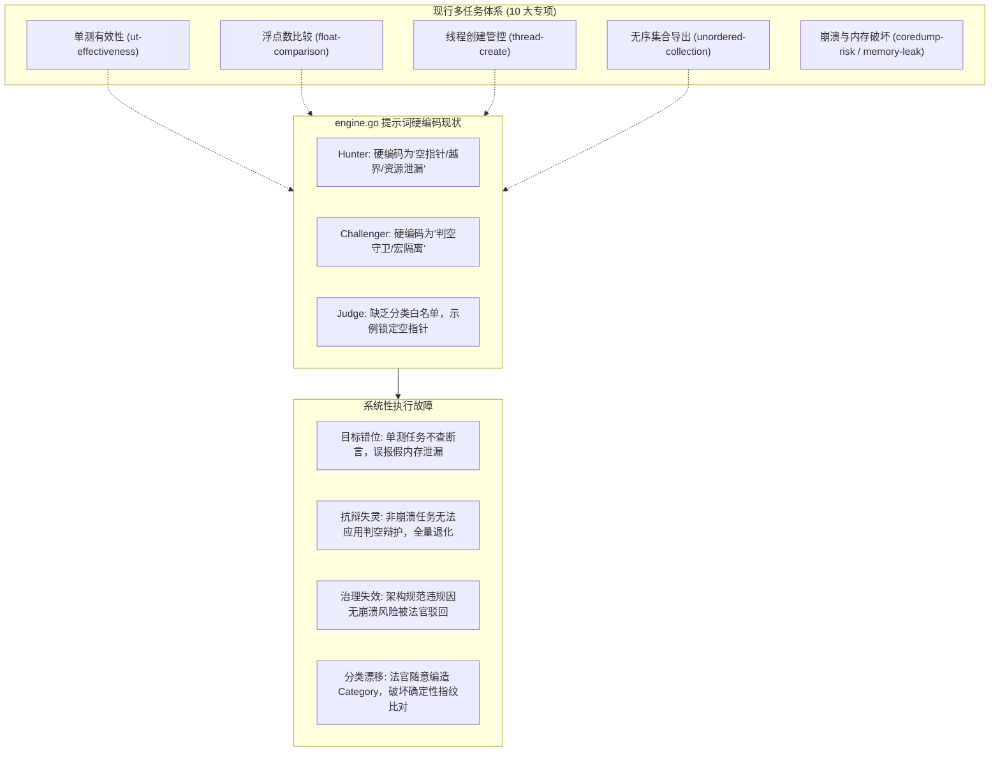
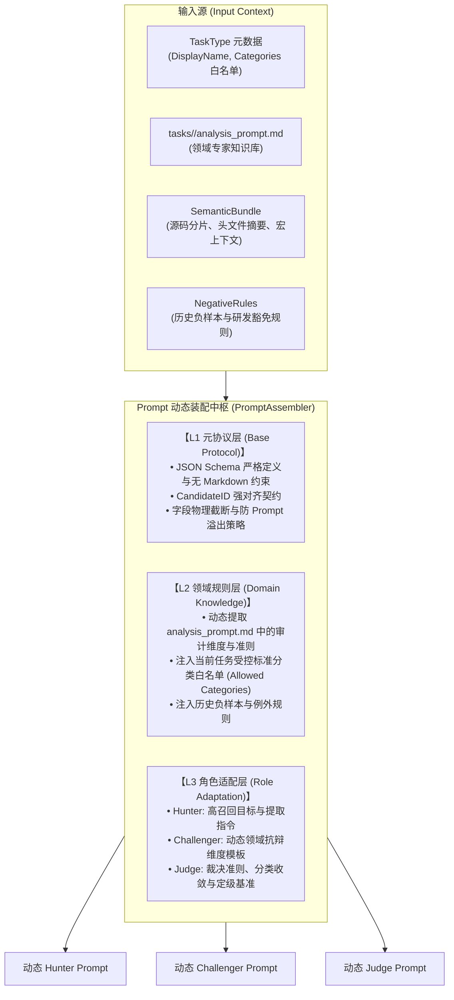
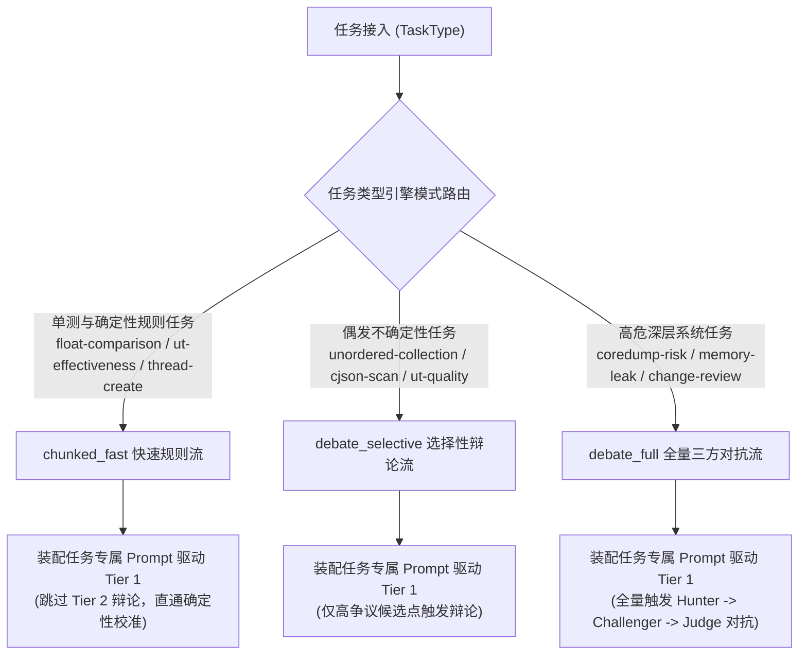
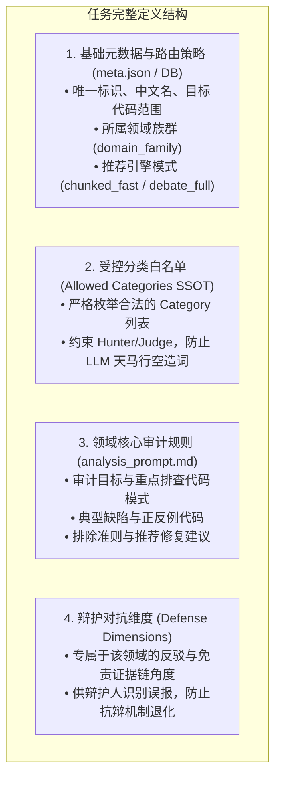
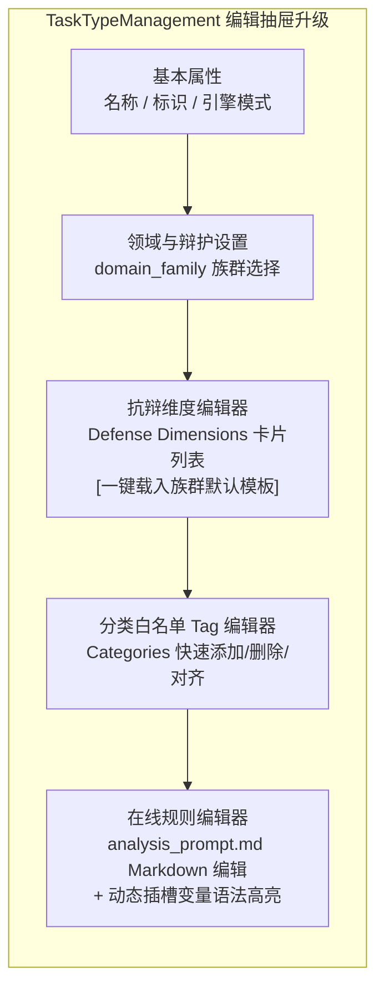

# Code-Shield 04：多任务自适应提示词体系与对抗辩论通用演进架构设计

## 一、 背景与系统级诊断

### 1.1 现状全景与问题提出
在 Code-Shield 的演进过程中，引入了基于“猎手 (Hunter) - 辩护人 (Challenger) - 仲裁官 (Judge)”三方制衡的下一代多 Agent 辩论引擎（`DebateEngine`，位于 `services/engines/debate/engine.go`）。

然而，当前 `engine.go` 中的提示词（Prompt）采用了源码硬编码的常量拼装方式：
- `buildHunterPrompt`：写死了静态文本（“审查潜在的运行期异常、崩溃风险及严重质量缺陷，如空指针解引用、缓冲区越界、资源泄漏、未初始化使用等”）。
- `buildChallengerPrompt`：写死了固定的三大抗辩维度（“1. Guards 前置判空守卫；2. MacroIsolation 宏隔离；3. Architecture 生命周期不可达”）。
- `buildJudgePrompt`：写死了基于空指针解引用的 Few-Shot 示例与硬编码分类。

这种设计在 Code-Shield 目前覆盖的 **10 种差异巨大的任务类型** 下，暴露出严重的系统性断层与认知错位。

### 1.2 核心系统级断层与危害诊断



1. **领域目标严重割裂（Domain Mismatch）**：
   - 在 `ut-effectiveness`（单测有效性）中，核心是分析测试用例是否空跑、断言是否永真、是否存在无效异常捕获。猎手拿着“空指针解引用”的指令去审查单测，完全找不到单测质量缺陷，反而把测试桩代码当成生产环境内存泄漏误报。
   - 在 `float-comparison` 中，核心是浮点数精度直接比较（`==`/`!=`）；在 `unordered-collection` 中，核心是哈希遍历顺序不确定性。这些致命业务稳定性缺陷根本不属于“内存崩溃”，被硬编码的猎手几乎 100% 漏报。
2. **规则资产被架空（Knowledge Isolation）**：
   - 平台在 `tasks/<task_type>/analysis_prompt.md` 中沉淀了数十 KB 的领域专家规则库、反例代码与识别准则（如 `ut-effectiveness` 的 9KB 用例粒度标准，`thread-create` 的平台调度组优先原则）。
   - 但 `DebateEngine` 在执行时完全未加载这些文件，导致现有高价值规则资产被彻底旁路。
3. **抗辩机制全面失灵（Defense Invalidation）**：
   - Challenger 的辩护维度被限定为“判空断言与宏隔离”。对于架构管控（`thread-create`）、单测（`ut-effectiveness`）、算法缺陷（`float-comparison`），辩护人完全找不到对应角度，只能胡言乱语或输出 `CHALLENGE_FAILED`，多 Agent 辩论对冲假阳性的价值荡然无存。
4. **受控标准分类白名单（Categories SSOT）失控**：
   - 系统在 `models.TaskType.Categories` 中定义了标准分类白名单，并在 `governance.SanitizeCategory` 中进行了收敛控制。
   - 但法官 Prompt 完全未注入该白名单，导致大模型在不同任务下天马行空地自造分类，破坏了确定性指纹、跨扫描增量比对与治理大盘的一致性。

---

## 二、 多任务类型与智能体协作映射模型

### 2.1 任务类型六大领域族群 (Domain Families)

根据代码审查的本质目标与对抗特征，将当前及未来扩展的任务类型归纳为 6 个核心领域族群：

| 领域族群 (`DomainFamily`) | 覆盖任务类型 | 核心审查特征 | 适用的辩护人抗辩维度 (Challenger Dimensions) | 终审法官裁决核心依据 |
| :--- | :--- | :--- | :--- | :--- |
| **1. 内存与崩溃安全族<br>(`memory_crash`)** | `coredump-risk`<br>`memory-leak`<br>`cjson-scan` | 指针合法性、生命周期对称、缓冲区边界、并发竞态、异常逃逸 | 1. `Guards`（前置判空/断言）<br>2. `MacroIsolation`（非默认宏隔离）<br>3. `AsyncSafe`（异步信号与异常安全） | 必须存在确定性崩溃路径或物理资源耗尽风险，且默认编译构建可达。 |
| **2. 架构规范与治理族<br>(`architecture_governance`)** | `thread-create` | 强制推行平台统一调度组与定时器，限制裸线程创建 | 1. `ScopeExemption`（离线测试/辅助脚本豁免）<br>2. `ThirdPartyLib`（三方库封装内部行为不可改）<br>3. `CustomWrapper`（已有自研 RAII 托管封装） | 严格依据企业架构规范裁决；即使代码运行无崩溃，违背架构强制规范依然裁定 `CONFIRMED`。 |
| **3. 数值与确定性族<br>(`numerical_determinism`)** | `float-comparison`<br>`unordered-collection` | 浮点 IEEE 754 舍入误差比较、无序 Map/Set 导出数组序列化与验签 | 1. `DiscreteDomain`（取值域为离散整型常量无舍入误差）<br>2. `OrderIndependent`（下游消费完全无序无关）<br>3. `UpstreamSorted`（上游已有显式排序保障） | 验证是否存在计算漂移、验签偶发失败或分布式排序错位风险。 |
| **4. 测试工程质量族<br>(`test_engineering`)** | `ut-effectiveness`<br>`ut-quality` | 测试用例粒度、断言有效性、过度 Mock 导致逻辑空跑、用例职责单一性 | 1. `HelperAssertion`（通过公共辅助断言方法间接验证）<br>2. `ExpectedException`（用例专门验证异常抛出契约）<br>3. `ContractStub`（集成用例故意使用哑桩测试通信链路） | 依据单测评审规范，区分真实业务覆盖与虚假空跑。 |
| **5. 应用安全与注入漏洞族<br>(`security_injection`)** | `sql-injection`<br>(扩展及租户自定义) | 外部不可控输入直通敏感沉淀槽（Sinks），如拼接构造 SQL、OS 命令注入 | 1. `ParameterizedBinding`（预编译参数化绑定）<br>2. `ConstantDomain`（常量/系统枚举）<br>3. `StrictWhitelist`（强白名单正则约束）<br>4. `OfflineExemption`（离线无外部网络入口） | 验证外部攻击者输入是否能突破过滤直达敏感沉淀槽执行恶意指令。 |
| **6. 综合演进分析族<br>(`comprehensive_evolution`)** | `change-review`<br>`deep-review` | 增量改动影响面、接口向前兼容性、综合可维护性与深度坏味道 | 1. `ContextMitigation`（变更周边已有完备防护网）<br>2. `IntentionalChange`（有意调整契约且上下游同步适配） | 综合代码质量、稳健性与可维护性评估。 |

### 2.2 领域族群扩展协议与 Fallback 机制

为了支持租户未来定义全新的业务场景（如 RPC 契约校验、AI 算子安全等），系统制定如下族群扩展与回退协议：

```go
// models/domain_family.go 枚举常量与映射注册
const (
	DomainFamilyMemoryCrash          = "memory_crash"
	DomainFamilyArchitectureGov      = "architecture_governance"
	DomainFamilyNumericalDeterminism = "numerical_determinism"
	DomainFamilyTestEngineering      = "test_engineering"
	DomainFamilySecurityInjection    = "security_injection"
	DomainFamilyComprehensive        = "comprehensive_evolution"
)
```

1. **族群注册与辩护维度关联**：新增领域族群时，必须在 `getDefenseDimensionsForFamily()` 中注册其默认辩护维度模板。
2. **优雅降级 (Fallback Policy)**：若任务传入未识别或未知的 `domain_family` 标识，系统自动回退至通用族群 `comprehensive_evolution`，并提供通用的防御性抗辩模板，确保流程永不中断。
3. **前端族群字典动态加载**：前端下拉菜单选项统一由后端提供 `/api/task-types/domain-families` 字典接口返回，禁止前端硬编码族群枚举列表。

### 2.3 系统认证标准抗辩事实维度全景字典 (Standard Defense Dimensions Catalog)

#### 2.3.1 核心设计哲学：为什么抗辩维度必须是有限且固定的客观事实？
在多智能体对抗辩论体系中，辩护人（Challenger）绝非主观狡辩的律师，其抗辩必须严格建立在**“客观存在的代码防御事实（Objective Fact Categories）”**之上。系统坚决**禁止用户在前端界面随意自由手打任意文本**，原因在于：
1. **防止大模型对抗幻觉**：若允许自由输入主观理由（如“临时写法”、“业务紧急”），辩护人将失去事实依据，产生空洞的辩解；
2. **法官（Judge）仲裁可解释性**：终审法官必须依据受控的事实法理，在源码上下文逐一交叉检验证据是否确凿；
3. **平台度量与误报归因一致性**：企业级质量看板需要统计“全仓误报到底被哪些具体维度成功拦截”（如统计 Guards 拦截率 45%、ScopeExemption 拦截率 30%）。散乱无序的任意字符串将导致数据无法汇聚。

#### 2.3.2 六大族群 24+ 项标准事实维度全景对照表

| 领域族群 (`DomainFamily`) | 标准维度 (`key`) | 中文名称 | 真实代码场景与法理举证示例 |
| :--- | :--- | :--- | :--- |
| **内存与底层崩溃**<br>(`memory_crash`) | `Guards` | 前置防御事实 | 初筛指控 `*ptr = 10` 会崩溃。辩护事实：前序第 35 行已存在 `if (ptr == nullptr) return;` 守卫，物理不可达。 |
| | `MacroIsolation` | 宏条件编译隔离 | 初筛指控某处代码不安全。辩护事实：代码包在 `#ifdef DEBUG_LOCAL` 宏内，默认生产 Release 构建镜像完全不可达。 |
| | `AsyncSafe` | 异步与RAII回收 | 初筛指控异常退出导致资源未释放。辩护事实：变量依托 C++ 栈变量析构函数（RAII），发生异常会自动析构回收。 |
| | `OwnershipTransfer` | 所有权转移托管 | 初筛指控 `malloc` 的对象在当前函数未 `free`。辩护事实：指针已被 `vec.push_back(ptr)` 移交给外部容器托管。 |
| | `ManualHook` | 统一分配器挂钩 | 初筛指控 `cJSON_Create` 泄漏。辩护事实：项目在系统启动时挂载了 `cJSON_Hooks`，在进程退出时由全局内存池批量释放。 |
| | `NullGuarded` | 阻断返回保护 | 初筛指控未处理解析失败。辩护事实：代码紧跟了 `if (!json) { LogError(); return NULL; }`，安全阻断级联崩溃。 |
| **架构规范治理**<br>(`architecture_governance`) | `ScopeExemption` | 非生产作用域豁免 | 初筛指控某处直接创建裸线程。辩护事实：该文件为单元测试桩代码 (`_test.go` 或 `test_main.cc`)，不进入生产环境。 |
| | `PoolManaged` | 统一池化生命周期 | 初筛指控并发泛滥。辩护事实：该类实际上继承自系统级 `WorkerPool`，底层受全局最大并发配额管控。 |
| | `ConfigControlled` | 动态配置开关管控 | 初筛指控线程频繁创建。辩护事实：该并发分支受配置中心动态开关控制，默认关闭，仅在紧急故障降级时启动。 |
| | `ThirdPartyLib` | 第三方库底层封装 | 初筛指控开源第三方库底层创建了线程。辩护事实：这是三方驱动内部线程，业务层无权也不应侵入改动。 |
| | `RAIILifetime` | RAII 资源自动释放 | 初筛指控线程未 `join` 导致崩溃。辩护事实：线程句柄封装在自定义 RAII Guard 中，析构函数里保证自动执行 `join`。 |
| **数值计算与确定性**<br>(`numerical_determinism`) | `DiscreteInteger` | 离散整型状态比较 | 初筛指控 `if (rate == 1.0)` 因精度舍入失效。辩护事实：变量取值仅为 0.0 与 1.0 的整型标志位（无小数除法），比较确定安全。 |
| | `EpsilonTolerance` | 显式近似容差保护 | 初筛指控浮点相等比较。辩护事实：外层已有公用方法 `math.isclose(a, b)` 或 `fabs(a - b) < 1e-6` 做容差判定。 |
| | `NonDeterministicTolerant` | 遍历无序不敏感 | 初筛指控遍历 Map 是无序的。辩护事实：下游逻辑仅为 `sum += val`（求和）或 `count++`（计数），集合元素满足交换律，顺序无关。 |
| | `SortedUpstream` | 上游显式强制排序 | 初筛指控从 Map 导出的列表引起报文不确定。辩护事实：导出后紧接着执行了 `sort.Strings(keys)` 强制排序。 |
| | `HardwareBound` | 硬件/平台加速契约 | 初筛指控精度不跨平台。辩护事实：该算法专用于特定 DSP 或 SIMD 指令集架构，底层硬件标准规范保证位级一致性。 |
| **测试工程质量**<br>(`test_engineering`) | `HelperAssertion` | 辅助校验函数封装 | 初筛指控用例无断言。辩护事实：断言逻辑封装在公共校验函数 `checkResponse(t, resp)` 中，并非空测试。 |
| | `ExpectedNoThrow` | 无异常即成功契约 | 初筛指控用例无显式断言。辩护事实：该用例旨在验证在极端脏数据下操作“不抛异常、安全兜底”，顺利走通即代表契约满足。 |
| | `StubContract` | 存根调用契约覆盖 | 初筛指控未校验返回值。辩护事实：Mock 框架中显式验证了 `mockObj.Verify(Method, Times.Once)`，调用交互本身构成校验。 |
| | `ParametrizedTest` | 参数化测试矩阵 | 初筛指控代码雷同（坏味道）。辩护事实：这是参数化用例展开，专门为了测试不同边界输入组合，结构相似但设计合理。 |
| **应用安全注入**<br>(`security_injection`) | `ParametrizedQuery` | 原生预编译参数化 | 初筛指控在拼接 SQL。辩护事实：底层使用 ORM 或 Prepared Statement 占位符 `db.Query(sql, arg1, arg2)`，天然免疫注入。 |
| | `WAFSanitized` | 前置网关校验过滤 | 初筛指控入参未过滤。辩护事实：外部流量进入当前 Controller 前，已通过企业统一 WAF 网关或框架正则强类型白名单。 |
| | `ConstantTrusted` | 内部可信常量源 | 初筛指控动态拼接表名。辩护事实：拼接的表名来自系统写死的 `enum` 枚举常量字典，根本不受外部用户输入控制。 |
| **综合演进深度**<br>(`comprehensive_evolution`) | `RegressionGuarded` | 回归防护充分 | 初筛指控某处变更存在隐性回归风险。辩护事实：本次 PR 伴随有完备的自动化集成测试套，且监控有灰度熔断机制。 |
| | `IntentionalContractChange` | 有意接口契约演进 | 初筛指控修改了入参破坏兼容性。辩护事实：这是版本有意废弃旧协议演进，且本次提交中所有下游模块已同步重构适配。 |
| | `ContextDefense` | 全局架构防御 | 初筛指控未加权限/边界校验。辩护事实：全局微服务网关和统一切面拦截器已在最外层兜底，单点无需过度防御。 |
| | `HistoricalLegacy` | 历史兼容协议约束 | 初筛指控代码写法老旧繁琐。辩护事实：这是为了兼容 10 年前的旧硬件设备报文协议，改动会导致通信失步，属合法工程权衡。 |

---

## 三、 三层自适应提示词装配架构设计 (Layered Architecture)

为了让 `DebateEngine` 既具备通用的辩论流约束，又能完美适配任意任务类型的特定规则，设计**三层提示词装配模型**：



### 3.1 L1: 元协议层 (Base Protocol Layer)
平台通用骨架，负责大模型调用的防御性控制与输出格式归一：
- **纯 JSON 强约束**：显式禁止包裹 ````json` Markdown 代码块，避免额外正则开销。
- **Candidate 跨阶段主键对齐**：强制维护 `candidate_id`（`H-001`, `H-002`...），确保辩护人与法官严格基于唯一标识对齐。
- **物理截断守卫**：对超长 `code_snippet`、`detail` 自动执行安全裁剪，避免超出上下文窗口。

### 3.2 L2: 领域规则层 (Domain Rules Layer)
从任务目录与数据库元数据中动态抽取业务知识：
- **专家规则动态挂载**：自动定位并读取 `tasks/<task-dir>/analysis_prompt.md`，提取其核心指令主体，抹平与 `SingleEngine` 的规则鸿沟。
- **标准分类白名单约束（Categories SSOT）**：将 `TaskType.GetAllowedCategories()` 显式注入 Prompt，限定输出的 `category` 字段必须属于白名单。
- **负样本例外规则注入**：继承当前分片的 `NegativeRules`，防止已知安全代码反复误报。

### 3.3 L3: 角色适配层 (Role Adaptation Layer)
针对三方智能体不同的立场，动态注入特化的任务指令：

#### 3.3.1 动态 Hunter 组装规范
```text
# Role
你是一个专精于【{{TaskType.DisplayName}}】的资深代码审计员。

## 审计目标与检测规范 (Domain Rules)
{{analysis_prompt.md 核心审计准则与检测范围}}

## 构建宏与代码上下文
{{MacroContext}}
{{HeaderOutline (仅当为 C/C++ 时注入)}}

## 历史负样本与例外规则 (Negative Rules)
{{NegativeRules}}

## 任务受控分类白名单 (Allowed Categories)
你的分类必须严格归类于以下标准范畴：
{{AllowedCategories}}

## 输出格式规范
{{JSON Schema 约束与契约}}
```

#### 3.3.2 动态 Challenger 组装规范
依据当前任务的 `DomainFamily` 动态生成辩护维度，彻底打破“只能辩护判空断言”的僵局：
```text
# Role
你是一个严谨的代码审查辩护专家 (Code Review Challenger)，专精于【{{TaskType.DisplayName}}】领域。
你的职责是反向质询猎手提出的可疑点，证明代码在此业务场景下已被合理防御、符合设计意图或属于误报。

## 猎手提出的候选缺陷清单
{{Candidates JSON}}

## 领域特化辩护维度 (Domain Defense Dimensions)
{{根据 DomainFamily 动态注入的辩护角度列表}}

## 输出格式规范
{{Challenger Defense JSON Schema}}
```

#### 3.3.3 动态 Judge 组装规范
注入裁决基准与标准分类强制映射：
```text
# Role
你是一个【{{TaskType.DisplayName}}】领域的资深代码缺陷终审仲裁专家 (Code Audit Arbitrator)。
你需要综合初筛指控与辩护抗辩事实，依据源码真实逻辑做出独立终审裁决。

## 控辩双方材料
### 猎手初筛清单: {{Hunter JSON}}
### 辩护人抗辩事实: {{Challenger JSON}}

## 终审裁决原则 (Verdict Principles)
1. 确信度标准: 必须有确凿代码证据支撑方可判定 CONFIRMED。
2. 架构合规优先: 若本任务属于架构规范治理（如禁止裸创建线程），即使无物理崩溃风险，违背规范亦应裁定 CONFIRMED。

## 强制分类白名单约束 (Strict Category Constraint)
你的输出 category 必须严格从以下受控列表中选取，严禁自造分类词汇：
{{AllowedCategories}}

## 输出格式规范
{{Judge Final Verdict JSON Schema}}
```

---

## 四、 核心数据结构扩展与实现演进

### 4.1 数据模型与 `EngineContext` 结构扩展

#### 1. `models.TaskType` 实体扩展（持久化源头）
`domain_family` 与 `defense_dimensions` 是 `TaskType` 的核心固有属性，必须作为持久化数据库字段进行管理：

```go
// models/models.go
type TaskType struct {
	// ... 现有字段 ...
	DomainFamily      string         `gorm:"size:50;default:'comprehensive_evolution'" json:"domain_family"` // 所属领域族群
	DefenseDimensions datatypes.JSON `gorm:"type:jsonb" json:"defense_dimensions"`                          // 专属自定义抗辩维度列表
}

// GetDomainFamily 获取有效的领域族群，缺省安全回退
func (t *TaskType) GetDomainFamily() string {
	if t.DomainFamily != "" {
		return t.DomainFamily
	}
	return DomainFamilyComprehensive
}

// GetDefenseDimensions 解析任务专有抗辩维度列表
func (t *TaskType) GetDefenseDimensions() []DefenseDimension {
	if len(t.DefenseDimensions) == 0 {
		return nil
	}
	var dims []DefenseDimension
	_ = json.Unmarshal(t.DefenseDimensions, &dims)
	return dims
}
```

#### 2. `engines.EngineContext` 上下文补齐
```go
package engines

type EngineContext struct {
	// ── 基础元数据 ──
	Ctx          context.Context
	ReportID     uint
	RepoID       uint
	RepoName     string
	TaskTypeID   uint
	TaskTypeName string // DisplayName，如 "单测有效性分析"
	
	// ── 新增：任务体系与领域感知扩展 ──
	TaskTypeKey        string             // 英文标识，如 "ut-effectiveness"
	TaskDir            string             // 任务文件目录，如 "tasks/ut-effectiveness"
	AnalysisPromptPath string             // 任务分析提示词文件绝对路径
	AllowedCategories  []string           // 受控标准分类白名单 (SSOT)
	DomainFamily       string             // 任务领域族群 (枚举常量)
	DefenseDimensions  []DefenseDimension // 任务级专有抗辩维度 (优先级高于族群默认)

	// ... 保持原有字段不变 ...
}
```

### 4.2 `runner` 装配层注入契约更新

在 `services/runner/runner.go` 构造 `engCtx` 时，直接从数据库加载的 `ctx.TaskType` 实体提取字段。
> [!NOTE]
> 辅助映射函数 `resolveDomainFamily(name)` 仅在服务初始化或种子导入（`seed`）时作为历史存量无值记录的回退兜底，**严禁在运行时热路径中使用硬编码映射**。

```go
// services/runner/runner.go
engCtx := &engines.EngineContext{
    Ctx:                ctx.Ctx,
    ReportID:           ctx.Report.ID,
    RepoID:             ctx.Repo.ID,
    RepoName:           ctx.Repo.Name,
    TaskTypeID:         ctx.TaskType.ID,
    TaskTypeName:       ctx.TaskType.DisplayName,
    TaskTypeKey:        ctx.TaskType.Name,
    TaskDir:            ctx.TaskType.TaskDir(),
    AnalysisPromptPath: models.AppConfig.GetAbsPath(ctx.TaskType.AnalysisPromptFile()),
    AllowedCategories:  ctx.TaskType.GetAllowedCategories(),
    DomainFamily:       ctx.TaskType.GetDomainFamily(),
    DefenseDimensions:  ctx.TaskType.GetDefenseDimensions(),
    // ...
}
```

### 4.3 提示词装配器实现 (`PromptAssembler`)

在 `services/engines/debate/` 下新增 `assembler.go`。该实现具备完善的**错误显式处理**、**路径穿越防御**、**文件物理截断防护**与**抗辩维度层级优先级策略**：

```go
package debate

import (
	"code-shield/models"
	"code-shield/services/engines"
	"code-shield/services/engines/chunker"
	"encoding/json"
	"fmt"
	"log"
	"os"
	"path/filepath"
	"strings"
)

// MaxPromptRuleBytes 领域提示词文件物理注入上限 (32KB)，防模型上下文溢出
const MaxPromptRuleBytes = 32 * 1024

type PromptAssembler struct{}

// loadTaskDomainPrompt 具备路径安全检查与防溢出截断的领域规则加载器
func (a *PromptAssembler) loadTaskDomainPrompt(promptPath string, allowedBaseDir string) string {
	if promptPath == "" {
		return ""
	}

	cleanPath := filepath.Clean(promptPath)
	if allowedBaseDir != "" {
		cleanBase := filepath.Clean(allowedBaseDir)
		if !strings.HasPrefix(cleanPath, cleanBase) {
			log.Printf("[PromptAssembler] Security Alert: prompt path %s escaped base dir %s", cleanPath, cleanBase)
			return ""
		}
	}

	bytes, err := os.ReadFile(cleanPath)
	if err != nil {
		log.Printf("[PromptAssembler] Warning: failed to read domain prompt %s: %v", cleanPath, err)
		return ""
	}

	if len(bytes) > MaxPromptRuleBytes {
		log.Printf("[PromptAssembler] Warning: prompt file %s exceeds %d bytes, truncating", cleanPath, MaxPromptRuleBytes)
		return string(bytes[:MaxPromptRuleBytes]) + "\n\n[... 规则文件过长，后续内容已被物理安全截断 ...]"
	}

	return string(bytes)
}

func (a *PromptAssembler) BuildHunterPrompt(ctx *engines.EngineContext, bundle chunker.SemanticBundle) string {
	var sb strings.Builder

	// 1. 角色定义
	sb.WriteString(fmt.Sprintf("# Role\n你是一个专精于【%s】的资深静态代码分析专家。\n\n", ctx.TaskTypeName))

	// 2. 注入领域规则 (优先从 tasks/<task>/analysis_prompt.md 读取)
	domainRules := a.loadTaskDomainPrompt(ctx.AnalysisPromptPath, models.AppConfig.GetAbsPath("tasks"))
	if domainRules != "" {
		sb.WriteString("## 审计聚焦领域与判定标准 (Domain Specifications)\n")
		sb.WriteString(domainRules)
		sb.WriteString("\n\n")
	} else {
		sb.WriteString(fmt.Sprintf("## 审计目标\n请全面检视当前代码分片中关于【%s】的缺陷与违规。\n\n", ctx.TaskTypeName))
	}

	// 3. 上下文构建
	if len(bundle.MacroContext) > 0 {
		sb.WriteString("## 构建宏环境定义 (Build Macros Context)\n")
		for k, v := range bundle.MacroContext {
			sb.WriteString(fmt.Sprintf("- `%s = %s`\n", k, v))
		}
		sb.WriteString("\n")
	}

	if bundle.HeaderOutline != "" && isCppContext(bundle) {
		sb.WriteString("## 核心头文件大纲声明 (Header Outline)\n```cpp\n")
		sb.WriteString(bundle.HeaderOutline)
		sb.WriteString("\n```\n\n")
	}

	if len(bundle.NegativeRules) > 0 {
		sb.WriteString("## 历史负样本与例外规则 (False Positive Rules)\n")
		for _, r := range bundle.NegativeRules {
			sb.WriteString(fmt.Sprintf("- %s\n", r))
		}
		sb.WriteString("\n")
	}

	// 4. 标准受控分类白名单 (SSOT 约束)
	if len(ctx.AllowedCategories) > 0 {
		sb.WriteString("## 候选缺陷受控分类白名单 (Allowed Categories)\n")
		sb.WriteString("请将发现的问题严格归类为以下类别之一：\n")
		for _, cat := range ctx.AllowedCategories {
			sb.WriteString(fmt.Sprintf("- `%s`\n", cat))
		}
		sb.WriteString("\n")
	}

	// 5. 待检文件与输出 Schema 契约
	sb.WriteString("## 待检视文件列表\n")
	for _, f := range bundle.AllFiles {
		sb.WriteString(fmt.Sprintf("- `%s`\n", f))
	}
	sb.WriteString("\n## 任务输出格式规范\n必须以合法纯 JSON 格式输出，严禁包含 Markdown 标记：\n")
	sb.WriteString(getHunterJSONSchema(ctx.AllowedCategories))

	return sb.String()
}

func (a *PromptAssembler) BuildChallengerPrompt(ctx *engines.EngineContext, bundle chunker.SemanticBundle, hunterOut *HunterOutput) (string, error) {
	var sb strings.Builder
	sb.WriteString(fmt.Sprintf("# Role\n你是一个严谨的代码审查辩护专家 (Code Review Challenger)，专精于【%s】领域。\n\n", ctx.TaskTypeName))
	
	// 辩护维度层级优先策略：任务专有自定义 > 领域族群默认模板
	sb.WriteString("## 辩护维度与考量准则 (Defense Dimensions)\n")
	if len(ctx.DefenseDimensions) > 0 {
		for i, d := range ctx.DefenseDimensions {
			sb.WriteString(fmt.Sprintf("%d. %s: %s\n", i+1, d.Dimension, d.Description))
		}
	} else {
		sb.WriteString(getDefenseDimensionsForFamily(ctx.DomainFamily))
	}
	sb.WriteString("\n\n")

	// 序列化猎手候选清单 (显式处理 error，杜绝 _ = err)
	candBytes, err := json.MarshalIndent(hunterOut.Candidates, "", "  ")
	if err != nil {
		return "", fmt.Errorf("failed to marshal hunter candidates for challenger prompt: %w", err)
	}

	sb.WriteString("## 猎手提出的候选缺陷清单\n```json\n")
	sb.Write(candBytes)
	sb.WriteString("\n```\n\n")

	sb.WriteString("## 输出格式规范\n必须以合法纯 JSON 格式输出：\n")
	sb.WriteString(getChallengerJSONSchema())

	return sb.String(), nil
}

func (a *PromptAssembler) BuildJudgePrompt(ctx *engines.EngineContext, bundle chunker.SemanticBundle, hunterOut *HunterOutput, challOut *ChallengerOutput) (string, error) {
	var sb strings.Builder
	sb.WriteString(fmt.Sprintf("# Role\n你是一个资深代码缺陷终审仲裁专家 (Code Audit Arbitrator)，负责【%s】任务。\n\n", ctx.TaskTypeName))

	// 注入分类白名单强约束
	if len(ctx.AllowedCategories) > 0 {
		sb.WriteString("## 强制分类白名单约束 (Strict Category Constraint)\n")
		sb.WriteString("裁决结论中的 `category` 字段必须严格取自以下受控分类集合：\n")
		for _, c := range ctx.AllowedCategories {
			sb.WriteString(fmt.Sprintf("- `%s`\n", c))
		}
		sb.WriteString("\n")
	}

	// 序列化双方论据 (显式处理 error)
	hBytes, err := json.MarshalIndent(hunterOut.Candidates, "", "  ")
	if err != nil {
		return "", fmt.Errorf("failed to marshal hunter candidates for judge prompt: %w", err)
	}
	cBytes, err := json.MarshalIndent(challOut.DefenseCases, "", "  ")
	if err != nil {
		return "", fmt.Errorf("failed to marshal challenger cases for judge prompt: %w", err)
	}

	sb.WriteString("## 控辩双方材料\n### 猎手初筛清单:\n```json\n")
	sb.Write(hBytes)
	sb.WriteString("\n```\n\n### 辩护人对抗意见:\n```json\n")
	sb.Write(cBytes)
	sb.WriteString("\n```\n\n")

	sb.WriteString("## 输出格式规范\n必须以合法纯 JSON 格式输出：\n")
	sb.WriteString(getJudgeJSONSchema(ctx.AllowedCategories))

	return sb.String(), nil
}
```


---

## 五、 自适应任务路由与引擎选型矩阵

正如《01-下一代AI扫描引擎与多Agent对抗辩论设计》第 3.2 节规划，不同任务类型因成本与复杂度差异，应自适应匹配执行模式：



### 5.1 引擎模式覆盖优先级 (Override Priority)
任务执行时的引擎模式遵循以下严格的层级覆盖顺序：
1. **最高优先级**：运行时动态参数 `RunParams.EngineMode`（API 触发或 CLI 手动指定）；
2. **中间优先级**：数据库实体 `TaskType.EngineMode`（由管理员在前端管理页面显式配置）；
3. **缺省兜底**：`tasks/<task>/meta.json` 中声明的默认推荐值。

### 5.2 `debate_selective` 选择性辩论触发判定规范
在 `debate_selective` 模式下，并非对所有初筛候选点都触发昂贵的 Tier 2 强推理辩论，而是通过轻量启发式规则进行精准分流：
- **触发条件 1（高争议分类）**：候选缺陷分类属于当前任务的 `HighControversyCategories`（如跨函数生命周期传递、动态反射调用、非平凡宏隔离等）；
- **触发条件 2（初筛低置信度）**：Tier 1 模型输出的初步可疑度判定介于边界范围（例如 `ConfidenceScore < 0.8` 或触发诱因不确定）；
- **免辩放行 (Fast Pass)**：对于语法级确定性特征（如直接使用 `== 0.0` 且无上下文干扰、无断言空测试），直接跳过 Tier 2 辩论，直通确定性严重度校准。

### 5.3 调度入口与注册表解耦
扫描引擎统一在 `services/runner/runner.go` 中通过 `engines.GetEngine(ctx.TaskType.EngineMode)` 进行无状态多态调度。所有引擎实例（`chunked_fast`, `debate_selective`, `debate_full`, `single`, `chunked`）在 `init()` 中统一向全局注册表注册，彼此完全正交解耦。

> **核心原则**：
> 无论是 `chunked_fast`、`debate_selective` 还是 `debate_full`，**初筛猎手、辩护人与法官均必须使用装配器动态生成的领域专属提示词**，严禁使用任何写死的单一场景文本。


---

## 六、 任务定义规范与完整实例（以 `sql-injection` 为例）

### 6.1 任务完整定义结构 (4 大信息模块)
在三层自适应体系下，新增一个任务类型（无论是系统内置还是租户自定义），仅需提供以下 4 部分声明式信息，平台框架自动完成 Agent 辩论流的编译与执行：



### 6.2 基础元数据与配置 (`tasks/sql-injection/meta.json`)
```json
{
  "name": "sql-injection",
  "display_name": "SQL 注入与未参数化查询检测",
  "description": "深度扫描代码中通过字符串拼接、格式化构造 SQL 语句导致 SQL 注入的高危缺陷",
  "target_scope": "business",
  "governance_mode": "defect_tracking",
  "engine_mode": "debate_full",
  "domain_family": "security_injection",

  "categories": [
    "SQL注入-字符串拼接",
    "SQL注入-格式化构造",
    "SQL注入-动态表名或字段注入",
    "SQL注入-MyBatis/ORM占位符误用",
    "安全风险-未参数化批量执行"
  ],

  "defense_dimensions": [
    {
      "dimension": "ParameterizedBinding",
      "description": "虽有拼接外观，但底层实际使用了预编译参数化绑定（如 Prepared Statement / GORM ? 占位符）"
    },
    {
      "dimension": "ConstantDomain",
      "description": "拼接的变量来源为编译期静态常量、系统内部枚举值或只读配置项，外部入参绝不可控"
    },
    {
      "dimension": "StrictWhitelist",
      "description": "动态表名或排序字段在拼接前经过了严格的白名单正则校验或映射字典过滤"
    },
    {
      "dimension": "OfflineExemption",
      "description": "该 SQL 仅在离线数据迁移脚本、自动化测试桩代码或受限运维工具中执行，无网络入参暴露面"
    }
  ]
}
```

### 6.3 领域核心审计规则 (`tasks/sql-injection/analysis_prompt.md`)
```markdown
# Role: 资深应用安全审计与数据库安全专家

## 1. 任务目标
你的任务是对当前代码分片进行深度安全审查，精准发掘可能导致 **SQL 注入（SQL Injection, CWE-89）** 的安全缺陷与不安全查询构造。

## 2. 重点排查模式 (Risk Patterns)
1. **字符串拼接执行 SQL**：
   - 使用 `+`、`fmt.Sprintf`、`String.format`、`%`、`f-string` 等将未经验证的外部参数拼接至 SQL 语句中。
2. **ORM 与框架占位符误用**：
   - MyBatis 中使用 `${param}`（直接拼接）而非 `#{param}`（参数化绑定）。
   - GORM 中直接拼接：如 `db.Where(fmt.Sprintf("name = '%s'", name))`。
3. **动态排序与表名/字段名注入**：
   - `ORDER BY`、`GROUP BY` 之后直接拼接变量，且未做白名单映射过滤。
4. **批量脚本与多语句拼接**：
   - 拼接输入并允许分号（`;`）多语句执行。

## 3. 判定与排除准则
- **静态常量排除**：完全由字面量或项目内部静态常量拼接的 SQL，不予报警。
- **正规参数化排除**：使用 `?`、`:param`、`$1` 并在执行时传递参数切片的，视为安全，严禁误报。
- **测试代码规范**：若文件属于单元测试桩，应适度放宽要求，仅标记为建议级。
```

### 6.4 运行时动态生成的三方 Agent Prompt 全景

#### 1. 动态 Hunter Prompt（高召回初筛）
```markdown
# Role
你是一个专精于【SQL 注入与未参数化查询检测】的资深静态代码安全审计员。

## 审计聚焦领域与判定标准 (Domain Specifications)
【系统自动注入 tasks/sql-injection/analysis_prompt.md 的完整领域规则】

## 候选缺陷受控分类白名单 (Allowed Categories)
请将发现的问题严格归类为以下标准类别之一，严禁自造分类词汇：
- `SQL注入-字符串拼接`
- `SQL注入-格式化构造`
- `SQL注入-动态表名或字段注入`
- `SQL注入-MyBatis/ORM占位符误用`
- `安全风险-未参数化批量执行`

## 待检视文件列表
- `services/user/dao.go`

## 任务输出格式规范
必须以合法纯 JSON 格式输出，不得包裹 Markdown 标记代码块：
{
  "candidates": [
    {
      "candidate_id": "H-001",
      "file_path": "services/user/dao.go",
      "line_range": "45-48",
      "trigger_line": "query := fmt.Sprintf(\"SELECT * FROM users WHERE name = '%s'\", userName)",
      "category": "SQL注入-字符串拼接",
      "title": "直接使用 fmt.Sprintf 拼接外部入参构造 SQL",
      "attack_hypothesis": "外部恶意入参可构造 `' OR '1'='1` 绕过认证或泄露全表数据"
    }
  ]
}
```

#### 2. 动态 Challenger Prompt（反向求证与辩护）
```markdown
# Role
你是一个严谨的代码审查辩护专家 (Code Review Challenger)，专精于【SQL 注入与未参数化查询检测】领域。
你的职责是反向质询猎手提出的可疑点，基于源码事实求证是否存在误报或已被安全防护。

## 辩护维度与考量准则 (Defense Dimensions)
请严格对照以下维度进行抗辩审查（若经核查确实存在无防护的 SQL 注入，则如实返回 CHALLENGE_FAILED）：
1. ParameterizedBinding：虽有拼接外观，但底层实际使用了预编译参数化绑定（如 Prepared Statement / GORM ? 占位符）。
2. ConstantDomain：拼接的变量来源为编译期静态常量、系统内部枚举值或只读配置项，外部入参绝不可控。
3. StrictWhitelist：动态表名或排序字段在拼接前经过了严格的白名单正则校验或映射字典过滤。
4. OfflineExemption：该 SQL 仅在离线数据迁移脚本、自动化测试桩代码或受限运维工具中执行，无网络入参暴露面。

## 猎手提出的候选缺陷清单
[
  {
    "candidate_id": "H-001",
    "trigger_line": "query := fmt.Sprintf(\"SELECT * FROM users WHERE name = '%s'\", userName)",
    "attack_hypothesis": "外部恶意入参可构造 ' OR '1'='1 绕过认证"
  }
]

## 输出格式规范
必须以合法纯 JSON 输出：
{
  "defense_cases": [
    {
      "candidate_id": "H-001",
      "defense_verdict": "DEFENSE_SUCCESSFUL",
      "defense_arguments": [
        {
          "dimension": "StrictWhitelist",
          "finding": "在第 42 行已通过 CheckValidUsername(userName) 严格限制只能输入英文字母数字，特殊字符无法传入"
        }
      ],
      "mitigating_factors": "上游强白名单校验防御"
    }
  ]
}
```

#### 3. 动态 Judge Prompt（终审仲裁与白名单收敛）
```markdown
# Role
你是一个资深代码缺陷终审仲裁专家 (Code Audit Arbitrator)，负责【SQL 注入与未参数化查询检测】任务。
你需要综合猎手初筛指控与辩护人抗辩事实，依据源码真实数据流与控制流独立研判，做出终审裁决。

## 强制分类白名单约束 (Strict Category Constraint)
裁决结论中的 `category` 字段**必须且仅能**从以下受控列表中选取：
- `SQL注入-字符串拼接`
- `SQL注入-格式化构造`
- `SQL注入-动态表名或字段注入`
- `SQL注入-MyBatis/ORM占位符误用`
- `安全风险-未参数化批量执行`

## 控辩双方材料
### 猎手初筛清单:
...
### 辩护人对抗意见:
...

## 终审裁决规范 (Verdict Options)
- CONFIRMED: SQL 注入确凿无误，外部不可控参数确实直通数据库执行。
- REJECTED: 确系误报，辩护人提出的白名单/预编译/常量约束成立，予以驳回。
- CONDITIONAL: 条件性风险（如内网接口且无白名单校验，但外部不可直接达）。
```

---

## 七、 前端任务类型管理界面改造设计 (Frontend Management Evolution)

### 7.1 现有 `TaskTypeManagement.tsx` 痛点诊断
目前前端的任务类型管理页面（`frontend/src/pages/TaskTypeManagement.tsx`）存在如下局限：
1. **缺失领域感知**：表单中没有 `domain_family`（领域族群）配置项，用户无法指定任务的所属范畴。
2. **缺失抗辩维度配置**：`defense_dimensions` 无法在前端查看或自定义，辩护人只能依赖默认行为。
3. **白名单配置弱化**：`categories`（标准分类白名单）隐藏在只读数据库中，前端无法便捷维护和增删。
4. **Prompt 编辑体验割裂**：右侧抽屉仅提供原始代码框，缺乏三层装配变量（如 `{{MacroContext}}`、`{{AllowedCategories}}`）的插槽提示说明。

### 7.2 表单结构与交互升级方案



#### 1. 全高侧边栏抽屉交互 (Modal -> Drawer)
- 将居中局促的弹窗全面升级为右侧滑出的现代化全高抽屉组件（`<Drawer width="min(760px, 92vw)">`），提供固定头部、平滑滚动表单主体与固定底部操作栏，极大提升大量复杂配置项的录入与浏览体验。

#### 2. 领域族群选择与联动 (`domain_family`)
- 在编辑抽屉中提供“所属领域族群”下拉菜单（支持 6 大族群）。
- **联动逻辑**：选择领域族群后，表单自动推荐对应的默认执行引擎（如单测推荐 `chunked_fast`，内存推荐 `debate_full`），并支持一键恢复该族群的推荐标准抗辩维度。

#### 3. 标准抗辩事实维度受控管理 (`defense_dimensions`)
- **坚决消除自由手敲**：彻底移除原来底部的 `[标识] [名称] [说明] [+ 添加]` 自由文本输入框，杜绝用户输入主观性、非技术性理由导致 LLM 辩护失真或产生对抗幻觉。
- **系统认证标准维度库受控引入**：
  - 展示当前任务已启用的标准抗辩维度卡片（包含中文名、英文标识、所属族群徽章及精准法理举证描述）；
  - 提供“**载入所属族群推荐维度**”快捷按钮；
  - 提供“**从系统标准法理库中引入维度**”受控下拉选择框，仅允许用户从系统注册的 24+ 项标准库中按需追加，保证抗辩事实的工程权威性与平台归因统计的一致性。

#### 4. 受控分类白名单标签输入组件 (`categories`)
- 采用 Tag 输入组件，支持回车批量添加分类。
- 支持与既有报告分类自动对齐核对，严格约束终审法官的输出分类。

#### 5. UI 规范与 Design Tokens 约束
- 严格遵循团队统一 UI 规范（见 `code-common/rules/GEMINI.md`）：
  - **单一真实源 (SSOT)**：所有色值必须使用 `var(--color-*)` 语义变量（如 `var(--color-bg-surface)`、`var(--color-text-primary)`、`var(--color-border-primary)`），严禁硬编码纯黑纯白或绝对颜色；
  - **扁平 BEM 命名**：使用 `.code-task-dimension-item`、`.code-tag-input`；
  - **深浅双模自适应**：严格保证 Light / Dark 模式下文字与背景对比度达标。

---

## 八、 现有 10 大任务类型同步更新与迁移基线 (Migration Baseline)

为保证平滑演进与历史向后兼容，现存 10 大任务类型全部制定清晰的领域族群映射与专属抗辩维度矩阵：

| 任务类型 (`name`) | 中文名称 | 所属领域族群 (`domain_family`) | 推荐引擎模式 (`engine_mode`) | 专属抗辩维度矩阵 (`defense_dimensions`) | 核心受控分类白名单 (`categories`) 摘要 |
| :--- | :--- | :--- | :--- | :--- | :--- |
| **`coredump-risk`** | Coredump 崩溃风险 | `memory_crash` | `debate_full` | 1. `Guards`: 前置判空/非零校验<br>2. `MacroIsolation`: 非默认宏隔离不可达<br>3. `AsyncSafe`: 信号安全与异常安全保证 | 空指针解引用、缓冲区溢出、数组越界、除零错误、未初始化使用、数据竞争 |
| **`memory-leak`** | 内存泄漏检测 | `memory_crash` | `debate_full` | 1. `OwnershipTransfer`: 所有权转移至外部容器/智能指针<br>2. `RAIICleanup`: 依赖类析构函数释放<br>3. `ProcessLifecycle`: 进程即刻退出工具无实质泄露危害 | 堆内存未释放、双重释放、释放后使用、文件句柄泄漏、智能指针循环引用 |
| **`cjson-scan`** | cJSON API 专项扫描 | `memory_crash` | `debate_selective` | 1. `AdoptedByItem`: 子节点已被 `AddItemToObject` 托管所有权无需重复 Delete<br>2. `NullGuarded`: 校验返回值为 NULL | cJSON-Delete漏释放、cJSON-子节点悬挂、cJSON-未判空直接访问 |
| **`thread-create`** | 新建线程分析 | `architecture_governance` | `chunked_fast` | 1. `ScopeExemption`: 属于单测桩或排障工具无线上影响<br>2. `ThirdPartyLib`: 三方库内部封装<br>3. `RAIILifetime`: 已通过自研 RAII 包装类 join | 必要性-未使用平台调度组、必要性-未使用平台定时器、生命周期-join遗漏、异常安全-析构崩溃 |
| **`float-comparison`** | 浮点数比较潜在缺陷 | `numerical_determinism` | `chunked_fast` | 1. `DiscreteInteger`: 取值为离散整型字面量重置校验<br>2. `EpsilonChecked`: 外层已封装近似判定<br>3. `EnumState`: 仅作业务枚举状态标记 | 浮点数-直接等值比较、浮点数-直接不等比较、浮点数-循环边界失效 |
| **`unordered-collection`** | 无序集合导出缺陷 | `numerical_determinism` | `debate_selective` | 1. `OrderIndependent`: 纯统计消费/无序敏感<br>2. `SortedUpstream`: 导出后立即调用 `sort.Slice` 排序<br>3. `DeterministicKey`: Map Key 散列值天然具有单调性 | 无序集合-哈希签名顺序依赖、无序集合-单测断言不确定、无序集合-序列化比较 |
| **`ut-effectiveness`** | 单测有效性分析 | `test_engineering` | `chunked_fast` | 1. `HelperAssertion`: 断言在公共基类或 helper 函数中实现<br>2. `ExpectedNoThrow`: 用例专门验证无异常抛出<br>3. `StubContract`: 故意使用 dummy stub 验证调用链路 | 断言有效性-空测试、断言有效性-永真断言、断言有效性-无效捕获、提前返回-非法退出 |
| **`ut-quality`** | 单测质量与架构异味 | `test_engineering` | `debate_selective` | 1. `ContractIntegration`: 端到端场景测试允许复合断言<br>2. `ParametrizedTest`: 表格驱动测试设计 | 功能单一性-面条测试、功能单一性-路径混合、测试覆盖-逻辑空跑 |
| **`change-review`** | 近期变更检视 | `comprehensive_evolution` | `debate_full` | 1. `RegressionGuarded`: 变更周边配套了完善回归单测<br>2. `IntentionalContractChange`: 业务契约主动升级 | 变更正确性-逻辑漏洞、变更正确性-边界防御、接口兼容性-破坏性变更 |
| **`deep-review`** | 深度代码检视 | `comprehensive_evolution` | `debate_full` | 1. `ContextDefense`: 系统架构全局防护网<br>2. `HistoricalLegacy`: 存量稳定老代码无实际故障 | 架构设计-高耦合、安全规范-未授权暴露、代码健壮性-防御性缺失 |

### 8.1 存量数据平滑迁移策略
1. **`meta.json` 补充升级**：在服务端 `tasks/<task>/meta.json` 中统一注入对应的 `domain_family` 与 `defense_dimensions` 字段。
2. **种子迁移“仅填空不覆盖”策略 (Fill-If-Empty)**：
   - 在 `cmd/seed_reconciliation` 启动同步逻辑中，**仅当数据库记录中 `domain_family` 为空或为缺省值时**，才从 `meta.json` 读取推荐值填入；
   - 若数据库中已有用户在管理前端自定义修改的 `defense_dimensions` 或 `domain_family`，种子脚本绝对不执行盲目覆盖，确保用户资产安全；
3. **向下向后完全兼容**：
   - 服务端旧接口或旧脚本若未传递 `domain_family`，模型自动回退调用 `GetDomainFamily()`，返回 `comprehensive_evolution`；
   - 未配置 `defense_dimensions` 的老任务自动继承领域族群默认模板，整个系统具备极佳的弹性和平滑升级能力。

---

## 九、 质量、观测性与工程保障机制 (Quality & Operations)

### 9.1 Prompt Token 预算精细化分配机制 (Token Budget Allocation)
为防止规则文件（如 `ut-effectiveness` 达 9KB+）挤占代码上下文或超出模型上下文窗口，平台建立三层 Token 预算安全约束：

```text
单次 LLM 请求总 Prompt 预算 ≤ 模型最大 Context Window × 50%（预留 50% 给输入代码与输出结果）

├── L1 元协议层：   ~500 tokens（JSON Schema、格式守卫、全局规则）
├── L2 领域规则层： 最多 2000 tokens
│   ├── analysis_prompt.md 内容：上限 1500 tokens (超出自动触发物理截断)
│   └── AllowedCategories + 负样本：上限 500 tokens
└── L3 角色适配层： 最多 1000 tokens
    ├── 角色定义与任务目标：~300 tokens
    └── 抗辩维度 (Challenger) / 裁决基准 (Judge)：~700 tokens
```

### 9.2 可观测性与 Debug 提示词追溯 (Observability & Debugging)
在多智能体对抗过程中，当出现漏报或争议误报时，必须具备完整的提示词回溯能力：
1. **装配指标遥测**：`PromptAssembler` 实时记录每次组装生成的 Prompt 字符数与估算 Token 数，打印结构化调试日志；
2. **调试环境 Prompt 落盘**：当系统处于 DEBUG 模式（或任务报告配置了 `debug_dump: true`）时，`callAITier` 会将最终下发给大模型的完整 Prompt 纯文本归档至 `report-chunks/debug-prompt-{hunter|challenger|judge}.txt`，便于技术专家复盘追溯。

### 9.3 自动化测试与 Golden Test 防漂移保护 (Testing Strategy)
为了防止后续业务迭代中意外破坏提示词体系的稳定性，规划以下三层单元测试与回归矩阵：
1. **族群 Prompt 黄金用例快照测试 (Golden Tests)**：
   为 6 大 `DomainFamily` 构建标准的输入桩数据，将生成的 Hunter / Challenger / Judge Prompt 与测试金样（Golden Snapshot）比对，任何非预期的结构漂移均会在 CI 阶段被拦截；
2. **安全边界极限测试 (Security Boundary Tests)**：
   测试 `loadTaskDomainPrompt` 对 `../` 路径穿越攻击的拦截率；测试超大文件（>32KB）的截断标记注入与边界稳定性；
3. **抗辩维度优先级覆盖测试 (Priority Tests)**：
   编写自动化单测验证“任务级自定义维度”在有值时 100% 覆盖“族群默认模板”，无值时平滑回退。

---

## 十、 实施与演进里程碑 (Milestones)

1. **里程碑 M1（上下文与元数据打通）**：
   - 扩充 `EngineContext` 结构体，打通 `TaskTypeKey`、`AnalysisPromptPath` 与 `AllowedCategories` 的传递链条。
2. **里程碑 M2（装配器解耦与动态构建落地）**：
   - 新建 `services/engines/debate/assembler.go`，剥离 `engine.go` 中的静态硬编码字符串。
   - 严格落实错误显式处理、路径穿越安全防御与双源优先级覆盖。
   - 实现 6 大领域族群辩护维度生成器与 JSON Schema 注入器。
3. **里程碑 M3（存量 10 大任务类型同步更新与种子迁移）**：
   - 补齐所有 10 大任务类型的 `meta.json`，注入 `domain_family` 与专属 `defense_dimensions`。
   - 升级 `seed` 逻辑为“仅填空不覆盖”，验证 `ut-effectiveness`（单测）与 `thread-create`（架构管控）的实测表现。
4. **里程碑 M4（前端管理与多租户自定义就绪）**：
   - 改造 `TaskTypeManagement.tsx`，支持领域族群、抗辩维度卡片及标准分类白名单的可视化配置。
   - 联动 RFC-003，实现租户自由创建新任务并无缝享受多 Agent 对抗辩论能力。
5. **里程碑 M5（终审法官独立与 4 阶梯算力调度落地）**：
   - 将原有 3 阶梯升级为 4 阶梯体系（Tier 1 Hunter 初筛、Tier 2 Challenger 辩护对抗、Tier 3 Judge 终审裁决、Tier 4 Synthesis 全仓汇总）。
   - 终审法官独立分配算力与超时流控，与辩护人解耦异构调度；实现双向平滑兼容与前端配置中心全景渲染。

---

## 十一、 4 阶梯算力调度体系与终审法官 (Judge) 独立演进

### 11.1 架构动机与角色解耦 (Architecture Rationale)
在早期 3 阶梯设计中，Hunter 初筛为 Tier 1，报告合成为 Tier 3，而 Challenger（辩护人）与 Judge（终审法官）共用 `tier2_reasoning`。然而在生产实践中，两个角色的职能与算力诉求存在本质分水岭：
1. **Challenger（辩护人）**：
   - **职能特征**：发散性与广度检索。基于初筛案卷在标准防御字典中尽可能寻找 mitigations。
   - **算力诉求**：追求**极高吞吐量与极低延迟**，推荐使用原生轻量 LLM（Thin 节点，如 10+ 并发），在极短耗时内完成批量辩护。
2. **Judge（终审法官）**：
   - **职能特征**：收敛性与权威判定。必须兼听 Hunter 控告与 Challenger 辩护事实，基于真实源码做不可逆的最终定性裁决。
   - **算力诉求**：追求**最高阶的深度逻辑推理与严谨性**，需挂载旗舰主力大模型（如高阶推理模型或旗舰 Thick Agent），并允许更充裕的思考推理时间（如 1800 秒）。

将法官独立为 **Tier 3**，全仓报告汇总顺延为 **Tier 4**，构成了完全符合法理与逻辑解耦的 **4 阶梯智能体调度体系**。

### 11.2 4 阶梯角色与职责全景矩阵

| 阶梯层级 | 逻辑 Tier 标识 | 核心角色 | 引擎形态要求 | 推荐算力驱动 | 核心职责与调度策略 |
| :--- | :--- | :--- | :--- | :--- | :--- |
| **Tier 1** | `tier1_hunter` | Hunter 初筛猎手 | **必须 Thick Agent** | `agy` / `opencode` | 遍历文件树与跨文件调用链，自主阅读磁盘源码并生成初筛案卷。多节点负载打散池化。 |
| **Tier 2** | `tier2_challenger` | Challenger 辩护对抗 | **推荐 Thin LLM** | `native` (备选 `agy`) | 案卷代码已全量内联，检索 24+ 项标准事实库开展反向抗辩质询，追求高吞吐与毫秒级低延迟。 |
| **Tier 3** | `tier3_judge` | Judge 终审法官 | **强烈推荐 旗舰推理** | 旗舰模型 (`native` / `agy`) | 独立权威仲裁，兼听双方主张，严格以代码物理事实做最终定性，拥有独立的算力超时与资源保障。 |
| **Tier 4** | `tier4_synthesis` | Synthesis 全仓汇总 | **推荐 Thin LLM** | `native` | 全仓确诊缺陷聚合、态势评分归因与 Markdown/JSON 诊断报告直传直出，消除 CLI 进程冷启动开销。 |

### 11.3 双向平滑兼容机制 (Bidirectional Backward Compatibility)
为了确保平滑升级，系统设计了严格的向下向后兼容双向兜底逻辑：
1. **模型层自动 Fallback**：
   - 若系统配置中未指定 `tier2_challenger` 或 `tier3_judge`，`GetTierConfig()` 与 `GetTierResources()` 自动平滑回退至存量 `tier2_reasoning` 配置；
   - 若未指定 `tier4_synthesis`，自动平滑回退至存量 `tier3_synthesis` 配置。
2. **反向兼容补齐**：
   - 若配置了新版 4 阶梯配置，`SyncLegacy()` 自动将 `tier2_challenger` 回填至 `tier2_reasoning`，保证未升级的老模块或老接口调用不受任何影响。
3. **前端控制台全模态适配**：
   - 前端配置中心（`ConfigCenter.tsx`）采用 4 列响应式网格与语义 Token 徽章体系，同时在保存数据时自动附带双向兼容字段，确保新老版本后端无缝衔接。


