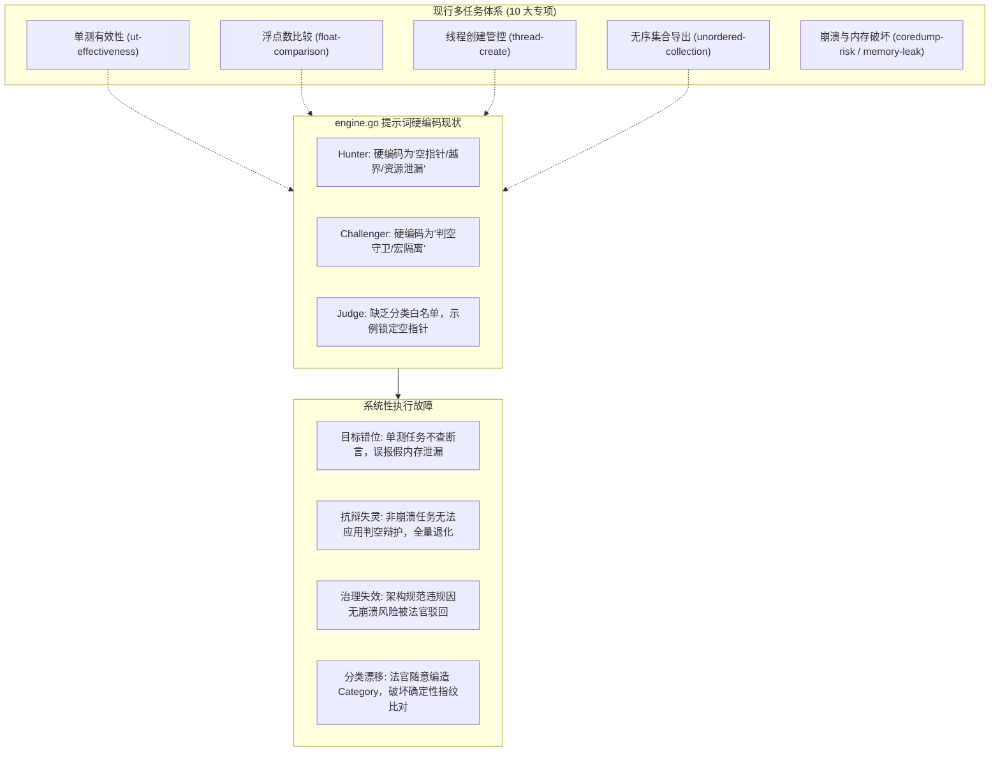
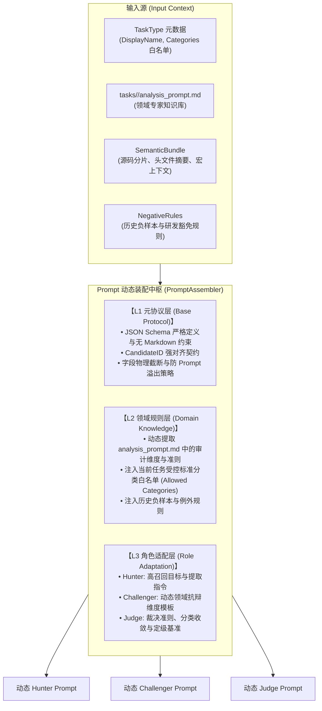
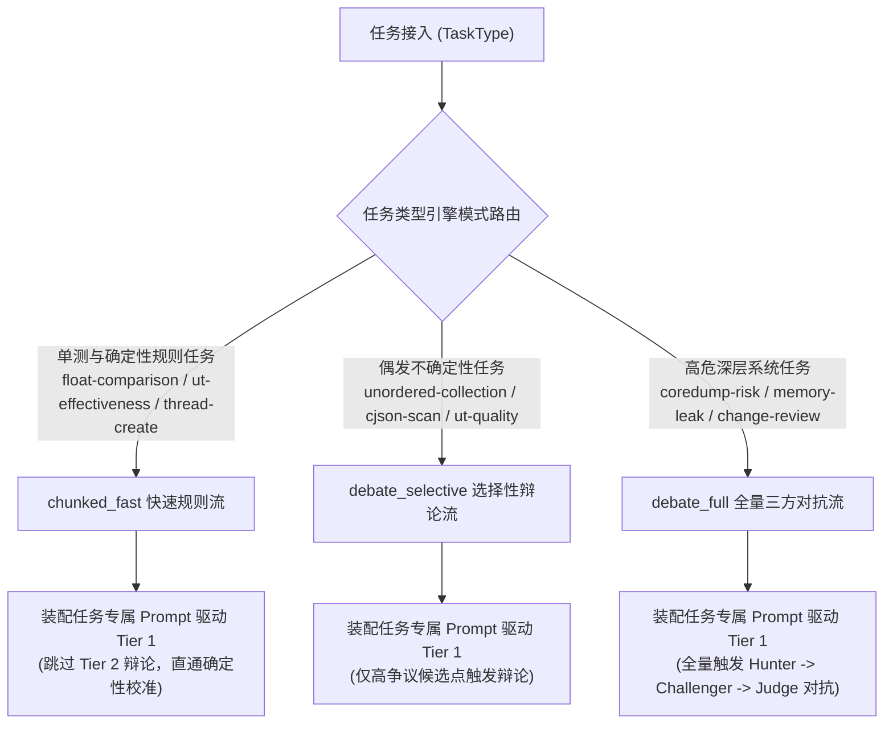
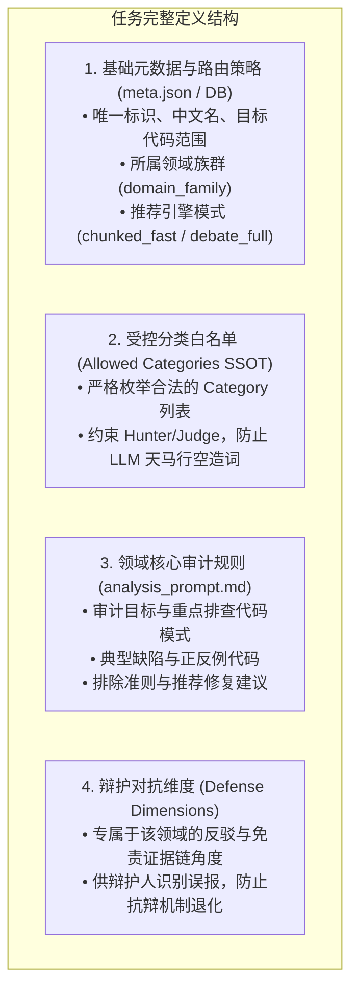
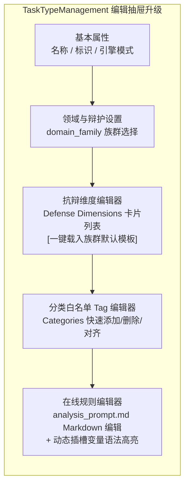

# Code-Shield 04：多任务自适应提示词体系与对抗辩论通用演进架构设计

## 一、 背景与系统级诊断

### 1.1 现状全景与问题提出
在 Code-Shield 的演进过程中，引入了基于“猎手 (Hunter) - 辩护人 (Challenger) - 仲裁官 (Judge)”三方制衡的下一代多 Agent 辩论引擎（`DebateEngine`，位于 `services/engines/debate/engine.go`）。

然而，当前 `engine.go` 中的提示词（Prompt）采用了源码硬编码的常量拼装方式：
- `buildHunterPrompt`：写死了静态文本（“审查潜在的运行期异常、崩溃风险及严重质量缺陷，如空指针解引用、缓冲区越界、资源泄漏、未初始化使用等”）。
- `buildChallengerPrompt`：写死了固定的三大抗辩维度（“1. Guards 前置判空守卫；2. MacroIsolation 宏隔离；3. Architecture 生命周期不可达”）。
- `buildJudgePrompt`：写死了基于空指针解引用的 Few-Shot 示例与硬编码分类。

这种设计在 Code-Shield 目前覆盖的 **10 种差异巨大的任务类型** 下，暴露出严重的系统性断层与认知错位。

### 1.2 核心系统级断层与危害诊断



1. **领域目标严重割裂（Domain Mismatch）**：
   - 在 `ut-effectiveness`（单测有效性）中，核心是分析测试用例是否空跑、断言是否永真、是否存在无效异常捕获。猎手拿着“空指针解引用”的指令去审查单测，完全找不到单测质量缺陷，反而把测试桩代码当成生产环境内存泄漏误报。
   - 在 `float-comparison` 中，核心是浮点数精度直接比较（`==`/`!=`）；在 `unordered-collection` 中，核心是哈希遍历顺序不确定性。这些致命业务稳定性缺陷根本不属于“内存崩溃”，被硬编码的猎手几乎 100% 漏报。
2. **规则资产被架空（Knowledge Isolation）**：
   - 平台在 `tasks/<task_type>/analysis_prompt.md` 中沉淀了数十 KB 的领域专家规则库、反例代码与识别准则（如 `ut-effectiveness` 的 9KB 用例粒度标准，`thread-create` 的平台调度组优先原则）。
   - 但 `DebateEngine` 在执行时完全未加载这些文件，导致现有高价值规则资产被彻底旁路。
3. **抗辩机制全面失灵（Defense Invalidation）**：
   - Challenger 的辩护维度被限定为“判空断言与宏隔离”。对于架构管控（`thread-create`）、单测（`ut-effectiveness`）、算法缺陷（`float-comparison`），辩护人完全找不到对应角度，只能胡言乱语或输出 `CHALLENGE_FAILED`，多 Agent 辩论对冲假阳性的价值荡然无存。
4. **受控标准分类白名单（Categories SSOT）失控**：
   - 系统在 `models.TaskType.Categories` 中定义了标准分类白名单，并在 `governance.SanitizeCategory` 中进行了收敛控制。
   - 但法官 Prompt 完全未注入该白名单，导致大模型在不同任务下天马行空地自造分类，破坏了确定性指纹、跨扫描增量比对与治理大盘的一致性。

---

## 二、 多任务类型与智能体协作映射模型

### 2.1 任务类型五大领域族群 (Domain Families)

根据代码审查的本质目标与对抗特征，将 10 大任务类型归纳为 5 个领域族群：

| 领域族群 (`DomainFamily`) | 覆盖任务类型 | 核心审查特征 | 适用的辩护人抗辩维度 (Challenger Dimensions) | 终审法官裁决核心依据 |
| :--- | :--- | :--- | :--- | :--- |
| **1. 内存与崩溃安全族<br>(Memory & Crash)** | `coredump-risk`<br>`memory-leak`<br>`cjson-scan` | 指针合法性、生命周期对称、缓冲区边界、并发竞态、异常逃逸 | 1. Guards（前置判空/断言）<br>2. MacroIsolation（非默认宏开关隔离）<br>3. Architecture（所有权转移与生命周期保证） | 必须存在确定性崩溃路径或物理资源耗尽风险，且默认编译构建可达。 |
| **2. 架构规范与治理族<br>(Architecture Governance)** | `thread-create` | 强制推行平台统一调度组与定时器，限制裸线程创建 | 1. ScopeExemption（离线测试/辅助脚本豁免）<br>2. ThirdPartyLib（三方库封装内部行为不可改）<br>3. CustomWrapper（已有自研 RAII 托管封装） | 严格依据企业架构规范裁决；即使代码运行无崩溃，违背架构强制规范依然裁定 `CONFIRMED`。 |
| **3. 数值与确定性族<br>(Numerical & Determinism)** | `float-comparison`<br>`unordered-collection` | 浮点 IEEE 754 舍入误差比较、无序 Map/Set 导出数组序列化与验签 | 1. DiscreteDomain（取值域为离散整型常量无舍入误差）<br>2. OrderIndependent（下游消费完全无序无关，如纯统计计数）<br>3. UpstreamSorted（上游已有显式排序保障） | 验证是否存在计算漂移、验签偶发失败或分布式排序错位风险。 |
| **4. 测试工程质量族<br>(Test Engineering)** | `ut-effectiveness`<br>`ut-quality` | 测试用例粒度、断言有效性、过度 Mock 导致逻辑空跑、用例职责单一性 | 1. HelperAssertion（通过公共辅助断言方法间接验证）<br>2. ExpectedException（用例专门验证异常抛出契约）<br>3. ContractStub（集成用例故意使用哑桩测试通信链路） | 依据单测评审规范，区分真实业务覆盖与虚假空跑。 |
| **5. 综合演进分析族<br>(Comprehensive Evolution)** | `change-review`<br>`deep-review` | 增量改动影响面、接口向前兼容性、综合可维护性与深度坏味道 | 1. ContextMitigation（变更周边已有完备防护网）<br>2. IntentionalChange（有意调整契约且上下游同步适配） | 综合代码质量、稳健性与可维护性评估。 |

---

## 三、 三层自适应提示词装配架构设计 (Layered Architecture)

为了让 `DebateEngine` 既具备通用的辩论流约束，又能完美适配任意任务类型的特定规则，设计**三层提示词装配模型**：



### 3.1 L1: 元协议层 (Base Protocol Layer)
平台通用骨架，负责大模型调用的防御性控制与输出格式归一：
- **纯 JSON 强约束**：显式禁止包裹 ````json` Markdown 代码块，避免额外正则开销。
- **Candidate 跨阶段主键对齐**：强制维护 `candidate_id`（`H-001`, `H-002`...），确保辩护人与法官严格基于唯一标识对齐。
- **物理截断守卫**：对超长 `code_snippet`、`detail` 自动执行安全裁剪，避免超出上下文窗口。

### 3.2 L2: 领域规则层 (Domain Rules Layer)
从任务目录与数据库元数据中动态抽取业务知识：
- **专家规则动态挂载**：自动定位并读取 `tasks/<task-dir>/analysis_prompt.md`，提取其核心指令主体，抹平与 `SingleEngine` 的规则鸿沟。
- **标准分类白名单约束（Categories SSOT）**：将 `TaskType.GetAllowedCategories()` 显式注入 Prompt，限定输出的 `category` 字段必须属于白名单。
- **负样本例外规则注入**：继承当前分片的 `NegativeRules`，防止已知安全代码反复误报。

### 3.3 L3: 角色适配层 (Role Adaptation Layer)
针对三方智能体不同的立场，动态注入特化的任务指令：

#### 3.3.1 动态 Hunter 组装规范
```text
# Role
你是一个专精于【{{TaskType.DisplayName}}】的资深代码审计员。

## 审计目标与检测规范 (Domain Rules)
{{analysis_prompt.md 核心审计准则与检测范围}}

## 构建宏与代码上下文
{{MacroContext}}
{{HeaderOutline (仅当为 C/C++ 时注入)}}

## 历史负样本与例外规则 (Negative Rules)
{{NegativeRules}}

## 任务受控分类白名单 (Allowed Categories)
你的分类必须严格归类于以下标准范畴：
{{AllowedCategories}}

## 输出格式规范
{{JSON Schema 约束与契约}}
```

#### 3.3.2 动态 Challenger 组装规范
依据当前任务的 `DomainFamily` 动态生成辩护维度，彻底打破“只能辩护判空断言”的僵局：
```text
# Role
你是一个严谨的代码审查辩护专家 (Code Review Challenger)，专精于【{{TaskType.DisplayName}}】领域。
你的职责是反向质询猎手提出的可疑点，证明代码在此业务场景下已被合理防御、符合设计意图或属于误报。

## 猎手提出的候选缺陷清单
{{Candidates JSON}}

## 领域特化辩护维度 (Domain Defense Dimensions)
{{根据 DomainFamily 动态注入的辩护角度列表}}

## 输出格式规范
{{Challenger Defense JSON Schema}}
```

#### 3.3.3 动态 Judge 组装规范
注入裁决基准与标准分类强制映射：
```text
# Role
你是一个【{{TaskType.DisplayName}}】领域的资深代码缺陷终审仲裁专家 (Code Audit Arbitrator)。
你需要综合初筛指控与辩护抗辩事实，依据源码真实逻辑做出独立终审裁决。

## 控辩双方材料
### 猎手初筛清单: {{Hunter JSON}}
### 辩护人抗辩事实: {{Challenger JSON}}

## 终审裁决原则 (Verdict Principles)
1. 确信度标准: 必须有确凿代码证据支撑方可判定 CONFIRMED。
2. 架构合规优先: 若本任务属于架构规范治理（如禁止裸创建线程），即使无物理崩溃风险，违背规范亦应裁定 CONFIRMED。

## 强制分类白名单约束 (Strict Category Constraint)
你的输出 category 必须严格从以下受控列表中选取，严禁自造分类词汇：
{{AllowedCategories}}

## 输出格式规范
{{Judge Final Verdict JSON Schema}}
```

---

## 四、 核心数据结构扩展与实现演进

### 4.1 `EngineContext` 上下文补齐

当前 `services/engines/engine.go` 中的 `EngineContext` 缺乏关键的任务元数据，需扩充如下字段：

```go
package engines

import (
	"code-shield/models"
	// ...
)

type EngineContext struct {
	// ── 基础元数据 ──
	Ctx          context.Context
	ReportID     uint
	RepoID       uint
	RepoName     string
	TaskTypeID   uint
	TaskTypeName string // DisplayName，如 "单测有效性分析"
	
	// ── 新增：任务体系与领域感知扩展 ──
	TaskTypeKey       string   // 英文标识，如 "ut-effectiveness"
	TaskDir           string   // 任务文件目录，如 "tasks/ut-effectiveness"
	AnalysisPromptPath string  // 任务分析提示词文件绝对路径
	AllowedCategories []string // 受控标准分类白名单 (SSOT)
	DomainFamily      string   // 任务领域族群: memory, architecture, numerical, test, evolution

	// ... 保持原有字段不变 ...
}
```

### 4.2 `runner` 装配层注入契约更新

在 `services/runner/runner.go` 构造 `engCtx` 时，完成动态字段组装：

```go
// services/runner/runner.go
engCtx := &engines.EngineContext{
    Ctx:                ctx.Ctx,
    ReportID:           ctx.Report.ID,
    RepoID:             ctx.Repo.ID,
    RepoName:           ctx.Repo.Name,
    TaskTypeID:         ctx.TaskType.ID,
    TaskTypeName:       ctx.TaskType.DisplayName,
    TaskTypeKey:        ctx.TaskType.Name,
    TaskDir:            ctx.TaskType.TaskDir(),
    AnalysisPromptPath: models.AppConfig.GetAbsPath(ctx.TaskType.AnalysisPromptFile()),
    AllowedCategories:  ctx.TaskType.GetAllowedCategories(),
    DomainFamily:       resolveDomainFamily(ctx.TaskType.Name),
    // ...
}
```

### 4.3 提示词装配器实现 (`PromptAssembler`)

在 `services/engines/debate/` 下新增 `assembler.go`：

```go
package debate

import (
	"code-shield/services/engines"
	"code-shield/services/engines/chunker"
	"fmt"
	"os"
	"strings"
)

type PromptAssembler struct{}

func (a *PromptAssembler) BuildHunterPrompt(ctx *engines.EngineContext, bundle chunker.SemanticBundle) string {
	var sb strings.Builder

	// 1. 角色定义
	sb.WriteString(fmt.Sprintf("# Role\n你是一个专精于【%s】的资深静态代码分析专家。\n\n", ctx.TaskTypeName))

	// 2. 注入领域规则 (优先从 tasks/<task>/analysis_prompt.md 读取)
	domainRules := a.loadTaskDomainPrompt(ctx.AnalysisPromptPath)
	if domainRules != "" {
		sb.WriteString("## 审计聚焦领域与判定标准 (Domain Specifications)\n")
		sb.WriteString(domainRules)
		sb.WriteString("\n\n")
	} else {
		// 降级兜底
		sb.WriteString(fmt.Sprintf("## 审计目标\n请全面检视当前代码分片中关于【%s】的缺陷与违规。\n\n", ctx.TaskTypeName))
	}

	// 3. 上下文构建
	if len(bundle.MacroContext) > 0 {
		sb.WriteString("## 构建宏环境定义 (Build Macros Context)\n")
		for k, v := range bundle.MacroContext {
			sb.WriteString(fmt.Sprintf("- `%s = %s`\n", k, v))
		}
		sb.WriteString("\n")
	}

	if bundle.HeaderOutline != "" && isCppContext(bundle) {
		sb.WriteString("## 核心头文件大纲声明 (Header Outline)\n```cpp\n")
		sb.WriteString(bundle.HeaderOutline)
		sb.WriteString("\n```\n\n")
	}

	if len(bundle.NegativeRules) > 0 {
		sb.WriteString("## 历史负样本与例外规则 (False Positive Rules)\n")
		for _, r := range bundle.NegativeRules {
			sb.WriteString(fmt.Sprintf("- %s\n", r))
		}
		sb.WriteString("\n")
	}

	// 4. 标准受控分类白名单
	if len(ctx.AllowedCategories) > 0 {
		sb.WriteString("## 候选缺陷受控分类白名单 (Allowed Categories)\n")
		sb.WriteString("请将发现的问题严格归类为以下类别之一：\n")
		for _, cat := range ctx.AllowedCategories {
			sb.WriteString(fmt.Sprintf("- `%s`\n", cat))
		}
		sb.WriteString("\n")
	}

	// 5. 待检文件与输出 Schema 契约
	sb.WriteString("## 待检视文件列表\n")
	for _, f := range bundle.AllFiles {
		sb.WriteString(fmt.Sprintf("- `%s`\n", f))
	}
	sb.WriteString("\n## 任务输出格式规范\n必须以合法纯 JSON 格式输出，严禁包含 Markdown 标记：\n")
	sb.WriteString(getHunterJSONSchema(ctx.AllowedCategories))

	return sb.String()
}

func (a *PromptAssembler) BuildChallengerPrompt(ctx *engines.EngineContext, bundle chunker.SemanticBundle, hunterOut *HunterOutput) string {
	var sb strings.Builder
	sb.WriteString(fmt.Sprintf("# Role\n你是一个严谨的代码审查辩护专家 (Code Review Challenger)，专精于【%s】领域。\n\n", ctx.TaskTypeName))
	
	// 注入动态抗辩维度
	sb.WriteString("## 辩护维度与考量准则 (Defense Dimensions)\n")
	sb.WriteString(getDefenseDimensionsForFamily(ctx.DomainFamily))
	sb.WriteString("\n\n")

	// 注入猎手候选清单
	sb.WriteString("## 猎手提出的候选缺陷清单\n```json\n")
	candBytes, _ := json.MarshalIndent(hunterOut.Candidates, "", "  ")
	sb.Write(candBytes)
	sb.WriteString("\n```\n\n")

	sb.WriteString("## 输出格式规范\n必须以合法纯 JSON 格式输出：\n")
	sb.WriteString(getChallengerJSONSchema())

	return sb.String()
}

func (a *PromptAssembler) BuildJudgePrompt(ctx *engines.EngineContext, bundle chunker.SemanticBundle, hunterOut *HunterOutput, challOut *ChallengerOutput) string {
	var sb strings.Builder
	sb.WriteString(fmt.Sprintf("# Role\n你是一个资深代码缺陷终审仲裁专家 (Code Audit Arbitrator)，负责【%s】任务。\n\n", ctx.TaskTypeName))

	// 注入分类白名单强约束
	if len(ctx.AllowedCategories) > 0 {
		sb.WriteString("## 强制分类白名单约束 (Strict Category Constraint)\n")
		sb.WriteString("裁决结论中的 `category` 字段必须严格取自以下受控分类集合：\n")
		for _, c := range ctx.AllowedCategories {
			sb.WriteString(fmt.Sprintf("- `%s`\n", c))
		}
		sb.WriteString("\n")
	}

	sb.WriteString("## 控辩双方材料\n### 猎手初筛清单:\n```json\n")
	hBytes, _ := json.MarshalIndent(hunterOut.Candidates, "", "  ")
	sb.Write(hBytes)
	sb.WriteString("\n```\n\n### 辩护人对抗意见:\n```json\n")
	cBytes, _ := json.MarshalIndent(challOut.DefenseCases, "", "  ")
	sb.Write(cBytes)
	sb.WriteString("\n```\n\n")

	sb.WriteString("## 输出格式规范\n必须以合法纯 JSON 格式输出：\n")
	sb.WriteString(getJudgeJSONSchema(ctx.AllowedCategories))

	return sb.String()
}
```

---

## 五、 自适应任务路由与引擎选型矩阵

正如《01-下一代AI扫描引擎与多Agent对抗辩论设计》第 3.2 节规划，不同任务类型因成本与复杂度差异，应自适应匹配执行模式：



> **核心原则**：
> 无论是 `chunked_fast`、`debate_selective` 还是 `debate_full`，**初筛猎手、辩护人与法官均必须使用装配器动态生成的领域专属提示词**，严禁使用任何写死的单一场景文本。

---

---

## 六、 任务定义规范与完整实例（以 `sql-injection` 为例）

### 6.1 任务完整定义结构 (4 大信息模块)
在三层自适应体系下，新增一个任务类型（无论是系统内置还是租户自定义），仅需提供以下 4 部分声明式信息，平台框架自动完成 Agent 辩论流的编译与执行：



### 6.2 基础元数据与配置 (`tasks/sql-injection/meta.json`)
```json
{
  "name": "sql-injection",
  "display_name": "SQL 注入与未参数化查询检测",
  "description": "深度扫描代码中通过字符串拼接、格式化构造 SQL 语句导致 SQL 注入的高危缺陷",
  "target_scope": "business",
  "governance_mode": "defect_tracking",
  "engine_mode": "debate_full",
  "domain_family": "security_injection",

  "categories": [
    "SQL注入-字符串拼接",
    "SQL注入-格式化构造",
    "SQL注入-动态表名或字段注入",
    "SQL注入-MyBatis/ORM占位符误用",
    "安全风险-未参数化批量执行"
  ],

  "defense_dimensions": [
    {
      "dimension": "ParameterizedBinding",
      "description": "虽有拼接外观，但底层实际使用了预编译参数化绑定（如 Prepared Statement / GORM ? 占位符）"
    },
    {
      "dimension": "ConstantDomain",
      "description": "拼接的变量来源为编译期静态常量、系统内部枚举值或只读配置项，外部入参绝不可控"
    },
    {
      "dimension": "StrictWhitelist",
      "description": "动态表名或排序字段在拼接前经过了严格的白名单正则校验或映射字典过滤"
    },
    {
      "dimension": "OfflineExemption",
      "description": "该 SQL 仅在离线数据迁移脚本、自动化测试桩代码或受限运维工具中执行，无网络入参暴露面"
    }
  ]
}
```

### 6.3 领域核心审计规则 (`tasks/sql-injection/analysis_prompt.md`)
```markdown
# Role: 资深应用安全审计与数据库安全专家

## 1. 任务目标
你的任务是对当前代码分片进行深度安全审查，精准发掘可能导致 **SQL 注入（SQL Injection, CWE-89）** 的安全缺陷与不安全查询构造。

## 2. 重点排查模式 (Risk Patterns)
1. **字符串拼接执行 SQL**：
   - 使用 `+`、`fmt.Sprintf`、`String.format`、`%`、`f-string` 等将未经验证的外部参数拼接至 SQL 语句中。
2. **ORM 与框架占位符误用**：
   - MyBatis 中使用 `${param}`（直接拼接）而非 `#{param}`（参数化绑定）。
   - GORM 中直接拼接：如 `db.Where(fmt.Sprintf("name = '%s'", name))`。
3. **动态排序与表名/字段名注入**：
   - `ORDER BY`、`GROUP BY` 之后直接拼接变量，且未做白名单映射过滤。
4. **批量脚本与多语句拼接**：
   - 拼接输入并允许分号（`;`）多语句执行。

## 3. 判定与排除准则
- **静态常量排除**：完全由字面量或项目内部静态常量拼接的 SQL，不予报警。
- **正规参数化排除**：使用 `?`、`:param`、`$1` 并在执行时传递参数切片的，视为安全，严禁误报。
- **测试代码规范**：若文件属于单元测试桩，应适度放宽要求，仅标记为建议级。
```

### 6.4 运行时动态生成的三方 Agent Prompt 全景

#### 1. 动态 Hunter Prompt（高召回初筛）
```markdown
# Role
你是一个专精于【SQL 注入与未参数化查询检测】的资深静态代码安全审计员。

## 审计聚焦领域与判定标准 (Domain Specifications)
【系统自动注入 tasks/sql-injection/analysis_prompt.md 的完整领域规则】

## 候选缺陷受控分类白名单 (Allowed Categories)
请将发现的问题严格归类为以下标准类别之一，严禁自造分类词汇：
- `SQL注入-字符串拼接`
- `SQL注入-格式化构造`
- `SQL注入-动态表名或字段注入`
- `SQL注入-MyBatis/ORM占位符误用`
- `安全风险-未参数化批量执行`

## 待检视文件列表
- `services/user/dao.go`

## 任务输出格式规范
必须以合法纯 JSON 格式输出，不得包裹 Markdown 标记代码块：
{
  "candidates": [
    {
      "candidate_id": "H-001",
      "file_path": "services/user/dao.go",
      "line_range": "45-48",
      "trigger_line": "query := fmt.Sprintf(\"SELECT * FROM users WHERE name = '%s'\", userName)",
      "category": "SQL注入-字符串拼接",
      "title": "直接使用 fmt.Sprintf 拼接外部入参构造 SQL",
      "attack_hypothesis": "外部恶意入参可构造 `' OR '1'='1` 绕过认证或泄露全表数据"
    }
  ]
}
```

#### 2. 动态 Challenger Prompt（反向求证与辩护）
```markdown
# Role
你是一个严谨的代码审查辩护专家 (Code Review Challenger)，专精于【SQL 注入与未参数化查询检测】领域。
你的职责是反向质询猎手提出的可疑点，基于源码事实求证是否存在误报或已被安全防护。

## 辩护维度与考量准则 (Defense Dimensions)
请严格对照以下维度进行抗辩审查（若经核查确实存在无防护的 SQL 注入，则如实返回 CHALLENGE_FAILED）：
1. ParameterizedBinding：虽有拼接外观，但底层实际使用了预编译参数化绑定（如 Prepared Statement / GORM ? 占位符）。
2. ConstantDomain：拼接的变量来源为编译期静态常量、系统内部枚举值或只读配置项，外部入参绝不可控。
3. StrictWhitelist：动态表名或排序字段在拼接前经过了严格的白名单正则校验或映射字典过滤。
4. OfflineExemption：该 SQL 仅在离线数据迁移脚本、自动化测试桩代码或受限运维工具中执行，无网络入参暴露面。

## 猎手提出的候选缺陷清单
[
  {
    "candidate_id": "H-001",
    "trigger_line": "query := fmt.Sprintf(\"SELECT * FROM users WHERE name = '%s'\", userName)",
    "attack_hypothesis": "外部恶意入参可构造 ' OR '1'='1 绕过认证"
  }
]

## 输出格式规范
必须以合法纯 JSON 输出：
{
  "defense_cases": [
    {
      "candidate_id": "H-001",
      "defense_verdict": "DEFENSE_SUCCESSFUL",
      "defense_arguments": [
        {
          "dimension": "StrictWhitelist",
          "finding": "在第 42 行已通过 CheckValidUsername(userName) 严格限制只能输入英文字母数字，特殊字符无法传入"
        }
      ],
      "mitigating_factors": "上游强白名单校验防御"
    }
  ]
}
```

#### 3. 动态 Judge Prompt（终审仲裁与白名单收敛）
```markdown
# Role
你是一个资深代码缺陷终审仲裁专家 (Code Audit Arbitrator)，负责【SQL 注入与未参数化查询检测】任务。
你需要综合猎手初筛指控与辩护人抗辩事实，依据源码真实数据流与控制流独立研判，做出终审裁决。

## 强制分类白名单约束 (Strict Category Constraint)
裁决结论中的 `category` 字段**必须且仅能**从以下受控列表中选取：
- `SQL注入-字符串拼接`
- `SQL注入-格式化构造`
- `SQL注入-动态表名或字段注入`
- `SQL注入-MyBatis/ORM占位符误用`
- `安全风险-未参数化批量执行`

## 控辩双方材料
### 猎手初筛清单:
...
### 辩护人对抗意见:
...

## 终审裁决规范 (Verdict Options)
- CONFIRMED: SQL 注入确凿无误，外部不可控参数确实直通数据库执行。
- REJECTED: 确系误报，辩护人提出的白名单/预编译/常量约束成立，予以驳回。
- CONDITIONAL: 条件性风险（如内网接口且无白名单校验，但外部不可直接达）。
```

---

## 七、 前端任务类型管理界面改造设计 (Frontend Management Evolution)

### 7.1 现有 `TaskTypeManagement.tsx` 痛点诊断
目前前端的任务类型管理页面（`frontend/src/pages/TaskTypeManagement.tsx`）存在如下局限：
1. **缺失领域感知**：表单中没有 `domain_family`（领域族群）配置项，用户无法指定任务的所属范畴。
2. **缺失抗辩维度配置**：`defense_dimensions` 无法在前端查看或自定义，辩护人只能依赖默认行为。
3. **白名单配置弱化**：`categories`（标准分类白名单）隐藏在只读数据库中，前端无法便捷维护和增删。
4. **Prompt 编辑体验割裂**：右侧抽屉仅提供原始代码框，缺乏三层装配变量（如 `{{MacroContext}}`、`{{AllowedCategories}}`）的插槽提示说明。

### 7.2 表单结构与交互升级方案



#### 1. 领域族群选择与联动 (`domain_family`)
- 在编辑表单中增加“所属领域族群”下拉菜单：
  - `memory_crash`（内存与崩溃安全）
  - `architecture_governance`（架构规范与管控）
  - `numerical_determinism`（数值与确定性）
  - `test_engineering`（单测与测试工程）
  - `security_injection`（应用安全与注入漏洞）
  - `comprehensive_evolution`（综合演进与检视）
- **联动逻辑**：选择领域族群后，表单自动推荐对应的默认执行引擎（如单测推荐 `chunked_fast`，内存推荐 `debate_full`），并提示一键导入该族群的标准辩护维度模板。

#### 2. 抗辩维度可视化卡片编辑器 (`defense_dimensions`)
- 支持动态增删辩护维度，每个维度包含 `dimension`（英文短标识，如 `ConstantDomain`）和 `description`（中文说明）。
- 提供“**从族群载入推荐模板**”快捷按钮，避免用户从零编写抗辩理由。

#### 3. 受控分类白名单标签输入组件 (`categories`)
- 采用 Tag 输入组件，支持回车批量添加分类。
- 支持与既有报告分类自动对齐核对，给出非法分类预警。

#### 4. UI 规范与 Design Tokens 约束
- 严格遵循团队统一 UI 规范（见 `code-common/rules/GEMINI.md`）：
  - **单一真实源 (SSOT)**：所有色值必须使用 `var(--color-*)` 语义变量（如 `var(--color-bg-surface)`、`var(--color-text-primary)`、`var(--color-border-primary)`），严禁硬编码纯黑纯白或绝对颜色；
  - **扁平 BEM 命名**：使用 `.code-task-dimension-item`、`.code-tag-input`；
  - **深浅双模自适应**：严格保证 Light / Dark 模式下文字与背景对比度达标。

---

## 八、 现有 10 大任务类型同步更新与迁移基线 (Migration Baseline)

为保证平滑演进与历史向后兼容，现存 10 大任务类型全部制定清晰的领域族群映射与专属抗辩维度矩阵：

| 任务类型 (`name`) | 中文名称 | 所属领域族群 (`domain_family`) | 推荐引擎模式 (`engine_mode`) | 专属抗辩维度矩阵 (`defense_dimensions`) | 核心受控分类白名单 (`categories`) 摘要 |
| :--- | :--- | :--- | :--- | :--- | :--- |
| **`coredump-risk`** | Coredump 崩溃风险 | `memory_crash` | `debate_full` | 1. `Guards`: 前置判空/非零校验<br>2. `MacroIsolation`: 非默认宏隔离不可达<br>3. `AsyncSafe`: 信号安全与异常安全保证 | 空指针解引用、缓冲区溢出、数组越界、除零错误、未初始化使用、数据竞争 |
| **`memory-leak`** | 内存泄漏检测 | `memory_crash` | `debate_full` | 1. `OwnershipTransfer`: 所有权转移至外部容器/智能指针<br>2. `RAIICleanup`: 依赖类析构函数释放<br>3. `ProcessLifecycle`: 进程即刻退出工具无实质泄露危害 | 堆内存未释放、双重释放、释放后使用、文件句柄泄漏、智能指针循环引用 |
| **`cjson-scan`** | cJSON API 专项扫描 | `memory_crash` | `debate_selective` | 1. `AdoptedByItem`: 子节点已被 `AddItemToObject` 托管所有权无需重复 Delete<br>2. `NullGuarded`: 校验返回值为 NULL | cJSON-Delete漏释放、cJSON-子节点悬挂、cJSON-未判空直接访问 |
| **`thread-create`** | 新建线程分析 | `architecture_governance` | `chunked_fast` | 1. `ScopeExemption`: 属于单测桩或排障工具无线上影响<br>2. `ThirdPartyLib`: 三方库内部封装<br>3. `RAIILifetime`: 已通过自研 RAII 包装类 join | 必要性-未使用平台调度组、必要性-未使用平台定时器、生命周期-join遗漏、异常安全-析构崩溃 |
| **`float-comparison`** | 浮点数比较潜在缺陷 | `numerical_determinism` | `chunked_fast` | 1. `DiscreteInteger`: 取值为离散整型字面量重置校验<br>2. `EpsilonChecked`: 外层已封装近似判定<br>3. `EnumState`: 仅作业务枚举状态标记 | 浮点数-直接等值比较、浮点数-直接不等比较、浮点数-循环边界失效 |
| **`unordered-collection`** | 无序集合导出缺陷 | `numerical_determinism` | `debate_selective` | 1. `OrderIndependent`: 纯统计消费/无序敏感<br>2. `SortedUpstream`: 导出后立即调用 `sort.Slice` 排序<br>3. `DeterministicKey`: Map Key 散列值天然具有单调性 | 无序集合-哈希签名顺序依赖、无序集合-单测断言不确定、无序集合-序列化比较 |
| **`ut-effectiveness`** | 单测有效性分析 | `test_engineering` | `chunked_fast` | 1. `HelperAssertion`: 断言在公共基类或 helper 函数中实现<br>2. `ExpectedNoThrow`: 用例专门验证无异常抛出<br>3. `StubContract`: 故意使用 dummy stub 验证调用链路 | 断言有效性-空测试、断言有效性-永真断言、断言有效性-无效捕获、提前返回-非法退出 |
| **`ut-quality`** | 单测质量与架构异味 | `test_engineering` | `debate_selective` | 1. `ContractIntegration`: 端到端场景测试允许复合断言<br>2. `ParametrizedTest`: 表格驱动测试设计 | 功能单一性-面条测试、功能单一性-路径混合、测试覆盖-逻辑空跑 |
| **`change-review`** | 近期变更检视 | `comprehensive_evolution` | `debate_full` | 1. `RegressionGuarded`: 变更周边配套了完善回归单测<br>2. `IntentionalContractChange`: 业务契约主动升级 | 变更正确性-逻辑漏洞、变更正确性-边界防御、接口兼容性-破坏性变更 |
| **`deep-review`** | 深度代码检视 | `comprehensive_evolution` | `debate_full` | 1. `ContextDefense`: 系统架构全局防护网<br>2. `HistoricalLegacy`: 存量稳定老代码无实际故障 | 架构设计-高耦合、安全规范-未授权暴露、代码健壮性-防御性缺失 |

### 8.1 存量数据平滑迁移策略
1. **`meta.json` 补充升级**：在服务端 `tasks/<task>/meta.json` 中统一注入对应的 `domain_family` 与 `defense_dimensions` 字段。
2. **数据库种子同步 (Seed Migration)**：扩展 `cmd/seed_reconciliation` 启动同步逻辑，检测到 `TaskType` 记录中 `domain_family` 为空时，基于英文 `name` 自动填充推荐值，确保旧环境平滑向后兼容。

---

## 九、 实施与演进里程碑 (Milestones)

1. **里程碑 M1（上下文与元数据打通）**：
   - 扩充 `EngineContext` 结构体，打通 `TaskTypeKey`、`AnalysisPromptPath` 与 `AllowedCategories` 的传递链条。
2. **里程碑 M2（装配器解耦与动态构建落地）**：
   - 新建 `services/engines/debate/assembler.go`，剥离 `engine.go` 中的静态硬编码字符串。
   - 实现 5 大领域族群辩护维度生成器与 JSON Schema 注入器。
3. **里程碑 M3（存量 10 大任务类型同步更新）**：
   - 补齐所有 10 大任务类型的 `meta.json`，注入 `domain_family` 与专属 `defense_dimensions`。
   - 验证 `ut-effectiveness`（单测）与 `thread-create`（架构管控）在全新提示词体系下的实测表现。
4. **里程碑 M4（前端管理与多租户自定义就绪）**：
   - 改造 `TaskTypeManagement.tsx`，支持领域族群、抗辩维度卡片及标准分类白名单的可视化配置。
   - 联动 RFC-003，实现租户自由创建新任务并无缝享受多 Agent 对抗辩论能力。
