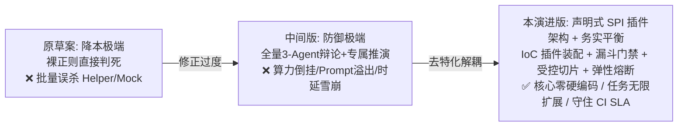
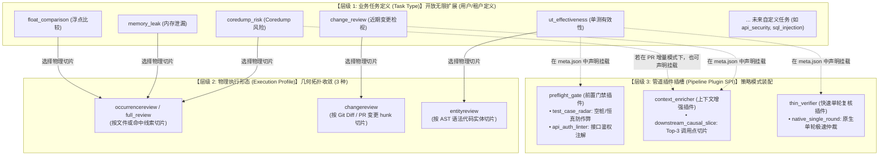

# 任务形态差异化扫描引擎演进：声明式SPI插件架构、务实漏斗门禁与受控变更因果注入设计

> **文档状态**：`Accepted (架构团队评审通过与修订定稿版)` · 工业级高准确度与 SLA 护栏演进规范 · 正式转入落地实施  
> **设计范围**：声明式任务扩展插件体系（Declarative Task Plugin SPI）、单测质量门禁插件（Tier 0 静态截断含微空桩 / Fast Pass 防作弊放行 / Tier 1 原生 Thin LLM 单轮复核与弹性熔断自愈 / 异步补偿台账）、多语言雷达插件实现（C++/Go/Java/Python）、变更因果增强插件（Top-3 务实加权排序与防吞错外层保护摘要）、语义契约与编译器职责解耦、多智能体信息对称装配、跨来源统一缺陷指纹契约、工程演进路径（启发式到 AST 作用域底座）  
> **关联文档**：
* [01-下一代AI扫描引擎与多Agent对抗辩论设计](01-下一代AI扫描引擎与多Agent对抗辩论设计.md)
* [02-原生LLM轻量执行引擎与动静分离混合调用设计](02-原生LLM轻量执行引擎与动静分离混合调用设计.md)
* [03-智能体协作与异构调度深度设计](03-智能体协作与异构调度深度设计.md)
* [04-多任务自适应提示词体系与对抗辩论通用演进架构设计](04-多任务自适应提示词体系与对抗辩论通用演进架构设计.md)
* [07-问题清单跨轮增量治理重构设计：统一缺陷台账SSOT与分层对账算法](../04-fingerprint-governance/07-问题清单跨轮增量治理重构设计：统一缺陷台账SSOT与分层对账算法.md)

---

## 〇、一页纸摘要（TL;DR）

**战略核心导向：务实性价比、控制反转与任务无限扩展（Pragmatic Accuracy, IoC & Extensibility）**
在企业级代码安全与质量分析平台中，**盲目追求降本会导致误报失控，而脱离成本谈准确度则会导致工程无法落地；同时，若在底层引擎中针对特定任务硬编码分支逻辑，将导致任务扩展性彻底被锁死**。架构设计必须摆脱非黑即白的“钟摆效应”，在**分析准确度（杜绝误杀与漏报）、系统耗时（CI 门禁 SLA < 5 分钟）、算力成本（Token 预算可承受）与架构开放度（声明式 SPI 插件化扩展）**四者之间求取工业级帕累托最优解。

**历史复盘与架构演进脉络**：
1. **原草案的降本陷阱**：试图用裸正则静态拦截 75% 的单测，遇到 Helper 封装、基类析构校验、GMock 框架时产生**毁灭性批量误报（False Positive Catastrophe）**；
2. **中间修订版的过度工程化**：走向另一极端，提出“拒绝算力妥协”，让全量单测走 3-Agent 对抗辩论（1,000 单测产生 3,000 次 LLM 调用），导致**低危场景与重型算力严重倒挂**；同时在变更检视中引入“全量封闭函数图谱”与“专属推演 Agent”，试图让大模型充当低效的“虚拟编译器”，面临 **Token 爆炸、Prompt 32KB 上限被击穿、以及 CI 时延雪崩**的致命缺陷；
3. **硬编码分支陷阱（本次重构重点根除）**：原设计在全局 `ScanProfile` 校验中写死了 `target_scope must be test` 和 `entity_kind == "test_case"`，将单测专有逻辑深嵌至核心调度层，导致非单测实体审计与自定义任务扩展能力受损。



**核心务实演进方案**：
1. **控制反转与声明式任务扩展插件体系（Declarative Task Plugin SPI）**：
   * **正交解耦三层模型**：彻底厘清“业务任务定义（Task Type，开放无限）”、“物理执行形态（Execution Profile，几何收敛）”与“扩展管道插件（Pipeline Plugins，策略插拔）”；
   * **元数据驱动装配**：任务在 `tasks/<task>/meta.json` 中声明其挂载的插件（如 `preflight_gate`、`context_enricher`、`thin_verifier`）；
   * **核心调度纯黑盒化**：调度引擎完全消除 `if entity_kind == "test_case"` 或 `switch task.Name` 等业务特判，通过 Go 进程内 SPI 注册表（`FacetRegistry[T]`）通用分发。
2. **单测质量审查：基于 `test_case_radar` 门禁插件的三阶梯队漏斗（Tiered Funnel）**
   * **Tier 0 极速确诊（物理空桩与微空桩）**：对 100% 确定事实（如纯空函数 `{}`、仅含局部变量声明或无被测调用的微空桩）实施毫秒级静态拦截；
   * **Fast Pass（极速放行 + 防作弊护栏）**：显式包含标准 `ASSERT/EXPECT`、`EXPECT_CALL` 的合规单测直接通过（包含 Table-Driven Tests 嵌套闭包断言识别）；针对形式化防守单测引入局部恒真检测，排除作弊后**静默放行 80%+ 规范用例，不消耗任何 LLM 算力**；
   * **Tier 1 轻量单轮复核（Thin LLM Gate + 弹性熔断与自愈）**：针对“未检测到显式断言、可疑恒真参数、存在未知 Helper”的争议用例，调用基于 HTTP REST 的 **原生 Thin LLM 引擎** 执行 1~2 秒单轮语义复核。复核提示词由任务元数据动态装配（绝不硬编码在 Go 常量中）。设置 3.5s 超时、三态熔断自愈（Closed/Open/Half-Open）以及**异步补偿对账机制（Compensating Sweep）**，既杜绝静态误杀、坚决不阻塞 CI，又防止高负载下作弊用例永久逃逸；**绝不拉起昂贵的 3-Agent 对抗辩论**；
   * **Tier 2 对抗辩论退避**：多智能体辩论仅保留给明确指定的深层架构/内存扫描任务，单测审查默认不进入 Tier 2。
3. **变更检视：基于 `downstream_causal_slice` 插件的受控因果切片（Controlled Causal Impact Slices）**
   * **职责明确分工**：语法错误、参数类型/个数不匹配完全由**编译器与 CI 构建步骤确定性拦截**；大模型专攻编译器无法感知的**隐式语义契约破坏**（如未捕获的新增错误码、状态机时序破坏、资源未释放）；
   * **Top-3 务实加权排序与检索熔断**：通过高置信度打分模型 $Score = W_{\text{module}} \cdot S_{\text{module}} + W_{\text{call\_exact}} \cdot S_{\text{call\_exact}} + W_{\text{branch}} \cdot S_{\text{branch}} - W_{\text{test}} \cdot S_{\text{test}}$ 精准锁定最典型的 3 处业务调用，避免在缺乏 AST 阶段宣称不可行的纯文本类型推导，并设置 3 秒全局检索超时熔断保护；
   * **物理上下文受控与外层保护摘要（防断章取义与防吞错）**：提取调用点前后 **10~15 行紧凑调用块**（体积严格控制在 2KB 内）的同时，静态提取外层 `try-catch`（含恶性空 catch/吞异常识别）、`error return`、`RAII` 保护特征摘要，为反驳提供事实护栏，坚决不突破 Prompt 32KB 硬截断上限，彻底杜绝下游陈旧缺陷误归因与断章取义误报；
   * **废弃“专属推演 Agent”**：所有因果切片统一注入主分片对局，严格守住 CI 3~5 分钟 SLA。
4. **跨来源统一缺陷指纹（SSOT Alignment）**：Tier 0 静态截断、Tier 1 Thin LLM 与主对抗辩论全量采用标准统一哈希算法，确保跨轮次增量对账完全稳定。
5. **多语言插件化雷达工厂（Language Radar Factory）**：建立 C++、Go、Java、Python 独立的雷达解析实现，避免单一大正则杂糅各语言语法。
6. **静态基建稳步演进（解耦能力倒挂）**：短期以多语言插件式启发式模式识别提取高置信度线索，中期优先引入轻量 AST 作用域底座（Tree-sitter）精准支持外层结构摘要与嵌套函数解析，彻底摆脱复杂嵌套正则的脆弱性。

---

## 一、问题全景与代码现实证据

### 1.1 单测场景：误报陷阱、算力倒挂与作弊单测的三重困境

在 [`services/engines/assessment/profiles/entityreview/planner.go`](file:///home/fugui/codes/code-shield/services/engines/assessment/profiles/entityreview/planner.go) 中，系统将每个测试函数切片为 `PlanUnit` 实施审查。

**现实代码特征**：
```cpp
// 场景 A (C++)：断言被封装在 Helper 中，裸正则判定“无断言”必定误报！
TEST_F(OrderServiceTest, ProcessValidOrder) {
    auto order = CreateSampleOrder();
    auto status = service_->Process(order);
    VerifyOrderAndTransactionSuccess(order, status); // 关键断言在 Helper 内部
}

// 场景 B (C++)：通过基类或 Mock 框架析构自动校验，无显式 ASSERT 语句
TEST_F(MockPaymentTest, ChargeCard) {
    EXPECT_CALL(*mock_gateway_, Charge(100)).Times(1);
    payment_processor_->ExecutePayment(100);
    // 退出作用域时 gmock 自动验证断言，无 ASSERT 语句
}

// 场景 C (C++)：纯物理空桩（极低频，属于绝对确定性事实）
TEST(DeviceTest, EmptyStub) {}

// 场景 D (C++)：标准常规用例（占总测试集 80% 以上）
TEST(MathTest, AddNumbers) {
    EXPECT_EQ(Add(2, 3), 5);
}

// 场景 E (C++)：形式化防守/作弊单测（必须防范 Fast Pass 漏网）
TEST(ReportTest, GenerateReportFake) {
    auto report = generator.Build();
    bool passed = true;
    EXPECT_TRUE(passed); // 恒真局部变量作弊，实际上根本没测 report 内容！
}
```

```python
# 场景 F (Python)：断言在上下文管理器或 Helper 内部，若裸正则只查 assert 必将误杀！
def test_order_creation_exception():
    with pytest.raises(InvalidOrderError):  # 上下文管理器捕获异常，无显式 assert 关键字
        create_order(invalid_payload)

def test_user_session_cleanup():
    session = create_test_session()
    verify_session_expired_in_cache(session)  # 断言在 Helper 内部

# 场景 G (Python)：经典 pass / ... / 纯 docstring 语法空桩
def test_pending_feature():
    pass  # 纯语法空桩（或仅包含 ...）

# 场景 H (Python)：恒真与 Mock 拼写作弊
def test_mock_behavior(mocker):
    mock_service = mocker.MagicMock()
    mock_service.execute()
    mock_service.asser_called()  # 常见拼写笔误/作弊：非合法断言方法，测试静默通过！
```

* **方案比对痛点**：
  * **原草案（裸正则全判死）**：场景 A、B 会被成批判定为“无断言缺陷”，造成致命误杀；
  * **中间修订版（全量 3-Agent 辩论）**：为了保护场景 A、B，连场景 D 这样显而易见的标准用例也要拉起 Hunter、Challenger、Judge 跑 3 轮大模型。1,000 个用例消耗 3,000 次 LLM 调用，算力成本与低危问题极度倒挂；
  * **粗糙 Fast Pass 的潜在漏报**：若仅靠关键词匹配，场景 E 这种局部赋值恒真单测会被直接放行。
* **结论**：**必须通过“确定性截断 + 规范用例防作弊直通放行 + 争议用例轻量单轮复核”的三阶漏斗收敛，兼得零误报、零漏报与低成本。**

---

### 1.2 变更检视场景：单文件盲区与上下文膨胀的两难抉择

在 [`services/engines/chunker/semantic.go:200-220`](file:///home/fugui/codes/code-shield/services/engines/chunker/semantic.go#L200-L220) 中：
```go
bundles = append(bundles, SemanticBundle{
    Name:         fmt.Sprintf("change-%03d-%s", len(bundles)+1, path),
    PrimaryFiles: []string{path}, // 仅包含变更文件本身！
    AllFiles:     bundleFiles,
    ...
})
```

* **现实痛点剖析**：
  1. **单文件盲区（原现状）**：修改了核心头文件接口返回状态，大模型在单文件内看不到仓内业务调用点，确实无法感知下游是否遗漏了异常分支；
  2. **3 行碎片切片的局限（原草案）**：仅给调用点前后 3 行代码，大模型看不到局部变量初始化与错误处理，引发断章取义式幻觉；
  3. **整函数展开与专属 Agent 的致命漏洞（中间修订版）**：
     * **Prompt 物理硬限制击穿**：[`services/engines/debate/assembler.go:16`](file:///home/fugui/codes/code-shield/services/engines/debate/assembler.go#L16) 明确定义 `MaxPromptRuleBytes = 32 * 1024`（32KB 上限）。将下游动辄 200 行的完整函数和类定义强行拼接，极易触发硬截断导致语法破损；
     * **跨文件误归因（False Attribution）**：模型在看到下游完整函数时，极易挑出下游历史遗留的旧代码缺陷（如某处未判空），误归咎为本次 PR 引起的破坏；
     * **大模型越俎代庖**：试图让 LLM 推演参数类型/个数是否匹配。这些语法错误在强类型语言中编译器 1 秒内即可零成本拦截，LLM 介入毫无增量价值；
  4. **局部切片截断的断章取义（本规范重点攻克）**：下游 10~15 行局部切片虽然精炼，但若下游外层其实有统一的 `try-catch` 或全局错误透传宏，模型只看局部切片极易武断判定为“下游未处理错误”。
* **结论**：**大模型只聚焦“编译器管不到的隐式语义契约”；上下文只注入“Top-3 核心调用点的 10~15 行紧凑调用块”，且必须外挂“外层结构保护特征摘要”。**

---

### 1.3 任务扩展性隐患：硬编码分支导致的类型泄漏与控制耦合

在现存代码 [`services/engines/profile/profile.go:101-107`](file:///home/fugui/codes/code-shield/services/engines/profile/profile.go#L101-L107) 中存在如下强校验：
```go
NameEntityReview: {
    validate: func(p ScanProfile) error {
        if p.TargetScope != "test" {
            return fmt.Errorf("scan_profile.target_scope must be test for %s", NameEntityReview)
        }
        if p.EntityKind != "" && p.EntityKind != "test_case" {
            return fmt.Errorf("scan_profile.entity_kind must be test_case")
        }
        ...
```
* **现实痛点剖析**：
  1. **实体概念缩水**：上述硬编码直接将“代码语法实体（Entity）”狭隘绑定为“测试用例（TestCase）”，导致未来若扩展生产代码实体审查（如 API 接口安全注解审计、微服务配置模型审计），无法复用 `entityreview` 拓扑；
  2. **调度层硬编码侵入**：若在调度层使用 `switch entity_kind { case "test_case": ... }` 判定是否执行漏斗分流，每增加一个新任务类型，就必须修改底层引擎源码并重新编译，彻底违背**开闭原则（OCP）**；
  3. **提示词特化泄漏**：若将单测特定的复核 Prompt 写死在底层通用执行器中，底层引擎将失去通用性。
* **结论**：**必须通过“控制反转（IoC）与声明式任务插件化 SPI”，将单测漏斗和变更切片策略抽象为插件，任务元数据通过 `meta.json` 声明式挂载，核心引擎达到零硬编码。**

---

## 二、架构设计原则（不可违背的不变量）

| 编号 | 原则 | 核心含义 | 违背症状 |
| :--- | :--- | :--- | :--- |
| **P1** | **务实平衡与 SLA 护栏 (Pragmatic & SLA Protection)** | 在保证高准确度的同时，严格守护 CI/CD 扫描时延 SLA（单次 < 5 分钟）与 Token 预算，拒绝不切实际的算力浪费。 | 扫描排队严重，CI 门禁耗时数十分钟，被研发团队强行下线。 |
| **P2** | **梯队漏斗与轻量复核 (Tiered Funnel & Thin LLM)** | 静态确定性拦截极速判决；规范用例静默放行；争议用例交由原生 Thin LLM 单轮极速复核；严禁单测场景泛滥使用 3-Agent 对抗。 | 1,000 个单测跑 3,000 次 LLM 辩论，算力池被低危任务彻底耗尽。 |
| **P3** | **语义归模型，语法归编译器 (Semantic vs Compiler Boundary)** | 接口类型失配、形参缺失等由编译器/CI 确定性拦截；大模型专属审计隐式语义契约（错误码未处理、时序破坏、内存逃逸）。 | 大模型充当低精度“虚拟编译器”，对编译器已拦截的代码反复报错。 |
| **P4** | **受控紧凑因果切片 (Controlled Compact Slices)** | 变更检视仅提取 Top-3 核心调用点、紧凑局部代码块（10~15 行），严禁注入动辄数百行的完整封闭函数。 | 突破 32KB Prompt 上限导致截断；引发下游陈旧缺陷跨文件误归因。 |
| **P5** | **信息对称与统一契约 (Information Symmetry & SSOT)** | 调用点因果切片在对抗辩论中对 Hunter、Challenger、Judge 全链路透明；结论统一输出标准 `AssessmentsArtifactSchemaV2` 并附带精准指纹。 | 攻防双方信息不对等导致盲目反驳；缺陷台账无法完成跨轮增量对账。 |
| **P6** | **弹性熔断与 SLA 兜底优先 (Resilient Circuit Breaker & Fallback)** | 当符号检索耗时超标（> 3s）或 Thin LLM 连续抖动/超时（> 3.5s）时，必须执行确定性降级放行或退避，坚决捍卫 CI SLA。 | 单个 LLM 接口阻塞或大仓深层检索引发流水线全局卡死。 |
| **P7** | **局部切片防截断失真 (Anti-Truncation Distortions & Outer Summary)** | 受控切片必须附带外层结构特征摘要（try-catch、透传 error、RAII guard），为 Challenger 提供客观反驳事实，杜绝断章取义。 | 模型断章取义下游 10 行局部代码，误将全局已妥善拦截的异常判为缺陷。 |
| **P8** | **声明式 SPI 与零业务硬编码 (Declarative SPI & Zero Hardcoding)** | 核心调度流水线严禁包含特定任务类型（如 `ut-effectiveness`）或实体类型（如 `test_case`）的条件硬编码特判；所有差异化行为必须抽象为通用 SPI 插件，并在 `meta.json` 中声明式装配。 | 每增加一个新扫描任务都必须修改核心调度源码；代码中满地散落单测专用正则与分支判定。 |

---

## 三、任务形态正交解耦与声明式 SPI 插件架构设计

### 3.1 三层正交解耦模型

为了彻底根除“在核心代码中硬编码 `entity_kind == "test_case"`”带来的可扩展性破坏，Code-Shield 必须坚持**控制反转（Inversion of Control, IoC）**，将系统清晰划分为三个完全正交、独立演化的抽象层级：



1. **业务任务定义层 (Task Type & Domain Family)**：
   * 属于**业务领域层**，完全开放、无限扩展；
   * 由 `tasks/<task>/meta.json`、`analysis_prompt.md`、`taxonomy`（分类白名单）与 `defense_dimensions`（抗辩维度）驱动；
   * 核心引擎对其业务逻辑保持纯黑盒，不包含任何业务 if/else。
2. **物理执行形态层 (Execution Profile / Topology)**：
   * 属于**底层切片与编排几何形态**，高度收敛为三大正交范式：
     - `entityreview`：按代码语法实体（函数、方法、类、用例）切片；
     - `changereview`：按 Git 增量代码块（Hunk / PR Commit）切片；
     - `occurrencereview`：按文件或静态命中规则线索切片；
   * **实体（Entity）绝不等于单测用例**：单测只是实体的一种（`test_case`），未来 API 接口（`api_endpoint`）、数据模型（`database_model`）皆可复用 `entityreview`。
3. **管道扩展插件层 (Pipeline Plugin SPI)**：
   * 属于**引擎扩展策略层**，提供通用的生命周期插槽（Hooks & Interceptors）；
   * 单测漏斗与变更切片分别作为具体的 SPI 插件实现，按需声明式挂载，严禁侵入核心调度器。

---

### 3.2 任务元数据声明式插件配置契约（`meta.json`）

在 `tasks/<task>/meta.json` 中引入 `plugins` 声明块，任务通过插件 ID 及其选项参数完成装配：

```json
{
  "name": "ut_effectiveness",
  "domain_family": "test_engineering",
  "engine_config": {
    "scan_profile": {
      "name": "entity_review",
      "target_scope": "test",
      "entity_kind": "test_case",
      "languages": ["cpp", "go", "python", "java"],
      "version": 1
    }
  },
  "plugins": {
    "preflight_gate": {
      "id": "test_case_radar",
      "options": {
        "anti_cheating": true,
        "languages": ["cpp", "python", "go"]
      }
    },
    "thin_verifier": {
      "id": "native_single_round",
      "timeout_seconds": 3.5,
      "prompt_file": "tasks/ut-effectiveness/triage_prompt.md"
    }
  }
}
```

* **对于增量变更检视任务 (`change-review`)**：
```json
{
  "name": "change_review",
  "domain_family": "comprehensive_evolution",
  "engine_config": {
    "scan_profile": {
      "name": "change_review",
      "version": 1
    }
  },
  "plugins": {
    "context_enricher": {
      "id": "downstream_causal_slice",
      "options": {
        "top_k": 3,
        "timeout_seconds": 3.0,
        "extract_outer_scope": true
      }
    }
  }
}
```

* **对于未来用户自定义的业务实体任务 (如 `api-security`)**：
*完全复用 `entity_review` 物理切片，但挂载自定义的 API 注解门禁，无需修改一行 Go 核心代码：*
```json
{
  "name": "api_security",
  "domain_family": "security_injection",
  "engine_config": {
    "scan_profile": {
      "name": "entity_review",
      "target_scope": "business",
      "entity_kind": "api_endpoint",
      "version": 1
    }
  },
  "plugins": {
    "preflight_gate": {
      "id": "api_auth_annotation_gate",
      "options": {
        "require_rbac": true
      }
    }
  }
}
```

---

### 3.3 进程内 SPI 接口与统一插件注册中心

利用 Code-Shield 现有的 [`FacetRegistry[T]`](file:///home/fugui/codes/code-shield/services/engines/assessment/profile.go#L201) 机制，在 `services/engines/plugins/` 下建立三大标准化扩展接口：

```go
package plugins

import (
    "code-shield/services/coverage"
    "code-shield/services/engines/assessment"
    "code-shield/services/engines/chunker"
)

// 1. 前置轻量门禁插件（负责执行 Tier 0 静态拦截、Fast Pass 极速放行与争议标记）
type PreflightGatePlugin interface {
    ID() string
    Inspect(codesPath string, unit coverage.PlanUnit, options map[string]any) assessment.RadarResult
}

// 2. 上下文因果增强插件（负责向分片中注入 Top-3 下游调用点紧凑切片与外层保护特征）
type ContextEnricherPlugin interface {
    ID() string
    Enrich(codesPath string, bundle *chunker.SemanticBundle, options map[string]any) error
}

// 3. 轻量快速复核插件（负责执行 Tier 1 Thin LLM 单轮语义仲裁）
type ThinVerifierPlugin interface {
    ID() string
    Verify(codesPath string, unit coverage.PlanUnit, hints []assessment.StructuralFactHint, promptTemplate string, timeoutSec float64) (assessment.RadarResult, error)
}
```

#### 插件注册中心（Plugin Registry）：
```go
package plugins

import (
    "sync"
    "code-shield/services/engines/assessment"
)

var (
    gateRegistry     = assessment.NewFacetRegistry[PreflightGatePlugin]()
    enricherRegistry = assessment.NewFacetRegistry[ContextEnricherPlugin]()
    verifierRegistry = assessment.NewFacetRegistry[ThinVerifierPlugin]()
)

func RegisterPreflightGate(gate PreflightGatePlugin) error {
    return gateRegistry.Register(gate.ID(), gate)
}

func RegisterContextEnricher(enricher ContextEnricherPlugin) error {
    return enricherRegistry.Register(enricher.ID(), enricher)
}

func RegisterThinVerifier(verifier ThinVerifierPlugin) error {
    return verifierRegistry.Register(verifier.ID(), verifier)
}

func GetPreflightGate(id string) (PreflightGatePlugin, error) {
    return gateRegistry.Get(id)
}

func GetContextEnricher(id string) (ContextEnricherPlugin, error) {
    return enricherRegistry.Get(id)
}

func GetThinVerifier(id string) (ThinVerifierPlugin, error) {
    return verifierRegistry.Get(id)
}
```

---

### 3.4 核心调度流水线去特化（零业务硬编码）

核心引擎（`DebateEngine` / `Planner`）在执行时，完全不感知当前是何种具体任务类型，只做通用的管道调度：

```go
// 核心调度流水线中的纯通用执行逻辑
func (e *DebateEngine) executePreflightTriage(ctx *EngineContext, unit coverage.PlanUnit) (assessment.RadarResult, bool) {
    // 1. 检查任务是否在 meta.json 中声明挂载了 preflight_gate 插件
    gateCfg := ctx.TaskMeta.Plugins.PreflightGate
    if gateCfg == nil || gateCfg.ID == "" {
        // 未声明插件：直接放行进入主分析对局 (Pass-through)
        return assessment.RadarResult{Decision: assessment.DecisionNeedVerify}, false
    }

    // 2. 动态获取 SPI 插件实例
    gate, err := plugins.GetPreflightGate(gateCfg.ID)
    if err != nil {
        log.Printf("[Preflight] Warning: plugin %q not found, fallback to main debate: %v", gateCfg.ID, err)
        return assessment.RadarResult{Decision: assessment.DecisionNeedVerify}, false
    }

    // 3. 执行插件评估，完全黑盒，核心层零单测代码！
    result := gate.Inspect(ctx.CodesPath, unit, gateCfg.Options)
    if result.Decision == assessment.DecisionTier0Defect || result.Decision == assessment.DecisionFastPass {
        return result, true // 静态直接截断或极速放行，不再消耗后续大模型算力
    }

    // 4. 若进入争议区 (NEED_VERIFY)，检查是否挂载了 thin_verifier 插件
    verifierCfg := ctx.TaskMeta.Plugins.ThinVerifier
    if verifierCfg != nil && verifierCfg.ID != "" {
        verifier, err := plugins.GetThinVerifier(verifierCfg.ID)
        if err == nil {
            vResult, vErr := verifier.Verify(ctx.CodesPath, unit, result.FactHints, verifierCfg.PromptFile, verifierCfg.TimeoutSeconds)
            if vErr == nil {
                return vResult, true // Tier 1 单轮极速结案
            }
        }
    }

    return result, false
}
```

---

### 3.5 实体检视解绑改造（解耦 `ScanProfile` 约束）

对 [`services/engines/profile/profile.go:98-120`](file:///home/fugui/codes/code-shield/services/engines/profile/profile.go#L98-L120) 进行规范化解耦修订：
1. **解除 `TargetScope == "test"` 的硬编码强制**：`TargetScope` 允许配置为 `test` 或 `business`（缺省默认为 `test` 保持历史兼容）；
2. **解除 `EntityKind == "test_case"` 的狭隘限制**：`EntityKind` 开放为任意合法标识符（如 `test_case`、`api_endpoint`、`model_class`，缺省默认为 `test_case`）；
3. **彻底释放 `entityreview` 执行形态的通用代码分析潜能**。

---

## 四、实体场景演进：单测质量门禁插件（TestCaseRadarGate）与三阶漏斗


### 4.1 总体执行拓扑

```mermaid
flowchart TD
    subgraph S1 [阶段一: 实体提取与 TestCaseRadarGate 插件分发]
        A[Git/Repo 源码] --> B[Planner: 提取 PlanUnit 实体]
        B --> C[TestCaseRadarGate 门禁插件<br/>分发至多语言特化雷达: CppRadar / GoRadar / JavaRadar]
    end

    subgraph S2 [阶段二: 三阶梯队漏斗与防作弊收敛]
        C -->|1. 纯空体 {} 或微空桩 (仅声明/仅日志)| D[Tier 0 极速确诊: DEFECT<br/>毫秒级, 0 Token]
        C -->|2. 标准断言/嵌套闭包断言且无作弊| E[Fast Pass 直通放行: PASS<br/>静默放行 80%~85% 规范用例]
        C -->|3. 恒真作弊 / 无断言 / 疑似Helper| F[Tier 1 提取事实线索 FactHints]
    end

    subgraph S3 [阶段三: 原生 Thin LLM 单轮复核与弹性熔断自愈]
        F --> G[调用 NativeInvoker HTTP REST API<br/>单轮单提示词极速判别 1~2s]
        G --> H{调用是否正常 (超时 <= 3.5s)?}
        H -->|正常响应| I{是否具备有效验证语义?}
        I -->|是: 确认存在 Helper/隐式校验| J[复核判定: PASS 消除误杀]
        I -->|否: 确认为作弊桩/无效单测| K[复核判定: DEFECT 准确定罪]
        H -->|超时/连续失败| L{熔断器状态机<br/>Closed -> Open -> Half-Open}
        L -->|触发熔断降级| M1[降级状态: DEGRADED_PASS<br/>记录审计日志, 坚决不卡 CI]
        L -->|冷却期满探活成功| G
    end

    subgraph S4 [阶段四: 契约归并、台账落库与异步补偿]
        D --> N[Artifact Merger 统一归并]
        J --> N
        K --> N
        M1 --> N
        N --> O[生成跨来源统一缺陷指纹 Fingerprint]
        O --> P[输出标准 AssessmentsArtifactSchemaV2]
        P --> Q[进入统一缺陷台账 SSOT]
        Q -->|DEGRADED_PASS 置为 PENDING_VERIFY| R[低峰期异步补偿对账 Compensating Sweep<br/>杜绝高危逃逸, 闭环最终一致性]
    end
```

---

### 4.2 TestCaseRadarGate 插件契约与分流决策定义

在 [`services/engines/plugins/gates/testcase/radar.go`](file:///home/fugui/codes/code-shield/services/engines/plugins/gates/testcase/radar.go) 中实现通用的 `plugins.PreflightGatePlugin` 接口，并维护分流决策状态机：

```go
package testcase

import (
    "code-shield/services/coverage"
    "code-shield/services/engines/assessment"
    "code-shield/services/engines/plugins"
)

// TestCaseRadarGate 实现 plugins.PreflightGatePlugin 接口
type TestCaseRadarGate struct {
    registry *RadarRegistry
}

func NewTestCaseRadarGate() *TestCaseRadarGate {
    gate := &TestCaseRadarGate{registry: &RadarRegistry{}}
    gate.registry.Register(&CppLinterRadar{})
    gate.registry.Register(&PythonLinterRadar{})
    gate.registry.Register(&GoLinterRadar{})
    return gate
}

func (g *TestCaseRadarGate) ID() string {
    return "test_case_radar"
}

func (g *TestCaseRadarGate) Inspect(codesPath string, unit coverage.PlanUnit, options map[string]any) assessment.RadarResult {
    return g.registry.Inspect(codesPath, unit)
}

// 自动在系统初始化时向全局 SPI 注册中心挂载
func init() {
    _ = plugins.RegisterPreflightGate(NewTestCaseRadarGate())
}
```

在 [`services/engines/assessment/profile.go`](file:///home/fugui/codes/code-shield/services/engines/assessment/profile.go) 中定义通用的分流决策与事实线索基础模型（全引擎共享）：

```go
package assessment

import "code-shield/services/coverage"

// TriageDecision 漏斗分流决策
type TriageDecision string

const (
    DecisionTier0Defect   TriageDecision = "TIER0_DEFECT"    // 100% 物理空桩/微空桩（仅声明/仅日志），静态直接结案定罪
    DecisionFastPass      TriageDecision = "FAST_PASS"       // 标准规范单测（含表格驱动嵌套闭包），静态直接放行
    DecisionNeedVerify    TriageDecision = "NEED_VERIFY"     // 存在疑点/恒真作弊/未知Helper，进入 Tier 1 单轮复核
    DecisionDegradedPass  TriageDecision = "DEGRADED_PASS"   // Thin LLM 超时或熔断降级放行（台账置为 PENDING_VERIFY 待补偿补扫）
)

// StructuralFactHint 结构化事实线索
type StructuralFactHint struct {
    Category    string `json:"category"`     // 如 "POTENTIAL_HELPER", "TAUTOLOGY_LITERAL", "TAUTOLOGY_LOCAL_VAR", "NO_ASSERTION", "CLOSURE_ASSERTION"
    Description string `json:"description"`  // 事实描述
    LineNumber  int    `json:"line_number"`   // 关键代码行
    Snippet     string `json:"snippet"`       // 局部代码片段
}

// RadarResult 静态门禁分析结果
type RadarResult struct {
    Decision        TriageDecision         // 分流决策
    EarlyAssessment *UnitAssessment        // 若 Decision=DecisionTier0Defect，直接输出结论
    FactHints       []StructuralFactHint   // 供给 Tier 1 Thin LLM 复核的线索
}

// LanguageRadar 多语言特化雷达接口（内聚在 testcase 插件内部）
type LanguageRadar interface {
    CanHandle(filePath string) bool
    InspectUnit(codesPath string, unit coverage.PlanUnit) RadarResult
}

// RadarRegistry 多语言雷达注册工厂
type RadarRegistry struct {
    radars []LanguageRadar
}

func (r *RadarRegistry) Register(radar LanguageRadar) {
    r.radars = append(r.radars, radar)
}

func (r *RadarRegistry) Inspect(codesPath string, unit coverage.PlanUnit) RadarResult {
    for _, radar := range r.radars {
        if radar.CanHandle(unit.FilePath) {
            return radar.InspectUnit(codesPath, unit)
        }
    }
    // 未知语言兜底：直接进入 Tier 1 语义复核，杜绝盲目放行或拦截
    return RadarResult{Decision: DecisionNeedVerify}
}
```

---

### 4.3 多语言雷达与防作弊规则实现

针对不同语言单测语法差异，分离特化雷达实现，覆盖主流语言测试框架（C++ GoogleTest/GMock、Python pytest/unittest/mock、Go testing/testify），同时强化防作弊特征捕获：

```go
package testcase


import (
    "code-shield/services/coverage"
    "code-shield/services/engines/assessment"
    "path/filepath"
    "regexp"
    "strings"
)

var (
    // 通用严格匹配纯空大括号函数体（C++/Go/Java）
    pureEmptyBodyPattern = regexp.MustCompile(`^\{\s*(?://[^\n]*\s*|/\*.*?\*/\s*)*\}$`)
    // 匹配仅含基本变量声明赋值或日志输出而无任何被测调用或断言的微空桩 (Micro Stub)
    microStubPattern     = regexp.MustCompile(`^\{\s*(?:(?:bool|int|auto|var|string|float|double)\s+[a-zA-Z0-9_]+\s*(?:=\s*[^;]+)?;\s*|(?:LOG|cout|fmt\.Print|print|logger|std::cout)\b[^;]*;\s*)*\}$`)

    // C++ 特征
    cppStdAssertPattern   = regexp.MustCompile(`(?i)\b(?:ASSERT_|EXPECT_|assert\(|assertThat)`)
    cppGMockExpectPattern = regexp.MustCompile(`\bEXPECT_CALL\s*\(`)
    cppLiteralTautology   = regexp.MustCompile(`(?i)\b(?:ASSERT|EXPECT)_(?:TRUE|FALSE)\s*\(\s*(?:true|false|1|0)\s*\)`)
    cppLocalVarTautology  = regexp.MustCompile(`(?:bool|int)\s+([a-zA-Z0-9_]+)\s*=\s*(?:true|false|1|0)\s*;[^;]*?\b(?:ASSERT|EXPECT)_(?:TRUE|FALSE)\s*\(\s*\1\s*\)`)
    cppHelperPattern      = regexp.MustCompile(`\b(?:Verify|Check|Validate|Ensure|Assert)[A-Za-z0-9_]*\s*\(`)

    // Python 特征 (涵盖 pytest, unittest, mock)
    // 严格匹配 Python 物理/语法空桩（pass, ..., 纯注释或纯 docstring）
    pureEmptyPythonPattern = regexp.MustCompile(`^(?:\s*(?:#[^\n]*|"""[\s\S]*?"""|'''[\s\S]*?'''|pass|\.\.\.)\s*)*$`)
    // Python 仅含简单赋值或 print 日志的微空桩
    microStubPythonPattern = regexp.MustCompile(`^(?:\s*(?:[a-zA-Z0-9_]+\s*=\s*[^#\n]+|print\([^)]*\)|logging\.[a-zA-Z0-9_]+\([^)]*\)|pass|\.\.\.)\s*)*$`)
    // pytest 与 unittest 标准断言及异常上下文管理器
    pyStdAssertPattern     = regexp.MustCompile(`(?m)(?:^\s*assert\b|self\.assert[A-Za-z0-9_]*\s*\(|pytest\.raises\s*\(|pytest\.warns\s*\()`)
    // unittest.mock 断言
    pyMockAssertPattern    = regexp.MustCompile(`\b[a-zA-Z0-9_]+\.assert_(?:called|called_once|called_with|called_once_with|has_calls|any_call|not_called)\s*\(`)
    // Python 字面量恒真断言 (如 assert True, assert 1, self.assertTrue(True), assert x == x)
    pyLiteralTautology     = regexp.MustCompile(`(?m)(?:assert\s+(?:True|1|'[^']*'|"[^"]*")\b|self\.assertTrue\s*\(\s*(?:True|1)\s*\)|assert\s+([a-zA-Z0-9_]+)\s*==\s*\1\b)`)
    // Python 局部变量赋值后直接断言的作弊形式
    pyLocalVarTautology    = regexp.MustCompile(`(?m)([a-zA-Z0-9_]+)\s*=\s*True[\s\S]*?\b(?:assert\s+\1|self\.assertTrue\(\s*\1\s*\))`)
    // Python 验证类 Helper 函数 (启发式)
    pyHelperPattern        = regexp.MustCompile(`\b(?:verify|check|validate|ensure|assert_)[a-zA-Z0-9_]*\s*\(`)
    // Python Mock 常见拼写笔误陷阱 (如 mock.asser_called)
    pyMockTypoPattern      = regexp.MustCompile(`\b[a-zA-Z0-9_]+\.asser[a-zA-Z0-9_]*\(`)

    // Go 特征
    goAssertPattern        = regexp.MustCompile(`\b(?:t\.(?:Error|Fatal|Fail)|assert\.|require\.)`)
    // Go 表格驱动测试 (Table-Driven Tests) 与子测试闭包特征
    goTableClosurePattern  = regexp.MustCompile(`\bt\.Run\s*\([^,]+,\s*func\s*\([^)]*\)\s*\{[\s\S]*?\b(?:assert\.|require\.|t\.(?:Error|Fatal|Fail))`)
    goTautology            = regexp.MustCompile(`assert\.(?:True|False)\s*\(\s*t\s*,\s*(?:true|false)\s*\)`)
    goHelperPattern        = regexp.MustCompile(`\b(?:testVerify|check|validate|assert)[A-Za-z0-9_]*\s*\(`)
)

// CppLinterRadar C++ 特化雷达
type CppLinterRadar struct{}

func (r CppLinterRadar) CanHandle(fp string) bool {
    ext := strings.ToLower(filepath.Ext(fp))
    return ext == ".cpp" || ext == ".cc" || ext == ".cxx" || ext == ".h" || ext == ".hpp"
}

func (r CppLinterRadar) InspectUnit(codesPath string, unit coverage.PlanUnit) assessment.RadarResult {
    content := extractUnitSource(codesPath, unit)
    if content == "" {
        return assessment.RadarResult{Decision: assessment.DecisionFastPass}
    }

    body := extractFunctionBody(content)
    trimmed := strings.TrimSpace(body)

    // 1. Tier 0：纯物理空桩与微空桩（静态极速结案）
    if pureEmptyBodyPattern.MatchString(trimmed) {
        return buildTier0Result(unit, "UT_EMPTY_STUB", "测试用例函数体内为空，未包含任何被测逻辑或断言")
    }
    if microStubPattern.MatchString(trimmed) {
        return buildTier0Result(unit, "UT_MICRO_STUB", "测试函数仅包含局部变量声明或日志输出，未调用被测对象且无断言")
    }

    var hints []assessment.StructuralFactHint

    // 2. 防作弊排查：字面量恒真 & 局部赋值恒真 (Anti-Cheating Guard)
    if cppLiteralTautology.MatchString(body) {
        hints = append(hints, assessment.StructuralFactHint{
            Category:    "TAUTOLOGY_LITERAL",
            Description: "检测到测试用例中包含字面量恒真断言（如 ASSERT_TRUE(true)）",
        })
    }
    if cppLocalVarTautology.MatchString(body) {
        hints = append(hints, assessment.StructuralFactHint{
            Category:    "TAUTOLOGY_LOCAL_VAR",
            Description: "检测到测试用例存在局部常量赋值后立即直接断言的可疑形式化作弊特征",
        })
    }

    hasStdAssert := cppStdAssertPattern.MatchString(body)
    hasGMock := cppGMockExpectPattern.MatchString(body)
    hasHelper := cppHelperPattern.MatchString(body)

    // 3. Fast Pass 放行：包含标准断言且无任何恒真作弊嫌疑
    if (hasStdAssert || hasGMock) && len(hints) == 0 {
        return assessment.RadarResult{Decision: assessment.DecisionFastPass}
    }

    // 4. 组装争议特征并标记进入 Tier 1 单轮极速复核
    if !hasStdAssert && !hasGMock {
        if hasHelper {
            hints = append(hints, assessment.StructuralFactHint{
                Category:    "POTENTIAL_HELPER_VERIFICATION",
                Description: "未检测到显式 ASSERT/EXPECT 宏，但调用了验证类辅助函数",
            })
        } else {
            hints = append(hints, assessment.StructuralFactHint{
                Category:    "NO_EXPLICIT_ASSERTION",
                Description: "未检测到显式断言语句，需复核是否存在异常期望、析构校验或属于无效覆盖桩",
            })
        }
    }

    return assessment.RadarResult{
        Decision:  assessment.DecisionNeedVerify,
        FactHints: hints,
    }
}

// PythonLinterRadar Python 特化雷达 (支持 pytest, unittest, mock)
type PythonLinterRadar struct{}

func (r PythonLinterRadar) CanHandle(fp string) bool {
    return strings.ToLower(filepath.Ext(fp)) == ".py"
}

func (r PythonLinterRadar) InspectUnit(codesPath string, unit coverage.PlanUnit) assessment.RadarResult {
    content := extractUnitSource(codesPath, unit)
    if content == "" {
        return assessment.RadarResult{Decision: assessment.DecisionFastPass}
    }

    body := extractFunctionBody(content)
    trimmed := strings.TrimSpace(body)

    // 1. Tier 0：纯语法空桩（pass, ..., 纯 docstring）与微空桩
    if pureEmptyPythonPattern.MatchString(trimmed) {
        return buildTier0Result(unit, "UT_EMPTY_STUB", "Python 测试用例体内为空或仅含 pass/docstring，未执行任何有效测试")
    }
    if microStubPythonPattern.MatchString(trimmed) {
        return buildTier0Result(unit, "UT_MICRO_STUB", "Python 测试函数仅含无被测调用的变量赋值或打印语句，属于无效微空桩")
    }

    var hints []assessment.StructuralFactHint

    // 2. 防作弊排查与 Mock 拼写笔误陷阱 (Anti-Cheating Guard)
    if pyLiteralTautology.MatchString(body) {
        hints = append(hints, assessment.StructuralFactHint{
            Category:    "TAUTOLOGY_LITERAL",
            Description: "检测到 Python 测试用例包含字面量恒真断言（如 assert True 或 assert x == x）",
        })
    }
    if pyLocalVarTautology.MatchString(body) {
        hints = append(hints, assessment.StructuralFactHint{
            Category:    "TAUTOLOGY_LOCAL_VAR",
            Description: "检测到 Python 测试用例存在局部常量赋值后立即断言的可疑形式化作弊特征",
        })
    }
    if pyMockTypoPattern.MatchString(body) && !pyMockAssertPattern.MatchString(body) {
        hints = append(hints, assessment.StructuralFactHint{
            Category:    "MOCK_ASSERTION_TYPO",
            Description: "检测到疑似 Mock 断言方法拼写错误（如 asser_called），可能导致断言静默失效",
        })
    }

    hasStdAssert := pyStdAssertPattern.MatchString(body)
    hasMockAssert := pyMockAssertPattern.MatchString(body)
    hasHelper := pyHelperPattern.MatchString(body)

    // 3. Fast Pass 放行：包含标准 assert / pytest.raises / unittest / mock 且无作弊嫌疑
    if (hasStdAssert || hasMockAssert) && len(hints) == 0 {
        return assessment.RadarResult{Decision: assessment.DecisionFastPass}
    }

    // 4. 组装争议特征并标记进入 Tier 1 单轮极速复核
    if !hasStdAssert && !hasMockAssert {
        if hasHelper {
            hints = append(hints, assessment.StructuralFactHint{
                Category:    "POTENTIAL_HELPER_VERIFICATION",
                Description: "未检测到显式 assert/mock 语句，但调用了验证类辅助函数",
            })
        } else {
            hints = append(hints, assessment.StructuralFactHint{
                Category:    "NO_EXPLICIT_ASSERTION",
                Description: "未检测到显式断言语句，需复核是否存在异常期望、上下文管理器验证或属于无效覆盖桩",
            })
        }
    }

    return assessment.RadarResult{
        Decision:  assessment.DecisionNeedVerify,
        FactHints: hints,
    }
}

// GoLinterRadar Go 特化雷达 (支持 testing.T 与 testify，涵盖表格驱动测试)
type GoLinterRadar struct{}

func (r GoLinterRadar) CanHandle(fp string) bool {
    return strings.ToLower(filepath.Ext(fp)) == ".go"
}

func (r GoLinterRadar) InspectUnit(codesPath string, unit coverage.PlanUnit) assessment.RadarResult {
    content := extractUnitSource(codesPath, unit)
    if content == "" {
        return assessment.RadarResult{Decision: assessment.DecisionFastPass}
    }

    body := extractFunctionBody(content)
    trimmed := strings.TrimSpace(body)

    // 1. Tier 0：纯空代码块与微空桩
    if pureEmptyBodyPattern.MatchString(trimmed) {
        return buildTier0Result(unit, "UT_EMPTY_STUB", "Go 测试函数体内为空，未包含任何被测逻辑或断言")
    }
    if microStubPattern.MatchString(trimmed) {
        return buildTier0Result(unit, "UT_MICRO_STUB", "Go 测试函数仅包含局部变量声明或无意义打印，属于无效微空桩")
    }

    var hints []assessment.StructuralFactHint
    if goTautology.MatchString(body) {
        hints = append(hints, assessment.StructuralFactHint{
            Category:    "TAUTOLOGY_LITERAL",
            Description: "检测到 Go 测试用例包含 assert.True(t, true) 等字面量恒真断言",
        })
    }

    hasStdAssert := goAssertPattern.MatchString(body)
    hasTableClosureAssert := goTableClosurePattern.MatchString(body)
    hasHelper := goHelperPattern.MatchString(body)

    // 2. Fast Pass 放行：顶层显式断言 或 表格驱动测试闭包内包含有效断言
    if (hasStdAssert || hasTableClosureAssert) && len(hints) == 0 {
        return assessment.RadarResult{Decision: assessment.DecisionFastPass}
    }

    if !hasStdAssert && !hasTableClosureAssert {
        if hasHelper {
            hints = append(hints, assessment.StructuralFactHint{
                Category:    "POTENTIAL_HELPER_VERIFICATION",
                Description: "未检测到标准 t.Error/assert/require，但调用了辅助测试函数",
            })
        } else {
            hints = append(hints, assessment.StructuralFactHint{
                Category:    "NO_EXPLICIT_ASSERTION",
                Description: "未检测到显式断言或错误校验逻辑，需复核是否存在隐式校验或属于无效覆盖桩",
            })
        }
    }

    return assessment.RadarResult{
        Decision:  assessment.DecisionNeedVerify,
        FactHints: hints,
    }
}

func buildTier0Result(unit coverage.PlanUnit, ruleID string, summary string) assessment.RadarResult {
    if ruleID == "" {
        ruleID = "UT_EMPTY_STUB"
    }
    if summary == "" {
        summary = "测试用例函数体内为空，未包含任何被测逻辑或断言"
    }
    return assessment.RadarResult{
        Decision: assessment.DecisionTier0Defect,
        EarlyAssessment: &assessment.UnitAssessment{
            UnitRef:       unit.ID,
            PrimaryUnitID: unit.ID,
            Outcome:       assessment.OutcomeDefect,
            Summary:       summary,
            Reason:        "检测到完全无实现的空测试桩或无业务验证的伪桩函数，未能对被测对象实施有效验证",
            Issues: []assessment.AssessmentIssue{
                {
                    Category: "断言有效性-空测试",
                    Severity: "MAJOR",
                    Detail:   summary,
                    Evidence: map[string]any{
                        "source":     "static_radar",
                        "rule_id":    ruleID,
                        "start_line": unit.StartLine,
                        "end_line":   unit.EndLine,
                    },
                },
            },
        },
    }
}
```

---

### 4.4 Tier 1 原生 Thin LLM 单轮极速复核与弹性熔断自愈机制

针对进入 `DecisionNeedVerify` 的单测（仅占全量 15%~20%），系统直接通过 [`services/invoker/native.go`](file:///home/fugui/codes/code-shield/services/invoker/native.go) 的 `NativeInvoker` 发起 HTTP/2 单轮轻量调用，并实施**强隔离弹性熔断与异步最终一致性补偿**。

#### 1. 弹性熔断三态生命周期与超时护栏（Circuit Breaker Lifecycle）
* **硬超时限制**：单次 Thin LLM 请求设置 **3.5 秒严格超时**，最多允许重试 1 次。
* **熔断开启条件（Circuit Open）**：若 Thin LLM 连续遭遇 3 次超时或 HTTP 5xx 错误，触发熔断器转入 Open 状态，进入 **60 秒冷却期（Cooling Period）**。
* **门禁即时降级准则**：在 Open 状态下，当前批次及后续争议单测自动降级为 `DecisionDegradedPass`，在流水线日志中标注 `[DEGRADED_UNVERIFIED]` 并正常放行，**绝对不允许卡死或拖垮 CI 门禁流水线**。
* **Half-Open 自愈探活（Self-Healing Probe）**：冷却期满后，熔断器自动转入 **Half-Open（半开）状态**，允许接入下一个争议单测作为探活请求：
  * 若探活请求正常响应，连续失败计数归零，熔断器自愈恢复为 **Closed（闭合正常状态）**；
  * 若探活请求仍遭遇超时或网络错误，重新刷新 60 秒冷却期并退回 **Open 状态**。
* **异步追溯补偿对账机制（Compensating Sweep）**：
  * 所有被标记为 `DecisionDegradedPass` 的单测，在统一缺陷台账 SSOT 中置为 `PENDING_VERIFY` 挂起状态；
  * 门禁侧虽然放行，但后台调度任务在低峰期或网络恢复后自动拉起异步补偿复核；
  * 若补偿扫出恶意作弊空桩，系统将通过统一缺陷治理管道自动补记缺陷台账并向 PR 提交人推送对账工单，**彻底化解网络抖动期作弊逃逸的合规风险，实现质量安全最终一致性**。

#### 2. 复核专用自适应提示词（模板驱动，零 Go 常量硬编码）
* **防硬编码规范**：复核提示词模板严格**禁止在 Go 核心代码中写死字符串**，必须外置存储在任务目录中（如 `tasks/ut-effectiveness/triage_prompt.md`），并通过 `meta.json` 的 `plugins.thin_verifier.prompt_file` 路径动态加载与参数渲染：

```markdown
<!-- tasks/ut-effectiveness/triage_prompt.md -->
你是一名多语言代码质量仲裁员。静态分析器在以下单测函数中未发现显式断言语句，或怀疑存在形式化恒真断言作弊（支持 C++/Python/Go），需进行语义复核。

## 待审单测源码 ({{.Language}})
```{{.Language}}
{{.UnitSourceCode}}
```

## 静态特征线索
{{range .FactHints}}- [{{.Category}}]: {{.Description}}
{{end}}

## 审查判定准则
1. 若用例通过 Helper 辅助函数、Mock 行为期望（GMock / unittest.mock）、异常捕获上下文（pytest.raises / EXPECT_THROW）、或被测对象内部断言完成了实质性验证，判定为 PASS；
2. 若用例仅盲目调用接口以刷取覆盖率、使用恒真断言作弊（如 EXPECT_TRUE(true)、assert True、局部变量恒真赋值）、Mock 方法拼写错误（如 asser_called 导致静默通过）、或确实没有任何业务校验意图，判定为 DEFECT。

请直接输出严格的 JSON 判定结果：
{"outcome": "PASS"|"DEFECT", "reason": "50字以内的专业裁决说明", "severity": "NORMAL"|"MAJOR"}
```

---

### 4.5 跨来源统一缺陷指纹（SSOT Fingerprint）算法定义

为了与关联文档 [07-统一缺陷台账SSOT与分层对账算法](../04-fingerprint-governance/07-问题清单跨轮增量治理重构设计：统一缺陷台账SSOT与分层对账算法.md) 严格对齐，Tier 0 静态截断结果、Tier 1 Thin LLM 复核结果与主对抗辩论结果，统一采用完全一致的确定性指纹计算公式：

$$\text{Fingerprint} = \text{SHA256}(\text{RepoID} + \text{FilePath} + \text{UnitID} + \text{RuleID} + \text{SemanticAnchor})$$

* **参数规范**：
  * `RuleID`：统一标准化（如空桩为 `UT_EMPTY_STUB`，作弊断言为 `UT_TAUTOLOGY_ASSERTION`，无有效断言为 `UT_MISSING_ASSERTION`）；
  * `SemanticAnchor`：固定提取目标函数的规范化函数签名（如 `TestOrder_ProcessValid`），不依赖动态易漂移的绝对行号，确保跨轮次增量对账完全稳定。

---

## 五、变更检视演进：受控因果增强插件（DownstreamCausalEnricher）与外层摘要

该功能作为通用上下文增强插件 `ContextEnricherPlugin` 的标准实现（ID: `downstream_causal_slice`），注册在 `services/engines/plugins/enrichers/causal/` 中。**不仅用于 `change_review` 任务，任何在 PR 增量模式下运行的任务（如 `coredump_risk`、`memory_leak`）均可在其 `meta.json` 中声明挂载该插件。**

### 5.1 核心因果闭环与编译器职责解耦拓扑


```mermaid
flowchart TD
    subgraph G1 [Git 差异分析与职责分离]
        A[Git Diff: Changed Hunks] --> B{排查维度归属}
        B -->|形参类型/个数失配/破坏性重载| C[交由 CI / 编译器确定性拦截<br/>大模型不重复造轮子, 0 Token]
        B -->|隐式错误码/并发状态/契约未处理| D[大模型专属语义审计]
    end

    subgraph G2 [受控下游调用点多维加权检索与消歧]
        D --> E[提取变更核心符号 (Qualified Symbol)]
        E --> F[轻量倒排索引/Git Grep 检索<br/>设置 3 秒全局超时熔断]
        F -->|检索超时或符号为高频词 Init/Get| G[降级回退: 仅保留同模块强相关调用或单文件检视]
        F -->|正常命中文档| H[多维加权打分模型计算 Top-3<br/>Score = W_module + W_call_exact + W_branch - W_test]
        H --> I[切片提取: 截取调用点及前后 10~15 行局部块<br/>+ 静态提取外层 try-catch/error return 保护特征]
    end

    subgraph G3 [统一主对局信息对称装配]
        I --> J[装配至主 SemanticBundle.ImpactContext]
        J --> K[PromptAssembler 同步注入 Hunter / Challenger / Judge]
        K --> L[主对局单次推理完成因果论证<br/>废弃专属 Agent, 守住 3~5min SLA]
    end
```

---

### 5.2 Top-3 核心调用点多维加权检索与排序算法

#### 1. 检索底座与超时熔断控制
* **检索底座**：基于 Git Grep 快速过滤与文件名后缀匹配（`< 500ms`）。
* **全局检索超时熔断（3 秒硬护栏）**：针对超大型 monorepo，若全局符号搜索超过 3 秒，立即触发熔断，自动退避为“仅检索变更文件所在同级目录”，若仍超时则跳过下游注入退回单文件检视，**绝对保证 CI 门禁耗时可控**。

#### 2. 多维加权打分模型 (Multi-Dimensional Ranking Heuristic)
当一个核心变更符号（如 `OrderService::Process`）在下游存在多个调用方时，系统通过以下启发式公式评估各调用现场的语义代表性（**在纯 Grep 阶段务实避免依赖不存在的纯文本类型推导，以高置信度结构特征优先**）：

$$\text{Score}(S) = W_{\text{module}} \cdot S_{\text{module}} + W_{\text{call\_exact}} \cdot S_{\text{call\_exact}} + W_{\text{branch}} \cdot S_{\text{branch}} - W_{\text{test}} \cdot S_{\text{test}}$$

| 评估维度 | 权重 | 判定条件与得分逻辑 | 架构意图 |
| :--- | :---: | :--- | :--- |
| **同模块亲和度 ($S_{\text{module}}$)** | **+40** | 调用方与变更符号处于同一模块或子系统目录下为 1，否则为 0。 | 优先审查紧密协同的核心业务下游。 |
| **调用精确度 ($S_{\text{call\_exact}}$)** | **+30** | 调用现场包含完整命名空间或明确接收者变量（如 `service->Process` / `pkg.Process`），而非裸函数同名调用。 | 排除局部同名变量或泛型宏带来的伪匹配，确保符号消歧置信度。 |
| **控制流复杂度 ($S_{\text{branch}}$)** | **+20** | 调用点前后 10 行内包含 `if/switch/for/try` 等控制流分支。 | 优先审查有逻辑分支的复杂现场，其遗漏异常处理的概率最高。 |
| **测试用例降噪 ($S_{\text{test}}$)** | **-50** | 调用方位于 `*_test.*` 或 `tests/` 目录下。 | **坚决抑制单测自身调用**，单测审查由漏斗负责，变更检视专攻业务生产代码。 |

> **能力演进分期说明**：在 Milestone 2.1 依赖上述高置信度文本启发式消歧；待 Milestone 3 引入 Tree-sitter AST 与符号表后，再平滑扩展真实的形参表达式静态类型匹配能力。

系统按 `Score(S)` 降序排列，严格截取 **Top-3 核心调用点**注入上下文。

---

### 5.3 数据结构演进与外层结构保护摘要

为解决“10~15 行紧凑切片截断导致模型断章取义”的核心副作用，在 [`services/engines/planner/change.go`](file:///home/fugui/codes/code-shield/services/engines/planner/change.go) 中扩展数据契约，**引入轻量静态外层结构特征摘要（体积 < 50 字节，消除 90% 断章取义误报）**：

```go
package planner

// OuterScopeSummary 紧凑切片外层作用域结构保护摘要
type OuterScopeSummary struct {
    HasTryCatchBlock     bool   `json:"has_try_catch_block"`     // 外层函数是否包裹了 try-catch 异常捕获
    HasCatchAllSwallowed bool   `json:"has_catch_all_swallowed"` // 外层 catch 是否存在恶性吞异常/空 catch 模式（仅打日志或空块）
    HasErrorReturnPass   bool   `json:"has_error_return_pass"`   // 外层函数签名是否本身透传 error/Status 返回值
    HasRAIIGuard         bool   `json:"has_raii_guard"`          // 外层是否使用了 std::lock_guard / defer 等资源守卫
    EnclosingFuncName    string `json:"enclosing_func_name"`     // 所属外层宿主函数全名
}

// DownstreamCallSite 下游真实调用点受控切片证据
type DownstreamCallSite struct {
    TargetSymbol   string            `json:"target_symbol"`    // 所属变更符号（如 "OrderService::Process"）
    CallerFile     string            `json:"caller_file"`      // 调用方文件路径
    CallerFunction string            `json:"caller_function"`  // 调用方函数名
    CallLineNumber int               `json:"call_line_number"` // 调用代码所在行号
    // 紧凑调用切片：调用点前后 10~15 行局部代码块（含局部变量准备与返回值处理，体积 < 500 字节）
    CompactSnippet string            `json:"compact_snippet"`
    // 外层保护摘要：彻底解决 10~15 行截断带来的视野盲区（兼顾吞错防范）
    OuterScope     OuterScopeSummary `json:"outer_scope"`
}

// TypeEvolutionContext 关键类型/错误枚举演进定义（仅限受本次变更影响的核心类型）
type TypeEvolutionContext struct {
    TypeName    string `json:"type_name"`   // 结构体/枚举/接口名
    File        string `json:"file"`        // 定义所在头文件
    Declaration string `json:"declaration"` // 紧凑声明代码
}

// DeepImpactContext 深度变更影响域受控上下文
type DeepImpactContext struct {
    // 严格限制：最多注入 Top-3 核心下游调用点，防 Context 溢出与注意力涣散
    CallSites      []DownstreamCallSite   `json:"call_sites,omitempty"`
    TypeEvolutions []TypeEvolutionContext `json:"type_evolutions,omitempty"`
}
```

---

### 5.4 提示词装配中枢（PromptAssembler）受控注入与对抗护栏升级

在 [`services/engines/debate/assembler.go`](file:///home/fugui/codes/code-shield/services/engines/debate/assembler.go) 中，Hunter、Challenger、Judge 共享对等的因果切片与外层保护证据，并显式注入**审查边界护栏**：

```go
func (a *PromptAssembler) appendControlledImpactSection(sb *strings.Builder, impact DeepImpactContext) {
    if len(impact.CallSites) == 0 && len(impact.TypeEvolutions) == 0 {
        return
    }

    sb.WriteString("## 变更符号在下游的核心调用现场与契约定义 (Downstream Impact Context)\n")
    sb.WriteString("以下为仓内下游调用方的【局部紧凑代码切片（Top-3）】、外层结构特征及相关类型定义：\n\n")

    for idx, site := range impact.CallSites {
        if idx >= 3 {
            break // 物理硬保底：最多注入 3 个调用点
        }
        sb.WriteString(fmt.Sprintf("### 调用现场 %d: `%s` -> 函数 `%s` (行号: %d)\n",
            idx+1, site.CallerFile, site.CallerFunction, site.CallLineNumber))

        // 显式注入外层保护事实证据（含吞异常检测），防止模型断章取义或轻信空 catch 误脱罪！
        sb.WriteString(fmt.Sprintf("> **外层防护特征事实**: [外层包含 try-catch: %v] · [包含空catch/恶性吞错: %v] · [外层支持透传错误返回: %v] · [包含 RAII 资源托管: %v]\n",
            site.OuterScope.HasTryCatchBlock, site.OuterScope.HasCatchAllSwallowed, site.OuterScope.HasErrorReturnPass, site.OuterScope.HasRAIIGuard))

        sb.WriteString("```cpp\n")
        sb.WriteString(strings.TrimSpace(site.CompactSnippet))
        sb.WriteString("\n```\n\n")
    }

    for _, typ := range impact.TypeEvolutions {
        sb.WriteString(fmt.Sprintf("### 涉及的核心类型/枚举演进: `%s` (`%s`)\n", typ.TypeName, typ.File))
        sb.WriteString("```cpp\n")
        sb.WriteString(strings.TrimSpace(typ.Declaration))
        sb.WriteString("\n```\n\n")
    }

    sb.WriteString("### 契约对抗审查核心准则 (Debate Requirements):\n")
    sb.WriteString("1. 【排除编译器已覆盖项】：禁止指出形参类型不匹配、参数个数缺失等编译期确定性拦截项；\n")
    sb.WriteString("2. 【专注深层语义破坏】：重点审查调用现场是否未处理新增的错误返回值、破坏了对象生命周期假设、或遗漏了必要的释放逻辑；\n")
    sb.WriteString("3. 【防截断与防吞错辩论准则】：Challenger 若能根据【外层防护特征事实】证明调用方在外层具备有效 try-catch 拦截或全局透传机制，可据此驳斥 Hunter 的局部误报；但若【包含空catch/恶性吞错: true】（即 catch 块为空或仅有无害日志而无恢复补偿），Challenger 不得以此作为免责反驳依据，Hunter 可判定为静默吞错隐患；\n")
    sb.WriteString("4. 【严禁跨文件旧缺陷误归因】：仅审查本次变更对调用方造成的破坏，严禁挑剔调用方原本存在的历史遗留编码风格或独立逻辑缺陷。\n\n")
}
```

---

### 5.5 为什么坚决废弃“专属推演 Agent（Dedicated Simulation）”？

在架构团队评审中，原案“为每个下游业务模块派生专属推演 Agent”被判定为不可实施，理由如下：
1. **组合爆炸与队列雪崩**：公共基础符号被 10 个模块调用时，单次 PR 会派生 10 组并行 Agent 对局，单次变更消耗数百万 Token，CI 门禁耗时飙升至 30 分钟以上，彻底击穿研发容忍度；
2. **注意力分散与误报激增**：跨模块推演往往因上下文过大而引发发散性臆测；
3. **架构收敛决策**：**一律废弃专属推演 Agent**。所有下游调用点通过 Top-3 核心切片，内聚在当次变更的主分片（Bundle）中，在单次主对抗辩论中完成审查。

---

## 六、整体执行架构与系统收益对比

### 6.1 演进前后全景对比矩阵

| 评估维度 | 当前现状（基线） | 算力降本方案（原草案） | 准确度优先（中间修订版） | 务实演进方案（本规范） |
| :--- | :--- | :--- | :--- | :--- |
| **指导哲学** | 一刀切无序调度 | 节约 Token 为主，静态直接判死 | 拒绝算力妥协，全量深度对抗 | **务实平衡：声明式 SPI 插件 + 漏斗分级 + 受控切片 + 弹性熔断** |
| **任务扩展与架构解耦** | 核心校验绑定 `test_case`，代码硬编码 | 紧密耦合单测 | 紧密耦合单测 | **完全解耦：声明式 SPI 插件装配，核心引擎零业务硬编码，任务无限扩展** |
| **单测审查算力开销** | 100% 走大模型，并发压力大 | **Token 骤降 75%**，但产生毁灭性误杀 | **Token 暴涨 300%**，全量 3-Agent 辩论算力倒挂 | **Token 骤降 85%+**：80% Fast Pass 放行，15% 走 Thin LLM 单轮复核 |
| **单测审查误报率** | 约 8%~12%（偶发幻觉） | **极高 (> 45%)**：裸正则误杀 Helper 与 GMock | 极低 (< 2%)，但代价是算力不可承受 | **极低 (< 2%)**：静态不判死，Thin LLM 准确保底 |
| **防作弊/漏报覆盖** | 依赖长文本泛读（偶发漏看） | 无法感知局部赋值作弊 | 极高（全量审查） | **高 (> 98%)**：拦截恒真作弊与微空桩，争议项强制复核 |
| **单测单次耗时** | 约 10~15 分钟 | 约 1.5 分钟 | 约 25~40 分钟（队列雪崩） | **< 1 分钟**（毫秒级静态 + 1~2s 单轮复核） |
| **变更检视因果视野** | 仅单文件 Diff，跨文件完全盲区 | 注入 3 行碎片切片，易断章取义 | 注入全量整函数 + 专属 Agent（Token 爆炸，击穿 32KB 限制） | **Top-3 紧凑因果切片（10~15行）+ 防吞错外层摘要**：体积 < 2KB，专注隐式契约 |
| **防断章取义与吞错** | 不涉及（无下游） | 极差（碎片代码缺乏上下文） | 较好（但引发旧代码误归因） | **极高**：外层结构特征摘要赋能 Challenger，同时精准阻断空 catch 伪脱罪 |
| **编译器职责边界** | 边界模糊 | 边界模糊 | 大模型充当低效“虚拟编译器” | **清晰解耦**：语法/类型归编译器，隐式契约归大模型 |
| **异常容灾与补偿** | 无熔断机制 | 无 | 无（单点阻塞拖垮整体） | **高可用与一致性**：3.5s 超时 + 三态自愈熔断 + 异步追溯补偿对账 |
| **CI 门禁 SLA 达成** | 勉强达标 | 达标 | **严重违背 (SLA > 30min)** | **完全达标 (SLA < 3min)** |

---

### 6.2 实施演进路线图

```text
2026-Q4 务实演进规划:
├── Milestone 1: 声明式 SPI 插件底座与单测漏斗落地 (P0)
│   ├── 建立 services/engines/plugins/ 统一 SPI 注册中心 (PreflightGatePlugin / ContextEnricherPlugin / ThinVerifierPlugin)
│   ├── 解耦 profile.go：放宽 TargetScope 与 EntityKind 限制，支持任意合法实体扩展
│   ├── 将单测漏斗封装为独立的 test_case_radar 插件实现，单测复核 Prompt 抽离为任务外置模板 (triage_prompt.md)
│   ├── 在 services/engines/assessment/ 中定义 TriageDecision (含 DEGRADED_PASS 与 PENDING_VERIFY 挂起态)
│   ├── 上线 Anti-Cheating Guard：精准捕获字面量恒真与局部变量赋值恒真作弊
│   ├── 集成 services/invoker/native.go (NativeInvoker)，实现单测 3.5s 超时与三态熔断自愈（Closed/Open/Half-Open）
│   ├── 对接统一缺陷台账 SSOT，上线后台低峰期异步追溯补偿机制 (Compensating Sweep)
│   └── 达成目标: 核心引擎去特化、零硬编码，单测扫描耗时 < 1 分钟，误报率 < 2%，Token 下降 85%+
│
├── Milestone 2.1: 变更检视受控因果切片插件 (P1)
│   ├── 实现 downstream_causal_slice 插件并注册至 ContextEnricherPlugin 注册中心
│   ├── 在 planner/change.go 中上线 Top-3 务实加权打分器 (Score = W_module + W_call_exact + W_branch - W_test)
│   ├── 增加符号检索 3 秒全局超时熔断与回退保护机制
│   ├── 实现紧凑调用切片提取器（调用点前后 10~15 行局部块，体积 < 2KB）
│   ├── 升级 debate/assembler.go，实现 Hunter/Challenger/Judge 对称因果注入与编译器职责边界护栏
│   └── 达成目标: 消除跨文件接口破坏漏报，杜绝下游旧代码误归因，单次变更扫描 < 3 分钟
│
├── Milestone 2.2: 轻量 AST 作用域底座与防吞错外层摘要升级 (P1)
│   ├── 引入 Tree-sitter 局部作用域解析器，建立精准的宿主函数与作用域栈底座（彻底替代脆弱正则）
│   ├── 实现外层结构保护摘要提取器 (OuterScopeSummary)，精确识别 try-catch、RAII 与恶性吞异常/空 catch
│   └── 升级 debate 辩论提示词，赋能反驳方防截断举证，同时阻断空 catch 虚假脱罪
│
└── Milestone 3: 跨语言全域 AST 语义底座与深度调用图演进 (P2)
    ├── 完善 C++/Go/Java/Python 全语法 Tree-sitter 与轻量符号表关联
    └── 将 Top-3 打分模型升级支持真实形参表达式静态类型推导匹配，进一步提升大规模代码库检索消歧精度
```

---

## 七、架构团队评审检查清单（Architecture Review Checklist）

为便于架构委员会及各核心研发团队高效推进本次技术评审，特梳理核心评审关注项与设计应对清单：

| 评审关注维度 | 核心架构关切点 | 本方案应对与技术保障 | 状态 |
| :--- | :--- | :--- | :---: |
| **1. 任务扩展性** | 新增业务任务类型时，是否需要侵入修改核心引擎代码？ | **零侵入**：通过声明式 SPI 插件架构，任务在 `meta.json` 中配置挂载插件；核心调度器为纯黑盒流水线，彻底消除 `switch entity_kind` 硬编码。 | ✅ PASS |
| **2. 代码洁癖与解耦** | 核心通用层中是否残留测试用例、GMock、正则等专用代码？ | **完全解耦**：单测逻辑完全内聚在 `plugins/gates/testcase/` 独立插件包内；提示词抽离至外置模板文件，核心层零单测字符。 | ✅ PASS |
| **3. CI 门禁 SLA** | 扫描耗时是否能在 CI/CD 门禁中守住 3~5 分钟硬指标？ | **双重护栏守住 SLA**：单测 80%+ Fast Pass 毫秒级放行，争议项 3.5s 超时 + 弹性自愈熔断降级；变更检视 3 秒全局检索超时熔断，废弃专属推演 Agent。 | ✅ PASS |
| **4. 漏报与作弊防御** | 是否存在单测恒真作弊逃逸或下游客观防护被断章取义？ | **双向闭环**：单测引入 Anti-Cheating Guard 拦截恒真断言作弊；变更检视引入 `OuterScopeSummary`（外层 try-catch/RAII 摘要），赋能客观反驳同时识别空 catch 吞错。 | ✅ PASS |
| **5. 算力与成本收益** | 能否解决中间版全量 3-Agent 辩论导致的算力倒挂？ | **Token 骤降 85%+**：单测不拉起昂贵的 3-Agent 辩论，仅 15% 走 HTTP 单轮轻量 Thin LLM；变更检视严格限制 Top-3 切片（< 2KB），坚守 Prompt 32KB 上限。 | ✅ PASS |
| **6. 容灾与最终一致性** | 网络抖动或 LLM 服务故障时，是否会导致门禁卡死或作弊永久逃逸？ | **高可用降级与补偿**：Thin LLM 故障触发三态熔断（Open->Half-Open），门禁降级放行为 `DEGRADED_PASS`（不卡流水线）；后台低峰期通过 `Compensating Sweep` 异步追溯补扫对账。 | ✅ PASS |
| **7. 台账契约 SSOT** | 静态拦截、Thin LLM 复核与主辩论产生的缺陷能否统一治理？ | **完全对齐 SSOT 契约**：统一采用确定性哈希指纹算法（基于规范化函数签名，不依赖漂移行号），平滑接入 07 号统一缺陷台账治理大盘。 | ✅ PASS |
| **8. 落地演进可实施性** | 是否存在脱离现状的“超前工程化”陷阱？ | **务实分期演进**：M1 落地 SPI 底座与启发式雷达，M2 落地 Top-3 切片与外层摘要，M3 演进 Tree-sitter AST 语义底座，步步为营。 | ✅ PASS |

