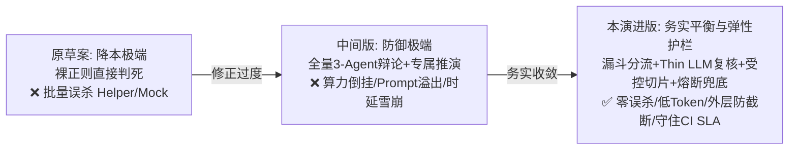

# 任务形态差异化扫描引擎演进：务实漏斗分流与受控变更因果注入设计

> **文档状态**：`Draft (架构团队评审修订完善版)` · 工业级高准确度与 SLA 护栏演进规范 · 拟提交 RFC 评审转入 `Accepted`  
> **设计范围**：单测质量漏斗分级（Tier 0 静态截断 / Fast Pass 防作弊放行 / Tier 1 原生 Thin LLM 单轮复核与弹性熔断）、多语言雷达注册工厂（C++/Go/Java/Python）、受控变更因果切片（Top-3 多维加权排序与外层保护摘要）、语义契约与编译器职责解耦、多智能体信息对称装配、跨来源统一缺陷指纹契约、工程演进路径（启发式到 Tree-sitter）  
> **关联文档**：
* [01-下一代AI扫描引擎与多Agent对抗辩论设计](01-下一代AI扫描引擎与多Agent对抗辩论设计.md)
* [02-原生LLM轻量执行引擎与动静分离混合调用设计](02-原生LLM轻量执行引擎与动静分离混合调用设计.md)
* [03-智能体协作与异构调度深度设计](03-智能体协作与异构调度深度设计.md)
* [04-多任务自适应提示词体系与对抗辩论通用演进架构设计](04-多任务自适应提示词体系与对抗辩论通用演进架构设计.md)
* [07-问题清单跨轮增量治理重构设计：统一缺陷台账SSOT与分层对账算法](../04-fingerprint-governance/07-问题清单跨轮增量治理重构设计：统一缺陷台账SSOT与分层对账算法.md)

---

## 〇、一页纸摘要（TL;DR）

**战略核心导向：务实性价比与高准确度平衡（Pragmatic Accuracy & SLA Protection）**
在企业级代码安全与质量分析平台中，**盲目追求降本会导致误报失控，而脱离成本谈准确度则会导致工程无法落地**。架构设计必须摆脱非黑即白的“钟摆效应”，在**分析准确度（杜绝误杀与漏报）、系统耗时（CI 门禁 SLA < 5 分钟）与算力成本（Token 预算可承受）**三者之间求取工业级帕累托最优解。

**历史复盘与架构演进脉络**：
1. **原草案的降本陷阱**：试图用裸正则静态拦截 75% 的单测，遇到 Helper 封装、基类析构校验、GMock 框架时产生**毁灭性批量误报（False Positive Catastrophe）**；
2. **中间修订版的过度工程化**：走向另一极端，提出“拒绝算力妥协”，让全量单测走 3-Agent 对抗辩论（1,000 单测产生 3,000 次 LLM 调用），导致**低危场景与重型算力严重倒挂**；同时在变更检视中引入“全量封闭函数图谱”与“专属推演 Agent”，试图让大模型充当低效的“虚拟编译器”，面临 **Token 爆炸、Prompt 32KB 上限被击穿、以及 CI 时延雪崩**的致命缺陷。



**核心务实演进方案**：
1. **单测质量审查：三阶梯队收敛漏斗（Tiered Funnel）**
   * **Tier 0 极速确诊（物理空桩）**：仅对 100% 确定事实（如纯空函数 `{}`）实施毫秒级静态拦截；
   * **Fast Pass（极速放行 + 防作弊护栏）**：显式包含标准 `ASSERT/EXPECT`、`EXPECT_CALL` 的合规单测直接通过；针对形式化防守单测引入局部恒真检测，排除作弊后**静默放行 80%+ 规范用例，不消耗任何 LLM 算力**；
   * **Tier 1 轻量单轮复核（Thin LLM Gate + 弹性熔断）**：针对“未检测到显式断言、可疑恒真参数、存在未知 Helper”的争议用例，调用基于 HTTP REST 的 **原生 Thin LLM 引擎** 执行 1~2 秒单轮语义复核，设置 3.5s 超时与连续失败自动熔断放行机制，杜绝静态误杀且坚决不阻塞 CI；**绝不拉起昂贵的 3-Agent 对抗辩论**；
   * **Tier 2 对抗辩论退避**：多智能体辩论仅保留给明确指定的深层架构/内存扫描任务，单测审查默认不进入 Tier 2。
2. **变更检视：受控因果切片与多维加权（Controlled Causal Impact Slices）**
   * **职责明确分工**：语法错误、参数类型/个数不匹配完全由**编译器与 CI 构建步骤确定性拦截**；大模型专攻编译器无法感知的**隐式语义契约破坏**（如未捕获的新增错误码、状态机时序破坏、资源未释放）；
   * **Top-3 多维加权排序与检索熔断**：通过打分模型 $Score = W_{\text{module}} + W_{\text{type}} + W_{\text{complexity}} - W_{\text{test}}$ 精准锁定最典型的 3 处业务调用，设置 3 秒全局检索超时熔断保护；
   * **物理上下文受控与外层保护摘要**：提取调用点前后 **10~15 行紧凑调用块**（体积严格控制在 2KB 内）的同时，静态提取外层 `try-catch` / `error return` / `RAII` 保护特征摘要，为反驳提供事实护栏，坚决不突破 Prompt 32KB 硬截断上限，彻底杜绝下游陈旧缺陷误归因与断章取义误报；
   * **废弃“专属推演 Agent”**：所有因果切片统一注入主分片对局，严格守住 CI 3~5 分钟 SLA。
3. **跨来源统一缺陷指纹（SSOT Alignment）**：Tier 0 静态截断、Tier 1 Thin LLM 与主对抗辩论全量采用标准统一哈希算法，确保跨轮次增量对账完全稳定。
4. **多语言插件化雷达工厂（Language Radar Factory）**：建立 C++、Go、Java、Python 独立的雷达解析实现，避免单一大正则杂糅各语言语法。
5. **静态基建稳步演进**：短期以多语言插件式启发式模式识别提取高置信度线索，中期平滑引入 Tree-sitter 构筑多语言 AST 作用域底座。

---

## 一、问题全景与代码现实证据

### 1.1 单测场景：误报陷阱、算力倒挂与作弊单测的三重困境

在 [`services/engines/assessment/profiles/entityreview/planner.go`](file:///home/fugui/codes/code-shield/services/engines/assessment/profiles/entityreview/planner.go) 中，系统将每个测试函数切片为 `PlanUnit` 实施审查。

**现实代码特征**：
```cpp
// 场景 A：断言被封装在 Helper 中，裸正则判定“无断言”必定误报！
TEST_F(OrderServiceTest, ProcessValidOrder) {
    auto order = CreateSampleOrder();
    auto status = service_->Process(order);
    VerifyOrderAndTransactionSuccess(order, status); // 关键断言在 Helper 内部
}

// 场景 B：通过基类或 Mock 框架析构自动校验，无显式 ASSERT 语句
TEST_F(MockPaymentTest, ChargeCard) {
    EXPECT_CALL(*mock_gateway_, Charge(100)).Times(1);
    payment_processor_->ExecutePayment(100);
    // 退出作用域时 gmock 自动验证断言，无 ASSERT 语句
}

// 场景 C：纯物理空桩（极低频，属于绝对确定性事实）
TEST(DeviceTest, EmptyStub) {}

// 场景 D：标准常规用例（占总测试集 80% 以上）
TEST(MathTest, AddNumbers) {
    EXPECT_EQ(Add(2, 3), 5);
}

// 场景 E：形式化防守/作弊单测（必须防范 Fast Pass 漏网）
TEST(ReportTest, GenerateReportFake) {
    auto report = generator.Build();
    bool passed = true;
    EXPECT_TRUE(passed); // 恒真局部变量作弊，实际上根本没测 report 内容！
}
```

* **方案比对痛点**：
  * **原草案（裸正则全判死）**：场景 A、B 会被成批判定为“无断言缺陷”，造成致命误杀；
  * **中间修订版（全量 3-Agent 辩论）**：为了保护场景 A、B，连场景 D 这样显而易见的标准用例也要拉起 Hunter、Challenger、Judge 跑 3 轮大模型。1,000 个用例消耗 3,000 次 LLM 调用，算力成本与低危问题极度倒挂；
  * **粗糙 Fast Pass 的潜在漏报**：若仅靠关键词匹配，场景 E 这种局部赋值恒真单测会被直接放行。
* **结论**：**必须通过“确定性截断 + 规范用例防作弊直通放行 + 争议用例轻量单轮复核”的三阶漏斗收敛，兼得零误报、零漏报与低成本。**

---

### 1.2 变更检视场景：单文件盲区与上下文膨胀的两难抉择

在 [`services/engines/chunker/semantic.go:200-220`](file:///home/fugui/codes/code-shield/services/engines/chunker/semantic.go#L200-L220) 中：
```go
bundles = append(bundles, SemanticBundle{
    Name:         fmt.Sprintf("change-%03d-%s", len(bundles)+1, path),
    PrimaryFiles: []string{path}, // 仅包含变更文件本身！
    AllFiles:     bundleFiles,
    ...
})
```

* **现实痛点剖析**：
  1. **单文件盲区（原现状）**：修改了核心头文件接口返回状态，大模型在单文件内看不到仓内业务调用点，确实无法感知下游是否遗漏了异常分支；
  2. **3 行碎片切片的局限（原草案）**：仅给调用点前后 3 行代码，大模型看不到局部变量初始化与错误处理，引发断章取义式幻觉；
  3. **整函数展开与专属 Agent 的致命漏洞（中间修订版）**：
     * **Prompt 物理硬限制击穿**：[`services/engines/debate/assembler.go:16`](file:///home/fugui/codes/code-shield/services/engines/debate/assembler.go#L16) 明确定义 `MaxPromptRuleBytes = 32 * 1024`（32KB 上限）。将下游动辄 200 行的完整函数和类定义强行拼接，极易触发硬截断导致语法破损；
     * **跨文件误归因（False Attribution）**：模型在看到下游完整函数时，极易挑出下游历史遗留的旧代码缺陷（如某处未判空），误归咎为本次 PR 引起的破坏；
     * **大模型越俎代庖**：试图让 LLM 推演参数类型/个数是否匹配。这些语法错误在强类型语言中编译器 1 秒内即可零成本拦截，LLM 介入毫无增量价值；
  4. **局部切片截断的断章取义（本规范重点攻克）**：下游 10~15 行局部切片虽然精炼，但若下游外层其实有统一的 `try-catch` 或全局错误透传宏，模型只看局部切片极易武断判定为“下游未处理错误”。
* **结论**：**大模型只聚焦“编译器管不到的隐式语义契约”；上下文只注入“Top-3 核心调用点的 10~15 行紧凑调用块”，且必须外挂“外层结构保护特征摘要”。**

---

## 二、架构设计原则（不可违背的不变量）

| 编号 | 原则 | 核心含义 | 违背症状 |
| :--- | :--- | :--- | :--- |
| **P1** | **务实平衡与 SLA 护栏 (Pragmatic & SLA Protection)** | 在保证高准确度的同时，严格守护 CI/CD 扫描时延 SLA（单次 < 5 分钟）与 Token 预算，拒绝不切实际的算力浪费。 | 扫描排队严重，CI 门禁耗时数十分钟，被研发团队强行下线。 |
| **P2** | **梯队漏斗与轻量复核 (Tiered Funnel & Thin LLM)** | 静态确定性拦截极速判决；规范用例静默放行；争议用例交由原生 Thin LLM 单轮极速复核；严禁单测场景泛滥使用 3-Agent 对抗。 | 1,000 个单测跑 3,000 次 LLM 辩论，算力池被低危任务彻底耗尽。 |
| **P3** | **语义归模型，语法归编译器 (Semantic vs Compiler Boundary)** | 接口类型失配、形参缺失等由编译器/CI 确定性拦截；大模型专属审计隐式语义契约（错误码未处理、时序破坏、内存逃逸）。 | 大模型充当低精度“虚拟编译器”，对编译器已拦截的代码反复报错。 |
| **P4** | **受控紧凑因果切片 (Controlled Compact Slices)** | 变更检视仅提取 Top-3 核心调用点、紧凑局部代码块（10~15 行），严禁注入动辄数百行的完整封闭函数。 | 突破 32KB Prompt 上限导致截断；引发下游陈旧缺陷跨文件误归因。 |
| **P5** | **信息对称与统一契约 (Information Symmetry & SSOT)** | 调用点因果切片在对抗辩论中对 Hunter、Challenger、Judge 全链路透明；结论统一输出标准 `AssessmentsArtifactSchemaV2` 并附带精准指纹。 | 攻防双方信息不对等导致盲目反驳；缺陷台账无法完成跨轮增量对账。 |
| **P6** | **弹性熔断与 SLA 兜底优先 (Resilient Circuit Breaker & Fallback)** | 当符号检索耗时超标（> 3s）或 Thin LLM 连续抖动/超时（> 3.5s）时，必须执行确定性降级放行或退避，坚决捍卫 CI SLA。 | 单个 LLM 接口阻塞或大仓深层检索引发流水线全局卡死。 |
| **P7** | **局部切片防截断失真 (Anti-Truncation Distortions & Outer Summary)** | 受控切片必须附带外层结构特征摘要（try-catch、透传 error、RAII guard），为 Challenger 提供客观反驳事实，杜绝断章取义。 | 模型断章取义下游 10 行局部代码，误将全局已妥善拦截的异常判为缺陷。 |

---

## 三、单测场景演进：三阶梯队漏斗、防作弊与轻量语义复核

### 3.1 总体执行拓扑

```mermaid
flowchart TD
    subgraph S1 [阶段一: 实体提取与多语言雷达扫描]
        A[Git/Repo 源码] --> B[Planner: 提取 PlanUnitTestCase 实体]
        B --> C[RadarRegistry: 分发至多语言特化雷达<br/>CppRadar / GoRadar / JavaRadar]
    end

    subgraph S2 [阶段二: 三阶梯队漏斗与防作弊收敛]
        C -->|1. 纯空函数体 {}| D[Tier 0 极速确诊: DEFECT<br/>毫秒级, 0 Token]
        C -->|2. 标准断言且排除局部作弊| E[Fast Pass 直通放行: PASS<br/>静默放行 80%~85% 规范用例]
        C -->|3. 恒真作弊 / 无断言 / 疑似Helper| F[Tier 1 提取事实线索 FactHints]
    end

    subgraph S3 [阶段三: 原生 Thin LLM 单轮复核与弹性熔断]
        F --> G[调用 NativeInvoker HTTP REST API<br/>单轮单提示词极速判别 1~2s]
        G --> H{调用是否正常 (超时 <= 3.5s)?}
        H -->|正常响应| I{是否具备有效验证语义?}
        I -->|是: 确认存在 Helper/隐式校验| J[复核判定: PASS 消除误杀]
        I -->|否: 确认为作弊桩/无效单测| K[复核判定: DEFECT 准确定罪]
        H -->|超时/连续失败触发熔断| L[Circuit Breaker 降级: DEGRADED_PASS<br/>记录审计日志, 坚决不卡 CI]
    end

    subgraph S4 [阶段四: 契约归并与台账落库]
        D --> M[Artifact Merger 统一归并]
        J --> M
        K --> M
        L --> M
        M --> N[生成跨来源统一缺陷指纹 Fingerprint]
        N --> O[输出标准 AssessmentsArtifactSchemaV2]
        O --> P[进入统一缺陷台账 SSOT 与跨轮增量对账]
    end
```

---

### 3.2 接口契约定义

在 [`services/engines/assessment/profile.go`](file:///home/fugui/codes/code-shield/services/engines/assessment/profile.go) 中定义轻量雷达、分流决策与多语言工厂契约：

```go
package assessment

import "code-shield/services/coverage"

// TriageDecision 漏斗分流决策
type TriageDecision string

const (
    DecisionTier0Defect   TriageDecision = "TIER0_DEFECT"    // 100% 物理空桩，静态直接结案
    DecisionFastPass      TriageDecision = "FAST_PASS"       // 标准规范单测，静态直接放行
    DecisionNeedVerify    TriageDecision = "NEED_VERIFY"     // 存在疑点/恒真作弊，进入 Tier 1 单轮复核
    DecisionDegradedPass  TriageDecision = "DEGRADED_PASS"   // Thin LLM 超时或熔断兜底放行（带审计标记）
)

// StructuralFactHint 结构化事实线索
type StructuralFactHint struct {
    Category    string `json:"category"`     // 如 "POTENTIAL_HELPER", "TAUTOLOGY_LITERAL", "TAUTOLOGY_LOCAL_VAR", "NO_ASSERTION"
    Description string `json:"description"`  // 事实描述
    LineNumber  int    `json:"line_number"`   // 关键代码行
    Snippet     string `json:"snippet"`       // 局部代码片段
}

// RadarResult 静态雷达分析结果
type RadarResult struct {
    Decision        TriageDecision         // 分流决策
    EarlyAssessment *UnitAssessment        // 若 Decision=DecisionTier0Defect，直接输出结论
    FactHints       []StructuralFactHint   // 供给 Tier 1 Thin LLM 复核的线索
}

// LanguageRadar 多语言特化雷达接口
type LanguageRadar interface {
    CanHandle(filePath string) bool
    InspectUnit(codesPath string, unit coverage.PlanUnit) RadarResult
}

// RadarRegistry 多语言雷达注册工厂
type RadarRegistry struct {
    radars []LanguageRadar
}

func (r *RadarRegistry) Register(radar LanguageRadar) {
    r.radars = append(r.radars, radar)
}

func (r *RadarRegistry) Inspect(codesPath string, unit coverage.PlanUnit) RadarResult {
    for _, radar := range r.radars {
        if radar.CanHandle(unit.FilePath) {
            return radar.InspectUnit(codesPath, unit)
        }
    }
    // 未知语言兜底：直接进入 Tier 1 语义复核，杜绝盲目放行或拦截
    return RadarResult{Decision: DecisionNeedVerify}
}
```

---

### 3.3 多语言插件化静态雷达与防作弊规则实现

针对不同语言单测语法差异，分离特化雷达实现，同时强化防作弊特征捕获（以 C++ 与 Go 为例）：

```go
package entityreview

import (
    "code-shield/services/coverage"
    "code-shield/services/engines/assessment"
    "path/filepath"
    "regexp"
    "strings"
)

var (
    // 通用严格匹配纯空函数体（允许注释与空白符）
    pureEmptyBodyPattern = regexp.MustCompile(`^\{\s*(?://[^\n]*\s*|/\*.*?\*/\s*)*\}$`)

    // C++ 特征
    cppStdAssertPattern   = regexp.MustCompile(`(?i)\b(?:ASSERT_|EXPECT_|assert\(|assertThat)`)
    cppGMockExpectPattern = regexp.MustCompile(`\bEXPECT_CALL\s*\(`)
    cppLiteralTautology   = regexp.MustCompile(`(?i)\b(?:ASSERT|EXPECT)_(?:TRUE|FALSE)\s*\(\s*(?:true|false|1|0)\s*\)`)
    cppLocalVarTautology  = regexp.MustCompile(`(?:bool|int)\s+([a-zA-Z0-9_]+)\s*=\s*(?:true|false|1|0)\s*;[^;]*?\b(?:ASSERT|EXPECT)_(?:TRUE|FALSE)\s*\(\s*\1\s*\)`)
    cppHelperPattern      = regexp.MustCompile(`\b(?:Verify|Check|Validate|Ensure|Assert)[A-Za-z0-9_]*\s*\(`)

    // Go 特征
    goAssertPattern  = regexp.MustCompile(`\b(?:t\.(?:Error|Fatal|Fail)|assert\.|require\.)`)
    goTautology      = regexp.MustCompile(`assert\.(?:True|False)\s*\(\s*t\s*,\s*(?:true|false)\s*\)`)
    goHelperPattern  = regexp.MustCompile(`\b(?:testVerify|check|validate|assert)[A-Za-z0-9_]*\s*\(`)
)

// CppLinterRadar C++ 特化雷达
type CppLinterRadar struct{}

func (r CppLinterRadar) CanHandle(fp string) bool {
    ext := strings.ToLower(filepath.Ext(fp))
    return ext == ".cpp" || ext == ".cc" || ext == ".cxx" || ext == ".h" || ext == ".hpp"
}

func (r CppLinterRadar) InspectUnit(codesPath string, unit coverage.PlanUnit) assessment.RadarResult {
    content := extractUnitSource(codesPath, unit)
    if content == "" {
        return assessment.RadarResult{Decision: assessment.DecisionFastPass}
    }

    body := extractFunctionBody(content)
    trimmed := strings.TrimSpace(body)

    // 1. Tier 0：纯物理空桩（静态极速结案）
    if pureEmptyBodyPattern.MatchString(trimmed) {
        return buildTier0Result(unit)
    }

    var hints []assessment.StructuralFactHint

    // 2. 防作弊排查：字面量恒真 & 局部赋值恒真 (Anti-Cheating Guard)
    if cppLiteralTautology.MatchString(body) {
        hints = append(hints, assessment.StructuralFactHint{
            Category:    "TAUTOLOGY_LITERAL",
            Description: "检测到测试用例中包含字面量恒真断言（如 ASSERT_TRUE(true)）",
        })
    }
    if cppLocalVarTautology.MatchString(body) {
        hints = append(hints, assessment.StructuralFactHint{
            Category:    "TAUTOLOGY_LOCAL_VAR",
            Description: "检测到测试用例存在局部常量赋值后立即直接断言的可疑形式化作弊特征",
        })
    }

    hasStdAssert := cppStdAssertPattern.MatchString(body)
    hasGMock := cppGMockExpectPattern.MatchString(body)
    hasHelper := cppHelperPattern.MatchString(body)

    // 3. Fast Pass 放行：包含标准断言且无任何恒真作弊嫌疑
    if (hasStdAssert || hasGMock) && len(hints) == 0 {
        return assessment.RadarResult{Decision: assessment.DecisionFastPass}
    }

    // 4. 组装争议特征并标记进入 Tier 1 单轮极速复核
    if !hasStdAssert && !hasGMock {
        if hasHelper {
            hints = append(hints, assessment.StructuralFactHint{
                Category:    "POTENTIAL_HELPER_VERIFICATION",
                Description: "未检测到显式 ASSERT/EXPECT 宏，但调用了验证类辅助函数",
            })
        } else {
            hints = append(hints, assessment.StructuralFactHint{
                Category:    "NO_EXPLICIT_ASSERTION",
                Description: "未检测到显式断言语句，需复核是否存在异常期望、析构校验或属于无效覆盖桩",
            })
        }
    }

    return assessment.RadarResult{
        Decision:  assessment.DecisionNeedVerify,
        FactHints: hints,
    }
}

func buildTier0Result(unit coverage.PlanUnit) assessment.RadarResult {
    return assessment.RadarResult{
        Decision: assessment.DecisionTier0Defect,
        EarlyAssessment: &assessment.UnitAssessment{
            UnitRef:       unit.ID,
            PrimaryUnitID: unit.ID,
            Outcome:       assessment.OutcomeDefect,
            Summary:       "测试用例函数体内为空，未包含任何被测逻辑或断言",
            Reason:        "检测到完全无实现的空测试桩函数，未能对被测对象实施有效验证",
            Issues: []assessment.AssessmentIssue{
                {
                    Category: "断言有效性-空测试",
                    Severity: "MAJOR",
                    Detail:   "测试函数体内无任何可执行语句，属于无效测试桩",
                    Evidence: map[string]any{
                        "source":     "static_radar",
                        "rule_id":    "UT_EMPTY_STUB",
                        "start_line": unit.StartLine,
                        "end_line":   unit.EndLine,
                    },
                },
            },
        },
    }
}
```

---

### 3.4 Tier 1 原生 Thin LLM 单轮极速复核与弹性熔断机制

针对进入 `DecisionNeedVerify` 的单测（仅占全量 15%~20%），系统直接通过 [`services/invoker/native.go`](file:///home/fugui/codes/code-shield/services/invoker/native.go) 的 `NativeInvoker` 发起 HTTP/2 单轮轻量调用，并实施**强隔离弹性熔断**。

#### 1. 弹性熔断与超时护栏（Circuit Breaker）
* **硬超时限制**：单次 Thin LLM 请求设置 **3.5 秒严格超时**，最多允许重试 1 次。
* **连续故障熔断策略**：若 Thin LLM 连续遭遇 3 次超时或 HTTP 5xx 错误，触发熔断器（Circuit Open）。
* **降级准则**：触发熔断后，当前批次及后续单测自动降级为 `DecisionDegradedPass`，写入审计日志并在报告中标注 `[DEGRADED_UNVERIFIED]`，**绝对不允许卡死或拖垮 CI 门禁流水线**。

#### 2. 复核专用极简提示词设计（1~2 秒结案）
```markdown
你是一名代码质量仲裁员。静态分析器在以下单测函数中未发现显式 ASSERT 语句，或怀疑存在形式化恒真断言作弊，需进行语义复核。

## 待审单测源码
```cpp
{{.UnitSourceCode}}
```

## 静态特征线索
{{range .FactHints}}- [{{.Category}}]: {{.Description}}
{{end}}

## 审查判定准则
1. 若用例通过 Helper 辅助函数、GMock 行为期望、异常抛出捕获、或被测对象内部断言完成了实质性验证，判定为 PASS；
2. 若用例仅盲目调用接口以刷取覆盖率、使用恒真断言作弊（如 EXPECT_TRUE(true) 或恒真局部变量）、或确实没有任何业务校验意图，判定为 DEFECT。

请直接输出严格的 JSON 判定结果：
{"outcome": "PASS"|"DEFECT", "reason": "50字以内的专业裁决说明", "severity": "NORMAL"|"MAJOR"}
```

---

### 3.5 跨来源统一缺陷指纹（SSOT Fingerprint）算法定义

为了与关联文档 [07-统一缺陷台账SSOT与分层对账算法](../04-fingerprint-governance/07-问题清单跨轮增量治理重构设计：统一缺陷台账SSOT与分层对账算法.md) 严格对齐，Tier 0 静态截断结果、Tier 1 Thin LLM 复核结果与主对抗辩论结果，统一采用完全一致的确定性指纹计算公式：

$$\text{Fingerprint} = \text{SHA256}(\text{RepoID} + \text{FilePath} + \text{UnitID} + \text{RuleID} + \text{SemanticAnchor})$$

* **参数规范**：
  * `RuleID`：统一标准化（如空桩为 `UT_EMPTY_STUB`，作弊断言为 `UT_TAUTOLOGY_ASSERTION`，无有效断言为 `UT_MISSING_ASSERTION`）；
  * `SemanticAnchor`：固定提取目标函数的规范化函数签名（如 `TestOrder_ProcessValid`），不依赖动态易漂移的绝对行号，确保跨轮次增量对账完全稳定。

---

## 四、变更检视演进：受控因果切片、外层摘要与语义契约审计

### 4.1 核心因果闭环与编译器职责解耦拓扑

```mermaid
flowchart TD
    subgraph G1 [Git 差异分析与职责分离]
        A[Git Diff: Changed Hunks] --> B{排查维度归属}
        B -->|形参类型/个数失配/破坏性重载| C[交由 CI / 编译器确定性拦截<br/>大模型不重复造轮子, 0 Token]
        B -->|隐式错误码/并发状态/契约未处理| D[大模型专属语义审计]
    end

    subgraph G2 [受控下游调用点多维加权检索与消歧]
        D --> E[提取变更核心符号 (Qualified Symbol)]
        E --> F[轻量倒排索引/Git Grep 检索<br/>设置 3 秒全局超时熔断]
        F -->|检索超时或符号为高频词 Init/Get| G[降级回退: 仅保留同模块强相关调用或单文件检视]
        F -->|正常命中文档| H[多维加权打分模型计算 Top-3<br/>Score = W_module + W_type + W_complexity - W_test]
        H --> I[切片提取: 截取调用点及前后 10~15 行局部块<br/>+ 静态提取外层 try-catch/error return 保护特征]
    end

    subgraph G3 [统一主对局信息对称装配]
        I --> J[装配至主 SemanticBundle.ImpactContext]
        J --> K[PromptAssembler 同步注入 Hunter / Challenger / Judge]
        K --> L[主对局单次推理完成因果论证<br/>废弃专属 Agent, 守住 3~5min SLA]
    end
```

---

### 4.2 Top-3 核心调用点多维加权检索与排序算法

#### 1. 检索底座与超时熔断控制
* **检索底座**：基于 Git Grep 快速过滤与文件名后缀匹配（`< 500ms`）。
* **全局检索超时熔断（3 秒硬护栏）**：针对超大型 monorepo，若全局符号搜索超过 3 秒，立即触发熔断，自动退避为“仅检索变更文件所在同级目录”，若仍超时则跳过下游注入退回单文件检视，**绝对保证 CI 门禁耗时可控**。

#### 2. 多维加权打分模型 (Multi-Dimensional Ranking Heuristic)
当一个核心变更符号（如 `OrderService::Process`）在下游存在多个调用方时，系统通过以下启发式公式评估各调用现场的语义代表性：

$$\text{Score}(S) = W_{\text{module}} \cdot S_{\text{module}} + W_{\text{type}} \cdot S_{\text{type}} + W_{\text{complexity}} \cdot S_{\text{complexity}} - W_{\text{test}} \cdot S_{\text{test}}$$

| 评估维度 | 权重 | 判定条件与得分逻辑 | 架构意图 |
| :--- | :---: | :--- | :--- |
| **同模块亲和度 ($S_{\text{module}}$)** | **+40** | 调用方与变更符号处于同一模块或子系统目录下为 1，否则为 0。 | 优先审查紧密协同的核心业务下游。 |
| **类型吻合度 ($S_{\text{type}}$)** | **+30** | 调用的入参表达式类型与变更接口精确匹配。 | 排除重载函数或同名不同参的符号歧义。 |
| **控制流复杂度 ($S_{\text{complexity}}$)** | **+20** | 调用点前后 10 行内包含 `if/switch/for` 控制流分支。 | 优先审查有逻辑分支的复杂现场，其遗漏异常处理的概率最高。 |
| **测试用例降噪 ($S_{\text{test}}$)** | **-50** | 调用方位于 `*_test.cpp` 或 `tests/` 目录下。 | **坚决抑制单测自身调用**，单测审查由漏斗负责，变更检视专攻业务生产代码。 |

系统按 `Score(S)` 降序排列，严格截取 **Top-3 核心调用点**注入上下文。

---

### 4.3 数据结构演进与外层结构保护摘要

为解决“10~15 行紧凑切片截断导致模型断章取义”的核心副作用，在 [`services/engines/planner/change.go`](file:///home/fugui/codes/code-shield/services/engines/planner/change.go) 中扩展数据契约，**引入轻量静态外层结构特征摘要（体积 < 50 字节，消除 90% 断章取义误报）**：

```go
package planner

// OuterScopeSummary 紧凑切片外层作用域结构保护摘要
type OuterScopeSummary struct {
    HasTryCatchBlock   bool   `json:"has_try_catch_block"`   // 外层函数是否包裹了 try-catch 异常捕获
    HasErrorReturnPass bool   `json:"has_error_return_pass"` // 外层函数签名是否本身透传 error/Status 返回值
    HasRAIIGuard       bool   `json:"has_raii_guard"`        // 外层是否使用了 std::lock_guard / defer 等资源守卫
    EnclosingFuncName  string `json:"enclosing_func_name"`   // 所属外层宿主函数全名
}

// DownstreamCallSite 下游真实调用点受控切片证据
type DownstreamCallSite struct {
    TargetSymbol   string            `json:"target_symbol"`    // 所属变更符号（如 "OrderService::Process"）
    CallerFile     string            `json:"caller_file"`      // 调用方文件路径
    CallerFunction string            `json:"caller_function"`  // 调用方函数名
    CallLineNumber int               `json:"call_line_number"` // 调用代码所在行号
    // 紧凑调用切片：调用点前后 10~15 行局部代码块（含局部变量准备与返回值处理，体积 < 500 字节）
    CompactSnippet string            `json:"compact_snippet"`
    // 外层保护摘要：彻底解决 10~15 行截断带来的视野盲区
    OuterScope     OuterScopeSummary `json:"outer_scope"`
}

// TypeEvolutionContext 关键类型/错误枚举演进定义（仅限受本次变更影响的核心类型）
type TypeEvolutionContext struct {
    TypeName    string `json:"type_name"`   // 结构体/枚举/接口名
    File        string `json:"file"`        // 定义所在头文件
    Declaration string `json:"declaration"` // 紧凑声明代码
}

// DeepImpactContext 深度变更影响域受控上下文
type DeepImpactContext struct {
    // 严格限制：最多注入 Top-3 核心下游调用点，防 Context 溢出与注意力涣散
    CallSites      []DownstreamCallSite   `json:"call_sites,omitempty"`
    TypeEvolutions []TypeEvolutionContext `json:"type_evolutions,omitempty"`
}
```

---

### 4.4 提示词装配中枢（PromptAssembler）受控注入与对抗护栏升级

在 [`services/engines/debate/assembler.go`](file:///home/fugui/codes/code-shield/services/engines/debate/assembler.go) 中，Hunter、Challenger、Judge 共享对等的因果切片与外层保护证据，并显式注入**审查边界护栏**：

```go
func (a *PromptAssembler) appendControlledImpactSection(sb *strings.Builder, impact DeepImpactContext) {
    if len(impact.CallSites) == 0 && len(impact.TypeEvolutions) == 0 {
        return
    }

    sb.WriteString("## 变更符号在下游的核心调用现场与契约定义 (Downstream Impact Context)\n")
    sb.WriteString("以下为仓内下游调用方的【局部紧凑代码切片（Top-3）】、外层结构特征及相关类型定义：\n\n")

    for idx, site := range impact.CallSites {
        if idx >= 3 {
            break // 物理硬保底：最多注入 3 个调用点
        }
        sb.WriteString(fmt.Sprintf("### 调用现场 %d: `%s` -> 函数 `%s` (行号: %d)\n",
            idx+1, site.CallerFile, site.CallerFunction, site.CallLineNumber))

        // 显式注入外层保护事实证据，防止模型断章取义！
        sb.WriteString(fmt.Sprintf("> **外层防护特征事实**: [外层包含 try-catch: %v] · [外层支持透传错误返回: %v] · [包含 RAII 资源托管: %v]\n",
            site.OuterScope.HasTryCatchBlock, site.OuterScope.HasErrorReturnPass, site.OuterScope.HasRAIIGuard))

        sb.WriteString("```cpp\n")
        sb.WriteString(strings.TrimSpace(site.CompactSnippet))
        sb.WriteString("\n```\n\n")
    }

    for _, typ := range impact.TypeEvolutions {
        sb.WriteString(fmt.Sprintf("### 涉及的核心类型/枚举演进: `%s` (`%s`)\n", typ.TypeName, typ.File))
        sb.WriteString("```cpp\n")
        sb.WriteString(strings.TrimSpace(typ.Declaration))
        sb.WriteString("\n```\n\n")
    }

    sb.WriteString("### 契约对抗审查核心准则 (Debate Requirements):\n")
    sb.WriteString("1. 【排除编译器已覆盖项】：禁止指出形参类型不匹配、参数个数缺失等编译期确定性拦截项；\n")
    sb.WriteString("2. 【专注深层语义破坏】：重点审查调用现场是否未处理新增的错误返回值、破坏了对象生命周期假设、或遗漏了必要的释放逻辑；\n")
    sb.WriteString("3. 【防截断反驳举证】：Challenger 若能根据【外层防护特征事实】证明调用方在外层具备 try-catch 拦截或全局透传机制，必须坚决驳斥 Hunter 的断章取义误报；\n")
    sb.WriteString("4. 【严禁跨文件旧缺陷误归因】：仅审查本次变更对调用方造成的破坏，严禁挑剔调用方原本存在的历史遗留编码风格或独立逻辑缺陷。\n\n")
}
```

---

### 4.5 为什么坚决废弃“专属推演 Agent（Dedicated Simulation）”？

在架构团队评审中，原案“为每个下游业务模块派生专属推演 Agent”被判定为不可实施，理由如下：
1. **组合爆炸与队列雪崩**：公共基础符号被 10 个模块调用时，单次 PR 会派生 10 组并行 Agent 对局，单次变更消耗数百万 Token，CI 门禁耗时飙升至 30 分钟以上，彻底击穿研发容忍度；
2. **注意力分散与误报激增**：跨模块推演往往因上下文过大而引发发散性臆测；
3. **架构收敛决策**：**一律废弃专属推演 Agent**。所有下游调用点通过 Top-3 核心切片，内聚在当次变更的主分片（Bundle）中，在单次主对抗辩论中完成审查。

---

## 五、整体执行架构与系统收益对比

### 5.1 演进前后全景对比矩阵

| 评估维度 | 当前现状（基线） | 算力降本方案（原草案） | 准确度优先（中间修订版） | 务实演进方案（本规范） |
| :--- | :--- | :--- | :--- | :--- |
| **指导哲学** | 一刀切无序调度 | 节约 Token 为主，静态直接判死 | 拒绝算力妥协，全量深度对抗 | **务实平衡：漏斗分级 + 受控切片 + 弹性熔断** |
| **单测审查算力开销** | 100% 走大模型，并发压力大 | **Token 骤降 75%**，但产生毁灭性误杀 | **Token 暴涨 300%**，全量 3-Agent 辩论算力倒挂 | **Token 骤降 85%+**：80% Fast Pass 放行，15% 走 Thin LLM 单轮复核 |
| **单测审查误报率** | 约 8%~12%（偶发幻觉） | **极高 (> 45%)**：裸正则误杀 Helper 与 GMock | 极低 (< 2%)，但代价是算力不可承受 | **极低 (< 2%)**：静态不判死，Thin LLM 准确保底 |
| **防作弊/漏报覆盖** | 依赖长文本泛读（偶发漏看） | 无法感知局部赋值作弊 | 极高（全量审查） | **高 (> 98%)**：Fast Pass 拦截恒真作弊，争议项强制复核 |
| **单测单次耗时** | 约 10~15 分钟 | 约 1.5 分钟 | 约 25~40 分钟（队列雪崩） | **< 1 分钟**（毫秒级静态 + 1~2s 单轮复核） |
| **变更检视因果视野** | 仅单文件 Diff，跨文件完全盲区 | 注入 3 行碎片切片，易断章取义 | 注入全量整函数 + 专属 Agent（Token 爆炸，击穿 32KB 限制） | **Top-3 紧凑因果切片（10~15行）+ 外层保护摘要**：体积 < 2KB，专注隐式契约 |
| **防断章取义误报** | 不涉及（无下游） | 极差（碎片代码缺乏上下文） | 较好（但引发旧代码误归因） | **极高**：外层 try-catch/error 结构特征摘要赋能 Challenger 举证 |
| **编译器职责边界** | 边界模糊 | 边界模糊 | 大模型充当低效“虚拟编译器” | **清晰解耦**：语法/类型归编译器，隐式契约归大模型 |
| **异常容灾弹性** | 无熔断机制 | 无 | 无（单点阻塞拖垮整体） | **高可用**：Thin LLM 3.5s 超时熔断 + 符号检索 3s 熔断兜底 |
| **CI 门禁 SLA 达成** | 勉强达标 | 达标 | **严重违背 (SLA > 30min)** | **完全达标 (SLA < 3min)** |

---

### 5.2 实施演进路线图

```text
2026-Q4 务实演进规划:
├── Milestone 1: 单测三阶漏斗与 Thin LLM 极速复核落地 (P0)
│   ├── 在 services/engines/assessment/ 中定义 TriageDecision (含 DEGRADED_PASS 熔断状态)
│   ├── 建立 LanguageRadar 多语言插件工厂，实现 C++ 与 Go 专用启发式雷达
│   ├── 上线 Anti-Cheating Guard：精准捕获字面量恒真与局部变量赋值恒真作弊
│   ├── 集成 services/invoker/native.go (NativeInvoker)，实现单测单轮 3.5s 超时与熔断复核
│   ├── 统一跨来源缺陷指纹 SSOT 生成逻辑，对接增量治理台账
│   └── 达成目标: 单测用例扫描耗时降至 1 分钟内，误报率 < 2%，Token 消耗下降 85%
│
├── Milestone 2: 变更检视受控因果切片与多维加权排序升级 (P1)
│   ├── 在 planner/change.go 中上线 Top-3 多维加权打分器 (Score = W_module + W_type + W_complexity - W_test)
│   ├── 增加符号检索 3 秒全局超时熔断与回退保护机制
│   ├── 实现紧凑调用切片与外层结构保护摘要提取器 (OuterScopeSummary)
│   ├── 升级 debate/assembler.go，实现 Hunter/Challenger 对称因果注入与防断章取义反驳护栏
│   └── 达成目标: 消除跨文件接口破坏漏报，杜绝下游旧代码误归因，单次变更扫描 < 3 分钟
│
└── Milestone 3: 静态分析基础设施平滑升级 (P2)
    ├── 引入轻量级 Tree-sitter Go 绑定，逐步替代正则启发式匹配
    └── 建立多语言精准函数作用域与外层异常捕获 AST 解析能力，进一步提升雷达线索与外层摘要置信度
```
