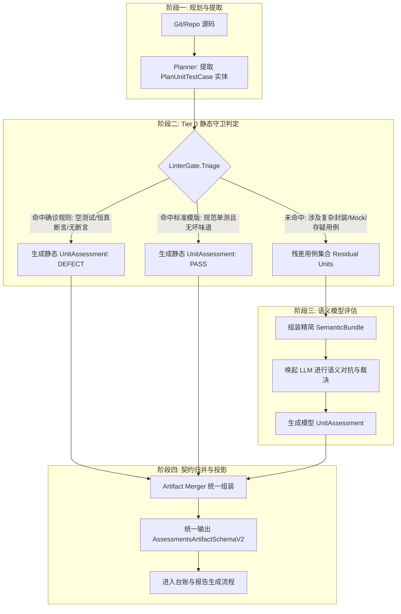

# 任务形态差异化扫描引擎演进：轻量 LinterGate 动静分流与变更影响域上下文注入设计

> **文档状态**：`Draft (待评审)` · 拟提交 RFC 评审后转入 `Accepted`  
> **设计范围**：执行引擎分级算力调度、轻量任务静态守卫（Linter Gate）、变更检视反向调用点切片注入（Impact Context Graph）、双层语义分片与输出契约合并  
> **关联文档**：
> * [01-下一代AI扫描引擎与多Agent对抗辩论设计](01-下一代AI扫描引擎与多Agent对抗辩论设计.md)
> * [02-原生LLM轻量执行引擎与动静分离混合调用设计](02-原生LLM轻量执行引擎与动静分离混合调用设计.md)
> * [03-智能体协作与异构调度深度设计](03-智能体协作与异构调度深度设计.md)
> * [04-多任务自适应提示词体系与对抗辩论通用演进架构设计](04-多任务自适应提示词体系与对抗辩论通用演进架构设计.md)
> * [07-问题清单跨轮增量治理重构设计：统一缺陷台账SSOT与分层对账算法](../04-fingerprint-governance/07-问题清单跨轮增量治理重构设计：统一缺陷台账SSOT与分层对账算法.md)

---

## 〇、一页纸摘要（TL;DR）

**痛点背景**：
在 Code-Shield 完成 4 阶梯智能体调度（Hunter / Challenger / Judge / Synthesis）与统一缺陷台账（SSOT）重构后，系统在“全量深层缺陷（死锁/内存泄漏）”场景表现出了极高的判决准确率。然而，在面对不同**业务形态**的扫描任务时，当前引擎暴露出了明显的**算力与上下文双重失配**：
1. **轻量规则重度化（算力倒挂）**：在“测试用例有效性（`ut-effectiveness`）”等场景中，大量缺陷属于 100% 确诊的语法事实（如空测试函数体、`ASSERT_TRUE(true)` 永真断言、无任何断言）。系统当前缺乏前置过滤，盲目将成百上千个用例切分成数十个 Bundle 全部送入大模型，导致 Token 消耗膨胀 70%+，扫描耗时在无意义的语法判断中长达十余分钟，且容易受到模型生成抖动的影响。
2. **变更检视局部化（上下文盲区）**：在“近期变更检视（`change-review`）”场景中，大模型最核心的审计价值在于排查**跨文件接口契约破坏、破坏性演进与下游回归隐患**。然而，当前 Chunker 仅将发生变更的文件本身（`PrimaryFiles`）打包注入分片，大模型犹如“盲人摸象”，无法获知下游业务代码到底在何处调用、如何传参，导致高价值的跨文件变更缺陷无法被有效召回。

**核心结论与演进方案**：
本设计提出**“轻量前置拦截 + 深度依赖供给”**的双轨自适应引擎增强方案：
1. **轻量场景：落地 Tier 0 Deterministic Linter Gate（动静分流架构）**  
   在 Planner 切割出测试实体后，引入轻量静态 AST / 规则解析守卫，确诊绝大多数“空测试体”、“恒真断言”、“无断言”及“规范简单用例”。静态确诊结果直接生成 `AssessmentsArtifactSchemaV2`，**仅将存疑的复杂语义残差用例打包交给 LLM**。预计可压降 75% 以上的用例模型调用量，提速 5~8 倍。
2. **变更检视场景：落地 Impact Context Graph（反向调用与影响域注入）**  
   在解析 Git Diff 时，提取变更触碰的核心符号（函数名/类/枚举/宏），利用轻量全局符号倒排索引检索仓内 **Top N 核心下游调用点（Call Sites）**。将调用点代码切片（`CallSiteEvidence`）作为扩展背景上下文注入 `SemanticBundle`，并通过 Prompt Assembler 引导大模型重点审查下游参数失配与契约回归。

---

## 一、问题全景与代码现实证据

### 1.1 算力倒挂：测试用例场景的重型调用浪费

在 [`services/engines/assessment/profiles/entityreview/planner.go`](file:///home/fugui/codes/code-shield/services/engines/assessment/profiles/entityreview/planner.go) 与 [`prompt.go`](file:///home/fugui/codes/code-shield/services/engines/assessment/profiles/entityreview/prompt.go) 中：
* Planner 将每个测试函数识别为 `coverage.PlanUnitTestCase`，按 `maxUnits = 10` 切分为 Bundle；
* **现状**：每一个 Bundle 均触发一次完整的 Agent / LLM 交互。对于包含 1,000 个测试用例的中大型工程，系统将生成 100 个 Bundle，并发调用 100 次大模型。
* **代码证据**：
  ```text
  // 现实中大量测试用例呈现极其直观的语法事实：
  TEST(DeviceTest, EmptyStub) {
      // 空测试体，未包含任何断言与逻辑
  }
  TEST(ConfigTest, Tautology) {
      ASSERT_TRUE(true); // 恒真断言
  }
  ```
  让 100B+ 参数级别的大模型去逐行阅读空花括号 `{}` 并推理“这是否是空测试”，造成了极大的算力浪费与偶发幻觉。

### 1.2 上下文盲区：变更检视中的单文件孤岛

在 [`services/engines/chunker/semantic.go:200-215`](file:///home/fugui/codes/code-shield/services/engines/chunker/semantic.go#L200-L215) 中：
```go
for _, path := range orderedPaths {
    pathUnits := byPath[path]
    bundleFiles := make([]string, 0, 1)
    if _, err := os.Stat(filepath.Join(codesPath, filepath.FromSlash(path))); err == nil {
        bundleFiles = append(bundleFiles, path)
    }
    for start := 0; start < len(pathUnits); start += maxUnits {
        bundles = append(bundles, SemanticBundle{
            Name:         fmt.Sprintf("change-%03d-%s", len(bundles)+1, path),
            PrimaryFiles: []string{path}, // 仅包含变更文件本身！
            AllFiles:     bundleFiles,    // 仅包含变更文件本身！
            MacroContext: macroContext,
            HeaderOutline: headerOutline,
            PrimaryUnits: pathUnits[start:end],
        })
    }
}
```
* **现状**：分片内仅包含了变更文件本身（`path`），以及全局的宏与公共头文件大纲（`HeaderOutline`）。
* **后果**：如果开发者修改了 `include/auth_service.h` 中的接口签名（如增加必填入参、修改返回错误码），大模型完全看不到仓内业务代码（如 `src/login_handler.cpp`、`src/order_service.cpp`）是如何调用该接口的。大模型无法做出“未适配下游契约破坏”的断言，变更检视退化为了“单文件局部代码规范审查”。

---

## 二、架构设计原则（不可违背的不变量）

| 编号 | 原则 | 核心含义 | 违背症状 |
| :--- | :--- | :--- | :--- |
| **P1** | **确定性优先 (Deterministic First)** | 凡是能够在 AST / 正则 / 语法层 100% 确定识别的事实，严禁下发给 LLM。 | 基础语法事实发生偶发性幻觉；Token 预算被浅层问题吞噬。 |
| **P2** | **残差收敛 (Residual Minimization)** | 静态守卫只过滤两极（确诊缺陷 / 确诊合格），任何不确定、含复杂封装的用例统一落入残差由 LLM 处理。 | 静态规则误判复杂测试（如辅助断言宏），造成误报。 |
| **P3** | **调用影响闭环 (Impact Completeness)** | 变更检视必须具备“变更点 + 核心调用点（Call Sites）”的联合上下文视野。 | 无法检出跨文件接口契约破坏，变更检视沦为鸡肋。 |
| **P4** | **统一契约对外透明 (Schema Transparency)** | 无论是静态守卫确诊还是 LLM 生成的结论，在出具前必须完全统一为标准的 `AssessmentsArtifactSchemaV2`。 | 下游台账与报告层需要为静态规则和 AI 结果写两套解析代码。 |

---

## 三、轻量场景演进：Linter Gate 动静分流架构

### 3.1 总体执行拓扑



### 3.2 接口契约定义

在 [`services/engines/assessment/profile.go`](file:///home/fugui/codes/code-shield/services/engines/assessment/profile.go) 中新增 `LinterGate` 抽象：

```go
package assessment

import "code-shield/services/coverage"

// TriageResult 静态守卫分流结果
type TriageResult struct {
    Handled    bool           // 是否由静态规则直接裁决
    Assessment UnitAssessment // 若 Handled=true，对应的确定性结论
}

// LinterGate 轻量静态前置守卫
type LinterGate interface {
    // Triage 对单个 PlanUnit 进行纯语法/AST 确定性审查
    Triage(codesPath string, unit coverage.PlanUnit) TriageResult
}
```

### 3.3 规则确诊实现（以 `entityreview` 为例）

在 [`services/engines/assessment/profiles/entityreview/`](file:///home/fugui/codes/code-shield/services/engines/assessment/profiles/entityreview/) 中落地规则分流器：

```go
// linter_gate.go
package entityreview

import (
    "code-shield/services/coverage"
    "code-shield/services/engines/assessment"
    "regexp"
    "strings"
)

var (
    // 匹配空函数体（忽略空格与纯注释）
    emptyBodyPattern = regexp.MustCompile(`^\{\s*(?://[^\n]*\s*|/\*.*?\*/\s*)*\}$`)
    // 匹配恒真/无效断言
    tautologyPatterns = []*regexp.Regexp{
        regexp.MustCompile(`(?i)\b(?:ASSERT|EXPECT)_(?:TRUE|FALSE)\s*\(\s*(?:true|false|1|0)\s*\)`),
        regexp.MustCompile(`(?i)\b(?:ASSERT|EXPECT)_EQ\s*\(\s*([a-zA-Z0-9_]+)\s*,\s*\1\s*\)`),
        regexp.MustCompile(`(?i)\bassert\s*\(\s*1\s*\)`),
    }
    // 匹配任何断言关键字
    anyAssertionPattern = regexp.MustCompile(`(?i)\b(?:ASSERT_|EXPECT_|assert\(|assertThat|self\.assert)`)
)

type EntityLinterGate struct{}

func (EntityLinterGate) Triage(codesPath string, unit coverage.PlanUnit) assessment.TriageResult {
    content := extractUnitSource(codesPath, unit)
    if content == "" {
        return assessment.TriageResult{Handled: false}
    }

    body := extractFunctionBody(content)

    // 1. 确诊缺陷：空测试体
    if emptyBodyPattern.MatchString(body) {
        return assessment.TriageResult{
            Handled: true,
            Assessment: assessment.UnitAssessment{
                UnitRef:     unit.ID,
                Outcome:     assessment.OutcomeDefect,
                Explanation: "测试用例函数体内无任何可执行测试代码或断言，属于无效空用例",
                Issues: []assessment.AssessmentIssue{
                    {
                        Category: "断言有效性-空测试",
                        Severity: "MAJOR",
                        Message:  "测试函数为空，未实施任何被测行为校验",
                    },
                },
            },
        }
    }

    // 2. 确诊缺陷：恒真断言
    for _, pattern := range tautologyPatterns {
        if loc := pattern.FindStringIndex(body); len(loc) > 0 {
            return assessment.TriageResult{
                Handled: true,
                Assessment: assessment.UnitAssessment{
                    UnitRef:     unit.ID,
                    Outcome:     assessment.OutcomeDefect,
                    Explanation: "测试用例中包含恒真断言，无法有效验证业务逻辑分支",
                    Issues: []assessment.AssessmentIssue{
                        {
                            Category: "断言有效性-永真断言",
                            Severity: "MAJOR",
                            Message:  "断言参数恒等于真，未能反映实际业务期望",
                        },
                    },
                },
            }
        }
    }

    // 3. 确诊缺陷：完全缺失断言且无异常期待
    if !anyAssertionPattern.MatchString(body) && !strings.Contains(body, "throw") && !strings.Contains(body, "catch") {
        return assessment.TriageResult{
            Handled: true,
            Assessment: assessment.UnitAssessment{
                UnitRef:     unit.ID,
                Outcome:     assessment.OutcomeDefect,
                Explanation: "测试用例未调用任何断言机制，且无异常捕获校验",
                Issues: []assessment.AssessmentIssue{
                    {
                        Category: "断言有效性-预期结果不完整",
                        Severity: "NORMAL",
                        Message:  "未包含任何验证断言",
                    },
                },
            },
        }
    }

    // 4. 残差保留：存在断言、调用了外部 helper、或逻辑复杂，放行交给 LLM 深度审查
    return assessment.TriageResult{Handled: false}
}
```

---

## 四、变更检视演进：反向依赖与影响域上下文注入

### 4.1 上下文注入机制设计

为了打破单文件孤岛，变更检视分片由原先的“单文件模式”升级为**“变更目标 + 影响域切片（Impact Slices）”**双层上下文：

```mermaid
flowchart LR
    subgraph G1 [Git 差异分析]
        A[Git Diff: Changed Hunks] --> B[符号提取: 函数签名 / 类 / 枚举 / 宏]
    end

    subgraph G2 [轻量影响域图谱]
        B --> C[全局符号倒排索引 / ripgrep 极速扫描]
        C --> D[过滤非变更业务文件: 提取 Call Sites]
        D --> E[生成 CallSiteEvidence 切片 (文件/行号/前序后序代码)]
    end

    subgraph G3 [动态提示词与分片装配]
        E --> F[装配 SemanticBundle.ImpactEvidence]
        F --> G[PromptAssembler: 注入下游调用契约指示]
        G --> H[LLM 审计: 聚焦参数失配 / 异常逃逸 / 破坏性变更]
    end
```

### 4.2 数据结构演进

在 [`services/engines/chunker/semantic.go`](file:///home/fugui/codes/code-shield/services/engines/chunker/semantic.go) 中扩展 `SemanticBundle`：

```go
// CallSiteEvidence 下游调用点切片证据
type CallSiteEvidence struct {
    TargetSymbol string `json:"target_symbol"` // 所属变更符号 (如 "UserService::Update")
    CallerFile   string `json:"caller_file"`   // 调用方文件 (如 "src/api/controller.cpp")
    LineNumber   int    `json:"line_number"`   // 调用代码行
    Snippet      string `json:"snippet"`       // 紧凑调用切片 (包含调用处及前后 3 行)
}

// SemanticBundle 扩展字段
type SemanticBundle struct {
    Name          string
    PrimaryFiles  []string
    HeaderFiles   []string
    AllFiles      []string
    MacroContext  map[string]string
    NegativeRules []string
    HeaderOutline string
    PrimaryUnits  []coverage.PlanUnit
    // 新增：下游调用点切片（不将整个 caller 文件加入 AllFiles，防 Context 溢出）
    ImpactEvidence []CallSiteEvidence `json:"impact_evidence,omitempty"`
}
```

### 4.3 提示词装配中枢（PromptAssembler）升级

在 [`services/engines/debate/assembler.go`](file:///home/fugui/codes/code-shield/services/engines/debate/assembler.go) 中增加调用证据呈现段落：

```go
func (a *PromptAssembler) appendImpactEvidenceSection(sb *strings.Builder, bundle chunker.SemanticBundle) {
    if len(bundle.ImpactEvidence) == 0 {
        return
    }

    sb.WriteString("## 变更符号在下游模块的核心调用点 (Downstream Call Sites)\n")
    sb.WriteString("本次提交修改了部分核心符号。以下为仓内已有下游业务模块对该符号的真实调用现场：\n\n")

    for _, evidence := range bundle.ImpactEvidence {
        sb.WriteString(fmt.Sprintf("### 调用点: `%s:%d` (对应符号 `%s`)\n", 
            evidence.CallerFile, evidence.LineNumber, evidence.TargetSymbol))
        sb.WriteString("```cpp\n")
        sb.WriteString(strings.TrimSpace(evidence.Snippet))
        sb.WriteString("\n```\n\n")
    }

    sb.WriteString("### 契约兼容性重点审计要求:\n")
    sb.WriteString("1. 请结合上述调用现场，核对本次变更是否导致调用方传入参数失配或未适配破坏性改动；\n")
    sb.WriteString("2. 若变更引入了新的错误状态或异常，请审查上述调用方是否具备对应的捕获或兜底逻辑；\n")
    sb.WriteString("3. 严格禁止脱离上述真实调用点凭空推测兼容性问题。\n\n")
}
```

---

## 五、整体执行架构与系统收益

### 5.1 改进前后对比矩阵

| 评估维度 | 当前现状（现状） | 演进后（改进版） | 关键突破 |
| :--- | :--- | :--- | :--- |
| **测试用例扫描算力** | 100% 走 LLM，1,000 用例需 100 次并发大模型交互 | **Tier 0 静态守卫先行**，75%~85% 用例在毫秒级被静态确诊，仅 15%~25% 复杂用例走 LLM | **Token 消耗直降 75%+**，扫描耗时由 12 分钟压缩至 1.5 分钟内，且消除了基础语法幻觉。 |
| **变更检视分析深度** | 仅将单文件变更 hunk 塞给模型，无法感知调用方 | **轻量倒排索引提取 Top N 核心调用点切片**，作为只读契约证据注入分片 | 真正具备**跨文件接口契约与回归风险审计能力**，大幅提高变更检视的高价值缺陷召回率。 |
| **模型调度精准度** | 各种任务类型一刀切走分片调度 | **根据 Profile（`is_assessment` / `is_change`）自适应装配动静流水线** | 算力消耗与业务任务复杂度高度匹配，避免“杀鸡用牛刀”。 |

### 5.2 实施演进路线图

```text
2026-Q4 演进规划:
├── Milestone 1 (P1): 测试用例静态分流守卫 (Linter Gate)
│   ├── 在 services/engines/assessment/ 中定义 LinterGate 接口与 Triage 机制
│   ├── 实现 C++/Java/Python 基础空测试、恒真断言静态规则库
│   └── 在 entityreview 规划器中落地两阶段分流合并 (预期节省 75% Token)
│
└── Milestone 2 (P2): 变更检视影响域图谱 (Impact Context Graph)
    ├── 在 planner/change.go 中增加 Hunk 触碰符号提取器
    ├── 在 chunker/ 中实现基于 ripgrep/ctags 的轻量反向调用点切片提取器
    ├── 扩充 SemanticBundle.ImpactEvidence 字段
    └── 在 PromptAssembler 中上线下游调用点契约审查指示模板
```
