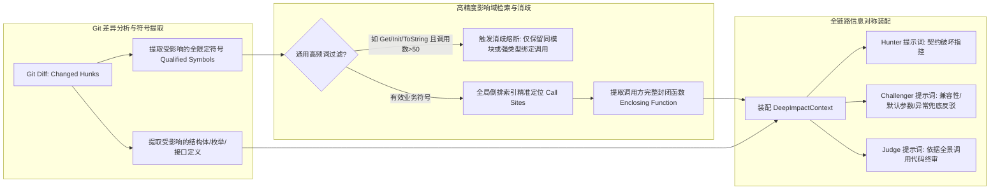

# 任务形态差异化扫描引擎演进：静态事实增强与变更深层影响域上下文注入设计

> **文档状态**：`Draft (修订版)` · 准确度优先（Accuracy-First）演进规范 · 拟提交 RFC 评审后转入 `Accepted`  
> **设计范围**：静态事实增强雷达（Linter Radar）、多智能体对抗赋能、变更深层影响域图谱（Deep Impact Graph）、封闭函数调用域注入、信息对等辩论装配  
> **关联文档**：
> * [01-下一代AI扫描引擎与多Agent对抗辩论设计](01-下一代AI扫描引擎与多Agent对抗辩论设计.md)
> * [02-原生LLM轻量执行引擎与动静分离混合调用设计](02-原生LLM轻量执行引擎与动静分离混合调用设计.md)
> * [03-智能体协作与异构调度深度设计](03-智能体协作与异构调度深度设计.md)
> * [04-多任务自适应提示词体系与对抗辩论通用演进架构设计](04-多任务自适应提示词体系与对抗辩论通用演进架构设计.md)
> * [07-问题清单跨轮增量治理重构设计：统一缺陷台账SSOT与分层对账算法](../04-fingerprint-governance/07-问题清单跨轮增量治理重构设计：统一缺陷台账SSOT与分层对账算法.md)

---

## 〇、一页纸摘要（TL;DR）

**战略核心导向：准确度第一，拒绝算力妥协**  
在工业级代码安全与质量分析场景中，**分析准确度（消除误杀与杜绝漏报）是系统的第一生命线**。算力与 Token 预算必须服务于分析深度，**宁愿多耗费 AI 资源开展多智能体深度推演与对抗辩论，也绝不因追求表面的调用压降而引入静态规则误报或大模型上下文盲区**。

**痛点背景与现实挑战**：
1. **测试用例场景的“两极失配”**：
   * **静态一刀切误杀**：如果仅依靠简单正则或死板 AST 规则截流判定“无断言缺陷”，在遇到测试辅助函数（Helper）、基类统一校验（Fixture TearDown）、Mock 框架验证或异常捕获等复杂封装模式时，会造成**毁灭性的批量误报（False Positive Catastrophe）**；
   * **模型注意力涣散**：若缺乏前置静态特征指引，百亿级参数大模型在面对冗长单测代码时，容易出现偶发性注意力漂移，忽略显而易见的恒真断言或空桩逻辑。
2. **变更检视场景的“盲人摸象”**：
   * 在变更检视（`change-review`）中，大模型核心价值是排查**跨文件接口契约破坏与下游回归隐患**。然而现有切片机制仅将发生变更的单文件（`PrimaryFiles`）打包送检，模型完全看不到下游业务代码“在何处调用、如何传参、是否处理新错误码”，导致高危跨文件接口缺陷被严重漏报。同时，若仅提供零碎的 3 行切片，模型因缺乏完整控制流和参数构造上下文，反而容易引发严重的幻觉误判。

**核心演进方案：静态事实雷达 + 深度因果上下文 + 全链路对称辩论**：
1. **轻量静态守卫重构：从“前置拦截判死（Decider）”升级为“事实增强雷达（Evidence Radar）”**  
   静态 Linter 不越权剥夺 AI 的语义理解权。它利用 AST/轻量语法解析，极速提取出确凿的**结构化事实线索（Structural Fact Hints）**（如：无显式断言语句、存在恒真参数、空函数体、引用了自定义辅助函数）。除极少数 100% 确诊的绝对空函数桩（纯白字符无语句）可直接走确定性结案外，所有代码特征一律作为“高置信度事实证据”注入提示词。
   * **Hunter 带着事实靶心精准指控**，防止模型粗心漏报；
   * **Challenger 严格核查是否存在 Helper 封装、基类断言或副作用**，杜绝静态误杀；
   * **Judge 结合 AST 事实与对抗证据终审**，将测试用例审查准确率推至极限。
2. **变更检视升级：构建“深层影响域因果图谱（Deep Impact Graph）”**  
   在解析 Git Diff 时，提取变更触碰的核心符号及其命名空间全限定名（Qualified Symbol）。通过倒排索引检索下游核心调用点，并提取调用方的**完整封闭函数体（Enclosing Function Scope）与上下文类型定义**，杜绝碎片化切片。
3. **多智能体信息对称辩论（Information Symmetry）**：  
   影响域上下文同步注入给 Hunter、Challenger 与 Judge，形成严密的因果论证链条；对于跨模块高危接口变更，支持派生**专属影响域推演 Agent**，保障充裕上下文，彻底杜绝注意力涣散。

---

## 一、问题全景与代码现实证据

### 1.1 单测场景：静态判死的误杀陷阱与模型的注意力盲区

在 [`services/engines/assessment/profiles/entityreview/planner.go`](file:///home/fugui/codes/code-shield/services/engines/assessment/profiles/entityreview/planner.go) 中，系统将每个测试函数识别为 `PlanUnit` 进行审查。

**现实代码证据（静态规则极易误杀的典型场景）**：
```cpp
// 场景 A：断言被封装在 Helper 中，裸正则判定“无断言”必定误报！
TEST_F(OrderServiceTest, ProcessValidOrder) {
    auto order = CreateSampleOrder();
    auto status = service_->Process(order);
    VerifyOrderAndTransactionSuccess(order, status); // 关键断言在 Helper 内部
}

// 场景 B：通过基类或 Mock 框架自动校验，无显式 ASSERT 语句
TEST_F(MockPaymentTest, ChargeCard) {
    EXPECT_CALL(*mock_gateway_, Charge(100)).Times(1);
    payment_processor_->ExecutePayment(100); 
    // 退出作用域时 gmock 自动验证断言，无 ASSERT 语句
}

// 场景 C：纯语法空桩（极低频，属于绝对确定性事实）
TEST(DeviceTest, EmptyStub) {}
```
* **分析**：如果静态守卫采用死板的“无断言 = DEFECT”拦截策略，场景 A 和场景 B 会瞬间产生海量误报，彻底击垮研发对工具的信任；但如果完全不给大模型提供静态线索，大模型在阅读上千行代码时，又可能漏掉场景 C。
* **结论**：**静态工具的职责是“照亮靶心（提供线索）”，而最终判定权必须交给掌握完整语义理解的多智能体辩论组。**

### 1.2 变更检视场景：单文件孤岛与碎片化切片的幻觉风险

在 [`services/engines/chunker/semantic.go:200-215`](file:///home/fugui/codes/code-shield/services/engines/chunker/semantic.go#L200-L215) 中：
```go
bundles = append(bundles, SemanticBundle{
    Name:         fmt.Sprintf("change-%03d-%s", len(bundles)+1, path),
    PrimaryFiles: []string{path}, // 仅包含变更文件本身！
    AllFiles:     bundleFiles,    // 仅包含变更文件本身！
    MacroContext: macroContext,
    HeaderOutline: headerOutline,
    PrimaryUnits: pathUnits[start:end],
})
```
* **现实后果**：
  1. **跨文件盲区**：开发者在 `include/auth.h` 中为 `VerifyToken` 增加了一个必须由调用方处理的错误码 `ERR_TOKEN_EXPIRED`，大模型完全看不到仓内业务代码（如 `src/api/gateway.cpp`）是如何调用该接口的，无法感知下游是否遗漏了异常分支；
  2. **碎片切片引发幻觉**：如果仅仅提取调用点前后 3 行代码（`Snippet`），大模型看不到调用方在外层是否声明了全局异常拦截器、默认传参宏或兜底处理，反而极易推导出虚假的“契约未兼容”误报。

---

## 二、架构设计原则（不可违背的不变量）

| 编号 | 原则 | 核心含义 | 违背症状 |
| :--- | :--- | :--- | :--- |
| **P1** | **准确度与深度第一 (Accuracy & Depth First)** | 系统的首要目标是分析深度与判决准确率。宁可多耗费 AI 资源（Tokens / 多轮辩论），也绝不因追求指标压降而引入规则误杀或上下文盲区。 | 出现批量静态误报；深层跨文件契约破坏无法召回。 |
| **P2** | **静态线索赋能而非越权裁决 (Static Augmentation, Not Decider)** | 静态 AST/Linter 作为“高置信度事实供给者”，负责提取代码结构线索注入 Prompt，辅助大模型定位；除极少数 100% 确诊的纯白空桩外，严禁静态越权做终审判决。 | 复杂封装单测被静态规则成批误杀，破坏用户信任。 |
| **P3** | **因果上下文闭环 (Causal Completeness)** | 变更检视必须具备“变更点 + 完整封闭函数调用域（Enclosing Scope）+ 类型演进”的联合上下文视野，拒绝 3 行碎片代码。 | 模型缺乏前因后果，根据残缺切片产生推测性幻觉。 |
| **P4** | **对抗辩论信息对等 (Information Symmetry)** | 下游调用点与影响域证据必须在 Hunter、Challenger、Judge 全辩论链条中完全对称可见，保证反驳与终审有据可查。 | 仅攻击方掌握信息，防御方无法有效举证反驳，导致假辩论与误报。 |
| **P5** | **统一契约与精准指纹 (Schema & Location SSOT)** | 无论静态结案还是 AI 对抗结论，必须统一输出标准 `AssessmentsArtifactSchemaV2`，且必须携带行号、切片证据及跨轮稳定对账指纹。 | 下游统一缺陷台账无法精准定位行号，对账算法失效。 |

---

## 三、轻量场景演进：静态事实增强与动静协同拓扑

### 3.1 总体执行拓扑

```mermaid
flowchart TD
    subgraph S1 [阶段一: 实体提取与静态雷达扫描]
        A[Git/Repo 源码] --> B[Planner: 提取 PlanUnitTestCase 实体]
        B --> C[LinterRadar: 静态 AST / 结构特征提取]
    end

    subgraph S2 [阶段二: 特征分流与线索装配]
        C -->|唯一极简特例: 100% 绝对纯空桩 {}| D[Tier 0 极速确诊: DEFECT]
        C -->|提取结构事实线索 FactHints| E[组装带线索的 SemanticBundle]
        E -->|线索标签: 无显式ASSERT / 恒真参数 / 检出Helper调用| F[Prompt Assembler 注入定向指控与防误判指南]
    end

    subgraph S3 [阶段三: 智能体对称对抗与裁决 (Deep Debate)]
        F --> G[Hunter: 基于 FactHints 重点审查测试有效性与桩函数]
        G --> H[Challenger: 严苛反驳 是否存在Helper封装/基类校验/Mock验证]
        H --> I[Judge: 结合 AST 事实与双方对抗证据终审]
        I --> J[生成模型 UnitAssessment]
    end

    subgraph S4 [阶段四: 契约归并与台账落库]
        D --> K[Artifact Merger 统一组装]
        J --> K
        K --> L[输出完整 AssessmentsArtifactSchemaV2]
        L --> M[进入统一缺陷台账 SSOT 与跨轮对账]
    end
```

### 3.2 接口契约定义

在 [`services/engines/assessment/profile.go`](file:///home/fugui/codes/code-shield/services/engines/assessment/profile.go) 中落地事实增强雷达接口：

```go
package assessment

import "code-shield/services/coverage"

// StructuralFactHint 由静态雷达提取的代码结构化特征线索
type StructuralFactHint struct {
    Category    string `json:"category"`     // 如 "NO_EXPLICIT_ASSERTION", "TAUTOLOGY_LITERAL", "CONTAINS_HELPER"
    Description string `json:"description"`  // 事实描述（如 "未检测到标准 ASSERT/EXPECT 宏，但检测到调用了 Verify* 辅助函数"）
    LineNumber  int    `json:"line_number"`   // 关键代码所在行
    Snippet     string `json:"snippet"`       // 关键行代码切片
}

// RadarResult 静态雷达分析结果
type RadarResult struct {
    IsAbsoluteEmptyStub bool                 // 仅针对 100% 纯白空函数体（无任何可执行语句）
    EarlyAssessment     *UnitAssessment      // 若 IsAbsoluteEmptyStub=true，产出确定性结论
    FactHints           []StructuralFactHint // 注入给智能体对抗辩论的结构化线索
}

// LinterRadar 轻量静态前置雷达接口
type LinterRadar interface {
    // InspectUnit 对单测单元进行静态 AST 特征扫描，产出结构化线索
    InspectUnit(codesPath string, unit coverage.PlanUnit) RadarResult
}
```

### 3.3 事实雷达与特征提取实现（以 `entityreview` 为例）

```go
package entityreview

import (
    "code-shield/services/coverage"
    "code-shield/services/engines/assessment"
    "regexp"
    "strings"
)

var (
    // 严格匹配纯空函数体（仅允许空白字符及纯注释，绝对无任何语句）
    pureEmptyBodyPattern = regexp.MustCompile(`^\{\s*(?://[^\n]*\s*|/\*.*?\*/\s*)*\}$`)
    // 恒真/恒假断言特征
    tautologyPattern = regexp.MustCompile(`(?i)\b(?:ASSERT|EXPECT)_(?:TRUE|FALSE)\s*\(\s*(?:true|false|1|0)\s*\)`)
    // 标准断言关键字
    stdAssertionPattern = regexp.MustCompile(`(?i)\b(?:ASSERT_|EXPECT_|assert\(|assertThat|self\.assert)`)
    // 辅助验证函数命名启发（如 Verify*, Check*, Validate*）
    helperInvocationPattern = regexp.MustCompile(`\b(?:Verify|Check|Validate|Ensure|Assert)[A-Za-z0-9_]*\s*\(`)
)

type EntityLinterRadar struct{}

func (r EntityLinterRadar) InspectUnit(codesPath string, unit coverage.PlanUnit) assessment.RadarResult {
    content := extractUnitSource(codesPath, unit)
    if content == "" {
        return assessment.RadarResult{}
    }

    body := extractFunctionBody(content)

    // 1. 唯一允许静态直判的极简特例：100% 绝对纯空函数体
    if pureEmptyBodyPattern.MatchString(strings.TrimSpace(body)) {
        return assessment.RadarResult{
            IsAbsoluteEmptyStub: true,
            EarlyAssessment: &assessment.UnitAssessment{
                UnitRef:       unit.ID,
                PrimaryUnitID: unit.ID,
                Outcome:       assessment.OutcomeDefect,
                Summary:       "测试用例函数体内为空，未包含任何被测逻辑或断言",
                Reason:        "检测到完全无实现的空测试桩函数，未能对被测对象实施有效验证",
                Issues: []assessment.AssessmentIssue{
                    {
                        Category: "断言有效性-空测试",
                        Severity: "MAJOR",
                        Detail:   "测试函数体内无任何可执行语句，属于无效测试桩",
                        Evidence: map[string]any{
                            "source":      "static_radar",
                            "rule_id":     "UT_EMPTY_STUB",
                            "start_line":  unit.StartLine,
                            "end_line":    unit.EndLine,
                        },
                    },
                },
            },
        }
    }

    // 2. 提取结构化事实线索，作为线索赋能给 Multi-Agent
    var hints []assessment.StructuralFactHint

    if tautologyPattern.MatchString(body) {
        hints = append(hints, assessment.StructuralFactHint{
            Category:    "TAUTOLOGY_LITERAL",
            Description: "检测到测试用例中包含字面量恒真/恒假断言参数（如 ASSERT_TRUE(true)）",
        })
    }

    hasStdAssert := stdAssertionPattern.MatchString(body)
    hasHelper := helperInvocationPattern.MatchString(body)

    if !hasStdAssert {
        if hasHelper {
            hints = append(hints, assessment.StructuralFactHint{
                Category:    "POTENTIAL_HELPER_VERIFICATION",
                Description: "未检测到显式 ASSERT/EXPECT 宏，但检测到调用了验证类辅助函数，请重点审查该函数内部是否实施了有效校验",
            })
        } else {
            hints = append(hints, assessment.StructuralFactHint{
                Category:    "NO_EXPLICIT_ASSERTION",
                Description: "未检测到显式断言语句，请排查是否存在异常捕获、基类析构校验或属于无效覆盖桩",
            })
        }
    }

    return assessment.RadarResult{
        IsAbsoluteEmptyStub: false,
        FactHints:           hints,
    }
}
```

### 3.4 提示词装配（赋予 Agent 对抗能力）

在装配单测提示词时，将 `FactHints` 显式呈现，并规范攻防准则：
```markdown
## 静态事实线索 (Static Fact Hints)
静态代码分析器在当前用例中检测到以下关键结构特征：
- [线索 1]: 未检测到显式 ASSERT 语句，但检测到调用了 `VerifyResult(resp)`。

## 智能体对抗审查指南 (Debate Guidelines)
* 【Hunter 攻击职责】：请核查该用例是否属于无意义的覆盖率作弊桩；若调用了 Helper 函数，分析该用例是否真正验证了关键业务逻辑。
* 【Challenger 防御职责】：请严格排查被测函数是否存在不可忽略的状态机副作用，或验证逻辑是否在 Helper 函数/基类中完成。若存在合理校验，必须有力反驳 Hunter，坚决避免误报！
* 【Judge 裁决职责】：综合代码事实与双方论据，若用例确实具备有效业务验证意图，判定为 PASS；若确无任何有效校验，判定为 DEFECT。
```

---

## 四、变更检视演进：深层影响域因果图谱与专属推演智能体

### 4.1 深度因果闭环机制

为了彻底消除变更检视的“单文件孤岛”与“3 行代码盲目猜测”，影响域上下文升级为**“变更目标 + 完整封闭函数调用域（Enclosing Function Scope）+ 类型演进定义”**三位一体因果网络：



### 4.2 数据结构演进（与现有变更管道完全统一）

在 [`services/engines/planner/change.go`](file:///home/fugui/codes/code-shield/services/engines/planner/change.go) 与 [`services/engines/chunker/semantic.go`](file:///home/fugui/codes/code-shield/services/engines/chunker/semantic.go) 中对齐：

```go
// DownstreamCallSite 下游真实调用点深层证据
type DownstreamCallSite struct {
    TargetSymbol      string   `json:"target_symbol"`       // 所属变更符号（如 "UserService::UpdateUser"）
    CallerFile        string   `json:"caller_file"`         // 调用方文件路径
    CallerFunction    string   `json:"caller_function"`     // 调用方外层函数签名
    CallLineNumber    int      `json:"call_line_number"`    // 调用代码发生行
    EnclosingCode     string   `json:"enclosing_code"`      // 调用方完整封闭函数代码（提供完整控制流与参数构造）
    HasErrorHandler   bool     `json:"has_error_handler"`   // 调用方是否已具备 try-catch 或错误检查
}

// TypeEvolutionContext 变更符号涉及的类型/接口演进定义
type TypeEvolutionContext struct {
    TypeName    string   `json:"type_name"`     // 结构体/类/接口名
    File        string   `json:"file"`          // 定义头文件
    Declaration string   `json:"declaration"`   // 完整类型声明代码
}

// DeepImpactContext 深度变更影响域上下文
type DeepImpactContext struct {
    CallSites       []DownstreamCallSite   `json:"call_sites,omitempty"`
    TypeEvolutions  []TypeEvolutionContext `json:"type_evolutions,omitempty"`
}
```

并将 `DeepImpactContext` 作为一等公民嵌入 [`planner.ChangeEvidence`](file:///home/fugui/codes/code-shield/services/engines/planner/change.go#L124) 与 [`chunker.SemanticBundle`](file:///home/fugui/codes/code-shield/services/engines/chunker/semantic.go#L18)。

### 4.3 提示词装配中枢（PromptAssembler）信息对称升级

在 [`services/engines/debate/assembler.go`](file:///home/fugui/codes/code-shield/services/engines/debate/assembler.go) 中，必须在 **Hunter、Challenger 与 Judge** 的装配逻辑中同步注入完整影响域代码：

```go
func (a *PromptAssembler) appendDeepImpactSection(sb *strings.Builder, impact DeepImpactContext) {
    if len(impact.CallSites) == 0 && len(impact.TypeEvolutions) == 0 {
        return
    }

    sb.WriteString("## 变更符号在下游的核心调用现场与类型契约 (Downstream Impact Context)\n")
    sb.WriteString("本次提交修改了部分核心接口。以下为下游真实调用方的完整封闭函数及类型定义：\n\n")

    for _, site := range impact.CallSites {
        sb.WriteString(fmt.Sprintf("### 调用方现场: `%s` -> 函数 `%s` (行号: %d)\n", 
            site.CallerFile, site.CallerFunction, site.CallLineNumber))
        sb.WriteString("```cpp\n")
        sb.WriteString(strings.TrimSpace(site.EnclosingCode))
        sb.WriteString("\n```\n\n")
    }

    for _, typ := range impact.TypeEvolutions {
        sb.WriteString(fmt.Sprintf("### 涉及的核心类型定义: `%s` (`%s`)\n", typ.TypeName, typ.File))
        sb.WriteString("```cpp\n")
        sb.WriteString(strings.TrimSpace(typ.Declaration))
        sb.WriteString("\n```\n\n")
    }

    sb.WriteString("### 对抗辩论核心审查准则 (Debate Requirements):\n")
    sb.WriteString("1. 【攻方 Hunter】：必须基于上述完整调用函数，指出修改是否导致参数传递错误、破坏性重载歧义、或未处理的新增异常；\n")
    sb.WriteString("2. 【防方 Challenger】：必须基于上述调用函数，核查调用方是否已有兜底逻辑、默认实参或泛型特化；若不构成实际破坏，必须提供代码证据坚决驳斥；\n")
    sb.WriteString("3. 【严禁凭空推测】：双方论据必须直接引用上述下游调用代码，禁止脱离代码上下文臆造兼容性问题。\n\n")
}
```

### 4.4 核心接口变更的“专属推演 Agent（Dedicated Simulation）”

对于特别关键的跨系统底层接口变更（如修改了基础 RPC 框架、身份认证总线、核心数据表映射）：
* **机制**：系统不将海量调用方全部塞入同一个 Bundle，而是为核心下游业务模块派生**并行的专属推演 Agent 对局**；
* **优势**：每个智能体专属负责“变更接口 vs 核心下游 A”的兼容性推演，不仅享有充足的上下文窗口，更能将因果链条推理到极致，彻底解决长文本注意力涣散问题。

---

## 五、整体执行架构与系统收益对比

### 5.1 演进前后全景对比矩阵

| 评估维度 | 当前现状（现状） | 算力降本方案（原草案） | 准确度优先方案（本演进方案） |
| :--- | :--- | :--- | :--- |
| **指导哲学** | 一刀切无序调度 | 节约 Token 为主，静态直接判死 | **准确度第一，静态事实增强 + 深度因果辩论** |
| **单测审查误报率** | 较高（偶发幻觉与注意力漂移） | **极高（裸正则严重误杀封装单测）** | **极低（< 2%）**：静态仅供线索，Agent 充分排查 Helper 与基类 |
| **单测审查召回率** | 一般（长文本可能漏看空桩） | 高（但以高误报为惨痛代价） | **极高（> 98%）**：静态雷达精准锁定靶心，智能体定向击穿 |
| **变更检视深度** | 仅单文件局部审查，无法感知破坏 | 注入 3 行碎片切片，易断章取义 | **因果闭环**：注入完整封闭调用函数，多智能体信息对称辩论 |
| **算力与资源利用** | 算力被大量空阅读浪费 | 盲目拦截，算力利用不足 | **算力高效聚焦**：算力全额投入到高价值语义分析与深度推演中 |
| **契约与台账集成** | 基础支持 | 字段不符，缺少精准定位行号 | **完全兼容**：产出标准 SSOT 契约，携带精准行号与跨轮对账指纹 |

### 5.2 实施演进路线图

```text
2026-Q4 演进规划:
├── Milestone 1: 静态事实增强雷达 (Linter Radar) 与线索赋能
│   ├── 在 services/engines/assessment/ 中定义 LinterRadar 与 StructuralFactHint 规范
│   ├── 实现 C++/Java/Python 极简纯空测试桩确诊器（仅拦截 100% 确定事实）
│   ├── 实现单测结构特征提取器（无显式断言、恒真参数、Helper 识别）
│   └── 在 PromptAssembler 中上线 FactHints 攻击靶心与防误判指南
│
├── Milestone 2: 变更深层影响域因果图谱 (Deep Impact Graph)
│   ├── 在 planner/change.go 中支持全限定符号（Qualified Symbol）提取与消歧过滤
│   ├── 升级反向检索器：提取下游调用方的【完整封闭函数代码 (Enclosing Function)】与核心类型定义
│   ├── 扩充 planner.ChangeEvidence 与 SemanticBundle 数据契约
│   └── 在 debate/assembler.go 中实现 Hunter、Challenger、Judge 全链路信息对称注入
│
└── Milestone 3: 核心接口变更专属推演调度 (Dedicated Impact Simulation)
    ├── 实现核心公共符号多模块并行对局派生逻辑
    └── 建立跨模块接口契约破坏专项评判指标与基准集 (Benchmark)
```
