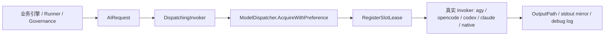
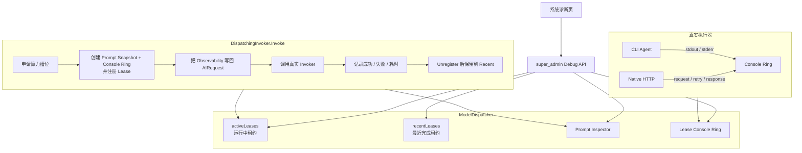
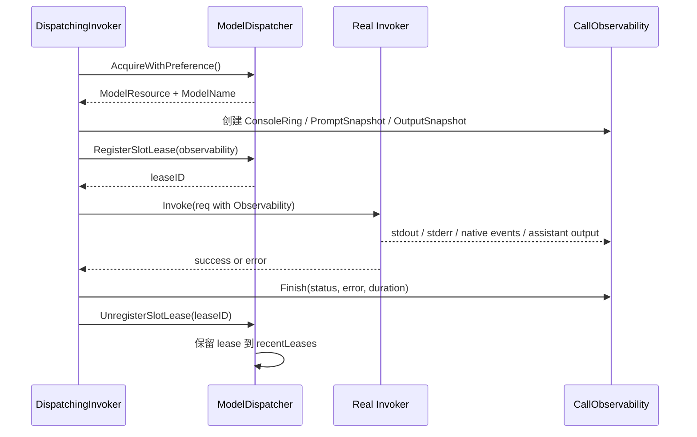
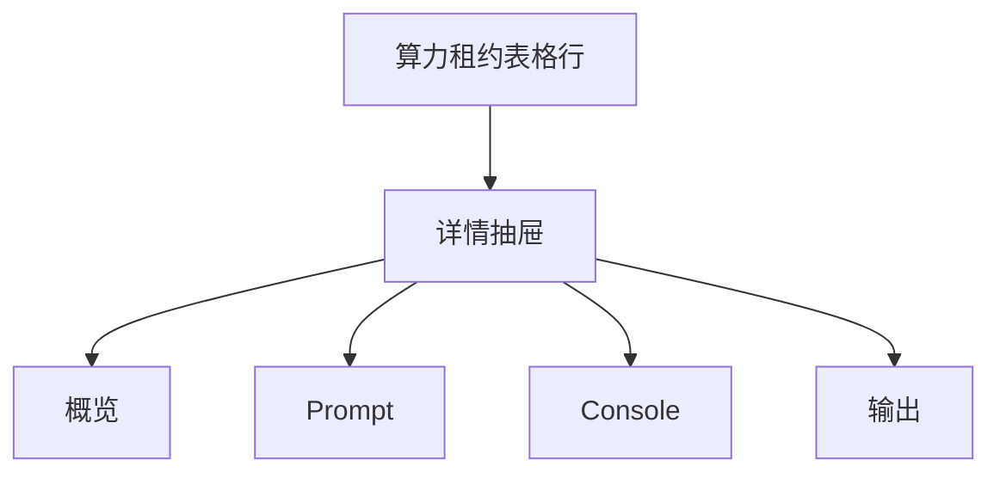

# Code-Shield 算力池实时提示词与 Agent 控制台透视设计

## 一、 背景与目标

当前「LLM 算力池实时看板」已经可以展示活跃槽位对应的算力节点、模型、报告、仓库、任务类型、执行阶段、微任务和持续时长。但它缺少排障时最关键的三类信息：

1. 本次调用实际使用的提示词、提示词模板和输入文件范围；
2. Agent CLI 或 Native LLM 的运行过程输出；
3. 调用结束前的模型返回、错误、重试和降级过程。

本设计在不改变现有调度和执行模型的前提下，为每个活跃算力槽位补充只读透视能力：

* 展示本次调用的提示词详情；
* 捕获 Agent CLI 的 stdout / stderr；
* 记录 Native LLM 请求生命周期和模型返回；
* 提供一个类 Console 的只读日志面板；
* 仅允许 `super_admin` 查看完整提示词和运行输出；
* 不提供向运行中 Agent 写入 stdin 的交互式终端。

### 1.1 目标

| 目标 | 说明 |
| --- | --- |
| 调用级透视 | 每个槽位租约对应一次 LLM / Agent 调用，可查看节点、模型、Prompt、输出和日志 |
| 只读 Console | 可实时查看 stdout、stderr、模型响应与生命周期事件，但不能发送命令 |
| 最小权限 | 完整 Prompt 和 Console API 只注册在 `super_admin` 权限组 |
| 有界内存 | Prompt、Console、最近完成租约均有上限，避免大仓扫描拖垮服务 |
| 零业务副作用 | 不改变任务状态、Agent 行为、LLM 请求、文件内容和数据库业务数据 |

### 1.2 非目标

* 不提供交互式 Shell，不向 Agent 进程写入 stdin；
* 不修改或重放 LLM 请求；
* 不在普通用户报告中暴露源码片段、系统提示词或 Agent 日志；
* 不新增数据库表，不写业务数据，不持久化历史调用；服务重启后实时观测数据可以丢失；
* 不写新的服务端诊断文件；
* 不为了观测开启 Native streaming，不修改模型请求参数；
* 不读取输入文件内容；
* 不记录 API Key、Authorization Header、完整环境变量或模型服务凭据。

### 1.3 零副作用硬约束

本特性只允许两类“写入”：**进程内存中的诊断快照**和**诊断响应的 HTTP 输出**。除必要的服务访问日志外，不得引入其他持久化副作用。

| 类别 | 允许 | 禁止 |
| --- | --- | --- |
| 任务生命周期 | 读取现有 lease / task snapshot | 创建、取消、重试、删除、修改状态 |
| Agent 进程 | 被动读取 stdout / stderr / 退出结果 | 写 stdin、发送信号、注入命令、重启进程 |
| LLM 请求 | 被动记录请求生命周期和已有响应 | 修改 prompt、stream、temperature、headers、重试次数 |
| 文件系统 | 读取既有 Prompt 模板、OutputPath、既有 stdout mirror / debug log | 创建、覆盖、追加、删除、重命名任何文件 |
| 数据库 | 无新增写操作 | 新增审计表、Trace 表、Console Line 表或业务状态变更 |
| 配置 | 读取观测开关和上限 | 运行时改写业务配置 |
| API | 只暴露 `GET` 诊断接口 | 提供 POST / PUT / DELETE 诊断动作 |

如果某个增强能力无法同时满足「只读」和「零持久化」，必须拆到独立特性另行评审，不属于本设计。

诊断路径还必须满足 **失败隔离**：创建快照、读取 Prompt 模板、捕获 stdout、写入 Console Ring 或读取输出预览失败时，只能把该 lease 标记为 `observability_degraded=true` 或写入诊断错误事件，绝不能让业务 Invoker 返回新错误、重试任务或中断扫描。

## 二、 现状分析

现有调用链已经具备很好的接入点：



相关关键点：

* `services/invoker/invoker.go` 中的 `AIRequest` 已经包含 `PromptFile`、`PromptMsg`、`InputFiles`、`OutputPath`、`ModelName`、`ResponseFormat` 和 `WorkContext`；
* `services/dispatcher/wrapper.go` 在算力槽位获取后登记活跃租约；
* `services/dispatcher/lease.go` 中的 `LLMSlotLease` 已经维护节点、模型、阶段、微任务和运行时长；
* `services/invoker/common.go` 已经有 CLI stdout mirror、stderr buffer 和可选 debug log；
* `frontend/src/pages/SystemDebug.tsx` 已有实时算力池表格，只是尚未展示调用细节。

因此本次改造的核心是：**在算力分配点把请求诊断上下文挂到租约上，并让真实 Invoker 把运行过程写入该租约绑定的只读 Console Buffer。**

## 三、 总体设计



设计上把观测对象称为 **Call Observability**，它绑定在单次 `AIRequest` 和单个 `LLMSlotLease` 上。这样不会把一次长扫描任务与一次底层 LLM 调用混淆；同一个扫描任务的多个分片、多个辩论阶段都可以分别形成独立租约。

## 四、 核心数据模型

### 4.1 调用观测对象

`AIRequest` 增加一个可选的运行时观测字段，由 `DispatchingInvoker` 在获得真实算力资源后注入：

```go
type CallObservability struct {
    LeaseID    string
    StartedAt  time.Time
    FinishedAt *time.Time
    Status     CallStatus
    Error      string

    Prompt   *PromptSnapshot
    Console  *ConsoleRing
    Output   *OutputSnapshot
}

type CallStatus string

const (
    CallRunning   CallStatus = "running"
    CallSucceeded CallStatus = "succeeded"
    CallFailed    CallStatus = "failed"
    CallCanceled  CallStatus = "canceled"
)
```

`AIRequest` 增加字段：

```go
type AIRequest struct {
    // ...既有字段保持不变...
    Observability *CallObservability `json:"-"`
}
```

说明：

* `Observability` 不参与业务语义，真实 Invoker 可以安全忽略；
* 该字段由调度包装层创建，而不是由业务调用方手工传入；
* 同一次调用内的 CLI stdout / stderr 和 Native 生命周期事件都写入同一个 `ConsoleRing`。

### 4.2 Prompt 快照

Prompt 详情分为「列表摘要」和「完整查看」两层。

```go
type PromptSnapshot struct {
    SystemPromptFile    string   `json:"system_prompt_file,omitempty"`
    PromptBytes         int64    `json:"prompt_bytes"`
    PromptSHA256        string   `json:"prompt_sha256,omitempty"`
    ResponseFormat      string   `json:"response_format,omitempty"`
    InputFiles          []InputFileRef `json:"input_files,omitempty"`
    InputFilesTruncated bool           `json:"input_files_truncated,omitempty"`
    WorkDir             string   `json:"work_dir,omitempty"`

    Provider PromptProvider `json:"-"`
}

type PromptProvider func() (PromptDetail, error)

type PromptDetail struct {
    SystemPrompt    string       `json:"system_prompt,omitempty"`
    UserPrompt      string       `json:"user_prompt,omitempty"`
    RenderedPrompt  string       `json:"rendered_prompt,omitempty"`
    InputFiles      []InputFileRef `json:"input_files,omitempty"`
    Truncations     []string     `json:"truncations,omitempty"`
}

type InputFileRef struct {
    Path       string `json:"path"`
    DeclaredBy string `json:"declared_by,omitempty"`
}
```

Prompt 展示规则：

| 层级 | 内容 | 用途 |
| --- | --- | --- |
| 摘要层 | 是否存在可查 Prompt、Prompt 大小、输入文件声明数量 | 看板表格快速识别 |
| 明细层 | 系统提示词、用户提示词、按驱动规则拼装后的 Prompt | 排查模型为何产生该输出 |
| 输入层 | 仅输入文件路径声明 | 判断上下文范围；不读取内容，避免 IO 与 race |

Prompt 快照必须遵守以下规则：

1. 只读取 `PromptFile` 这一个既有模板文件，且读取结果不得超过 `prompt_max_bytes`；
2. 不读取、不展开、不缓存 `InputFiles` 的文件内容；
3. 不发起任何 LLM 请求，不生成补全，不做重放；
4. `PromptSHA256` 只对已经读入内存的 Prompt 内容计算，不得为哈希额外读取大文件；
5. 调用结束后必须把 `Provider` 置为 `nil`，避免 recent lease 长时间持有完整请求闭包。

Prompt 拼装需要尊重驱动差异：

| Driver | Prompt 展示策略 |
| --- | --- |
| `native` | `PromptFile` 视为 system prompt，`PromptMsg` 视为 user prompt；只展示请求声明中的输入文件路径 |
| `opencode` / `codex` | 展示 `BuildPromptPayload(req, true)` 的实际拼装结果 |
| `claude` / `agy` | 展示系统提示词、用户提示词与驱动侧参数摘要；不把 prompt 无上限地复制到内存 |

> 注意：Agent CLI 可能会自行读取文件。诊断系统不能据此重建“实际发送到模型上下文的精确内容”，因此 Prompt 页面必须标记数据来源；若无法精确捕获，则显示为 `declared/best-effort`，不得让管理员误以为是逐字节 payload。

### 4.3 Console Ring

每个租约绑定一个有界环形日志缓冲区：

```go
type ConsoleEvent struct {
    Seq        int64     `json:"seq"`
    Time       time.Time `json:"time"`
    Level      string    `json:"level"`
    Stream     string    `json:"stream"`
    Message    string    `json:"message"`
    Truncated  bool      `json:"truncated"`
}

type ConsoleRing struct {
    mu            sync.Mutex
    events        []ConsoleEvent
    nextSeq       int64
    oldestSeq     int64
    totalEvents   int64
    droppedEvents int64
    totalBytes    int64
    maxEvents     int
    maxBytes      int64
    maxLineBytes  int64
    closed        bool
}
```

事件级别建议：

| Level | 含义 |
| --- | --- |
| `debug` | 生命周期、端点选择、重试等排障细节 |
| `stdout` | Agent CLI 标准输出 |
| `stderr` | Agent CLI 标准错误 |
| `assistant` | 模型返回内容；MVP 只记录既有响应，不新增流式请求 |
| `system` | Code-Shield 注入的生命周期事件 |
| `error` | 超时、取消、执行失败、解析失败等 |

Console Buffer 的默认上限：

| 配置项 | 默认值 | 说明 |
| --- | ---: | --- |
| `console_line_max_bytes` | 8192 | 单行最大字节数，超过后截断 |
| `console_max_events` | 500 | 单次调用最多保留事件数 |
| `console_max_bytes` | 262144 | 单次调用最多保留 256KB 日志 |
| `global_console_max_bytes` | 16777216 | 全进程所有 lease 的 Console 缓冲总上限，超过后新 lease 进入降级模式 |
| `completed_max_leases` | 50 | 最近完成调用保留数量 |
| `completed_retention_seconds` | 600 | 完成后保留 10 分钟 |

当单个 lease 超出上限时，采用「丢最旧事件」策略，并记录 `dropped_events`。当全进程总量超出 `global_console_max_bytes` 时，新 lease 只记录生命周期事件和错误摘要，不再记录普通 stdout / assistant 内容。前端必须明确提示「日志已截断」或「观测处于降级模式」。

### 4.4 输出快照

模型结构化输出通常写入 `OutputPath`，Agent CLI 也可能产生 `OutputPath + ".output.txt"` 或 `OutputPath + ".debug.log"`。

```go
type OutputSnapshot struct {
    OutputPath    string `json:"output_path,omitempty"`
    StdoutPath    string `json:"stdout_path,omitempty"`
    DebugLogPath  string `json:"debug_log_path,omitempty"`
    OutputBytes   int64  `json:"output_bytes,omitempty"`
    OutputPreview string `json:"output_preview,omitempty"`
    Status        string `json:"status,omitempty"`
}
```

MVP 只展示存在性和有界预览。完整输出可以在后续阶段增加独立 API，但必须同样限定 `super_admin`。

输出快照的读取约束：

1. 只读取请求已经声明且由真实 Invoker 管理的文件，不构造新的文件路径；
2. 使用有界读取（例如 `io.LimitReader`），不把完整大文件读入内存；
3. 文件不存在、正在写入或读取失败时直接显示对应状态，不得创建或修复文件；
4. 不因为诊断读取改变现有 stdout mirror 的生命周期；成功后既有代码要删除它，诊断系统也不阻止或重建。

## 五、 调用生命周期

### 5.1 调度包装层流程

`DispatchingInvoker.Invoke` 的建议执行顺序如下：



伪代码：

```go
func (w *DispatchingInvoker) Invoke(req invoker.AIRequest) error {
    // ...解析 backend / workContext...

    res, modelName, err := d.AcquireWithPreference(ctx, backend, req.ModelName)
    if err != nil {
        return err
    }

    obs := d.NewCallObservability(res, backend, modelName, req)
    req.Observability = obs

    leaseID := d.RegisterSlotLease(res, backend, modelName, workCtx, obs)
    defer d.UnregisterSlotLease(leaseID)

    invokeErr := w.delegate.Invoke(req)
    obs.Finish(invokeErr)
    d.CompleteSlotLease(leaseID, invokeErr)
    return invokeErr
}
```

注意：

1. `RegisterSlotLease` 必须发生在调用真实 Invoker 之前，否则会丢失调用过程；
2. `Finish` 必须发生在 `UnregisterSlotLease` 之前，保证最终状态写入租约；
3. `Finish` 后应将 `Prompt.Provider` 置空，recent lease 只保留元信息、错误摘要和 Console Ring，不长期持有完整 Prompt；
4. 完成后的租约进入 recent 队列，而不是立即消失，避免管理员还没打开 Console 日志就丢失现场；
5. 所有 Finish / Unregister / recent 保留都只发生在进程内存，不写数据库或文件；
6. 如果 `AcquireWithPreference` 阻塞期间也想观测排队，后续可再扩展 queued lease，不属于本设计 MVP。

### 5.2 CLI Agent 捕获

`RunCLIProcess` 当前把 stdout 写入 `OutputPath + ".output.txt"`，stderr 聚合到内存。改造后：

```go
cmd.Stdout = io.MultiWriter(metaFile, consoleStdoutWriter)
cmd.Stderr = io.MultiWriter(&stderrBuf, debugLogFile, consoleStderrWriter)
```

接入前必须判断 `req.Observability != nil && req.Observability.Console != nil`；未启用观测时必须保持现有 `cmd.Stdout` / `cmd.Stderr` 构造完全不变。

同时增加一个行缓冲 Writer：

```go
type ConsoleWriter struct {
    ring       *ConsoleRing
    stream     string
    partial    []byte
    maxLine    int64
}
```

处理规则：

1. 遇到换行符生成一条 `ConsoleEvent`；
2. 进程结束时 flush 未换行的 partial 数据；
3. 超长单行截断并标记 `truncated: true`；
4. `ConsoleWriter.Write` 必须非阻塞、不 panic、不返回 error，始终返回 `len(p), nil`；缓冲区满时丢弃最旧事件或当前事件并计数；
5. 不记录完整命令行参数，避免把大体积 Prompt 或敏感参数重复复制到日志；
6. 不记录环境变量；
7. `metaFile`、stderr 聚合、退出码和既有错误聚合逻辑保持不变，确保现有解析和失败提示兼容。

CLI 事件示例：

```text
[system] driver=agy model=gemini-3.0-flash-high started
[stdout] Reading workspace files...
[stderr] WARN: retrying tool call
[system] process exited code=0 duration=38s
[system] output file generated bytes=8213
```

### 5.3 Native HTTP 捕获

`NativeInvoker.Invoke` 在请求生命周期中写入结构化文本事件：

Native 捕获必须满足：

1. 只在现有请求路径上添加观测事件，不改变请求体、headers、URL、重试次数、超时和降级策略；
2. 不记录 Authorization、API Key 或完整环境；
3. 若 `Observability` 为空，行为与现状完全一致。

| 阶段 | Console 内容 |
| --- | --- |
| 端点选择 | endpoint name、base URL、模型、attempt |
| 请求发送 | 请求字节数、JSON mode、temperature；不记录 Authorization |
| HTTP 结果 | 状态码、响应字节数、耗时 |
| 重试 / Failover | 上一个失败原因摘要和下一个端点 |
| 成功解析 | token 用量、输出字节数、OutputPath |
| 失败 | HTTP 错误摘要、JSON 解析错误、CLI 降级结果 |

示例：

```text
[debug] native attempt=1 endpoint=local-vllm-primary model=qwen3-coder
[debug] request bytes=38421 json_mode=true temperature=0.0
[debug] http status=200 duration=4.2s response_bytes=18233
[assistant] {"findings":[{"title":"..."}]}
[system] native call succeeded tokens=2841
```

MVP 不要求 Native Invoker 支持 SSE 流式输出，模型最终响应在解析成功后一次性写入 Console。为了保持零副作用，诊断系统不得为观测添加 `stream: true`，也不得修改请求参数。

### 5.4 流式输出边界

如果未来执行引擎因为业务原因本身已经启用 streaming，诊断层只能被动消费已经在处理的响应片段，并通过 `after_seq` 增量拉取展示；观测开关不能反向触发请求行为变化。若当前链路不是 streaming，本特性应继续显示最终响应，而不是为了实时体验改写请求。

CLI Agent 是否具备流式输出取决于该 CLI 自身；本设计只消费其 stdout / stderr，不假设所有驱动都能逐 token 输出。

## 六、 API 设计

所有新 API 注册在 `super_admin` 权限组，而不是现有 `shield_admin` 可访问的普通 debug 组。本节列出的接口必须全部是 `GET`；handler 内不得修改 lease 状态、任务状态、配置、文件或外部模型服务。

### 6.1 Overview 扩展

现有：

```http
GET /api/admin/debug/overview
```

现有 Overview 仍可由 `shield_admin` 访问，因此不能把 Prompt 内容、Prompt 摘要、输入文件路径、命令细节或模型响应错误追加到该响应。`active_leases` 只增加无内容语义的诊断可用性字段：

```json
{
  "lease_id": "lease-183...",
  "server_id": "agy",
  "driver": "agy",
  "model": "gemini-3.0-flash-high",
  "report_id": 128,
  "repo_name": "example-service",
  "task_type": "security_audit",
  "stage": "Tier 1: 初筛猎手",
  "sub_task": "分片 3/8 (src/core/parser.cpp)",
  "duration_seconds": 42,
  "status": "running",

  "diagnostics": {
    "prompt_available": true,
    "output_available": true,
    "observability_degraded": false
  },

  "console": {
    "available": true,
    "total_events": 128,
    "dropped_events": 0,
    "last_seq": 128
  }
}
```

同时返回：

```json
{
  "recent_leases": [
    {
      "lease_id": "lease-182...",
      "status": "failed",
      "finished_at": "2026-09-07T10:30:12+08:00",
      "has_error": true
    }
  ]
}
```

失败原因、stderr、响应体和 OutputPath 只能通过 super_admin 明细接口查询；Overview 序列化器必须对 Prompt / Output / Error 字段做白名单裁剪。

### 6.2 Prompt 明细接口

```http
GET /api/admin/debug/leases/:lease_id/prompt
```

响应：

```json
{
  "lease_id": "lease-183...",
  "driver": "native",
  "model": "qwen3-coder",
  "system_prompt": "你是一名资深代码安全审计专家...",
  "user_prompt": "请分析以下代码...",
  "rendered_prompt": "...仅在 CLI 驱动下返回...",
  "input_files": [
    {
      "path": "src/core/parser.cpp",
      "declared_by": "analysis_request"
    }
  ],
  "input_files_truncated": false,
  "truncations": ["system_prompt truncated to 2MB"]
}
```

接口不提供 `include_input_preview` 类参数。输入文件只显示请求声明列表，不读取内容。

完整 Prompt 响应设置 2MB 上限；超过时返回截断标记，不直接阻塞 HTTP 响应。调用结束后 `Prompt.Provider` 已被释放，该接口应返回明确的 `provider_expired`，不得为了事后查看重新执行请求、重新读取输入文件或从外部系统补全 Prompt。

### 6.3 Console 增量接口

```http
GET /api/admin/debug/leases/:lease_id/console?after_seq=0&limit=200
```

响应：

```json
{
  "lease_id": "lease-183...",
  "next_seq": 128,
  "last_seq": 128,
  "has_more": false,
  "dropped_events": 0,
  "oldest_seq": 1,
  "closed": false,
  "events": [
    {
      "seq": 1,
      "time": "2026-09-07T10:29:38+08:00",
      "level": "system",
      "stream": "system",
      "message": "driver=agy started",
      "truncated": false
    }
  ]
}
```

语义：

1. `seq` 在单个 lease 内单调递增；
2. `after_seq=0` 表示从头拉取；
3. 前端首次拉取后，把返回的 `next_seq` 作为下一次 `after_seq`；
4. 若 `dropped_events > 0`，前端显示截断警告；
5. `closed=true` 表示调用已结束且不再有新事件。

轮询策略：

| 场景 | 建议间隔 |
| --- | ---: |
| Console 抽屉打开且页面可见 | 1000ms |
| Console 抽屉打开但页面隐藏 | 5000ms |
| 调用已结束 | 停止轮询 |

MVP 只使用增量轮询，不引入 SSE / WebSocket。这样可以避免新增长连接生命周期、断线重连和后台推送副作用；1 秒轮询对只读诊断已经足够。

### 6.4 最近完成租约查询

```http
GET /api/admin/debug/leases/:lease_id
```

用于 Console 抽屉刷新时确认调用状态：

```json
{
  "lease_id": "lease-183...",
  "status": "failed",
  "duration_seconds": 1800,
  "finished_at": "2026-09-07T10:30:38+08:00",
  "error": "AI execution timed out after 30m0s",
  "console": {
    "available": true,
    "closed": true,
    "last_seq": 312,
    "dropped_events": 0
  }
}
```

## 七、 前端交互设计

在现有「LLM 算力池实时看板」表格中新增「详情」按钮。点击后打开右侧抽屉：



### 7.1 概览 Tab

展示：

* 算力节点 / 驱动 / 模型；
* 报告 ID / 仓库 / 任务类型；
* 阶段 / 微任务；
* 开始时间、运行时长、状态；
* Prompt / Console / 输出透视是否可用；
* Console 事件数和是否截断。

概览 Tab 不展示 Prompt 文件路径、Prompt 内容、输入文件路径或错误正文；这些内容只在 Prompt / Console / 输出 Tab 中按 super_admin 接口返回。

### 7.2 Prompt Tab

Prompt Tab 使用代码块展示：

1. System Prompt；
2. User Prompt；
3. 驱动侧 Rendered Prompt（如适用）；
4. 输入文件列表；
5. 截断说明。

展示时使用等宽字体，并提供复制按钮。若超过上限，顶部显示醒目提示：

```text
Prompt 已截断，仅显示前 2MB；系统不会为了补齐内容重新执行请求或读取输入文件。
```

### 7.3 Console Tab

Console Tab 提供类终端视觉风格：

* 深色背景；
* 等宽字体；
* `stderr` / `error` 使用红色；
* `assistant` 使用高亮色；
* `system` / `debug` 使用弱化色；
* 自动滚动到底部；
* 用户手动上滚时暂停自动滚动；
* 提供「复制日志」「清屏视图」「换行开关」。

「清屏视图」只能是前端隐藏当前已加载内容，不得请求服务端删除 Console Ring；用户刷新后仍应能看到缓冲区中仍保留的事件。

前端本地最多缓存最近 2000 条事件，避免超长扫描拖垮浏览器。

### 7.4 输出 Tab

展示：

* `OutputPath`；
* 输出文件是否存在和大小；
* 输出预览；
* stdout mirror / debug log 是否存在；
* CLI 退出状态或 Native 调用状态。

该页面仍然是只读的，不提供编辑、重跑或终止按钮。终止任务继续复用现有任务取消能力。

本抽屉不得出现「重试」「终止」「清理日志」「导出归档」等会触发服务端动作的按钮。

## 八、 配置设计

建议在配置中心新增独立的观测配置块：

```yaml
observability:
  prompt_console:
    enabled: true
    prompt_max_bytes: 2097152
    input_files_max_count: 100
    console_line_max_bytes: 8192
    console_max_events: 500
    console_max_bytes: 262144
    global_console_max_bytes: 16777216
    completed_max_leases: 50
    completed_retention_seconds: 600
```

| 配置 | 说明 |
| --- | --- |
| `enabled` | 总开关；关闭时不注入 Observability，行为与现状一致 |
| `prompt_max_bytes` | Prompt 明细 API 最大返回字节数 |
| `input_files_max_count` | 输入文件声明列表最多展示条数，超出只计数不读取 |
| `console_*` | 单次调用日志缓冲区上限 |
| `global_console_max_bytes` | 全进程 Console 缓冲总量上限 |
| `completed_*` | 完成后短期保留能力 |

配置中心可以后续增加这些字段。MVP 也可以先使用代码默认值，只要数据结构预留配置读取点。

## 九、 安全与权限

### 9.1 访问控制

现有 `/admin/debug/overview` 使用 `shield_admin` 权限即可访问。Prompt 和 Console 包含源码、系统提示词和模型输出，敏感度更高，因此新 API 必须注册到 `super_admin` 权限组：

```go
superAdminDebug := api.Group("/")
superAdminDebug.Use(commonAuth.RequireAdmin(commonAuth.RoleSuperAdmin))
{
    superAdminDebug.GET("/admin/debug/leases/:lease_id/prompt", handlers.GetLeasePrompt)
    superAdminDebug.GET("/admin/debug/leases/:lease_id/console", handlers.GetLeaseConsole)
    superAdminDebug.GET("/admin/debug/leases/:lease_id", handlers.GetLeaseDetail)
}
```

前端根据当前用户角色判断是否渲染「详情」按钮；后端必须独立校验权限，不能依赖前端隐藏。

### 9.2 脱敏原则

| 数据 | 是否记录 | 规则 |
| --- | --- | --- |
| Prompt | 是 | 允许 `super_admin` 查看，但必须截断 |
| 输入文件内容 | 否 | 只展示请求声明中的路径列表 |
| API Key | 否 | 任何事件不得记录 |
| Authorization Header | 否 | 不记录 |
| 环境变量 | 否 | 不记录 |
| 命令行参数 | 不记录完整值 | 只记录命令名、workdir、输出路径等元信息 |
| 模型输出 | 是 | Console 可展示，但受总量限制 |

实现一个统一的 `redactSensitiveText`：

* 移除 `Authorization: ...`；
* 移除 `Bearer ...`；
* 移除常见 `api_key=...` / `token=...`；
* 不尝试解析或回显密钥原文。

### 9.3 审计与持久化边界

本特性不新增审计写路径。若现有 Web 框架已经有请求访问日志或平台级审计中间件，按既有机制工作；本特性的 handler 不再额外写审计表，避免诊断查看行为放大数据库写入。

如果安全策略要求把「查看完整 Prompt」作为强审计事件，必须把它拆成独立治理能力评审，而不是混入这个只读诊断 MVP。

## 十、 错误处理与可观测边界

### 10.1 正常完成

CLI 成功且输出文件非空：

```text
[system] process exited code=0
[system] output file ready bytes=...
[system] lease succeeded
```

Native 成功：

```text
[debug] http status=200
[assistant] ...
[system] lease succeeded tokens=...
```

### 10.2 失败

失败事件必须包含：

1. 退出码或 HTTP 状态；
2. 超时、取消、安全过滤、JSON 解析失败等错误分类；
3. stderr 或响应体摘要；
4. 是否发生 CLI fallback；
5. 是否已经生成 OutputPath。

### 10.3 环形缓冲截断

当 Console Ring 超限：

1. 删除最旧事件；
2. `dropped_events` 加一；
3. `oldest_seq` 更新；
4. 前端显示「日志已丢弃 N 条」。

### 10.4 服务重启

MVP 的实时 Prompt 和 Console 数据保存在进程内存。服务重启后：

* 活跃租约重建为空；
* recent lease 丢失；
* 历史扫描报告和任务状态不受影响。

如果后续需要事后复盘，应另立持久化特性，并单独评审数据库增长、Prompt 保留策略、租户隔离和删除联动。本设计不包含任何持久化阶段。

## 十一、 实施拆分

### Phase 1：实时只读 MVP

1. `AIRequest` 增加 `Observability`；
2. `DispatchingInvoker` 创建并注入 Observability；
3. `LLMSlotLease` 扩展有界诊断元信息、Console 计数和状态字段；Prompt 内容不进入 Overview JSON；
4. 新增 Console Ring 与行 Writer；
5. CLI stdout / stderr 接入 Console Ring；
6. Native 生命周期和最终响应接入 Console Ring；
7. 新增 super_admin Prompt / Console / Lease Detail API；
8. 前端实时看板增加详情抽屉。

### Phase 2：体验增强

1. 最近完成租约列表 UI；
2. 日志搜索、级别过滤、自动滚动开关；
3. 前端基于浏览器内存中的日志生成复制 / 下载内容，不调用后端写文件；
4. 更细的 Prompt 来源标记。

历史持久化、DB Trace 和后台导出不属于本特性；如需要，必须另立设计并默认关闭。

## 十二、 测试设计

### 12.1 单元测试

| 模块 | 测试点 |
| --- | --- |
| Console Ring | 事件顺序、`seq` 单调、环形丢弃、字节/行上限 |
| Console Writer | 换行切分、partial flush、超长截断 |
| DispatchingInvoker | 调用前后 lease 状态正确，失败后进入 recent |
| CLI Invoker | stdout / stderr 同时保留旧 mirror 和新 Console 行为 |
| Native Invoker | 成功、HTTP 错误、重试、熔断降级、JSON 解析失败 |
| 脱敏函数 | Authorization、Bearer、API Key 不落日志 |
| API 权限 | `shield_admin` 返回 403，`super_admin` 返回 200 |
| 零副作用 | 观测开启 / 关闭时命令参数、request body、退出码、DB rows、工作区文件集合完全一致 |
| 失败隔离 | Prompt 读取、Ring 写入、输出读取失败时，真实 Invoker 返回值不变 |
| 生命周期清理 | lease 完成后 `Prompt.Provider == nil`，recent lease 不持有完整 Prompt 闭包 |
| API 方法 | 新增接口只接受 GET；POST / PUT / DELETE 返回 405，不触发业务动作 |

### 12.2 并发与压力测试

* 多个分片并发调用时 Console Ring 不串号；
* lease map / recent map / ring 在并发读写下无 data race；
* 单个超大 Prompt 不会复制多份；
* 超大 stdout 不会导致缓冲区无界增长；
* Console Ring 写满或锁竞争时不阻塞 CLI stdout / stderr；
* 页面打开多个 Console 抽屉不会阻塞扫描 worker。

### 12.3 回归场景

1. Native 调用成功，Prompt / 输出 / token 可见；
2. CLI 调用成功，stdout 事件可见；
3. CLI 超时，错误和 stderr 可见；
4. Native 熔断后 CLI fallback 成功，Console 能看到完整降级链路；
5. 调用结束后 10 分钟内仍可查看 Console；
6. `observability.prompt_console.enabled=false` 时系统行为与现状一致。
7. Prompt / Console handler 连续调用后，任务状态、报告状态、配置和工作区文件状态不变。

## 十三、 结论

该方案复用现有 `DispatchingInvoker`、`LLMSlotLease`、`AIRequest` 和 CLI stdout / debug log 机制，能够在不引入双向终端、数据库写入、文件写入或 LLM 请求变化的情况下，把算力池看板从「节点 / 模型 / 时长」升级为「节点 / 模型 / Prompt / Console / 输出」的调用级排障视图。

推荐先落地内存态、super_admin、只读 Console MVP。SSE、历史持久化、输入文件内容展开和后台导出都不属于本特性；如确有需要，必须另立设计并单独评审副作用。
