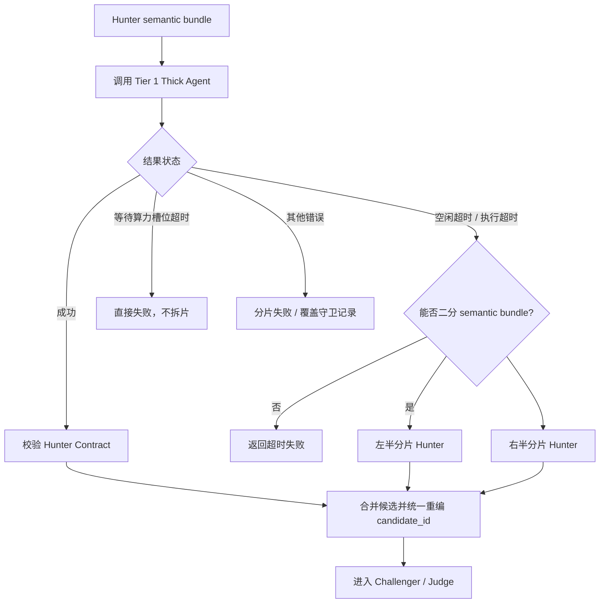

# Tier 1 Hunter 空闲超时与分片自治重试设计

> 状态：现行实现  
> 适用范围：`debate_full` / `debate_selective` 的 Tier 1 Hunter 阶段；CLI Thick Agent 与 Native SSE 调用通用。  
> 目标：避免用固定 30 分钟硬超时误杀仍在工作的 Thick Agent，同时防止大仓分片导致任务无界运行。

---

## 1. 背景问题

Tier 1 Hunter 不是一次“内联 prompt + 短推理”的 Thin LLM 调用。它需要读取磁盘源码、遍历调用链、理解宏与头文件，实际的输出节奏受算力负载、仓库规模和 Agent 工具调用影响。

旧的单一 `timeout_seconds` 会带来两个问题：

1. **误杀活跃任务**：模型仍在推理或 Agent 仍在读文件，但只是暂时没有 stdout/stderr 输出，固定 30 分钟一到就被终止。
2. **同规模重试放大压力**：超时后如果直接重发同样大小的 semantic bundle，通常会再次超时，还会占用额外算力槽位。

---

## 2. 超时模型

Tier 1 采用双层预算：

| 配置项 | 语义 | 推荐值 |
| :--- | :--- | ---: |
| `tier1_hunter.idle_timeout_seconds` | CLI stdout/stderr 连续无活动，或 Native SSE 连续无事件时的判死阈值 | 600 |
| `tier1_hunter.attempt_timeout_seconds` | 单次 Hunter AI 调用的执行上限；契约修复重试也共享该单次预算 | 1800 |
| `tier1_hunter.timeout_seconds` | 当前 Hunter semantic bundle 的拆片总预算，覆盖首次调用和后续拆片重试 | 7200 |

补充语义：

* 对 CLI 驱动（`agy`、`opencode` 等），stdout/stderr 每写入一次都会刷新活动时间。
* 对 Native SSE 驱动，复用已有 first-byte / idle watchdog；`idle_timeout_seconds` 表示两个流式事件之间的最大间隔。
* `attempt_timeout_seconds: 0` 表示沿用 `timeout_seconds` 作为单次调用上限；此时首次超时通常已耗尽拆片预算，建议显式配置更小的单次调用超时。
* `idle_timeout_seconds: 0` 表示禁用空闲看门狗；`attempt_timeout_seconds` / `timeout_seconds` 仍然兜底。
* 等待算力槽位超时不触发拆片。这类错误表示当前资源池已经过载，继续拆分只会放大排队压力。

---

## 3. Hunter 超时处理流程



关键规则：

1. 超时后不重发同规模 prompt。引擎把 semantic bundle 二分，并对左右分片递归执行 Hunter。
2. 同名实现/头文件尽量不拆散。例如 `src/a.cc` 与 `include/a.h` 会保留在同一子分片，降低证据链断裂概率。
3. 所有子分片共享同一个拆片总预算。每次 AI 调用使用 `attempt_timeout_seconds`，不会各自重新获得完整 `timeout_seconds`；这样单次失败后仍有预算拆片，同时避免递归拆片变成无界任务。
4. 子分片候选统一重编 ID。左右子 Hunter 可能都输出 `H-001`；合并后由引擎重编为连续 ID，供后续 Challenger/Judge 保持候选集合一致性。
5. 无法继续拆分时返回失败。例如 semantic bundle 只剩一个文件，且该文件仍然超时，则不再人为伪造成功。

---

## 4. 配置示例

```yaml
scanner:
  debate:
    tiers:
      tier1_hunter:
        resources: ["opencode-deepseek", "opencode-glm"]
        attempt_timeout_seconds: 1800
        timeout_seconds: 7200
        idle_timeout_seconds: 600
```

生产建议：

* 普通仓库：`attempt_timeout_seconds: 1800`、`timeout_seconds: 5400`、`idle_timeout_seconds: 600` 通常足够。
* 大仓或深度架构检视：将 `timeout_seconds` 提升到 `7200` 或更高；单次调用超时保持稳定，优先增加可拆片预算，而不是简单提高并发。
* 总预算建议至少为 `attempt_timeout_seconds` 的 3 倍，保证首次失败后左右两个子分片都有机会执行。
* CLI 输出很少的阶段：不要把 `idle_timeout_seconds` 配得过小；如果某类 Agent 会长时间静默工作，应先在系统诊断里观察 stdout/stderr 活动模式。

---

## 5. 可观测性

* 活跃租约继续展示当前 Stage、Report、Repo、子任务与 Console Ring。
* CLI 采集 stdout/stderr；Native SSE 的每个非空 content delta 也会实时写入 Console Ring，成功后不再重复写入完整响应。
* Console Ring 有 500 条 / 256KB 的内存上限；超限时优先保留较新事件，并在诊断状态中显示 dropped events。
* CLI idle timeout 会写入 `*.output.txt` 的 meta 错误，内容包含 “AI execution idle timed out”。
* 引擎日志会记录原始 bundle 名称、超时原因、拆片后的子 bundle 名称与子 bundle 数量。
* 失败分片仍进入 Scan Coverage，不得伪装成完整扫描成功。

---

## 6. 非目标

* 不在超时后对单个大文件按行范围拆分；当前只拆 semantic bundle 的文件集合。
* 不把部分子分片成功包装成整 bundle 成功；任一子分片失败时，该 bundle 仍按失败进入覆盖统计。
* 不用 Hunter 分片重试替代 Challenger/Judge 阶段的候选批次切分；两者解决的是不同阶段的问题。
