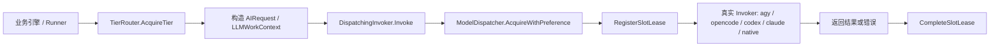
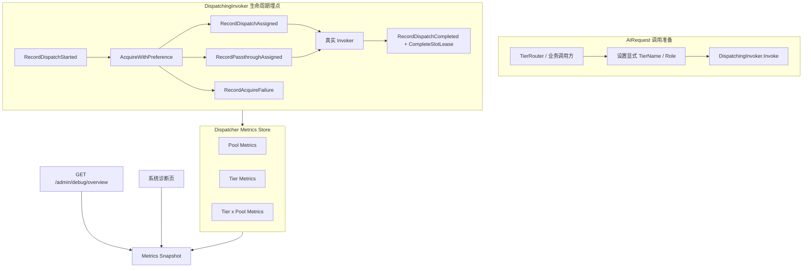

# Code-Shield 算力池与 Tier 调用成功率及耗时统计设计

## 一、 背景与问题

`/admin/debug` 当前已经能回答三类问题：

1. 当前有哪些扫描任务和 LLM 槽位正在运行；
2. 每个算力池当前占用多少并发槽位；
3. 最近完成的槽位租约里，单次调用是成功、失败、取消还是超时。

但它还不能稳定回答以下运营和排障问题：

* 某个算力池自服务启动以来完成了多少次模型调用；
* 某个算力池的成功率、失败率、取消率和平均 / P95 请求时长是多少；
* Tier 1、Tier 2、Tier 3、Tier 4 各自的调用压力和健康度如何；
* 某个 Tier 是否长期把请求压到某个物理算力池，或者因槽位竞争降级到其他池；
* 失败集中在物理算力池、Tier 角色，还是单个模型调用重试。

现有「完成历史」只保留最近 50 条租约，并且仅存在于进程内存中。它可以用于单次排障，但不能作为稳定统计视图。更重要的是，当前租约只有 `Stage` 这类展示用字符串，没有显式的 `TierName` 字段。如果直接解析 `Tier 1: 初筛猎手`、`Tier 2: 终审法官` 等中文文本来分类，会把展示文案变成统计契约，后续很容易因为文案调整而失真。

因此，本设计在调度器层增加正式的调用质量统计，而不是由前端根据最近 50 条记录推导统计值。

> **实现状态（2026-09-08）**：Phase 1 已落地。`AIRequest` / `LLMWorkContext` 增加显式 `TierName`，流水线调用点已补齐 Tier 标识；`DispatchingInvoker` 已在派发、分配、Passthrough 和完成边界埋点；`ModelDispatcher` 提供 Pool、Tier、Tier x Pool 三类进程内聚合；`/api/admin/debug/overview` 已返回 `dispatcher.metrics`；系统诊断页已输出算力池调用质量和 Tier 调用质量两张表。本阶段统计为进程生命周期数据，重启后清零。

## 二、 术语与统计口径

### 2.1 统计对象

| 术语 | 定义 | 说明 |
| --- | --- | --- |
| 模型调用 / 调用尝试 | `DispatchingInvoker.Invoke` 执行的一次底层模型或 Agent 调用 | 这是本设计的基本统计单位 |
| 槽位租约 / Lease | 获得物理算力槽位后登记的一次运行记录 | 当前一次模型调用绑定一个 Lease |
| 算力池 | `ModelDispatcher` 中的一个 `ModelResource` | 使用稳定 Resource Key 作为统计维度，不使用数组下标 |
| Tier | 流水线中的逻辑阶梯，例如 `tier1_hunter`、`tier2_challenger` | 使用配置键作为统计标识 |
| Tier Level | Tier 的层级号，取值 1 / 2 / 3 / 4 | 用于页面聚合成 Tier 1~4 |
| Role | Tier 承担的角色，例如 Hunter、Challenger、Judge、Synthesis | 避免只用 Tier 2 / Tier 3 掩盖角色差异 |
| Queue Wait | 从进入调度包装层开始，到获得算力槽位为止的等待时长 | 包含条件变量等待和锁等待 |
| Execution Duration | 从获得算力槽位开始，到调用返回为止的执行时长 | 与当前 Lease 已有时长口径一致 |
| End-to-End Duration | Queue Wait + Execution Duration | 用于观察 Tier 的完整等待体验 |

### 2.2 不混淆的粒度

本设计统计的是 **单次模型调用**，不是一次扫描任务。一次扫描任务可能产生多个代码分片、多个 Hunter 调用、多个 Challenger / Judge 调用、多次重试和多次报告合成调用。因此：

| 场景 | 是否计入新调用 |
| --- | --- |
| 同一个扫描分片执行一次 Hunter | 是 |
| Hunter 输出解析失败后重试一次 | 是，形成第二次模型调用 |
| 同一个候选缺陷分别进入 Challenger 和 Judge | 是，分别计入对应 Tier |
| Native Invoker 内部对某个 endpoint 做 failover 重试 | 否，外层仍是一次模型调用；后续可扩展 Native attempt 统计 |
| 扫描任务整体成功或失败 | 不在本设计的模型调用统计中 |

### 2.3 状态口径

| 状态 | 判定 | 说明 |
| --- | --- | --- |
| `succeeded` | Invoker 返回 `nil` | 只表示本次调用成功返回，不表示业务发现一定正确 |
| `failed` | Invoker 返回非取消、非截止超时错误 | 包括模型服务错误、输出解析错误、进程错误等 |
| `timeout` | 错误链路包含 `context.DeadlineExceeded` | 属于 failed 的子分类，页面可单独展示 |
| `canceled` | 错误链路包含 `context.Canceled` | 通常由任务取消或父上下文取消导致，不应简单等同于算力池故障 |
| `running` | Lease 仍在 `activeLeases` 中 | 作为实时 gauge，从活跃租约推导 |
| `acquire_failed` | `AcquireWithPreference` 返回错误 | 只计入 Tier 维度；没有实际获得物理池，不应计入具体算力池 |
| `acquire_canceled` / `acquire_timeout` | 等待槽位期间父上下文取消或超时 | 也只计入 Tier 维度 |
| `passthrough` | 调度器未启用、未纳管该 backend，或找不到可用资源时直接执行 | 使用伪算力池展示，避免隐藏未限流调用 |

成功率的推荐公式是：

```text
success_rate = succeeded / (succeeded + failed + timeout)
```

取消不应计入分子和分母。取消通常反映业务侧主动停止或父任务失败，不能直接说明模型池不可用。如果运营方需要观察取消压力，应单独展示 `canceled_rate`。

### 2.4 时长口径

| 指标 | 计算范围 | 用途 |
| --- | --- | --- |
| `avg_execution_seconds` | 所有已完成调用的 Execution Duration | 观察整体执行速度 |
| `avg_success_execution_seconds` | 仅成功调用的 Execution Duration | 避免失败快返回或超时慢返回扭曲平均值 |
| `p95_execution_seconds` | 所有已完成调用的 Execution Duration | 发现长尾阻塞 |
| `avg_queue_seconds` | 所有成功获得槽位调用的 Queue Wait | 判断算力池是否排队 |
| `p95_queue_seconds` | 所有成功获得槽位调用的 Queue Wait | 判断排队长尾 |
| `avg_end_to_end_seconds` | Queue Wait + Execution Duration | 观察 Tier 的真实等待体验 |

页面至少要同时展示“成功平均耗时”和“全量 P95 耗时”。只展示全量平均耗时容易被少量失败掩盖问题，只展示成功耗时又可能隐藏长尾阻塞。

## 三、 现状链路与差距

当前调用链可以概括为：



已具备的接入点：

* `DispatchingInvoker.Invoke` 是真实模型调用和槽位租约生命周期的统一入口；
* `ModelDispatcher` 已经维护活跃租约、最近完成租约和资源并发状态；
* `CompleteSlotLease` 已经能区分成功、失败和取消；
* `LLMSlotLease` 已经有算力池、模型、报告、仓库、阶段、运行时长和错误信息。

当前缺口：

| 缺口 | 影响 | 本设计处理 |
| --- | --- | --- |
| Lease 没有显式 `TierName` | 无法可靠按 Tier 聚合 | 在 `AIRequest` / `LLMWorkContext` / Lease 中增加显式字段 |
| 最近 Lease 只有 50 条 | 不能作为累计统计源 | 调度器内维护有界聚合指标 |
| 只有运行中并发，没有完成数与成功率 | 无法判断池质量 | 增加 lifetime counter 和状态计数 |
| 只有 Lease 耗时，没有队列等待 | 无法区分“排队慢”和“模型慢” | 在包装层记录 Queue Start / Acquire Success |
| 展示 Stage 是中文字符串 | 不适合作为统计主键 | 使用配置键和角色映射 |
| 未纳管调用容易被忽略 | 管理员可能误以为所有调用都受控 | 增加 `passthrough` 视图 |

## 四、 目标与非目标

### 4.1 目标

1. 按物理算力池统计已分配、运行中、已完成、成功、失败、取消、超时、平均耗时和 P95 耗时；
2. 按逻辑 Tier / 角色统计派发数、获得槽位数、运行中、完成数、成功、失败、取消、超时、排队耗时和执行耗时；
3. 保留 Tier 与物理算力池的交叉统计，观察多资源池化调度和降级路径；
4. 将统计口径固定为单次模型调用 / 单个 Lease；
5. 在 `/admin/debug` 中输出管理员可读的表格，而不是暴露原始内部对象；
6. 统计逻辑失败隔离，不影响业务调度和 Invoker 行为；
7. 第一阶段不新增数据库表、不做逐调用持久化，统计随服务进程重启清零。

### 4.2 非目标

* 不改变 Tier 选择、SWRR、限流、重试或模型调用语义；
* 不统计业务缺陷数量、任务成功率或扫描报告质量；
* 不持久化每次模型调用的 Prompt、输出或源码内容；
* 不把统计接口开放给普通用户；
* 不在第一阶段做跨进程重启的历史统计；
* 不把 Native 内部 endpoint failover 强行拆成多个外层模型调用；
* 不用解析中文 Stage 的方式推导 Tier。

## 五、 总体设计



核心原则是：**在真实调度边界统计，而不是在前端推导。**

`DispatchingInvoker` 已经是所有受管模型调用的统一包装层，因此它适合承担以下三件事：

1. 从请求上下文中读取显式 `TierName`；
2. 记录进入调度器、获得槽位、进入 passthrough、获得槽位失败四类事件；
3. 在调用结束时把最终状态、执行时长和错误写入聚合指标。

`ModelDispatcher` 继续作为指标状态的 owner。这样可以保证资源状态和指标快照使用同一把锁，避免出现“活跃槽位已经变化，但指标 running 还是旧值”的错位。

## 六、 元数据扩展

### 6.1 显式 Tier 标识

建议同时扩展 `AIRequest` 和 `LLMWorkContext`：

```go
type AIRequest struct {
    // ...既有字段保持不变...
    TierName string `json:"tier_name,omitempty"`
}

type LLMWorkContext struct {
    ReportID uint   `json:"report_id"`
    RepoName string `json:"repo_name"`
    TaskType string `json:"task_type"`
    Stage    string `json:"stage"`
    SubTask  string `json:"sub_task"`
    Detail   string `json:"detail,omitempty"`

    TierName string `json:"tier_name,omitempty"`
}
```

`AIRequest.TierName` 是指标统计的权威字段。`LLMWorkContext.TierName` 用于业务上下文继承和 Lease 展示。读取时使用以下优先级：

```text
1. AIRequest.TierName
2. LLMWorkContext.TierName
3. system / uncategorized
```

明确禁止根据 `Stage` 里的 `"Tier 1"`、`"Hunter"` 等文本做统计分类。

### 6.2 Tier 归一化

统计使用配置键作为 `tier_name`，展示使用 `tier_level + role`：

| 统计键 | Level | 展示角色 | 说明 |
| --- | --- | --- | --- |
| `tier1_hunter` | 1 | Tier 1 Hunter | 推荐配置 |
| `tier1_fast` | 1 | Tier 1 Hunter | 兼容旧名 |
| `tier2_challenger` | 2 | Tier 2 Challenger | 推荐配置 |
| `tier2_reasoning` | 2 | Tier 2 Reasoning | 旧版共享 Challenger 与 Judge |
| `tier3_judge` | 3 | Tier 3 Judge | 推荐配置 |
| `tier3_synthesis` | 3 | Tier 3 Synthesis | 旧版汇总角色 |
| `tier4_synthesis` | 4 | Tier 4 Synthesis | 推荐配置 |
| `system_tool` / 其他 | 0 | System Tool / Uncategorized | JSON 修复、治理工具等非流水线调用 |

页面可以按 Tier Level 折叠展示，但底层不能把 `tier2_challenger` 和 `tier2_reasoning` 直接合并成一个不可区分的键。后续如果同时存在多种 Tier 2 配置，必须能看到角色差异。

### 6.3 Lease 元数据扩展

`LLMSlotLease` 增加：

```go
type LLMSlotLease struct {
    // ...既有字段保持不变...
    TierName          string     `json:"tier_name,omitempty"`
    QueueStartedAt    time.Time  `json:"queue_started_at,omitempty"`
    QueueWaitSeconds  float64    `json:"queue_wait_seconds,omitempty"`
}
```

当前实现把 `TierLevel` 和 `Role` 作为展示投影，由 `TierName` 在 `GetMetricsSnapshot` 中派生，不重复存储在 Lease 上。这样可以在不扩大活跃 Lease 内存 footprint 的同时，仍然让聚合统计解释“为什么这个调用耗时长”：是排队时间长，还是真实模型执行时间长。

## 七、 指标数据模型

### 7.1 维度

```go
type PoolMetricKey struct {
    PoolKey string
}

type TierMetricKey struct {
    TierName string
}

type TierPoolMetricKey struct {
    TierName string
    PoolKey  string
}
```

`PoolKey` 的生成规则：

```text
如果 Resource.ID 非空:       "id:" + Resource.ID
否则:                        Resource.ResourceKey()
如果没有 Resource:           "passthrough"
```

不要使用 `Server Index` 作为主键。配置热加载后，同一个资源在数组中的下标可能变化；资源 ID 和稳定的 Resource Key 才能保留历史口径。

### 7.2 单窗口计数器

```go
type MetricSeries struct {
    Assigned                 uint64   `json:"assigned"`
    Completed                uint64   `json:"completed"`
    Succeeded                uint64   `json:"succeeded"`
    Failed                   uint64   `json:"failed"`
    Canceled                 uint64   `json:"canceled"`
    Timeout                  uint64   `json:"timeout"`

    ExecutionDurationNanos       uint64   `json:"-"`
    SuccessExecutionDurationNanos uint64  `json:"-"`
    ExecutionHistogram           []uint64 `json:"-"`

    LastCompletedAt *time.Time `json:"last_completed_at,omitempty"`
    LastError       string     `json:"last_error,omitempty"`
    LastErrorAt     *time.Time `json:"last_error_at,omitempty"`
}
```

`ExecutionHistogram` 使用固定耗时桶，例如：

```text
0.1s, 0.5s, 1s, 3s, 5s, 10s, 30s, 60s,
120s, 300s, 600s, 1800s, 3600s, +Inf
```

P95 使用固定桶近似即可。系统诊断页的目标是发现长尾，而不是提供财务级精确分位数。固定桶内存可控，也不会引入复杂数据结构。

### 7.3 Tier 专属计数器

```go
type TierMetricSeries struct {
    MetricSeries

    Dispatched        uint64 `json:"dispatched"`
    SlotAssigned      uint64 `json:"slot_assigned"`
    Passthrough       uint64 `json:"passthrough"`
    AcquireFailed     uint64 `json:"acquire_failed"`
    AcquireCanceled   uint64 `json:"acquire_canceled"`
    AcquireTimeout    uint64 `json:"acquire_timeout"`

    QueueDurationNanos uint64   `json:"-"`
    QueueHistogram     []uint64 `json:"-"`
}
```

Tier 与 Pool 的交叉统计可以复用 `MetricSeries`：

```go
type TierMetrics struct {
    TierName string
    Level    int
    Role     string
    Total    TierMetricSeries
    ByPool   map[string]MetricSeries
}
```

### 7.4 全量快照

```go
type DispatcherMetricsSnapshot struct {
    Scope       string                   `json:"scope"`
    Since       time.Time                `json:"since"`
    GeneratedAt time.Time                `json:"generated_at"`
    Pools       []PoolMetricsSnapshot    `json:"pools"`
    Tiers       []TierMetricsSnapshot    `json:"tiers"`
}

type PoolMetricsSnapshot struct {
    PoolKey      string        `json:"pool_key"`
    ResourceID   string        `json:"resource_id,omitempty"`
    Driver       string        `json:"driver,omitempty"`
    Model        string        `json:"model,omitempty"`
    Active       int           `json:"active"`
    Limit        int           `json:"limit"`
    RawConcurrent int          `json:"raw_concurrent"`
    Metrics      MetricSeries  `json:"metrics"`
}

type TierMetricsSnapshot struct {
    TierName string            `json:"tier_name"`
    Level    int               `json:"level"`
    Role     string            `json:"role"`
    Metrics  TierMetricSeries  `json:"metrics"`
    ByPool   []MetricSeries    `json:"by_pool"`
}
```

`running` 不建议作为累计计数器维护，而是每次快照时从当前 `activeLeases` 和资源 `Active` 推导。这样可以避免 `ResetActiveSlots`、热加载或异常路径造成 gauge 泄漏。

## 八、 埋点生命周期

### 8.1 进入调度包装层

`DispatchingInvoker.Invoke` 在进入 `AcquireWithPreference` 前记录：

```text
queue_started_at = now()
tier_name = req.TierName 或 workCtx.TierName
```

然后在 `ModelDispatcher` 中递增 Tier 的 `dispatched`。

如果该请求没有走 `DispatchingInvoker`，则不会进入本统计。这符合当前“算力池诊断”的边界；如果未来需要统计完全绕过调度器的调用，应该由独立的全局 Invoker 指标承接。

### 8.2 获得槽位

`AcquireWithPreference` 返回真实 Resource 后：

```text
queue_wait = now() - queue_started_at
```

然后：

1. 更新 Tier 的 `slot_assigned`、`queue_wait` 直方图；
2. 更新对应 Pool 的 `assigned`；
3. 更新 Tier x Pool 交叉统计；
4. 在 Lease 上写入 `QueueStartedAt`、`QueueWaitSeconds` 和 `TierName`；`TierLevel` / `Role` 由快照层派生。

### 8.3 Passthrough

以下情况都应计入 `passthrough`：

* `ModelDispatcher` 为空或未启用；
* 没有任何资源支持当前 backend；
* 资源循环判定为 unsupported，返回 `nil, nil`；
* 其他无法绑定真实 Resource 的直接执行路径。

Passthrough 不代表一定错误，但它表示这次调用没有受到算力池并发控制。诊断页应该把它作为独立行展示，避免管理员误判总负载。

### 8.4 获得槽位失败

如果 `AcquireWithPreference` 返回错误：

| 错误类型 | Tier 计数 | Pool 计数 |
| --- | --- | --- |
| `context.Canceled` | `acquire_canceled++` | 不计入具体 Pool |
| `context.DeadlineExceeded` | `acquire_timeout++` | 不计入具体 Pool |
| 其他错误 | `acquire_failed++` | 不计入具体 Pool |

这些调用没有获得物理槽位，也没有产生真实模型调用，因此不计入 Pool 的 assigned / completed。否则会高估物理池的失败率。

### 8.5 调用完成

真实 Invoker 返回后：

1. 根据 `invokeErr` 归类 `succeeded` / `failed` / `canceled` / `timeout`；
2. 计算从获得槽位到调用结束的 Execution Duration；
3. 更新 Tier、Pool、Tier x Pool 的状态计数和耗时直方图；
4. 更新最近完成时间和最近错误；
5. 调用既有 `CompleteSlotLease` 保留最近 50 条排障记录。

最近错误应截断到 256~512 字节，并移除可能出现的 Authorization、API Key、Cookie 等敏感片段。诊断页只展示聚合后的错误摘要，详细输出仍走现有 super_admin Lease 详情。

## 九、 API 与前端展示

### 9.1 API

第一阶段不需要新增独立接口，直接扩展：

```http
GET /api/admin/debug/overview
```

响应新增：

```json
{
  "metrics": {
    "scope": "process_lifetime",
    "since": "2026-09-08T10:00:00+08:00",
    "generated_at": "2026-09-08T11:30:00+08:00",
    "pools": [],
    "tiers": []
  }
}
```

嵌入现有 overview 的理由：

1. 页面已经按 3~10 秒轮询 overview；
2. 资源状态和指标可以在同一次快照中保持一致；
3. 算力池和 Tier 数量有限，响应增量很小；
4. 避免前端额外请求造成两个时间点的数据错位。

如果未来指标维度大幅增加，再拆出 `GET /api/admin/debug/metrics`。

### 9.2 算力池表

建议在现有“LLM 模型调度器算力池实时负载”下方增加：

| 字段 | 说明 |
| --- | --- |
| 算力池 | Resource ID 或稳定 Resource Key |
| 驱动 / 模型 | `native`、`agy`、`opencode` 等 |
| 运行 / 上限 | 当前 Active / Limit |
| 已分配 | 获得该池槽位的调用数 |
| 已完成 | 分配后已经结束的调用数 |
| 成功 / 失败 / 取消 / 超时 | 状态拆分 |
| 成功率 | 排除取消后的成功率 |
| 成功平均耗时 | 仅成功调用 |
| 全量 P95 耗时 | 包含失败和超时 |
| 最近错误 | 截断后的错误摘要 |

### 9.3 Tier 表

建议增加独立“Tier 调用质量”表：

| 字段 | 说明 |
| --- | --- |
| Tier / 角色 | 例如 Tier 1 Hunter、Tier 2 Challenger、Tier 3 Judge |
| 派发 | 进入调度包装层的模型调用数 |
| 获得槽位 | 成功分配到真实算力池的调用数 |
| Passthrough | 未受算力池控制的调用数 |
| 运行中 | 当前活跃 Lease 数 |
| 完成 | 已结束调用数 |
| 成功 / 失败 / 取消 / 超时 | 状态拆分 |
| 成功率 | 排除取消后的成功率 |
| 平均排队 | Queue Wait 平均值 |
| P95 执行 | Execution Duration P95 |
| 主要算力池 | 按 Tier x Pool 完成数展示 Top 1~3 |

Tier 表的主要价值是回答“哪一层流水线在拖慢扫描”。如果 Tier 1 P95 很高，通常会影响分片吞吐；如果 Tier 3 / Tier 4 P95 很高，则更可能影响终审和报告收敛。

### 9.4 展示规则

* 显示 `since process start`，让用户知道统计不是永久历史；
* 显示统计口径为“单次模型调用 / 槽位租约”；
* 取消和失败使用不同颜色，不把取消渲染成算力池故障；
* 成功率低于 98% 显示 warning，低于 90% 显示 danger；
* P95 超过对应 Tier 配置超时时间的 80% 时显示 warning；
* 空数据显示 `-`，不要把 0 成功误渲染成失败。

## 十、 边界条件与失败隔离

| 场景 | 处理策略 |
| --- | --- |
| `WorkContext` 为空 | 使用 `AIRequest.TierName`；两者都为空则归入 `system / uncategorized` |
| Resource 没有 ID | 使用稳定 `ResourceKey()`，不使用数组下标 |
| 配置热加载后资源被移除 | 保留旧 PoolKey 的历史计数，直到进程重启 |
| 配置热加载后 Resource ID 改变 | 新旧 PoolKey 分别统计，不做猜测式合并 |
| `ResetActiveSlots` 清空活跃 Lease | running 由活跃 Lease 推导，自动归零；lifetime 完成计数不变 |
| 调度器被禁用 | 调用进入 passthrough；如包装层不存在，则不进入本统计 |
| 指标内部异常 | 不得影响 `Invoke` 返回值、重试逻辑或 Lease 释放 |
| 超大错误信息 | 截断到固定上限，并做敏感信息脱敏 |
| 未知 Tier | 归入 `system / uncategorized`，不丢弃统计 |
| Native 内部 endpoint failover | 仍按一次外层模型调用统计 |

指标更新应在 `ModelDispatcher` 现有锁内或等价的细粒度锁内完成，并保证快照时资源状态和指标状态一致。不要为每个字段使用分散的原子变量后又在多个时刻读取，否则活跃数、完成数和分位数可能来自不同时间点。

## 十一、 测试计划

### 11.1 单元测试

至少覆盖以下用例：

1. 成功调用后 Pool、Tier、Tier x Pool 的 completed / succeeded 同时递增；
2. 失败调用递增 failed，并记录截断后的 last error；
3. `context.Canceled` 递增 canceled，不递增 failed；
4. `context.DeadlineExceeded` 递增 timeout 和 failed；
5. acquire 失败只递增 Tier acquire 指标，不递增 Pool completed；
6. passthrough 调用计入 Tier，并出现在独立 PoolKey；
7. 同一 Tier 绑定多个 Resource 时，实际选中的 Pool 被正确记录；
8. 逻辑 Tier 选择 A 池但物理槽位竞争后切到 B 池时，按 B 池统计；
9. 多个 goroutine 并发完成调用时，所有计数无丢失；
10. 快照返回深拷贝，外部修改不会污染内部 map；
11. `ResetActiveSlots` 后 running 归零，lifetime completed 不清零；
12. Resource ID 缺失时使用稳定 ResourceKey，不使用 Index；
13. `tier2_challenger` 与 `tier2_reasoning` 保持独立键和正确 Level；
14. 未知 Tier 进入 `system / uncategorized`。

### 11.2 集成测试

* 使用 mock Invoker 分别返回成功、失败、取消和超时，检查 overview JSON；
* 使用两个 Resource 的 Tier 配置验证多池交叉统计；
* 验证 Lease 详情能看到 `TierName` 和 `QueueWaitSeconds`；
* 验证前端在空统计、零完成、只有 passthrough 三种状态下不误报。

## 十二、 落地阶段

### Phase 1：进程内聚合

**状态：已实施。**

已完成的范围：

1. `AIRequest` / `LLMWorkContext` / `LLMSlotLease` 增加 Tier 元数据；
2. 调度器增加 Pool、Tier、Tier x Pool 三类聚合；
3. `DispatchingInvoker` 增加 queue / assigned / completed 埋点；
4. debug overview 返回指标快照；
5. 前端增加两张统计表。

当前实现入口：

| 文件 | 职责 |
| --- | --- |
| `services/dispatcher/metrics.go` | 定义计数器、固定耗时桶、Tier 归一化、指标快照和埋点方法 |
| `services/dispatcher/wrapper.go` | 在调度包装层记录 Dispatch Started、Assigned、Passthrough、Acquire Failure 和 Completed |
| `services/dispatcher/lease.go` | 在 Lease 上保留 TierName、QueueStartedAt 和 QueueWaitSeconds |
| `handlers/debug.go` | 通过 `GetDebugSnapshot()` 在单一锁窗口读取资源、租约和指标 |
| `frontend/src/pages/SystemDebug.tsx` | 渲染算力池调用质量和 Tier 调用质量表格 |

检视阶段补充了两项一致性约束：

1. `handlers/debug.go` 不再分别调用 resource、active lease、recent lease 和 metrics 四个快照方法，而是使用 `ModelDispatcher.GetDebugSnapshot()`，避免页面各区域来自不同锁窗口；
2. 聚合表中的 `LastError` 统一经过 `SanitizeMetricError()`，截断前会脱敏 API Key、Token、Authorization Header 等常见凭据片段，并按 UTF-8 边界截断。

不做：

* 不持久化；
* 不新增数据库迁移；
* 不新增 reset 指标接口；
* 不按 endpoint 拆 Native 统计。

### Phase 2：滚动窗口与长期历史

当 Phase 1 稳定后，再考虑：

| 能力 | 建议方案 |
| --- | --- |
| 最近 1 小时趋势 | 每维度维护 60 个 1 分钟桶，内存很小 |
| 最近 24 小时趋势 | 使用低精度 15 分钟或 1 小时桶 |
| 跨重启历史 | 周期性聚合写入指标表，而不是逐调用插入 |
| Endpoint 级统计 | Native 集群按 endpoint 记录独立 attempt 指标 |
| Token / 成本 | 在 Invoker 结果可用时扩展 token 与成本维度 |
| 告警 | 基于 P95、失败率和 acquire timeout 设置阈值 |

不建议第一阶段直接为每次模型调用写入数据库。Tier 1 的调用量可能很高，逐调用入库容易引入 SQLite 锁竞争、磁盘 IO 抖动和诊断系统反噬业务扫描的问题。长期统计应采用异步、批量、周期聚合和有界保留策略。

## 十三、 结论

这个统计能力是对现有调度诊断的自然补齐。它能把“当前有多少槽位在跑”升级为“哪个算力池是否健康、哪个 Tier 是否拖慢流水线、失败和长尾集中在哪里”。

第一阶段只需要进程内聚合和显式 Tier 元数据，不需要修改业务语义，也不需要数据库迁移。最小可用版本应该优先交付：

1. 每个算力池的完成数、成功数、失败数、取消数、超时数、平均成功耗时和 P95 耗时；
2. 每个 Tier 的派发数、获得槽位数、完成数、成功数、失败数、取消数、超时数、平均排队和 P95 执行耗时；
3. Tier x Pool 交叉视图；
4. 明确的“单次模型调用”口径和 process lifetime 范围。

只要口径固定、埋点放在调度边界，并把统计失败与业务调用隔离，这个功能就能以较低成本显著提升现网排障效率。
