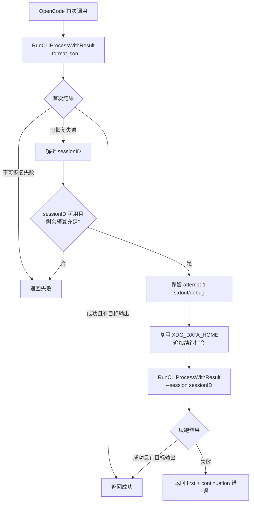

# OpenCode 失败会话续跑与输出守卫设计

> 状态：已实施（核心链路）
> 适用范围：`opencode` 驱动的 Tier 1 Hunter、Tier 3 Judge，以及其他要求写目标文件的 Thick Agent 任务。
> 目标：在模型或 CLI 失败后，尽量复用已经建立的 OpenCode 会话上下文，只补齐“写最终输出文件”等收尾动作，避免重新执行整段源码分析。

---

## 1. 背景

2026-09-08 晚间连续扫描期间，`/admin/debug` 完成历史中的 20 条失败记录全部属于 `Coredump 风险分析`，且均来自 `opencode` 驱动：

| 模型 / 池 | 失败数 |
| :--- | ---: |
| `modelgate/dp` / `opencode-deepseek` | 18 |
| `modelgate/GLM-4.7-XS` / `opencode-glm` | 2 |

同一运行期内，Native 池 2415 次调用零失败，说明问题主要集中在 `opencode` 链路，而不是算力池排队或数据库调度。

失败形态分为三类：

| 失败模式 | 数量 | 说明 |
| :--- | ---: | :--- |
| CLI exit code 0，但目标输出缺失/为空 | 13 | 模型完成了大部分分析，但没有把最终 JSON 写入目标文件 |
| CLI 空闲超时：10 分钟无 stdout/stderr 活动 | 6 | stdout 显示模型仍在读文件或推理，被活动看门狗终止 |
| CLI 总超时：1 小时整体超时 | 1 | 单次执行预算耗尽 |

多个失败任务的 stdout 显示模型已经进入源码分析、候选缺陷推导甚至最终结论整理阶段。如果直接重发完整 prompt，会重新读取和分析大量文件，成本高、耗时长，还可能再次失败。更合适的方案是：**保留 OpenCode 会话上下文，只向会话追加一条短收尾指令，让模型继续补写最终文件。**

---

## 2. OpenCode 能力验证

落地状态：

* `OpenCodeInvoker` 首次调用固定使用 `--format json`，用于解析会话 ID；目标文件仍由 `OutputPath` 控制。
* `RunCLIProcessWithResult` 返回 `CLIProcessResult.SessionID`，原 `RunCLIProcess` API 保持兼容。
* `OpenCodeInvoker` 在白名单失败场景下最多续跑一次。
* 续跑默认开启，上限 300 秒，可通过 `scanner.opencode.continuation.enabled` / `max_seconds` 配置。
* OpenCode 续跑计数器通过 `GetOpenCodeContinuationMetrics` 暴露，并已挂到 `/api/admin/debug/overview` 的 `dispatcher.opencode_continuation` 字段；前端表格可后续增强。

OpenCode CLI 支持会话续跑：

```bash
opencode run <message> \
  --session <sessionID> \
  --agent shield-base-scanner \
  --auto \
  --format json \
  --thinking \
  --dir <workdir> \
  --model <model>
```

`--format json` 输出的是 NDJSON 事件流。事件中包含稳定的 `sessionID`，例如：

```json
{"type":"step_start","sessionID":"ses_example","part":{}}
```

因此，第一次调用必须使用 `--format json`，才能在进程退出后从 stdout mirror 中解析出 session id。会话状态保存在 OpenCode 的数据目录中；当前实现已经为每次调用创建隔离的 `XDG_DATA_HOME`，续跑必须复用同一个隔离目录，否则找不到 session。

---

## 3. 目标

1. 对可恢复的 `opencode` 失败做一次会话内续跑，而不是立即抛出最终失败。
2. 续跑 prompt 只做收尾，不重新注入原始大 prompt。
3. 续跑仍然受父 context、Tier 超时和空闲看门狗约束，不能变成无界等待。
4. 重试成功时， lease 最终状态为成功；重试失败时，错误信息应同时包含首次失败和续跑失败原因。
5. 保留首次失败现场的 stdout / stderr / session id，便于诊断和统计。
6. 只覆盖 `opencode` 驱动；不改变 `native`、`codex`、`claude`、`agy` 的调用语义。

## 4. 非目标

* 不支持无限次续跑。
* 不把模型输出的任意文本抢救成 JSON；续跑后仍必须生成合法目标文件。
* 不替代 Tier 1 现有的 semantic bundle 二分机制。若续跑失败，超时类 Hunter 调用仍应进入原有拆片流程。
* 不在通用 `RunCLIProcess` 中默认重试所有失败；会话续跑是 `opencode` 特化能力。
* 不把续跑后的任务标记为“完整重扫成功”以外的特殊状态；业务侧只关心本次 lease 是否最终产出合法输出。

---

## 5. 总体流程



关键点：

1. 首次运行和续跑共用同一个 `OpenCodeInvoker.Invoke` 生命周期。
2. 隔离的 `XDG_DATA_HOME` 延迟到整个 Invoke 函数结束时清理，保证续跑能找到 session。
3. 第一次 stdout mirror 用于解析 session id；续跑前改名保存，避免被第二次运行覆盖。
4. 续跑 prompt 很短，核心是“不要重新分析，立即写目标文件”。

---

## 6. 可续跑失败分类

并非所有非 0 退出码都应该续跑。建议采用白名单式判断。

### 6.1 适合续跑

| 类型 | 判定条件 | 续跑策略 |
| :--- | :--- | :--- |
| 输出守卫失败 | CLI exit code 0，但 `OutputPath` 不存在、非普通文件或大小为 0 | “不要重新分析，立即把最终 JSON 写入目标文件” |
| 空闲超时 | `AI execution idle timed out`，且 stdout 中可解析 sessionID | “不要继续扩大阅读范围，立即收敛并写目标文件” |
| 总执行超时 | `AI execution timed out`，且父 context 仍有剩余预算 | 同上，但续跑预算必须小于剩余总预算 |
| 瞬时工具失败 | 错误指向临时写入失败、网络抖动、工具调用失败，且 sessionID 可用 | “继续当前会话，修复收尾动作并写目标文件” |

### 6.2 不续跑

| 类型 | 原因 |
| :--- | :--- |
| 父 context 已取消 | 上游已经明确要求停止 |
| CLI 未启动 | 没有可用 session，续跑无意义 |
| 内容安全过滤触发 | 不应诱导模型绕过安全策略 |
| 认证失败 / 模型不可用 | 同一个 provider/session 大概率再次失败 |
| stdout 无 sessionID | 没有续跑锚点 |
| 父 context 剩余预算不足 | 继续等待只会拖慢整体扫描 |
| 已经是续跑后的失败 | 只允许一次续跑，避免隐藏系统性故障 |

判定逻辑建议：

```go
func canContinueAfterOpenCodeFailure(err error, result CLIProcessResult) bool {
    if result.SessionID == "" {
        return false
    }

    if errors.Is(err, context.Canceled) {
        return false
    }

    if isSafetyFilterError(err) {
        return false
    }

    if isAuthOrModelUnavailableError(err) {
        return false
    }

    return isOutputMissing(err) ||
        isIdleTimeout(err) ||
        isExecutionTimeout(err) ||
        isTransientToolFailure(err)
}
```

---

## 7. 实现设计

### 7.1 扩展 `RunCLIProcess`

当前 `RunCLIProcess` 只返回 `error`，无法把 session id 交给调用方。新增带结果的内部接口：

```go
type CLIProcessResult struct {
    SessionID string
}

func RunCLIProcessWithResult(
    cliName string,
    args []string,
    req AIRequest,
    mockSummary string,
) (CLIProcessResult, error)
```

原接口保持兼容：

```go
func RunCLIProcess(
    cliName string,
    args []string,
    req AIRequest,
    mockSummary string,
) error {
    _, err := RunCLIProcessWithResult(cliName, args, req, mockSummary)
    return err
}
```

在 `opencode` 输出缺失分支中返回专门错误：

```go
type OpenCodeOutputMissingError struct {
    SessionID  string
    OutputPath string
    Cause      string
}
```

调用方通过 `errors.As` 识别。

### 7.2 OpenCodeInvoker 负责续跑策略

```go
func (o *OpenCodeInvoker) Invoke(req AIRequest) error {
    tempDataDir, cleanup, err := prepareIsolatedDataDir()
    if err != nil {
        return err
    }
    defer cleanup()

    req.Env = append(req.Env, "XDG_DATA_HOME="+tempDataDir)

    args, err := o.buildArgs(req)
    if err != nil {
        return err
    }

    result, runErr := RunCLIProcessWithResult(
        "opencode", args, req,
        "模拟报告：OpenCode AI 引擎未安装",
    )
    if runErr == nil {
        return nil
    }

    if !canContinueAfterOpenCodeFailure(runErr, result) {
        return runErr
    }

    return o.continueSession(req, result.SessionID, runErr)
}
```

`continueSession` 的职责：

1. 计算剩余续跑预算。
2. 保存首次 stdout / debug log。
3. 构造短续跑 prompt。
4. 以同一个 `XDG_DATA_HOME`、`WorkDir`、`ModelName`、`Observability` 和父 context 再次调用。

### 7.3 参数构造

首次参数必须使用 JSON 事件流：

```go
args := []string{
    "run", userPrompt,
    "--agent", BaseScannerAgentName,
    "--auto",
    "--format", "json",
    "--thinking",
}
```

续跑参数在原参数基础上追加：

```go
args = append(args,
    "--session", sessionID,
)
```

但续跑 prompt 要替换为短指令：

* `PromptFile` 清空；
* `InputFiles` 清空；
* `PromptMsg` 只包含收尾要求；
* `OutputPath` 保持不变；
* `WorkDir`、`ModelName`、`ParentContext`、`Observability` 保持不变。

这样可以避免 `BuildPromptPayload` 再次拼接原始 prompt 和输入文件清单。

### 7.4 续跑 prompt

模板示例：

```text
继续上一个会话。前面的分析结果已经存在，不要重新分析，不要重新读取全部文件，不要修改业务源码。

请立即根据前面的分析结论生成最终 JSON，并写入这个普通文件：
<output_path>

硬性要求：
1. 目标路径必须是普通文件，不能创建同名目录。
2. 文件内容只能是符合原任务输出契约的 UTF-8 JSON。
3. 不得包含 Markdown 代码围栏、解释文字、日志或思考过程。
4. 写入完成后自行校验 JSON 可以被解析。
```

`BuildPromptPayload` 已经会注入 Output Delivery 规则，因此这里不需要重复展开完整的任务背景。

### 7.5 超时预算

续跑不能重新获得完整预算。推荐规则：

```text
retryBudget = min(
    openCodeContinuationMaxSeconds,
    parentContextRemainingSeconds,
)
```

推荐配置：

```yaml
scanner:
  opencode:
    continuation:
      enabled: true
      max_seconds: 300
```

默认值建议为 5 分钟。输出守卫失败通常只需要模型完成最后的写文件动作；如果 5 分钟仍不能完成，说明会话状态可能已经损坏，继续等待意义不大。

对 idle / total timeout：

* 如果父 context 没有剩余预算，不续跑。
* 如果剩余预算小于 60 秒，不续跑。
* 续跑时把 `TimeoutMin` 设置为按秒折算后的剩余预算，并继续使用原 `IdleTimeoutSeconds`。

---

## 8. 输出与诊断

### 8.1 文件命名

首次失败后、续跑前：

```text
<output>.output.txt        -> <output>.attempt-1.output.txt
<output>.debug.log         -> <output>.attempt-1.debug.log
```

第二次运行重新生成：

```text
<output>.output.txt
<output>.debug.log
```

如果续跑成功，可以保留 `attempt-1` 文件作为审计线索。如果后续希望减少磁盘占用，可以在成功后对 attempt-1 文件设置保留上限或压缩归档。

### 8.2 完成历史

续跑对上层 lease 仍然是同一个业务调用：

| 首次结果 | 续跑结果 | lease 最终状态 |
| :--- | :--- | :--- |
| 输出缺失 | 成功写文件 | succeeded |
| idle timeout | 成功写文件 | succeeded |
| total timeout | 成功写文件 | succeeded |
| 输出缺失 | 仍失败 | failed |
| 不满足续跑条件 | 不执行 | failed |

错误信息建议包含两个阶段：

```text
opencode continuation failed: <retry error>; first attempt: <first error>
```

### 8.3 指标

建议在 Dispatcher 指标中增加四个计数：

| 指标 | 含义 |
| :--- | :--- |
| `opencode_continuation_eligible` | 判定为可续跑的失败数 |
| `opencode_continuation_attempted` | 实际发起续跑数 |
| `opencode_continuation_succeeded` | 续跑后成功数 |
| `opencode_continuation_failed` | 续跑后仍失败数 |

可以按 pool 或 tier 聚合。该指标能回答两个问题：

1. 会话续跑到底救回了多少任务；
2. 某个模型是否频繁依赖续跑兜底。

如果某个 pool 的 `continuation_attempted / assigned` 比例长期升高，说明底层模型或 CLI 输出稳定性有问题，应该调低权重或切换资源。

---

## 9. 安全与稳定性

1. **不绕过内容安全策略**
   如果首次失败原因是 safety filter，续跑指令不能提供被过滤内容，也不应该尝试诱导模型重写。

2. **不改变源码工作区语义**
   续跑 prompt 明确禁止修改业务源码。OpenCode agent 仍使用现有只读分析 + 自动权限配置。

3. **不泄露凭据**
   session id 本身不是凭据，只用于诊断和续跑。日志、错误信息与 Console Ring 仍遵守现有敏感值脱敏规则，不得输出 API key、Authorization header 或完整环境变量。

4. **不放大失败**
   只允许一次续跑。若续跑失败，必须把错误暴露给上层，不得伪造成功。

5. **不破坏拆片兜底**
   Tier 1 的 semantic bundle 拆片逻辑继续保留。续跑可以看作“在原始会话内做最后收尾”；如果收尾失败，上层仍可按原有逻辑处理。

---

## 10. 测试计划

### 10.1 单元测试

1. session id 解析：
   * 合法 NDJSON；
   * 多个事件时取最后一个 sessionID；
   * 空文件、非 JSON、缺 sessionID。

2. 失败分类：
   * output missing；
   * idle timeout；
   * total timeout；
   * cancel；
   * safety filter；
   * auth / provider unavailable。

3. 续跑预算：
   * 父 context 无 deadline；
   * 父 context 剩余 30 分钟；
   * 父 context 剩余 30 秒；
   * 父 context 已过期。

### 10.2 Invoker 集成测试

用 fake opencode 可执行文件模拟：

1. 第一次写 stdout session event，但不写 OutputPath；第二次收到 `--session` 后写合法 JSON。
2. 第一次 idle timeout；第二次写合法 JSON。
3. 第一次输出缺失；第二次仍不写文件。
4. 第一次为不可续跑错误；第二次不应被调用。
5. 第一次 stdout 被正确改名为 `attempt-1.output.txt`。

### 10.3 引擎回归

1. Tier 1 Hunter 超时后仍能进入 semantic bundle 二分。
2. Tier 3 Judge 输出缺失续跑成功后，最终 JSON 可以通过 Judge contract 校验。
3. 续跑失败不会阻塞整体任务，失败分片仍进入 Scan Coverage。
4. Dispatcher lease 状态和完成历史统计符合预期。

---

## 11. 灰度与回滚

### 灰度

1. 第一阶段只启用：
   * `opencode`；
   * `OutputPath` 缺失/为空；
   * exit code 0。

2. 观察一天后，如果救回率明显且误续跑率低，再启用 idle / total timeout 的受限续跑。

3. 灰度期间按 pool 分桶观察：
   * `opencode-deepseek`;
   * `opencode-glm`。

### 回滚

配置关闭：

```yaml
scanner:
  opencode:
    continuation:
      enabled: false
```

回滚后行为完全退回现有逻辑：失败立即返回，进入原有引擎失败处理流程。

---

## 12. 结论

简单的失败重试会把已经完成的大量上下文分析丢掉，成本高、收益低。OpenCode 的 session 续跑能力允许系统在失败后保留既有上下文，只补齐“写最终 JSON”这一步。

建议第一版实现聚焦在 `opencode` 驱动、单次续跑、白名单错误类型和短收尾 prompt 上。它不追求修复所有失败，但可以显著减少“模型已经完成分析却没有产出文件”造成的浪费，并为后续判断模型链路稳定性提供更准确的指标。
