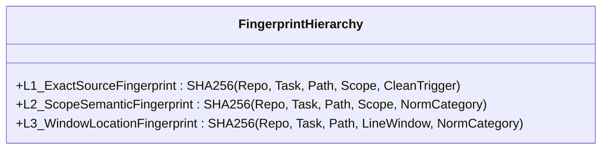
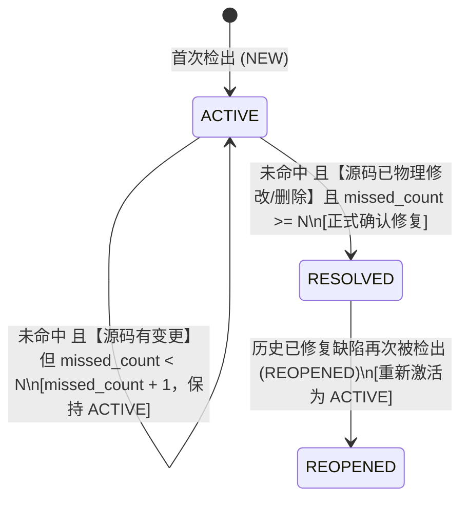
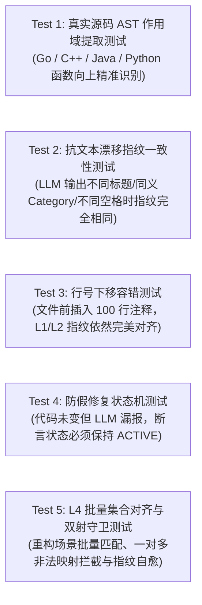
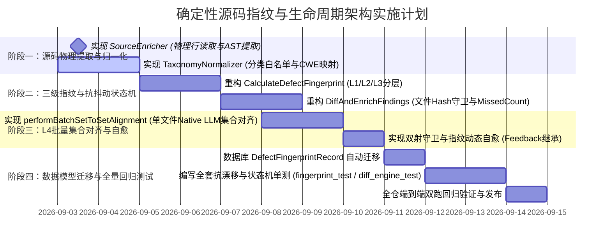

# 确定性源码指纹与抗抖动缺陷增量生命周期架构设计

> **版本**：v1.1  
> **状态**：Ready for Implementation  
> **适用模块**：`code-shield` 核心分析引擎、指纹比对引擎、大模型调度与后处理流水线  
> **核心目标**：彻底解决生产环境中“同一代码仓相同任务多次扫描时缺陷被大面积误关闭 (RESOLVED) 与重复新建 (NEW/REOPENED)”的假修复与幽灵复活问题，实现指纹计算与源码物理确定性严格绑定，将缺陷生命周期流转与物理代码版本变更绑定。

---

## 一、 背景与根因深度剖析

### 1.1 现状与痛点现象
在 CodeShield 生产环境中，针对同一个代码仓（代码未做任何修改），连续执行两次相同的扫描任务，常常出现以下异常：
1. **大量缺陷被误标为已修复（RESOLVED）**：上一次检出的缺陷在第二次扫描报告中消失或被统计为“已修复”；
2. **大量相同缺陷被重新识别为新增（NEW）或复发（REOPENED）**：第二次扫描检出的缺陷无法与历史指纹对齐，导致缺陷看板数据剧烈震荡；
3. **人工反馈与豁免规则失效**：研发人员针对某缺陷标记了“误报 (FALSE_POSITIVE)”或“不修复 (WONT_FIX)”，但下一轮扫描因为指纹计算漂移，导致历史记忆无法继承，重复向开发者告警。

---

### 1.2 代码级根因定位实证

通过对 CodeShield 现有代码库的深度排查，发现以下 4 个核心技术根因：

```mermaid
flowchart TD
    subgraph Problem1["根因 1: 字段漏传与指纹退化"]
        A1["TaskRunner 解析 AI JSON"] -->|未赋值 TriggerLine/ScopeSymbol| A2["DiffEngine 接收到空字段"]
        A2 -->|局部 CodeSnippet 无法提取函数名| A3["退化为文件名指纹: repo|task|path|filename|空"]
        A3 --> A4["同文件多缺陷指纹碰撞或完全漂移"]
    end

    subgraph Problem2["根因 2: 激进的假修复打标"]
        B1["大模型单次推理概率漏报 / 指纹微偏"] --> B2["seenInThisScan 为 false"]
        B2 -->|只要该文件被扫过| B3["diff_engine.go:113 立即置 RESOLVED"]
        B3 --> B4["大面积假修复产生"]
    end

    subgraph Problem3["根因 3: 分类自由文本污染 L2 弱指纹"]
        C1["LLM 输出同义词 (内存泄漏 vs 基础内存泄漏 vs CWE-401)"] --> C2["L2 弱指纹直接拼接 raw category"]
        C2 --> C3["L2 容错机制彻底失效"]
    end

    subgraph Problem4["根因 4: 模型混跑与高采样温度"]
        D1["Dispatcher 负载均衡跨模型分发 (DeepSeek / GLM-4)"] --> D2["不同模型输出代码行与格式微差"]
        D2 --> D3["文本发散加剧指纹漂移"]
    end
```



1. **根因 1：`task_runner.go` 字段漏传与局部 Snippet 作用域提取失效**
   - 在 `services/task_runner.go:829-844`（`executeAnalysisOnce` 与 `loadFindingsFromChunkFile`）中，解析大模型输出时仅提取了 `file_path`、`line_number`、`code_snippet` 等，**完全没有给 `TriggerLine` 和 `ScopeSymbol` 赋值**；
   - 在 `services/diff_engine.go:49` 中，`ExtractScopeSymbol(f.FilePath, f.CodeSnippet)` 传入的 `f.CodeSnippet` 通常仅有 3~5 行局部出错代码，**绝大多数情况下根本不包含函数签名行（如 `func ...`、`void ...`）**，导致提取结果为空字符串；
   - 在 `services/fingerprint.go:24` 中，空 `ScopeSymbol` 退化为 `filepath.Base(normPath)`（文件名），空 `TriggerLine` 规范化后为空字符串，导致**同一文件下的多个不同缺陷计算出完全相同的指纹，或在有微小改动时完全无法对齐**。

2. **根因 2：`diff_engine.go` 首次未命中即置 `RESOLVED` 的激进策略**
   - 检查 `services/diff_engine.go:111-119`：
     ```go
     if !seenInThisScan[fp] && record.Status == "ACTIVE" && scannedFileSet[normRecordPath] {
         models.DB.Model(record).Updates(map[string]interface{}{"status": "RESOLVED"})
         resolvedCount++
     }
     ```
   - 现有的“扫描范围守卫”仅判断了文件是否在本次扫描列表中。只要大模型在本次扫描中由于采样概率漏报了某个缺陷，或者由于文本轻微漂移导致指纹未命中，**系统在单次扫描中就会将历史所有 ACTIVE 缺陷瞬间标记为 RESOLVED**。下一轮扫描重新检出时又被当成 NEW，造成灾难性的“关闭-新建-再关闭”高频震荡。

3. **根因 3：大模型自由文本 `category` 直接参与 L2 弱指纹计算**
   - 在 `services/fingerprint.go:42-43` 中，L2 弱指纹直接对 `category` 进行小写去空格处理后计算 Hash；
   - 虽然 Prompt 中定义了推荐分类，但大模型经常输出近义词（如“内存泄漏”、“堆内存未释放”、“CWE-401”、“基础内存泄漏”）。未经过服务端受控白名单字典映射，导致 L2 弱指纹在两次扫描中计算出的 Hash 完全不同，容错机制完全失效。

4. **根因 4：异构模型混合调度与解码参数随机性**
   - 在 `services/dispatcher.go` 中，多模型服务器环境下，同一次任务的不同分片可能被分发给不同的模型实例；
   - 模型端点未严格锁死 `temperature: 0.0` / 确定性解码，导致大模型在输出代码片段、行号边界时存在随机抖动。

---

## 二、 核心设计思想与架构原则

针对上述根因与专家建议，确立以下 4 大核心架构原则：

| 架构原则 | 核心内涵 | 解决的关键痛点 |
| :--- | :--- | :--- |
| **源码物理真实源 (Source-Grounded SSOT)** | 指纹的核心特征（TriggerLine、ScopeSymbol）**100% 取自物理磁盘上的真实源码**，而非大模型生成的自由文本。大模型只负责提供“坐标定位”。 | 彻底消除 LLM 幻觉、截断、格式漂移对指纹的干扰 |
| **身份与描述严格解耦 (Identity Decoupling)** | 把“这个缺陷是什么（指纹/生命周期）”与“这个缺陷怎么描述（报告/标题/建议）”彻底解耦。自由文本永不参与指纹计算。 | 无论大模型写什么标题或解释，只要代码位置与特征不变，指纹恒定 |
| **物理代码变更守卫 (Code-Change Guard)** | 缺陷流转为 `RESOLVED` 必须满足“**物理代码确实被修改或删除了**”或者“**连续多轮扫描确认消失**”，严禁因单次大模型概率漏报而将缺陷置为已修复。 | 彻底终结缺陷“假修复”与“幽灵复活”的剧烈震荡 |
| **四级分层漏斗与智能自愈 (Tiered Matching Funnel)** | 构建 **L1 (精确源码行强指纹 90%) $\to$ L2 (函数作用域弱指纹 8%) $\to$ L3 (物理行号区间兜底 1.5%) $\to$ L4 (单文件批量集合语义对齐与自愈 0.5%)** 的分层漏斗体系。 | 既拥有微秒级哈希的极速与 100% 确定性，又具备大模型全局视野下抗深层代码重构的智能对齐能力。 |

---

## 三、 总体架构与四级比对漏斗数据流

```mermaid
flowchart TB
    subgraph Phase1["1. AI 扫描与坐标输出"]
        LLM["AI 智能体 / LLM 执行扫描"] -->|输出结构化 JSON| RawFinding["RawFinding (file_path, line_number, raw_category, title, detail)"]
    end

    subgraph Phase2["2. 服务端物理源码确定性解析与归一化 (Source Grounding & Normalization)"]
        RawFinding --> SrcEnricher["【新增】物理源码感知器 (SourceEnricher)"]
        SrcEnricher -->|读取对应行真实代码并去噪| RealTrigger["精确 TriggerLine (源码物理行 Token)"]
        SrcEnricher -->|全文件逆向 AST 回溯| RealScope["精准 ScopeSymbol (真实外层函数/类签名)"]
        
        RawFinding --> CatNorm["【新增】Taxonomy 受控分类归一化器"]
        CatNorm -->|白名单字典 & CWE 映射| NormCategory["规范化 Category (受控枚举)"]
    end

    subgraph Phase3["3. 四级阶梯匹配漏斗 (Tiered Funnel Engine)"]
        RealTrigger & RealScope --> L1Match{"Level 1: L1 源码强指纹匹配\n(SHA256: Path+Scope+TriggerLine)"}
        L1Match -->|✅ 命中 90% 流量| MatchDone["【快速命中 EXISTED】\n(耗时 < 0.01ms, 0 Token)"]
        
        L1Match -->|❌ 未命中| L2Match{"Level 2: L2 作用域弱指纹匹配\n(SHA256: Path+Scope+NormCat)"}
        L2Match -->|✅ 命中 8% 流量| MatchDone
        
        L2Match -->|❌ 未命中| L3Match{"Level 3: L3 行号区间兜底匹配\n(SHA256: Path+Window+NormCat)"}
        L3Match -->|✅ 命中 1.5% 流量| MatchDone
        
        L3Match -->|❌ 均未命中| L4Match{"Level 4: 单文件批量集合语义对齐\n(同文件内有未命中的 Old/New 集合?)"}
        L4Match -->|无历史未命中缺陷| NewFlow["【标记为全新缺陷 NEW】\n(创建新指纹记录)"]
        L4Match -->|有历史未命中缺陷 (0.5% 流量)| BatchLLM["【唤醒 Native Thin LLM】\n单文件批量二部图映射仲裁"]
        
        BatchLLM -->|判定为同一代码演进 (is_same)| HealedFlow["【指纹智能自愈 & 标记 EXISTED】\n更新历史记录指纹，无缝继承人工反馈"]
        BatchLLM -->|判定为不同问题| NewFlow
    end

    subgraph Phase4["4. 抗抖动平滑增量状态机 (Robust Diff Engine)"]
        MatchDone & HealedFlow --> ExistedUpdate["重置 missed_count = 0, 更新活跃时间"]
        
        DiffEngine --> HistoryCheck{"未命中的历史 ACTIVE 缺陷"}
        HistoryCheck -->|Git/内容 Hash 检查: 源码无变更| KeepActive["【防假修复拦截】保持 ACTIVE\n(missed_count 不满足阈值，记为疑似漏报)"]
        HistoryCheck -->|源码发生物理变更 且 连续 N 次未命中| ResolveFlow["流转为 RESOLVED\n(正式标记已修复)"]
    end
```

---

## 四、 核心模块详细设计

### 4.1 物理源码感知器与 AST 作用域解析器 (`SourceEnricher`)

#### 4.1.1 职责与工作机制
大模型在完成分析后，仅输出目标文件相对路径 `file_path` 与行号信息 `line_number`（支持单个行号 `"78"`、范围 `"78-85"`、离散行 `"41,42"`）。

服务端在 `DiffAndEnrichFindings` 之前，调用 `EnrichFindingWithSourceCode(repoRoot string, finding *models.AnalysisFinding)`：
1. **解析起始行号**：安全提取首个有效行号 `startLine`；
2. **提取真实 `TriggerLine`**：直接打开物理磁盘上的源码文件，读取 `startLine` 处的真实代码行（若为行范围，读取该范围内的首个非空、非纯注释有效代码行）；
3. **AST / 正则逆向回溯提取 `ScopeSymbol`**：不再使用只有 3 行的局部代码片段，而是**以整个源码文件为上下文**，从 `startLine` 向上逆向扫描或构建 AST，精准获取包含该行的最内层函数/方法签名。

#### 4.1.2 多语言作用域逆向扫描算法
为保证毫秒级高效执行与极简依赖，结合多语言语法特征实现**行级向上回溯扫描器**：

```go
// ExtractScopeSymbolFromSource 从物理源码文件中根据行号精确定位 enclosing function/class
func ExtractScopeSymbolFromSource(filePath string, fileContent string, targetLine int) string {
	lines := strings.Split(fileContent, "\n")
	if targetLine <= 0 || targetLine > len(lines) {
		return ""
	}

	ext := strings.ToLower(filepath.Ext(filePath))
	// 从 targetLine 逐行向上回溯，寻找最近的函数定义头
	switch ext {
	case ".go":
		// 向上寻找匹配: func (recv) Method(...) 或 func Function(...)
		reGo := regexp.MustCompile(`^func\s+(\([^)]+\)\s+)?([A-Za-z0-9_]+)`)
		for i := targetLine - 1; i >= 0; i-- {
			line := strings.TrimSpace(lines[i])
			if m := reGo.FindStringSubmatch(line); len(m) >= 3 {
				recv := strings.TrimSpace(m[1])
				if recv != "" {
					return recv + "." + m[2]
				}
				return m[2]
			}
		}
	case ".c", ".cpp", ".cc", ".cxx", ".h", ".hpp":
		// C/C++: 返回类型 Type Class::Method(...) 或 Function(...)
		reCpp := regexp.MustCompile(`^(?:[A-Za-z0-9_<>\*&:\s]+)\s+([A-Za-z0-9_]+::[A-Za-z0-9_]+|[A-Za-z0-9_]+)\s*\([^;]*\)\s*(?:const)?\s*\{?`)
		for i := targetLine - 1; i >= 0; i-- {
			line := strings.TrimSpace(lines[i])
			if strings.HasPrefix(line, "if ") || strings.HasPrefix(line, "while ") || strings.HasPrefix(line, "for ") || strings.HasPrefix(line, "switch ") {
				continue
			}
			if m := reCpp.FindStringSubmatch(line); len(m) >= 2 {
				return strings.TrimSpace(m[1])
			}
		}
	case ".java", ".kt", ".scala":
		// Java: [public/private/protected/static] ReturnType methodName(...)
		reJava := regexp.MustCompile(`(?:public|protected|private|static|\s)+[\w<>\[\]]+\s+([A-Za-z0-9_]+)\s*\([^)]*\)\s*\{?`)
		for i := targetLine - 1; i >= 0; i-- {
			line := strings.TrimSpace(lines[i])
			if strings.HasPrefix(line, "if") || strings.HasPrefix(line, "for") || strings.HasPrefix(line, "while") {
				continue
			}
			if m := reJava.FindStringSubmatch(line); len(m) >= 2 {
				return m[1]
			}
		}
	case ".py":
		// Python: def function_name(...) 或 class ClassName:
		rePy := regexp.MustCompile(`^(?:async\s+)?(?:def|class)\s+([A-Za-z0-9_]+)`)
		for i := targetLine - 1; i >= 0; i-- {
			line := lines[i]
			if m := rePy.FindStringSubmatch(strings.TrimSpace(line)); len(m) >= 2 {
				return m[1]
			}
		}
	}

	return ""
}
```

---

### 4.2 三级指纹分层体系设计 (Layered Fingerprint Hierarchy)

为解决不同程度的代码重构（如增删注释、修改行号、重构局部变量）下的指纹稳定性，系统定义三级指纹结构：



| 指纹级别 | 计算公式 (Raw Key 组成) | 适用场景与容错能力 | 匹配优先级 |
| :--- | :--- | :--- | :--- |
| **L1 强指纹 (Exact Source)** | `repo:R\|task:T\|path:P\|scope:S\|trigger:NormalizedRealTriggerLine` | **精确匹配**。只要触发缺陷的那一行真实代码未变，即使整个文件行号整体下移 1000 行，指纹 100% 保持一致。 | **Priority 1 (最高)** |
| **L2 作用域弱指纹 (Scope Semantic)** | `repo:R\|task:T\|path:P\|scope:S\|cat:NormalizedCategory` | **函数内小幅重构容错**。触发行本身被修改（如修改了变量名或增加了判空），但仍处于同一函数作用域下的同类问题，继承生命周期。 | **Priority 2** |
| **L3 位置区间兜底指纹 (Window Location)** | `repo:R\|task:T\|path:P\|win:LineWindow\|cat:NormalizedCategory`<br>*(其中 LineWindow 为 `startLine / 30` 计算的分块区间)* | **无函数全局代码/重构容错**。针对全局变量定义或函数名被重命名，但在相近行数区间（$\pm 30$ 行）内的同类缺陷做最终兜底。 | **Priority 3** |

---

### 4.3 Taxonomy 受控分类归一化器 (`TaxonomyNormalizer`)

#### 4.3.1 白名单枚举与 CWE 映射规则
系统在 `services/taxonomy_normalizer.go` 中维护各任务类型的标准分类白名单（SSOT），并将常见的自由文本近义词及 CWE 编号强制归一化：

```go
// 标准受控分类定义
var TaskTypeTaxonomy = map[string][]string{
	"memory-leak": {
		"基础内存泄漏", "资源泄漏", "野指针与悬空指针", "重复释放", 
		"异常安全", "智能指针问题", "RAII原则违反", "其他常见问题",
	},
	"float-comparison": {
		"直接等值比较", "不等式精度问题", "NaN/Inf未校验", "浮点转整型溢出", "其他精度问题",
	},
	"thread-create": {
		"显式线程创建", "线程池未复用", "线程生命周期失控", "缺少同步与汇合", "并发安全隐患",
	},
	"coredump-risk": {
		"空指针解引用", "数组越界访问", "非法内存读写", "除以零异常", "栈溢出与深层递归",
	},
}

// CWE 与自由词归一化映射字典
var CategorySynonymMap = map[string]string{
	// 内存泄漏任务映射
	"cwe-401": "基础内存泄漏", "cwe-404": "资源泄漏", "cwe-416": "野指针与悬空指针",
	"cwe-415": "重复释放", "cwe-476": "空指针解引用", "cwe-119": "数组越界访问",
	"内存泄漏": "基础内存泄漏", "malloc未free": "基础内存泄漏", "new未delete": "基础内存泄漏",
	"句柄未关闭": "资源泄漏", "fd未关闭": "资源泄漏", "文件未关闭": "资源泄漏",
	"悬垂指针": "野指针与悬空指针", "use after free": "野指针与悬空指针",
	"double free": "重复释放", "二次释放": "重复释放",
}
```

#### 4.3.2 归一化处理流水线
1. 对大模型输出的原始 `Category` 字符串进行清洗（去前后空格、转小写）；
2. 优先匹配该 `task_type` 下的标准白名单列表（精确或包含匹配）；
3. 次优先查询 `CategorySynonymMap` 别名/CWE 映射表；
4. 若均未命中，按默认分类 fallback（如 `"其他常见问题"`），并在日志中输出归一化警告，供运营人员扩充白名单词库。

---

### 4.4 抗模型抖动的平滑增量状态机 (`Robust Diff Engine`)

#### 4.4.1 防假修复双重守卫机制

为彻底杜绝大模型单次概率漏报造成的假修复，状态机引入**物理代码变更守卫**与**多轮未命中确认机制**：



#### 4.4.2 核心算法逻辑实现

```go
// DiffAndEnrichFindings 执行跨任务缺陷增量比对与抗抖动状态机打标
func DiffAndEnrichFindings(repoID uint, taskReportID uint, taskTypeID uint, repoRoot string, scannedFiles []string, findings []models.AnalysisFinding) ([]models.AnalysisFinding, error) {
	now := time.Now()
	
	// 1. 获取物理代码仓当前 Commit 与文件 Hash 映射
	fileContentHashMap := getRepoFileContentHashes(repoRoot, scannedFiles)
	
	// 2. 加载历史指纹记录并建立 L1/L2/L3 倒排索引
	var existingRecords []models.DefectFingerprintRecord
	models.DB.Where("repo_id = ? AND task_type_id = ?", repoID, taskTypeID).Find(&existingRecords)
	
	l1Map := make(map[string]*models.DefectFingerprintRecord)
	l2Map := make(map[string]*models.DefectFingerprintRecord)
	l3Map := make(map[string]*models.DefectFingerprintRecord)
	for i := range existingRecords {
		rec := &existingRecords[i]
		l1Map[rec.Fingerprint] = rec
		l2Map[rec.L2Fingerprint] = rec
		l3Map[rec.L3Fingerprint] = rec
	}
	
	seenRecordIDs := make(map[uint]bool)
	var enrichedList []models.AnalysisFinding
	var unmatchedNewFindings []*models.AnalysisFinding
	
	// 3. 遍历本次检出的 Findings 进行三级级联匹配
	for i := range findings {
		f := &findings[i]
		
		// (1) 物理源码感知与分类受控归一化
		EnrichFindingWithSourceCode(repoRoot, f)
		f.Category = NormalizeCategory(ctxTaskTypeName, f.Category)
		
		// (2) 计算 L1 / L2 / L3 指纹
		l1FP := CalculateDefectFingerprint(repoID, taskTypeID, f.FilePath, f.TriggerLine, f.ScopeSymbol)
		l2FP := CalculateWeakScopeFingerprint(repoID, taskTypeID, f.FilePath, f.ScopeSymbol, f.Category)
		l3FP := CalculateWindowLocationFingerprint(repoID, taskTypeID, f.FilePath, f.LineNumber, f.Category)
		
		f.Fingerprint = l1FP
		
		// (3) 三级级联匹配
		var matchedRecord *models.DefectFingerprintRecord
		if r, ok := l1Map[l1FP]; ok {
			matchedRecord = r
		} else if r, ok := l2Map[l2FP]; ok {
			matchedRecord = r
		} else if r, ok := l3Map[l3FP]; ok {
			matchedRecord = r
		}
		
		if matchedRecord != nil {
			seenRecordIDs[matchedRecord.ID] = true
			if matchedRecord.Status == "RESOLVED" {
				f.DiffStatus = models.DiffStatusReopened
			} else {
				f.DiffStatus = models.DiffStatusExisted
			}
			// 重置未命中计数并更新活跃信息
			models.DB.Model(matchedRecord).Updates(map[string]interface{}{
				"fingerprint":        l1FP,
				"l2_fingerprint":     l2FP,
				"l3_fingerprint":     l3FP,
				"status":             "ACTIVE",
				"missed_count":       0,
				"last_task_id":       taskReportID,
				"last_seen_at":       now,
				"file_hash_snapshot": fileContentHashMap[strings.ToLower(f.FilePath)],
			})
		} else {
			// 前三级未匹配，暂存收集用于 L4 单文件批量集合语义对齐
			unmatchedNewFindings = append(unmatchedNewFindings, f)
		}
		enrichedList = append(enrichedList, *f)
	}
	
	// 4. 【Level 4 智能语义兜底】单文件批量集合语义对齐与指纹自愈 (仅占 0.5% 流量)
	if len(unmatchedNewFindings) > 0 {
		performBatchSetToSetAlignment(repoID, taskTypeID, taskReportID, unmatchedNewFindings, existingRecords, seenRecordIDs, fileContentHashMap)
	}
	
	// 5. 【抗抖动核心】已扫描文件中未命中历史缺陷的生命周期决策
	const MaxMissedThreshold = 2 // 连续未命中容忍阈值
	
	for _, rec := range existingRecords {
		if rec.Status != "ACTIVE" || seenRecordIDs[rec.ID] {
			continue
		}
		normPath := strings.ToLower(filepath.ToSlash(rec.FilePath))
		if !scannedFileSet[normPath] {
			continue // 该文件未在本次扫描范围内，跳过
		}
		
		currentFileHash := fileContentHashMap[normPath]
		isCodeModified := currentFileHash != "" && currentFileHash != rec.FileHashSnapshot
		
		if !isCodeModified {
			// 物理代码文件没有任何改动！100% 为大模型单次概率漏报，拦截假修复，保持 ACTIVE
			log.Printf("[DiffEngine] Guard activated: Defect #%d in %s not reported by LLM but code unchanged. Retaining ACTIVE.\n", rec.ID, rec.FilePath)
			continue
		}
		
		// 物理代码确实发生了改动
		newMissed := rec.MissedCount + 1
		if newMissed >= MaxMissedThreshold {
			// 物理代码已修改且连续达到未命中阈值，确认修复
			models.DB.Model(&rec).Updates(map[string]interface{}{
				"status":       "RESOLVED",
				"missed_count": newMissed,
			})
			resolvedCount++
		} else {
			// 虽有修改但仅 1 次未命中，增加计数但暂不标 RESOLVED
			models.DB.Model(&rec).Update("missed_count", newMissed)
		}
	}
	
	return enrichedList, nil
}
```

---

### 4.5 单文件批量集合语义对齐与指纹自愈 (`Batch Set-to-Set Alignment & Fingerprint Healing`)

#### 4.5.1 适用场景与触发机制
在前三级（L1 强指纹、L2 弱指纹、L3 位置区间）匹配完成后，对于仍然未匹配的残差项：
- 若同一个物理文件中，**同时存在未命中的历史 ACTIVE 缺陷（Old Set）和本次未命中的新检出缺陷（New Set）**；
- 此时单靠哈希算法可能受制于“深度重构/函数拆分/变量全面重命名”，系统触发 **Level 4 智能语义集合对齐**。

#### 4.5.2 集合对齐协议与 Prompt 契约 (Bipartite Matching Contract)
按物理文件（或函数作用域分桶）聚合，打包为单次 Native Thin LLM 请求（消除 $O(N \times M)$ 笛卡尔积，单文件仅需 1 次调用，耗时 $<500\text{ms}$）：

```json
{
  "file_path": "src/utils/parser.cpp",
  "old_findings": [
    {
      "old_id": "O-1",
      "line_number": "45",
      "scope_symbol": "ParseHeader",
      "title": "malloc 未配对 free",
      "code_snippet": "char* buf = (char*)malloc(1024);"
    }
  ],
  "new_findings": [
    {
      "new_id": "N-1",
      "line_number": "58",
      "scope_symbol": "ParseHeaderAsync",
      "title": "异步解析分支堆内存泄漏",
      "code_snippet": "auto* raw_buffer = (char*)malloc(size);"
    }
  ]
}
```

大模型以结构化 JSON 返回全局对齐判决：

```json
{
  "alignments": [
    {
      "new_id": "N-1",
      "matched_old_id": "O-1",
      "confidence": 0.95,
      "reason": "函数重构为 ParseHeaderAsync，变量重命名为 raw_buffer，但仍为同一段内存分配在提前退出分支未释放的相同缺陷"
    }
  ],
  "unmatched_new": [],
  "unmatched_old": []
}
```

#### 4.5.3 服务端双射守卫与指纹动态自愈
1. **双射合法性校验 (Bijective Guard)**：服务端严格校验 `alignments` 中的映射关系必须为严格的 $1:1$ 双射，若出现一对多或非法 ID 伪造，直接拦截丢弃；
2. **指纹动态自愈 (Fingerprint Self-Healing)**：
   - 匹配成功的 Finding 标记为 `DiffStatus = EXISTED`；
   - 数据库中的历史 `DefectFingerprintRecord` 自动将其 `Fingerprint` 迁移更新为新生成的 L1 指纹；
   - **历史人工反馈与豁免状态（如“误报”/“不修复”）自动平滑继承**，彻底解决重构后历史记忆丢失的痛点。

---

### 4.6 模型固化与 Schema 契约边界

#### 4.6.1 职责边界划分契约
| 实体 | 负责范畴 (SSOT) | 绝对禁止跨界的范畴 |
| :--- | :--- | :--- |
| **大模型 (LLM)** | • 发现潜在代码缺陷<br>• 输出精确位置坐标 (`file_path`, `line_number`)<br>• 生成解释性文本 (`title`, `detail`, `suggestion`)<br>• 在 L4 阶段执行单文件批量集合语义对齐 | • 严禁计算或输出指纹 Hash<br>• 严禁决定缺陷生命周期状态 (`status`)<br>• 严禁输出非受控分类命名 |
| **CodeShield 服务端** | • 根据物理文件提取精确 `TriggerLine`<br>• AST 全文件回溯提取 `ScopeSymbol`<br>• 白名单字典归一化 `Category`<br>• 计算 L1/L2/L3 指纹与增量状态机打标<br>• 对 L4 集合对齐结果执行双射守卫校验与指纹自愈 | • 严禁盲目信任 LLM 自由文本作为唯一标识<br>• 严禁在代码无物理变更时单次标 `RESOLVED` |

#### 4.6.2 解码参数与任务级模型绑定
1. **任务模型基座绑定**：在 `models.TaskType` 与任务上下文 `taskContext` 中，锁定当前任务绑定的固定模型（如 `gemini-3.7-flash` 或 `deepseek-r1`），禁止同一任务的不同分片或多次连续执行在异构模型间随机切换；
2. **确定性解码控制**：在所有缺陷分析阶段（`SingleEngine` / `ChunkedEngine` / `Hunter` / `Judge`），强制注入 `temperature: 0.0` 或 `0.1`，禁用高随机度采样参数。

---

## 五、 数据模型演进 (`models/models.go`)

在 `DefectFingerprintRecord` 中新增多级指纹与抗抖动追踪字段：

```go
// DefectFingerprintRecord 缺陷指纹持久化记录表 (SSOT 唯一真值中心扩展)
type DefectFingerprintRecord struct {
	ID          uint   `gorm:"primaryKey;autoIncrement" json:"id"`
	RepoID      uint   `gorm:"uniqueIndex:idx_repo_task_fp,priority:1;index;not null" json:"repo_id"`
	TaskTypeID  uint   `gorm:"uniqueIndex:idx_repo_task_fp,priority:2;index;not null" json:"task_type_id"`
	Fingerprint string `gorm:"uniqueIndex:idx_repo_task_fp,priority:3;size:64;not null" json:"fingerprint"` // L1 强指纹
	
	// ── 新增: 多级指纹与抗抖动字段 ──
	L2Fingerprint    string `gorm:"size:64;index" json:"l2_fingerprint"`     // L2 作用域弱指纹
	L3Fingerprint    string `gorm:"size:64;index" json:"l3_fingerprint"`     // L3 位置区间兜底指纹
	MissedCount      int    `gorm:"default:0" json:"missed_count"`           // 连续未命中扫描次数计数
	FileHashSnapshot string `gorm:"size:64" json:"file_hash_snapshot"`       // 上次检出时该物理文件的 SHA-256 Hash
	
	FilePath    string `gorm:"size:512;not null" json:"file_path"`
	ScopeSymbol string `gorm:"size:256" json:"scope_symbol"`                 // 真实函数/类/方法签名
	Category    string `gorm:"size:255" json:"category"`                     // 归一化后的标准分类
	Status      string `gorm:"size:32;default:'ACTIVE';index" json:"status"` // ACTIVE, RESOLVED
	
	// 人工反馈状态 (保持既有能力不变)
	FeedbackStatus string     `gorm:"size:32;default:'UNREVIEWED';index" json:"feedback_status"`
	FeedbackReason string     `gorm:"type:text" json:"feedback_reason"`
	FeedbackUserID *uint      `json:"feedback_user_id"`
	FeedbackUser   *User      `gorm:"foreignKey:FeedbackUserID" json:"feedback_user,omitempty"`
	FeedbackAt     *time.Time `json:"feedback_at"`

	FirstTaskID uint           `json:"first_task_id"`
	LastTaskID  uint           `json:"last_task_id"`
	FirstSeenAt time.Time      `json:"first_seen_at"`
	LastSeenAt  time.Time      `json:"last_seen_at"`
	CreatedAt   time.Time      `json:"created_at"`
	UpdatedAt   time.Time      `json:"updated_at"`
	DeletedAt   gorm.DeletedAt `gorm:"index" json:"-"`
}
```

---

## 六、 回归测试矩阵与质量保障

在 `services/fingerprint_test.go` 与 `services/diff_engine_test.go` 中建立全覆盖的自动化测试套件：



### 关键测试用例清单
1. **`TestExtractScopeSymbolFromSource_MultiLanguage`**：
   - 验证 Go 结构体方法 `(s *Scanner) Run`、C++ 类方法 `BufferPool::Allocate`、Java `UserManager.getUser`、Python 类方法及异步函数的精准提取；
2. **`TestFingerprint_DeterministicAcrossLLMDrift`**：
   - 模拟同一代码缺陷，两次由 LLM 分别输出：
     - A 轮：`category: "基础内存泄漏"`, `title: "malloc未释放"`, `line_number: "45"`
     - B 轮：`category: "cwe-401"`, `title: "堆内存资源泄漏隐患"`, `line_number: "45-48"`
   - 验证经过服务端归一化与源码物理提取后，计算得到的 `L1` 与 `L2` 指纹 100% 相同；
3. **`TestDiffEngine_GuardAgainstFalseResolution`**：
   - 模拟第一轮扫出 3 个缺陷，第二轮代码未做任何修改但大模型漏报了 2 个缺陷；
   - 校验：系统必须拦截假修复，`resolved_defects_count` 必须为 0，历史 3 个缺陷全部保持 `ACTIVE`；
4. **`TestDiffEngine_BatchSetToSetAlignmentAndHealing`**：
   - 模拟代码发生深度重构，前三级未命中；
   - 触发 L4 批量集合对齐，验证新旧缺陷成功配对，数据库中历史记录的指纹自动更新为新指纹，且历史人工反馈标签（`FeedbackStatus = FALSE_POSITIVE`）被成功继承。

---

## 七、 实施演进路线图



---

## 八、 总结

本设计通过**“物理源码提取确定性特征”**替代**“脆弱的大模型生成文本”**，通过**“受控分类枚举与映射”**规避**“分类自由词发散”**，通过**“文件内容变更守卫与连续未命中计数”**终结**“单次模型抖动导致的假修复大面积震荡”**，最后通过**“L4 单文件批量集合对齐与指纹自愈”**攻克**“复杂代码重构下的跨周期记忆继承”**。

改造后，CodeShield 将具备极高工业级稳定性的缺陷增量追踪与历史记忆能力，为企业多任务治理与研发效能看板提供坚实可靠的底层数据基石。
