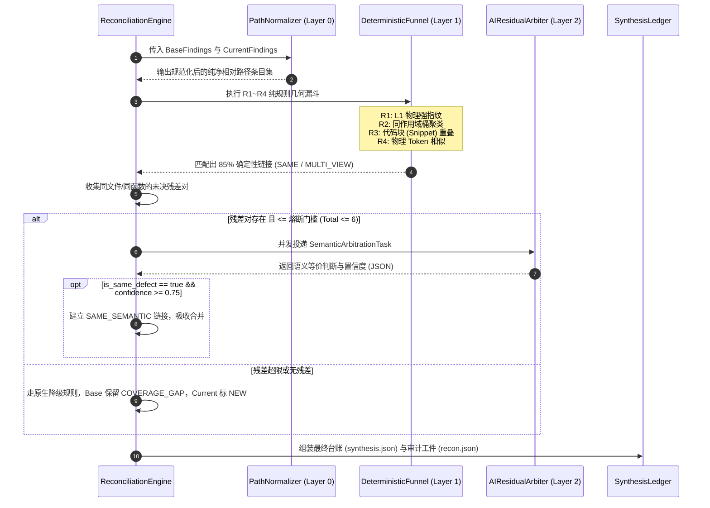

# 混合对账架构演进：确定性空间漏斗增强与 R5 残差 AI 语义仲裁落地设计

> **版本**：v1.0  
> **状态**：Ready for Implementation / Architecture Review  
> **专题归属**：Code-Shield 确定性源码指纹与抗抖动增量生命周期架构 (Deterministic Fingerprint Governance)  
> **关联基线**：
> - [01-确定性源码指纹与抗抖动增量生命周期架构设计.md](./01-确定性源码指纹与抗抖动增量生命周期架构设计.md)  
> - [02-下一代确定性缺陷生命周期与空间几何对齐架构设计.md](./02-下一代确定性缺陷生命周期与空间几何对齐架构设计.md)  
> - [05-同一代码仓多次扫描问题清单的系统化对账与增量治理架构设计.md](./05-同一代码仓多次扫描问题清单的系统化对账与增量治理架构设计.md)  
> **实证样本源**：开源 C++ 基础库 `fmt` 连续扫描实测报告
> - 基线报告 A：`report-181-synthesis-fmt.json`（23 条活动条目）
> - 新扫描报告 B：`report-182-synthesis-fmt.json`（26 条活动条目）
> - 实测对账日志：`recon-182-vs-181.json`

---

## 一、 背景与现网实证复盘

在代码质量与安全全量审查中，Code-Shield 通过 Report-to-Report (R2R) 对账引擎在前后两次全量扫描报告间建立条目关联。在 2026-09-06 对 `fmt` 仓的第 181 轮与 182 轮连续全量扫描实测中，发现了多组**“人工与代码层面 100% 属于同一个缺陷，但系统无法识别关联、造成条目割裂与幽灵并存”**的典型案例。

深入剖析这批漏网用例，揭示出单纯依赖“纯物理/纯规则匹配”或“全盘交给 AI”均存在严重缺陷。

### 1.1 实测漏判典型案例归因矩阵

| 案例编号 | 涉及文件与实际缺陷 | 181 条目状态 | 182 条目状态 | 系统判定关系 | 根因与规则盲区 |
| :--- | :--- | :--- | :--- | :--- | :--- |
| **Case 1** | `format.h:794~800`<br>`basic_memory_buffer::grow` 扩容越界 | `F181-c1accebe`<br>(行号 795-800) | `F182-33b5e5b6`<br>(行号 794) | 181 被判 `VANISHED`<br>182 被判 `NEW` | **工程路径污染**：181 路径混入前缀 `codes/scylladb/fmt/`，物理文件检查误判被删除。 |
| **Case 2** | `chrono.h:520~526`<br>`gmtime` 回退调用非线程安全静态区 | `F181-dbca92ec`<br>(行号 499-531) | `F173-328e66e0`<br>(行号 522) | 181 被判 `VANISHED`<br>182 越级唤醒 F173 | **路径污染导致血统断裂**：181 活跃条目被错误注销，182 无法识别 181，转而复活冷归档池。 |
| **Case 3** | `std.h:670~695`<br>`nested_exception` 递归展开无深度限制栈溢出 | `F181-e5e11409`<br>(行 671，安全风险) | `F182-08e895ad`<br>(行 688，边界逻辑) | 181 留存 `COVERAGE_GAP`<br>182 上报为 `NEW` | **模型表述与视角抖动**：同函数内行差 17 行，且模型分类漂移，Token Jaccard 为 0，规则漏斗彻底失效。 |
| **Case 4** | `printf.h:487~488`<br>空 C-string 带精度截断段错误崩溃 | `F181-36bec74e` (487)<br>`F180-f07ab639` (488) | `F182-36bec74e` (487)<br>`F180-f07ab639` (488) | 两轮报告中均同时并存双胞胎条目 | **代码块重叠未利用**：相差 1 行，触发语句单行 Token 相似度仅 0.229，但 6 行上下文代码块 100% 相同，现有规则只比单行导致漏判。 |
| **Case 5** | `args.h:108~136`<br>具名参数占位符致 `data_.size()` 越界 +1 | `F181-815b1bd3`<br>(行号 108-136) | `F179-bed43c44`<br>(行号 134) | 181 被判 `VANISHED`<br>历史项保留为存量 | **路径污染 + 宏观区间重叠**：181 覆盖 108~136 行未合并到 134 行存量，次轮因前缀被清除。 |

---

## 二、 架构决策推演 (Architecture Decision Record)

针对上述痛点，技术选型面临核心权衡：**是全量引入 AI 对账，还是在规则体系内打补丁，亦或是构建分层混合对账架构？**

### 2.1 方案对比与决策矩阵

```
                       ┌─────────────────────────────────────────────────────────┐
                       │               所有 Base 与 Current 候选条目              │
                       └────────────────────────────┬────────────────────────────┘
                                                    │
                                                    ▼
                       ┌─────────────────────────────────────────────────────────┐
                       │   Layer 0: 路径规范化 SSOT 预处理 (零成本、100% 确定性)     │
                       └────────────────────────────┬────────────────────────────┘
                                                    │
                                                    ▼
                       ┌─────────────────────────────────────────────────────────┐
                       │   Layer 1: 确定性空间几何漏斗 R1~R4 (毫秒级、拦截 85~90%)    │
                       │   - L1 强指纹精准匹配                                     │
                       │   - 同文件同作用域聚类                                    │
                       │   - [新增] 代码块 (Snippet) 窗口重叠比对                   │
                       │   - [新增] 函数作用域 (Function Scope) 兜底               │
                       └──────────────────────┬───────────────────┬──────────────┘
                                              │                   │
                        (85~90% 物理明确项)    │                   │ (10~15% 歧义残差对)
                                              ▼                   ▼
                                   ┌──────────────────────┐  ┌──────────────────────────────────┐
                                   │ 确定性认领 (SAME)     │  │ Layer 2: R5 AI 残差语义仲裁引擎   │
                                   │ - 零 Token 消耗      │  │ - 仅限同文件/同函数未决残差对       │
                                   │ - 纳秒级吞吐         │  │ - 极窄触发 (<3对)，<1s 响应       │
                                   └──────────────────────┘  │ - 识别根因等价性 (SAME_SEMANTIC)   │
                                                             └──────────────────────────────────┘
```

| 评估维度 | 方案 A：全量 AI 两两对账 | 方案 B：纯硬编码规则修补 | **方案 C：分层混合架构 (推荐)** |
| :--- | :--- | :--- | :--- |
| **实现机制** | 将两份报告全部条目打包送入大模型完成二部图对齐 | 继续调整 Jaccard 门槛、增加正则表达式和行号容错硬编码 | **Layer 0 路径归一 + Layer 1 规则漏斗过滤 90% + Layer 2 AI 残差仲裁 10%** |
| **Token 成本** | **极高**（全量 $O(N \times M)$ 或超长 Prompt，每轮千/万 Token） | **零成本** | **极低**（仅触发未决残差对，全仓通常调用 1~3 次，每次数百 Token） |
| **端到端耗时** | 增加 15~40 秒，拖慢交付流水线 | < 50 毫秒 | < 1.5 秒（极少残差单次并发判别） |
| **确定性与复现性** | **差**（提示词与模型抖动可能导致同一对缺陷不同天判定不一） | **强**（纯数学确定性） | **高**（90% 依靠确定性规则；残差由结构化 JSON Schema 约束） |
| **语义理解能力** | 强（能识破函数头与递归行的同义性） | **极差**（面对 Case 3 这种跨度 17 行且分类漂移的用例完全束手无策） | **极强**（把 AI 用在真正需要自然语言理解的刀刃上） |
| **工程健壮性** | 会掩盖底层的路径污染与脏数据 Bug | 规则陷入阈值两难（放宽导致误合，收紧导致漏合） | **分层治理，各司其职，底座坚固** |

**最终决策**：采纳 **方案 C：分层混合对账架构**。
* **工程路径归一化必须在 Layer 0 解决**，不浪费任何 LLM 算力去弥补工程脏数据；
* **代码块重叠等物理特征在 Layer 1 升级**，毫秒级吃透相邻行多视角；
* **Layer 2（R5）正式接入 AI 语义仲裁**，专门攻克模型表述抖动与行号跳跃导致的悬空残差。

---

## 三、 系统分层设计与实施技术规范

### 3.1 Layer 0：路径规范化与物理指纹基准清洗 (Path Normalization SSOT)

针对 Case 1、Case 2、Case 5 暴露的 `codes/scylladb/fmt/` 路径前缀污染，必须在所有条目进入指纹计算与漏斗之前进行单一真实源规整。

#### 1. 规范化规范定义
无论原始工件由哪种任务引擎（single 模式、chunked 分片模式、本地模式）上报，`FilePath` 统一以相对于代码仓物理根目录的**纯净相对路径**为唯一合法形态（不允许出现绝对路径、不允许包含工作区中间目录）。

```go
// services/reconciliation/anchor.go

// CanonicalizeRelativePath 统一规范化代码仓相对路径 (SSOT)
func CanonicalizeRelativePath(filePath, repoRoot string) string {
    clean := filepath.ToSlash(strings.TrimSpace(filePath))
    if clean == "" {
        return ""
    }
    
    // 1. 若为绝对路径，剥离 repoRoot
    if filepath.IsAbs(clean) && repoRoot != "" {
        cleanRepo := filepath.ToSlash(filepath.Clean(repoRoot))
        if strings.HasPrefix(clean, cleanRepo) {
            clean = strings.TrimPrefix(clean, cleanRepo)
            clean = strings.TrimPrefix(clean, "/")
        }
    }
    
    // 2. 剥离已知的常见前缀模式 (如 codes/{repo}/, workspace/)
    clean = regexp.MustCompile(`^(\./|/)+`).ReplaceAllString(clean, "")
    // 识别诸如 codes/scylladb/fmt/include/... 模式
    parts := strings.Split(clean, "/")
    for i := 0; i < len(parts)-1; i++ {
        // 如果子片段匹配标准源码顶级目录结构，截断外围包装
        if parts[i] == "include" || parts[i] == "src" || parts[i] == "lib" || parts[i] == "support" || parts[i] == "doc" {
            clean = strings.Join(parts[i:], "/")
            break
        }
    }
    return filepath.Clean(clean)
}
```

---

### 3.2 Layer 1：确定性空间几何漏斗增强 (R1~R4)

在现有 `services/reconciliation/funnel.go` 基础上，重点强化 **代码块（Code Snippet）窗口重叠** 与 **函数级语义作用域（Function Scope）锚定**。

#### 1. 新增 R3+：代码上下文块 Jaccard/Dice 重叠（解决 Case 4 printf.h 问题）
现有漏斗只提取了单行 `cleanTrigger`，导致第 487 行 `str + specs.precision` 与第 488 行 `std::find(...)` 无法匹配。但两者的 `Payload.CodeSnippet` 高度重叠。

```go
// services/reconciliation/funnel.go 增强

// CalculateSnippetOverlap 计算两个代码块核心 Token 集合重叠率
func CalculateSnippetOverlap(s1, s2 string) float64 {
    t1 := CleanSourceToken(s1)
    t2 := CleanSourceToken(s2)
    if t1 == "" || t2 == "" {
        return 0.0
    }
    if t1 == t2 {
        return 1.0
    }
    return CalculateTokenJaccard(t1, t2)
}
```

在 Tier 3 判定条件中增加：
$$\text{Matched} \iff (\text{lineDiff} \le 10) \land (\text{SnippetOverlap} \ge 0.70)$$
一旦命中，直接标记为 `Tier: 3`，理由记录为：`同文件代码块上下文高度重叠 (相邻行多视角)`。

#### 2. 新增 R4+：函数作用域级跨行容错
对于 C++、Go、Python 等语言，若两个条目的 `NormalizedScope` 均解析出具体的函数/方法名（如 `write`、`grow`、`vprintf`），且所属文件相同：
* 当 $10 < \text{lineDiff} \le 30$ 时；
* 即使 `Category` 存在漂移，也不直接判定为 NEW/VANISHED，而是收集为 **待审残差对** 送入 Layer 2 仲裁池。

---

### 3.3 Layer 2：R5 残差 AI 语义仲裁引擎 (Residual AI Semantic Arbiter)

#### 1. 触发准入断路器（严格控本与控频）
仅当满足以下全部边界条件时，才激活大模型进行残差语义仲裁：
1. **文件范围收敛**：仅在**同一文件**内比对（绝不跨文件做全连接）。
2. **状态候选对齐**：Base 条目当前未被认领（拟进入 `COVERAGE_GAP`）且 Current 条目未匹配任何基线（拟标记为 `NEW`）。
3. **容量熔断**：单文件内待仲裁候选对数 $N \times M \le 6$；全仓待仲裁总对数 $\le 10$。若超量，判定为代码大规模重构，自动熔断降级为默认独立状态。

#### 2. 仲裁请求数据结构
```go
// services/reconciliation/types.go

// SemanticArbitrationTask 提交给 LLM 的单个残差比对任务
type SemanticArbitrationTask struct {
    FilePath     string                  `json:"file_path"`
    ScopeSymbol  string                  `json:"scope_symbol"`
    BaseItem     ArbitrationFindingItem  `json:"base_item"`
    CurrentItem  ArbitrationFindingItem  `json:"current_item"`
}

type ArbitrationFindingItem struct {
    UID         string `json:"uid"`
    LineNumber  string `json:"line_number"`
    Category    string `json:"category"`
    Severity    string `json:"severity"`
    Title       string `json:"title"`
    Detail      string `json:"detail"`
    Snippet     string `json:"code_snippet"`
}

// SemanticArbitrationResponse 大模型仲裁返回的结构化判决
type SemanticArbitrationResponse struct {
    IsSameDefect bool    `json:"is_same_defect"`
    Confidence   float64 `json:"confidence"`
    Reason       string  `json:"reason"`
    PrimaryUID   string  `json:"primary_uid"` // 推荐采用哪一条的标题/描述作为主诉
}
```

#### 3. 极简结构化 Prompt 设计 (以解决 Case 3 std.h 为例)

```markdown
你是一名顶尖的代码静态分析与缺陷对账仲裁专家。
请判断以下两份针对文件 `{{.FilePath}}` 的审查条目，是否在描述**完全相同的底层代码缺陷/逻辑隐患**（即便两者的分类名称、行号位置或严重级别不同）。

【历史存量缺陷 (Base)】
- UID: {{.BaseItem.UID}}
- 位置: 行 {{.BaseItem.LineNumber}} (作用域: {{.ScopeSymbol}})
- 分类/严重度: {{.BaseItem.Category}} / {{.BaseItem.Severity}}
- 标题: {{.BaseItem.Title}}
- 描述: {{.BaseItem.Detail}}
- 代码片段:
```cpp
{{.BaseItem.Snippet}}
```

【本轮新报缺陷 (Current)】
- UID: {{.CurrentItem.UID}}
- 位置: 行 {{.CurrentItem.LineNumber}}
- 分类/严重度: {{.CurrentItem.Category}} / {{.CurrentItem.Severity}}
- 标题: {{.CurrentItem.Title}}
- 描述: {{.CurrentItem.Detail}}
- 代码片段:
```cpp
{{.CurrentItem.Snippet}}
```

【判决标准】
1. 若两个条目根因相同（例如：均指向同一递归解包路径缺少深度/环控制导致的栈溢出，仅一个抓在入口、一个抓在递归调用处），必须判定为 true。
2. 若属于同一函数中两个完全独立、互不相干的 bug（例如：一个是空指针，另一个是除以零），判定为 false。
3. 请严格输出如下 JSON 格式，禁止包含多余 Markdown 标记：
{
  "is_same_defect": true | false,
  "confidence": 0.0 ~ 1.0,
  "reason": "一句话阐明判定依据",
  "primary_uid": "更准确详实的条目 UID"
}
```

#### 4. 判决结果处理与生命周期继承
当大模型判决 `is_same_defect == true` 且 `confidence >= 0.75` 时：
1. **建立等价链接**：在 `recon-*.json` 中新增关系 `relation: SAME_SEMANTIC`，记录匹配层级 `matched_tier: 5`。
2. **消除幽灵存量**：
   * Base 条目移出 `COVERAGE_GAP`，标记为已在当前轮通过语义关联复现；
   * Current 条目继承 Base 条目的生命周期档案（如 `rounds_seen` 计数递增、继承首发报告 ID）；
   * `diff_status` 修正为 `EXISTED`（消除虚假 `NEW`）。
3. **载荷合并**：严重度取两者冲突区间（例如 `[建议, 致命]`），标题保留更详实的版本。

---

## 四、 核心数据流与时序逻辑



---

## 五、 落地收益与验证准则 (Acceptance Criteria)

针对本文第 1.1 节的 5 大真实用例，方案落地后必须达成以下量化准则：

| 校验用例 | 预期改进状态 | 验收断言 |
| :--- | :--- | :--- |
| **Case 1 (format.h:794)** | `F181-c1accebe` 与 `F182-33b5e5b6` 自动合并 | `recon-182-vs-181.json` 中两者的 relation 必须为 `SAME` 或 `SAME_SEMANTIC`，**绝不可**出现 `VANISHED(文件删除)` 与 `NEW` 割裂。 |
| **Case 2 (chrono.h:522)** | 181 活跃项无损流转给 182 | 181 活跃条目血统不中断，不再发生冷归档池无序跨轮唤醒与父级丢失。 |
| **Case 3 (std.h:671 vs 688)** | 消除高危未复现与建议全新上报的双重幽灵 | 182 报告中针对 `std::nested_exception` 递归栈溢出**仅呈现 1 条活动问题**，不再出现 1 条 COVERAGE_GAP + 1 条 NEW 的重复噪音。 |
| **Case 4 (printf.h:487 vs 488)** | 双胞胎条目归一 | 代码块上下文重叠自动消除相邻行的重复上报，台账净条目数收敛。 |
| **全仓性能与耗时** | 整体对账耗时严格受控 | 全仓对账端到端耗时（含 Layer 2 AI 仲裁）增加不超过 **1.5 秒**，Token 额外开销不超过 **1500 Tokens**。 |

---

## 六、 实施演进路线图 (Roadmap)

1. **Step 1（工程基础，0.5 天）**：
   在 `services/reconciliation/anchor.go` 实现 `CanonicalizeRelativePath`，并在 `PrepareInternalFindings` 最前置生效，立即彻底根治 Case 1、2、5。
2. **Step 2（规则补强，0.5 天）**：
   在 `services/reconciliation/funnel.go` 补齐 `CalculateSnippetOverlap`，将 `code_snippet` 块级比对纳入 Tier 3 裁决，解决 Case 4。
3. **Step 3（AI 残差仲裁落地，1.5 天）**：
   在 `services/reconciliation/arbitration.go` 改造 `ArbitrateResiduals`，接入项目既有的统一 LLM 调用门面（复用 `services/scanner` 的底层 client），完成结构化 Prompt 装配与熔断控制，解决 Case 3。
4. **Step 4（黄金测试集回归，0.5 天）**：
   基于 181 与 182 的真实工件构建 Golden Test Case（`reconcile_golden_test.go`），断言上述 5 个用例全部 100% 精确对齐。
