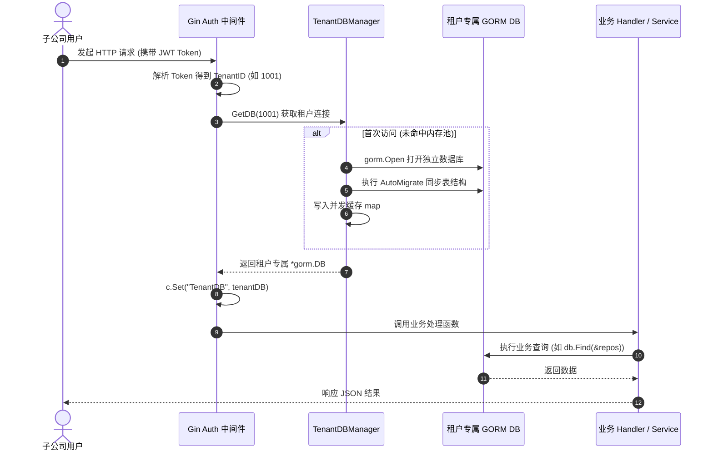

# 02-GORM动态分库路由与连接池管理深度设计

## 1. 架构总览与工作流

在 Database-per-Tenant 架构下，系统的核心目标是：**业务代码对多数据库无感知，由底层连接池管理器与中间件在上游完成上下文绑定**。



---

## 2. 租户连接池管理器 (`TenantDBManager`) 核心实现

在 `models/db.go` 中扩展 `TenantDBManager`，提供线程安全、懒加载、连接生命周期管理：

```go
package models

import (
	"fmt"
	"log"
	"os"
	"path/filepath"
	"sync"
	"time"

	"gorm.io/driver/sqlite"
	"gorm.io/gorm"
	"gorm.io/gorm/logger"
)

type TenantDBManager struct {
	mu        sync.RWMutex
	masterDB  *gorm.DB
	tenantDBs map[uint]*gorm.DB
}

var DBManager = &TenantDBManager{
	tenantDBs: make(map[uint]*gorm.DB),
}

// MasterDB 获取平台级管理主库
func (m *TenantDBManager) MasterDB() *gorm.DB {
	return m.masterDB
}

// GetDB 获取指定租户的专属 GORM 实例
func (m *TenantDBManager) GetDB(tenantID uint) (*gorm.DB, error) {
	if tenantID == 0 {
		return nil, fmt.Errorf("invalid tenant_id: 0")
	}

	// 1. 读锁快速命中
	m.mu.RLock()
	db, exists := m.tenantDBs[tenantID]
	m.mu.RUnlock()
	if exists {
		return db, nil
	}

	// 2. 写锁双重检查与初始化
	m.mu.Lock()
	defer m.mu.Unlock()

	if db, exists := m.tenantDBs[tenantID]; exists {
		return db, nil
	}

	// 3. 构建租户专属数据库路径（以 SQLite 为例）
	tenantDir := filepath.Join(AppConfig.GetDataDir(), "tenants", fmt.Sprintf("tenant_%d", tenantID))
	if err := os.MkdirAll(tenantDir, 0700); err != nil {
		return nil, fmt.Errorf("failed to create tenant directory %s: %w", tenantDir, err)
	}

	dbPath := filepath.Join(tenantDir, "shield.db")
	tenantDB, err := gorm.Open(sqlite.Open(dbPath), &gorm.Config{
		Logger: logger.Default.LogMode(logger.Warn),
	})
	if err != nil {
		return nil, fmt.Errorf("failed to open tenant db (%d): %w", tenantID, err)
	}

	// 4. 连接池参数调优
	sqlDB, err := tenantDB.DB()
	if err == nil {
		sqlDB.SetMaxIdleConns(5)
		sqlDB.SetMaxOpenConns(20)
		sqlDB.SetConnMaxLifetime(30 * time.Minute)
	}

	// 5. 自动同步当前租户的全部业务表结构
	if err := AutoMigrateTenantSchema(tenantDB); err != nil {
		return nil, fmt.Errorf("failed to migrate tenant db (%d): %w", tenantID, err)
	}

	// 6. 存入内存池
	m.tenantDBs[tenantID] = tenantDB
	log.Printf("[TenantDBManager] Successfully initialized tenant database for TenantID: %d (%s)", tenantID, dbPath)
	return tenantDB, nil
}

// AutoMigrateTenantSchema 统一同步租户业务表结构
func AutoMigrateTenantSchema(db *gorm.DB) error {
	return db.AutoMigrate(
		&User{},
		&Department{},
		&Repository{},
		&TaskType{},
		&TaskReport{},
		&KeyIssue{},
		&SystemConfig{},
		&ScheduleConfig{},
		&TaskTriggerLog{},
		&TaskExecutionLog{},
		&AnalysisFinding{},
		&CampaignFinding{},
		&SysAuditLog{},
		&DefectFingerprintRecord{},
		&TaskDebateLog{},
		&RepoFeedbackRule{},
	)
}
```

---

## 3. 中间件接入与上下文注入

在 `code-common/backend/auth` 与 `code-shield` 路由层中挂载租户 DB 注入中间件：

```go
package handlers

import (
	"code-shield/models"
	"net/http"

	"github.com/gin-gonic/gin"
)

const ContextTenantDBKey = "TenantDB"

// TenantDBMiddleware 自动注入当前租户数据库连接
func TenantDBMiddleware() gin.HandlerFunc {
	return func(c *gin.Context) {
		tenantID := c.GetUint("tenant_id")
		if tenantID == 0 {
			c.JSON(http.StatusForbidden, gin.H{
				"error": "Forbidden: Tenant context is required",
			})
			c.Abort()
			return
		}

		tenantDB, err := models.DBManager.GetDB(tenantID)
		if err != nil {
			c.JSON(http.StatusInternalServerError, gin.H{
				"error": "Tenant database unreachable",
				"detail": err.Error(),
			})
			c.Abort()
			return
		}

		c.Set(ContextTenantDBKey, tenantDB)
		c.Next()
	}
}
```

---

## 4. 业务代码平滑适配（极简改动对照）

通过在 `models/db.go` 中提供辅助提取函数，现有业务 Handler 仅需在入口处获取一次 `db`，所有下层业务逻辑（CRUD、Preload、Joins、事务、分页）完全保持不变：

```go
// models/db.go
func DBFromContext(c *gin.Context) *gorm.DB {
	if val, exists := c.Get("TenantDB"); exists {
		if db, ok := val.(*gorm.DB); ok {
			return db
		}
	}
	return DB // 兜底回退
}
```

### Handler 代码改动对比：
```diff
  func GetRepos(c *gin.Context) {
+     db := models.DBFromContext(c)
      page, _ := strconv.Atoi(c.DefaultQuery("page", "1"))
      pageSize, _ := strconv.Atoi(c.DefaultQuery("pageSize", "25"))
      ...
-     query := models.DB.Model(&models.Repository{})
+     query := db.Model(&models.Repository{})

      if deptID != "" {
          query = query.Where("department_id = ?", deptID)
      }
      ...
-     query.Preload("Department").Preload("Owner").Offset(offset).Limit(pageSize).Find(&repos)
+     query.Preload("Department").Preload("Owner").Offset(offset).Limit(pageSize).Find(&repos)
      ...
  }
```
> [!NOTE]
> 业务 Handler 中无需关心 `tenant_id`，查询自动作用在当前子公司的专属数据库上，从根源杜绝越权访问。
