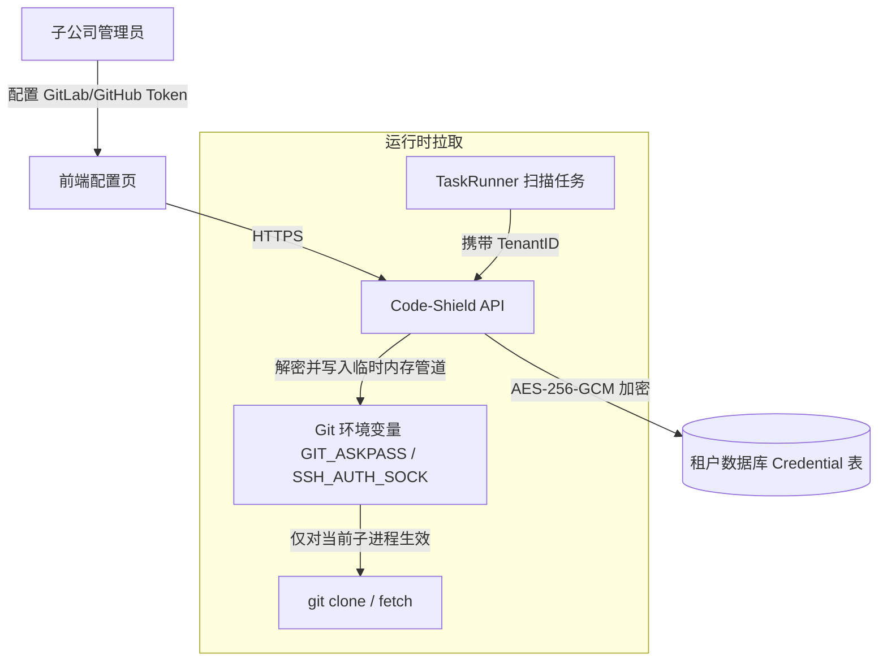

# 04-代码仓凭据保险库与工作区安全沙箱

## 1. 代码仓隔离与安全威胁模型
在多子公司场景中，代码资产保密面临两大核心威胁：
1. **凭据越权与混淆**：子公司 A 的任务克隆代码时，误用或窃取子公司 B 的 Git Deploy Token / SSH Key。
2. **工作区同名覆盖与跨租户文件遍历**：不同子公司有同名项目（如 `backend`），如果存放在同一平铺目录，会导致文件互相覆盖或通过相对路径（`../../`）越权读取。

---

## 2. Git 凭据保险库 (Tenant Credential Vault)

### (1) 凭据加密与存储隔离
各子公司的 Git 访问令牌（Access Token）或 SSH 密钥直接保存在其专属的租户数据库中，字段使用 **AES-256-GCM** 进行对称加密，密钥由宿主机 KMS 或服务端主密钥推导：



### (2) 凭据安全注入机制
* 严禁将明文密码/Token 写入磁盘文件或拼接在命令行参数中（防止 `ps aux` 查看进程参数泄露）。
* 统一采用 `GIT_ASKPASS` 脚本机制，在子进程启动时通过内存管道向 Git 供给认证凭据，进程结束后凭据在内存中彻底销毁。

---

## 3. 工作区文件物理隔离与沙箱目录设计

系统落盘工作目录严格分层，各租户目录设置 `0700`（仅服务进程所有者可读写）：

```text
data/
└── tenants/
    ├── tenant_1001/                  # 子公司 A 独立空间
    │   ├── codes/                    # 代码克隆缓存
    │   │   └── group_a/backend/      # 完整路径命名空间
    │   └── reports/                  # 报告与临时文件
    │       ├── report-101-findings.json
    │       └── report-101-execution.log
    └── tenant_1002/                  # 子公司 B 独立空间
        ├── codes/
        │   └── group_b/backend/      # 同名项目完全隔离
        └── reports/
            ├── report-205-findings.json
            └── report-205-execution.log
```

### (1) 动态路径解析实现
在 `models.TaskReport` 与 `models.Repository` 中：
```go
// GetTenantCodesDir 获取指定租户的代码存放工作区
func GetTenantCodesDir(tenantID uint) string {
	return filepath.Join(AppConfig.GetDataDir(), "tenants", fmt.Sprintf("tenant_%d", tenantID), "codes")
}

// GetTenantReportsDir 获取指定租户的报告存放工作区
func GetTenantReportsDir(tenantID uint) string {
	return filepath.Join(AppConfig.GetDataDir(), "tenants", fmt.Sprintf("tenant_%d", tenantID), "reports")
}
```
通过分立的路径空间，彻底杜绝跨租户代码与报告的相互干扰。
