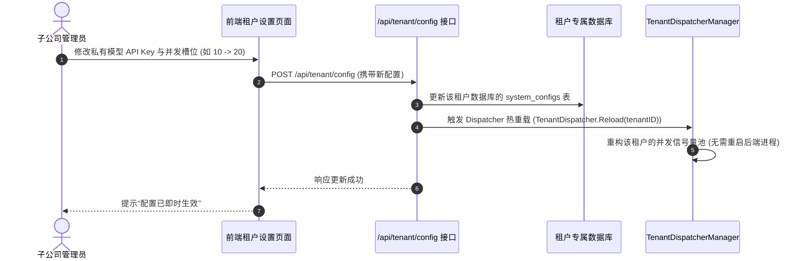

# 07-租户分层配置与动态热加载深度设计

## 1. 设计背景与配置治理痛点

在原有的单租户系统架构中，`config.yaml` 承担了全部的系统配置职责。随着系统向多子公司、多租户演进，集中式的静态 YAML 暴露了明显的架构痛点：
1. **生命周期严重混淆**：宿主机基础设施参数（如端口 `server.port`、Master 数据库）与租户业务级参数（如某子公司的 AI 模型 Key、限流时段、通知 Webhook）混在同一个静态文件中。
2. **改配置必须重启服务**：任何一家子公司调整大模型参数或并发配额，运维人员都必须登录服务器修改 `config.yaml` 并重启整个后端进程，导致全平台所有子公司的正在运行的扫描任务瞬间中断。
3. **无法做到配置自治与数据隔离**：子公司管理员无法在 Web 界面安全地配置自己的私有模型端点、API Key 与工作时间作息。

为此，系统引入**“三层分层配置与动态热加载体系（Hierarchical & Dynamic Configuration Architecture）”**。

---

## 2. 三层配置架构模型

```mermaid
flowchart TD
    subgraph 第一层: 静态宿主机基座 (config.yaml)
        Infra["宿主机基础设施<br>- server.port, server.timeouts<br>- storage.root (全局根目录锚点)<br>- master_database (主管理库)<br>- auth.jwt_secret"]
        DefaultTpl["平台默认基线模板 (Fallback)<br>- ai.tiers_default (默认模型阶梯)<br>- debate_default (默认辩论参数)<br>- work_hours_default (默认工作时间)"]
    end

    subgraph 第二层: Master 租户元数据 (Master DB)
        TenantMeta["Tenant 元信息表<br>- tenant_id (如 1001)<br>- tenant_code (如 corp_a)<br>- name (子公司名称)<br>- db_dsn (专属库连接串/自动推导)"]
    end

    subgraph 第三层: 租户自治动态配置 (Tenant DB)
        TenantAI["AI 资源配置 (system_configs 表)<br>- 专属私有 LLM 端点 & API Key<br>- Tier 1/2/3 阶梯模型映射<br>- 专属最大并发配额"]
        TenantPolicy["运行策略配置<br>- 专属工作时间限流时段 (如 9:00-18:00)<br>- 辩论流候选数与超时"]
        TenantNotify["通知配置<br>- 专属企业微信/飞书/钉钉 Webhook<br>- 专属邮件通知模板"]
    end

    Infra --> Runtime[Code-Shield 运行时]
    TenantMeta --> Runtime
    DefaultTpl -.->|未自定义时自动继承| Runtime
    TenantAI -->|优先覆盖生效 (热更新)| Runtime
    TenantPolicy -->|优先覆盖生效 (热更新)| Runtime
    TenantNotify -->|优先覆盖生效 (热更新)| Runtime
```

---

## 3. 各章节配置项归属与演进全景表

| 原 `config.yaml` 章节与字段 | 多租户架构归属层级 | 存储介质 | 运行时工作机制与热更新能力 |
| :--- | :--- | :--- | :--- |
| **`storage.root` (`datadir`)** | **基座根锚点 + 租户子路径** | `config.yaml` | `config.yaml` 仅定义全局物理根路径（如 `./data`），代码中统一通过动态函数自动派生：<br>`data/tenants/{tenant_id}/codes/`<br>`data/tenants/{tenant_id}/reports/`<br>各子公司磁盘物理隔离，零维护成本。 |
| **`database`** | **Master 库 + 租户分库规则** | `config.yaml` + Master DB | `config.yaml` 仅配置 Master 管理主库；各租户库连接串保存在 Master 库或根据 `tenant_id` 自动解析（SQLite 独立 `.db` 文件）。 |
| **`ai.backend`<br>`ai.tiers`<br>`ai.models`** | **租户专属资源配置** (BYOM) | **租户专属数据库** (`system_configs` 表) | **子公司管理员在 Web 控制台热配置**自己的私有端点、Key 与模型名称；`config.yaml` 中的配置作为新租户接入时的默认继承模板。 |
| **`ai.work_hours_throttle`** | **租户专属作息策略** | **租户专属数据库** (`system_configs` 表) | 各子公司可根据自身作息（如 A 公司早 9 晚 6，B 公司早 10 晚 10）独立设定限流时段与降速比例，互不影响。 |
| **`ai.debate`** | **租户专属治理策略** | **租户专属数据库** (`system_configs` 表) | 辩论流开关、初筛快速通过、单片候选数量等策略按租户独立配置。 |
| **`notification.webhook`** | **租户专属通知渠道** | **租户专属数据库** | 各子公司配置各自的群机器人 Webhook 或私有邮件网关。 |
| **`server.port`<br>`server.read_timeout`** | **全局宿主机配置** | **`config.yaml`** | 纯服务器进程级参数，保持在 `config.yaml` 中，由平台运维人员统一维护。 |

---

## 4. 级联配置门面 (Config Facade) 实现

在 `models/config.go` 中提供统一的级联读取方法，实现 **“租户数据库自定义配置优先 -> 缺失字段自动回退继承 `config.yaml` 平台基线”**：

```go
package models

import (
	"fmt"
	"path/filepath"
)

// TenantRuntimeConfig 封装指定租户在运行时的完整生效配置
type TenantRuntimeConfig struct {
	TenantID   uint
	DataDir    string                  // 该租户专属数据目录
	CodesDir   string                  // 该租户专属代码克隆目录
	ReportsDir string                  // 该租户专属报告输出目录
	AI         AIConfig                // 生效的 AI 引擎与模型阶梯配置
	Debate     DebateFlowConfig        // 生效的多智能体辩论配置
	Throttle   WorkHoursThrottleConfig // 生效的工作时间限流配置
	Webhook    string                  // 生效的通知 Webhook
}

// GetTenantRuntimeConfig 智能级联获取租户生效配置
func GetTenantRuntimeConfig(tenantID uint) TenantRuntimeConfig {
	tenantDir := filepath.Join(AppConfig.GetDataDir(), "tenants", fmt.Sprintf("tenant_%d", tenantID))

	// 1. 初始化为全局基线配置 (继承 config.yaml 默认值)
	cfg := TenantRuntimeConfig{
		TenantID:   tenantID,
		DataDir:    tenantDir,
		CodesDir:   filepath.Join(tenantDir, "codes"),
		ReportsDir: filepath.Join(tenantDir, "reports"),
		AI:         AppConfig.AI,
		Debate:     AppConfig.AI.Debate,
		Throttle:   AppConfig.AI.WorkHoursThrottle,
		Webhook:    AppConfig.Notification.Webhook,
	}

	// 2. 从该租户专属数据库加载自定义覆盖项
	tenantDB, err := DBManager.GetDB(tenantID)
	if err != nil {
		return cfg // 降级使用全局默认
	}

	var configs []SystemConfig
	if err := tenantDB.Find(&configs).Error; err == nil {
		for _, item := range configs {
			switch item.Key {
			case "ai.backend":
				cfg.AI.Backend = item.Value
			case "ai.webhook":
				cfg.Webhook = item.Value
			case "ai.tiers":
				// 反序列化覆盖租户自定义的 Tiers
				_ = json.Unmarshal([]byte(item.Value), &cfg.AI.Tiers)
			case "ai.work_hours_throttle":
				_ = json.Unmarshal([]byte(item.Value), &cfg.Throttle)
			case "ai.debate":
				_ = json.Unmarshal([]byte(item.Value), &cfg.Debate)
			}
		}
	}

	return cfg
}
```

---

## 5. 动态数据目录推导机制 (Dynamic Path Resolver)

业务层严禁硬编码绝对路径或直接拼接全局 `AppConfig.GetDataDir()`，统一使用动态推导函数：

```go
// 租户目录动态推导函数集
func GetTenantDataDir(tenantID uint) string {
	return filepath.Join(AppConfig.GetDataDir(), "tenants", fmt.Sprintf("tenant_%d", tenantID))
}

func GetTenantCodesDir(tenantID uint) string {
	return filepath.Join(GetTenantDataDir(tenantID), "codes")
}

func GetTenantReportsDir(tenantID uint) string {
	return filepath.Join(GetTenantDataDir(tenantID), "reports")
}

func GetTenantCustomTasksDir(tenantID uint) string {
	return filepath.Join(GetTenantDataDir(tenantID), "custom_tasks")
}
```

---

## 6. 前端租户控制台与热重载流程 (Zero-Downtime Hot Reload)



### 架构收益：
1. **平台高可用**：彻底消除因配置调整引发的服务重启，保障 7x24 小时连续作业。
2. **租户完全自治**：子公司自主掌控模型供应商、Token 额度与通知策略，满足合规审计要求。
3. **开箱即用（Zero-Config Onboarding）**：新租户注册即具备默认基线配置，立即可用，按需自定义。
