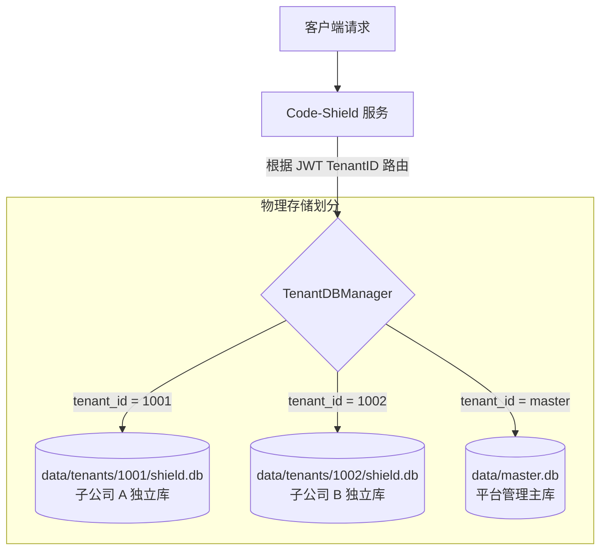

# 01-多租户隔离方案评估与分库架构选型

## 1. 业务挑战与核心诉求
在集团企业与多子公司共用一套研发治理平台的场景下，各子公司对数据主权和资源独占性提出了严苛要求：
* **数据主权**：子公司之间的代码资产、安全扫描结果、历史漏洞是极其敏感的资产，必须实现 100% 的保密隔离。
* **资源自主**：各子公司拥有不同的算力预算与大模型资源（如 A 公司部署了内网千亿参数开源大模型，B 公司采购了 Claude 企业 API），希望独立消耗与核算。
* **业务定制**：不同子公司技术栈和治理重点差异大（如嵌入式 C 内存治理 vs 云原生 Java 微服务规范），需要扩展专属的扫描任务类型。

---

## 2. 三大多租户隔离架构选型对比

| 评估维度 | 方案 A：共享数据库逻辑隔离 (Row-Level Security) | 方案 B：分库隔离模式 (Database-per-Tenant, 推荐) | 方案 C：物理独立部署 (Multi-Instance) |
| :--- | :--- | :--- | :--- |
| **实现原理** | 所有租户共享同一数据库，所有表加 `tenant_id`，查询拼 `WHERE tenant_id = ?` | 单一应用服务进程，每个租户拥有独立的数据库文件（SQLite）或独立库（MySQL） | 每个子公司独立部署一套完整的 Server、DB、前端和工作节点 |
| **隔离安全性** | **中低**。依赖代码层严密过滤，极易因开发疏漏出现水平越权（IDOR） | **极高**。物理连接完全独立，跨库访问在底座层被物理截断 | **最高**。网络与物理完全独立 |
| **代码侵入性** | **高**。现有数十张表、数百处 CRUD 与关联查询全部需要重构添加租户过滤 | **极低**。上层业务表模型、GORM 查询、关联关系几乎 **0 改动** | **无**。无需修改代码 |
| **定制化能力** | **受限**。公共表结构与任务类型难以为单一租户进行灵活扩展 | **高**。租户库内模型配置、自定义任务类型（TaskType）数据完全自治 | **高**。完全自治 |
| **备份与合规** | **困难**。单租户数据备份/清理/恢复需要复杂的 SQL 导出与清洗 | **极优**。可单独对特定子公司的数据库文件进行离线备份、迁移或安全销毁 | **极优**。独立运维 |
| **运维与升级成本**| **低**。单套环境升级方便 | **适中**。系统支持自动化 AutoMigrate 批量迁移所有租户库 | **极高**。N 套环境需重复部署与同步维护升级 |

---

## 3. 最终选型：Master-Tenant 分库架构

经过综合评估，采用 **方案 B（Database-per-Tenant 动态分库架构）** 为最佳实践。

### 核心收益：
1. **天然物理隔离**：从数据库驱动层杜绝跨租户数据越权访问。
2. **平滑平移存量代码**：现有的 `Repository`, `TaskReport`, `AnalysisFinding`, `KeyIssue` 等复杂模型及其查询逻辑 100% 保留。
3. **支持轻量与集群部署**：
   * **中小规模/私有化交付**：采用 SQLite 文件分库（`data/tenants/{tenant_id}/shield.db`），零运维开销。
   * **大型企业集群**：采用 MySQL / PostgreSQL 独立 Database 或独立 Schema，灵活按需切换。
