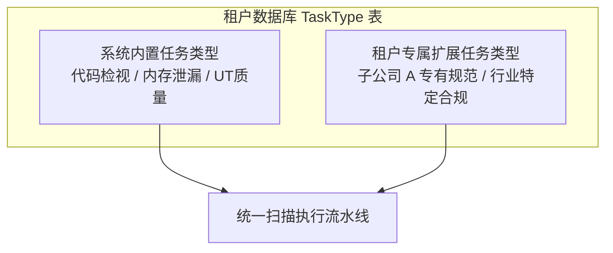
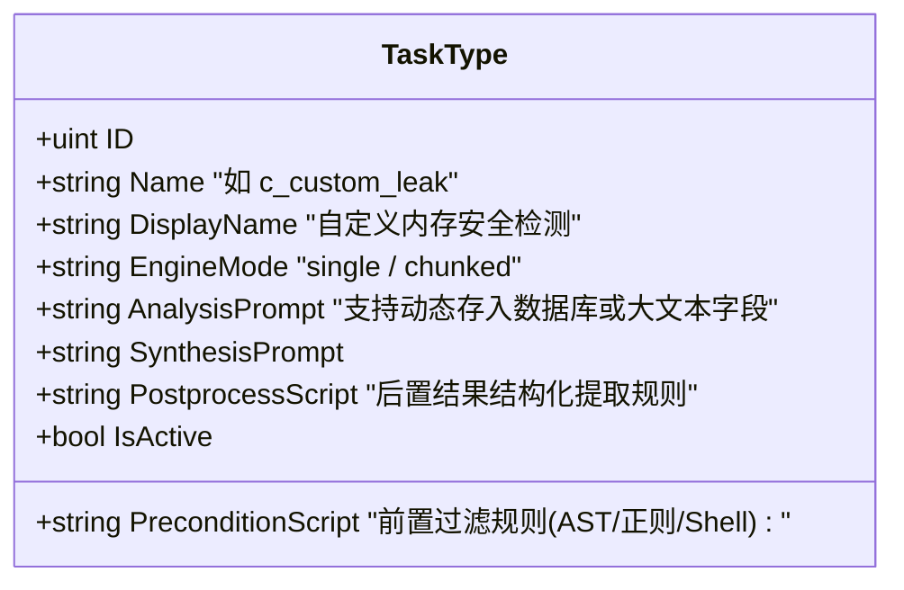

# 05-租户自定义任务类型与动态规则扩展设计

## 1. 业务场景与扩展诉求
不同子公司所研发的技术栈与质量规范存在显著差异：
* **子公司 A（通信/嵌入式）**：关注 C/C++ 内存泄漏、未初始化变量、多线程死锁风险。
* **子公司 B（云原生/微服务）**：关注 Go/Java 并发安全、SQL 注入、敏感数据脱敏与鉴权遗漏。
* **子公司 C（算法与模型）**：关注 Python 资源未释放、算子性能瓶颈与精度丢失。

因此，系统必须支持**各子公司灵活扩展、定义专属于自己的扫描任务类型（TaskType）**。

---

## 2. 系统内置任务与租户私有任务双轨模型

在分库模式下，`TaskType` 拥有极其自然的实现方式：

### (1) 任务类型属性增强
* 租户专属库中的 `TaskType` 表完全属于该租户，子公司管理员拥有完全的 **增、删、改、查、启停** 权限。
* 可以将集团推荐的标准内置任务类型在初始化时预置入租户库中，子公司可选择启用，也可自由新增自定义任务类型。

---

## 3. Prompt 与前后置规则的动态化与安全执行

现有系统将 `analysis_prompt.md`、`synthesis_prompt.md`、`precondition`（前置检查）和 `postprocess`（后置解析）硬编码在服务端文件系统 `tasks/<task-name>/` 目录下。

在多租户模式下，全面升级为**动态存储 + 沙箱解析**：

### (1) 提示词动态加载
`taskContext` 在准备分析提示词时，优先读取该租户数据库中 `TaskType` 表保存的 `AnalysisPrompt` 动态模板，未设置时回退至系统默认内置模板。

### (2) 自定义后置提取脚本的安全隔离
为防止租户管理员编写的自定义提取脚本包含恶意命令（如 `rm -rf /` 或越权读取其他租户目录）：
1. **优先推荐基于声明式规则**：系统提供标准 JSON/Regex 结构化提取器，无需编写脚本。
2. **脚本沙箱执行**：若必须运行自定义脚本，采用沙箱隔离模式（限制子进程 `chroot`、限制 CPU/内存、禁止网络访问 `CLONE_NEWNET`），确保安全边界牢不可破。
