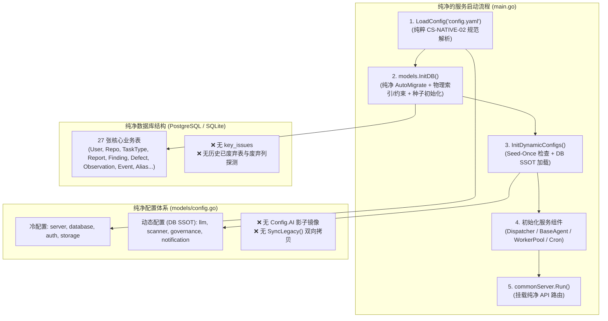

# RFC-004: 系统 Release 前夕过程性代码与历史兼容逻辑清理设计

## 📋 方案元数据与导读

* **文档编号**：`RFC-004` / `CS-RELEASE-PURIFY-01`
* **文档类型**：系统架构重构、代码库纯净化（Purification）与历史技术债务清理设计
* **当前状态**：`Accepted / Ready for Implementation`（方案已通过设计分析，准备分阶段实施）
* **涉及模块**：
  * `models/`（`db.go`、`models.go`、`config.go`）
  * `main.go`（服务启动生命周期与路由注册）
  * `cmd/`（`backfill_defect_texts`、`backfill_no_scope`）
  * `services/migration/`（全量引擎收敛迁移器及单测）
  * `handlers/`（`issue.go`、`config.go`、`task_type.go`）
  * `services/`（`dispatcher`、`invoker`、`engines/debate/resume.go`）
* **前置条件与核心前提**：
  * **全新发布环境 (Clean Slate Deployment)**：系统正式 Release 时，全部 PostgreSQL/SQLite 数据库与存储卷均为空白全新部署，不存在任何现网历史旧数据。
  * **规则规范已就绪**：`tasks/` 下全部 10 个内置任务类型的 `meta.json` 已全部升级至以 `scan_profile` 与 `debate_full` 为基础的最新规范。
  * **配置规范已就绪**：配置文件规范已正式切换至 `CS-NATIVE-02` 动静分离标准（顶层为 `server`, `storage`, `database`, `auth`, `llm`, `scanner`, `governance`, `notification`）。

---

## 一、 背景与问题陈述 (Context & Problem Statement)

### 1.1 演进过程中的技术债务累积
Code-Shield 系统历经数月持续攻坚开发，经历了多轮重大架构重构：
1. **缺陷对账体系重构**：从最初简易的 `KeyIssue` 演进为三级指纹，最终收敛为“物理前置定桩 + 两级离散槽位匹配 + 稀疏账本存储”的 `Defect` 全账本体系（09 号设计）；
2. **配置与算力架构演进**：从早期平铺且臃肿的 `ai:` 块与单模型 CLI，演进为 `CS-NATIVE-02` 动静分层、数据库动态 SSOT 配置中心及原生多端点算力池（RFC-002）；
3. **扫描引擎模式收敛**：从早期的多执行模式（`chunked`, `single_shot` 等）收敛为统一的三方对抗辩论流（`debate_full`）；
4. **Agent 形态精简**：从早期按任务类型动态生成多个磁盘 Agent 文件，收敛为单一全局基座 Agent（`shield-base-scanner`）。

### 1.2 现状痛点归因分析
为了在开发过程中维持开发人员本地环境与老测试数据的“平滑可运行”，代码库中引入了大量的“过程性代码”与“向下兼容垫片”：

```
                      现存启动流程与历史包袱链路
                                   │
      ┌────────────────────────────┼────────────────────────────┐
      ▼                            ▼                            ▼
【启动强行 DDL 探测】        【引擎收敛强行覆写】          【双轨配置镜像同步】
models/db.go                 migration.RunEngineConvergence  models/config.go
- 循环 DROP 12 张废弃旧表     - 遍历任务 meta.json 强行写盘  - SyncLegacy() 130 行双向拷贝
- Migrator 探测并删 10 列    - 遍历 DB 报告回填旧快照       - ComputeResourceConfig 4个私有字段
- 启动强刷 category_status   - 回填旧 findings 状态         - 8 个已废弃结构体别名兼容
```

1. **启动性能损耗与权限风险**：
   * 每次启动循环执行 12 次 `DROP TABLE IF EXISTS` 和 10 次 `DropColumn`；
   * 每次启动强行读取 `tasks/*/meta.json` 转换后使用 `os.WriteFile` 覆写磁盘，在生产容器或只读根文件系统（Read-only RootFS）下将直接引发启动致命异常；
2. **数据库存在无效死表**：
   * `AutoMigrate` 仍在迁移早已被业务层废弃的 `KeyIssue` 模型，生成无用的 `key_issues` 表；
3. **双轨配置造成高认知负荷**：
   * 外部 YAML 与前端配置中心已采用 `CS-NATIVE-02`，但底层服务因未彻底解耦，仍依赖 `SyncLegacy()` 镜像将数据来回倒腾给旧 `AppConfig.AI`；
4. **离线补丁脚本混杂在生产工程中**：
   * `cmd/backfill_*` 属于已完成历史使命的开发期工具，混在主工程中影响可维护性与发布包纯净度。

---

## 二、 清理范围与资产审计矩阵 (Scope & Audit Matrix)

下表列出本次 Release 纯净化设计的 7 大清理维度、具体文件及消除理由：

| 编号 | 清理维度 | 涉及文件/路径 | 当前代码现状 | 消除理由 (Release 前提) | 处置动作 |
| :--- | :--- | :--- | :--- | :--- | :--- |
| **DIM-1** | 离线补丁脚本 | `cmd/backfill_defect_texts/`<br>`cmd/backfill_no_scope/` | 离线遍历数据库补齐空标题与旧报告覆盖率 | 全新库中无旧缺陷与旧报告，新任务在线计算并持久化 | **全目录物理删除** |
| **DIM-2** | 启动期 DDL/DML 擦除补丁 | `models/db.go` (L68-L111) | 循环 DROP 12 张旧表，检查并 DROP 10 个废弃列，更新旧分类状态 | 全新库初次 AutoMigrate 由当前模型生成，旧表和旧列从未存在，数据为空 | **删除 DDL/DML 补丁代码** |
| **DIM-3** | 引擎收敛迁移器及启动调用 | `main.go` (L54-L56)<br>`services/migration/` (全包) | 启动时强行改写磁盘 `meta.json`，补齐历史报告快照，标记旧报告只读 | 磁盘 10 个任务本就是新规范；全新库无历史报告；消除生产环境写盘隐患 | **移除启动入口，删除/归档 migration 包** |
| **DIM-4** | 废弃实体与孤儿接口 | `models/models.go` (`KeyIssue`)<br>`models/db.go` (AutoMigrate)<br>`handlers/issue.go`<br>`main.go` (`/issues` 路由)<br>`handlers/task_type.go` | `KeyIssue` 结构体、GORM 映射及增删改查路由 | 前端路由已重定向，全系统已采用 `Defect` 槽位账本体系，从不调用该接口 | **彻底删除实体、路由及控制器** |
| **DIM-5** | 配置双轨镜像与兼容结构体 | `models/config.go` (`SyncLegacy`, `Config.AI`, 别名)<br>`services/dispatcher/`<br>`services/invoker/` | 130 行 `SyncLegacy` 双向复制，私有 `legacy*` 反序列化 Hack，8 个别名结构体 | YAML 与 Web 配置中心已全面采用 CS-NATIVE-02，统一收敛到底层 `LLM` 与 `Scanner` | **调用点归一化，删除 SyncLegacy 与影子字段** |
| **DIM-6** | 续扫 Checkpoint 旧版本容错 | `models/config.go` (`LegacyV2Policy`)<br>`services/engines/debate/resume.go` | 兼容旧开发期的 V2/V3 bundle checkpoint | 当前标准 schema version 为 5，全新任务不产生旧版本 checkpoint | **删除 LegacyV2Policy，严格校验版本** |
| **DIM-7** | 宿主机遗留 Agent 文件清理 | `main.go` (L77)<br>`services/invoker/agent_sync.go` | 遍历删除 `~/.config/opencode/agents/` 下按任务命名的旧 md 文件 | 新架构使用单基座 Agent；全新生产服务器/容器环境无历史文件污染 | **移除启动调用与清理函数** |

---

## 三、 目标纯净架构设计 (Target Pure Architecture)

清理完成后，系统将达到**零过渡逻辑、单真值源、纯净启动**的终态：



### 3.1 数据库初始化纯净化设计 (`models/db.go`)
消除所有非确定性的历史数据清洗与 DDL 试探：
1. **纯净模型注册**：`AutoMigrate` 严格包含且仅包含 27 个活跃模型，从参数列表中移除 `&KeyIssue{}`；
2. **索引与物理约束加固**：
   * 保留并标准化局部唯一索引创建逻辑（将原 `MigrateDefectSlotSchema` 职责理顺为 `EnsureDefectSlotIndexes`）；
   * 保留外键保障 `ensureLedgerForeignKeys`、`EnsureActiveTaskReportUniqueIndex` 及 PostgreSQL 会话超时安全防护；
3. **种子数据保障**：保留纯净的 `seedDatabase()`（默认管理员）与 `seedBuiltinTaskTypes()`（加载磁盘 10 个标准任务）。

### 3.2 服务启动生命周期纯净化设计 (`main.go`)
从启动主流程中剥离所有过渡性阻断调用：
* 剔除 `migration.RunEngineConvergence(models.DB, "tasks")`，确保服务启动为只读感知磁盘，绝不回写任务 `meta.json`；
* 剔除 `services.CleanupLegacyTaskAgents()`，避免无意义的宿主机目录文件系统扫描；
* 移除 `/api/issues` 路由注册。

### 3.3 全局配置系统单真值源 (SSOT) 收敛设计 (`models/config.go`)
彻底消除 `CS-NATIVE-02` 与老 `AI` 块的双轨制：
1. **调用方收敛重定向**：
   * `models.AppConfig.AI.WorkHoursThrottle` ➔ `models.AppConfig.Scanner.Throttling.WorkHours`
   * `models.AppConfig.AI.Debate.LogRetentionDays` ➔ `models.AppConfig.Scanner.Debate.LogRetentionDays`
   * `models.AppConfig.AI.OutputFormat` ➔ `models.AppConfig.Scanner.OutputFormat`
   * `models.AppConfig.AI.DebugLogs` ➔ `models.AppConfig.LLM.DebugLogs`
   * `models.AppConfig.AI.Native` ➔ `models.AppConfig.LLM.FindResource("native")`
   * `models.AppConfig.AI.Backend` ➔ `models.AppConfig.LLM.DefaultResource`
2. **废除兼容代码**：
   * 删除 `Config.AI` 结构体；
   * 删除 `SyncLegacy()` 方法；
   * 删除 `ComputeResourceConfig` 中的私有 `legacyBaseURL/legacyAPIKey/legacyModel/legacyConcurrent` 及其 `UnmarshalYAML`/`UnmarshalJSON`/`MarshalJSON` 兜底；
   * 删除废弃的别名结构体（`ModelConfig`, `TierConfig` 等）。

---

## 四、 分阶段实施路线图 (Phased Implementation Roadmap)

为确保代码重构在 Release 前稳妥落地，实施路线图划分为 4 个受控阶段，每阶段均具备独立的验证准则：

```
Phase 1: 零风险启动与脚本清理 ──► Phase 2: 废弃实体与路由清理 ──► Phase 3: 配置体系彻底归一 ──► Phase 4: 发布打包交付
(删除脚本/移除迁移器/清理DDL)    (清理 KeyIssue 相关全部链路)   (消除 AppConfig.AI 镜像)      (全量单测 + 纯净交付)
```

### 4.1 第一阶段：零风险启动与脚本清理（立即实施）
* **目标**：消除启动阶段对文件系统的写操作、消除重复 DDL 执行、移除独立修补工具。
* **改动清单**：
  1. 删除目录 `cmd/backfill_defect_texts/` 与 `cmd/backfill_no_scope/`；
  2. 在 `models/db.go` 中删除：
     * `DROP TABLE IF EXISTS` 12 张旧表的循环代码；
     * `DB.Migrator().DropColumn` 历史列检查与删除逻辑；
     * `UPDATE analysis_findings SET category_status = 'LEGACY'`；
     * `UPDATE task_types ... SET governance_mode = 'full_ledger'`。
  3. 在 `main.go` 中删除 `migration.RunEngineConvergence` 与 `services.CleanupLegacyTaskAgents()` 调用；
  4. 归档或删除 `services/migration/` 目录。
* **验证准则**：
  * 执行 `go test ./...` 全绿；
  * 执行 `go build -o code-shield-server main.go` 编译成功；
  * 启动服务日志中无任何 `DROP TABLE`、`DROP COLUMN` 与 `[Migration] Converged task type` 输出。

### 4.2 第二阶段：废弃业务实体与孤儿接口清理
* **目标**：数据库模型与 API 路由彻底摆脱早期原型遗留，防止全新数据库生成无用表。
* **改动清单**：
  1. 删除 `handlers/issue.go` 控制器；
  2. 在 `main.go` 中删除：
     * `api.GET("/issues", handlers.GetIssues)`
     * `api.POST("/issues", handlers.CreateIssue)`
     * `api.PATCH("/issues/:id", handlers.UpdateIssue)`
  3. 在 `models/db.go` 的 `AutoMigrate` 列表中移除 `&KeyIssue{}`；
  4. 在 `models/models.go` 中删除 `type KeyIssue struct`；
  5. 在 `handlers/task_type.go` 中删除清理 `KeyIssue` 的代码。
* **验证准则**：
  * 全量单测通过；
  * 使用全新 SQLite/PostgreSQL 启动，数据库内仅生成 27 张业务表，无 `key_issues` 表。

### 4.3 第三阶段：配置体系收敛与真值源归一
* **目标**：代码彻底告别 `AppConfig.AI` 影子镜像，实现 `CS-NATIVE-02` 规范唯一真实源。
* **改动清单**：
  1. 梳理全工程对 `models.AppConfig.AI.` 的读取点，逐一重构至 `models.AppConfig.LLM.` 或 `models.AppConfig.Scanner.`；
  2. 在 `models/config.go` 中安全移除：
     * `SyncLegacy()` 方法；
     * `NormalizeNativeEndpoints()` 中针对 `AI.Native` 的 fallback；
     * `Config.AI` 字段；
     * `ComputeResourceConfig` 中的私有影子兼容字段与专用序列化 Hook；
     * `ResumeConfig.LegacyV2Policy` 配置项与 `bundleResumeLegacyVersion = 3` 容错；
     * 8 个废弃兼容结构体别名。
  3. 更新测试用例中对 `AppConfig.AI` 的引用。
* **验证准则**：
  * 全工程无任何 `models.AppConfig.AI` 引用；
  * `config.yaml` 启动后各功能（调度器、工作时间限流、大模型调用、辩论流水线）全部运行正常。

### 4.4 第四阶段：发布打包纯净化与工程准入
* **目标**：保证最终发布交付介质（Docker 镜像或发布归档包）不携带任何开发残留文件。
* **排查清理清单**：
  1. 确保构建产物 `.gitignore` 覆盖完整，排除 `code-shield-server`、`shield.db`、`*.log`、`tmp/`；
  2. 确认 Dockerfile / CI 打包流水线采用 Multi-stage build，仅复制构建出的单一二进制、`config.yaml.example`、`tasks/`、`docs/` 及前端静态资源。

---

## 五、 质量保证与安全防线 (Verification & Guardrails)

为确保纯净化重构不对现有业务逻辑造成非预期破坏，设定以下 4 重安全防线：

### 5.1 自动化测试防线
* **单元测试全覆盖**：每次改动后必须运行全包测试 `go test ./...`，保证覆盖率与稳定性；
* **测试用例纯净化同步**：修改或删除专为旧兼容逻辑编写的单测（如 `services/migration/*_test.go`），避免无效测试阻碍构建。

### 5.2 数据库 Schema 纯净对比验证
在本地启动全新 SQLite 数据库，并使用工具导出 Schema，与预期设计进行基准比对：
```sql
-- 验证不存在任何历史遗留表
SELECT table_name FROM information_schema.tables 
WHERE table_name IN (
    'key_issues', 'defect_fingerprint_records', 'scan_reconciliations', 
    'reconciliation_links', 'defect_entities', 'defect_occurrences'
);
-- 预期返回结果: 0 行
```

### 5.3 运行时核心业务冒烟基准
在干净环境部署并执行最小全链路冒烟测试：
1. **服务引导**：执行 `./code-shield-server`，检查日志无报错、成功装载 10 个内置任务并完成管理员账号初始化；
2. **扫描触发**：对测试代码仓触发一次全量扫描；
3. **辩论与产物**：验证三方对抗辩论正常运行，产出结构化 Findings 与 Synthesis 报告；
4. **缺陷台账**：验证缺陷被正确分派入 `defects`、`defect_observations`、`defect_events` 台账中；
5. **Web 控制台**：验证访问 `/admin/config` 可以正常查看和实时保存动态配置。

---

## 六、 结论与后续行动 (Conclusion)

通过本设计方案的实施，Code-Shield 系统将**卸下长达数月的历史包袱，彻底告别开发期的过程性补丁与兼容代码**。这不仅能减少约 1500+ 行无用代码，还能显著缩短服务启动耗时，消除生产环境只读文件系统崩溃风险，使代码库结构以极高水准的纯净度与专业度迎接正式 Release。

**建议立即依据本方案第四节的阶段划分推进落地实施。**
