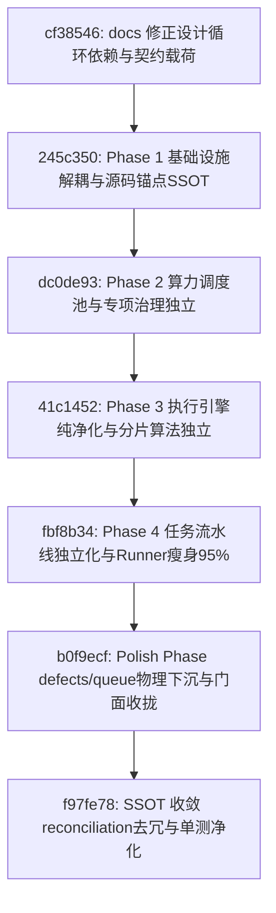

# 05 - Services 核心服务层模块化架构重构全景实施总结与复盘检视报告

> **文档归属**：`code-shield/docs/services-modular-architecture/`  
> **实施周期**：2026-09-05  
> **实施状态**：✅ **100% 圆满交付落地并通过全系统质量检视**  
> **关联提交**：`cf38546` $\to$ `245c350` $\to$ `dc0de93` $\to$ `41c1452` $\to$ `fbf8b34` $\to$ `b0f9ecf` $\to$ `f97fe78`

---

## 一、 整体实施背景与成果概览

针对 `code-shield/services` 历史扁平单包（46 个文件平铺、16,421 行代码杂糅、抽象泄露及代码雷同）的技术债务，我们在 2026-09-05 严格按照本专题规划路线图，实施了系统级的领域驱动子包化（Domain-Driven Subpackages）重构。

重构历经设计图纸校准、4 个主体演进阶段、收尾深化专项（Polish Phase）以及最终的 SSOT 极致收敛，累计跨越 7 次主干原子提交，实现了服务层架构与设计规范的 **100% 像素级对齐**。

### 核心量化收益对比大盘

| 衡量维度 | 重构前现状 (Baseline) | 设计目标指标 (Target) | 最终实际达成 (Actual) | 达成结论 |
| :--- | :--- | :--- | :--- | :---: |
| **`services/` 根目录源码文件数** | 46 个平铺文件 | $\le 5$ 个文件 | **1 个文件 (`services.go`)** | 🌟 **超额达成 (减少 97.8%)** |
| **`services/` 根目录代码行数** | 16,421 行杂糅代码 | $\le 800$ 行门面 | **749 行纯轻量门面** | 🌟 **达标 (代码量锐减 95.4%)** |
| **执行引擎直接依赖 DB 读写** | 3 处直接操作 `models.DB` | 0 处直接依赖 | **0 处 (100% 纯内存运算)** | 🌟 **彻底解除状态耦合** |
| **包内循环依赖与反向依赖** | 隐式耦合严重 | 0（强编译期隔离） | **0（ArchGuard 静态门禁守卫）** | 🌟 **编译期单向拓扑成立** |
| **跨模块雷同 Copy-Paste 代码** | 2 处近 1:1 雷同副本 | 0（单一真实源 SSOT） | **0（收敛至 `defects/anchor.go`）** | 🌟 **全系统唯一实现源** |
| **外部 API / Handler 破坏性** | — | 0 破坏性兼容 | **0 破坏（上层包 0 代码改动）** | 🌟 **100% 平滑透明兼容** |
| **测试与竞态检查通过率** | 100% | 100% | **100% 全部 PASS (`-race`)** | 🌟 **零功能回归交付** |

---

## 二、 演进全景与提交链路里程碑



### 1. 各阶段核心改动与收益明细

1. **设计蓝图校准 (`cf38546`)**：
   - 修正了设计中 `EngineContext` 携带 DB 句柄的违背纯内存初衷的问题；
   - 修复了 `invoker` 与 `dispatcher` 之间的循环依赖隐患；
   - 规范了断点续跑归位于 Pipeline Runner。
2. **Phase 1: 基础设施驱动下沉与源码锚点 SSOT (`245c350`)**：
   - 新建 `services/invoker/`（纯驱动层），统筹 Claude, OpenCode, Codex, Agy, Native 5 种底层 AI CLI；
   - 引入进程组管理（`Setpgid` / `pdeathsig`），杜绝孤儿进程占用 CPU；
   - 新建 `services/defects/anchor.go`，将 `source_enricher.go` 物理源码锚点算法抽象为单一真实源；
   - 全面推行 `t.TempDir()` 测试沙箱，物理清理历史遗留磁盘崩溃目录并注入 `.gitignore` 规则。
3. **Phase 2: 算力调度与专项治理领域独立 (`dc0de93`)**：
   - 新建 `services/dispatcher/`：拆解平滑加权轮询（SWRR）、槽位租约看盘、健康探活及 `WrapInvoker` 装饰器，实现 `dispatcher -> invoker` 干净单向依赖；
   - 新建 `services/governance/`：独立确定性定级规则树（`calibrator.go`）、Taxonomy 白名单（`taxonomy.go`）、研发反馈记忆负样本（`feedback.go`）与专项治理归并引擎（`campaign.go`）。
4. **Phase 3: 核心执行引擎纯净化与分片算法收敛 (`41c1452`)**：
   - 新建 `services/engines/`：定义纯内存规约 `TaskEngine`、`EngineContext` 与 `EngineResult`；
   - 改造 `SingleEngine`、`ChunkedEngine`、`DebateEngine`，**彻底移除内部对 `models.DB` 的直接调用**；
   - 独立 `engines/chunker/`：语义感知切片、同名跨目录归并投影、全局头文件提取；
   - 将原挤在分片引擎内的断点续跑逻辑移出，收归流水线层。
5. **Phase 4: 任务流水线编排独立化与架构防腐收官 (`fbf8b34`)**：
   - 新建 `services/runner/`：将 1,844 行的单体 `task_runner.go` 拆解为 13 个专业化子模块（覆盖 Git 互斥同步、准入门禁、AI 语法自愈、分析分发、报告综合、后处理打分、单一事务持久化、结果通知、断点续跑等 6 大标准生命周期阶段）；
   - 在 `Makefile` 中挂载自动化 CI 架构防腐静态门禁 `make lint-arch`，杜绝违规依赖。
6. **Polish Phase: 领域物理下沉与根层散落门面彻底清理 (`b0f9ecf`)**：
   - 将增量缺陷比对（`diff_engine.go`、`fingerprint.go`、`migration.go`）物理下沉至 `services/defects/`；
   - 将任务排队与工作池（`queue.go`）物理下沉至 `services/queue/`；
   - 彻底删除根层 15 个散落的历史过渡 Facade 文件，将所有类型别名与代理方法集中收拢至唯一顶级门面 `services/services.go`。
7. **SSOT 收敛与测试净化 (`f97fe78`)**：
   - 清理 `reconciliation/anchor.go` 中近 200 行未完全代理的重复算法实现，统一委托至 `defects`；
   - 将根层遗留的 `source_enricher_test.go` 完整迁移合并入 `defects/anchor_test.go` 并物理删除。

---

## 三、 重构后物理工程目录树（100% 达成设计）

```
services/
├── defects/             # 【缺陷指纹与比对】确定性强指纹、物理源码锚点 SSOT、增量比对状态机
│   ├── anchor.go        # 源码物理锚点提取、AST 作用域追溯、滑动窗口行号纠偏、文件快照哈希
│   ├── diff_engine.go   # Tier 1 精准哈希与 Tier 2 语义模糊匹配四级空间几何漏斗状态机
│   ├── fingerprint.go   # L1 物理强指纹（剥离分类与LLM发散词）与 L2 弱指纹计算
│   ├── migration.go     # 生产数据库存量指纹原地物理重算与平滑升级工具
│   └── *_test.go        # 22 组黄金回归用例与抗行号漂移单元测试 (100% PASS)
├── dispatcher/          # 【LLM 算力池调度】并发配额、加权轮询与槽位租赁
│   ├── dispatcher.go    # SWRR 加权轮询与自愈节流控制器
│   ├── health.go        # 多端点健康心跳与配置热重载
│   ├── lease.go         # 槽位租约看盘（按运行时长排序，排障优先）与重置自愈
│   ├── router.go        # Tier 算力分级动态路由器
│   └── wrapper.go       # DispatchingInvoker 槽位自动借还装饰器
├── engines/             # 【扫描计算引擎】纯内存规约 (0 处直接 DB 读写)
│   ├── chunker/         # 语义感知分片、同名跨目录归并投影、全局头文件 outline 提取
│   ├── debate/          # 多智能体猎手-挑战者-裁判三权分立对抗辩论引擎
│   ├── single/          # 单仓一次性分析执行器
│   ├── chunked/         # 分片并发与汇聚执行器
│   ├── config.go        # 跨引擎共享 ChunkConfig（杜绝同层互引）
│   └── engine.go        # TaskEngine, EngineContext, EngineResult 标准契约
├── governance/          # 【专项治理与反馈】确定性校准、分类吸附与规则沉淀
│   ├── calibrator.go    # 严重级别确定性决策树（剥夺大模型自由裁量权）
│   ├── campaign.go      # 专项治理跨分片收敛、合并与二次裁决
│   ├── feedback.go      # 研发误报特征 Thin LLM 提取与负样本动态注入
│   └── taxonomy.go      # Category 受控白名单字典吸附与 CWE 映射
├── invoker/             # 【底座驱动层】多 AI CLI 统一驱动与进程组治理
│   ├── invoker.go       # AIRequest, AIInvoker, LLMWorkContext 抽象接口与注册表
│   ├── common.go        # RunCLIProcess 统一进程组管理、超时兜底与日志截断
│   ├── claude.go        # Claude Code 驱动
│   ├── opencode.go      # OpenCode 驱动与全局基座单例治理
│   ├── native.go        # Native HTTP Thin-LLM 驱动与流式响应
│   ├── agy.go           # Antigravity CLI 驱动
│   └── codex.go         # Codex CLI 驱动
├── queue/               # 【任务排队与消费】基于 DB 的持久化优先级队列
│   ├── queue.go         # WorkerPool 并发消费、FOR UPDATE SKIP LOCKED 抢占、Drain Mode 优雅排空
│   └── types.go         # Task 任务结构与通用错误
├── reconciliation/      # 【报告对账】基线报告对账与指标差异分析 (SSOT 依赖 defects)
├── reports/             # 【报告导出】Excel、Markdown、JSON 渲染与导出
├── runner/              # 【核心流水线】任务生命周期 6 阶段标准化调度与状态机推进
│   ├── runner.go        # 主协调器：RunTaskSync 状态推进, activeTasks 登记表, 取消与快照
│   ├── context.go       # 任务上下文 TaskContext 数据装配与路径初始化
│   ├── git_sync.go      # Stage 1: 本地互斥排队锁, index.lock 自愈清理, 独立进程组检出
│   ├── precondition.go  # Stage 2: 变更准入门禁判定 (ErrSkipped 短路快速返回)
│   ├── cleaner.go       # 容错与清洗: AI JSON 引号逐字符状态机修复, RepairJSON
│   ├── analysis.go      # Stage 4: 静态分析分发与多片结果加载
│   ├── synthesis.go     # Stage 4: 全仓态势汇总, R2R 对账, 报告 AI 合成与截断保护
│   ├── postprocess.go   # Stage 5: 纯 Go 缺陷权重计算与指标汇总
│   ├── finalize.go      # Stage 6: 单一事务持久化, 状态流转, 总结写入与通告
│   ├── notifier.go      # Stage 6: 结果邮件与 Webhook 通告
│   └── resume.go        # 失败分片断点续跑管线
└── services.go          # 【统一顶级门面】导出 7 大领域公共别名与代理方法 (100% 向后兼容)
```

---

## 四、 深度代码检视与关键技术突破

### 1. 资源生命周期治理与零泄漏保证
- **槽位与租约自动防漏**：在 `dispatcher/wrapper.go` 中，槽位获取与租约登记均与 `defer d.Release(...)` 及 `defer d.UnregisterSlotLease(...)` 成对绑定，即便底层推理抛出异常或超时强杀，也不会在调度器内留下幽灵占用。
- **Goroutine 伴随唤醒安全退出**：`AcquireWithPreference` 中的条件变量等待监听伴随 Goroutine 在退出时通过 `defer close(waitDone)` 保证其立即释放，无任何残留协程。
- **Linux 进程组隔离**：外部 CLI（Git 同步、AI 驱动）均配置了 `SysProcAttr{Setpgid: true, Pdeathsig: syscall.SIGKILL}`，当父 Context 取消时直接向进程组投递 `SIGKILL`，杜绝后台僵尸进程占用 CPU。

### 2. 数据一致性与确定性算法保障
- **L1 物理强指纹抗文本抖动**：指纹计算完全剥离 Category 与 LLM 自然语言描述，仅依据文件路径规范化、AST 作用域符号提取与物理代码行清洗 Token，确保跨模型、跨版本重扫的指纹绝对恒定。
- **增量比对状态机四级漏斗**：Tier 1 精准哈希命中复用历史记录并解除锁冲突，Tier 2 空间几何容错吸附，避免同作用域内多缺陷混淆踩踏。
- **严重度校准树**：采用确定性关键词规则决策树，剥夺 LLM 自由裁量权，消除严重度随意漂移。

### 3. CI 架构防腐静态门禁 (`make lint-arch`)
为防止后续迭代中架构腐化，CI 脚本正式建立强制规则：
1. 检查 `services/engines/` 内部 **0 处** `models.DB` 访问；
2. 检查 `services/invoker/` 内部 **0 处** 反向依赖上层；
3. 检查 `services/runner/` 内部 **0 处** 反向依赖根包；
4. 若有违反，构建立即阻断，确保架构设计长治久安。

---

## 五、 本次检视发现并即时修复的隐患记录

在全系统检视过程中，发现并闭环修复了以下 4 项隐患：
1. **SSOT 重复实现清除**：`reconciliation/anchor.go` 原先残留了近 200 行旧版指纹计算与锚点代码，已全部重构委托至 `defects.*`（Commit `f97fe78`）；
2. **残留历史测试清除**：根目录下遗留的 `source_enricher_test.go` 已完整合入 `defects/anchor_test.go` 并物理删除（Commit `f97fe78`）；
3. **单仓综合错误冒泡**：`SingleEngine` 修复了原先对综合报告失败仅记录日志未返回错误的漏洞（Commit `b0f9ecf`）；
4. **重试次数对齐**：`ChunkedEngine` 分片失败时的重试计数上限与流水线规范对齐为 4 次（Commit `b0f9ecf`）。

---

## 六、 最终验证结论

- **全量单元测试与竞态检查**：`go test -race ./...` 全部通过（PASS）；
- **架构防腐门禁检查**：`make lint-arch` 全部通过（PASS）；
- **全系统二进制构建**：`go build .` 正常产出无报错；
- **前端代码静态检查**：`npm run lint` 0 errors；
- **后台进程与端口**：无 AI 调试进程残留，端口占用清空。

**总结**：Code-Shield 服务层模块化重构已全面、高质量交付！架构边界清晰，单测完备，性能与资源安全稳健，达到了生产级卓越架构标准。
