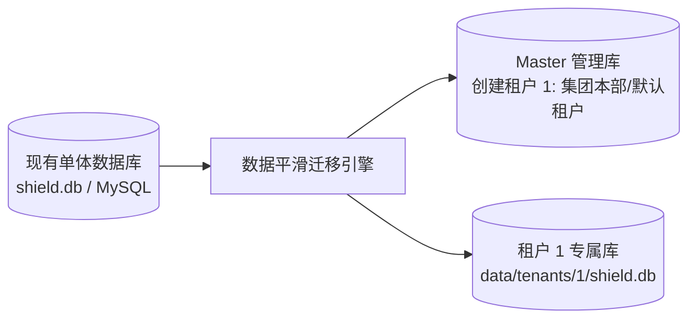
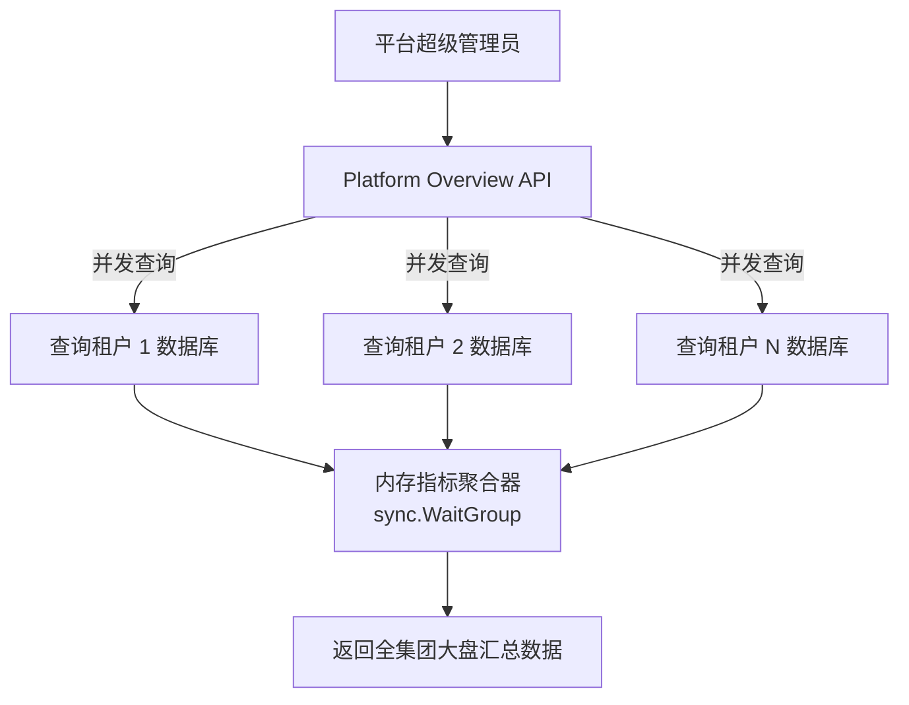
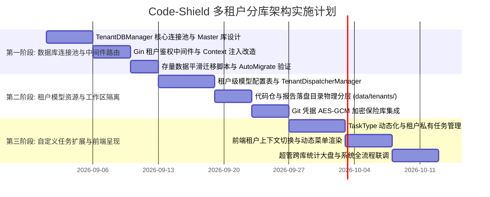

# 06-多租户系统迁移运维与实施路线图

## 1. 存量数据平滑迁移与初始化策略

在现有单体系统向多租户分库系统演进时，首要目标是**保证现有线上生产数据 100% 零中断平滑过渡**。

### 迁移三步法：
1. **步骤一：初始化 Master 主库**
   * 创建 `tenants` 基础表，将当前运行的组织自动注册为默认租户：`TenantID = 1, Name = "默认租户/集团本部"`。
2. **步骤二：存量数据库物理转移为 Tenant 1 数据库**
   * 直接将现有的 `shield.db` 移动或建立软链接到 `data/tenants/1/shield.db`。无需逐行拆解与导出数据，迁移耗时不到 1 秒。
3. **步骤三：系统启动自动接管**
   * `TenantDBManager` 启动时默认加载 Tenant 1 数据库，现有用户、部门、仓库、扫描报告与日志完全无损保留。

---

## 2. 数据库迁移自动化 (AutoMigrate 策略)

当平台发版升级并新增数据表或字段时（如新增辩论流字段、新增治理指标）：
* **新增租户时**：在 `GetDB(newTenantID)` 首次创建数据库时，自动执行 `AutoMigrateTenantSchema` 并写入基础种子数据。
* **版本发布重启时**：系统启动服务时，遍历 Master 库中所有 `is_active = true` 的租户，并发/批量对其专属数据库执行 `AutoMigrate`，确保所有子公司的表结构永远与代码版本保持最新。

---

## 3. 平台超级管理员跨库汇总大盘 (Platform Dashboard)

如果集团超级管理员需要俯瞰“全集团所有子公司的代码安全态势”：

* **轻量实时查询**：通过 Go 协程并发扇出（Fan-out）查询各租户库的聚合指标（如 `SELECT COUNT(*) FROM task_reports`），在内存中汇总后输出。
* **历史趋势报表**：由后台定时 CronJob 每日凌晨从各租户库提取概要指标，沉淀在 Master 库的 `PlatformMetricsSnapshot` 统计表中，供大盘秒级加载。

---

## 4. 落地实施路线图 (甘特图)

