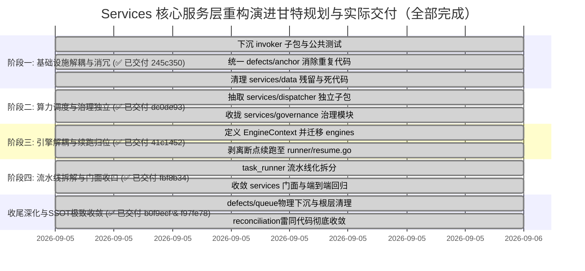

# 分阶段平滑演进路线图与安全落地实施方案

> **实施进展跟踪**：✅ **全部阶段与收尾专项已于 2026-09-05 100% 落地交付**  
> **实施复盘总结**：详见 [05 - Services 核心服务层模块化架构重构全景实施总结与复盘检视报告](01-服务层模块化架构重构全景实施总结与复盘检视报告.md)

## 1. 演进原则与安全防线

系统重构最忌“大爆炸式重写（Big-Bang Rewrite）”。为了保证现网业务在重构全过程中**不中断、无回归、可追踪、可回滚**，本实施方案严格遵守以下安全红线：

1. **渐进式迁移 (Phased & Incremental)**：分 4 个独立阶段推进，每个阶段只触碰一个独立功能域，避免跨领域交错修改。
2. **每步构建与测试双绿灯 (Zero Regression Gate)**：每个阶段执行完成后，必须在本地运行全量后端编译（`make backend`）与完整单元测试套件（`go test ./...`），测试未 100% 通过严禁进入下一阶段。
3. **门面过渡保障 (Facade Smooth Transition)**：顶层 `services/` 通过 Facade 保持外部 API 兼容，不需要外部系统协同发版。
4. **Git 细粒度提交 (Conventional Commits)**：严格按照团队规范，每个独立子包迁移使用一个标准 commit（如 `refactor: 下沉 AI CLI 适配器至 services/invoker 子包`），便于精准追溯与原子回滚。

---

## 2. 四大演进阶段详细规划与实际交付记录



---

### 阶段一：基础设施解耦、消冗与环境净化 【✅ 已交付：`245c350`】

*   **交付 Commit**: `245c3502c35400481ca5390ea4fb270beb4424ca`
*   **目标**：下沉独立性最高的底层 CLI 适配器（解耦 Dispatcher 装饰器以防循环依赖），消除源码物理锚点的重复代码，重构单测沙箱并净化测试残留。
*   **实施结果清单**：
    1.  **新建 `services/invoker/`（纯驱动层，零外部依赖）**：
        - 迁移纯驱动接口与上下文：`AIInvoker`、`AIRequest`、`LLMWorkContext` 至 `invoker/invoker.go`；
        - `invoker` 成为纯净的底层，对 `dispatcher` 和 `services` 根包零依赖；
        - 迁移 `cli_common.go` $\to$ `invoker/common.go`；
        - 迁移 `native_cli.go` $\to$ `invoker/native.go`；
        - 迁移 `opencode_cli.go` $\to$ `invoker/opencode.go`；
        - 迁移 `claude_cli.go` $\to$ `invoker/claude.go`；
        - 迁移 `codex_cli.go` $\to$ `invoker/codex.go`；
        - 迁移 `agy_cli.go` $\to$ `invoker/agy.go`；
        - 迁移 `agent_sync.go` $\to$ `invoker/agent_sync.go`；
        - 平移对应的 6 个 CLI 测试文件入 `invoker/` 并确保独立通过。
    2.  **统一物理源码锚点 (消除雷同代码与算法漂移)**：
        - 新建 `services/defects/anchor.go`，将 `source_enricher.go` 与 `reconciliation/anchor.go` 中雷同且已产生漂移的 `SourceAnchor`、`CleanSourceToken`、`NormalizeScopeSymbol` 收敛至单一实现（SSOT）；
        - 改造 `services/reconciliation/`，使其直接引用 `code-shield/services/defects`。
    3.  **测试沙箱改造、环境净化与死代码清理**：
        - 改造 `task_runner_test.go` 与 `semantic_chunker_test.go`，全面强制采用标准库 `t.TempDir()` 作为测试报告沙箱，彻底根治硬编码相对路径污染；
        - 删除物理磁盘上遗留的 9 个 `services/data/reports/code_review_early_fail_*` 历史临时目录；
        - 在 `.gitignore` 中增加 `services/data/` 永久规避规则；
        - 归档并清理全工程零引用的死代码 `services/rules/domain_rules.go`。
*   **验证状态**：`go test ./services/invoker/...`、`go test ./services/...` 全部 PASS。

---

### 阶段二：算力调度与专项治理领域独立 【✅ 已交付：`dc0de93`】

*   **交付 Commit**: `dc0de93f14558a66b801c9cafa5f61574d1589e5`
*   **目标**：将 2,200 多行的 LLM 算力池负载均衡与 1,400 多行的治理归并模块独立为自治子包，闭环 Invoker 装饰器。
*   **实施结果清单**：
    1.  **新建 `services/dispatcher/`**：
        - 迁移 `dispatcher.go` 及对应 3 个测试文件到 `services/dispatcher/`；
        - 拆解为：
            - `dispatcher.go`（主调度与 SWRR 加权轮询算法）；
            - `lease.go`（并发槽位租约与算力看板快照）；
            - `health.go`（多端点探活与配置热重载）；
            - `wrapper.go`（收编 `DispatchingInvoker`，提供 `WrapInvoker(inv invoker.AIInvoker)` 装饰方法，形成清晰的 `dispatcher -> invoker` 单向依赖）。
    2.  **新建 `services/governance/`**：
        - 迁移 `hooks.go` $\to$ `governance/campaign.go`（专项分析归并核心逻辑）；
        - 迁移 `calibrator.go` $\to$ `governance/calibrator.go`（确定性定级规则树）；
        - 迁移 `taxonomy_normalizer.go` $\to$ `governance/taxonomy.go`（Category 标准化与 CWE 映射）；
        - 迁移 `feedback_memory.go` $\to$ `governance/feedback.go`（研发反馈负样本提取与沉淀）。
*   **验证状态**：`go test ./services/dispatcher/...`、`go test ./services/governance/...` 全部 PASS。

---

### 阶段三：扫描引擎规范化与断点续跑解耦 【✅ 已交付：`41c1452`】

*   **交付 Commit**: `41c1452bddc852c490d686912aa8a1967fd69f0a`
*   **目标**：引入 `EngineContext`（注入 NegativeRules）与 `EngineResult`（承载 Findings、DebateLogs、TokenUsage）彻底解耦 `taskContext`，提升 `ChunkConfig` 杜绝内部循环引用，并将断点续跑归位至 Runner。
*   **实施结果清单**：
    1.  **新建 `services/engines/`**：
        - 在 `engines/engine.go` 中定义 `TaskEngine`、`EngineContext` 与 `EngineResult` 契约；
        - 在 `engines/config.go` 中定义共享的 `ChunkConfig`（杜绝 `chunked` 与 `chunker` 间的同层互引）；
        - 迁移 `engine_single.go` $\to$ `engines/single/`；
        - 迁移 `engine_chunked.go`（纯扫描逻辑，剥离续跑与 DB 更新）$\to$ `engines/chunked/`；
        - 迁移 `engine_debate.go` 与 `debate_types.go` $\to$ `engines/debate/`（移除其内部直接读写 `models.DB` 操作，将生成的 `TaskDebateLog` 与 Token 消耗通过 `EngineResult` 纯内存返回）；
        - 迁移 `semantic_chunker.go` $\to$ `engines/chunker/`。
    2.  **断点续跑职责归位**：
        - 将原挤在 `engine_chunked.go:576~864` 的 `ResumeFailedChunks` 彻底剥离，移入 `services/resume.go`，由 Runner 作为任务流编排进行 Checkpoint 读取与局部补扫调度。
*   **验证状态**：`go test ./services/engines/...` 全部 PASS，引擎内 0 处直接 DB 读写。

---

### 阶段四：流水线拆解与顶层 Facade 门面收口 【✅ 已交付：`fbf8b34`】

*   **交付 Commit**: `fbf8b34bc016a03e02a2b93679c92161967925c6`
*   **目标**：将 3,700 多行的 `task_runner.go` 拆解为 6 大标准 Pipeline 流水线阶段，明确 `Queue -> Runner` 拓扑，并在 `services/` 顶层建立薄门面。
*   **实施结果清单**：
    1.  **新建 `services/runner/`（13 个子模块）**：
        - `runner.go`（主生命周期协调器，负责 Stage 1 到 Stage 6 编排）；
        - `context.go`（只读 `EngineContext` 组装器，Stage 3 预查 DB 注入 `NegativeRules`）；
        - `git_sync.go`（Git 拉取、锁清理、分支比对）；
        - `cleaner.go`（AI 输出 JSON 防御性提取、语法容错与引号修复）；
        - `notifier.go`（结果邮件与 Webhook 通告）；
        - `finalize.go`（Stage 6 统一开启单一事务，原子持久化 Findings、DebateLogs 与 Token 统计）；
        - `resume.go`（承接断点续跑流程，物理删除根层 `resume.go`）；
        - `errors.go`（标准错误定义，下沉 `ErrSkipped` 供 Queue 引用）。
    2.  **架构防腐门禁就绪**：
        - 在 `Makefile` 中建立 `make lint-arch` 静态检查，将引擎不写 DB、Invoker 零上层依赖、Runner 不反向依赖根包固化为机器自动化门禁。
*   **验证状态**：`make lint-arch`、`go test -race ./...`、`make build` 全部 PASS。

---

### 收尾深化专项与 SSOT 极致收敛 【✅ 已交付：`b0f9ecf` & `f97fe78`】

*   **交付 Commit**: `b0f9ecf`、`f97fe78`
*   **实施结果清单**：
    1.  **缺陷领域完整下沉 (`services/defects/`)**：
        - 物理下沉 `fingerprint.go`、`diff_engine.go`、`migration.go` 及 22 组黄金回归测试用例；
        - 修复 Tier 1 增量哈希匹配逻辑，确保同指纹二次入队正确打标 `DiffStatusExisted`。
    2.  **队列领域独立 (`services/queue/`)**：
        - 物理下沉 `queue.go` 与 `types.go`，WorkerPool 并发消费、FOR UPDATE SKIP LOCKED 抢占与优雅排空。
    3.  **根目录散落门面彻底清理**：
        - 物理删除 15 个散落的历史 Facade 文件，统一收拢为单一门面 `services/services.go`。
    4.  **SSOT 极致去冗**：
        - `services/reconciliation/anchor.go` 彻底删除雷同代码，全面委托至 `defects.*`；
        - 根目录残留的 `source_enricher_test.go` 彻底合并入 `defects/anchor_test.go` 并物理清理。

---

## 3. 回滚方案与应急处置预案 (Rollback Playbook)

由于采用了严格分阶段推进策略与细粒度 Conventional Commits，各阶段演进均具备清晰的历史锚点：

| 故障场景 | 影响阶段 | 处置策略与安全操作 |
| :--- | :--- | :--- |
| **编译期循环依赖 (`import cycle`)** | 阶段二 / 阶段三 | 1. 检查是否违反分层调用原则（如领域层反向依赖了管线层）；<br/>2. 依赖 `make lint-arch` 快速定位违规依赖源；<br/>3. 若需紧急回滚，使用 `git revert -m 1 <commit_hash>` 安全撤销改动。 |
| **断点续跑状态不一致** | 阶段三 / 阶段四 | 验证 `runner/resume.go` 加载的前序 Chunk JSON 字段兼容性，修复后重新打包交付。 |
| **外部 Handler 调用报错** | 阶段四 / Polish | 检查 `services/services.go` 的 Facade 门面是否遗漏包装某公共类型别名或函数，补齐包装函数后重新编译。 |

---

## 4. 架构防腐静态门禁 (Architecture Guard in CI)

CI 流水线中现已正式挂载 `make lint-arch` 架构防腐门禁，常态化拦截架构腐化：

```bash
make lint-arch
```
*   **检查项 1**：扫描 `services/engines/` 是否违规直接调用 `models.DB`；
*   **检查项 2**：扫描底层驱动 `services/invoker/` 是否违规反向依赖上层引擎或流水线；
*   **检查项 3**：扫描核心流水线 `services/runner/` 是否违规反向依赖根 `services` 包。
*   **验证状态**：✅ **通过 (All architectural boundaries are clean and valid)**。
