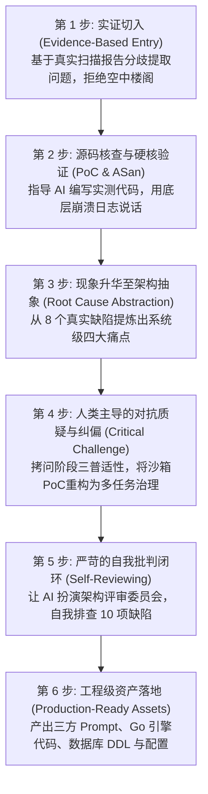
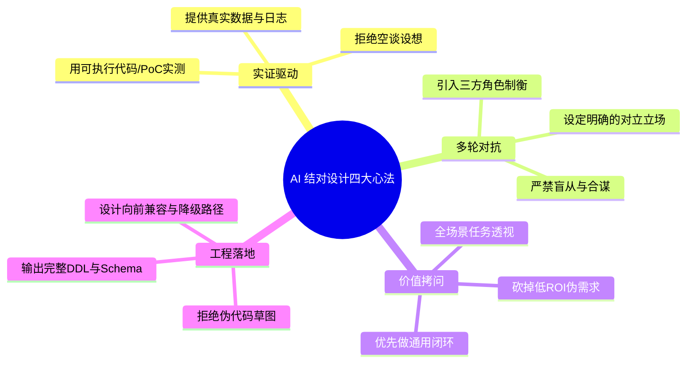

# 与 AI 结对架构设计实战指南
—— 从 fmt 扫描分歧到 Code-Shield 下一代智能体引擎演进全复盘

> **讲师/作者**：傅贵（szfugui@gmail.com） & Antigravity (AI Pair Architect)  
> **面向对象**：技术架构师、资深研发工程师、AI 辅助编程技术推进团队  
> **核心目的**：通过 Code-Shield 真实架构演进的实战全过程，分享**“如何与 AI 深度结对完成企业级系统架构设计与落地”**的方法论与核心心法。 

---

## 序言：为什么传统的“AI 问答”做不好架构设计？

很多工程师在使用 AI 辅助设计时，往往停留在“直接让 AI 输出一个系统架构方案”的初级阶段。这种方式生成的方案通常具有以下致命缺点：
1. **假大空、套话连篇**：充满“高内聚低耦合”、“高可用微服务”等空洞术语；
2. **脱离业务与代码事实**：无法感知具体代码细节、边界条件与工程依赖；
3. **缺乏批判性与反思**：AI 倾向于顺从用户的初步想法，容易造成过度设计或严重误判。

今天我们通过 **Code-Shield（代码安全检视系统）下一代 AI 分析引擎演进** 的真实全流程，展示一套经过实战检验的**“实证驱动、批判反思、逐层下钻、工程闭环”**的 AI 结对设计范式。

---

## 一、 人机协同设计全流程六步法 (The 6-Step Workflow)

---

## 二、 实战全过程详细拆解与推演

### 阶段 1：实证切入 —— 用具体数据而非空洞设想开局
*   **用户动作**：提供对同一份 `scylladb/fmt` 代码仓的两次真实扫描报告（`report-147` 与 `report-150`），要求 AI 对比差异。
*   **方法论要点**：
    *   **不要一上来就问“架构怎么做”**，必须从真实的业务痛点或异常数据（Finding 分歧）切入。
    *   AI 提取出两份报告分别报了 4 项和 5 项问题，汇总去重后得到 8 项独立缺陷，发现**两次扫描竟然存在互补遗漏**（A 报的 B 没报，B 报的 A 没报）。

---

### 阶段 2：源码级核验 —— 指导 AI 编写 PoC 并用底层工具实测
*   **用户动作**：要求 AI 深入目标代码仓源码（`codes/scylladb/fmt`），逐行核实这 8 个问题的真实性。
*   **方法论要点**：
    *   **拒绝纯文本推测，引入确定性工具链**：AI 编写了独立的 C++ 测试用例，调用本地 `g++-13` 开启 `-fsanitize=address,undefined`（ASan/UBSan）进行编译与运行。
    *   **实测收获**：捕获了真实的浮点栈越界写（`AddressSanitizer: stack-buffer-overflow`）与堆越界读，确认 8 个缺陷 **100% 全部为真实严重缺陷（0 误报）**，彻底摸清了模型的误报/漏报边界。

---

### 阶段 3：痛点升华 —— 从代码缺陷提炼系统架构问题
*   **用户动作**：“基于以上分析，请从架构层面对 Code-Shield 的 AI Engine 和调度器提出改进建议。”
*   **方法论要点**：
    *   由点及面，将代码层面的 8 个缺陷归因为系统架构层面的**四大系统级瓶颈**：
        1. **上下文割裂**：物理分片导致头文件与实现文件分离；
        2. **单模型视野盲区**：单次推理存在注意力局部衰减；
        3. **定级主观漂移**：大模型主观打分不可靠，堆越界读被标为一般，空指针被标为致命；
        4. **缺乏跨版本记忆**：多次扫描互为孤岛，重复提报历史存量问题。

---

### 阶段 4：人类深度介入 —— 批判性反思与伪需求剥离（关键转折点）
*   **用户动作**：“我对阶段三（沙箱 PoC 动态编译）抱有疑问，我们有 10 种不同类型的任务（不仅是 Coredump），这真的有必要吗？”
*   **方法论要点（人类架构师的核心价值）**：
    *   **识破局部最优与伪需求**：原先的方案针对 C/C++ 内存崩溃设计了沙箱编译，但用户敏锐指出系统中存在 `thread-create`（平台调度组规范）、`unordered-collection`（集合顺序）、`ut-effectiveness`（单测有效性）等任务。
    *   **重构方案定位**：
        *   ❌ **彻底废除**“全场景沙箱编译”这种在复杂依赖下成功率不足 10% 的重型基础设施；
        *   ✅ **升级重构**为面向全量 10 类任务的**“通用缺陷指纹抗漂移算法 (SSOT) + 跨扫描增量 Diff + 人机反馈知识沉淀”**。

---

### 阶段 5：自我批判审查 —— 让 AI 充当严苛的“评审委员会”
*   **用户动作**：“期望你最后再进行全面的反思，针对我们的设计和文档提出质疑，并给出改进思考。”
*   **方法论要点**：
    *   **让 AI 站在自己的对立面**：要求 AI 切换视角，作为极其挑剔的外部架构评审委员会，对前面生成的 7 篇文档进行地毯式自我审判。
    *   **自查出的 10 项核心问题（见下文）**：
        *   *文档矛盾*：早期文档中残留了已废弃的沙箱 PoC 描述；
        *   *公式分歧*：指纹公式在不同文档中字段不一致；
        *   *一刀切辩论*：单测有效性等确定性规则任务被错误地拉入 3 角色辩论浪费算力；
        *   *工程细节*：辩护人失败时缺乏法官降级提示、GORM 时间类型不匹配等。
    *   **闭环落实**：AI 立即对全部文档进行了针对性重构，将 10 项问题彻底清零。

---

### 阶段 6：工程级闭环 —— 交付成套规范文档与可落地资产
*   **交付产物**：
    *   完整的 7 篇深度架构设计文档与总索引；
    *   Hunter / Challenger / Judge **全套生产级对抗 System Prompt 与 Output JSON Schema**；
    *   Go 语言核心控制器代码（`engine_debate.go`、`diff_engine.go`）；
    *   PostgreSQL 数据库增量 DDL 与 `config.yaml` 向后兼容配置规范；
    *   自动归档至 `code-shield/docs/agentic-scanner-architecture/` 并推送到 GitHub。

---

## 三、 高效与 AI 结对设计的四大黄金法则 (Best Practices)

### 1. 黄金法则一：实证第一 (Evidence First)
*   **反面教材**：“请帮我设计一个代码安全扫描系统的 AI 引擎。”（AI 会返回通用的 Textbook 架构）。
*   **正确姿势**：“这是同一个项目两次扫描的 json 报告，这是源码。请用 ASan 跑一遍为什么会出现分歧，然后再告诉我架构该怎么改。”

### 2. 黄金法则二：多轮对抗与反向质询 (Adversarial Prompting)
*   在设计智能体系统时，**单一 Prompt 永远存在盲区**。必须通过“猎手（追求召回） vs 辩护人（寻找反证） vs 法官（中立仲裁）”的三方博弈协议，才能消除大模型固有的幻觉与自圆其说。

### 3. 黄金法则三：架构师必须主动做“减法”与“泛化性检验”
*   AI 很容易对特定问题提出“局部极致但全局灾难”的方案（如动态沙箱编译）。人类架构师必须站在全量业务（10 类任务、多语言、构建黑盒）的高度，及时制止过度设计，把重心拉回到通用增量追踪和人机记忆沉淀上。

### 4. 黄金法则四：要求 AI 给出“向下兼容”与“故障降级”方案
*   一个成熟的企业级架构设计不仅要看“正常流程怎么跑”，更要看：
    *   老系统没有配新配置时如何自动回退？
    *   Challenger 调用超时失败时 Judge 如何降级？
    *   数据库新增表和字段时如何做到零停机平滑迁移（Zero-Downtime Migration）？

---

## 四、 结对设计产出物全景索引

本次实战全过程沉淀的完整技术资产已归档在项目代码库中：

*   📁 **归档目录**：[`code-shield/docs/agentic-scanner-architecture/`](file:///home/fugui/codes/code-shield/docs/agentic-scanner-architecture/README.md)
*   📑 **文档体系**：
    1. `01-fmt扫描实证比对与缺陷复盘报告.md` —— 8 大缺陷实测核查
    2. `02-CodeShield-下一代AI引擎架构设计.md` —— 语义分片与任务自适应路由
    3. `03-CodeShield-异构模型流水线与DAG调度器设计.md` —— 异构调度与 SSOT 指纹
    4. `04-CodeShield-架构演进与落地实施路线图.md` —— 三阶段路线图与基准 KPI
    5. `05-CodeShield-智能体协作与异构调度深度设计.md` —— [阶段二] 提示词与 Go 引擎实现
    6. `06-CodeShield-多任务企业治理与历史记忆闭环深度设计.md` —— [阶段三] 全任务治理与记忆闭环
    7. `07-CodeShield-数据模型与系统配置变更设计.md` —— 数据库 DDL、GORM 映射与配置规范

---

## 结语：人机协同的新时代

与 AI 结对并不是让 AI 代替人类思考，而是**将人类架构师的业务洞察、系统审视力与批判性思维，与 AI 的海量知识检索、代码推演和极致输出效率深度结合**。通过“数据驱动 $\rightarrow$ 源码实测 $\rightarrow$ 架构抽象 $\rightarrow$ 对抗质疑 $\rightarrow$ 自我批判 $\rightarrow$ 工程落地”的闭环，能够在短短数小时内完成传统团队数周才能交付的工业级高质量架构设计方案。
