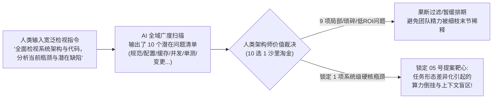
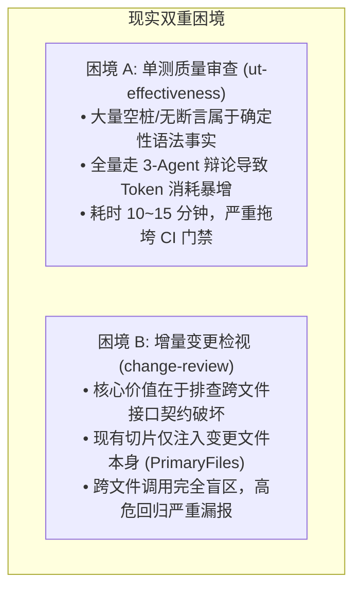
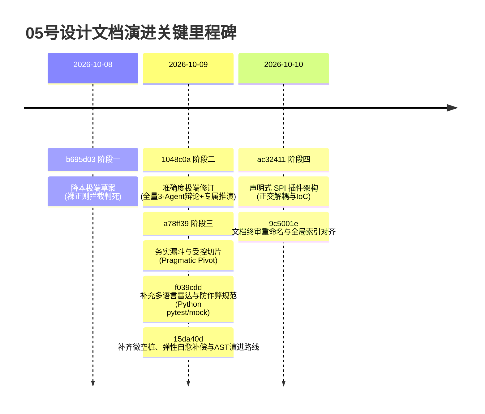
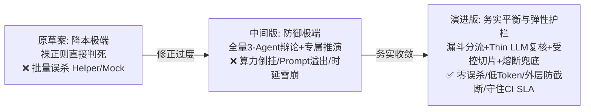
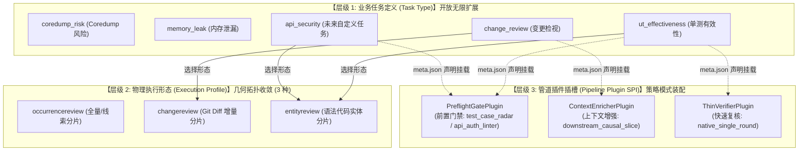
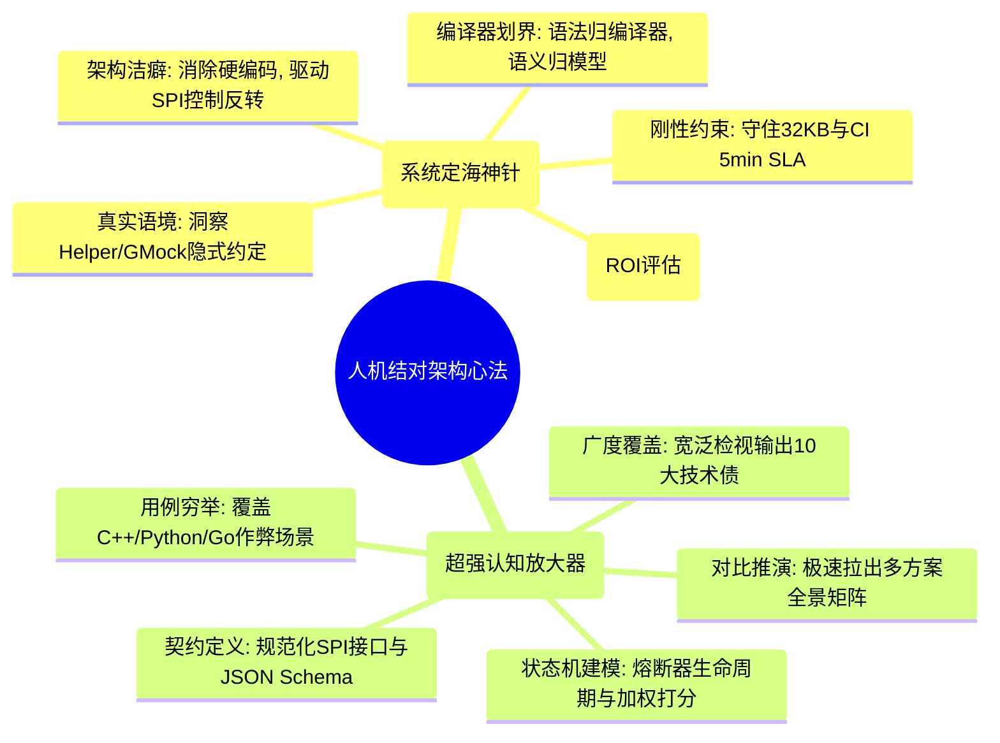

# AI 辅助架构设计实战：从极端钟摆到务实收敛
—— 05号差异化扫描引擎（声明式 SPI 插件、务实漏斗与受控因果切片）演进全景复盘

> **作者/复盘**：傅贵（szfugui@gmail.com） & Antigravity (AI Pair Architect)  
> **面向对象**：技术架构师、研发效能专家、AI 应用工程团队、系统设计评审委员会  
> **关联设计资产**：
> * 核心架构文档：[`05-任务形态差异化扫描引擎演进：声明式SPI插件架构、务实漏斗门禁与受控变更因果注入设计.md`](../02-architecture/02-scanner-engines/05-任务形态差异化扫描引擎演进：声明式SPI插件架构、务实漏斗门禁与受控变更因果注入设计.md)
> * 基线方法论：[`01-与AI结对架构设计实战指南-CodeShield案例复盘.md`](01-与AI结对架构设计实战指南-CodeShield案例复盘.md)
> * 统一缺陷台账：[`07-问题清单跨轮增量治理重构设计：统一缺陷台账SSOT与分层对账算法`](../02-architecture/04-fingerprint-governance/07-问题清单跨轮增量治理重构设计：统一缺陷台账SSOT与分层对账算法.md)

---

## 〇、引言：架构设计中的“AI 钟摆效应”

在软件工程中，系统演进往往面临复杂的“多目标约束优化”——准确度、算力成本、交付时延（SLA）、可维护性与架构开放度。当我们引入大语言模型（LLM）结对进行复杂系统架构设计时，往往会遭遇一种典型的**“AI 钟摆效应”**：
* 当要求 AI **降低成本**时，AI 倾向于给出极其激进的静态截流方案，忽略边缘语境与复杂场景，造成**毁灭性误杀（False Positive Catastrophe）**；
* 当人类指出误杀并强调**准确度优先**时，AI 又容易矫枉过正，走向“拒绝算力妥协”的另一个极端——全量拉起多智能体深度辩论、构建全量调用图谱、派生专属推演 Agent，导致**算力倒挂、Token 爆炸与 CI 队列雪崩**；
* 当系统逻辑逐渐丰富时，AI 又容易在底层核心层不断追加 `if task == "test_case"` 的业务补丁，不知不觉将通用引擎做成“大泥球”。

本文以 Code-Shield 团队在 **05 号差异化扫描引擎** 设计文档的真实演化过程（历经 7 次 Git 关键演进提交、文档从 352 行重构扩充至 1166 行工业级规范）为案例，不仅记录了方案如何从草案到定稿的技术细节，更完整复盘了这场架构演进的**真实起点**：**人类用一个非常宽泛的问题让 AI 全盘检视系统，AI 罗列了 10 个问题，人类架构师从中敏锐识别出真正有系统级价值的核心矛盾**，并作为系统定海神针，引导 AI 跨越后续的“极端钟摆”，最终收敛于务实帕累托最优与声明式 SPI 解耦。

---

## 一、提案缘起与现实矛盾全景：从 AI 的“宽泛审计”到人类的“价值筛选”

### 1.1 提案的源起：宽泛检视 $\to$ AI 抛出 10 大潜在问题 $\to$ 人类架构师沙里淘金

很多技术团队在尝试“AI 辅助架构设计”时，往往面临一个共同的困惑：**该如何开启一次真正有深度、有价值的系统级架构演进？** 05 号方案的诞生过程提供了一个极为经典的破局范本：



1. **人类的开局动作：给 AI 一个非常宽泛的命题**  
   架构师并没有预设具体方案，而是向 AI 抛出了一个全景式的大命题：*“请全面检视当前 Code-Shield 系统的核心架构设计、引擎执行链路与代码现实，分析当前系统存在的深层缺陷与潜在优化瓶颈。”*
2. **AI 的输出：广度覆盖，一口气罗列 10 个技术债点**  
   AI 凭借强大的长文本检索与代码广度泛读能力，从不同模块中挑出了 10 个潜在问题（涵盖了配置项冗余、日志粒度不均、局部缓存未命中、特定语言语法兼容、并发锁粒度、单测执行开销、变更跨文件可见性等）。
3. **人类架构师的核心价值：沙里淘金与价值裁决（Value Judgment）**  
   * **误区警示**：缺乏经验的团队面对 AI 吐出的 10 个问题，容易陷入两种极端——要么“眉毛胡子一把抓”，试图让 AI 逐一修补，导致工程精力被低 ROI 的琐碎改动彻底吞噬；要么因看到其中多数问题属于泛泛而谈，便武断认为“AI 不懂业务，只能提套话”。
   * **真实破局**：人类架构师凭借深厚的生产洞察，敏锐地穿透了这 10 个问题表象，识别出其中 9 个属于局部优化或边际收益极低的点；但唯独抓住了**“任务形态差异化扫描中的算力浪费与跨文件盲区”**这一项——这才是击中当前 CI 门禁耗时痛点、影响系统规模化落地的**系统级致命瓶颈**！
   * **结论**：**“AI 负责广度扫描（从 0 到 10），人类负责价值裁决（从 10 到 1）”**，这正是 AI 辅助架构设计的最佳发球姿势。

---

### 1.2 为什么这个问题是“真正有价值的”？（深层现实矛盾剖析）

在确定了核心攻坚方向后，架构师与 AI 进一步下钻，将这个“被淘出来的金子”提炼为系统基线中的两大不可调和的矛盾：



* **困境 A（轻量规则重度化，算力倒挂）**：系统在“全量深层缺陷（如死锁/内存泄漏）”时表现优异的 4 阶梯 3-Agent 对抗辩论，在“测试用例有效性”场景成了沉重负担。成百上千个空函数桩 `{}` 或 `ASSERT_TRUE(true)` 恒真单测全部被塞入百亿大模型，耗时十几分钟且 Token 暴涨。
* **困境 B（局部检视盲人摸象，上下文盲区）**：在近期变更检视中，大模型最有价值的是排查**跨文件破坏性接口变更**，但分片只包含被修改的文件自身，看不到下游仓内业务代码在哪里调用、如何传参，导致高危回归缺陷完全脱靶。

---

### 1.3 人机协同设定的多目标优化边界
锁定真问题后，架构师为 AI 划定了不可逾越的四大工业级刚性边界，防止后续设计再次发散：
1. **分析准确度**：误报率必须 $< 2\%$，杜绝形式化空桩与作弊单测逃逸；
2. **流水线 SLA**：CI/CD 增量门禁耗时必须严格控制在 **$3 \sim 5$ 分钟以内**；
3. **算力预算**：低危场景算力开销需下降 $70\%+$，单次变更 Prompt 体积严守 **32KB 物理硬上限**；
4. **架构解耦**：核心流水线必须对业务任务保持零硬编码，支持开放无限扩展。

---

## 二、提交历史溯源：人机协作的四大辩证演化阶段

通过对 05 号文档的 Git 提交历史进行端到端溯源，可以清晰地看到一次典型的“人机博弈与认知螺旋上升”过程：



---

### 阶段一（Commit `b695d03`）：初稿设想 —— 降本极端与裸正则判死陷阱

*   **人机交互输入**：“测试用例扫描耗时太长，请设计一个轻量 LinterGate 实现动静分流降本，变更检视补充下游调用点。”
*   **AI 产出的原草案特征**：
    *   提出 Deterministic Linter Gate：“凡是能在 AST/正则识别的事实，严禁下发给 LLM”，用静态规则直接拦截空测试和无断言，直接判定为 `DEFECT` 并生成结论；
    *   变更检视提取下游调用点前后 3 行碎片切片。
*   **人类架构师的敏锐质询（Critical Challenge）**：
    > *“如果仅凭单测函数体内没有 `ASSERT` 宏就静态判定为缺陷，那么工程中大量使用的测试辅助函数（Helper）、Google Mock 的析构自动校验、以及通用测试固件（Fixture），岂不是全部会被误杀？这是无法接受的误杀灾难！”*
*   **阶段复盘教训**：
    AI 在接到“降本”指令后，容易将问题理想化为教科书式的简单代码，忽略了工业级真实工程中复杂的代码封装与隐式调用，产生了极度武断的“前置判死”缺陷。

---

### 阶段二（Commit `1048c0a`）：钟摆过正 —— 准确度极端与过度工程化陷阱

*   **人机交互输入**：“单测不能误杀 Helper 和 Mock，变更检视 3 行切片断章取义。请彻底转向‘准确度优先’，杜绝误杀与漏报。”
*   **AI 产出的中间版特征**：
    *   口号激进化：在 TL;DR 中宣称*“准确度第一，拒绝算力妥协”*；
    *   门禁降级为“弱提示雷达”：静态工具只提取线索，全量单测无差别拉起 Hunter、Challenger、Judge 三方对抗辩论；
    *   变更检视重度化：注入下游调用点的**全量封闭函数体（Enclosing Function Scope）**，甚至针对下游模块派生**专属推演 Agent**。
*   **现实工程的严酷惩罚（Reality Check）**：
    *   **算力倒挂**：1,000 个单测产生 3,000 次 LLM 调用，扫描耗时飙升至 $25 \sim 40$ 分钟，CI 队列直接雪崩；
    *   **Prompt 击穿**：将下游动辄数百行的完整类和函数塞入 Prompt，直接击穿底层 `debate/assembler.go` 定义的 **32KB 物理上限**（`MaxPromptRuleBytes`），导致截断与报错；
    *   **历史缺陷误归因**：大模型看到下游完整代码后，开始自作聪明地挑剔下游历史遗留缺陷，误归因给当前 PR；
    *   **大模型充当虚拟编译器**：试图让大模型核验形参类型与个数是否匹配，而这些在强类型语言中编译器 1 秒钟即可免费排查。
*   **阶段复盘教训**：
    AI 容易陷入“脱离资源约束谈质量”的理想主义泥潭，用重型智能体方案覆盖确定性工程逻辑，导致方案在工程维度彻底不可落地。

---

### 阶段三（Commits `a78ff39` $\to$ `f039cdd` $\to$ `15da40d`）：破局收敛 —— 务实漏斗、受控切片与弹性容灾

人类架构师与 AI 展开深度对齐，确立了本次演进的转折点理念：**“拒绝钟摆效应，在误报率、CI 时延与算力预算间求取工业级帕累托最优。”**



在这一阶段，人机结对连续攻克了四大深水区设计：

#### 1. 单测质量审查：三阶梯队收敛漏斗（Tiered Funnel）
*   **Tier 0 极速确诊（物理空桩与微空桩）**：毫秒级静态拦截纯空函数 `{}`，以及仅含变量声明或打印的微空桩（0 Token）；
*   **Fast Pass 直通放行（防作弊护栏）**：显式包含标准 `ASSERT/EXPECT/EXPECT_CALL` 的单测，在排查排除字面量恒真与局部变量恒真作弊后，**静默放行 80%+ 规范单测，不耗费任何 LLM 算力**；
*   **Tier 1 原生 Thin LLM 单轮极速复核**：针对可疑无断言或未知 Helper 的争议单测（仅占 15%），调用单轮极速轻量模型（1~2 秒结案），**绝不拉起昂贵的 3-Agent 对抗**。

#### 2. 变更检视：编译器职责解耦与 Top-3 受控切片
*   **职责清晰划界**：语法错误、参数类型/个数失配完全交给**编译器/构建系统确定性拦截**；大模型专攻编译器无法感知的**隐式语义契约破坏**（未处理错误码、状态机破坏）；
*   **Top-3 多维加权打分模型**：建立 $Score = W_{\text{module}} \cdot S_{\text{module}} + W_{\text{call\_exact}} \cdot S_{\text{call\_exact}} + W_{\text{branch}} \cdot S_{\text{branch}} - W_{\text{test}} \cdot S_{\text{test}}$，精准筛选最具业务代表性的 3 处调用点，控制体积在 2KB 内；坚决废弃“专属推演 Agent”；
*   **外层结构保护摘要（OuterScopeSummary）**：提取调用点前后 10~15 行紧凑切片的同时，静态提取外层 `try-catch`、透传返回、RAII 保护特征，既防范局部断章取义，又精准识别**恶性空 catch/吞异常**伪脱罪行为。

#### 3. 弹性容灾与最终一致性补偿
*   **三态自愈熔断器（Closed / Open / Half-Open）**：设置 3.5s 超时，连续失败 3 次触发熔断进入 60 秒冷却期；
*   **流水线守卫**：熔断期间争议用例降级标记为 `DEGRADED_PASS` 放行，**坚决不阻塞 CI 门禁**；
*   **异步追溯补偿（Compensating Sweep）**：台账置为 `PENDING_VERIFY`，后台低峰期异步对账复核，兼得吞吐量与质量合规的最终一致性。

#### 4. 多语言雷达与防作弊能力拓展
*   横向扩展覆盖 C++（GTest/GMock）、Python（pytest/unittest/mock）与 Go（testing/testify/表格驱动测试闭包）；
*   捕获 `assert True`、`mock.asser_called()` 拼写笔误陷阱与局部变量赋值作弊。

---

### 阶段四（Commits `ac32411` $\to$ `9c5001e`）：架构升华 —— 业务去特化与声明式 SPI 插件重构

当漏斗和切片逻辑日益完善后，人类架构师在检视底层代码时发现了潜藏的**架构异味（Architectural Smell）**：
* 在核心代码 [`services/engines/profile/profile.go`](file:///home/fugui/codes/code-shield/services/engines/profile/profile.go) 中，校验逻辑居然写死了：
  ```go
  if p.TargetScope != "test" { return fmt.Errorf("target_scope must be test") }
  if p.EntityKind != "test_case" { return fmt.Errorf("entity_kind must be test_case") }
  ```
* 核心调度流水线中存在 `switch entity_kind == "test_case"` 的特化分支，且单测复核提示词被硬编码在执行器常量中。

人类架构师指出：**“这是严重的控制反转缺失与类型泄漏！代码安全扫描系统未来有数十种任务形态（API安全、配置审计、数据模型分析），单测只是其中一种实体，核心调度引擎绝不能残留单测的影子！”**

AI 随后在架构师引导下完成了关键的“控制反转（IoC）与声明式 SPI 插件化重构”：



1. **三层正交解耦模型**：
   * 业务任务定义（Task Type，开放无限）与物理切片拓扑（Execution Profile，收敛为 3 种几何形态）彻底解耦；
   * `entityreview` 从“单测专属”释放为“通用语法代码实体审查”；
2. **声明式元数据配置（`meta.json`）**：
   * 任务在 `meta.json` 中以配置方式声明其挂载的插件 ID、超时参数与外置模板路径（如 `triage_prompt.md`）；
3. **Go 进程内 SPI 接口与统一注册中心**：
   * 定义 `PreflightGatePlugin`、`ContextEnricherPlugin`、`ThinVerifierPlugin`；
   * 调度引擎成为纯黑盒流水线，调度代码达到**零业务硬编码、零单测关键字**；
4. **端到端收敛命名**：
   * 将文档正式重命名为包含“声明式SPI插件架构、务实漏斗门禁与受控变更因果注入设计”的定稿标题，全库引用统一更新。

---

## 三、人机协同架构设计的关键心法与角色分工

回顾 05 号设计演进全过程，人类架构师与 AI 并不是简单的“提问-回答”关系，而是形成了一套**高强度的辩证博弈、广度发现与价值收敛系统**：



| 维度 | 人类架构师（System Anchor）的核心价值 | AI 协同架构师（Multiplier & Synthesizer）的核心价值 |
| :--- | :--- | :--- |
| **问题发掘 (从 10 到 1)** | **价值裁决与沙里淘金**：从 AI 罗列的 10 项候选技术债中过滤 9 个低收益噪音，精准锁定 1 个高杠杆真痛点。 | **全域广度地毯式扫描**：在宽泛提示词下突破人类注意力盲区，快速检视全仓代码并输出 10 项潜在缺陷候选集。 |
| **真实语境识别** | 洞察真实代码语境（如 Helper 封装与 GMock 析构断言），打破 AI 初始草案的非黑即白假设。 | 极速整理问题全景，将业务代码特征抽象为多语言场景分类拓扑。 |
| **极端推演纠偏** | 识别 AI 的“过度工程化”陷阱，果断叫停“专属推演 Agent”等脱离实际的算力浪费方案。 | 快速拉出不同方案在 Token、耗时、误报率维度的**多维全景对比矩阵**。 |
| **工程边界划定** | 坚守编译器与大模型的职责分工，守住 CI 3~5 分钟 SLA 与 Prompt 32KB 硬边界。 | 设计详细的多维加权打分模型（Score 公式）与检索超时降级回退机制。 |
| **健壮性与容灾** | 提出“高并发/网络抖动下不能卡死 CI，但又绝不能让作弊永久逃逸”的高可用命题。 | 具象化三态自愈熔断器（Closed/Open/Half-Open）与异步追溯补偿机制。 |
| **架构洁癖与解耦** | 敏锐嗅出 ScanProfile 中的单测字段残留，驱动控制反转与核心去特化。 | 建立完整的声明式 SPI 插件接口定义、注册中心代码骨架与 `meta.json` Schema。 |

### 3.1 核心心法一：从 10 到 1 的“沙里淘金”——AI 负责广度扫描，人类负责价值裁决
很多工程师在使用 AI 辅助设计时，总以为必须自己先想清楚了细节才能向 AI 提问。05 号方案的实践证明：**恰恰相反，在探索初期，向 AI 提出宽泛的全局检视问题（“请全面分析当前架构的技术债与瓶颈”）是最具杠杆率的做法**。
* **AI 擅长“广度穷举”**：AI 能在一分钟内扫描数百个源文件，列出 10 个甚至 20 个潜在缺陷；
* **人类擅长“价值穿透”**：AI 给出的 10 个问题中，往往有 8~9 个是局部的、次要的、或者投入产出比极低的。人类架构师不可被 AI 牵着鼻子走，而必须发挥**系统全局视角与商业/工程 ROI 敏感度**，果断剔除次要矛盾，抓住那个“牵一发而动全身”的真正痛点。

### 3.2 核心心法二：动态破解“AI 钟摆效应”——坚守客观工程不变量
AI 在面对复杂需求时，往往具有很强的“局部极端性”——要降本就走向极致拦截（哪怕带来高误报），要准确就走向极致重度推理（哪怕耗尽算力）。
人类架构师在协同设计中，绝不能做一个简单的“意见赞同者”，而必须作为**冷酷的现实拷问官**：
* 当 AI 提出静态直接判死时，用真实的 Helper 和 GMock 代码打脸；
* 当 AI 提出全量辩论与整函数展开时，用 Prompt 32KB 截断上限和 CI 5 分钟 SLA 红线制止；
* 引导 AI 跳出二元对立，寻求“三阶漏斗 + 紧凑切片 + 外层特征摘要”的帕累托最优解。

### 3.3 核心心法三：从“功能打补丁”到“架构解耦”——架构洁癖驱动 SPI 演进
在功能实现满足之后，必须警惕 AI“把临时补丁当终极架构”的倾向。若任由单测专用逻辑在底层蔓延，系统将很快丧失扩展能力。
人类架构师必须具备**强烈的架构洁癖**，主动追问：*“这个逻辑是否导致了核心层对具体业务的感知？新增其他任务类型时是否需要改核心代码？”* 通过控制反转（IoC），驱动 AI 将特化逻辑剥离为通用的插件与配置，完成从“面向任务打补丁”到“声明式 SPI 插件框架”的质的飞跃。

---

## 四、可直接复用的工业级架构模式库

本案例沉淀了四大具有普遍适用价值的企业级 AI 系统设计模式：

### 模式 1：三阶梯队收敛漏斗（Tiered Funnel Gate）
*   **适用场景**：海量代码/用例审查任务中，大部分属于规范代码，小部分存在疑点。
*   **设计精髓**：
    $$\text{全量代码} \xrightarrow{Tier\ 0\ (0\ Token)} \text{静态拦截} \xrightarrow{Fast\ Pass\ (0\ Token)} \text{规范放行 (80\%+)} \xrightarrow{Tier\ 1\ (Thin\ LLM)} \text{单轮极速复核 (15\%)} \xrightarrow{Tier\ 2} \text{退避主辩论}$$
*   **工程收益**：Token 消耗压降 85%+，同时杜绝静态误杀与形式化作弊逃逸。

### 模式 2：受控因果切片与外层保护摘要（Controlled Causal Slicing）
*   **适用场景**：PR 增量分析中需要跨文件感知下游调用，但面临上下文窗口上限。
*   **设计精髓**：
    1. 不注入整函数，仅提取 Top-3 核心调用点前后 10~15 行局部块（体积严格控制在 2KB 内）；
    2. 静态提取外层结构特征摘要（`OuterScopeSummary`：外层 try-catch、空 catch 吞错标识、RAII 保护、透传返回值）；
    3. 在 Prompt 中显式声明反驳规则：有全局拦截保护可驳斥局部误报，但**空 catch 吞错不得作为免责反驳依据**。
*   **工程收益**：消除跨文件契约破坏漏报，杜绝下游旧缺陷误归因，彻底解决断章取义误报。

### 模式 3：弹性自愈熔断与异步补偿对账（Circuit Breaker & Compensating Sweep）
*   **适用场景**：AI 模型作为 CI/CD 强门禁卡点，必须防止外部依赖故障阻塞研发流水线。
*   **设计精髓**：
    1. **即时降级**：调用超时或连续失败触发三态熔断，争议用例标记为 `DEGRADED_PASS` 降级放行，守住 CI SLA；
    2. **最终一致性**：台账状态置为 `PENDING_VERIFY`，在后台低峰期通过 `Compensating Sweep` 异步追溯补扫并对账，补发缺陷工单。
*   **工程收益**：兼顾研发流水线高可用性与企业合规治理的确定性闭环。

### 模式 4：声明式 SPI 插件架构（Declarative Task Plugin SPI）
*   **适用场景**：平台型分析引擎需要适配不断涌现的多样化垂直业务任务。
*   **设计精髓**：
    1. **正交三层划分**：业务任务定义（Task Type，开放无限） vs 物理执行形态（Execution Profile，几何收敛） vs 管道插件（Plugin SPI，策略插拔）；
    2. **配置驱动装配**：核心调度引擎纯黑盒化，通过 `meta.json` 声明式挂载插件，外置提示词模板；
    3. **零业务侵入**：底层库代码中消灭任何与特定任务名或业务实体绑定的硬编码。

---

## 五、方案对比与收益总账

通过本次人机结对演进，系统最终达成了一组令人瞩目的综合平衡收益：

| 评估维度 | 当前现状（基线） | 算力降本方案（原草案） | 准确度优先（中间修订版） | 务实演进方案（定稿规范） |
| :--- | :--- | :--- | :--- | :--- |
| **指导哲学** | 一刀切无序调度 | 节约 Token 为主，静态直接判死 | 拒绝算力妥协，全量深度对抗 | **务实平衡：声明式 SPI 插件 + 漏斗分级 + 受控切片 + 弹性熔断** |
| **任务扩展与架构解耦** | 核心校验绑定 `test_case`，代码硬编码 | 紧密耦合单测 | 紧密耦合单测 | **完全解耦：声明式 SPI 插件装配，核心引擎零业务硬编码，任务无限扩展** |
| **单测审查算力开销** | 100% 走大模型，并发压力大 | **Token 骤降 75%**，但产生毁灭性误杀 | **Token 暴涨 300%**，全量 3-Agent 辩论算力倒挂 | **Token 骤降 85%+**：80% Fast Pass 放行，15% 走 Thin LLM 单轮复核 |
| **单测审查误报率** | 约 8%~12%（偶发幻觉） | **极高 (> 45%)**：裸正则误杀 Helper 与 GMock | 极低 (< 2%)，但代价是算力不可承受 | **极低 (< 2%)**：静态不判死，Thin LLM 准确保底 |
| **防作弊/漏报覆盖** | 依赖长文本泛读（偶发漏看） | 无法感知局部赋值作弊 | 极高（全量审查） | **高 (> 98%)**：拦截恒真作弊与微空桩，争议项强制复核 |
| **单测单次耗时** | 约 10~15 分钟 | 约 1.5 分钟 | 约 25~40 分钟（队列雪崩） | **< 1 分钟**（毫秒级静态 + 1~2s 单轮复核） |
| **变更检视因果视野** | 仅单文件 Diff，跨文件完全盲区 | 注入 3 行碎片切片，易断章取义 | 注入全量整函数 + 专属 Agent（Token 爆炸，击穿 32KB 限制） | **Top-3 紧凑因果切片（10~15行）+ 防吞错外层摘要**：体积 < 2KB，专注隐式契约 |
| **防断章取义与吞错** | 不涉及（无下游） | 极差（碎片代码缺乏上下文） | 较好（但引发旧代码误归因） | **极高**：外层结构特征摘要赋能 Challenger，同时精准阻断空 catch 伪脱罪 |
| **编译器职责边界** | 边界模糊 | 边界模糊 | 大模型充当低效“虚拟编译器” | **清晰解耦**：语法/类型归编译器，隐式契约归大模型 |
| **异常容灾与补偿** | 无熔断机制 | 无 | 无（单点阻塞拖垮整体） | **高可用与一致性**：3.5s 超时 + 三态自愈熔断 + 异步追溯补偿对账 |
| **CI 门禁 SLA 达成** | 勉强达标 | 达标 | **严重违背 (SLA > 30min)** | **完全达标 (SLA < 3min)** |

---

## 六、结语与技术推进启示

在 AI 工具日益渗透系统研发的今天，最危险的倾向莫过于**“将架构设计的思考权全盘出让给 AI”**。AI 是一个无与伦比的思维放大器与方案合成器，但它缺乏对工业现实中“代码隐式约定、构建工具链职责、CI SLA 红线与真实失败代价”的切肤之痛。

05 号文档的演进案例生动地证明：
1. **广度交给 AI，价值留给人类（从 10 到 1 的认知跃迁）**：不要害怕给 AI 宽泛的问题，用全局命题让 AI 扫射技术债务全景；但永远不要让 AI 代替人类做价值选择。从 10 个候选问题中沙里淘金、识别出唯一具备系统级高 ROI 的真问题，是架构师最不可替代的核心能力；
2. **警惕“AI 钟摆效应”，坚守系统客观不变量**：AI 极易在“极端降本”与“极端重型设计”之间摇摆。人类架构师必须以客观工程刚性约束（Prompt 32KB 上限、CI 3~5 分钟 SLA 硬红线、真实 Helper/Mock 复杂语境）作为定海神针，引导方案收敛于务实帕累托最优；
3. **严格厘清编译器与大模型的职责边界**：语法校验、类型推导由编译器与 CI 免费且 100% 确定性拦截；大模型专属审计编译器管不到的隐式语义契约，拒绝让大模型充当低效脆弱的“虚拟编译器”；
4. **架构的终局是解耦与控制反转（从功能补丁到通用 SPI）**：永远不要把面向特定任务的临时补丁沉淀为核心代码。当一个设计不仅化解了单测与变更的当下痛点，还通过三层正交解耦和声明式 SPI 插件架构释放了整个平台的通用扩展自由度时，人机协同架构设计的威力才真正达到了顶峰。

