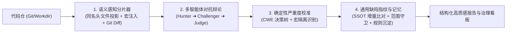

# Code-Shield 智能扫描引擎与任务配置使用手册 🛡️

欢迎使用 **Code-Shield 智能代码安全与质量分析平台**。本手册旨在帮助研发人员、安全专家与系统管理员深入理解系统的核心能力，掌握任务类型（Task Type）的高级配置技巧，以及在不同业务场景下如何合理选择执行引擎、分片参数与服务端底层并发配置。

---

## 目录
- [一、 核心架构与核心理念](#一-核心架构与核心理念)
- [二、 五大执行模式详解 (Engine Modes)](#二-五大执行模式详解-engine-modes)
  - [2.1 模式选型决策矩阵](#21-模式选型决策矩阵)
  - [2.2 模式详细说明](#22-模式详细说明)
- [三、 任务类型引擎配置指南 (Engine Config)](#三-任务类型引擎配置指南-engine-config)
  - [3.1 参数速查表](#31-参数速查表)
  - [3.2 典型场景 JSON 配置模版](#32-典型场景-json-配置模版)
- [四、 服务端核心架构配置指南 (config.yaml)](#四-服务端核心架构配置指南-configyaml)
  - [4.1 任务池大小与全局并发排队 (`server`)](#41-任务池大小与全局并发排队-server)
  - [4.2 AI 基础引擎与调试开关 (`ai`)](#42-ai-基础引擎与调试开关-ai)
  - [4.3 工作时间智能限流与自动避峰 (`ai.work_hours_throttle`)](#43-工作时间智能限流与自动避峰-aiwork_hours_throttle)
  - [4.4 多 LLM 物理节点负载均衡池 (`ai.models`)](#44-多-llm-物理节点负载均衡池-aimodels)
  - [4.5 异构模型多阶梯分层调度 (`ai.tiers`)](#45-异构模型多阶梯分层调度-aitiers)
  - [4.6 核心概念辨析：`ai.models` 与 `ai.tiers` 的协同原理与选型指南](#46-核心概念辨析aimodels-与-aitiers-的协同原理与选型指南)
  - [4.7 智能体辩论流水线流控与背压 (`ai.debate`)](#47-智能体辩论流水线流控与背压-aidebate)
  - [4.8 企业治理与历史记忆闭环配置 (`governance`)](#48-企业治理与历史记忆闭环配置-governance)
- [五、 缺陷生命周期与人机反馈记忆闭环](#五-缺陷生命周期与人机反馈记忆闭环)
- [六、 常见问题与排查指引 (FAQ)](#六-常见问题与排查指引-faq)

---

## 一、 核心架构与核心理念

Code-Shield 摒弃了传统 SAST 规则匹配的高误报，也规避了简单 Prompt 调用在大仓场景下的“上下文丢失”、“幻觉”与“算力浪费”，构建了四大核心技术支柱：



1. **语义感知分片 (Semantic Chunking)**：
   自动将 `src/` 实现文件与其依赖的 `include/` 同名头文件配对归组，并自动提取公共头文件结构体声明摘要（Header Outline）与全局构建宏（`#define`），随分片一同送给大模型，彻底解决跨文件上下文缺失问题。
2. **多智能体三方对抗辩论 (Agentic Debate)**：
   - **Hunter (初筛猎手 - Tier 1 快模型)**：高召回快速发掘可疑漏洞与攻击假设；
   - **Challenger (对抗辩护人 - Tier 2 推理模型)**：从断言、条件宏、语言规范四维发起严厉反向质询；
   - **Judge (终审法官 - Tier 2 推理模型)**：对照源码做出最终判词，判定 `CONFIRMED`、`REJECTED` 或 `CONDITIONAL`，彻底剔除误报。
3. **确定性严重度校准决策树 (Deterministic Calibrator)**：
   基于 CWE 知识库、内存越界/UAF 特征与外部宏隔离判定，纠正大模型的自由裁量与定级倒挂。
4. **通用缺陷指纹与历史记忆闭环 (SSOT Fingerprint & Memory)**：
   基于公式 $\text{SHA256}(\text{RepoID} + \text{TaskTypeID} + \text{Path} + \text{Scope} + \text{TriggerLine})$ 计算抗行号抖动的唯一指纹，实现跨扫描的增量生命周期追踪（`NEW` / `EXISTED` / `RESOLVED` / `REOPENED`），并支持研发人员一键沉淀负样本规则。

---

## 二、 五大执行模式详解 (Engine Modes)

系统支持 5 种执行引擎模式，可在任务类型配置的 **「执行模式」** 下拉框中随时切换。

### 2.1 模式选型决策矩阵

| 执行模式 | 内部标识 | 核心流程 | 推荐适用任务类型 | 精度/召回/速度评估 |
| :--- | :--- | :--- | :--- | :--- |
| **全量多智能体辩论** | `debate_full` | 语义分片 ➜ Hunter 初筛 ➜ Challenger 抗辩 ➜ Judge 终审 ➜ 规则校准 ➜ 增量打标 | Coredump 风险、内存泄漏、深度代码检视、近期变更检视 | ⭐⭐⭐⭐⭐ 极高精度<br>⭐⭐⭐⭐⭐ 极低误报<br>中等耗时 |
| **选择性智能体辩论** | `debate_selective` | 语义分片 ➜ 规则/关键字初筛 ➜ 仅对疑点触发辩论 ➜ 规则校准 ➜ 增量打标 | cJSON 泄漏、无序集合导出、单测质量审计 | ⭐⭐⭐⭐⭐ 高精度<br>⭐⭐⭐⭐ 较低成本<br>较快耗时 |
| **语义分片快扫** | `chunked_fast` | 语义分片 ➜ 规则初筛 ➜ 确定性规则校准 ➜ 增量打标 | 浮点数直接比较、裸线程创建、单测有效性评估 | ⭐⭐⭐⭐ 高召回<br>⭐⭐⭐⭐⭐ 极低 Token 消耗<br>极速并发 |
| **经典分片引擎** | `chunked` | 目录结构拆分 ➜ 并发大模型分析 ➜ 规则校准 ➜ 增量打标 ➜ 报告综合 | 通用代码安全扫描、大仓分层分析 | ⭐⭐⭐⭐ 良好稳定<br>⭐⭐⭐ 传统模式 |
| **单次全仓引擎** | `single` | 单次整仓提问 ➜ 规则校准 ➜ 增量打标 ➜ 报告综合 | 小型脚本工具仓、Demo 工程、轻量初筛 | ⭐⭐⭐ 单次直出<br>适用于 ≤ 20 个小文件 |

---

### 2.2 模式详细说明

#### 1. 🤖 全量对抗辩论模式 (`debate_full`)
- **工作机制**：每一个代码分片均由 Tier-1 快模型快速发掘候选，零可疑分片秒级放行；一旦发掘可疑漏洞，自动调取 Tier-2 深度推理模型启动 Challenger 抗辩与 Judge 终审仲裁。
- **最佳场景**：
  - `coredump_risk`（进程崩溃隐患）：需要推演复杂空指针、野指针与栈越界；
  - `memory_leak`（内存泄漏）：需要追踪跨函数、跨分支的申请与释放；
  - `change_review`（近期变更检视）：对代码改动质量做严格守门。

#### 2. ⚖️ 选择性辩论模式 (`debate_selective`)
- **工作机制**：对于特定 API 库（如 cJSON、STL 容器）先基于内容关键字极速过滤，仅当命中了可疑使用模式时，才向法官提交仲裁案卷。
- **最佳场景**：
  - `cjson_scan`（cJSON_Delete 缺失/双重释放）；
  - `unordered_collection`（签名或导出场景下无序 map 的确定性排查）。

#### 3. ⚡ 语义分片快扫模式 (`chunked_fast`)
- **工作机制**：跳过重量级的大模型多轮反向辩论，利用语义分片器注入的宏与头文件上下文，配合后置确定性严重度决策树快速判定。
- **最佳场景**：
  - `float_comparison`（浮点数直接 `==` 或 `!=` 比较）；
  - `thread_create`（显式创建 `std::thread` / `pthread_create` 治理）；
  - `ut_effectiveness`（单元测试断言有效性与空测试）。

---

## 三、 任务类型引擎配置指南 (Engine Config)

在 **「任务类型」➜「编辑」** 中的 **「引擎配置 (JSON)」** 文本框中，可通过 JSON 格式定制化微调扫描行为。

### 3.1 参数速查表

| 配置参数 (JSON Key) | 类型 | 默认值 | 作用说明 |
| :--- | :---: | :---: | :--- |
| **`since_days`** | `int` | `0` | **增量变更提取**：仅检视最近 N 天内有 Git 提交的文件（如 `7`）。设为 `0` 表示全仓扫描。 |
| **`diff_base`** | `string` | `""` | **分支/基准差异比对**：仅检视与基准分支或 Commit 发生差异的文件（例如 `"origin/main"`）。 |
| **`max_files`** | `int` | `20` | 单个语义分片包含的最大文件数。大仓建议设为 `15~30`。 |
| **`depth`** | `int` | `1` | 目录归组深度。`1` 代表按顶层一级目录分片，`2` 代表按二级子目录分片。 |
| **`concurrency`** | `int` | `6` | 该任务分析时分片并行的最大协程数。 |
| **`file_extensions`** | `array` | `[]` | 任务级扩展名白名单（如 `[".c", ".cpp", ".h"]`），为空时匹配全部常见源码。 |
| **`content_keywords`** | `array` | `[]` | 内容关键字预过滤器，仅当文件包含其中关键字时才进行分析（如 `["cJSON_"]`）。 |
| **`exclude_paths`** | `array` | `[]` | 忽略路径列表（如 `["thirdparts", "vendor", "test/mock"]`）。 |

---

### 3.2 典型场景 JSON 配置模版

#### 场景一：近期代码检视 (最近 7 天变更精准检视)
适用于周度代码评审或定期质量守门，自动识别 7 天内的变动文件并智能绑定同名头文件：
```json
{
  "since_days": 7,
  "max_files": 15,
  "depth": 1,
  "exclude_paths": [
    "thirdparts",
    "build",
    "third_party"
  ]
}
```

#### 场景二：C/C++ 核心代码库深度攻关 (Coredump / 内存泄漏)
限制在 C/C++ 源文件，按二级目录精细化分片，自动排除第三方依赖：
```json
{
  "file_extensions": [
    ".c",
    ".cpp",
    ".cc",
    ".cxx",
    ".h",
    ".hpp"
  ],
  "depth": 2,
  "max_files": 20,
  "concurrency": 8,
  "exclude_paths": [
    "thirdparts",
    "vendor",
    "docs"
  ]
}
```

#### 场景三：特定关键字专项排查 (如 cJSON 内存泄漏)
利用 `content_keywords` 毫秒级跳过无关源码文件：
```json
{
  "content_keywords": [
    "cJSON_",
    "cJSON"
  ],
  "file_extensions": [
    ".c",
    ".cpp",
    ".h"
  ],
  "max_files": 30,
  "concurrency": 6,
  "exclude_paths": [
    "thirdparts"
  ]
}
```

---

## 四、 服务端核心架构配置指南 (config.yaml)

系统所有全局参数、任务池排队模型、AI 算力节点及企业治理策略均在 `config.yaml` 中集中定义。

### 4.1 任务池大小与全局并发排队 (`server`)

控制系统在应用层可以**同时执行的代码仓扫描任务数**以及**最大排队缓冲上限**：

```yaml
server:
  port: ":8080"
  data_dir: "./data"             # 运行时数据根目录 (自动存放 codes/ 缓存和 reports/ 报告)
  worker_count: 5                # 全局任务并发 Worker 槽位数（默认 5 个代码仓任务并发）
  max_queue_size: 2000           # 任务排队最大上限（默认 2000，-1 表示不限制；超限将返回 HTTP 429）
  read_timeout: 120s             # HTTP 接口读取超时
  write_timeout: 120s            # HTTP 接口写入超时
  idle_timeout: 180s             # Keep-Alive 空闲连接超时
```

> 💡 **并发拓展机制**：
> 当在下方的 `ai.models` 中配置了多 LLM 服务器节点时，系统全局实际并发数会被所有模型的 `concurrent` 总和**自动智能拓展**，确保充分利用 GPU 集群算力。

---

### 4.2 AI 基础引擎与调试开关 (`ai`)

```yaml
ai:
  backend: "claude"              # 全局默认 AI 后端 CLI: 可选 claude、opencode 或 codex
  debug_logs: true               # 是否输出 AI 底层交互日志 (开启后在报告目录生成 .debug.log 方便排查)
  output_format: "text"          # 输出格式契约：text 或 json，默认 text
  mock_on_missing_cli: false     # CLI 未就绪时是否生成 Mock 报告 (生产环境必须设为 false，防止误报全绿)
```

---

### 4.3 工作时间智能限流与自动避峰 (`ai.work_hours_throttle`)

在企业共享 GPU 集群或商业 API 场景下，可配置在白天工作时间内自动压低扫描并发（例如 10% 算力或完全暂停），夜间非工作时间自动恢复 100% 满速排队消化：

```yaml
ai:
  work_hours_throttle:
    enabled: true                 # 是否启用工作时间自动限流
    workdays: [1, 2, 3, 4, 5]     # 生效星期: 1=周一 ~ 5=周五
    start_time: "09:00"           # 开始限流时刻 (HH:MM)
    end_time: "20:00"             # 结束限流时刻 (HH:MM)
    scale: 0.10                   # 并发比例 (0.10 代表压低至 10%，0.0 代表白天完全暂停)
```

---

### 4.4 多 LLM 物理节点负载均衡池 (`ai.models`)

**定位**：**底层算力供给层**。管理系统底层接入了“哪些物理 GPU 服务器或第三方 API 网关”，以及“各自允许承担的最大并发数”。

支持将请求按**负载最低优先策略（Least-Loaded Strategy）**动态打散分发给多台物理 LLM 节点，根据后端类型自动映射模型名称并精确控制每台服务器的并发负载：

```yaml
ai:
  models:
    - opencode: "models/glm5.1"
      claude: "glm5.1"
      codex: "gpt-5.6-sol"
      agy: "gemini-3.7-flash"
      concurrent: 8              # 节点 1：分配 8 个并发槽位
    - codex: "o3-mini"
      agy: "gemini-3.7-pro"
      concurrent: 4              # 节点 2：分配 4 个并发槽位
```

- **并发拓扑拓展**：当配置了 `ai.models` 时，全局实际 AI 并发数会被所有节点的 `concurrent` 总和自动拓展（例如上述配置为 $8 + 4 = 12$ 并发），取代基础的 `server.worker_count`。
- **自动过载保护**：当某台节点并发跑满时，调度器会自动阻塞并等待槽位释放，或将任务智能路由至其他空闲节点，防止打爆单机显存或触发网关限流。

---

### 4.5 异构模型多阶梯分层调度 (`ai.tiers`)

**定位**：**业务需求路由层**。管理代码检视流水线在“初筛、推理、排版等不同业务环节”，分别采用什么能力等级的模型、并发槽位与超时时限。

Code-Shield 核心的**三级异构模型调度拓扑**。通过将任务拆分为初筛、推理与汇总三大阶梯，实现“轻重分离”，在大幅提升扫描吞吐的同时大幅压降深度推理成本：

```yaml
ai:
  tiers:
    tier1_fast:                    # Tier 1：高并发初筛猎手 (Hunter)
      backend: "agy"               # 推荐轻量快模型，高并发快速发散筛选疑点
      model: "gemini-3.7-flash"
      concurrent: 5                # 并发槽位数
      timeout_seconds: 1200        # 快速初筛阶段单片超时时限 (秒，如 1200 代表 20 分钟)
    tier2_reasoning:               # Tier 2：深度推理对抗 (Challenger 抗辩与 Judge 终审)
      backend: "agy"               # 推荐最强深度推理模型，用于事实链推演与反向仲裁
      model: "gemini-3.7-pro"
      concurrent: 3                # 精细化推演槽位
      timeout_seconds: 1800        # 辩论与裁决阶段单片超时时限 (秒，如 1800 代表 30 分钟)
    tier3_synthesis:               # Tier 3：综合报告排版与汇总 (Synthesis)
      backend: "agy"               # 具备超大上下文与高格式化排版能力
      model: "gemini-3.7-flash"
      concurrent: 2                # 全仓总结并发槽位
      timeout_seconds: 900         # 综合阶段超时时限 (秒，如 900 代表 15 分钟)
```

---

### 4.6 核心概念辨析：`ai.models` 与 `ai.tiers` 的协同原理与选型指南

初次配置 Code-Shield 时，许多管理员容易混淆 `ai.models` 与 `ai.tiers`。它们本质上是 **“算力供给端”** 与 **“业务需求端”** 的纵横协同关系：

```
               ┌────────────────────────────────────────────────────────┐
               │              业务流水线阶段 (ai.tiers - 需求端)          │
               │  • Tier 1: 快排初筛 (Hunter)   ➔ 高并发、低成本、响应快   │
               │  • Tier 2: 对抗裁决 (Judge)    ➔ 强推理、高深度、长超时   │
               │  • Tier 3: 报告排版 (Synthesis)➔ 大上下文、结构化排版    │
               └──────────────────────────┬─────────────────────────────┘
                                          │ 调度路由 (TierRouter)
                                          ▼
               ┌────────────────────────────────────────────────────────┐
               │           物理服务器/并发负载池 (ai.models - 供给端)     │
               │  • Server #1: GPU 节点 A (glm5.1 / qwen32b, 并发=8)    │
               │  • Server #2: GPU 节点 B / 外部网关 (claude, 并发=4)    │
               │  • 负责：Least-Loaded 负载均衡、工作时间自动限流(Throttle)│
               └────────────────────────────────────────────────────────┘
```

#### 1. 核心职责对比

| 维度 | `ai.models` (物理负载池) | `ai.tiers` (阶梯路由层) |
| :--- | :--- | :--- |
| **所属层级** | 物理/网络算力层（供给端） | 业务逻辑流水线层（需求端） |
| **核心问题** | “我有几台服务器/API 网关？各自允许跑几个并发？” | “代码检视的不同阶段，分别需要什么等级的模型与超时？” |
| **生效范围** | 全局物理槽位管理、工作时间自动限流 (`work_hours_throttle`) | 仅在分片检视与辩论流水线中按阶段生效 |
| **典型配置项** | 服务器列表、`opencode`/`claude`/`agy` 模型名映射、节点 `concurrent` | `tier1_fast`、`tier2_reasoning`、`tier3_synthesis`、`timeout_seconds` |

#### 2. 两者的内部调度协作流程

当一次多智能体代码检视任务执行时，底层的 `TierRouter` 与 `ModelDispatcher` 会协同工作：
1. **阶段发起（需求声明）**：任务进入 Hunter 阶段，调用 `TierRouter.AcquireTier("tier1_fast")`；
2. **能力匹配（路由解析）**：`TierRouter` 读取 `tier1_fast` 的配置，确定当前阶段期望使用 `backend: agy` 与轻量快模型；
3. **物理分配（负载均衡）**：底层的 `ModelDispatcher` 遍历 `ai.models` 中的物理服务器列表，寻找支持 `agy` 且**当前活跃连接最少（Least-Loaded）**的空闲物理槽位并加锁占用；
4. **执行与释放（资源归还）**：AI 调用完成（或超时）后，物理槽位被释放，唤醒其他等待中的分片。

#### 3. 四种典型配置组合与选型矩阵

| 配置组合 | 运行表现 | 推荐适用场景 |
| :--- | :--- | :--- |
| **模式一：仅配置 `ai.tiers`** | 辩论各阶段使用不同的快/慢模型，并发走全局统一配置 (`server.worker_count`)。 | 适合单一 API 网关（如使用单一 Antigravity / Claude 账号），但希望初筛与裁决区分快慢模型。 |
| **模式二：仅配置 `ai.models`** | 所有扫描任务在多台物理 GPU 服务器间做负载均衡，但各阶段使用同等强度的模型。 | 适合有多台私有 GPU 机器，主要运行传统单次或快扫分片引擎。 |
| **模式三：两者同时配置** *(推荐)* | **极致性能与成本平衡**：业务阶段精准调用快/强模型，底层物理节点实现负载均衡与并发打散。 | 适合大型团队高并发多智能体辩论扫描（生产环境最佳实践）。 |
| **模式四：两者均不配置** | 自动降级为全局单点模式：使用全局 `ai.backend` 与默认 `server.worker_count`。 | 适合本地单机快速轻量体验。 |

---

### 4.7 智能体辩论流水线流控与背压 (`ai.debate`)

控制智能体辩论的保护水位与熔断保护：

```yaml
ai:
  debate:
    enabled: true                  # 全局是否开启三方对抗辩论
    fast_pass_enabled: true        # 零候选快速放行 (无疑点分片毫秒级放行，节省 80%+ 算力)
    max_candidates_per_chunk: 8    # 单分片进入辩论的最大候选点上限 (防异常 Prompt 爆炸)
    stage_timeout_seconds: 1800    # 单阶段全局硬超时兜底 (秒，如 1800 代表 30 分钟)
    backpressure_threshold: 30     # 跨 Tier 调度积压阈值 (超过后触发背压)
    backpressure_timeout_seconds: 120 # 背压超时兜底：超时后平滑降级为 Hunter 初筛直出
    log_retention_days: 30         # 辩论轨迹 JSON 审计日志保留天数
    log_redaction_enabled: false   # 是否启用辩论日志敏感信息脱敏
```

---

### 4.8 企业治理与历史记忆闭环配置 (`governance`)

控制全任务通用缺陷指纹、增量比对状态机与人机负样本学习：

```yaml
governance:
  fingerprint_enabled: true        # 开启跨扫描缺陷抗行号抖动指纹计算
  scope_guard_enabled: true        # 启用扫描范围守卫 (未成功扫描的文件严禁误判为已修复)
  auto_resolve_missing: true       # 本次未出现的历史存量缺陷自动标记为已修复 (RESOLVED)
  feedback_injection: true         # 自动将研发人员标记的误报/豁免规则注入下次 Prompt
  diff_gate_strict: true           # MR/PR 门禁流水线模式下仅阻断 [NEW] 增量缺陷
```

---

## 五、 缺陷生命周期与人机反馈记忆闭环

每次任务分析完成后，系统会自动执行增量比对状态机，并在界面上呈现闭环治理能力：

### 1. 增量状态徽标 (Diff Status)
- `[NEW] 本次新增`：本次扫描首次发现的新缺陷；
- `[EXISTED] 历史存量`：历史扫描已存在且未修复的持续性缺陷；
- `[RESOLVED] 已修复`：历史存量缺陷所在文件经本次成功扫描后确认已消除（内置**扫描范围守卫**，未扫描的文件绝不会误判为修复）；
- `[REOPENED] 复发激活`：曾经标记已修复或关闭的问题再次被检出。

### 2. 智能体三方对抗事实链查看
在报告的详细清单中，点击卡片中的 **「🤖 智能体三方对抗事实链」**，可展开查阅：
- **🎯 Hunter 主张**：初筛猎手提出的漏洞成因与攻击输入假设；
- **⚖️ Challenger 辩护**：辩护人提出的前置断言、锁保护或宏隔离证据；
- **📜 Judge 裁决书**：终审法官出具的裁决依据与权威修复代码。

### 3. 研发人员一键标记反馈与规则沉淀
- 若某条发现经业务团队核实属于**误报 (False Positive)** 或 **已知业务设计豁免 (Won't Fix)**：
- 点击缺陷卡片右上角的 **「🛡️ 标记反馈」** 按钮；
- 填写排查理由并提交；
- 系统会自动将该缺陷指纹与文件路径沉淀为代码仓的 **负样本例外规则**，在后续所有扫描中**永久自动过滤，彻底杜绝重复上报打扰**！

---

## 六、 常见问题与排查指引 (FAQ)

### Q1: 近期代码检视为什么提示“过去 7 天内无代码提交，跳过扫描”？
**答**：这是系统的前置防御机制（Precondition Script）。若该代码仓在最近 7 天内无任何 Git Commit，系统会自动判定为无需重复检视并标记为 `SKIPPED`，为您节省算力。若需强制全量扫描，可在任务类型中选用普通代码检视任务或将 `since_days` 调大。

### Q2: 为什么有些头文件的缺陷会被归在 `src/` 分片中？
**答**：这是语义感知分片器的**跨目录同名投影特性**。为了让大模型在分析实现代码时拥有完整的类定义和结构体签名，系统特意将 `include/xxx.h` 与 `src/xxx.cc` 归并在同一个分片中一同提供给 AI，避免上下文割裂。

### Q3: 任务显示“排队中 (PENDING)”很久没有开始是什么原因？
**答**：请检查 `config.yaml` 中的 `server.worker_count` 与 `ai.models` 并发总数。如果当前正在执行的任务数已达到并发上限，新触发的任务会自动在内存队列中排队等待空闲 Worker。另外如果启用了 `ai.work_hours_throttle`，在工作时间段内系统会自动压低并发。

### Q4: 如果底层某个物理 LLM 节点偶尔超时或报错，任务会直接失败吗？
**答**：不会。系统内置了多层容错韧性：
1. **分片级重试**：失败分片自动在后台退避重试（最大 3 次）；
2. **辩护人降级**：若辩护人节点超时，法官会自动基于猎手原始材料与源码独立裁决；
3. **部分成功合成**：若全仓 95% 以上分片成功，系统会优雅输出报告并附带部分未扫警告，保证整体任务不作废。

---

*如有更多配置疑问或定制化规则需求，请联系 Code-Shield 平台研发与架构支持团队。*
