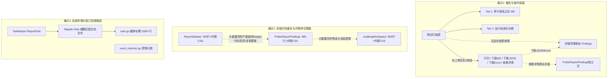
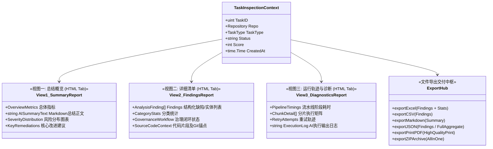
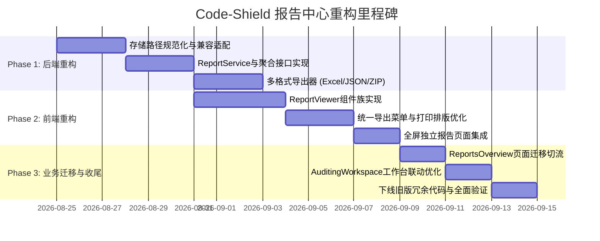

# Code-Shield 任务报告与治理诊断中心重构设计方案

> **文档版本**：v1.1.0  
> **更新日期**：2026-08-22  
> **文档状态**：Ready for Review  
> **适用范围**：Code-Shield 报告体系（总结报告、详细清单报告、运行轨迹与诊断、在线 HTML 呈现与文件导出中心）

---

## 1. 背景与现状深度剖析

### 1.1 业务背景与演进历程
Code-Shield 在从早期的单一规则扫描引擎演进为支持**单仓全量分析 (Single Engine)** 与 **分片并发大仓分析 (Chunked Engine)**、并支持**缺陷攻关模式 (Defect Tracking)** 与 **实体评估模式 (Entity Assessment)** 的企业级代码治理平台的过程中，任务分析结果的数据形态和用户使用场景发生了极大丰富：
1. **总结报告 (Summary Report)**：AI 宏观分析概要、评分、安全合规综述及全局优化建议；
2. **详细清单报告 (Detailed Findings Report)**：结构化问题项、严重级别、代码行列定位、代码片段高亮、缺陷生命周期流转（指派/解决/忽略）及关联测试用例；
3. **运行轨迹与诊断 (Execution Trajectory & Diagnostics)**：分片耗时分布、阶段时序流、重试链路、AI 进程输出日志及故障诊断；
4. **呈现与交付需求**：
   - **在线交互呈现**：以 **HTML 界面/抽屉 (Web UI)** 为核心载体，提供富交互、多维筛选排查、代码高亮折叠、责任人指派流转与全景监控；
   - **文件导出交付**：用户与管理层需要在不同场景下将成果导出为 **Excel (XLSX/CSV)、结构化 JSON、Markdown、PDF（打印/另存为PDF）、ZIP 全量归档包**。

### 1.2 现有架构痛点分析

经过对当前前端代码（`ReportSidebar.tsx`、`PublicReportFindings.tsx`、`ReportsOverview.tsx`、`AuditingWorkspace.tsx`）及后端代码（`handlers/task.go`、`handlers/excel_exporter.go`、`services/task_runner.go`、`services/engine_chunked.go`）的彻底梳理，发现当前系统存在以下四大核心技术债务与体验缺陷：



#### 痛点 1：概念混淆、操作割裂与信息不对称
- **操作按钮意图与内容不对称**：在 `ReportSidebar.tsx` 顶部操作栏中，平铺了 `[打印 / PDF]`、`[下载 MD]`、`[下载 JSON]`、`[下载 Excel]`、`[查看详情]`。
  - 用户在浏览“审计报告正文（Markdown）”时，点击“下载 JSON”或“下载 Excel”，实际下载的却是**详细清单报告（Synthesis JSON / CSV）**，界面上没有清晰的靶向分类提示；
  - 侧边栏抽屉里**缺少“详细清单”Tab**，导致用户若想查看具体缺陷，必须点击“查看详情”在新标签页打开 `PublicReportFindings`，破坏了在概览列表快速下钻的连续体验。
- **运行轨迹与诊断功能无法导出归档**：运行轨迹（Summary JSON）与执行输出日志（`output.txt`）仅在侧边栏显示，缺少一键打包排错日志能力。

#### 痛点 2：前端代码冗余严重、缺乏统一的 Report 组件库
- `ReportSidebar.tsx`（551 行）、`PublicReportFindings.tsx`（689 行）、`AuditingWorkspace.tsx`（906 行）三处各自维护了一套严重级别色彩映射表、代码片段渲染容器、行号解析定位、剪贴板复制逻辑、甚至数百行内联 `<style>` 标签；
- 打印样式配置（`@media print`）在多处硬编码，打印效果参差不齐，容易出现表格断页被切断、代码块背景失效等排版问题。

#### 痛点 3：文件导出能力分散且实现粗糙
- **PDF 导出**：纯依赖客户端浏览器调用 `window.print()` 或拼装简单 HTML 字符串，无专业封面、无目录、无页眉页脚与分页断点控制；
- **Excel 导出**：`handlers/task.go` 输出的是简易 CSV，而 `handlers/excel_exporter.go` 虽然引入了 `excelize` 库，但仅限专项分析使用，两套导出代码割裂且无法复用。

#### 痛点 4：后端存储规范与 Handler 职责混乱
- 报告落盘路径命名不统一，代码中充斥着大量的 `filepath.Glob(report-%d-synthesis-*.json)` 模糊匹配容错，说明文件命名缺乏严格版本与目录规范；
- `handlers/task.go` 高达 1038 行，既处理任务 CRUD、又处理 Markdown 读取、又处理 CSV 拼接、又处理通知触发，缺乏领域驱动的 `ReportService` 和专用 `Exporter` 模块。

---

## 2. 核心业务概念与信息架构模型 (IA)

为了彻底解决概念模糊与操作割裂的问题，重构方案建立**标准化任务报告领域模型**，将一次任务扫描产生的所有交付物严格归整为**三大核心报告视图**（由在线 HTML 界面统一呈现）与**统一文件导出中心**。

### 2.1 三大核心资产与界面呈现界定



| 资产维度 | 英文标识 | 核心内容 | 在线 HTML 呈现形态 | 文件导出支持 | 典型受众 |
| :--- | :--- | :--- | :--- | :--- | :--- |
| **1. 总结报告** | `summary` | 任务基本信息、评分评级、AI 总体评价、缺陷统计图表、总体修复建议 | 抽屉/页面 Tab 1：总结概览 | Markdown (`.md`), PDF 打印 | 管理者 / 架构师 / 评审组 |
| **2. 详细清单** | `findings` | 所有检出的具体缺陷/实体、严重级别、文件行号、代码上下文、修复方案、责任人与治理状态 | 抽屉/页面 Tab 2：详细清单（富表格、多维筛选、治理流转） | Excel (`.xlsx`), CSV (`.csv`), JSON (`.json`) | 一线开发人员 / 模块负责人 |
| **3. 运行轨迹** | `diagnostics` | 克隆/前置/分片/综合/归并各阶段时序、分片耗时分布、重试记录、AI CLI 执行日志与报错诊断 | 抽屉/页面 Tab 3：运行轨迹与诊断（时序泳道、分片矩阵、日志查看器） | 文本日志复制 / 包含在 ZIP 中 | 平台运维 / 规则开发 / 排错人员 |
| **4. 全量归档** | `all_in_one` | 包含上述 1~3 的全套完整工程交付包 | 在线全量聚合展示 | ZIP 压缩包 (`.zip`) | 审计归档 / 离线交接 |

> **注**：HTML 页面作为系统内置的核心交互载体，支持在浏览器中直接浏览、下钻、筛选与治理流转，不需要单独导出为 `.html` 文件；离线文件分发与数据对接通过 **Excel、JSON、Markdown、PDF、ZIP** 完成。

---

## 3. 界面操作与交互重构方案 (UI/UX)

### 3.1 双模态查看机制 (Dual Presentation Modes)
用户在不同场景下对报告的阅读深度不同，重构后支持统一的两级呈现模式，两模式共享底层渲染内核：

1. **轻量抽屉模式 (Quick Inspection Drawer)**：
   - 触发场景：在“报告概览 (`/shield/reports`)”、“历史报告 (`/shield/reports/repo/:id`)”、“治理工作台 (`/shield/analysis/:campaign`)”点击“查看报告”时弹出；
   - 交互优势：无需跳出当前列表上下文，支持快速左右切换任务、支持在抽屉内一站式浏览“总结”、“清单”与“诊断”；
   - 支持抽屉右上角 `[ ⛶ 全屏展开 / 恢复 ]` 按钮。
2. **沉浸式独立页面模式 (Full-Page Report Hub & Public Share)**：
   - 触发场景：点击“在新窗口打开 / 分享链接 (`/shield/public/reports/:id`)”；
   - 交互优势：宽屏视野、适合投影汇报、支持免登录团队分享、内嵌完整打印控制条。

### 3.2 统一导出中心 (Unified Export Hub) 交互重构

#### 改造前（混乱的 5 个按钮）
```
[ 🖨️ 打印 / PDF ]  [ 📄 下载 MD ]  [ 💾 下载 JSON ]  [ 📊 下载 Excel ]  [ ↗ 查看详情 ]  [ ✕ ]
```
*痛点：按钮平铺占用大量头部宽度，且 JSON 与 Excel 实际下载的是 Findings，而 MD 下载的是 Summary，用户极易产生困惑。*

#### 改造后（清晰意图靶向的现代化操作栏）
```
┌────────────────────────────────────────────────────────────────────────────────────────────────┐
│ 任务报告详情  #1028  ·  fugui/code-bench  ·  [ 95分 / 优 ]              [ ⛶ 全屏 ]  [ ✕ 关闭 ] │
│ ────────────────────────────────────────────────────────────────────────────────────────────── │
│ [ 📑 总结概览 ]    [ 📋 详细清单 (12) ]    [ 🔬 运行轨迹与诊断 ]     │  [ 🖨️ 打印 / PDF ] [ 📥 导出 ▾ ]│
└────────────────────────────────────────────────────────────────────────────────────────────────┘
```

点击 **`[ 📥 导出 ▾ ]`** 弹出语义明确的下拉菜单：
```
┌────────────────────────────────────────┐
│ 📋 导出详细问题清单                    │
│   ├─ 📊 Excel 工作簿 (.xlsx)    [推荐] │
│   ├─ 📄 CSV 逗号分隔表格 (.csv)        │
│   └─ 🔌 结构化数据 (.json)             │
│ ────────────────────────────────────── │
│ 📑 导出审计总结报告                    │
│   └─ 📝 Markdown 文档 (.md)            │
│ ────────────────────────────────────── │
│ 📦 导出全量任务归档包                  │
│   └─ 🗜️ ZIP 完整交付包 (.zip)          │
└────────────────────────────────────────┘
```

### 3.3 三大 Tab 视图详细交互设计

```
┌────────────────────────────────────────────────────────────────────────────────────────┐
│ [ 📑 总结概览 ]               [ 📋 详细清单 (12) ]          [ 🔬 运行轨迹与诊断 ]      │
├────────────────────────────────────────────────────────────────────────────────────────┤
│                                                                                        │
│  【Tab 1: 总结概览】                                                                   │
│  ┌──────────────┐ ┌──────────────┐ ┌──────────────┐ ┌───────────────────────────────┐ │
│  │ 🎯 综合评分   │ │ ⏳ 任务总耗时 │ │ ⚠️ 发现问题   │ │ 📊 严重度分布                 │ │
│  │    95 分     │ │    42 秒     │ │    12 个     │ │ [致命 0] [严重 2] [一般 10] │ │
│  └──────────────┘ └──────────────┘ └──────────────┘ └───────────────────────────────┘ │
│                                                                                        │
│  一、检视结果概要                                                                       │
│  本次扫描已完成，覆盖 48 个核心业务模块。发现 2 个高优先级风险点，主要集中在内存释放与多线程  │
│  同步机制上，整体质量良好。                                                             │
│                                                                                        │
│  二、关键优化建议                                                                       │
│  1. [建议] 针对 `src/sync_worker.c` 的互斥锁释放逻辑补充单元测试覆盖。                  │
│  2. [建议] 优化 `common/buffer.go` 的切片预分配，降低 GC 压力。                         │
│                                                                                        │
├────────────────────────────────────────────────────────────────────────────────────────┤
│                                                                                        │
│  【Tab 2: 详细清单】                                                                   │
│  ┌ 快捷过滤工具栏 ──────────────────────────────────────────────────────────────────┐   │
│  │ 严重级别: [全部] [致命 0] [严重 2] [一般 10]   分类: [全部 ▾]   搜索: [输入关键字...]  │   │
│  └──────────────────────────────────────────────────────────────────────────────────┘   │
│  ┌ 缺陷卡片 / 表格列表 ─────────────────────────────────────────────────────────────┐   │
│  │ 🔴 [严重] 潜在的空指针解引用 (NPE)                     文件: api/handler.go:L104   │   │
│  │    分类: memory_safety   状态: [待处理 ▾]   责任人: [张三 ▾]   [ 📋 复制定位 ] [ ↗源码 ]│   │
│  │    ┌ 代码上下文 ─────────────────────────────────────────────────────────────┐   │   │
│  │    │ 103:   user := GetUser(req.UserID)                                      │   │   │
│  │    │ 104: > return user.Token.ExpiresAt // user 为 nil 时将触发 Panic         │   │   │
│  │    └─────────────────────────────────────────────────────────────────────────┘   │   │
│  │    💡 修复建议: 在访问 `user.Token` 前显式进行 `if user == nil { return ErrNotFound }`│   │
│  └──────────────────────────────────────────────────────────────────────────────────┘   │
│                                                                                        │
├────────────────────────────────────────────────────────────────────────────────────────┤
│                                                                                        │
│  【Tab 3: 运行轨迹与诊断】                                                             │
│  ● 流水线时序流: [✓ 初始化克隆 1.2s] ➔ [✓ 预检查 0.3s] ➔ [✓ 分片分析 35s] ➔ [✓ 综合 5s]   │
│  ● 分片执行矩阵 (6 个分片):                                                             │
│    ├─ [✓ 成功] chunk-01-core (12 个文件, 耗时 8.2s, 发现 4 个问题)                     │
│    ├─ [✓ 成功] chunk-02-api  (18 个文件, 耗时 12.1s, 发现 8 个问题)                    │
│    └─ [✓ 成功] chunk-03-utils (8 个文件, 耗时 4.5s, 无发现)                             │
│  ● 终端输出与错误日志 [ 📋 复制日志 ] [ 展开原生日志 ▼ ]                                 │
│                                                                                        │
└────────────────────────────────────────────────────────────────────────────────────────┘
```

---

## 4. 前端架构与组件化重构设计

### 4.1 前端目录结构规划
彻底打破原有各页面各写各的局面，在 `frontend/src/components/report/` 目录下建立高复用、强类型的报告组件族：

```
frontend/src/
├── types/
│   └── report.ts                   # 报告中心全量 TypeScript 接口定义
├── hooks/
│   ├── useTaskReport.ts            # 报告聚合数据加载与缓存管理 Hook
│   └── useReportExport.ts          # 多格式导出触发与下载管理 Hook
├── components/
│   └── report/
│       ├── ReportViewer.tsx        # 核心容器组件 (集成 Drawer 与 FullPage 模式)
│       ├── ReportSummaryTab.tsx    # Tab 1: 总结概览视图 (Markdown + KPI + 图表)
│       ├── ReportFindingsTab.tsx   # Tab 2: 详细清单视图 (筛选、代码预览、治理流转)
│       ├── ReportDiagnosticsTab.tsx# Tab 3: 运行轨迹与诊断视图 (流水线、分片矩阵、日志)
│       ├── ReportExportMenu.tsx    # 导出中心下拉菜单组件
│       ├── FindingCard.tsx         # 缺陷明细卡片 (可折叠、代码高亮、定位复制)
│       └── report.css              # 报告中心专用样式与 @media print 打印排版
└── pages/
    ├── ReportsOverview.tsx         # 简化后的报告概览页面 (仅调用 ReportViewer)
    └── PublicReportFindings.tsx    # 简化后的公共独立报告页 (仅调用 ReportViewer)
```

### 4.2 统一 TypeScript 接口规范 (`types/report.ts`)

```typescript
// 报告全量聚合实体
export interface TaskReportAggregate {
  meta: TaskReportMeta;
  summary: TaskReportSummary;
  findings: TaskFindingItem[];
  diagnostics: TaskDiagnostics;
}

// 任务元数据
export interface TaskReportMeta {
  id: number;
  repo_id: number;
  repo_name: string;
  repo_url: string;
  branch: string;
  task_type_id: number;
  task_type_name: string;
  task_type_display: string;
  engine_mode: 'single' | 'chunked';
  governance_mode: 'defect_tracking' | 'entity_assessment';
  status: 'pending' | 'running' | 'success' | 'failed' | 'skipped';
  score: number;
  created_at: string;
  duration_seconds: number;
}

// 总结概览
export interface TaskReportSummary {
  markdown_content: string;
  kpi_metrics: {
    total_findings: number;
    fatal_count: number;
    critical_count: number;
    major_count: number;
    minor_count: number;
    pass_rate?: number;
  };
  key_recommendations: string[];
}

// 详细清单项
export interface TaskFindingItem {
  id: number;
  severity: 'fatal' | 'critical' | 'major' | 'minor' | 'suggestion' | 'pass';
  severity_display: string;
  category: string;
  file_path: string;
  line_number: string;
  title: string;
  detail: string;
  code_snippet?: string;
  suggestion?: string;
  status: 'open' | 'analyzing' | 'resolved' | 'closed' | 'invalid';
  assignee_id?: number | null;
  assignee_name?: string;
  latest_comment?: string;
}

// 诊断与运行轨迹
export interface TaskDiagnostics {
  pipeline_steps: Array<{
    name: string;
    status: 'success' | 'failed' | 'running' | 'skipped';
    duration_seconds: number;
  }>;
  chunks: Array<{
    name: string;
    status: 'success' | 'failed';
    duration_seconds: number;
    files_count: number;
    findings_count: number;
    attempts: number;
    error_message?: string;
    files: string[];
  }>;
  raw_output_log?: string;
}
```

---

## 5. 后端服务架构与文件导出引擎设计

### 5.1 后端模块与文件架构
在后端解耦 `handlers/task.go` 的重负，新建 `services/reports/` 目录，构建清晰的导出器架构：

```
shield-server/
├── services/
│   └── reports/
│       ├── report_service.go       # 报告聚合查询与数据组装
│       ├── exporter_interface.go   # 导出器抽象接口
│       ├── exporter_excel.go       # 原生 XLSX/CSV 导出 (含统计图表与双Sheet)
│       ├── exporter_markdown.go    # 结构化 Markdown 导出
│       ├── exporter_json.go        # 标准化 JSON 序列化导出
│       └── exporter_archive.go     # ZIP 全量归档打包器
├── handlers/
│   └── report_handler.go           # 专门的报告 RESTful API Handler
```

### 5.2 规范化存储路径协议 (Storage Convention)
废弃原有的散落在各目录、依靠模糊匹配的存储机制，统一规范化任务交付物在磁盘上的存储结构：

```
data/reports/{task_id}/
├── meta.json             # 任务执行元数据与参数快照
├── summary.md            # AI 生成的总结报告正文
├── findings.json         # 结构化详细问题清单 (Synthesis 结果)
├── diagnostics.json      # 运行轨迹时序与分片指标
├── execution.log         # AI CLI 原生标准输出与错误日志
└── chunks/               # 分片中间产物目录 (保留便于调试追溯)
    ├── chunk-01.json
    └── chunk-02.json
```
*所有路径统一由 `models.TaskReport.GetReportDir()` 计算，彻底消灭 `filepath.Glob`。*

### 5.3 统一 RESTful API 路由设计

| 路由路径 | 请求方法 | 功能说明 | 返回格式 |
| :--- | :--- | :--- | :--- |
| `/api/tasks/:id/report/aggregate` | `GET` | **一站式获取报告全量聚合数据**（总结+清单+诊断） | `application/json` |
| `/api/tasks/:id/report/summary` | `GET` | 仅获取总结报告 Markdown 正文 | `text/markdown` |
| `/api/tasks/:id/report/findings` | `GET` | 获取详细问题清单（支持分页与多维筛选） | `application/json` |
| `/api/tasks/:id/report/diagnostics` | `GET` | 获取运行轨迹与诊断指标 | `application/json` |
| `/api/tasks/:id/report/export` | `GET` | **统一导出分发入口**<br>`?format=excel|csv|json|md|zip` | 文件流下载 / Attachment |

### 5.4 文件导出引擎实现要点

#### 1. Excel (XLSX) 高级导出器 (`exporter_excel.go`)
- **Sheet 1【治理概览与透视】**：
  - 任务基本信息、扫描分支、综合评分；
  - 严重级别统计表（致命、严重、一般、建议）；
  - 自动插入 Excel 原生**饼图/环形图**（Native Excel Chart），无需任何图片依赖；
- **Sheet 2【缺陷明细清单】**：
  - 包含 ID、严重等级、分类、文件路径、行号、标题、详细描述、修复建议、流转状态、责任人、跟踪意见；
  - 表头采用深 Slate（`#334155`）背景与白色加粗字体，行高自动适配，开启自动筛选（Auto-Filter）与文字换行；
  - 严重级别字段根据内容自动高亮（致命/严重标红、一般标黄）。

#### 2. ZIP 全套任务归档包 (`exporter_archive.go`)
- 自动将 `summary-{id}.md`、`findings-{id}.xlsx`、`findings-{id}.json` 以及 `execution-{id}.log` 实时压缩为一个 ZIP 包下载，满足企业级一键归档与审计备查需求。

---

## 6. 重构实施与迁移演进规划

为了确保重构过程平稳可控、不影响现有在线运行的定时与手动扫描任务，采用 **三阶段渐进式演进策略**：



### 阶段 1：后端存储与文件导出引擎重构
1. 实现 `services/reports/` 导出器族，保留旧版 `/api/tasks/:id/report` 等接口以保持向后兼容；
2. 新增 `/api/tasks/:id/report/aggregate` 与 `/api/tasks/:id/report/export` 统一接口；
3. 单元测试覆盖各导出格式生成与边界容错（如 0 缺陷、超大分片日志等）。

### 阶段 2：前端通用 ReportViewer 组件族开发
1. 在 `frontend/src/components/report/` 构建 `ReportViewer`、`ReportSummaryTab`、`ReportFindingsTab`、`ReportDiagnosticsTab`；
2. 封装 `ReportExportMenu`，统一所有导出入口交互；
3. 编写 `report.css`，完善 `@media print` 样式，保证打印与另存为 PDF 的出版级效果。

### 阶段 3：全站业务页面接入与旧代码清理
1. `ReportsOverview.tsx` 接入 `ReportViewer`（抽屉模式）；
2. `PublicReportFindings.tsx` 接入 `ReportViewer`（全屏模式）；
3. `RepoReviewHistory.tsx` 与 `CampaignAnalysis.tsx` 统一复用；
4. 彻底删除 `ReportSidebar.tsx` 及旧版内联冗余代码，执行全流程回归与构建验收。

---

## 7. 总结与收益评估

| 评估维度 | 重构前现状 | 重构后效果 | 提升价值 |
| :--- | :--- | :--- | :--- |
| **用户体验 (UX)** | 抽屉仅能看 MD，看清单必须跳页；导出按钮混乱 | 抽屉内一站式浏览“总结/清单/诊断”，语义化下拉导出 | 操作路径缩短 60%，体验流畅一致 |
| **交付格式完备性** | 仅支持简易 MD/CSV，PDF靠简陋截屏打印 | 支持带原生图表 XLSX、结构化 JSON、Markdown、高质感 PDF 打印、ZIP 归档全量包 | 满足研发排查、管理汇报、外发归档全场景 |
| **代码可维护性** | 3 个大文件（2000+行）重复实现 UI 与样式，后端 Handler 臃肿 | 组件化分层清晰（ReportViewer + Tabs），专用 ReportService 域 | 消除 1000+ 行重复代码，新格式扩展零侵入 |
| **系统鲁棒性** | 依赖 glob 模糊匹配找历史文件，容易读取崩溃 | 统一存储协议与目录规范，强类型错误防护与容错 | 彻底根除文件查找异常与格式解析失败 |
