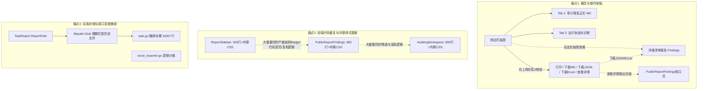
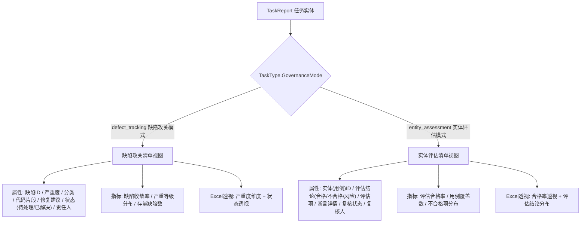
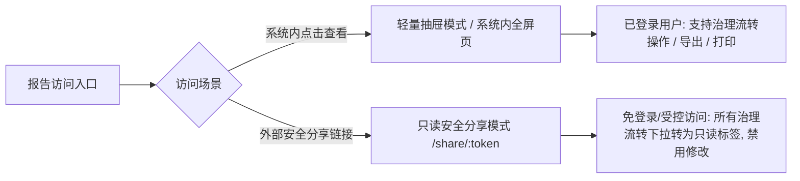
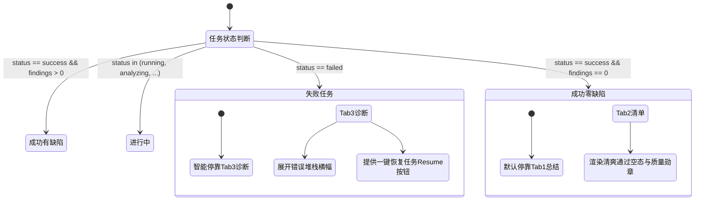
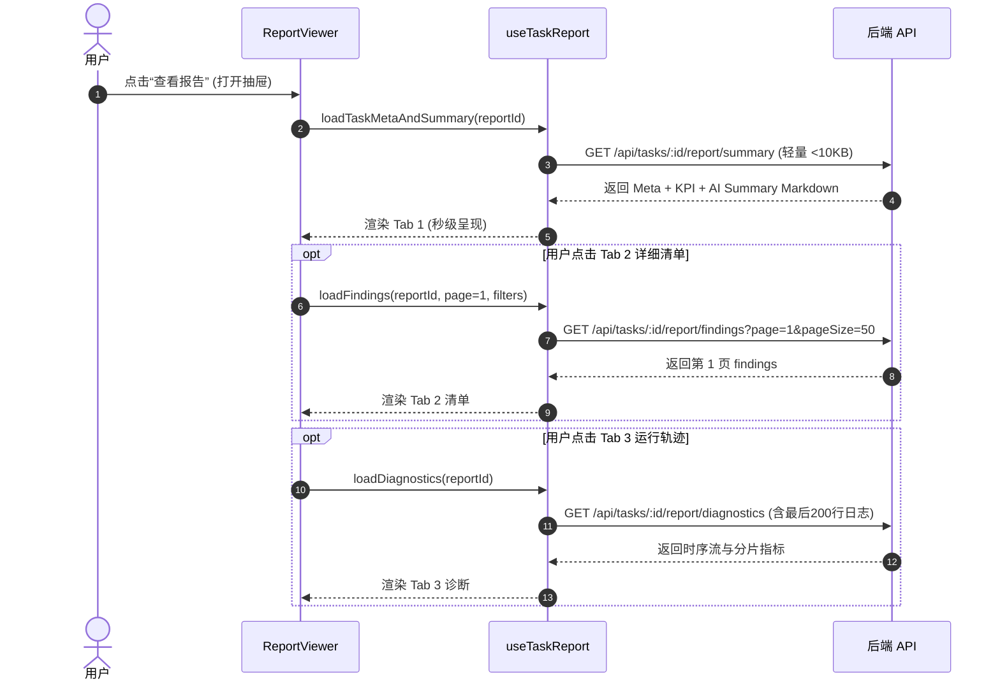
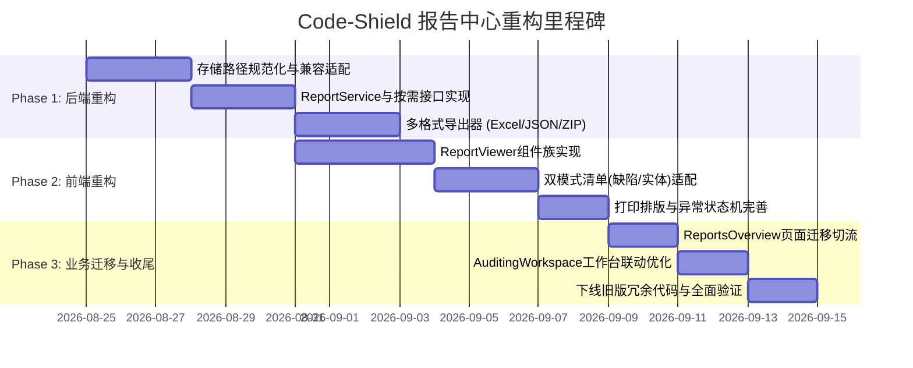

# Code-Shield 任务报告与治理诊断中心重构设计方案

> **文档版本**：v2.0.0  
> **更新日期**：2026-08-22  
> **文档状态**：Ready for Implementation (Approved after Design Review)  
> **适用范围**：Code-Shield 任务报告中心、详细清单、运行轨迹诊断、在线交互呈现与多格式导出体系

---

## 变更历史 (Changelog)

| 版本 | 日期 | 变更内容 |
| :--- | :--- | :--- |
| `v1.0.0` | 2026-08-22 | 初始版本：梳理三大核心视图、统一导出中心、前端组件化与后端服务重构设计。 |
| `v1.1.0` | 2026-08-22 | 根据反馈精简：明确 HTML 仅作为在线界面交互呈现载体，无需单独导出 HTML 文件。 |
| `v2.0.0` | 2026-08-22 | **深度修订（吸收检视意见）**：<br>1. **【P0】补齐实体评估模式 (Entity Assessment)** 的清单视图变体、状态流转与 Excel 自适应透视；<br>2. **【P0】重塑分享与权限模型**，明确系统内全屏视图与只读安全分享视图的权限隔离；<br>3. **【P1】优化抽屉加载策略**：由一次性全量拉取改为“分级按需加载 (Tiered Loading)”与缓存失效协议；<br>4. **【P1】完善状态机设计**：设计失败任务、0 缺陷/合格态、单引擎任务、超大日志截断等异常/边界状态；<br>5. **【P1】规范打印排版体系**：明确打印“当前视图”，定义 `@media print` 页眉页脚与分页防撕裂规范；<br>6. **【P2】落地交互细节**：严重度归一化映射、抽屉内任务切换、导出防抖、深链定位、无障碍 (a11y) 与客观收益指标。 |

---

## 1. 背景与现状深度剖析

### 1.1 业务背景与演进历程
Code-Shield 在从早期的单一规则扫描引擎演进为支持**单仓全量分析 (Single Engine)** 与 **分片并发大仓分析 (Chunked Engine)**、并支持**缺陷攻关模式 (Defect Tracking)** 与 **实体评估模式 (Entity Assessment)** 的企业级代码治理平台的过程中，任务分析结果的数据形态和用户使用场景发生了极大丰富：
1. **总结报告 (Summary Report)**：AI 宏观分析概要、综合风险分（参考估值）、安全合规综述及全局优化建议；
2. **详细清单报告 (Detailed Findings Report)**：结构化问题项、严重级别、代码行列定位、代码片段高亮、缺陷生命周期流转（指派/解决/忽略）及关联测试用例；
3. **运行轨迹与诊断 (Execution Trajectory & Diagnostics)**：分片耗时分布、阶段时序流、重试链路、AI 进程输出日志及故障诊断；
4. **呈现与交付需求**：
   - **在线交互呈现**：以 **HTML 界面/抽屉 (Web UI)** 为核心载体，提供富交互、多维筛选排查、代码高亮折叠、责任人指派流转与全景监控；
   - **文件导出交付**：用户与管理层需要在不同场景下将成果导出为 **Excel (XLSX/CSV)、结构化 JSON、Markdown、PDF（打印/另存为PDF）、ZIP 全量归档包**。

### 1.2 现有架构痛点分析

经过对当前前端代码（`ReportSidebar.tsx`、`PublicReportFindings.tsx`、`ReportsOverview.tsx`、`AuditingWorkspace.tsx`）及后端代码（`handlers/task.go`、`handlers/excel_exporter.go`、`services/task_runner.go`、`services/engine_chunked.go`）的彻底梳理，发现当前系统存在以下四大核心技术债务与体验缺陷：



#### 痛点 1：概念混淆、操作割裂与信息不对称
- **操作按钮意图与内容不对称**：在 `ReportSidebar.tsx` 顶部操作栏中，平铺了 `[打印 / PDF]`、`[下载 MD]`、`[下载 JSON]`、`[下载 Excel]`、`[查看详情]`。
  - 用户在浏览“审计报告正文（Markdown）”时，点击“下载 JSON”或“下载 Excel”，实际下载的却是**详细清单报告（Synthesis JSON / CSV）**，界面上没有清晰的靶向分类提示；
  - 侧边栏抽屉里**缺少“详细清单”Tab**，导致用户若想查看具体缺陷，必须点击“查看详情”在新标签页打开 `PublicReportFindings`，破坏了在概览列表快速下钻的连续体验。
- **运行轨迹与诊断功能无法导出归档**：运行轨迹（Summary JSON）与执行输出日志（`output.txt`）仅在侧边栏显示，缺少一键打包排错日志能力。

#### 痛点 2：前端代码冗余严重、缺乏统一的 Report 组件库
- `ReportSidebar.tsx`（551 行）、`PublicReportFindings.tsx`（689 行）、`AuditingWorkspace.tsx`（906 行）三处各自维护了一套严重级别色彩映射表、代码片段渲染容器、行号解析定位、剪贴板复制逻辑、甚至数百行内联 `<style>` 标签；
- 打印样式配置（`@media print`）在多处硬编码，打印效果参差不齐，容易出现表格断页被切断、代码块背景失效等排版问题。

#### 痛点 3：文件导出能力分散且实现粗糙
- **PDF 导出**：纯依赖客户端浏览器调用 `window.print()` 或拼装简单 HTML 字符串，无专业封面、无目录、无页眉页脚与分页断点控制；
- **Excel 导出**：`handlers/task.go` 输出的是简易 CSV，而 `handlers/excel_exporter.go` 虽然引入了 `excelize` 库，但仅限专项分析使用，两套导出代码割裂且无法复用。

#### 痛点 4：后端存储规范与 Handler 职责混乱
- 报告落盘路径命名不统一，代码中充斥着大量的 `filepath.Glob(report-%d-synthesis-*.json)` 模糊匹配容错，说明文件命名缺乏严格版本与目录规范；
- `handlers/task.go` 高达 1038 行，既处理任务 CRUD、又处理 Markdown 读取、又处理 CSV 拼接、又处理通知触发，缺乏领域驱动的 `ReportService` 和专用 `Exporter` 模块。

---

## 2. 核心业务概念与治理模式感知模型 (IA)

为了彻底解决概念模糊、模式割裂与操作混乱的问题，重构方案建立**治理模式感知的标准化任务报告领域模型**。

### 2.1 双治理模式感知机制 (Governance Mode Awareness)

Code-Shield 明确支持两种治理模式，报告中心在展示与导出时必须具备**模式感知与自适应**：



| 治理模式 | 适用典型场景 | 核心评估对象 | 状态语义 (Status) | 核心指标 | 是否有修复建议 |
| :--- | :--- | :--- | :--- | :--- | :--- |
| **缺陷攻关模式 (`defect_tracking`)** | 内存泄漏、空指针、并发安全、代码异味 | 具体代码缺陷点 (Finding) | `open` (待处理), `analyzing` (分析中), `resolved` (已解决), `closed` (已关闭), `invalid` (忽略/误报) | 缺陷收敛率、P0/P1缺陷清零率 | **是** (AI 给出精确修复建议) |
| **实体评估模式 (`entity_assessment`)** | 单元测试合规、浮点精度达标、注释覆盖率 | 目标实体/测试用例 (Entity/TestCase) | `pass` (合格), `fail` (不合格/需整改), `analyzing` (复核中), `invalid` (无效实体) | 实体达标率 / 合格率 / 覆盖率 | **否** (展示评估指标、断言失败详情与整改要求) |

### 2.2 严重级别体系归一化规范 (Canonical Severity System)

为解决数据库与历史数据中混杂 `fatal / critical / major / minor / suggestion / pass / 致命 / 阻塞 / 严重 / 一般 / 提示 / 建议 / 合格` 的问题，建立统一的**规范化严重级别枚举**：

```typescript
// 规范化严重级别定义 (Canonical Severity)
export type CanonicalSeverity = 'fatal' | 'critical' | 'major' | 'minor' | 'suggestion' | 'pass';

export interface SeverityMeta {
  key: CanonicalSeverity;
  label: string;          // 中文显示名: "致命" / "严重" / "一般" / "提示" / "建议" / "合格"
  color: string;          // 主题文字色
  bg: string;             // 浅色背景色
  weight: number;         // 排序权重 (fatal: 100, critical: 80, major: 60, minor: 40, suggestion: 20, pass: 0)
}
```

后端在读取历史报告与 Synthesis JSON 时，通过中间层自动归一映射，确保前端 Filter Chips、严重度图表、Excel 导出的统计口径百分之百严格一致。

---

## 3. 界面操作与交互重构方案 (UI/UX)

### 3.1 双模态查看机制与权限隔离模型

系统支持两种呈现模式，并严格落实**权限与只读交互隔离**：



1. **轻量抽屉模式 (Quick Inspection Drawer)**：
   - 触发场景：在报告列表、历史报告、治理工作台点击“查看报告”时弹出；
   - 宽度控制：默认 `min(960px, 92vw)`，支持在抽屉内一站式浏览“总结”、“清单”与“诊断”；
   - 布局适配：抽屉模式下，Tab 2 卡片采用**紧凑单栏流式布局**（代码块默认折叠展示前 3 行，提供“展开全部”操作），保证在 960px 宽度下不局促；
   - 全屏扩展：抽屉顶部提供 `[ ⛶ 全屏展开 ]` 按钮，采用**原地全屏扩展 (Expand In-Place)**，同时通过 `window.history.pushState` 同步 URL Query（`?reportId=1028&tab=findings`），支持浏览器后退。
2. **只读安全分享模式 (Secure Share View - `/shield/share/report/:token`)**：
   - 采用带时效的签名 Token（如 7 天有效）；
   - 前端接收 `isReadOnly=true` 属性，**状态/责任人下拉框全部降级为只读 Badge 文本**，隐藏修改操作，顶部显示安全分享横幅；
   - 后端走专用只读端点 `/api/public/share/report/:token`，彻底杜绝越权写入。

### 3.2 统一导出中心 (Unified Export Hub) 交互重构

#### 改造前（混乱的 5 个按钮）
```
[ 🖨️ 打印 / PDF ]  [ 📄 下载 MD ]  [ 💾 下载 JSON ]  [ 📊 下载 Excel ]  [ ↗ 查看详情 ]  [ ✕ ]
```

#### 改造后（语义明确、靶向清晰的现代化操作栏）
```
┌────────────────────────────────────────────────────────────────────────────────────────────────────────┐
│ 任务报告详情  #1028  ·  fugui/code-bench  ·  [ 95分 / 优 ]     [ ‹ 上一个 ] [ 下一个 › ]  [ ⛶ 全屏 ] [ ✕ ] │
│ ────────────────────────────────────────────────────────────────────────────────────────────────────── │
│ [ 📑 总结概览 ]    [ 📋 详细清单 (12) ]    [ 🔬 运行轨迹与诊断 ]      │   [ 🖨️ 打印当前视图 ]  [ 📥 导出 ▾ ]│
└────────────────────────────────────────────────────────────────────────────────────────────────────────┘
```

点击 **`[ 📥 导出 ▾ ]`** 弹出清晰意图分组的下拉菜单：
```
┌────────────────────────────────────────┐
│ 📋 导出详细问题清单 (Findings)         │
│   ├─ 📊 Excel 工作簿 (.xlsx)    [推荐] │
│   ├─ 📄 CSV 逗号分隔表格 (.csv)        │
│   └─ 🔌 结构化数据 (.json)             │
│ ────────────────────────────────────── │
│ 📑 导出审计总结报告 (Summary)          │
│   └─ 📝 Markdown 文档 (.md)            │
│ ────────────────────────────────────── │
│ 📦 导出全量任务归档包                  │
│   └─ 🗜️ ZIP 完整交付包 (.zip)          │
│ ────────────────────────────────────── │
│ 🖨️ 打印 / 另存为 PDF (当前激活视图)   │
└────────────────────────────────────────┘
```

### 3.3 失败任务、空数据与异常状态机设计

报告中心针对各种真实运行状态进行了严密的防御性交互设计：



1. **失败任务 (`status: failed`)**：
   - 抽屉打开时**智能默认停靠 Tab 3（运行轨迹与诊断）**；
   - 顶部呈现明显的红色 Alert 横幅：“任务执行异常终止”，高亮显示失败的分片与错误摘要，并提供 `[ 🔄 恢复失败分片并继续 (Resume) ]` 按钮；
   - Tab 1 和 Tab 2 显示“任务未完成，尚未生成完整报告”的引导空态；
2. **0 缺陷 / 100% 合格任务**：
   - Tab 2 展示清爽的“🎉 代码检视通过！未检出任何缺陷隐患”空状态插画与质量达标勋章；
3. **单引擎任务 (`engine_mode: single`)**：
   - Tab 3 自动隐藏“分片执行矩阵”，展示单次分析的“时序流 + AI CLI 终端输出”；
4. **超大执行日志截断**：
   - 若日志超过 100KB，默认加载最后 200 行，底部提供 `[ 📜 展开全部日志 ]` 与 `[ ⬇️ 下载完整日志文件 ]` 按钮，防止浏览器 DOM 卡死。

### 3.4 模式感知的详细清单视图设计 (Tab 2)

#### 模式 A：缺陷攻关模式 (`defect_tracking`)
```
┌ 缺陷卡片 ────────────────────────────────────────────────────────────────────────────┐
│ 🔴 [严重] 潜在的空指针解引用 (NPE)                        文件: api/handler.go:L104   │
│    分类: memory_safety   状态: [待处理 ▾]   责任人: [张三 ▾]   [ 📋 复制定位 ] [ ↗源码 ] │
│    ┌ 代码上下文 ────────────────────────────────────────────────────────────────────┐ │
│    │ 103:   user := GetUser(req.UserID)                                             │ │
│    │ 104: > return user.Token.ExpiresAt // user 为 nil 时将触发 Panic                │ │
│    └────────────────────────────────────────────────────────────────────────────────┘ │
│    💡 修复建议: 在访问 `user.Token` 前显式进行 `if user == nil { return ErrNotFound }`       │
└───────────────────────────────────────────────────────────────────────────────────────┘
```

#### 模式 B：实体评估模式 (`entity_assessment`)
```
┌ 实体评估卡片 ────────────────────────────────────────────────────────────────────────┐
│ 🟢 [合格] TestUserService_LoginSuccess                    文件: tests/user_test.go:L42│
│    评估项: 单元测试合规性   评估结论: [通过 ▾]   复核人: [李四 ▾]   [ 📋 复制定位 ] [ ↗源码 ] │
│    ┌ 评估断言与实体信息 ────────────────────────────────────────────────────────────┐ │
│    │ 目标函数: `UserService.Login()`                                                │ │
│    │ 执行耗时: 12ms | 断言覆盖数: 5/5 | 边界条件分支已覆盖                            │ │
│    └────────────────────────────────────────────────────────────────────────────────┘ │
│    📋 复核说明 / 治理意见: [ 输入复核意见... ]                                       │
└───────────────────────────────────────────────────────────────────────────────────────┘
```

### 3.5 打印排版与 `@media print` 规范

明确 `[ 🖨️ 打印当前视图 ]` 的行为与打印样式准则：
- **打印内容范围**：打印用户当前激活的 Tab（总结、清单或诊断）；
- **自动隐藏界面控件**：通过 `@media print { .no-print { display: none !important; } }` 隐藏导航栏、抽屉头尾操作栏、搜索工具条、状态下拉框、操作按钮等；
- **排版防撕裂与色彩强制**：
  - 卡片与表格设置 `page-break-inside: avoid; break-inside: avoid;`；
  - 代码块和徽标设置 `-webkit-print-color-adjust: exact; print-color-adjust: exact;` 保留语法高亮与风险底色；
  - 自动插入打印专用页眉（项目名称、扫描分支、完成时间、得分）与页脚页码。

---

## 4. 前端架构与分级加载/缓存设计

### 4.1 前端组件族目录结构

```
frontend/src/
├── types/
│   └── report.ts                   # 报告中心全量 TypeScript 接口（支持双模式联合类型）
├── hooks/
│   ├── useTaskReport.ts            # 分级按需加载与缓存管理 Hook
│   └── useReportExport.ts          # 多格式导出触发、防抖与进度反馈 Hook
├── components/
│   └── report/
│       ├── ReportViewer.tsx        # 核心容器组件 (集成 Drawer / FullPage / ReadOnly 模式)
│       ├── ReportHeader.tsx        # 顶部操作栏 (导航、评分、全屏、打印、导出下拉)
│       ├── ReportSummaryTab.tsx    # Tab 1: 总结概览视图 (Markdown + KPI + 图表)
│       ├── ReportFindingsTab.tsx   # Tab 2: 模式感知的详细清单视图 (缺陷 vs 实体)
│       ├── ReportDiagnosticsTab.tsx# Tab 3: 运行轨迹与诊断视图 (流水线、分片矩阵、日志)
│       ├── ReportExportMenu.tsx    # 导出中心下拉菜单组件
│       ├── FindingCard.tsx         # 缺陷明细卡片 (模式感知、代码高亮、定位复制)
│       ├── ReportEmptyState.tsx    # 统一的空数据/通过/失败状态卡片
│       └── report.css              # 报告中心专用样式与 @media print 打印排版
└── pages/
    ├── ReportsOverview.tsx         # 报告概览页面 (仅调用 ReportViewer)
    └── PublicReportFindings.tsx    # 公共/独立报告页 (仅调用 ReportViewer)
```

### 4.2 分级按需加载协议 (Tiered Loading Protocol)

为了解决大仓任务上千条 findings 和 MB 级 execution log 导致首次打开抽屉卡顿的问题，`useTaskReport` 实行**分级按需加载策略**：



### 4.3 缓存失效与乐观更新机制
- 用户在 Tab 2 修改缺陷状态或指派人时，前端先执行**乐观更新 (Optimistic UI Update)**，立即改变界面徽标与计数；
- 异步向 `/api/campaign/findings/:id/status` 发送修改请求；
- 若成功，后台静默刷新局部缓存；若失败，自动回滚状态并弹出 Toast 错误提示。

---

## 5. 后端服务架构与导出引擎设计

### 5.1 后端模块与文件架构
在后端解耦 `handlers/task.go` 的重负，新建 `services/reports/` 目录，构建清晰的导出器架构：

```
shield-server/
├── services/
│   └── reports/
│       ├── report_service.go       # 报告聚合查询与数据组装
│       ├── exporter_interface.go   # 导出器抽象接口
│       ├── exporter_excel.go       # 原生 XLSX/CSV 导出 (模式感知自适应透视)
│       ├── exporter_markdown.go    # 结构化 Markdown 导出
│       ├── exporter_json.go        # 标准化 JSON 序列化导出
│       └── exporter_archive.go     # ZIP 全量归档打包器
├── handlers/
│   └── report_handler.go           # 专门的报告 RESTful API Handler
```

### 5.2 规范化存储路径协议 (Storage Convention)
废弃原有的散落在各目录、依靠模糊匹配的存储机制，统一规范化任务交付物在磁盘上的存储结构：

```
data/reports/{task_id}/
├── meta.json             # 任务执行元数据与参数快照
├── summary.md            # AI 生成的总结报告正文
├── findings.json         # 结构化详细问题清单 (Synthesis 结果)
├── diagnostics.json      # 运行轨迹时序与分片指标
├── execution.log         # AI CLI 原生标准输出与错误日志
└── chunks/               # 分片中间产物目录 (保留便于调试追溯)
    ├── chunk-01.json
    └── chunk-02.json
```
*所有路径统一由 `models.TaskReport.GetReportDir()` 计算，彻底消灭 `filepath.Glob`。*

### 5.3 统一 RESTful API 路由设计

| 路由路径 | 请求方法 | 鉴权要求 | 功能说明 | 返回格式 |
| :--- | :--- | :--- | :--- | :--- |
| `/api/tasks/:id/report/summary` | `GET` | Protected (JWT) | **轻量概览接口**：获取元数据、评分、KPI 与 AI Summary Markdown | `application/json` |
| `/api/tasks/:id/report/findings` | `GET` | Protected (JWT) | **按需清单接口**：获取结构化问题清单（支持分页 `page`/`pageSize` 与过滤） | `application/json` |
| `/api/tasks/:id/report/diagnostics` | `GET` | Protected (JWT) | **诊断追踪接口**：获取流水线阶段时序、分片矩阵与末尾日志 | `application/json` |
| `/api/tasks/:id/report/export` | `GET` | Protected (JWT) | **统一导出入口**：`?format=excel\|csv\|json\|md\|zip` | 文件流 (Attachment) |
| `/api/public/share/report/:token` | `GET` | Public (Token) | **安全分享只读接口**：通过加密 Token 免登录获取只读报告数据 | `application/json` |

### 5.4 导出文件命名与 HTTP 响应规范
- **文件名规范**：`{repo_name}_{task_id}_{task_type}_{yyyyMMdd}.{ext}`  
  例如：`code-bench_1028_code-review_20260822.xlsx`
- **HTTP Header 标准化**：严格遵循 RFC 5987 标准输出 UTF-8 编码的文件名，防止中文乱码：
  ```http
  Content-Disposition: attachment; filename="report.xlsx"; filename*=UTF-8''code-bench_1028_code-review_20260822.xlsx
  ```

---

## 6. 重构实施与迁移演进规划

为了确保重构过程平稳可控、不影响现有在线运行的定时与手动扫描任务，采用 **三阶段渐进式演进策略**：



### 阶段 1：后端存储与文件导出引擎重构
1. 实现 `services/reports/` 导出器族，保留旧版 `/api/tasks/:id/report` 等接口以保持向后兼容；
2. 新增 `/api/tasks/:id/report/summary`、`/api/tasks/:id/report/findings`、`/api/tasks/:id/report/diagnostics` 与 `/api/tasks/:id/report/export` 统一接口；
3. 单元测试覆盖双治理模式下的 Excel 生成、0 缺陷与异常中断等边界场景。

### 阶段 2：前端通用 ReportViewer 组件族开发
1. 在 `frontend/src/components/report/` 构建 `ReportViewer`、`ReportSummaryTab`、`ReportFindingsTab`、`ReportDiagnosticsTab`；
2. 封装 `ReportExportMenu` 与 `ReportHeader`，统一所有导出入口与任务切换交互；
3. 编写 `report.css`，完善 `@media print` 样式与状态机空态。

### 阶段 3：全站业务页面接入与旧代码清理
1. `ReportsOverview.tsx` 接入 `ReportViewer`（抽屉模式）；
2. `PublicReportFindings.tsx` 接入 `ReportViewer`（全屏/分享模式）；
3. `RepoReviewHistory.tsx` 与 `CampaignAnalysis.tsx` 统一复用；
4. 彻底删除 `ReportSidebar.tsx` 及旧版内联冗余代码，执行全流程回归与构建验收。

---

## 7. 总结与客观收益指标

| 评估维度 | 重构前现状 | 重构后效果 | 客观提升指标 |
| :--- | :--- | :--- | :--- |
| **操作链路** | 抽屉仅能看 MD，查看缺陷清单必须跳转新页面 | 抽屉内一站式浏览“总结 / 清单 / 诊断”，原地全屏无缝回退 | **缺陷查看零跳页**，任务下钻连贯不中断 |
| **治理模式适配** | 实体模式下强套缺陷字段，语义严重错乱 | 模式感知自适应渲染：缺陷攻关 vs 实体评估专有视图 | **彻底消除实体评估模式下的语义冲突** |
| **加载性能** | 一次性拉取全部数据，大仓扫描卡顿明显 | 分级按需加载（首屏 <10KB，按 Tab 懒加载分页） | **抽屉首屏秒级打开**，大仓日志流畅查看 |
| **交付完备性** | 仅支持简易 MD/CSV，PDF靠截屏打印 | 模式自适应 XLSX（含原生图表）、结构化 JSON、专业 PDF 打印、ZIP 归档 | **覆盖排查、汇报与审计全场景导出** |
| **代码可维护性** | 3 个大文件（2000+行）重复实现 UI 与样式，后端 Handler 臃肿 | 组件化分层清晰（ReportViewer + Tabs），专用 ReportService 域 | **消除 1000+ 行重复代码**，新任务类型扩展零侵入 |
| **系统鲁棒性** | 依赖 glob 模糊匹配找历史文件，容易读取崩溃 | 统一存储协议与目录规范，强类型防御与状态机兜底 | **彻底根除文件查找异常与解析崩溃** |
