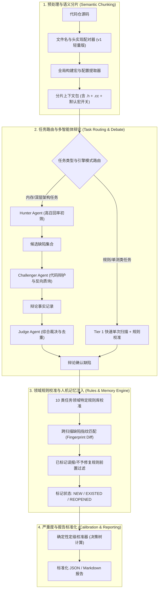
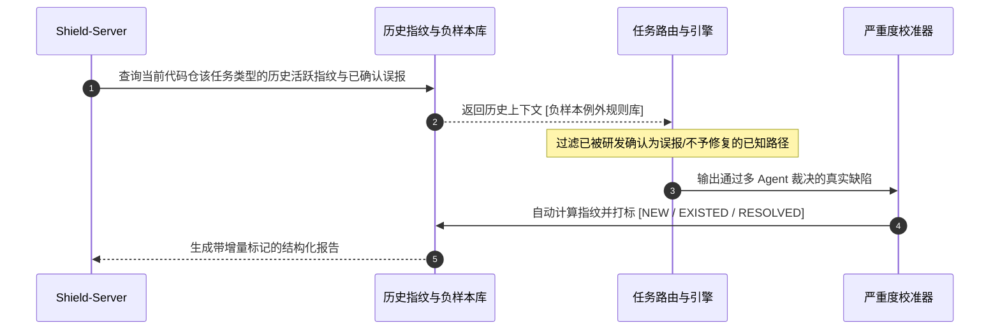
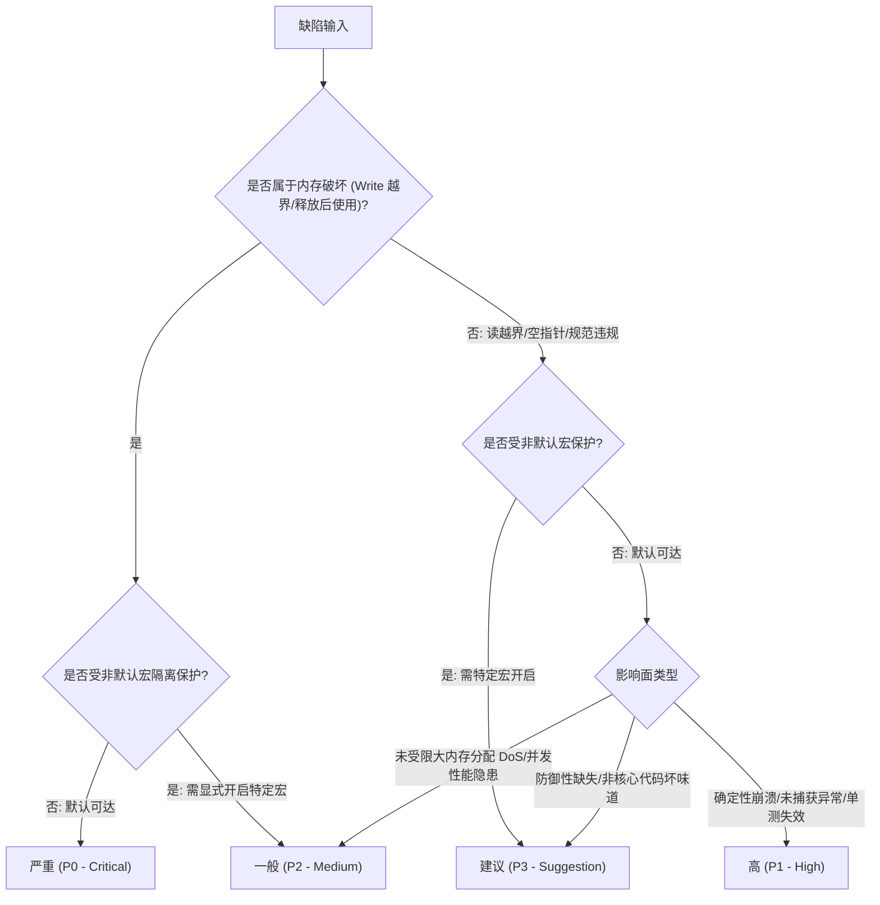

# Code-Shield 下一代 AI 分析引擎 (Next-Gen AI Engine) 架构设计

## 一、 设计目标与演进理念

针对现有 AI 扫描中存在的**分片上下文割裂、缺陷视野遗漏、定级标准主观、缺乏跨任务历史记忆**等核心痛点，下一代 AI 分析引擎确立了四大核心演进原则：

1. **从“孤立文本分片”演进为“语义感知分片”**：将同名头文件与实现文件、核心宏定义协同打包，消除跨文件分析盲区。
2. **从“单次单模型判定”演进为“多 Agent 交叉辩论”**：构建“猎手 (Hunter) - 辩护人 (Challenger) - 仲裁官 (Judge)”的三方制衡机制，兼顾高召回率与低误报率。
3. **从“无状态孤岛扫描”演进为“全任务增量追踪与人机记忆闭环”**：基于通用缺陷指纹比对历史存量/本次新增，并将研发人工标记的负样本知识自动注入下次分析。
4. **从“Prompt 主观定级”演进为“规则矩阵归一化校准”**：剥夺大模型对严重等级的自由裁量权，由规则决策树结合可达性与宏隔离条件进行确定性定级。

---

## 二、 下一代 AI Engine 整体架构蓝图



---

## 三、 核心子系统详细设计

### 3.1 语义感知分片器 (Semantic Chunking & Context Packager)

#### 3.1.1 现有缺陷
目前的 `scanAndChunk` 仅根据物理文件数量线性切割，导致 `src/posix.cc` 与 `include/fmt/posix.h` 被分配到不同分片，AI 无法在分析实现函数时看到类的完整定义与生命周期。

#### 3.1.2 语义切片分步演进方案
1. **阶段一落地 (v1 轻量版：无外部重量级依赖)**：
   * **同名头实现强制绑定 (Header-Source Collocation)**：扫描文件树时，自动将 `foo.cc`/`foo.cpp` 与 `foo.h`/`foo-inl.h` 组合打入同一分片。
   * **构建宏提取**：读取根目录 `CMakeLists.txt` 或全局配置文件，提取关键宏定义（如 `#define FMT_USE_GRISU 0`），作为 Prompt 前缀注入。
2. **阶段二演进 (v2 增强版：符号依赖分析)**：
   * 引入轻量符号提取器，提取跨文件调用的核心数据结构定义注入上下文。

---

### 3.2 任务自适应引擎路由 (Task-Adaptive Engine Routing)

并非所有 10 类任务都适合无差别运行 3 角色辩论流。根据任务性质实现三级自适应路由：

| 引擎执行模式 (`engine_mode`) | 适用任务类型 | 执行流说明 | 算力与成本特征 |
| :--- | :--- | :--- | :--- |
| **`chunked_fast` (快速规则流)** | `float-comparison`<br>`ut-effectiveness`<br>`thread-create` | 仅调用 Tier 1 快模型初筛，直接进入确定性规则校准，**跳过辩论**。 | 极低延迟，耗时 0 额外辩论 Token |
| **`debate_selective` (选择性辩论)** | `unordered-collection`<br>`cjson-scan`<br>`ut-quality` | Tier 1 初筛后，仅对属于 `CONDITIONAL` 或高争议的候选点触发辩论。 | 兼顾准确率与成本 |
| **`debate_full` (全量深度辩论)** | `coredump-risk`<br>`memory-leak`<br>`change-review`<br>`deep-review` | 针对所有候选点触发完整的 Hunter $\rightarrow$ Challenger $\rightarrow$ Judge 对抗。 | 极致深度，杜绝高危漏报与误报 |

---

### 3.3 领域规则与历史记忆闭环 (Domain Rules & Memory Loop)



---

### 3.4 确定性严重度校准矩阵 (Severity Calibration Matrix)

剥夺大模型对 Severity 的自由裁量权，由确定性多维特征决策树计算：



| 严重等级 | 判定基准与特征 | 典型代表案例 |
| :---: | :--- | :--- |
| **严重 (Critical / P0)** | 默认构建可达的栈/堆缓冲区**写越界**、释放后使用（UAF）等致命内存破坏 | Grisu2 浮点栈越界写 (`format-inl.h:652`) |
| **高 (High / P1)** | 默认可达的**空指针解引用**、词法解析器**读越界**、测试用例无有效断言 | `buffered_file::fileno` 空指针 (`posix.cc`)<br>`parse_arg_id` 堆越界读 (`format.h`) |
| **一般 (Medium / P2)** | 需开启非默认宏方可触发的缺陷、未受限内存分配 DoS、Flaky test 隐患 | 格式化宽度无上限分配 2GB (`format.h`)<br>浮点精度无上限分配 1GB (`format-inl.h`) |
| **建议 (Suggestion / P3)** | 公共 API 防御性缺失但需调用方违规使用、非致命架构异味 | `buffered_file::vprint` 空指针防御 (`posix.h`) |

---

## 四、 核心 Go 接口与数据模型定义

```go
package nextgen_engine

import (
	"code-shield/models"
	"context"
	"time"
)

// NextGenEngine 下一代 AI 分析引擎核心接口
type NextGenEngine interface {
	// SemanticChunk 将仓库源码进行文件配对与宏上下文打包
	SemanticChunk(repoPath string, cfg models.ChunkConfig) ([]SemanticBundle, error)
	
	// ExecuteAnalysis 根据 TaskType 路由执行自适应扫描或辩论流
	ExecuteAnalysis(ctx context.Context, bundle SemanticBundle, taskType *models.TaskType) ([]models.AnalysisFinding, error)
	
	// CalibrateSeverity 依据规则矩阵确定性校准严重级别
	CalibrateSeverity(category string, verdict string, codeSnippet string) string
}

// SemanticBundle 语义感知分片数据包
type SemanticBundle struct {
	Name            string            `json:"name"`             // 分片名称
	PrimaryFiles    []string          `json:"primary_files"`    // 核心实现文件 (.cc/.cpp/.go/.java)
	HeaderFiles     []string          `json:"header_files"`     // 配对头文件 (.h/.hpp)
	MacroContext    map[string]string `json:"macro_context"`    // 提取的构建宏定义 {"FMT_USE_GRISU": "0"}
	NegativeRules   []string          `json:"negative_rules"`   // 历史负样本与例外规则
}
```
