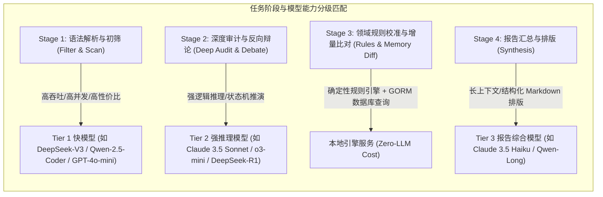
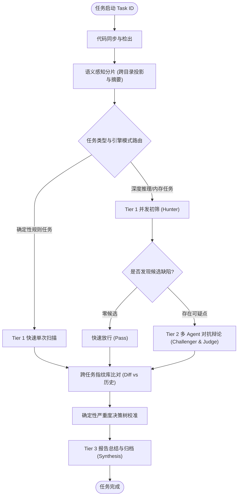

# Code-Shield 异构模型流水线与 DAG 调度器设计

## 一、 调度系统面临的挑战与设计目标

在现有 `code-shield` 调度体系中，`ModelDispatcher` 主要负责在单一物理后端（如 `claude` 或 `opencode`）上通过信号量控制并发槽位。当面对**多智能体协作、多任务类型自适应与跨扫描增量追踪**的新型分析范式时，现有调度机制面临以下瓶颈：

1. **同构调度导致算力浪费**：若所有分片均无差别调用顶级推理模型（如 Claude 3.5 Sonnet / o3-mini），大仓扫描的 Token 消耗和延迟将成倍激增；
2. **静态线性流程缺乏韧性**：目前采用简单的 `sync.WaitGroup` 收集所有分片，一旦某个复杂分片超时，难以做到局部隔离、定向重试与分支降级；
3. **缺乏跨扫描任务的历史记忆**：每次扫描完全处于无状态孤岛，无法自动识别存量已知缺陷与增量新缺陷，缺乏任务间的认知沉淀。

---

## 二、 异构模型多层级调度架构 (Tiered Heterogeneous Dispatcher)



### 2.1 模型分级与策略矩阵

| 分级 (Tier) | 适用阶段 | 核心诉求 | 推荐模型族 | 并发与成本策略 |
| :---: | :--- | :--- | :--- | :--- |
| **Tier 1 (快排初筛)** | 分片初筛、确定性规则扫描、关键字过滤 | 极低延迟、高并发吞吐、高召回率 | DeepSeek-V3, Qwen-2.5-Coder-32B, GPT-4o-mini | 分配高并发（10~20 并发），处理 80% 代码分片 |
| **Tier 2 (深度审计)** | 多 Agent 辩论 (Challenger/Judge)、复杂指针生命周期跟踪 | 极强代码逻辑推演、上下文推理 | Claude 3.5 Sonnet, o3-mini, DeepSeek-R1 | 分配中并发（3~6 并发），精准消耗在 20% 确认缺陷环节 |
| **Tier 3 (综合排版)** | 跨分片去重汇总、图表 Markdown 生成 | 极长上下文窗口、严谨 JSON/表格格式化 | Claude 3.5 Haiku, Qwen-Long, GLM-4-Air | 分配单任务 1 并发，专注于文档结构规整 |

### 2.2 `ai.tiers` 与既有 `ai.models` 的关系与兼容设计
* **`ai.tiers` 是逻辑能力路由层**：定义不同阶段（初筛、辩论、总结）需要调度哪种量级的模型。
* **`ai.models` 是物理实例池**：定义各个物理服务器节点的 IP 与最大承受并发。
* **向后兼容机制**：若系统未配置 `ai.tiers`，调度器自动降级使用 `ai.models` 或全局 `ai.backend`，平滑兼容既有部署环境。

### 2.3 异步阶段管道与背压流控机制 (Pipelined Queue & Backpressure)
为防范海量分片在 Tier 1 极速初筛产生过多候选点而压垮 Tier 2，调度器采用**异步管道与滑动窗口背压**设计：
1. **阶段解耦队列**：Tier 1 与 Tier 2 之间通过带缓冲 Channel（`DebateTicketQueue`）解耦，初筛与辩论异步流水线并发推进；
2. **动态背压流控 (Dynamic Backpressure)**：当 `DebateTicketQueue` 积压达到阈值（如 > 30 个待辩论点）时，自动挂起 Tier 1 新分片的投递，直至 Tier 2 消耗降至安全水位，彻底避免跨 Tier 内存堆积与资源死锁。

---

## 三、 动态有向无环图 (Dynamic DAG) 任务调度引擎



### 3.1 DAG 节点容错与重试机制
1. **分片级指数退避重试 (Per-Chunk Exponential Backoff)**：
   * 单个分片若由于 LLM 超时或网络抖动失败，仅重试该分片对应的 DAG 子节点，最大重试 3 次，不影响其它已成功分片。
2. **后端自动降级熔断 (Backend Circuit Breaker)**：
   * 若当前配置的物理 LLM 节点持续报错或物理宕机，DAG 引擎自动将后续节点调度降级至备用 Provider（如从 `claude` 降级为 `opencode`）。
3. **部分成功降级合成 (Partial Success Synthesis)**：
   * 若大仓中 95% 以上分片分析成功，仅极个别非核心目录超时，允许系统在报告中添加 `[Warning: 部分目录未完成扫描]` 标记，并继续推进总结阶段，避免任务全盘作废。

---

## 四、 跨任务缺陷指纹库与历史记忆系统 (Memory Graph)

### 4.1 统一缺陷指纹算法 (SSOT 标准定义与抗抖动设计)
为抵御“代码行号因增删注释/空行而漂移”以及“大模型提取代码片段长短不一导致的哈希断裂”，指纹算法确立为**两级抗抖动匹配标准**：

$$\text{DefectFingerprint} = \text{SHA256}(\text{RepoID} + \text{TaskTypeID} + \text{NormalizedPath} + \text{ScopeSymbol} + \text{NormalizedTriggerLine})$$

* **字段设计理由**：
  * **RepoID**：使用数据库数字仓 ID，避免代码仓改名导致历史指纹断裂；
  * **TaskTypeID**：隔离不同扫描任务的指纹命名空间；
  * **ScopeSymbol**：提取函数名/类名/测试方法名（如 `buffered_file::fileno`），抵御函数上方增删行引起的偏移；
  * **NormalizedTriggerLine**：**仅针对核心引发崩溃/违规的单一语句行（而非多行不确定长度的 CodeSnippet）**清理空白与注释后哈希，彻底解决 LLM 返回行数抖动问题。
* **双层容错匹配机制**：
  * **L1 强指纹精准匹配**：全量哈希完全命中（100% 确定为同一缺陷）；
  * **L2 作用域回退匹配 (Fallback)**：若代码发生微调使得 TriggerLine 哈希变化，但处于同一 `(RepoID, TaskTypeID, NormalizedPath, ScopeSymbol)` 且问题类别（Category）一致，自动归入同一缺陷演进链，防止误判为全新引入。

---

## 五、 Go 核心调度器实现架构设计

```go
package nextgen_scheduler

import (
	"context"
	"time"
)

// ModelTier 模型能力分级枚举
type ModelTier int

const (
	Tier1FastFilter ModelTier = iota // 快速初筛 (Tier 1)
	Tier2DeepReason                  // 深度推理辩论 (Tier 2)
	Tier3Synthesis                   // 报告综合排版 (Tier 3)
)

// ResourceSlot 代表一个被分配的物理模型槽位
type ResourceSlot struct {
	Backend   string
	ModelName string
	ServerURL string
	Tier      ModelTier
}

// NextGenDispatcher 下一代跨模型智能调度器
type NextGenDispatcher interface {
	// AcquireTierSlot 按所需能力阶梯申请槽位
	AcquireTierSlot(ctx context.Context, tier ModelTier) (*ResourceSlot, error)
	
	// ReleaseSlot 归还槽位
	ReleaseSlot(slot *ResourceSlot)
	
	// ExecuteDAG 执行一个编排好的 DAG 任务图
	ExecuteDAG(ctx context.Context, graph *DAGGraph) error
	
	// QueryDefectMemory 查询历史指纹记忆与负样本规则
	QueryDefectMemory(repoID int64, taskTypeID int64, fingerprint string) (*HistoricalDefectRecord, bool)
	
	// SaveDefectMemory 存储并更新缺陷指纹生命周期状态
	SaveDefectMemory(repoID int64, taskTypeID int64, record *HistoricalDefectRecord) error
}
```
