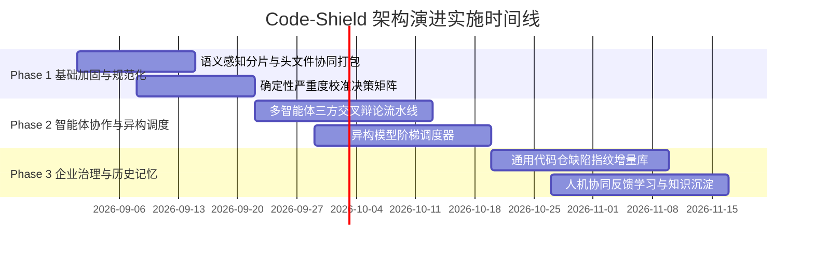

# Code-Shield 架构演进与工程落地路线图

## 一、 演进目标与实施原则

为了确保 Code-Shield 从现有单向线性扫描平滑过渡到下一代智能体协作引擎，本路线图遵循 **“小步快跑、向前兼容、价值导向、实证驱动”** 的工程实施原则。

---

## 二、 三阶段详细落地规划

### 阶段一：基础加固与规范化 (Phase 1: Foundation & Standardization)

*   **核心目标**：在不大幅重构底层调用的前提下，迅速消除分片上下文割裂，统一缺陷严重等级标准。
*   **具体实施项**：
    1.  **重构分片器 (`services/engine_chunked.go`)**：
        *   改造 `scanAndChunk` 函数，实现头文件与实现文件（`.h` + `.cc` / `.cpp`）强制绑定归入同一 chunk。
        *   提取关键构建宏定义（如 `CMakeLists.txt` 中的编译定义），注入分片 Prompt 前缀中。
    2.  **落地定级校准中间件 (`services/calibrator.go`)**：
        *   在 `executeSynthesis` 之前拦截所有 `AnalysisFinding`，依据 CWE 类型、宏开关条件与内存破坏属性重新计算 `severity`。
        *   彻底纠正“堆越界读被标为一般，格式串空指针被标为严重”的定级倒挂现象。
*   **交付产物**：
    *   `services/semantic_chunker.go`
    *   `services/calibrator.go`
    *   相关单元测试与回归测试用例。

---

### 阶段二：智能体协作与异构调度 (Phase 2: Multi-Agent & Heterogeneous Dispatching)

> 💡 **专项深入设计**：关于智能体交互协议、对抗提示词工程（Prompt Engineering）全集及 Go 代码级实现，请参阅 [05-CodeShield-智能体协作与异构调度深度设计.md](05-CodeShield-智能体协作与异构调度深度设计.md)。

*   **核心目标**：解决单模型视野局限与漏报问题，通过快慢模型阶梯调度大幅降低运行成本并提升检出深度。
*   **具体实施项**：
    1.  **实现三角色辩论流水线 (`services/engine_debate.go`)**：
        *   新增 `Hunter Agent`：高召回率初筛；
        *   新增 `Challenger Agent`：负责在源码中反向寻找防御逻辑与边界保护；
        *   新增 `Judge Agent`：权衡质询证据，过滤幻觉并输出高置信度结论。
    2.  **升级模型调度器 (`services/dispatcher.go`)**：
        *   在 `config.yaml` 中支持按阶梯（`tier_fast`, `tier_reasoning`, `tier_synthesis`）配置不同的后端模型。
        *   初筛阶段优先调用高吞吐快模型，辩论阶段调度高算力强推理模型。
*   **交付产物**：
    *   `services/engine_debate.go`
    *   升级版 `services/dispatcher.go`
    *   辩论记录结构体与持久化支持。

---

### 阶段三：多任务企业级治理与历史记忆闭环 (Phase 3: Multi-Task Governance & Continuous Memory)

> 💡 **专项深入设计**：关于通用缺陷指纹算法、增量 Diff 状态机、人机反馈记忆闭环及 10 类任务领域规则矩阵，请参阅 [06-CodeShield-多任务企业治理与历史记忆闭环深度设计.md](06-CodeShield-多任务企业治理与历史记忆闭环深度设计.md)。

*   **核心目标**：覆盖全量 10 类任务类型（架构治理、单测质量、逻辑隐患、内存安全等），构建跨任务的增量追踪、存量治理与人机反馈知识沉淀闭环。
*   **具体实施项**：
    1.  **通用代码仓缺陷指纹库 (`models/defect_fingerprint.go`)**：
        *   基于多语言 AST 规范化与上下文 Token 哈希生成稳定指纹，不依赖物理编译。
        *   在全量 10 类任务的历次扫描报告间自动计算增量差异（Diff），精准识别“本次新增”、“历史存量”与“已修复”。
    2.  **人机协同认知沉淀与负样本库 (`services/feedback_memory.go`)**：
        *   收集研发人员在 Web 界面上的操作（标记误报、填写忽略理由、指派负责人）。
        *   自动沉淀为代码仓专有的“例外规则库与负样本知识”，在下次 Hunter/Challenger 分析中自动注入作为前置过滤。
    3.  **多任务特定领域规则引擎 (`services/rules/`)**：
        *   针对非崩溃类任务（如 `thread-create` 平台调度组规范、`unordered-collection` 保序集合映射表、`ut-effectiveness` 断言有效性规则）沉淀确定性规则库，辅助多 Agent 精准决策。
*   **交付产物**：
    *   `models/defect_fingerprint.go`
    *   `services/feedback_memory.go`
    *   前端跨版本增量比对 Diff 视图与反馈沉淀看板。

---

## 三、 演进指标评估体系 (KPI & Metrics)

> 💡 **评估与验证说明**：以下指标为下一代架构的演进设计目标（Design Targets）。在阶段二和阶段三落地过程中，将基于真实标准基准集（Juliet C/C++ Test Suite、fmt/cJSON 历史缺陷集）进行严格的阶段对照基准测试（A/B Benchmark）。

| 指标名称 | 现状基线 (Baseline) | 演进目标 (Target) | 统计与验证方法 |
| :--- | :---: | :---: | :--- |
| **真实缺陷召回率 (Recall)** | ~65% (单模型易遗漏深层状态机) | **$\ge$ 90%** | 在标准已知漏洞基准集（如 Juliet / fmt 历史已知缺陷）上对比回归测试 |
| **假阳性误报率 (False Positive)** | ~20% (缺乏对抗反思与规则过滤) | **$\le$ 5%** | 经 Challenger 质询与历史负样本规则库双重过滤后的误报统计 |
| **严重等级一致性 (Severity Accuracy)** | 经常出现定级主观漂移 | **100% 规则确定性** | 通过统一规则决策树计算，消除模型主观评分差异 |
| **单仓分析 Token 综合成本** | 100% 全量高成本模型消耗 | **降低 40% ~ 55%** | Tier 1 快模型分流 80% 代码分片，Tier 2 强模型仅聚焦 20% 争议点 |
| **结论证据链透明度 (Auditability)** | 0% (仅有单方结论) | **100% 具备三方辩论裁决依据** | 报告中完整包含猎手攻击假设、辩护人抗辩证据与法官最终裁决词 |

---

## 四、 总结与结语

通过实施本路线图，Code-Shield 将实现从**单纯的“文本静态查重/代码扫描工具”**向**具备“主动辩论、自主验证、长期记忆的智能代码安全防护平台”**的跃升，为研发团队提供极高置信度、零冗余、深溯源的代码安全防护屏障。
