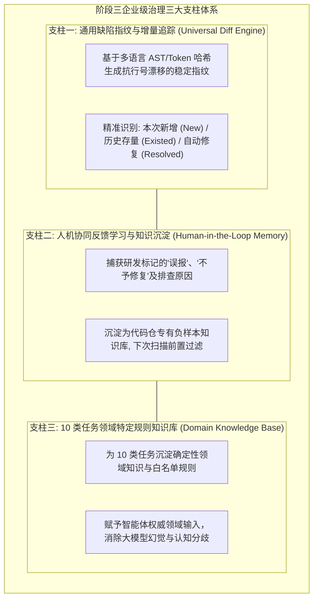
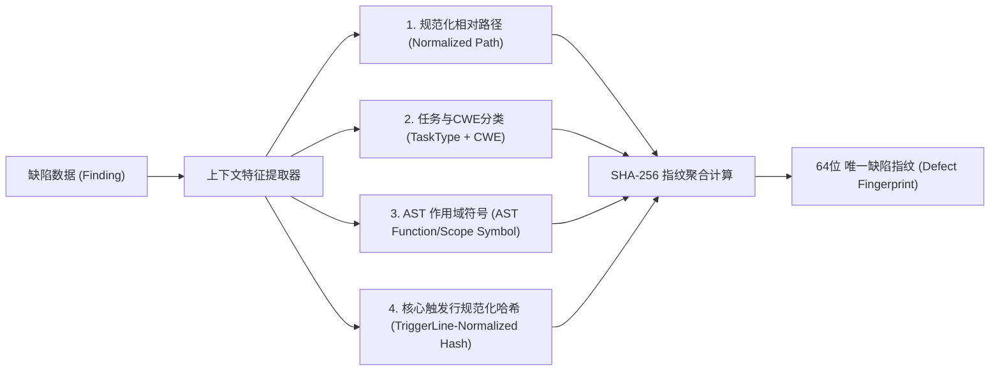
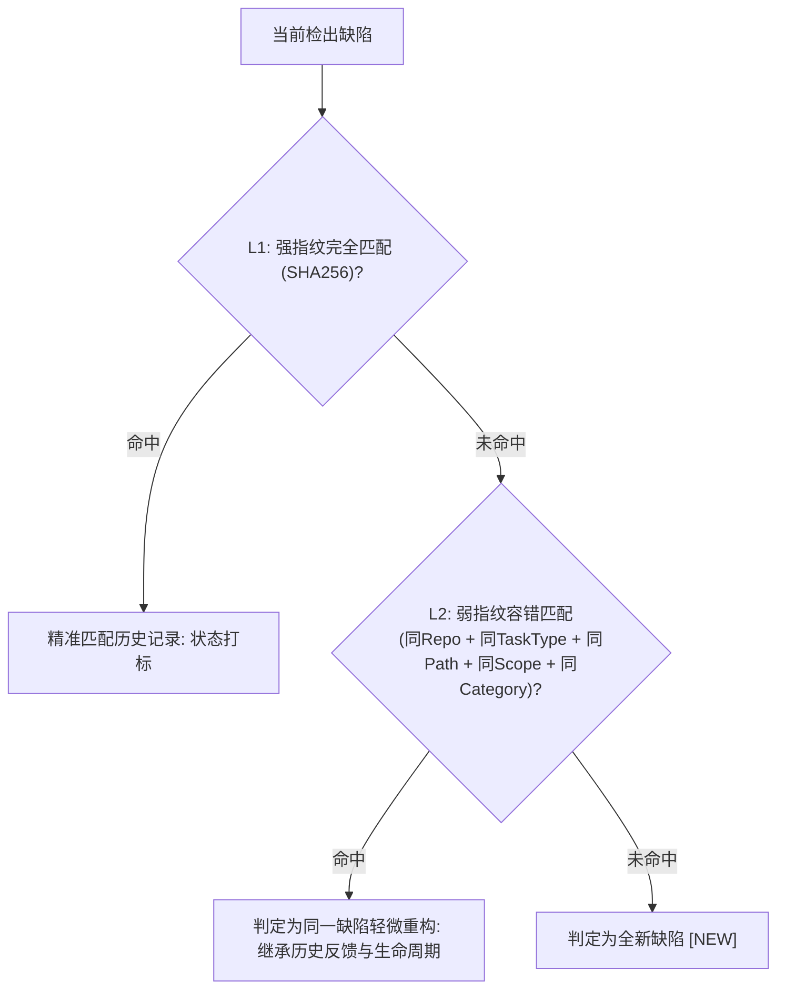
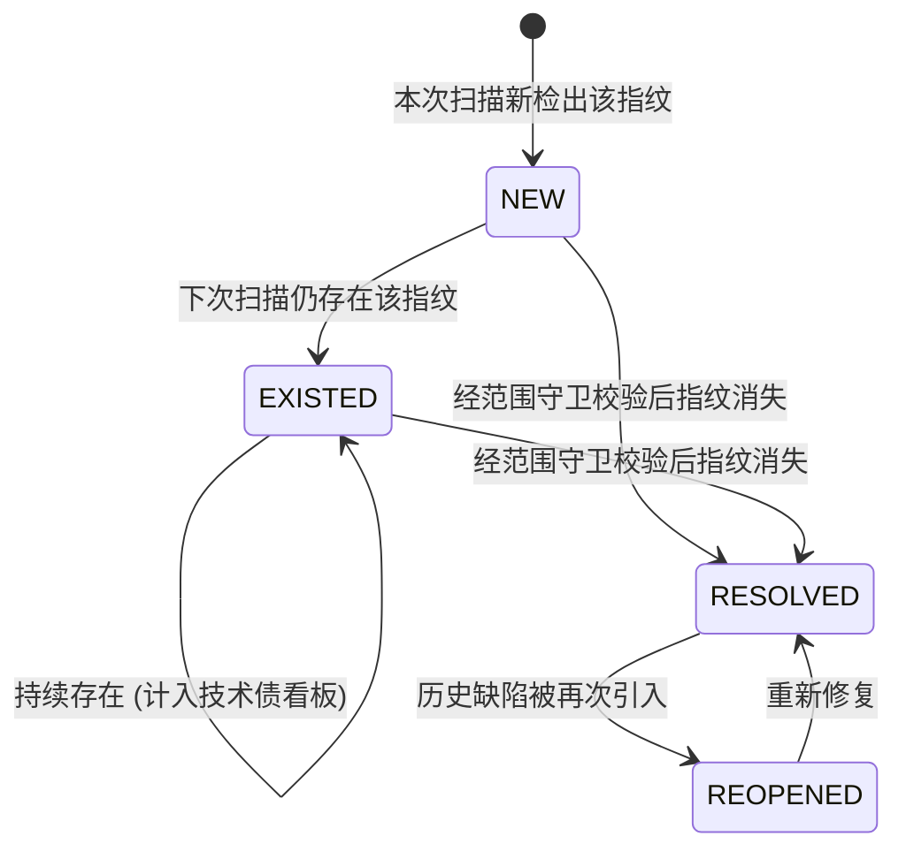
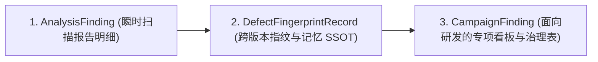
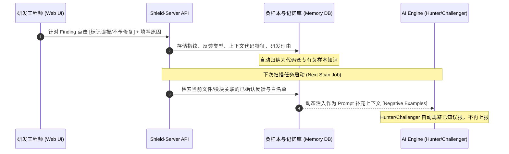
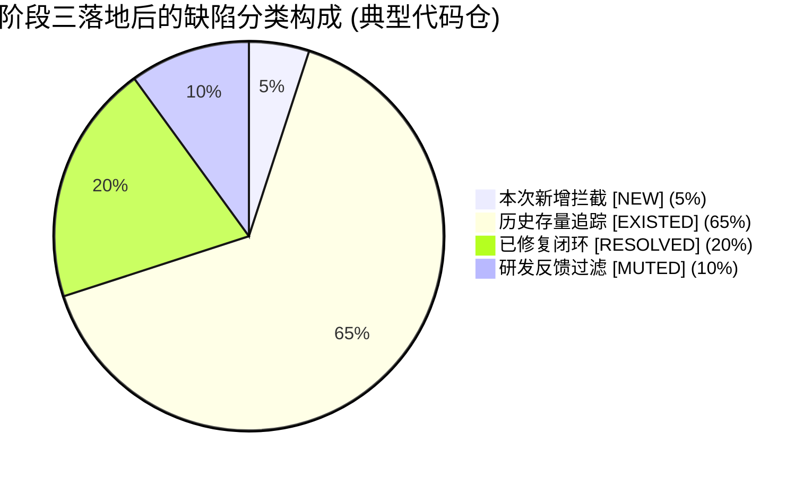

# Code-Shield 阶段三：多任务企业治理与历史记忆闭环深度设计

## 一、 阶段三定位与设计理念重构

在阶段一（语义分片与定级校准）和阶段二（智能体协作与异构调度）解决了“单次扫描的深度与准确性”之后，**阶段三（多任务企业治理与历史记忆闭环）**旨在解决平台在**企业级持续集成、跨扫描版本追踪与人机协同运营**中的核心矛盾。

### 1.1 摒弃狭隘“沙箱编译”的工程必然性
在早期的单案例分析中，曾设想过针对 C/C++ 内存缺陷生成 PoC 并进行容器沙箱编译（ASan）。但经对 Code-Shield 全量 **10 类任务**（涵盖架构规范治理、逻辑确定性、测试质量、增量变更、多语言内存安全等）全面透视后发现：
1. **绝大多数任务与“崩溃”无关**：如 `thread-create`（平台调度组规范）、`unordered-collection`（集合导出无序）、`ut-effectiveness`（断言有效性）属于**架构合规与逻辑质量**，动态运行根本不会崩溃；
2. **企业级依赖不可模拟**：生产级代码仓包含庞大的私有库、复杂构建工具链（Bazel/Maven/Gradle）及环境依赖，静态扫描平台强行要求轻量沙箱成功编译在 90% 以上的企业工程中会因缺少依赖而失败。

### 1.2 阶段三新三支柱体系
阶段三由“狭隘的沙箱编译”彻底升级为面向全任务的**通用企业级治理与记忆闭环体系**：



---

## 二、 通用多语言缺陷指纹算法 (Universal Defect Fingerprint)

### 2.1 痛点：代码修改引发的“行号漂移”
在传统的静态扫描中，若研发人员在文件头部添加了 5 行注释，所有后续代码的行号均发生偏移。若单纯以 `file_path + line_number` 作为主键，会导致所有历史存量缺陷被误判为“全新引入”，造成严重的误报冲击。

### 2.2 抗漂移指纹生成算法设计



#### 2.2.1 规范化计算公式 (SSOT 唯一标准)
$$\text{DefectFingerprint} = \text{SHA256}(\text{RepoID} + \text{TaskTypeID} + \text{NormalizedPath} + \text{ScopeSymbol} + \text{NormalizedTriggerLine})$$

*   **RepoID（仓库数字主键）**：保证代码仓在改名或转移组织后，历史指纹依然保持稳定不裂化。
*   **TaskTypeID（任务类型标识）**：隔离不同扫描任务的指纹空间（如 `coredump-risk` 关注崩溃行，`ut-quality` 关注测试用例），避免跨任务干扰。
*   **ScopeSymbol（作用域符号）**：提取缺陷所在函数名、类名或方法签名（如 `buffered_file::fileno`），抵御函数外部增删空行/注释造成的行号漂移。
*   **NormalizedTriggerLine（核心触发行规范化）**：**仅提取引发风险的关键单一语句行**（而非多行不确定长度的 CodeSnippet），去除所有空白符、制表符、单双引号及代码注释，彻底解决大模型提取代码片段行数抖动导致的哈希断裂问题。

### 2.3 边界案例与双层容错匹配机制



| 场景 / 边界案例 | 指纹系统预期行为与设计意图 | 说明与处理策略 |
| :--- | :--- | :--- |
| **代码片段提取行数抖动** | L1 强指纹稳定命中 | 基于单一 `NormalizedTriggerLine`，不受前后附带上下文行数变化影响。 |
| **函数内增删空行/注释** | L1 强指纹稳定命中 | 行号虽变，但作用域 `ScopeSymbol` 与触发行 Token 不变。 |
| **函数内部语句微调** | L2 作用域弱指纹命中 | 触发行发生微调时通过作用域与分类继承历史反馈，防止误判为全新引入。 |
| **函数重命名 (Rename Refactoring)** | 指纹断裂（旧指纹标记为 `RESOLVED`，新指纹标记为 `NEW`） | **符合预期**。重构通常伴随调用方契约变更，作为新发现重新进入审计流。 |
| **多语言作用域提取** | Go: `func (s *S) Method`<br>Java: `@Test MethodName`<br>Py: `def func_name`<br>C++: `Namespace::Class::Method` | 调度器根据文件后缀分发给对应的轻量正则表达式或 AST 提取器。 |

---

## 三、 跨扫描任务增量比对与状态机 (Incremental Diff Engine)

### 3.1 缺陷生命周期状态机



### 3.2 增量比对结果四元分类与扫描范围守卫 (Scan Scope Guard)

> ⚠️ **关键防护规则（杜绝假修复误判）**：
> 只有当历史缺陷所在的**文件属于本次成功扫描的有效覆盖文件集（`ScannedFiles`）**时，且本次扫描未再检出该指纹，才允许将其标记为 `RESOLVED`。
> 若本次扫描为局部定向扫描（如仅扫描业务目录 `target_scope="business"` 忽略了测试目录）或个别分片分析失败，未被覆盖文件的存量缺陷**严格保持原状态，绝不误判为已修复**。

| 缺陷状态标记 | 判定逻辑 | 业务处理策略 (Business Actions) |
| :---: | :--- | :--- |
| **`NEW` (本次新增)** | 当前报告包含，上一版本基线报告中不存在。 | **PR 门禁阻断 (Gate Blocker)**：通知提交人必须修复或说明。 |
| **`EXISTED` (历史存量)** | 当前报告与基线报告均包含该指纹。 | **技术债治理 (Technical Debt)**：不阻断主干，归入存量治理计划。 |
| **`RESOLVED` (本次已修复)** | 基线报告包含，且所在文件被成功扫描，但当前报告中该指纹已消失。 | **自动闭环 (Auto-Closed)**：更新治理进度，向修复人发送致谢/统计。 |
| **`REOPENED` (复发激活)** | 历史已被关闭的指纹再次被扫描检出。 | **高危回退预警 (Regression Alert)**：警示可能存在功能回退。 |

### 3.3 与既有 `AnalysisFinding` / `CampaignFinding` 的数据流向与协同关系



1. **`AnalysisFinding` (报告明细层)**：记录单次任务扫描的瞬时 Finding，只读保存历史快照；
2. **`DefectFingerprintRecord` (记忆中心层 / SSOT)**：唯一真值中心，维护全局唯一的 `(repo_id, task_type_id, fingerprint)` 状态，负责跨任务增量计算与人机反馈沉淀；
3. **`CampaignFinding` (看板呈现层)**：大盘与专项攻关视图，其状态（`open`/`resolved`/`invalid`）由记忆中心层驱动双向同步，避免状态双写冲突。

---

## 四、 人机协同反馈学习与知识记忆库 (Human Feedback Memory)

### 4.1 反馈捕获与沉淀闭环



### 4.2 记忆规则的作用域隔离
为防止某个文件的误报规则错误影响全局，记忆库建立**三级作用域层级**：
1. **文件精准级 (File-Specific)**：仅对该代码文件及对应符号生效（默认策略）；
2. **仓库规则级 (Repo-Wide)**：研发显式指定为“本仓库架构约定”（如：本仓库所有 map 导出均通过特定网关统一排序）；
3. **全局任务级 (Global-Task)**：系统管理员全局配置的平台级白名单。

---

## 五、 10 大任务领域特定规则知识库 (Task-Specific Domain Rules)

针对 Code-Shield 当前内置的 10 类任务，建立结构化、确定性的领域知识库，作为多 Agent 辩论的基准法典：

| # | 任务类型 (`TaskType`) | 任务定位与属性 | 核心领域规则库与判定基准 (Domain Rules Matrix) |
| :---: | :--- | :--- | :--- |
| **1** | **`thread-create`** | 架构规范治理 | - **平台能力白名单**：强制检查是否使用平台 `Dispatch Group`（调度组）与 `Timer`（定时器）。<br>- **裸线程拦截**：凡直接调用 `std::thread`、`pthread_create`、`QThread` 均判定为违规并引导重构。 |
| **2** | **`unordered-collection`** | 业务确定性隐患 | - **多语言无序类型表**：Go `map`、Java `HashSet/HashMap`、Python `set`、C++ `std::unordered_map`。<br>- **敏感场景识别**：签名计算、数据哈希、分页导出、RPC 序列化场景严禁使用无序集合。 |
| **3** | **`float-comparison`** | 数值精度隐患 | - **禁止操作符**：浮点变量直接 `==`、`!=`、`<=`、`>=`。<br>- **推荐模式**：强制使用 `fabs(a - b) < EPSILON` 容差比较。 |
| **4** | **`ut-effectiveness`** | 单测有效性审计 | - **测试函数签名特征库**：Go `TestXxx`、Java `@Test`、Python `test_*`、GTest `TEST`。<br>- **无效断言特征**：空断言、永真断言（`assert 1==1`）、未捕获异常用例、死循环测试。 |
| **5** | **`ut-quality`** | 单测工程质量 | - **Flaky 特征**：包含 `time.Sleep`、依赖硬编码 IP/绝对路径、依赖系统时间/时区。<br>- **坏味道**：修改全局变量未在 `TearDown` 还原、Mock 自身主类。 |
| **6** | **`cjson-scan`** | 专有 API 内存安全 | - **API 契约映射**：`cJSON_Parse` / `cJSON_Create*` 必须在全部分支严格配对 `cJSON_Delete`。<br>- **父子所有权转移**：加入 `cJSON_AddItemToObject` 后由父节点托管，严禁双重释放。 |
| **7** | **`memory-leak`** | 资源与内存泄漏 | - **配对检查表**：`malloc`/`free`、`new[]`/`delete[]`、`fopen`/`fclose`、`socket`/`close`、`opendir`/`closedir`。 |
| **8** | **`coredump-risk`** | 内存崩溃与段错误 | - **核心风险模式**：空指针解引用（尤其 Move 后及默认构造）、栈缓冲未扩容直接写入、词法扫描 `*++it` 越界。 |
| **9** | **`change-review`** | PR 增量回归守门 | - **差异过滤规则**：严格限定仅检出 Git Diff 涉及代码行；<br>- **回归检查**：新增分支异常处理、公共接口参数兼容性、锁竞态引入。 |
| **10** | **`deep-review`** | 全量深层架构审计 | - **架构反模式**：跨模块循环依赖、长耗时临界区锁竞争、极端异常路径资源悬挂。 |

---

## 六、 Go 代码级数据模型与服务实现

### 6.1 缺陷指纹与历史记忆模型 (`models/defect_memory.go`)

```go
package models

import (
	"time"
	"gorm.io/gorm"
)

// DefectFingerprintRecord 缺陷指纹持久化记录表
type DefectFingerprintRecord struct {
	ID          uint           `gorm:"primaryKey;autoIncrement" json:"id"`
	RepoID      uint           `gorm:"index:idx_repo_fp,unique;not null" json:"repo_id"`
	Fingerprint string         `gorm:"size:64;index:idx_repo_fp,unique;not null" json:"fingerprint"` // SHA-256 哈希
	TaskTypeID  uint           `gorm:"index;not null" json:"task_type_id"`
	FilePath    string         `gorm:"size:512;not null" json:"file_path"`
	ScopeSymbol string         `gorm:"size:256" json:"scope_symbol"` // 函数/类/作用域签名
	FirstSeenAt time.Time      `json:"first_seen_at"`                 // 首次检出时间
	LastSeenAt  time.Time      `json:"last_seen_at"`                  // 最近一次检出时间
	FirstTaskID uint           `json:"first_task_id"`                 // 引入该缺陷的任务ID
	LastTaskID  uint           `json:"last_task_id"`                  // 最近检出该缺陷的任务ID
	Status      string         `gorm:"size:32;default:'ACTIVE'" json:"status"` // ACTIVE (存量), RESOLVED (已修复)
	
	// 人工反馈状态
	FeedbackStatus string      `gorm:"size:32;default:'UNREVIEWED'" json:"feedback_status"` // UNREVIEWED, FALSE_POSITIVE, WONT_FIX, CONFIRMED
	FeedbackReason string      `gorm:"type:text" json:"feedback_reason"`
	FeedbackUserID *uint       `json:"feedback_user_id"`
	FeedbackAt     *time.Time  `json:"feedback_at"`
	
	CreatedAt   time.Time      `json:"created_at"`
	UpdatedAt   time.Time      `json:"updated_at"`
	DeletedAt   gorm.DeletedAt `gorm:"index" json:"-"`
}

// DiffClassification 增量比对状态枚举
type DiffClassification string

const (
	DiffNew      DiffClassification = "NEW"      // 本次新增
	DiffExisted  DiffClassification = "EXISTED"  // 历史存量
	DiffResolved DiffClassification = "RESOLVED" // 已修复
	DiffReopened DiffClassification = "REOPENED" // 复发
)

// EnrichedFinding 带增量标记与历史记忆的最终分析结果
type EnrichedFinding struct {
	AnalysisFinding
	Fingerprint    string             `json:"fingerprint"`
	DiffStatus     DiffClassification `json:"diff_status"`
	FirstSeenAt    time.Time          `json:"first_seen_at"`
	FeedbackStatus string             `json:"feedback_status"`
}
```

### 6.2 增量比对引擎与记忆注入服务 (`services/diff_engine.go`)

```go
package services

import (
	"code-shield/models"
	"crypto/sha256"
	"encoding/hex"
	"fmt"
	"path/filepath"
	"regexp"
	"strings"
	"time"
)

// CalculateDefectFingerprint 计算抗代码行数抖动的通用缺陷强指纹
func CalculateDefectFingerprint(repoID uint, taskTypeID uint, filePath string, triggerLine string, scope string) string {
	// 1. 规范化文件路径 (小写 + 正斜杠)
	normPath := strings.ToLower(filepath.ToSlash(filePath))
	
	// 2. 清理核心触发行中的空白字符与注释 (Token Normalization)
	reComments := regexp.MustCompile(`(//.*?$|/\*.*?\*/)`)
	cleanLine := reComments.ReplaceAllString(triggerLine, "")
	reWhitespace := regexp.MustCompile(`\s+`)
	normTrigger := reWhitespace.ReplaceAllString(cleanLine, "")

	// 3. 组合特征计算 SHA-256
	rawKey := fmt.Sprintf("repo:%d|task:%d|path:%s|scope:%s|trigger:%s", 
		repoID, taskTypeID, normPath, scope, normTrigger)
	
	hash := sha256.Sum256([]byte(rawKey))
	return hex.EncodeToString(hash[:])
}

// DiffAndEnrichFindings 执行跨任务增量比对（带扫描覆盖范围守卫，杜绝误判修复）
func DiffAndEnrichFindings(repoID uint, taskID uint, taskTypeID uint, scannedFiles []string, findings []models.AnalysisFinding) ([]models.EnrichedFinding, error) {
	now := time.Now()
	var enrichedList []models.EnrichedFinding

	// 构建本次有效成功扫描的文件集合（用于范围守卫）
	scannedFileSet := make(map[string]bool, len(scannedFiles))
	for _, f := range scannedFiles {
		scannedFileSet[strings.ToLower(filepath.ToSlash(f))] = true
	}

	// 1. 查询当前仓库在历史任务中的全部活跃指纹记录
	var existingRecords []models.DefectFingerprintRecord
	models.DB.Where("repo_id = ? AND task_type_id = ?", repoID, taskTypeID).Find(&existingRecords)
	
	recordMap := make(map[string]*models.DefectFingerprintRecord, len(existingRecords))
	for i := range existingRecords {
		recordMap[existingRecords[i].Fingerprint] = &existingRecords[i]
	}

	seenInThisScan := make(map[string]bool)

	// 2. 遍历本次检出的 Findings 进行增量打标
	for _, f := range findings {
		fp := CalculateDefectFingerprint(repoID, taskTypeID, f.FilePath, f.CodeSnippet, f.Title)
		seenInThisScan[fp] = true

		enriched := models.EnrichedFinding{
			AnalysisFinding: f,
			Fingerprint:     fp,
		}

		if record, exists := recordMap[fp]; exists {
			// 命中历史记录
			enriched.FirstSeenAt = record.FirstSeenAt
			enriched.FeedbackStatus = record.FeedbackStatus
			
			if record.Status == "RESOLVED" {
				enriched.DiffStatus = models.DiffReopened // 复发
			} else {
				enriched.DiffStatus = models.DiffExisted  // 存量
			}

			// 更新最近一次检出信息
			models.DB.Model(record).Updates(map[string]interface{}{
				"last_seen_at": now,
				"last_task_id": taskID,
				"status":       "ACTIVE",
			})
		} else {
			// 本次全新发现
			enriched.DiffStatus = models.DiffNew
			enriched.FirstSeenAt = now
			enriched.FeedbackStatus = "UNREVIEWED"

			// 写入新指纹记录
			newRecord := models.DefectFingerprintRecord{
				RepoID:         repoID,
				Fingerprint:    fp,
				TaskTypeID:     taskTypeID,
				FilePath:       f.FilePath,
				FirstSeenAt:    now,
				LastSeenAt:     now,
				FirstTaskID:    taskID,
				LastTaskID:     taskID,
				Status:         "ACTIVE",
				FeedbackStatus: "UNREVIEWED",
			}
			models.DB.Create(&newRecord)
		}

		enrichedList = append(enrichedList, enriched)
	}

	// 3. 识别已修复缺陷 (【范围守卫】: 仅当该文件被本次成功扫描过且未检出时，才标记为已修复)
	for fp, record := range recordMap {
		normRecordPath := strings.ToLower(filepath.ToSlash(record.FilePath))
		if !seenInThisScan[fp] && record.Status == "ACTIVE" && scannedFileSet[normRecordPath] {
			models.DB.Model(record).Updates(map[string]interface{}{
				"status": "RESOLVED",
			})
		}
	}

	return enrichedList, nil
}
```

---

## 七、 实施落地成效与业务价值



1. **精准门禁阻断，告别狼来了**：通过 `DiffStatus` 区分，CI/CD 仅对 `[NEW]` 增量缺陷实行 PR 阻断，不再因上百条历史存量代码阻塞正常版本发布。
2. **人机信任建立**：研发人员点击一次“误报”并说明原因后，系统永久记住该负样本特征，彻底杜绝“次次扫描次次报同样误报”的恶劣体验。
3. **技术债务全景可视化**：管理者可随时调阅任意代码仓从 `Report-1` 到 `Report-N` 的缺陷生命周期流转图，清晰量化团队的技术债务清理进度。
