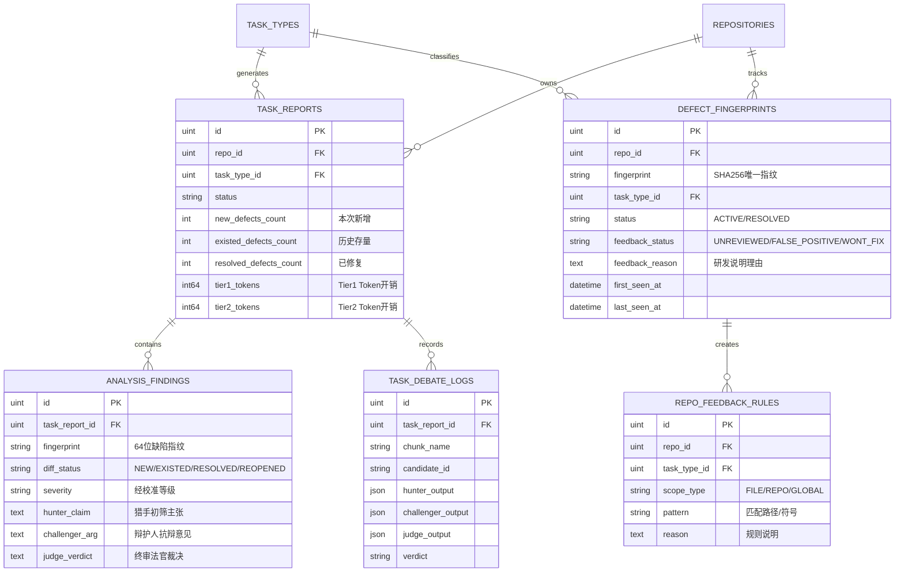
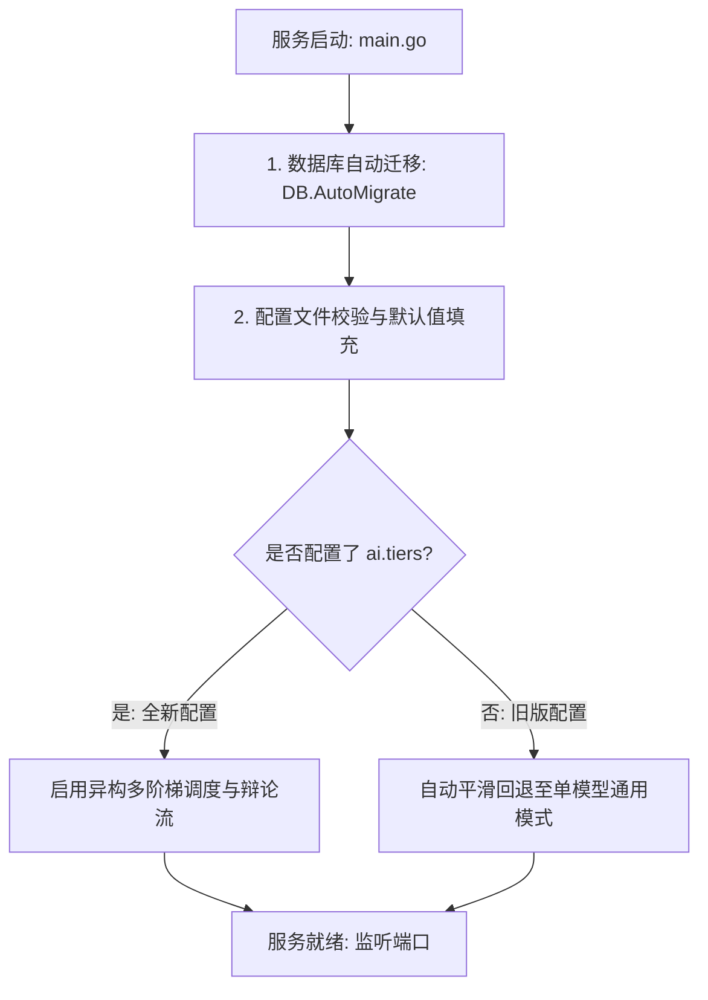

# Code-Shield 数据模型与系统配置变更设计

## 一、 变更背景与设计原则

为了支撑**阶段一（语义分片与定级校准）**、**阶段二（多 Agent 辩论与异构调度）**与**阶段三（多任务企业治理与历史记忆闭环）**的全面落地，系统在底层数据模型（PostgreSQL / GORM）与全局配置系统（`config.yaml` / `models/config.go`）上需要进行配套升级。

### 1.1 设计原则
1. **平滑演进与向前兼容 (Backward Compatibility)**：
   * 所有新增配置项均具备开箱即用的安全默认值（Default Value）。
   * 即使管理员未配置新的阶梯模型或辩论开关，系统自动降级回退到单模型线性模式，**绝不造成既有线上环境崩溃或配置解析失败**。
2. **轻量索引与高频查询优化 (Optimized Indexing)**：
   * 针对跨扫描任务的指纹查询、增量比对与负样本检索建立复合索引，确保百万级 Finding 数据下查询延迟在毫秒级。
3. **审计追溯完备性 (Full Auditability)**：
   * 完整记录智能体辩论轨迹（Hunter 指控、Challenger 抗辩、Judge 裁决书）与研发反馈日志，做到每一条缺陷的定性定级均有据可查。

---

## 二、 数据库实体模型 (Data Models) 变更设计



---

### 2.1 新增数据表定义

#### 1. 缺陷指纹与历史记忆表 (`defect_fingerprints`)
用于跨版本生命周期追踪与存量/增量治理：

```sql
CREATE TABLE defect_fingerprints (
    id BIGSERIAL PRIMARY KEY,
    repo_id BIGINT NOT NULL,
    fingerprint VARCHAR(64) NOT NULL,
    task_type_id BIGINT NOT NULL,
    file_path VARCHAR(512) NOT NULL,
    scope_symbol VARCHAR(256),
    status VARCHAR(32) DEFAULT 'ACTIVE',          -- 'ACTIVE' (存量活跃), 'RESOLVED' (已修复)
    feedback_status VARCHAR(32) DEFAULT 'UNREVIEWED', -- 'UNREVIEWED', 'FALSE_POSITIVE' (误报), 'WONT_FIX' (不予修复), 'CONFIRMED' (已确认)
    feedback_reason TEXT,
    feedback_user_id BIGINT,
    feedback_at TIMESTAMP WITH TIME ZONE,
    first_task_id BIGINT NOT NULL,
    last_task_id BIGINT NOT NULL,
    first_seen_at TIMESTAMP WITH TIME ZONE NOT NULL,
    last_seen_at TIMESTAMP WITH TIME ZONE NOT NULL,
    created_at TIMESTAMP WITH TIME ZONE DEFAULT CURRENT_TIMESTAMP,
    updated_at TIMESTAMP WITH TIME ZONE DEFAULT CURRENT_TIMESTAMP,
    deleted_at TIMESTAMP WITH TIME ZONE
);

CREATE UNIQUE INDEX idx_fp_repo_fingerprint ON defect_fingerprints (repo_id, task_type_id, fingerprint) WHERE deleted_at IS NULL;
CREATE INDEX idx_fp_status ON defect_fingerprints (repo_id, status);
```

#### 2. 智能体辩论轨迹表 (`task_debate_logs`)
用于审计与调优多 Agent 对抗事实链（支持 TTL 生命周期管理与自动清理）：

```sql
CREATE TABLE task_debate_logs (
    id BIGSERIAL PRIMARY KEY,
    task_report_id BIGINT NOT NULL,
    chunk_name VARCHAR(256) NOT NULL,
    candidate_id VARCHAR(64) NOT NULL,
    trigger_line TEXT,                            -- 核心触发语句行
    hunter_output JSONB NOT NULL,
    challenger_output JSONB,
    judge_output JSONB NOT NULL,
    verdict VARCHAR(32) NOT NULL,                 -- 'CONFIRMED', 'REJECTED', 'CONDITIONAL'
    duration_ms INT NOT NULL,
    created_at TIMESTAMP WITH TIME ZONE DEFAULT CURRENT_TIMESTAMP
);

CREATE INDEX idx_debate_report_id ON task_debate_logs (task_report_id);
CREATE INDEX idx_debate_created_at ON task_debate_logs (created_at); -- 支持按时间 TTL 清理历史日志
```

> 💡 **日志生命周期策略 (Data Retention Policy)**：
> 鉴于高频扫描下多 Agent JSONB 日志体积庞大，系统默认保留 **30 天**内的全量辩论日志（由 `ai.debate.log_retention_days` 控制），后台 Cron 任务定期自动归档或清理过期冷数据，防止数据库存储无序膨胀。

#### 3. 代码仓人机反馈例外规则库表 (`repo_feedback_rules`)
用于沉淀代码仓专属的负样本知识库：

```sql
CREATE TABLE repo_feedback_rules (
    id BIGSERIAL PRIMARY KEY,
    repo_id BIGINT NOT NULL,
    task_type_id BIGINT NOT NULL,
    scope_type VARCHAR(32) DEFAULT 'FILE',        -- 'FILE' (单文件), 'REPO' (全仓), 'GLOBAL' (全局)
    pattern VARCHAR(512) NOT NULL,                -- 文件路径正则或符号通配符
    rule_action VARCHAR(32) DEFAULT 'IGNORE',     -- 'IGNORE' (自动忽略), 'DOWNGRADE' (降级提示)
    reason TEXT NOT NULL,                         -- 研发填写的豁免理由
    created_by VARCHAR(64),
    created_at TIMESTAMP WITH TIME ZONE DEFAULT CURRENT_TIMESTAMP,
    updated_at TIMESTAMP WITH TIME ZONE DEFAULT CURRENT_TIMESTAMP
);

CREATE INDEX idx_feedback_rules_lookup ON repo_feedback_rules (repo_id, task_type_id);
```

---

### 2.2 既有数据表扩展字段 (Alter Tables)

#### 1. 扩展分析发现表 (`analysis_findings`)
```sql
ALTER TABLE analysis_findings ADD COLUMN IF NOT EXISTS fingerprint VARCHAR(64);
ALTER TABLE analysis_findings ADD COLUMN IF NOT EXISTS diff_status VARCHAR(32) DEFAULT 'NEW';
ALTER TABLE analysis_findings ADD COLUMN IF NOT EXISTS hunter_claim TEXT;
ALTER TABLE analysis_findings ADD COLUMN IF NOT EXISTS challenger_arg TEXT;
ALTER TABLE analysis_findings ADD COLUMN IF NOT EXISTS judge_verdict TEXT;
ALTER TABLE analysis_findings ADD COLUMN IF NOT EXISTS calibration_rule VARCHAR(128);

CREATE INDEX IF NOT EXISTS idx_findings_fingerprint ON analysis_findings (fingerprint);
CREATE INDEX IF NOT EXISTS idx_findings_diff_status ON analysis_findings (task_report_id, diff_status);
```

#### 2. 扩展任务报告表 (`task_reports`)
```sql
ALTER TABLE task_reports ADD COLUMN IF NOT EXISTS new_defects_count INT DEFAULT 0;
ALTER TABLE task_reports ADD COLUMN IF NOT EXISTS existed_defects_count INT DEFAULT 0;
ALTER TABLE task_reports ADD COLUMN IF NOT EXISTS resolved_defects_count INT DEFAULT 0;
ALTER TABLE task_reports ADD COLUMN IF NOT EXISTS tier1_tokens BIGINT DEFAULT 0;
ALTER TABLE task_reports ADD COLUMN IF NOT EXISTS tier2_tokens BIGINT DEFAULT 0;
```

#### 3. 扩展任务类型定义表 (`task_types`)
```sql
ALTER TABLE task_types ADD COLUMN IF NOT EXISTS debate_enabled BOOLEAN DEFAULT TRUE;
ALTER TABLE task_types ADD COLUMN IF NOT EXISTS tier_fast_backend VARCHAR(64) DEFAULT '';
ALTER TABLE task_types ADD COLUMN IF NOT EXISTS tier_reasoning_backend VARCHAR(64) DEFAULT '';
```

---

## 三、 配置文件 (`config.yaml`) 变更设计

### 3.1 `config.yaml` 升级前后对比

```yaml
# ============================================================
# Code Shield 服务端配置 (升级版)
# ============================================================

server:
  port: ":8080"
  read_timeout: 120s
  write_timeout: 120s
  idle_timeout: 180s

storage:
  root: "."

database:
  driver: "postgres"
  host: "127.0.0.1"
  port: 5432
  user: "postgres"
  password: "CodeShield618!"
  dbname: "code_shield"
  sslmode: "disable"
  timezone: "Asia/Shanghai"
  max_open_conns: 50
  max_idle_conns: 10

# ── AI 引擎与异构调度配置 (新增/升级段) ──
ai:
  backend: "opencode"              # 默认全局后备后端 (兼容旧版)
  debug_logs: false
  output_format: "text"

  # ── 新增: 异构模型多阶梯资源池配置 ──
  # 为不同的分析阶段分配最适配性价比的模型，兼顾高吞吐与强推理
  tiers:
    tier1_fast:                    # Tier 1 快排初筛 (分片初筛、粗粒度扫描)
      backend: "opencode"
      model: "models/qwen2.5-coder-32b"
      concurrent: 15               # 赋予高并发槽位
      timeout_seconds: 45

    tier2_reasoning:               # Tier 2 强推理对抗 (Challenger 辩护与 Judge 终审)
      backend: "claude"
      model: "claude-3-5-sonnet-20241022"
      concurrent: 5                # 精准分配高算力槽位
      timeout_seconds: 90

    tier3_synthesis:               # Tier 3 长上下文总结 (报告排版与汇总)
      backend: "claude"
      model: "claude-3-5-haiku-20241022"
      concurrent: 2
      timeout_seconds: 60

  # ── 新增: 多智能体辩论流控制 ──
  debate:
    enabled: true                  # 是否开启三方交叉辩论流水线
    fast_pass_enabled: true        # 开启零候选快速放行 (无疑点直接跳过辩论，节省算力)
    max_candidates_per_chunk: 10   # 单分片进入辩论的候选点上限 (防异常爆炸)
    stage_timeout_seconds: 90      # 单个辩论阶段硬超时限制
    log_retention_days: 30         # 辩论轨迹 JSON 日志保留天数 (超过自动清理)

  # ── 工作时间自动限流配置 (既有配置，完全兼容) ──
  work_hours_throttle:
    enabled: false
    workdays: [1, 2, 3, 4, 5]
    start_time: "09:00"
    end_time: "22:00"
    scale: 0.10

# ── 新增: 企业级多任务治理与历史记忆配置 ──
governance:
  fingerprint_enabled: true        # 是否启用跨扫描缺陷指纹计算
  scope_guard_enabled: true        # 启用扫描范围守卫 (仅在文件成功被扫描时才允许自动标记 RESOLVED)
  auto_resolve_missing: true       # 本次未出现的历史存量缺陷自动标记为已修复 (RESOLVED)
  feedback_injection: true         # 是否将已标记误报/不予修复的知识自动注入下次 Prompt
  diff_gate_strict: true           # PR 门禁模式下是否仅阻断 [NEW] 增量缺陷

notification:
  webhook: "http://127.0.0.1:8081/api/notify/email"

auth:
  jwt_secret: "ABCDEFGHIJKLMNOPQRSTVUWXYZ0987654321"
  password_login_enabled: true
```

---

## 四、 Go 配置结构体映射 (`models/config.go`)

在 `models/config.go` 中，新增结构体并挂载到全局 `AppConfig`：

```go
package models

import "time"

// TierConfig 单个阶梯模型的资源配置
type TierConfig struct {
	Backend        string `yaml:"backend" json:"backend"`                 // claude / opencode / codex
	Model          string `yaml:"model" json:"model"`                     // 具体模型名称
	Concurrent     int    `yaml:"concurrent" json:"concurrent"`           // 该阶梯并发槽位
	TimeoutSeconds int    `yaml:"timeout_seconds" json:"timeout_seconds"` // 超时时限
}

// DebateFlowConfig 辩论流水线流控配置
type DebateFlowConfig struct {
	Enabled               bool `yaml:"enabled" json:"enabled"`
	FastPassEnabled       bool `yaml:"fast_pass_enabled" json:"fast_pass_enabled"`
	MaxCandidatesPerChunk int  `yaml:"max_candidates_per_chunk" json:"max_candidates_per_chunk"`
	StageTimeoutSeconds   int  `yaml:"stage_timeout_seconds" json:"stage_timeout_seconds"`
	LogRetentionDays      int  `yaml:"log_retention_days" json:"log_retention_days"`
}

// GovernanceSystemConfig 企业治理与记忆配置
type GovernanceSystemConfig struct {
	FingerprintEnabled bool `yaml:"fingerprint_enabled" json:"fingerprint_enabled"`
	ScopeGuardEnabled  bool `yaml:"scope_guard_enabled" json:"scope_guard_enabled"`
	AutoResolveMissing bool `yaml:"auto_resolve_missing" json:"auto_resolve_missing"`
	FeedbackInjection  bool `yaml:"feedback_injection" json:"feedback_injection"`
	DiffGateStrict     bool `yaml:"diff_gate_strict" json:"diff_gate_strict"`
}

// 扩展后的 Config 根结构体
type Config struct {
	Server   ServerConfig   `yaml:"server"`
	Storage  StorageConfig  `yaml:"storage"`
	Database DatabaseConfig `yaml:"database"`
	
	AI struct {
		Backend           string                  `yaml:"backend"`
		DebugLogs         bool                    `yaml:"debug_logs"`
		OutputFormat      string                  `yaml:"output_format"`
		MockOnMissingCLI  *bool                   `yaml:"mock_on_missing_cli"`
		WorkHoursThrottle WorkHoursThrottleConfig `yaml:"work_hours_throttle"`
		Models            []ModelConfig           `yaml:"models"`
		
		// ── 新增配置段 ──
		Tiers struct {
			Tier1Fast      TierConfig `yaml:"tier1_fast"`
			Tier2Reasoning TierConfig `yaml:"tier2_reasoning"`
			Tier3Synthesis TierConfig `yaml:"tier3_synthesis"`
		} `yaml:"tiers"`
		
		Debate DebateFlowConfig `yaml:"debate"`
	} `yaml:"ai"`

	// ── 新增企业治理配置段 ──
	Governance GovernanceSystemConfig `yaml:"governance"`

	Notification NotificationConfig `yaml:"notification"`
	Auth         AuthConfig         `yaml:"auth"`
}

// GetTierConfig 智能获取指定 Tier 的配置（带平滑回退兜底）
func (c *Config) GetTierConfig(tier string) TierConfig {
	switch tier {
	case "tier1_fast":
		if c.AI.Tiers.Tier1Fast.Backend != "" {
			return c.AI.Tiers.Tier1Fast
		}
	case "tier2_reasoning":
		if c.AI.Tiers.Tier2Reasoning.Backend != "" {
			return c.AI.Tiers.Tier2Reasoning
		}
	case "tier3_synthesis":
		if c.AI.Tiers.Tier3Synthesis.Backend != "" {
			return c.AI.Tiers.Tier3Synthesis
		}
	}

	// 回退到全局默认 AI 配置
	return TierConfig{
		Backend:        c.AI.Backend,
		Concurrent:     c.Server.WorkerCount,
		TimeoutSeconds: 60,
	}
}
```

---

## 五、 升级迁移与兼容性保障方案



1. **数据库平滑迁移 (Zero-Downtime Migration)**：
   * 在 `models/db.go` 的 `InitDB` 中注册新增实体：
     ```go
     DB.AutoMigrate(
         &TaskReport{},
         &AnalysisFinding{},
         &DefectFingerprintRecord{}, // 新增
         &TaskDebateLog{},           // 新增
         &RepoFeedbackRule{},        // 新增
     )
     ```
   * 新增字段全部允许 `NULL` 或具备默认值，既有历史任务报告不受任何破坏。
2. **配置平滑回退**：
   * 若旧版本部署环境仅保留基础 `config.yaml`，`GetTierConfig()` 自动回退至 `ai.backend`，无需强制修改生产配置文件即可启动。
