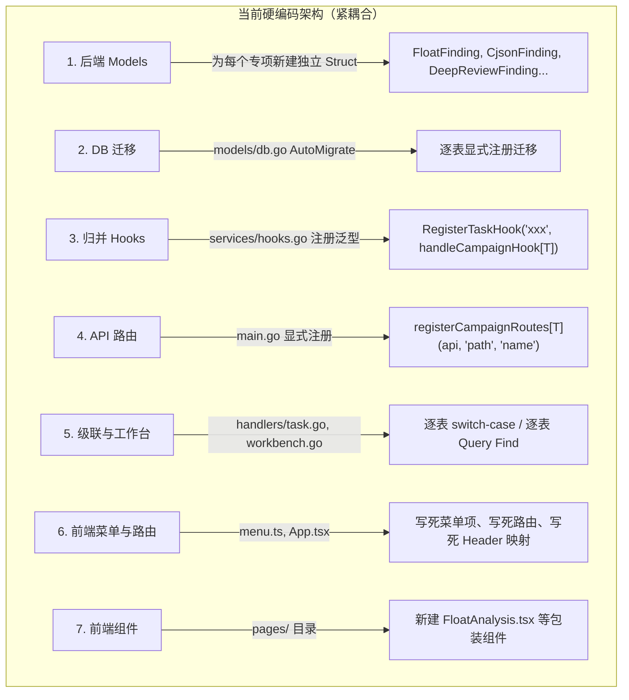
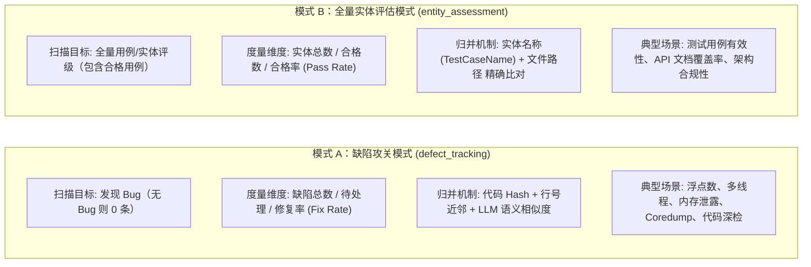
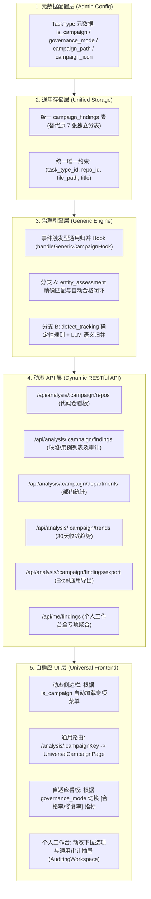
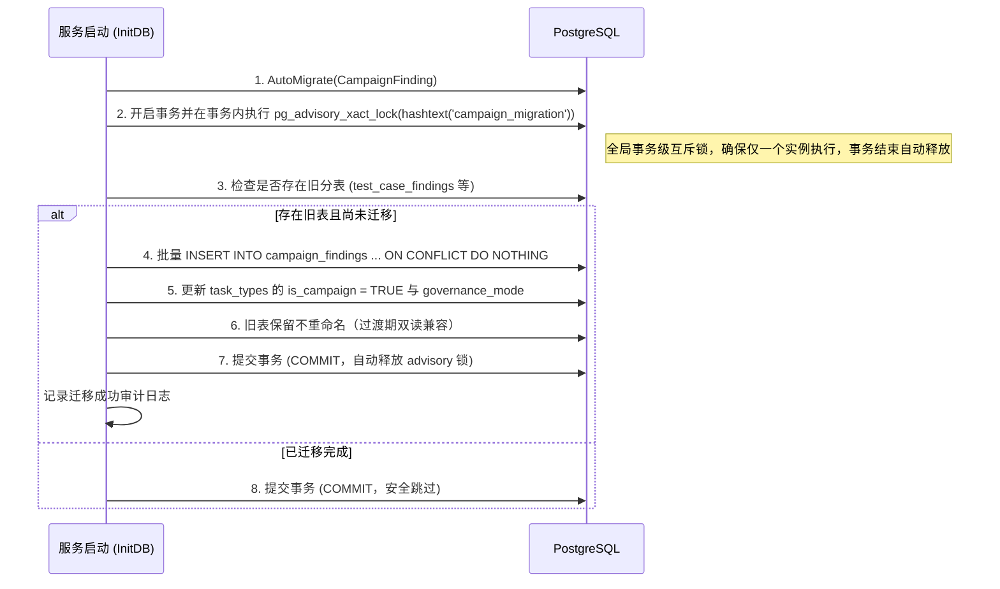
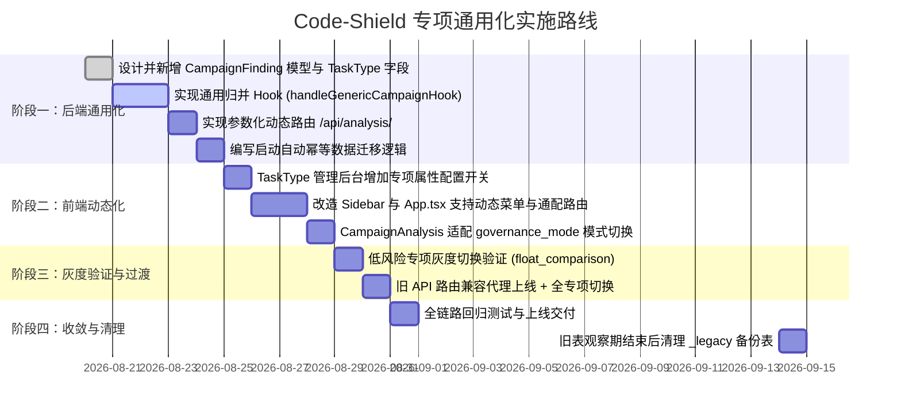

# Code-Shield 专项分析通用化与元数据驱动架构设计

> **版本**：v1.2  
> **状态**：已评审修订 (Reviewed & Revised)  
> **适用系统**：Code-Shield 质量与安全扫描平台  
> **核心目标**：解除专项分析对硬编码的依赖，实现**"零编码配置，新扫描任务一键升级为专项治理"**

> **修订记录**：
> | 版本 | 日期 | 变更说明 |
> | :--- | :--- | :--- |
> | v1.0 | 2026-08-20 | 初始设计稿，已评审通过 |
> | v1.1 | 2026-08-20 | 基于代码仓实际验证进行评审修订：修复归并引擎 O(n×m) 性能问题、增加迁移并发安全保护与分阶段回退策略、补充 API 分页与缓存设计、增加旧 API 兼容代理、补充 CampaignPath 唯一约束与 GovernanceMode 枚举校验、定义 CampaignConfig JSON Schema、补全迁移 SQL 遗漏字段、新增风险评估章节与存量 Bug 修复记录 |
> | v1.2 | 2026-08-20 | 进一步完善健壮性：将迁移锁升级为事务级 pg_advisory_xact_lock 防止死锁残留，为 TaskType 进程内缓存补充主动失效（Active Invalidation）事件机制 |

---

## 1. 背景与现状问题

### 1.1 业务背景
Code-Shield 系统当前核心能力分为两层：
1. **扫描任务（Scan Tasks）**：支持单仓或大代码仓分片并行扫描，结合大模型输出结构化缺陷发现（`AnalysisFinding`）。
2. **专项分析（Campaign Analysis）**：针对特定的质量/安全专项（如 Python 浮点数、显式创建线程、cJSON 内存泄漏、Coredump 风险、UT 测试用例有效性等），进行代码仓维度聚合看板、部门排名、30天缺陷收敛趋势跟踪、问题人工审计与闭环核销。

### 1.2 现状痛点：新增专项需要重度编码
目前系统中，任意新增一个扫描任务类型若想具备“专项分析”能力，必须由研发人员修改 **6~8 处前后端代码** 并重新发布上线：



### 1.3 核心改造诉求
**彻底实现元数据驱动（Metadata-Driven）**：在管理员创建或编辑任务类型（`TaskType`）时，只需在后台勾选/配置专项属性，系统自动完成动态菜单挂载、通用路由解析、事件驱动归并与个人工作台汇总，**全程无需编写一行代码**。

---

## 2. 治理模式抽象：解耦两类专项的差异

通过对现有专项的深入分析，系统存在两类不同的治理模型：**缺陷攻关模式** 与 **全量实体评估模式（如 UT 有效性）**。我们将其抽象为统一的 `governance_mode`，使系统具备极强的泛化能力。



### 差异与统一规则对比表

| 维度 | 缺陷攻关模式 (`defect_tracking`) | 全量实体评估模式 (`entity_assessment`) |
| :--- | :--- | :--- |
| **严重等级（Severity）** | 致命、严重、一般、建议 | **合格 (Pass)**、致命、严重、一般、建议 |
| **初始状态流转** | 默认全部为 `open`（待治理） | 级别为【合格】初始化为 `closed`，其余初始化为 `open` |
| **实体标识字段** | 缺陷标题（`Title`） | 实体唯一名称（如 `TestCaseName` 映射至 `Title`） |
| **问题归并算法** | Phase 1 代码特征匹配 + Phase 2 LLM 语义比对 | 路径 + 实体名称 精确哈希比对（$O(1)$ 无需大模型） |
| **看板展示指标** | 总缺陷数、待治理数、**修复率（Fix Rate）** | 总实体数、合格实体数、**合格率（Pass Rate）** |

---

## 3. 总体架构设计

系统总体架构分为 **元数据配置层、通用存储层、治理引擎层、动态 API 层与自适应 UI 层**：



---

## 4. 详细模块设计

### 4.1 数据模型层设计

#### 1. `TaskType` 元数据扩展
```go
// ── GovernanceMode 枚举常量 ──
const (
    GovernanceModeDefectTracking   = "defect_tracking"   // 缺陷攻关模式
    GovernanceModeEntityAssessment = "entity_assessment"  // 全量实体评估模式
)

type TaskType struct {
    ID              uint           `gorm:"primaryKey" json:"id"`
    Name            string         `gorm:"uniqueIndex;not null" json:"name"`       // 唯一标识: "float_comparison"
    DisplayName     string         `gorm:"not null" json:"display_name"`           // 中文名: "Python浮点数专项"
    Description     string         `json:"description"`                            // 任务说明
    EngineMode      string         `gorm:"default:single" json:"engine_mode"`      // single / chunked
    
    // ── 专项分析元数据扩展 ──
    IsCampaign      bool           `gorm:"default:false;index" json:"is_campaign"` // 是否启用为专项分析
    CampaignPath    string         `gorm:"size:100;default:'';uniqueIndex:idx_campaign_path_active,where:is_campaign=true" json:"campaign_path"` // 路由别名 (空则默认同 Name)，启用专项时全局唯一
    GovernanceMode  string         `gorm:"size:50;default:'defect_tracking'" json:"governance_mode"` // defect_tracking / entity_assessment
    CampaignIcon    string         `gorm:"type:text" json:"campaign_icon"`         // SVG 图标路径或图标类名
    CampaignConfig  datatypes.JSON `json:"campaign_config"`                        // 高级配置，结构定义见 CampaignConfigSchema
    
    IsActive        bool           `gorm:"default:true" json:"is_active"`
    CreatedAt       time.Time      `json:"created_at"`
    UpdatedAt       time.Time      `json:"updated_at"`
}

// ── CampaignConfig JSON Schema 定义 ──
// 写入 CampaignConfig 字段时应序列化此结构体，读取时应反序列化并校验
type CampaignConfigSchema struct {
    Version           int               `json:"version"`             // Schema 版本号，当前为 1
    SeverityFilter    []string          `json:"severity_filter"`     // 需要展示的严重等级列表 (空=全部展示)
    NotifyOnNewDefect bool              `json:"notify_on_new_defect"` // 新缺陷入库时是否触发通知
    CustomLabels      map[string]string `json:"custom_labels"`       // 看板自定义标签 (如 {"metric": "合格率"})
}

// ── 模型写入校验 Hook ──
func (t *TaskType) BeforeCreate(tx *gorm.DB) error { return t.validate() }
func (t *TaskType) BeforeUpdate(tx *gorm.DB) error { return t.validate() }

func (t *TaskType) validate() error {
    if t.IsCampaign {
        // GovernanceMode 枚举校验
        switch t.GovernanceMode {
        case GovernanceModeDefectTracking, GovernanceModeEntityAssessment:
            // valid
        default:
            return fmt.Errorf("invalid governance_mode: %q, must be %q or %q",
                t.GovernanceMode, GovernanceModeDefectTracking, GovernanceModeEntityAssessment)
        }
        // CampaignConfig Schema 校验（若非空）
        if len(t.CampaignConfig) > 0 {
            var cfg CampaignConfigSchema
            if err := json.Unmarshal(t.CampaignConfig, &cfg); err != nil {
                return fmt.Errorf("invalid campaign_config JSON: %w", err)
            }
        }
    }
    return nil
}
```

#### 2. 统一专项缺陷表（`CampaignFinding`）
```go
type CampaignFinding struct {
    ID           uint           `gorm:"primaryKey" json:"id"`
    TaskTypeID   uint           `gorm:"uniqueIndex:idx_camp_finding_uniq,priority:1;index;not null" json:"task_type_id"`
    TaskType     TaskType       `gorm:"foreignKey:TaskTypeID" json:"task_type"`
    RepoID       uint           `gorm:"uniqueIndex:idx_camp_finding_uniq,priority:2;index;not null" json:"repo_id"`
    Repo         Repository     `gorm:"foreignKey:RepoID" json:"repo"`
    TaskReportID uint           `gorm:"index" json:"task_report_id"`
    
    // 缺陷本身属性
    FilePath     string         `gorm:"uniqueIndex:idx_camp_finding_uniq,priority:3;size:500;not null" json:"file_path"`
    LineNumber   string         `gorm:"size:255" json:"line_number"`
    Title        string         `gorm:"uniqueIndex:idx_camp_finding_uniq,priority:4;size:500;not null" json:"title"` // 普通专项存缺陷标题，UT存测试用例名称
    Detail       string         `gorm:"type:text" json:"detail"`
    Severity     string         `gorm:"size:100;not null;index" json:"severity"` // 致命/严重/一般/建议/合格
    Category     string         `gorm:"size:255;index" json:"category"`
    CodeSnippet  string         `gorm:"type:text" json:"code_snippet"`
    Suggestion   string         `gorm:"type:text" json:"suggestion"`
    
    // 治理状态与审计跟踪
    Status       string         `gorm:"default:'open';size:50;index" json:"status"` // open, analyzing, resolved, closed, invalid
    AssigneeID   *uint          `json:"assignee_id"`
    Assignee     *User          `gorm:"foreignKey:AssigneeID" json:"assignee,omitempty"`
    StatusLog    datatypes.JSON `json:"status_log"` // [{"status":"open","time":"...","user":"xxx","reason":"..."}]
    Feedback     string         `gorm:"type:text" json:"feedback"`
    CreatedAt    time.Time      `gorm:"index" json:"created_at"`
    UpdatedAt    time.Time      `json:"updated_at"`
}
```

---

### 4.2 统一归并引擎设计

任务执行完毕后，`task_runner` 检查如果 `ctx.taskType.IsCampaign == true`，自动触发通用归并引擎：

```go
func handleGenericCampaignHook(ctx *taskContext, findings []models.AnalysisFinding) error {
    isEntityMode := ctx.taskType.GovernanceMode == "entity_assessment"
    
    // 1. 查询该代码仓在当前专项下的所有存量记录
    var allOldFindings []models.CampaignFinding
    models.DB.Where("task_type_id = ? AND repo_id = ?", ctx.taskType.ID, ctx.repo.ID).Find(&allOldFindings)

    matchedOldIDs := make(map[uint]bool)
    matchedFindingsMap := make(map[int]*models.CampaignFinding)

    if isEntityMode {
        // ── 模式 B (实体评估): 确定性 O(1) 路径+用例名哈希匹配 ──
        // 先构建存量记录的哈希索引，key = "FilePath\x00Title"
        oldIndex := make(map[string]*models.CampaignFinding, len(allOldFindings))
        for i := range allOldFindings {
            key := allOldFindings[i].FilePath + "\x00" + allOldFindings[i].Title
            oldIndex[key] = &allOldFindings[i]
        }
        // O(n) 遍历新发现，哈希查找匹配存量
        for idx, f := range findings {
            key := f.FilePath + "\x00" + f.Title
            if oldF, ok := oldIndex[key]; ok {
                matchedFindingsMap[idx] = oldF
                matchedOldIDs[oldF.ID] = true
            }
        }
    } else {
        // ── 模式 A (缺陷攻关): Phase 1 硬规则 + Phase 2 LLM 语义模糊比对 ──
        runDefectFuzzyAndLLMMatching(ctx, findings, allOldFindings, matchedOldIDs, matchedFindingsMap)
    }

    // ── Phase 3: 状态继承、新问题落库与消失问题自动置为已解决 ──
    syncFindingsToDatabase(ctx, findings, allOldFindings, matchedFindingsMap, matchedOldIDs, isEntityMode)
    return nil
}
```

---

### 4.3 动态 API 路由设计

统一使用 Gin 参数化动态路由替换原有的静态路由注册：

```go
func registerDynamicCampaignRoutes(rg *gin.RouterGroup) {
    campaignGroup := rg.Group("/analysis/:campaign")
    campaignGroup.Use(handlers.ResolveCampaignMiddleware()) // 中间件根据 :campaign 注入 TaskType 上下文
    {
        campaignGroup.GET("/repos", handlers.GetDynamicCampaignRepos)
        campaignGroup.GET("/findings", handlers.GetDynamicCampaignFindings)
        campaignGroup.GET("/findings/export", handlers.ExportDynamicCampaignFindings)
        campaignGroup.PATCH("/findings/:id", handlers.UpdateDynamicCampaignFinding)
        campaignGroup.GET("/departments", handlers.GetDynamicCampaignDepartments)
        campaignGroup.GET("/trends", handlers.GetDynamicCampaignTrends)
    }
}
```

*   **`ResolveCampaignMiddleware` 进程内缓存与主动失效设计**：

    TaskType 元数据变更频率极低（仅管理员操作），采用“**主动失效（Active Invalidation） + 5 分钟 TTL 兜底**”策略：
    ```go
    var campaignCache = sync.Map{} // key: campaignPath, value: *CachedTaskType

    type CachedTaskType struct {
        TaskType  *models.TaskType
        CachedAt  time.Time
    }

    const campaignCacheTTL = 5 * time.Minute

    // InvalidateCampaignCache 供 handlers/task_type.go 在更新/删除 TaskType 时主动调用，实现秒级即时生效
    func InvalidateCampaignCache(campaignPath ...string) {
        if len(campaignPath) == 0 {
            campaignCache = sync.Map{} // 清空全部缓存
            return
        }
        for _, p := range campaignPath {
            campaignCache.Delete(p)
        }
    }

    func ResolveCampaignMiddleware() gin.HandlerFunc {
        return func(c *gin.Context) {
            campaign := c.Param("campaign")

            // 1. 命中缓存且未过期
            if cached, ok := campaignCache.Load(campaign); ok {
                entry := cached.(*CachedTaskType)
                if time.Since(entry.CachedAt) < campaignCacheTTL {
                    c.Set("taskType", entry.TaskType)
                    c.Next()
                    return
                }
            }

            // 2. 查库并回填缓存
            var tt models.TaskType
            if err := models.DB.Where("(campaign_path = ? OR name = ?) AND is_campaign = ?",
                campaign, campaign, true).First(&tt).Error; err != nil {
                c.AbortWithStatusJSON(404, gin.H{"error": "专项分析任务不存在或未启用"})
                return
            }
            campaignCache.Store(campaign, &CachedTaskType{TaskType: &tt, CachedAt: time.Now()})
            c.Set("taskType", &tt)
            c.Next()
        }
    }
    ```

*   **旧 API 路由兼容代理（过渡期）**：

    为避免外部系统（CI/CD、报表平台等）因路径变更中断，过渡期内保留旧路由并返回 301 重定向：
    ```go
    // 旧路由 → 新路由重定向（过渡期 2 个迭代后下线）
    legacyRoutes := map[string]string{
        "ut":                    "ut_effectiveness",
        "coredump":              "coredump_risk",
        "float":                 "float_comparison",
        "thread":                "thread_create",
        "cjson":                 "cjson_scan",
        "unordered-collection":  "unordered_collection",
        "deep-review":           "deep_review",
    }
    for oldPath, newCampaign := range legacyRoutes {
        capturedNew := newCampaign
        rg.Any("/analysis/"+oldPath+"/*path", func(c *gin.Context) {
            c.Header("Sunset", "2026-10-01")
            c.Header("Deprecation", "true")
            c.Redirect(http.StatusMovedPermanently,
                "/api/analysis/"+capturedNew+c.Param("path"))
        })
    }
    ```

*   **个人工作台查询（含分页）**：
    ```go
    func GetMyFindings(c *gin.Context) {
        uid := c.GetUint("userID")
        page, _ := strconv.Atoi(c.DefaultQuery("page", "1"))
        pageSize, _ := strconv.Atoi(c.DefaultQuery("page_size", "20"))
        if page < 1 { page = 1 }
        if pageSize < 1 || pageSize > 100 { pageSize = 20 }

        var total int64
        models.DB.Model(&models.CampaignFinding{}).Where("assignee_id = ?", uid).Count(&total)

        var list []models.CampaignFinding
        models.DB.Preload("Repo").Preload("TaskType").
            Where("assignee_id = ?", uid).
            Order("id desc").
            Offset((page - 1) * pageSize).Limit(pageSize).
            Find(&list)

        c.JSON(http.StatusOK, gin.H{
            "total": total,
            "page": page,
            "page_size": pageSize,
            "items": list,
        })
    }
    ```

---

### 4.4 前端通用视图引擎设计

#### 1. 动态侧边栏菜单（`Sidebar.tsx`）
前端系统启动时请求 `/api/task-types?is_campaign=true`，动态将专项列表拼装进菜单项：
```ts
const campaignMenuItems: SubMenuItem[] = activeCampaignTypes.map(tt => ({
    path: `/analysis/${tt.campaign_path || tt.name}`,
    label: tt.display_name,
    icon: tt.campaign_icon || DEFAULT_CAMPAIGN_ICON,
}));
```

#### 2. 通用动态路由渲染（`App.tsx`）
```tsx
{/* 单一通用路由替代原有的多个静态路由 */}
<Route path="/analysis/:campaignKey" element={<PrivateRoute><UniversalCampaignPage /></PrivateRoute>} />
```

#### 3. 通用页面组件（`UniversalCampaignPage.tsx`）
内部直接复用并增强已有的 `<CampaignAnalysis />`，接收 URL 中的 `campaignKey`，自动获取任务类型的 `display_name`、`description` 和 `governance_mode`，自适应切换看板指标展示。

---

## 5. 数据迁移方案

### 5.1 迁移策略（开箱即用，自动幂等，并发安全）
在服务启动时（`models/db.go`），自动执行迁移逻辑。整个迁移过程具备**幂等性**与**无损性**。通过 PostgreSQL 事务级咨询锁（`pg_advisory_xact_lock`）保障多实例并发启动安全，事务提交或回滚时数据库自动释放锁，避免进程异常终止时锁残留：



**并发安全保障**：
```go
// 在 GORM 事务内使用 pg_advisory_xact_lock 确保全局唯一执行（多 Pod 滚动更新安全）
err := db.Transaction(func(tx *gorm.DB) error {
    // 1. 获取事务级排他锁（事务结束自动释放，彻底杜绝死锁与连接泄漏）
    if err := tx.Exec("SELECT pg_advisory_xact_lock(hashtext('campaign_migration'))").Error; err != nil {
        return err
    }

    // 2. Double-check：获锁后再次确认旧表是否仍存在且有待迁移数据
    if !tableExists(tx, "test_case_findings") {
        return nil // 其他实例已完成迁移，安全跳过
    }

    // 3. 批量执行数据迁移并更新 TaskType 元数据...
    return doMigrateLegacyTables(tx)
})
```

**回退策略（分阶段清理旧表）**：
- **过渡期（上线后 2 周）**：旧分表保留不重命名，旧版代码仍可读取旧表，新版代码仅读写 `campaign_findings`。
- **观察期确认无误后**：通过独立的运维脚本将旧表重命名为 `_legacy_xxx` 备份（非启动自动执行）。
- **最终清理**：备份保留 1 个月后由 DBA 手动 DROP。

### 5.2 字段迁移映射关系

```sql
-- 示例：UT 有效性评估迁移 (test_case_name -> title)
INSERT INTO campaign_findings (
    task_type_id, repo_id, task_report_id, file_path, line_number,
    title, detail, severity, category, code_snippet, suggestion,
    status, assignee_id, status_log, feedback, created_at, updated_at
)
SELECT 
    (SELECT id FROM task_types WHERE name = 'ut_effectiveness' LIMIT 1),
    repo_id, task_report_id, file_path, line_number,
    test_case_name AS title, detail, severity, category, code_snippet, suggestion,
    status, assignee_id, status_log::jsonb, feedback, created_at, updated_at
FROM test_case_findings
ON CONFLICT (task_type_id, repo_id, file_path, title) DO NOTHING;
```

---

## 6. 改造收益与落地效果

| 维度 | 改造前（代码绑定模式） | 改造后（元数据驱动模式） |
| :--- | :--- | :--- |
| **新增专项成本** | 需要 1 名研发人员修改 Go 和 React 6~8 个文件并编译发版 | **零代码**：管理员在后台新建任务类型并勾选【启用专项治理】即刻生效 |
| **修改专项文案/图标** | 需要前后端改代码重新发版 | 后台修改即时生效 |
| **代码冗余度** | 存在 7 张雷同数据表、7 套重复的导出与查询逻辑 | 数据表与 API 彻底统一，精简代码千余行 |
| **系统泛化能力** | 仅支持既有专项 | 未来任何新扫描类型（如安全审计、API注释合规等）天然具备专项治理与看板能力 |

---

## 7. 实施演进路线图



---

## 8. 风险评估与降级策略

| 风险场景 | 影响等级 | 影响范围 | 降级 / 应对策略 |
| :--- | :---: | :--- | :--- |
| **迁移过程中服务异常重启** | 高 | 数据部分迁移不完整 | `pg_advisory_xact_lock` + 事务保证（详见 5.1），事务自动回滚并释放锁，下次启动自动重新执行 |
| **统一表数据量过大，看板查询超时** | 中 | 专项看板页面加载慢 | 预留按 `task_type_id` 做 PostgreSQL 列表分区的能力；短期可加 `(task_type_id, status)` 复合索引 |
| **多实例并发启动执行迁移** | 高 | 旧表 rename 竞态导致启动失败 | `pg_advisory_xact_lock` 事务级全局互斥（详见 5.1） |
| **新归并引擎误判率与旧逻辑不一致** | 中 | 缺陷重复录入或丢失 | 灰度期间先对 `float_comparison` 一个低风险专项试点，对比新旧结果后再全量切换 |
| **外部系统依赖旧 API 路径** | 中 | CI/CD 集成、报表平台中断 | 旧 API 路由保留 301 重定向兼容代理，添加 `Sunset` Header 通知下游，计划两个迭代后下线 |
| **`CampaignConfig` JSON 格式错误** | 低 | 专项看板配置失效 | 写入时 Schema 校验（详见 4.1），不合法配置拒绝保存并返回提示 |

---

## 9. 存量问题修复记录

> 本次架构重构过程中代码审查发现以下存量 Bug，将在重构中一并修复。这些 Bug 恰恰印证了硬编码架构的脆弱性 —— 统一为 `CampaignFinding` 后，此类遗漏将不可能再发生。

| # | 所在位置 | 问题描述 | 影响 | 修复方式 |
| :--- | :--- | :--- | :--- | :--- |
| BUG-1 | `handlers/task.go` 级联清理逻辑 (原 L840-855, L1081-1096) | 删除执行日志/报告时，逐表 `tx.Delete` 遗漏了 `DeepReviewFinding` 和 `TestCaseFinding` | 删除报告后遗留孤儿数据，占用存储且影响统计准确性 | 重构后统一 `tx.Where("task_report_id = ?", reportID).Delete(&CampaignFinding{})` 一行替代 |
| BUG-2 | `handlers/workbench.go` 个人工作台 (原 L42-197) | `GetMyFindings` 串行查询 6 张分表，遗漏了 `DeepReviewFinding` | 深度检视专项的缺陷不会出现在开发者个人工作台中 | 重构后统一查询 `campaign_findings` 表，无遗漏可能 |
| BUG-3 | `handlers/task.go` CSV 综合导出 (原 L243-329) | 6 个 `if-else if` 分支缺少 `deep_review` 的处理 | 深度检视专项的审计状态无法在综合报告中体现 | 重构后通用导出逻辑自动覆盖所有专项 |
