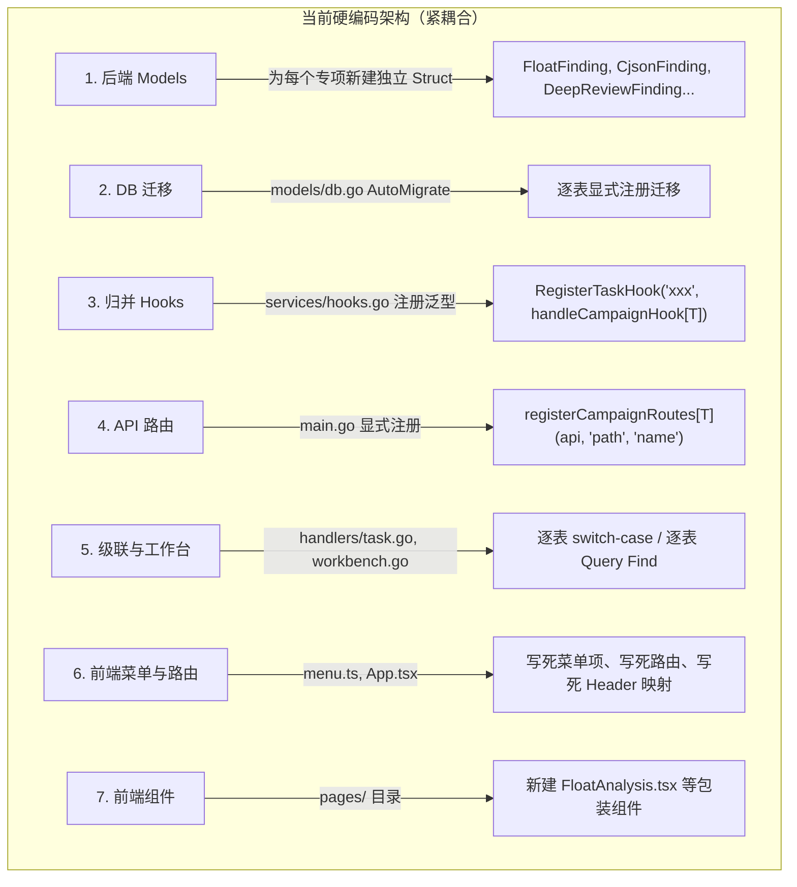
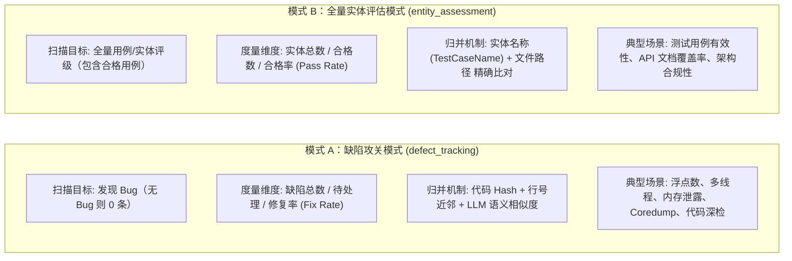
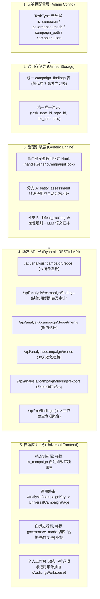
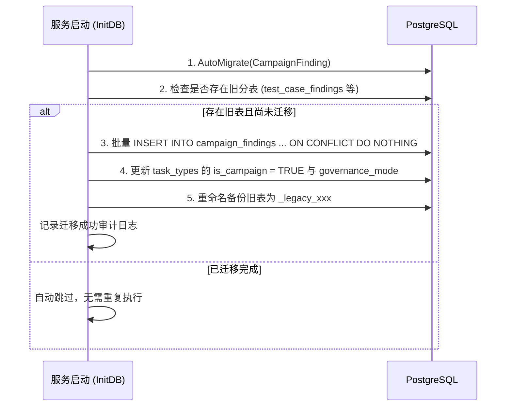
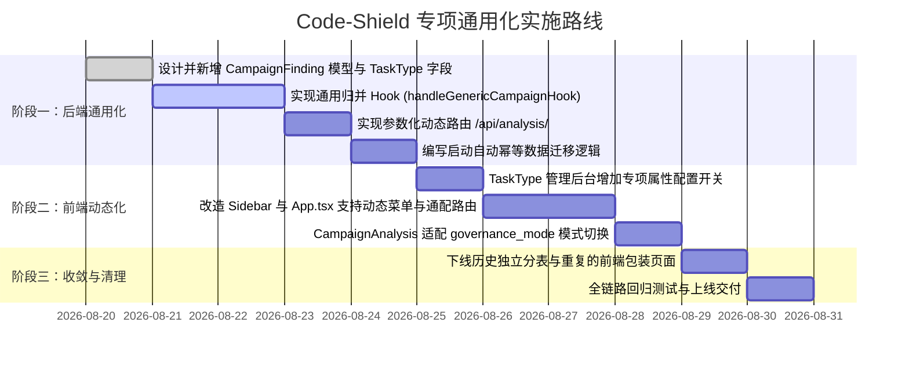

# Code-Shield 专项分析通用化与元数据驱动架构设计

> **版本**：v1.0  
> **状态**：已评审 (Approved)  
> **适用系统**：Code-Shield 质量与安全扫描平台  
> **核心目标**：解除专项分析对硬编码的依赖，实现**“零编码配置，新扫描任务一键升级为专项治理”**

---

## 1. 背景与现状问题

### 1.1 业务背景
Code-Shield 系统当前核心能力分为两层：
1. **扫描任务（Scan Tasks）**：支持单仓或大代码仓分片并行扫描，结合大模型输出结构化缺陷发现（`AnalysisFinding`）。
2. **专项分析（Campaign Analysis）**：针对特定的质量/安全专项（如 Python 浮点数、显式创建线程、cJSON 内存泄漏、Coredump 风险、UT 测试用例有效性等），进行代码仓维度聚合看板、部门排名、30天缺陷收敛趋势跟踪、问题人工审计与闭环核销。

### 1.2 现状痛点：新增专项需要重度编码
目前系统中，任意新增一个扫描任务类型若想具备“专项分析”能力，必须由研发人员修改 **6~8 处前后端代码** 并重新发布上线：



### 1.3 核心改造诉求
**彻底实现元数据驱动（Metadata-Driven）**：在管理员创建或编辑任务类型（`TaskType`）时，只需在后台勾选/配置专项属性，系统自动完成动态菜单挂载、通用路由解析、事件驱动归并与个人工作台汇总，**全程无需编写一行代码**。

---

## 2. 治理模式抽象：解耦两类专项的差异

通过对现有专项的深入分析，系统存在两类不同的治理模型：**缺陷攻关模式** 与 **全量实体评估模式（如 UT 有效性）**。我们将其抽象为统一的 `governance_mode`，使系统具备极强的泛化能力。



### 差异与统一规则对比表

| 维度 | 缺陷攻关模式 (`defect_tracking`) | 全量实体评估模式 (`entity_assessment`) |
| :--- | :--- | :--- |
| **严重等级（Severity）** | 致命、严重、一般、建议 | **合格 (Pass)**、致命、严重、一般、建议 |
| **初始状态流转** | 默认全部为 `open`（待治理） | 级别为【合格】初始化为 `closed`，其余初始化为 `open` |
| **实体标识字段** | 缺陷标题（`Title`） | 实体唯一名称（如 `TestCaseName` 映射至 `Title`） |
| **问题归并算法** | Phase 1 代码特征匹配 + Phase 2 LLM 语义比对 | 路径 + 实体名称 精确哈希比对（$O(1)$ 无需大模型） |
| **看板展示指标** | 总缺陷数、待治理数、**修复率（Fix Rate）** | 总实体数、合格实体数、**合格率（Pass Rate）** |

---

## 3. 总体架构设计

系统总体架构分为 **元数据配置层、通用存储层、治理引擎层、动态 API 层与自适应 UI 层**：



---

## 4. 详细模块设计

### 4.1 数据模型层设计

#### 1. `TaskType` 元数据扩展
```go
type TaskType struct {
    ID              uint           `gorm:"primaryKey" json:"id"`
    Name            string         `gorm:"uniqueIndex;not null" json:"name"`       // 唯一标识: "float_comparison"
    DisplayName     string         `gorm:"not null" json:"display_name"`           // 中文名: "Python浮点数专项"
    Description     string         `json:"description"`                            // 任务说明
    EngineMode      string         `gorm:"default:single" json:"engine_mode"`      // single / chunked
    
    // ── 专项分析元数据扩展 ──
    IsCampaign      bool           `gorm:"default:false;index" json:"is_campaign"` // 是否启用为专项分析
    CampaignPath    string         `gorm:"size:100;default:''" json:"campaign_path"` // 路由别名 (空则默认同 Name)
    GovernanceMode  string         `gorm:"size:50;default:'defect_tracking'" json:"governance_mode"` // defect_tracking / entity_assessment
    CampaignIcon    string         `gorm:"type:text" json:"campaign_icon"`         // SVG 图标路径或图标类名
    CampaignConfig  datatypes.JSON `json:"campaign_config"`                        // 高级配置 (如通知规则、严重度过滤)
    
    IsActive        bool           `gorm:"default:true" json:"is_active"`
    CreatedAt       time.Time      `json:"created_at"`
    UpdatedAt       time.Time      `json:"updated_at"`
}
```

#### 2. 统一专项缺陷表（`CampaignFinding`）
```go
type CampaignFinding struct {
    ID           uint           `gorm:"primaryKey" json:"id"`
    TaskTypeID   uint           `gorm:"uniqueIndex:idx_camp_finding_uniq,priority:1;index;not null" json:"task_type_id"`
    TaskType     TaskType       `gorm:"foreignKey:TaskTypeID" json:"task_type"`
    RepoID       uint           `gorm:"uniqueIndex:idx_camp_finding_uniq,priority:2;index;not null" json:"repo_id"`
    Repo         Repository     `gorm:"foreignKey:RepoID" json:"repo"`
    TaskReportID uint           `gorm:"index" json:"task_report_id"`
    
    // 缺陷本身属性
    FilePath     string         `gorm:"uniqueIndex:idx_camp_finding_uniq,priority:3;size:500;not null" json:"file_path"`
    LineNumber   string         `gorm:"size:255" json:"line_number"`
    Title        string         `gorm:"uniqueIndex:idx_camp_finding_uniq,priority:4;size:500;not null" json:"title"` // 普通专项存缺陷标题，UT存测试用例名称
    Detail       string         `gorm:"type:text" json:"detail"`
    Severity     string         `gorm:"size:100;not null;index" json:"severity"` // 致命/严重/一般/建议/合格
    Category     string         `gorm:"size:255;index" json:"category"`
    CodeSnippet  string         `gorm:"type:text" json:"code_snippet"`
    Suggestion   string         `gorm:"type:text" json:"suggestion"`
    
    // 治理状态与审计跟踪
    Status       string         `gorm:"default:'open';size:50;index" json:"status"` // open, analyzing, resolved, closed, invalid
    AssigneeID   *uint          `json:"assignee_id"`
    Assignee     *User          `gorm:"foreignKey:AssigneeID" json:"assignee,omitempty"`
    StatusLog    datatypes.JSON `json:"status_log"` // [{"status":"open","time":"...","user":"xxx","reason":"..."}]
    Feedback     string         `gorm:"type:text" json:"feedback"`
    CreatedAt    time.Time      `gorm:"index" json:"created_at"`
    UpdatedAt    time.Time      `json:"updated_at"`
}
```

---

### 4.2 统一归并引擎设计

任务执行完毕后，`task_runner` 检查如果 `ctx.taskType.IsCampaign == true`，自动触发通用归并引擎：

```go
func handleGenericCampaignHook(ctx *taskContext, findings []models.AnalysisFinding) error {
    isEntityMode := ctx.taskType.GovernanceMode == "entity_assessment"
    
    // 1. 查询该代码仓在当前专项下的所有存量记录
    var allOldFindings []models.CampaignFinding
    models.DB.Where("task_type_id = ? AND repo_id = ?", ctx.taskType.ID, ctx.repo.ID).Find(&allOldFindings)

    matchedOldIDs := make(map[uint]bool)
    matchedFindingsMap := make(map[int]*models.CampaignFinding)

    if isEntityMode {
        // ── 模式 B (实体评估): 确定性 O(1) 路径+用例名匹配 ──
        for idx, f := range findings {
            for i := range allOldFindings {
                oldF := &allOldFindings[i]
                if oldF.FilePath == f.FilePath && oldF.Title == f.Title {
                    matchedFindingsMap[idx] = oldF
                    matchedOldIDs[oldF.ID] = true
                    break
                }
            }
        }
    } else {
        // ── 模式 A (缺陷攻关): Phase 1 硬规则 + Phase 2 LLM 语义模糊比对 ──
        runDefectFuzzyAndLLMMatching(ctx, findings, allOldFindings, matchedOldIDs, matchedFindingsMap)
    }

    // ── Phase 3: 状态继承、新问题落库与消失问题自动置为已解决 ──
    syncFindingsToDatabase(ctx, findings, allOldFindings, matchedFindingsMap, matchedOldIDs, isEntityMode)
    return nil
}
```

---

### 4.3 动态 API 路由设计

统一使用 Gin 参数化动态路由替换原有的静态路由注册：

```go
func registerDynamicCampaignRoutes(rg *gin.RouterGroup) {
    campaignGroup := rg.Group("/analysis/:campaign")
    campaignGroup.Use(handlers.ResolveCampaignMiddleware()) // 中间件根据 :campaign 注入 TaskType 上下文
    {
        campaignGroup.GET("/repos", handlers.GetDynamicCampaignRepos)
        campaignGroup.GET("/findings", handlers.GetDynamicCampaignFindings)
        campaignGroup.GET("/findings/export", handlers.ExportDynamicCampaignFindings)
        campaignGroup.PATCH("/findings/:id", handlers.UpdateDynamicCampaignFinding)
        campaignGroup.GET("/departments", handlers.GetDynamicCampaignDepartments)
        campaignGroup.GET("/trends", handlers.GetDynamicCampaignTrends)
    }
}
```

*   **个人工作台查询极简化**：
    ```go
    func GetMyFindings(c *gin.Context) {
        uid := c.GetUint("userID")
        var list []models.CampaignFinding
        models.DB.Preload("Repo").Preload("TaskType").
            Where("assignee_id = ?", uid).
            Order("id desc").Find(&list)
        c.JSON(http.StatusOK, list)
    }
    ```

---

### 4.4 前端通用视图引擎设计

#### 1. 动态侧边栏菜单（`Sidebar.tsx`）
前端系统启动时请求 `/api/task-types?is_campaign=true`，动态将专项列表拼装进菜单项：
```ts
const campaignMenuItems: SubMenuItem[] = activeCampaignTypes.map(tt => ({
    path: `/analysis/${tt.campaign_path || tt.name}`,
    label: tt.display_name,
    icon: tt.campaign_icon || DEFAULT_CAMPAIGN_ICON,
}));
```

#### 2. 通用动态路由渲染（`App.tsx`）
```tsx
{/* 单一通用路由替代原有的多个静态路由 */}
<Route path="/analysis/:campaignKey" element={<PrivateRoute><UniversalCampaignPage /></PrivateRoute>} />
```

#### 3. 通用页面组件（`UniversalCampaignPage.tsx`）
内部直接复用并增强已有的 `<CampaignAnalysis />`，接收 URL 中的 `campaignKey`，自动获取任务类型的 `display_name`、`description` 和 `governance_mode`，自适应切换看板指标展示。

---

## 5. 数据迁移方案

### 5.1 迁移策略（开箱即用，自动幂等）
在服务启动时（`models/db.go`），自动执行迁移逻辑。整个迁移过程具备**幂等性、无损性、可回滚性**：



### 5.2 字段迁移映射关系

```sql
-- 示例：UT 有效性评估迁移 (test_case_name -> title)
INSERT INTO campaign_findings (
    task_type_id, repo_id, task_report_id, file_path, line_number,
    title, detail, severity, category, code_snippet, suggestion,
    status, assignee_id, status_log, created_at, updated_at
)
SELECT 
    (SELECT id FROM task_types WHERE name = 'ut_effectiveness' LIMIT 1),
    repo_id, task_report_id, file_path, line_number,
    test_case_name AS title, detail, severity, category, code_snippet, suggestion,
    status, assignee_id, status_log::jsonb, created_at, updated_at
FROM test_case_findings
ON CONFLICT (task_type_id, repo_id, file_path, title) DO NOTHING;
```

---

## 6. 改造收益与落地效果

| 维度 | 改造前（代码绑定模式） | 改造后（元数据驱动模式） |
| :--- | :--- | :--- |
| **新增专项成本** | 需要 1 名研发人员修改 Go 和 React 6~8 个文件并编译发版 | **零代码**：管理员在后台新建任务类型并勾选【启用专项治理】即刻生效 |
| **修改专项文案/图标** | 需要前后端改代码重新发版 | 后台修改即时生效 |
| **代码冗余度** | 存在 7 张雷同数据表、7 套重复的导出与查询逻辑 | 数据表与 API 彻底统一，精简代码千余行 |
| **系统泛化能力** | 仅支持既有专项 | 未来任何新扫描类型（如安全审计、API注释合规等）天然具备专项治理与看板能力 |

---

## 7. 实施演进路线图


