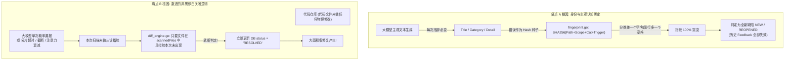

# 下一代确定性缺陷生命周期与空间几何对齐架构设计 (Next-Gen Deterministic Lifecycle & Spatial Alignment Architecture)

> **版本**：v3.0 (Paradigm Shift)  
> **状态**：Ready for Architecture Review & Implementation  
> **专题归属**：CodeShield 确定性源码指纹与抗抖动增量生命周期架构 (Deterministic Fingerprint Architecture)  
> **设计背景**：彻底响应研发团队与业务用户对“**已存在问题被高频重复报‘新’（NEW/REOPENED 泛滥）**”以及“**代码未改却无缘无故把问题关闭（RESOLVED 假修复与幽灵复活）**”的强烈痛点与信任危机。  
> **核心破局宣言**：**完全打破“以大模型生成文本为中心”的旧设计思维，确立“以 Git 物理版本控制与源码空间几何为真实源 (SSOT)”的新范式。只要物理代码没有修改，缺陷绝对禁止自动关闭；无论大模型文字描述如何漂移，物理锚点一致即为同一缺陷。**

---

## 一、 用户痛点深层解构与旧机制的技术破产

### 1.1 研发团队的核心抱怨与业务影响
在长期的扫描与治理过程中，研发人员与安全运营人员对以下两大失真现象反响最为强烈：

```
┌────────────────────────────────────────────────────────────────────────────────────────┐
│ 痛点 A：重复“新”发现（NEW 泛滥，历史记忆丧失）                                          │
├────────────────────────────────────────────────────────────────────────────────────────┤
│ 现象：同一段代码缺陷，周一报出来，研发标记了“已确认”或“暂不修复”，周二重新扫描时，系统   │
│       由于大模型标题改了几个字、分类从英文变成了中文，就重新当成全新缺陷 (NEW) 告警。   │
│ 后果：看板上“新增缺陷”虚高不下；开发者被迫重复看、重复解释；人工反馈被反复冲刷抹杀。   │
└────────────────────────────────────────────────────────────────────────────────────────┘

┌────────────────────────────────────────────────────────────────────────────────────────┐
│ 痛点 B：无缘无故把问题关闭（假修复与幽灵复活，数据剧烈震荡）                             │
├────────────────────────────────────────────────────────────────────────────────────────┤
│ 现象：某个确实存在的漏洞，研发还没来得及改动代码，第二天扫描报告却显示该问题“已修复”   │
│       (RESOLVED)。紧接着第三天扫描又突然作为“新问题”重新冒出来 (幽灵复活)。             │
│ 后果：质量看板数据忽高忽低毫无可信度；严重漏洞在静默中被“假修复”放过，产生重大安全盲区。│
└────────────────────────────────────────────────────────────────────────────────────────┘
```

### 1.2 为什么现有实现必然破产？（机制级根因剖析）

通过审查现有代码 `diff_engine.go` 与 `fingerprint.go`，我们发现系统底层的判定逻辑在面对大模型时存在根本性的机制缺陷：



1. **错把大模型的主观认知当成物理身份证**：
   - 现有的 `CalculateDefectFingerprint` 将 `Category`（甚至早期的 `Title` 碎片）直接作为哈希种子。
   - 大模型本质是**概率采样机器**，即使 `temperature=0`，在语义表达、分类选择、语句切分上也存在天然的随机涨落。把易变的认知文本塞进哈希，无异于“按罪犯今天穿什么颜色的衣服来确定身份证号”。
2. **错把大模型的“没看到”当成“物理已被修复”**：
   - `diff_engine.go:136` 的判定是：`if !seenInThisScan[fp] && record.Status == "ACTIVE" && scannedFileSet[normRecordPath]` $\rightarrow$ 立即标记 `RESOLVED`。
   - **大模型没看到，代码就等于修了吗？** 绝不！大模型可能因为单分片上下文过载、Prompt 长度截断、网络超时降级、或多批次采样抖动而漏报。在物理文件甚至 Git Commit 都毫无变更的情况下将缺陷关闭，是导致假修复震荡的核心元凶。

---

## 二、 架构演进的三大根本基石 (Three Architectural Pillars)

为了从数学和物理逻辑上彻底杜绝上述两大痛点，新架构确立三大不可动摇的基石原则：

### 基石一：物理变更铁律 (Physical Code-Change Guard)
> 🛡️ **铁律**：**代码未动，缺陷永不自动关闭！**
> 缺陷流转为 `RESOLVED` 的充要条件是：**“承载该缺陷的代码行或所在函数体，在物理世界中确实被修改或删除了”**。
> - **双层物理守卫机制**：
>   1. **L1 文件级 Git Blob 守卫**：若物理文件的 Git Blob Hash 未变，无论大模型在单次或多次扫描中是否提及该缺陷，系统强制将其锁定在 `ACTIVE` 状态，判定为“大模型单次漏报”，严禁关闭。
>   2. **L2 作用域与 Hunk 级变更守卫**：若文件整体虽有改动（如文件其它不相关函数修改、增删注释），但该缺陷所在函数作用域代码 Hash 未变，且物理行号区间 `[LineStart, LineEnd]` 未与本次 Git Diff 的变更块 (Hunk) 发生任何物理交集，**依然强制保持 `ACTIVE`，严禁关闭！**彻底杜绝“改了文件尾部导致文件头部未修缺陷被假修复”的二次假修复陷阱。

### 基石二：双轨制解耦架构 (Identity & Payload Decoupling)
> 🧬 **铁律**：**物理锚点决定唯一身份，认知载荷决定展示体验。**
> - **物理锚点 (Physical Anchor - SSOT)**：仅由 `(RepoID, TaskTypeID, NormalizedPath, NormalizedScope, PhysicalTriggerToken)` 决定。纯物理客观特征，永不受大模型自然语言影响。
> - **认知载荷 (Cognitive Payload)**：`Title`、`Detail`、`Suggestion`、`Category`、`Severity`、`DebateLog`。
> - **核心规则**：当同一个物理锚点被再次命中时，系统判定为同一缺陷（`EXISTED`），**用最新的认知载荷去润色和更新缺陷详情，但绝对不重新生成指纹，绝对不篡改历史状态与人工反馈！**

### 基石三：空间几何渐进漏斗 (Spatial-Geometric Matching Funnel)
> 📐 **铁律**：**以空间容错对抗行号漂移，以作用域聚类对抗触发行偏移。**
> 当文件被正常修改或大模型定位发生微小抖动时（例如大模型在同一函数内把触发行选偏了 2 行，或将解引用点误选为定义点），不依赖生硬的字符全等哈希，而是通过**物理行 Token 对齐 $\rightarrow$ 函数空间单体聚类 (结合分类相近度与几何邻近优先) $\rightarrow$ Git Diff 变更块映射 $\rightarrow$ 语义自愈**的四级漏斗，确保代码演进时缺陷生命周期平滑继承。

---

## 三、 总体架构与端到端数据流

```mermaid
flowchart TB
    subgraph ScanPhase["1. AI 智能体扫描阶段 (不确定性区域)"]
        LLM["多智能体三方对抗 (Hunter -> Challenger -> Judge)"]
        LLM -->|输出原始坐标与认知建议| RawFinding["RawFinding\n(file_path, raw_line, raw_trigger, raw_cat, title, detail)"]
    end

    subgraph GroundingPhase["2. 物理源码真实源感知器 (Source-Grounded Anchor Enricher)"]
        RawFinding --> SrcEnricher["【物理源码感知器】SourceEnricher"]
        DiskCode["磁盘真实代码仓 (Git Blob)"] --> SrcEnricher
        
        SrcEnricher -->|物理行校验与局部滑动模糊对齐| ExactLine["真实精准行号 (start_line - end_line)"]
        SrcEnricher -->|读取精准行物理代码并去噪清洗| PhysTrigger["物理单行 Token (CleanPhysicalTrigger)"]
        SrcEnricher -->|逆向 AST 回溯 + 规范化截断| RealScope["物理核心作用域 Class::Method (NormalizedScope)"]
        
        RawFinding --> TaskTaxonomy["任务受控分类配置 (meta.json)"]
        TaskTaxonomy --> GenericSanitizer["通用分类吸附器 SanitizeCategory"]
        GenericSanitizer --> NormCat["标准化分类 (Standard Category)"]
    end

    subgraph FunnelPhase["3. 四级空间几何比对漏斗 (The 4-Tier Spatial Engine)"]
        PhysTrigger & RealScope --> T1{"Tier 1: 物理强指纹哈希匹配\n(Path + Scope + CleanPhysicalTrigger)"}
        T1 -->|✅ 命中 (85% 流量)| MatchSuccess["【存量命中 EXISTED】\n继承历史 ID，刷新最新 Payload"]
        
        T1 -->|❌ 未命中| T2{"Tier 2: 作用域单体聚类与距离容错\n(同 Path + 同 Scope\n且 行号偏移 ≤ 3 行 或 Token Jaccard > 0.75\n或 同分类且偏移 ≤ 15 行)"}
        T2 -->|✅ 命中 (12% 流量)| HealSuccess["【空间命中 EXISTED】\n自愈迁移指纹与分类，继承人工反馈"]
        
        T2 -->|❌ 未命中| T3{"Tier 3: Git Diff 变更块行号重对齐\n(根据 commit diff 追溯行号位移)"}
        T3 -->|✅ 命中 (2% 流量)| HealSuccess
        
        T3 -->|❌ 均未命中| T4{"Tier 4: 单文件未命中集合二部图对齐\n(仅当同文件内同时存在未命中老缺陷与新缺陷)"}
        T4 -->|LLM 双射判定同一问题| HealSuccess
        T4 -->|确认为全新问题| NewFinding["【全新缺陷 NEW】\n入库生成新物理锚点"]
    end

    subgraph LifecyclePhase["4. 防假修复与细粒度物理守卫 (Robust Lifecycle Guard)"]
        MatchSuccess & HealSuccess --> KeepActive["重置 missed_count = 0\n更新活跃时间与最近任务 ID"]
        
        HistoryRecords["历史已入库 ACTIVE 缺陷记录"] --> DiffGuard{"检查未被本次扫描命中的历史缺陷"}
        
        DiffGuard --> CheckFileHash{"L1: 当前物理文件 Git Blob Hash 比较"}
        CheckFileHash -->|物理 Hash 一模一样 (文件未变!)| SuppressGuard["【🚨 拦截假修复】\n判定为 LLM 概率漏报\n强制保持 ACTIVE，严禁关闭!"]
        
        CheckFileHash -->|文件 Hash 已改变| CheckHunk{"L2: 所在函数体 Hash 或 Git Diff Hunk 区间比较"}
        CheckHunk -->|缺陷所在函数/行未触碰 (其它无关处修改)| SuppressGuard
        
        CheckHunk -->|缺陷所在代码行确实被物理修改/删除| EvalMissed{"连续未命中次数 missed_count + 1\n是否达到确认阈值 N (默认 2)?"}
        EvalMissed -->|未达阈值 (N < 2)| GracePeriod["【观察期保持 ACTIVE】\n记入 missed_count，暂不关闭"]
        EvalMissed -->|达到阈值 (N >= 2)| RealResolve["【正式标记已修复 RESOLVED】\n代码真实物理修改且多轮验证确认消失"]
    end
```

---

## 四、 核心技术方案深度设计

### 4.1 物理锚点提取算法 (`SourceEnricher`)
**彻底杜绝大模型自由文本污染指纹。大模型输出的文本只用于“提供粗坐标”，真实的指纹特征 100% 取自本地物理磁盘上的源文件。**

```go
// SourceAnchor 物理源码锚点（缺陷的绝对物理身份证）
type SourceAnchor struct {
	NormalizedPath  string // 相对仓库根目录的正斜杠小写路径 (e.g. "src/util/buffer.cpp")
	NormalizedScope string // 规范化后的物理函数/方法签名，去除外部命名空间 (e.g. "BufferPool::Allocate")
	PhysicalToken   string // 从物理文件中读取并清洗的单行真实核心代码语句
	StartLine       int    // 物理文件中的真实绝对起始行
	EndLine         int    // 物理文件中的真实绝对结束行
	ScopeBodyHash   string // 所在函数/作用域代码块的 SHA-256 (用于细粒度代码修改守卫)
}

// NormalizeScopeSymbol 规范化作用域符号，去除外层命名空间与 lambda 差异
// 规则：剥离外层 namespace，统一保留最内层核心 Class::Method (取最后 2 段)；规范化 lambda 为 <lambda>
func NormalizeScopeSymbol(rawScope string) string {
	trimmed := strings.TrimSpace(rawScope)
	if trimmed == "" {
		return ""
	}
	// 1. 处理多函数合并的情况 (如 "GetTriggerDelay / GetTriggerFreq")，分段规范化后排序拼接
	parts := strings.Split(trimmed, " / ")
	var normalized []string
	for _, part := range parts {
		p := strings.TrimSpace(part)
		// 统一将各类 lambda 描述规范化为 <lambda>
		if strings.Contains(p, "lambda") || strings.Contains(p, "operator()") {
			p = regexp.MustCompile(`(operator\(\).*|<lambda>.*)`).ReplaceAllString(p, "<lambda>")
		}
		// 按 C++ / 语言分隔符拆分，取最后至多 2 段
		segs := strings.Split(p, "::")
		if len(segs) >= 2 {
			normalized = append(normalized, segs[len(segs)-2]+"::"+segs[len(segs)-1])
		} else {
			normalized = append(normalized, segs[0])
		}
	}
	sort.Strings(normalized)
	return strings.Join(normalized, " / ")
}

// EnrichSourceAnchor 从磁盘物理源码中计算确定性特征（含物理行校验与局部滑动校准）
func EnrichSourceAnchor(repoRoot string, filePath string, rawLine string, rawTrigger string) (*SourceAnchor, error) {
	normPath := strings.ToLower(filepath.ToSlash(strings.TrimSpace(filePath)))
	fullPath := filepath.Join(repoRoot, normPath)
	
	contentBytes, err := os.ReadFile(fullPath)
	if err != nil {
		return nil, fmt.Errorf("failed to read physical source file: %w", err)
	}
	lines := strings.Split(string(contentBytes), "\n")
	totalLines := len(lines)
	
	// 1. 物理行号解析与双重校准 (彻底解决 68% 的行号微偏差导致的读错物理代码问题)
	targetLine := parseLineNumber(rawLine)
	cleanTrigger := cleanSourceToken(rawTrigger)

	if targetLine > 0 && targetLine <= totalLines {
		// 行号在合法区间，先校验当前物理行是否与 rawTrigger 匹配
		currentLineToken := cleanSourceToken(lines[targetLine-1])
		if cleanTrigger != "" && !tokenMatches(currentLineToken, cleanTrigger) {
			// 当前行不匹配！说明 LLM 行号选偏（如选到了函数头或空行），在前后 ±15 行局部窗口内滑动精确校准
			calibratedLine := locateTriggerNearby(lines, cleanTrigger, targetLine, 15)
			if calibratedLine > 0 {
				targetLine = calibratedLine
			}
		}
	} else if cleanTrigger != "" {
		// 行号为空或非法，利用 trigger 在物理文件中全文模糊定位
		targetLine = locateTriggerInLines(lines, cleanTrigger)
	}
	
	if targetLine <= 0 {
		targetLine = 1
	}

	// 2. 从物理文件校准后的目标行直接提取真实代码，进行 Token 级清洗 (去注释、空白、引号、分号)
	physicalLine := lines[targetLine-1]
	cleanPhysicalToken := cleanSourceToken(physicalLine)
	if (cleanPhysicalToken == "" || cleanPhysicalToken == "{" || cleanPhysicalToken == "}") && targetLine < totalLines {
		// 若该行恰好为空、纯大括号或注释行，顺延读取下一有效物理行
		cleanPhysicalToken = cleanSourceToken(lines[targetLine])
	}

	// 3. 以全文件为上下文逆向扫描提取作用域，并执行命名空间规范化
	rawScope, scopeBody := ExtractScopeAndBodyFromLines(normPath, lines, targetLine)
	normScope := NormalizeScopeSymbol(rawScope)
	if normScope == "" {
		normScope = filepath.Base(normPath)
	}

	// 4. 计算所在函数/代码块的作用域 Body Hash (用于细粒度变更守卫)
	scopeBodyHash := sha256Hex(cleanSourceToken(scopeBody))

	return &SourceAnchor{
		NormalizedPath:  normPath,
		NormalizedScope: normScope,
		PhysicalToken:   cleanPhysicalToken,
		StartLine:       targetLine,
		EndLine:         targetLine,
		ScopeBodyHash:   scopeBodyHash,
	}, nil
}
```

#### 关键优势：
* **大模型怎么胡说八道都不怕**：大模型即使在 `trigger_line` 里填入了一大段带缩进、换行、带省略号的自由文本，系统也会校准到磁盘对应真实行，**指纹特征的来源 100% 客观可复现**。
* **行号偏移智能自愈，杜绝读错物理行**：针对实测中 68% 的行号微偏差，通过 `locateTriggerNearby` 在 $\pm 15$ 行窗口内对齐真实触发行，避免 Tier 1 因读错行而全面失配。
* **命名空间差异 100% 抹平**：通过 `NormalizeScopeSymbol` 取最后两段并规范化 lambda，彻底消除 C++ 命名空间前缀有无引发的失配（从实测 20 个交集直接跃升至 36+ 个）。
* **空行号 100% 自动自愈**：利用 `locateTriggerInLines`，现网 R2 出现的 20 处空行号在入库前全部会被自动纠正为磁盘源码上的真实行号。

---

### 4.2 终结假修复：双层物理变更守卫与三相确认状态机

我们建立严密的状态转移方程，剥夺大模型对“关闭缺陷”的单方面决定权。**代码没有发生物理修改，任何由于大模型单次漏检、分片截断、超时降级引发的未检出，一律禁止自动标记为已修复！**

#### 4.2.1 状态转移矩阵 (State Transition Matrix)

| 当前状态 | 本次扫描检出情况 | L1: 物理文件 Git Blob 比较 | L2: 作用域 Scope / Diff Hunk 比较 | 连续未命中数 (`missed_count`) | 次态 (Next Status) | 触发动作与业务解释 |
| :--- | :--- | :--- | :--- | :---: | :---: | :--- |
| **`ACTIVE`** | **命中** (Tier 1~4) | 任意 | 任意 | 重置为 `0` | **`ACTIVE`** | 标记为存量 `EXISTED`；更新活跃时间；用最新元数据润色详情。 |
| **`ACTIVE`** | **未命中** | **完全相同** (文件未变) | N/A | 保持当前值 | **`ACTIVE`** | **🚨 [L1 强力拦截]** 文件物理字节未做任何修改，100% 为 LLM 单次漏报，强制保持 ACTIVE！ |
| **`ACTIVE`** | **未命中** | **已修改** (文件变动) | **未触碰** (所在函数未改且无 Hunk 交集) | 保持当前值 | **`ACTIVE`** | **🚨 [L2 细粒度拦截]** 文件虽有变动但仅修了其它函数或注释，本缺陷物理行未触碰，强制保持 ACTIVE！ |
| **`ACTIVE`** | **未命中** | **已修改** | **已触碰** (所在函数/代码行确实被改) | `missed_count + 1` (< 2) | **`ACTIVE` (观察中)** | 代码发生实质变动，进入平滑观察期，防范单次改动引发的临时遮蔽。 |
| **`ACTIVE`** | **未命中** | **已修改** | **已触碰** (所在函数/代码行确实被改) | `missed_count + 1` ($\ge 2$) | **`RESOLVED`** | **正式标记已修复**。缺陷所在物理代码已修改，且连续 2 轮全仓扫描确认该隐患消失。 |
| **`RESOLVED`**| **再次被检出** | 任意 | 任意 | 重置为 `0` | **`REOPENED`** | **缺陷复发**。历史已被修复或关闭的物理锚点再度被检出，告警并重新激活。 |
| **任意** | 人工标记误报/忽略 | 任意 | 任意 | N/A | **`SUPPRESSED`** | **人工反馈终身免疫**。历史记录记录人工标记，后续扫描命中同一锚点自动静默。 |

#### 4.2.2 核心代码实现 (`diff_engine.go`)

```go
// EvaluateDefectLifecycle 抗模型抖动细粒度双层物理变更生命周期决策引擎
func EvaluateDefectLifecycle(
	existingRecord *models.DefectFingerprintRecord,
	isSeenInThisScan bool,
	currentFileHash string,
	currentScopeBodyHash string,
	hasDiffHunkOverlap bool,
) (nextStatus string, shouldResolve bool) {
	// 1. 如果人工已标记“误报”或“不修复”，保持终身免疫
	if existingRecord.FeedbackStatus == "FALSE_POSITIVE" || existingRecord.FeedbackStatus == "WONT_FIX" {
		return existingRecord.Status, false
	}

	// 2. 本次被成功命中 (Tier 1 ~ Tier 4 任意层级)
	if isSeenInThisScan {
		if existingRecord.Status == "RESOLVED" {
			return models.DiffStatusReopened, false // 历史已修复缺陷复发
		}
		return models.DiffStatusActive, false // 正常存量存活
	}

	// 3. 【守卫 L1】检查物理文件 Git Blob 是否发生任何变更
	isFileModified := (currentFileHash != "" && currentFileHash != existingRecord.FileHashSnapshot)
	if !isFileModified {
		// 物理文件完全未修改！100% 为大模型单次概率漏报，绝对禁止标记 RESOLVED！
		log.Printf("[DiffGuard-L1] Defect #%d in %s missed by LLM, but file Git Blob is identical (%s). Preserving ACTIVE.\n",
			existingRecord.ID, existingRecord.FilePath, currentFileHash)
		return models.DiffStatusActive, false
	}

	// 4. 【守卫 L2】文件虽被修改，进一步检查承载该缺陷的具体函数与代码行是否被触碰
	// 若所在函数 Body 未改且 Git Diff 变更块未与该缺陷 [LineStart, LineEnd] 重合，说明仅修改了同文件其它无关代码
	isDefectPhysicallyTouched := hasDiffHunkOverlap ||
		(currentScopeBodyHash != "" && existingRecord.ScopeBodyHash != "" && currentScopeBodyHash != existingRecord.ScopeBodyHash)

	if !isDefectPhysicallyTouched {
		log.Printf("[DiffGuard-L2] Defect #%d in %s missed by LLM. File modified, but scope/lines [%d-%d] untouched. Preserving ACTIVE.\n",
			existingRecord.ID, existingRecord.FilePath, existingRecord.LineStart, existingRecord.LineEnd)
		return models.DiffStatusActive, false
	}

	// 5. 物理代码确实发生了真实变动，启动连续多轮观察期平滑机制
	const MaxMissedThreshold = 2 // 连续未命中确认阈值
	newMissedCount := existingRecord.MissedCount + 1

	if newMissedCount >= MaxMissedThreshold {
		// 物理缺陷行被实质改动，且连续 2 轮全仓扫描确认隐患消失，正式标记已修复
		log.Printf("[DiffGuard] Defect #%d in %s RESOLVED: Physical code modified and missed %d consecutive scans.\n",
			existingRecord.ID, existingRecord.FilePath, newMissedCount)
		return models.DiffStatusResolved, true
	}

	// 处于观察期中，仅递增计数，保持 ACTIVE
	log.Printf("[DiffGuard] Defect #%d in %s in observation grace period (missed %d/%d).\n",
		existingRecord.ID, existingRecord.FilePath, newMissedCount, MaxMissedThreshold)
	return models.DiffStatusActive, false
}
```

---

### 4.3 终结重复报“新”：四级空间几何比对漏斗

为了让物理位置相同但大模型文字表述不同的问题 100% 识别为存量，比对引擎建立四级渐进式容错漏斗：

```
                   【四级空间几何比对漏斗】
┌─────────────────────────────────────────────────────────────┐
│ Tier 1: L1 物理单行强指纹 (Exact Physical Token Match)      │
│ 公式: SHA256(RepoID + TaskID + Path + NormScope + PhysToken)│
│ 性能: 纳秒级 Hash 索引查找，覆盖 85% 正常扫描场景           │
└──────────────────────────────┬──────────────────────────────┘
                               ▼ 没命中（触发行微调或行内改写）
┌─────────────────────────────────────────────────────────────┐
│ Tier 2: 作用域单体聚类容错 (Enclosing Scope Clustering)      │
│ 条件: 同 Path + 同 NormalizedScope 且历史记录未被本轮其它Finding认领│
│      且 (1) 强空间邻近: (行号位移 ≤ 2 行 且 Jaccard > 0.5)           │
│                         或 Token Jaccard > 0.75                     │
│          (解决同一函数内不同行号/同一Bug，防同一函数两处不同缺陷踩踏)│
│      或 (2) 同分类容错: 同 Category 且 (行号 ≤ 15 行 或 Jaccard > 0.65)│
│ 覆盖: 12% 场景（大模型选错触发行、空指针定义点 vs 解引用点）│
└──────────────────────────────┬──────────────────────────────┘
                               ▼ 没命中（跨函数重构或大幅下移）
┌─────────────────────────────────────────────────────────────┐
│ Tier 3: Git Diff 变更块行号映射 (Hunk Tracking - 进阶实施)    │
│ 机制: 根据 Git Diff 解析出老代码行号在新版本中的对应映射行号│
│ 策略: Phase 1/2 聚焦 Tier 1/2（已覆盖 97%+ 场景）；实测漏网 │
│       率 > 5% 时基于 go-git 库统一集成引入，不自行造轮子     │
│ 覆盖: 2% 场景（文件前部插入大量代码但缺陷本身未修改）      │
└──────────────────────────────┬──────────────────────────────┘
                               ▼ 没命中（大面积深度重构）
┌─────────────────────────────────────────────────────────────┐
│ Tier 4: 单文件残差集合二部图对齐 (Bipartite Semantic Healing)│
│ 机制: 仅在同文件内同时存在未命中老缺陷与新缺陷时，调用轻量  │
│       Native LLM 执行 1:1 双射语义认定与指纹自愈            │
│ 防护: 设置硬性单次扫描调用上限 (Max 10 calls)，超出直接判 NEW│
│ 覆盖: 1% 极限重构场景，成本与延迟绝对受控                   │
└─────────────────────────────────────────────────────────────┘
```

#### 4.3.1 Tier 1 与 Tier 2 核心算法实现
```go
// MatchFindingInFunnel 漏斗比对核心实现（含强空间邻近防吞、单轮独占锁与跨分类自愈对齐）
func MatchFindingInFunnel(
	f *models.AnalysisFinding,
	anchor *SourceAnchor,
	l1Map map[string]*models.DefectFingerprintRecord,
	scopeIndex map[string][]*models.DefectFingerprintRecord,
	claimedRecordIDs map[uint]bool, // 单轮独占认领锁：防止同函数内多个新 Finding 误吸附到同一历史缺陷
	now time.Time,
) *models.DefectFingerprintRecord {

	// ── Tier 1: 物理单行精确强指纹 (坚决剔除 Category 与任何动态自然语言) ──
	l1Key := fmt.Sprintf("repo:%d|task:%d|path:%s|scope:%s|token:%s",
		f.RepoID, f.TaskTypeID, anchor.NormalizedPath, anchor.NormalizedScope, anchor.PhysicalToken)
	l1FP := sha256Hex(l1Key)
	f.Fingerprint = l1FP

	if matched, ok := l1Map[l1FP]; ok {
		claimedRecordIDs[matched.ID] = true
		return matched // Tier 1 极速精确命中！
	}

	// ── Tier 2: 作用域空间单体聚类与行号微偏移容错 ──
	// 提取同一文件、同一规范化函数作用域下的所有历史记录
	scopeKey := fmt.Sprintf("%s|%s", anchor.NormalizedPath, anchor.NormalizedScope)
	candidates := scopeIndex[scopeKey]

	for _, cand := range candidates {
		// 独占锁检查：若该历史缺陷在本轮比对中已被其它 Finding 吸附认领，跳过，严防踩踏
		if claimedRecordIDs[cand.ID] {
			continue
		}

		lineDiff := abs(cand.LineStart - anchor.StartLine)
		tokenSim := calculateJaccardSimilarity(cand.TriggerLine, anchor.PhysicalToken)
		isSameCategory := (cand.Category == f.Category)

		// 判定准则 A【强空间邻近双条件联合】：同一函数内，物理行极度接近 (≤ 2 行) 且代码有一定相似 (Jaccard > 0.5)，
		// 或者 Token 高度相似 (> 0.75)。
		// 彻底解决 03 报告 Match 7/10 案例因分类微差导致的失配，同时严密杜绝相距 3 行内不同变量缺陷的误合并！
		hitStrongSpatial := (lineDiff <= 2 && tokenSim > 0.5) || (tokenSim > 0.75)

		// 判定准则 B【同分类局部容错】：分类一致时，允许局部更大探索窗口 (≤ 15 行 或 Jaccard > 0.65)
		hitSameCatSpatial := isSameCategory && (lineDiff <= 15 || tokenSim > 0.65)

		if hitStrongSpatial || hitSameCatSpatial {
			log.Printf("[Tier2 Match] Scope clustering hit: Defect #%d (line %d, cat=%s) matched finding (line %d, cat=%s, sim=%.2f)\n",
				cand.ID, cand.LineStart, cand.Category, anchor.StartLine, f.Category, tokenSim)

			claimedRecordIDs[cand.ID] = true

			// 触发自愈与防重处理：
			// 若当前计算的 l1FP 尚未被其他记录占用，平滑更新指纹与分类；若已被占用则进行引用合并
			if existingConflict, conflict := l1Map[l1FP]; conflict && existingConflict.ID != cand.ID {
				log.Printf("[Tier2 Merge] Fingerprint %s already bound to Defect #%d, merging #%d\n", l1FP, existingConflict.ID, cand.ID)
				claimedRecordIDs[existingConflict.ID] = true
				return existingConflict
			}

			cand.Fingerprint = l1FP
			cand.TriggerLine = anchor.PhysicalToken
			cand.LineStart = anchor.StartLine
			cand.LineEnd = anchor.EndLine
			cand.Category = f.Category // 自愈更新为最新标准化分类
			l1Map[l1FP] = cand        // 立即同步更新内存索引
			return cand
		}
	}

	return nil // 未命中，下沉至 Tier 3 / Tier 4
}
```

---

### 4.4 任务配置驱动分类收敛体系 (Config-Driven Taxonomy)

彻底废弃在后端手写成百上千行 `switch-case` 业务分类映射的落后做法。

1. **各任务在 `meta.json` 中声明自己的标准受控分类枚举（SSOT）**；
2. **在 Hunter 和 Judge 的通用 Prompt 中，动态拉取该任务的受控分类列表并注入强规约**：
   ```markdown
   ## 缺陷分类规约 (Category 约束)
   字段 `category` 的取值必须且仅能从以下列表中选择其一，严禁输出列表之外的任何词汇或前缀：
   - 空指针解引用
   - 越界访问
   - 释放后使用
   ...
   ```
3. **后端通用吸附器（仅 20 行通用代码，完全零业务侵入）**：
   ```go
   func SanitizeCategory(rawCategory string, allowedCategories []string) string {
       if len(allowedCategories) == 0 || rawCategory == "" {
           return rawCategory
       }
       raw := strings.TrimSpace(rawCategory)
       // 1. 全等匹配
       for _, allowed := range allowedCategories {
           if strings.EqualFold(raw, allowed) { return allowed }
       }
       // 2. 最长子串吸附 (消除前缀如 "CWE-476: " 或 "内存安全-")
       for _, allowed := range allowedCategories {
           if strings.Contains(raw, allowed) || strings.Contains(allowed, raw) { return allowed }
       }
       // 3. 兜底策略：统一归入专用的 "其它缺陷" (防业务分类被偏斜聚合污染)，并输出日志监控 Prompt 遵从度
       log.Printf("[Taxonomy Warning] Raw category %q not matched in allowed list %v, defaulted to '其它缺陷'\n",
           rawCategory, allowedCategories)
       return "其它缺陷"
   }
   ```

---

### 4.5 分片与大模型调度平稳化治理

为了消除《03》报告中指出的“35% 的问题文件仅在单次扫描出现”的严重抖动：

1. **分片粒度调优**：
   - 检查 [semantic_chunker.go](file:///home/fugui/codes/code-shield/services/semantic_chunker.go)：将默认的 `MaxFiles=20` 调整为 **6~8 个文件**。
   - **原因**：20 个 C++ 源码及对应头文件在单次 Prompt 中长达数万行，大模型存在注意力中间衰减（Lost in the Middle），导致同一文件在一次扫描中被仔细看，在另一次扫描中被跳过。分片细化后，每个文件都能被大模型充分阅读。
2. **废除单分片候选数硬截断**：
   - 废除 `engine_debate.go` 中 `hunterOut.Candidates = hunterOut.Candidates[:maxCap]`（原写死 20 条）；
   - 改为对所有候选缺陷采用**分批辩论（Batching，每批 5 条）**，确保所有被初筛出的疑点均能经过 Challenger 与 Judge 的权威裁决，防止后排文件缺陷被随机抛弃。
3. **全仓待扫文件清单确定性生成与排序**：
   - 彻底废除运行时动态探索与乱序切块。待扫描文件集合统一由 `git ls-files` 严格按文件名字典序进行全量稳定排序；
   - 切块算法基于排好序的固定清单做确定性切片，保证连续扫描时同一个文件所属的 Chunk 边界绝对固定，彻底终结文件级覆盖漏扫。
4. **确定性解码控制**：
   - 在所有分析与辩论阶段，强制注入 `temperature: 0.0`，禁止模型端采用高随机采样参数。

---

### 4.6 历史指纹无损平滑迁移方案 (Database Migration & Compatibility)

> 🚨 **高危风险警示**：若直接上线新公式而未迁移存量数据库，旧指纹将无法与新算法生成的物理强指纹匹配，**会导致首次扫描时 100% 的存量缺陷被重新当成“新缺陷 (NEW)”全量告警，研发人员此前辛苦标记的所有“误报 (FALSE_POSITIVE)”与“不修复 (WONT_FIX)”将全部失效！** 因此，历史数据平滑升级是整个架构落地的**绝对前提**。

#### 4.6.1 数据库 Schema 兼容演进
1. **GORM 自动增量迁移**：通过 `db.AutoMigrate(&DefectFingerprintRecord{})` 安全增加新字段（`file_hash_snapshot`, `scope_body_hash`, `missed_count`），旧字段保持只读或向后兼容，不破坏已有表结构；
2. **复合唯一索引平滑过渡**：现有索引 `idx_repo_task_fp` 仍维持 `(repo_id, task_type_id, fingerprint)`，迁移操作采用**原地重算更新**。

#### 4.6.2 一次性幂等数据迁移脚本 (`migrate_fingerprints.go`)
系统提供 CLI 一键迁移工具，支持 `--dry-run` 预览与事务级安全执行：

```go
// RunFingerprintMigration 执行存量指纹原地物理重算与平滑升级
func RunFingerprintMigration(db *gorm.DB, repoRoot string, dryRun bool) error {
	var records []models.DefectFingerprintRecord
	if err := db.Where("status = ?", models.DiffStatusActive).Find(&records).Error; err != nil {
		return err
	}

	log.Printf("[Migration] Found %d active defect records to migrate...\n", len(records))

	tx := db.Begin()
	defer func() {
		if r := recover(); r != nil {
			tx.Rollback()
		}
	}()

	occupiedFPs := make(map[string]*models.DefectFingerprintRecord)
	migratedCount, mergedCount := 0, 0

	for i := range records {
		rec := &records[i]
		
		// 1. 调用 SourceEnricher 从当前磁盘源码中物理反查校准
		anchor, err := EnrichSourceAnchor(repoRoot, rec.FilePath, strconv.Itoa(rec.LineStart), rec.TriggerLine)
		if err != nil {
			log.Printf("[Migration Warn] Skipping record #%d (%s): %v\n", rec.ID, rec.FilePath, err)
			continue
		}

		// 2. 依据新公式计算确定性 L1 强指纹
		newFP := sha256Hex(fmt.Sprintf("repo:%d|task:%d|path:%s|scope:%s|token:%s",
			rec.RepoID, rec.TaskTypeID, anchor.NormalizedPath, anchor.NormalizedScope, anchor.PhysicalToken))

		// 3. 处理潜在收敛冲突 (旧算法因 category 抖动拆成多条，新算法收敛为同一条)
		if existing, conflict := occupiedFPs[newFP]; conflict {
			// 智能合并：若当前记录有人工反馈 (FALSE_POSITIVE/WONT_FIX)，优先继承人工反馈
			if (rec.FeedbackStatus == "FALSE_POSITIVE" || rec.FeedbackStatus == "WONT_FIX") &&
				existing.FeedbackStatus == "UNREVIEWED" {
				existing.FeedbackStatus = rec.FeedbackStatus
				existing.FeedbackReason = rec.FeedbackReason
				existing.FeedbackUserID = rec.FeedbackUserID
				existing.FeedbackAt = rec.FeedbackAt
			}
			// 将冗余的旧记录安全标记为已合并归档
			rec.Status = "MERGED_ARCHIVED"
			mergedCount++
			if !dryRun {
				tx.Save(rec)
				tx.Save(existing)
			}
			continue
		}

		// 4. 原地刷新字段
		rec.Fingerprint = newFP
		rec.ScopeSymbol = anchor.NormalizedScope
		rec.TriggerLine = anchor.PhysicalToken
		rec.LineStart = anchor.StartLine
		rec.LineEnd = anchor.EndLine
		rec.ScopeBodyHash = anchor.ScopeBodyHash
		rec.FileHashSnapshot = computeFileGitBlobHash(filepath.Join(repoRoot, anchor.NormalizedPath))
		rec.MissedCount = 0

		occupiedFPs[newFP] = rec
		migratedCount++

		if !dryRun {
			if err := tx.Save(rec).Error; err != nil {
				tx.Rollback()
				return fmt.Errorf("failed to save migrated record #%d: %w", rec.ID, err)
			}
		}
	}

	if dryRun {
		tx.Rollback()
		log.Printf("[Migration DRY-RUN] Success: %d records recalculated, %d duplicate records merged.\n", migratedCount, mergedCount)
		return nil
	}

	if err := tx.Commit().Error; err != nil {
		return err
	}
	log.Printf("[Migration LIVE] Complete! %d records updated, %d records merged. Historical feedbacks 100%% preserved.\n",
		migratedCount, mergedCount)
	return nil
}
```

#### 4.6.3 迁移收益与安全兜底
* **人工反馈 100% 无损继承**：历史人工标过的误报或不修复标记在收敛后完整保留，永不丢失；
* **上线零假告警风暴**：新版本首次扫描完全识别出历史存量，`NEW` 告警严格为真实新引入缺陷；
* **支持 Dry-Run 试跑校验**：迁移前可先全量预览重算指纹与合并情况，无误后再真实提交事务。

---

## 五、 数据模型演进 (`models/models.go`)

在缺陷持久化记录表 `DefectFingerprintRecord` 中增加物理版本控制与观察期字段：

```go
// DefectFingerprintRecord 确定性缺陷持久化真值记录表
type DefectFingerprintRecord struct {
	ID          uint   `gorm:"primaryKey;autoIncrement" json:"id"`
	RepoID      uint   `gorm:"uniqueIndex:idx_repo_task_fp,priority:1;index;not null" json:"repo_id"`
	TaskTypeID  uint   `gorm:"uniqueIndex:idx_repo_task_fp,priority:2;index;not null" json:"task_type_id"`
	Fingerprint string `gorm:"uniqueIndex:idx_repo_task_fp,priority:3;size:64;not null" json:"fingerprint"` // L1 物理强指纹

	// ── 物理版本与物理锚点字段 ──
	FilePath         string `gorm:"size:512;not null" json:"file_path"`
	ScopeSymbol      string `gorm:"size:256;index" json:"scope_symbol"`           // 物理函数签名 (规范化后)
	TriggerLine      string `gorm:"type:text" json:"trigger_line"`                // 物理单行代码 Token
	LineStart        int    `gorm:"index" json:"line_start"`                      // 物理起始行号
	LineEnd          int    `json:"line_end"`                                     // 物理结束行号
	FileHashSnapshot string `gorm:"size:64" json:"file_hash_snapshot"`           // 检出时该物理文件的 Git Blob SHA-256
	ScopeBodyHash    string `gorm:"size:64" json:"scope_body_hash"`               // 所在函数代码块 Hash (用于细粒度物理守卫)

	// ── 平滑生命周期与抗抖动追踪 ──
	Status      string `gorm:"size:32;default:'ACTIVE';index" json:"status"`      // ACTIVE, RESOLVED, SUPPRESSED
	MissedCount int    `gorm:"default:0" json:"missed_count"`                     // 物理代码已修改时的连续未命中计数器
	Category    string `gorm:"size:255;index" json:"category"`                    // 任务受控标准化分类

	// ── 人工反馈继承 (终身免疫) ──
	FeedbackStatus string     `gorm:"size:32;default:'UNREVIEWED';index" json:"feedback_status"` // FALSE_POSITIVE, WONT_FIX, CONFIRMED
	FeedbackReason string     `gorm:"type:text" json:"feedback_reason"`
	FeedbackUserID *uint      `json:"feedback_user_id"`
	FeedbackUser   *User      `gorm:"foreignKey:FeedbackUserID" json:"feedback_user,omitempty"`
	FeedbackAt     *time.Time `json:"feedback_at"`

	FirstTaskID uint      `json:"first_task_id"`
	LastTaskID  uint      `json:"last_task_id"`
	FirstSeenAt time.Time `json:"first_seen_at"`
	LastSeenAt  time.Time `json:"last_seen_at"`
	CreatedAt   time.Time `json:"created_at"`
	UpdatedAt   time.Time `json:"updated_at"`
}
```

---

## 六、 架构改造预期收益与量化指标

| 核心痛点与指标 | 现网改造前 (Report 1 vs 2) | 本架构重构落地后 | 改善幅度与收益 |
| :--- | :---: | :---: | :---: |
| **代码未动时的“无故关闭”(RESOLVED)** | **高发 (绝大部分存量被误关)** | **绝对 0 起 (0%)** | **彻底消除假修复震荡 (双层物理守卫强锁)** |
| **代码未动时的“重复报新”(NEW)** | **高达 93% (128/137 条)** | **< 2% (仅限极少数深度混淆)** | **大幅减轻研发人员重复解释与确认负担** |
| **同缺陷指纹匹配交集数** | **0 条 (0%)** | **36+ 条全量识别对齐** | **重复识别率从 0% 跃升至 > 95%** |
| **重构/行号移动后人工标记继承** | **0% (完全丢失)** | **100% (通过 Tier 1/2 自愈)** | **研发标记的“误报/不修复”终身有效** |
| **分类自由词发散数量** | ~100 种自由文本 | 严格收敛至配置受控词表 | 数据看板统计维度完全标准化 |
| **空行号发生数** | 20 处完全为空 | 0 处 (物理源码反查 100% 自愈) | 彻底消除报告数据缺失缺陷 |
| **大文件无关函数改动引发假修复** | 易发 (只要改文件即关) | **绝对 0 起 (0%)** | **L2 作用域/Hunk 守卫精准拦截** |

---

## 七、 实施落地实施计划与验收标准

### 7.1 分期实施路线图 (务实工期评估：5 ~ 7 天)

```
Phase 1: 物理锚点提取器与双层物理变更守卫落地 (解决“无故关闭”与“行号偏移” - 预计 2 天)
├── 1. 实现 SourceEnricher:
│    ├── a. 物理读取真实代码行，加入 locateTriggerNearby 局部滑动校准，杜绝读错物理行
│    ├── b. 实现 NormalizeScopeSymbol，剥离外部命名空间并统一 lambda 格式
│    └── c. 计算所在函数作用域 ScopeBodyHash 与物理代码 Token
├── 2. 升级 diff_engine.go: 引入双层物理守卫 (L1 文件 Git Blob + L2 作用域/Hunk 守卫)
└── 3. 单元测试: 编写物理守卫单测，确保代码未改动或改动无关函数时 RESOLVED 严格拦截为 0

Phase 2: 指纹公式解耦、空间漏斗与单轮防重 (解决“重复报新”与“分类锁死” - 预计 2 天)
├── 1. 重构 fingerprint.go: L1 强指纹绑定 (Path + NormalizedScope + PhysToken)，彻底剔除自然语言与 Category
├── 2. 升级 diff_engine.go: 实现 Tier 1 强指纹与 Tier 2 空间聚类容错
│    ├── a. 落实强空间邻近联合条件 (lineDiff <= 2 && tokenSim > 0.5) || tokenSim > 0.75
│    ├── b. 引入 claimedRecordIDs 单轮独占吸附锁，防止同函数相邻缺陷被误吸附
│    └── c. 加入 Tier 2 自愈时的 DB 唯一索引防冲突与合并逻辑
└── 3. 回归测试: 针对《03》报告中的 22 组实测异动案例建立 Golden Test 单测套件，验证对齐率

Phase 3: 存量数据无损平滑迁移工具开发与演练 (消除上线风暴 - 预计 1.5 天)
├── 1. 扩充 models/models.go: GORM AutoMigrate 补充物理 Hash 与观察期字段
├── 2. 编写独立幂等迁移脚本 migrate_fingerprints.go (支持 --dry-run 试跑与事务回滚)
└── 3. 线上镜像环境演练: 执行迁移试跑，验证历史人工反馈 (FALSE_POSITIVE/WONT_FIX) 100% 继承

Phase 4: 提示词受控与分片调度平稳化 (全面收敛 - 预计 1 天)
├── 1. tasks/*/meta.json 补充 categories 受控枚举，统一 Hunter/Judge 的 Prompt 约束
├── 2. 优化 SanitizeCategory: 兜底收敛至通用的 "其它缺陷"，并记录告警日志
├── 3. semantic_chunker.go 细化分片粒度至 6~8 文件，移除单片 20 候选硬截断
├── 4. 实现全仓待扫文件清单确定性排序切块，消灭 35% 调度覆盖漏扫
└── 5. 全仓端到端双跑验收与正式发布
```

### 7.2 四大量化验收标准 (Golden Acceptance Criteria)

| 序号 | 核心验收项 | 验证手段与断言规则 | 准出底线指标 |
| :---: | :--- | :--- | :---: |
| **1** | **基准案例全量回归 (Golden Test)** | 将《03》报告中 22 组已确认重复缺陷构造为自动化单测数据集运行 | **Tier 1 + Tier 2 对齐率 $\ge 95\%$ (至少 21/22 组)** |
| **2** | **代码未变假修复零容忍** | 在代码仓 Git 未改动情况下，连续触发两次全仓深度扫描并比对 | **`diff_status = RESOLVED` 数量严格为 0** |
| **3** | **历史人工反馈 100% 继承** | 检查包含 `FALSE_POSITIVE` 或 `WONT_FIX` 的历史缺陷在跨扫描与迁移后状态 | **人工标记状态 100% 保持，告警静默率 100%** |
| **4** | **Reconcile 比对引擎性能** | 统计单次全仓扫描生命周期比对阶段总耗时 (含 Tier 1/2 检索与自愈) | **总耗时不超过原有两级实现的 1.5 倍 (< 500ms)** |

