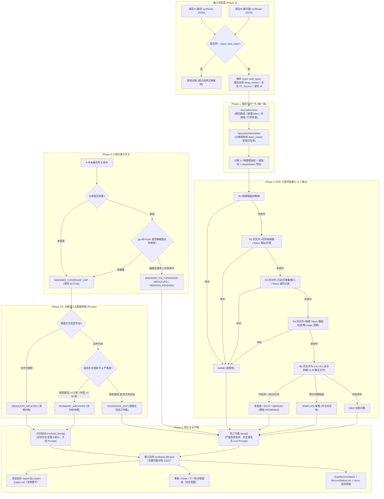
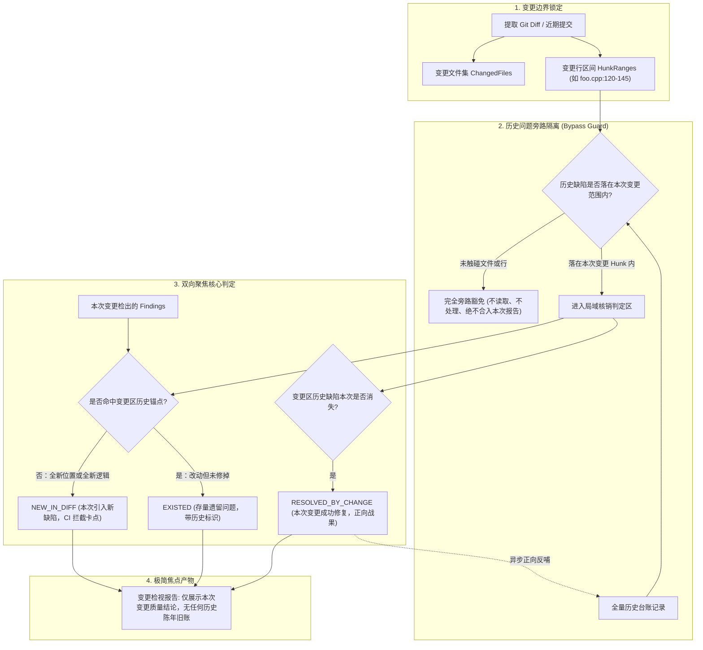

# 同一代码仓多次扫描问题清单的系统化对账与增量治理架构设计

> **版本**：v1.0
> **状态**：Ready for Design Review & Implementation
> **专题归属**：CodeShield 确定性源码指纹与抗抖动增量生命周期架构 (Deterministic Fingerprint Architecture)
> **关联基线**：[01](./01-确定性源码指纹与抗抖动增量生命周期架构设计.md) / [02](./02-基于现网实测的确定性指纹演进与多任务通用分类收敛设计.md) / [03](./03-实测复盘-现网连续扫描重复缺陷无法识别归因分析报告.md) / [04](./04-下一代确定性缺陷生命周期与空间几何对齐架构设计.md)
> **实测样本**：同一代码仓 `XY_Source/sf` 两次全量 deep_review 扫描
> - 基线报告 A：`2026-09-03/report-19371-synthesis-XY_Source-sf.json`（91 条）
> - 新扫描报告 B：`2026-09-04/report-19375-synthesis-XY_Source-sf.json`（60 条）
>
> **核心使命**：为"同一个代码仓、同一任务类型下，扫出新清单（如 19375）后必须与前一份同仓报告（如 19371）做系统性对账"这一日常高频场景，设计一套**报告对报告 (Report-to-Report, R2R) 对账引擎**与**增量治理报告**闭环。它在 01/04 确立的"物理锚点为身份、代码未动永不自动关闭"地基之上，补齐"以合成报告工件为输入的事后对账 — 结果分类 — 持久化 — 增量可视化"这最后一公里。

---

## 一、 背景与问题定义

### 1.1 一线真实诉求

我们每天都会对同一个代码仓反复执行相同的扫描任务（例如 deep_review 全量扫描）。当**新的问题清单（synthesis JSON）产出后**，不能只把它当作"一份新报告"查看，而必须**极其认真地和上一轮同仓报告做系统对账**：

1. 哪些"新问题"其实是同一缺陷换了说法？（必须关联到历史实体，继承人工反馈）
2. 哪些是真正不同的新问题？（必须精确标记，不能因为 fingerprint 变了就误当 NEW，也不能因为文件不同就把并行组件里的另一实例合并成一个 bug）
3. 上一轮有、本轮没再报出的问题，到底是什么状态？（**代码没改 = 覆盖缺口，绝不允许当成已修复**；代码改了 = 修复候选，需要证据链）
4. 一轮里"一条拆成两条 / 两条并成一条 / 同函数两个视角"怎么归并？
5. 同一个缺陷模板在多个组件里各有一份，如何聚簇展示而不是重复刷屏或合并误伤？

### 1.2 现状能力差距（以 19371 vs 19375 为例）

对这两份报告的深入分析（结果已确认）暴露出现有实现面对该场景的 4 大缺口：

| 缺口 | 现象（19371 vs 19375） | 根因 |
| :--- | :--- | :--- |
| **G1 在线对账绑定 DB，无工件级事后对账** | 两份 synthesis JSON 中 `repo_id / task_type_id / id` 全部为 0，是**纯报告工件**；而现有 `DiffAndEnrichFindings`（`engine_debate.go` → `services/diff_engine.go`）只在扫描入库时依赖 `DefectFingerprintRecord` 打标，无法对已落盘的两份报告做"事后/离线/补账"对账 | 对账逻辑与数据库记录强耦合，报告层面没有独立的对账数据面 |
| **G2 漏斗只能处理"同文件+同作用域"** | fingerprint 完全一致仅 3 条；人工/语义可确定相同的 **18 组**中大多数没被现有 Tier1/Tier2 命中（如枚举头文件重定义、作用域名漂移、触发行选偏） | 现有 Tier2 以 `(path, normalized_scope)` 为桶，作用域漂移、行区间漂移、同函数多视角没有报告级处理 |
| **G3 没有"未复现≠修复"的显式产物** | R1 独有约 50 条；由于代码未变，它们全部应是**覆盖缺口（覆盖率问题）**，绝不 RESOLVED；但报告层面没有把 VANISHED 细分展示 | 修复判定只发生在在线引擎内部，报告里没有 VANISHED 分类与原因 |
| **G4 没有"拆/并/模板族/视角"建模** | R1#0→R2#7+R2#8（同函数两个视角）；R1#57→R2#0+R2#1（一条拆两条）；R1#82→R2#53+R2#54；R1#24↔R2#3 是同模板另一组件实例 | 数据模型只有单条 finding 的 diff_status，没有"链接/关系/族"一级实体 |

### 1.3 实测样本的关键量化结论（作为需求输入与金标基线）

对 19371 / 19375（同一代码，文件时间戳均早于两次扫描，无代码变更）的人工+语义对账结论：

| 结论类别 | 数量 | 说明 |
| :--- | :---: | :--- |
| `fingerprint` 完全一致 | 3 | `12e02554` / `bcf605fa` / `bb3e4973` |
| **可确定相同的 18 组** | 18 组 | 覆盖 R1 18 条 ↔ R2 22 条；其中多条为 1:N 多视角 / N:1 合并关系 |
| R2 独有（第一轮未报） | ~35 条 | 其中 ~3 条为同模板另一组件实例，其余为真正新发现位置 |
| R1 独有（第二轮未复现） | ~50 条 | **代码未变 ⇒ 全部应为覆盖率缺口，RESOLVED 必须为 0** |
| 第一轮内部重复 | 1 | `SfpcMachineConstantHandler.h` 的 `SetTargetPositon`（fingerprint `81fa…`）被重复归两类，应对账时吸收 |
| 同模板簇样例 | 4 | SFMCMCPManager/SFPSVIPMCPManager、sfmc/sfpsvip SetMessageByVector、SFMCMC.proto/SFPCMC.proto、smg_control_p3/smg_state_p3 |
| 严重度冲突样例 | ≥1 | 同一 OOB（sfmc SetMessageByVector）R1 评"建议"、R2 评"致命"，必须保留区间并标 triage |

---

## 二、 设计原则（在 01/04 之上的增量原则）

沿用并强化既有原则：

- **P1 物理锚点是唯一身份**（04）：`(RepoID, TaskTypeID, NormalizedPath, NormalizedScope, PhysicalToken)`。
- **P2 代码未动，缺陷永不自动关闭**（04）：`VANISHED` 在没有代码变更证据时只能是覆盖率缺口。
- **P3 身份与载荷双轨解耦**（04）：对账只依赖物理锚点；title/category/severity 是载荷，用于润色与统计。

针对"报告对报告"场景新增四条原则：

- **P4 报告工件也是 SSOT 输入**：对账引擎以 `report-{id}-synthesis-{repo}.json` 为**主输入**（可离线、可补账、可复现）；数据库只是可选的读写面，不作为对账的先决条件。报告工件缺失的 `repo_id/task_type_id` 必须能从报告命名/目录上下文（如 `deep_review` + `XY_Source` + `sf`）推导，见 §3.2。
- **P5 结论分级，宁可不合并不误合并**：对账链接要带**置信度分级**（`SAME` 自动 / `PROBABLE` 待确认 / `DIFFERENT`）与**关系类型**（多视角、真拆分、真合并、模板族）。模板族只**聚簇展示**、绝不合并实体，防止把两个组件的同一缺陷模板误当成一个 bug 而漏修。
- **P6 一报告原则（Single-Report）**：对账的事实结果（`recon-*.json`）是持久化的**数据工件**；人类面向始终只有一份 `report-{id}-report-{repo}.md`，对账结论以"增量概要 / 条目徽标 / 跨轮治理结论"内嵌其中，不再新增独立人类报告。
- **P7 台账有界与动态退火归档原则（Bounded Ledger & Dynamic Annealing Pruning）**：台账绝不能随扫描轮次累加而无限膨胀。必须按严重度实行**“热台账活跃、冷数据休眠”**的分级退火机制：物理文件删除即刻移除；低危建议类连续多轮未复现自动降级休眠（移出热工作集，不进 LLM Prompt、不刷屏主报告）；高危漏洞恪守“永不冷寂”铁律，防止安全盲区；冷归档条目若未来被再次检出，立即无损唤醒回热台账，保持历史血统。
- **P8 任务类型模式自适应原则（Task-Adaptive Governance Mode）**：不同检视任务具有本质不同的业务使命，但在底层治理机制上只需精准划分为**两大本质正交模式**，避免无谓的概念虚增：
  1. **全量基线台账模式（Full Ledger Mode，`full_ledger`）**：涵盖综合代码检视（`deep_review`）以及**所有专项检视（如 `coredump_risk`、`memory_leak`、`thread_create` 等）**。它们均面向整仓（或全量特征语言文件）进行巡检，在各自独立的 `TaskTypeID` 命名空间下维护完整 SSOT 台账，管理长周期覆盖缺口与退火归档；
  2. **变更增量焦点模式（Change Delta Focus Mode，`change_focus`）**：涵盖近期变更检视（`change_review`）、PR/MR 门禁与 CI 提交卡点。**严格实行“历史无关问题旁路隔离”**——未被本次变更触碰的文件与历史存量问题**绝对不拉取、不处理、不合入本报告**；双向聚焦于“本次改动新引入缺陷（NEW_IN_DIFF）”与“本次改动是否修复了触碰的历史缺陷（PROOF_OF_FIX）”，彻底杜绝陈年旧账刷屏干扰变更评审。

---

## 三、 总体架构：Report-to-Report 对账引擎

### 3.1 架构总览

新增独立模块 `services/reconciliation/`，与既有 `services/diff_engine.go` 并存、互补（边界见 §10）。



### 3.2 输入判定与仓库解析（Phase 0）

- **同一性判定**：对账前提是 `BaseReport` 与 `CurrentReport` 属于同一 `(Repo, TaskType)`。优先读报告元数据（`TaskReport.RepoID / TaskTypeID`）；当 synthesis 工件内字段为 0 时（19371/19375 正是如此），按以下规则推导：
  1. `task_type` ← 报告目录名（`deep_review` → `tasks/deep-review`）；
  2. `repo` ← 报告文件名中继仓名（`XY_Source`）→ 通过 `Repository` 表名称匹配；
  3. `sub_campaign` ← 文件名后缀（`-sf`）→ 映射到仓库物理子目录 `sf` 作为对账根；
  4. 推导失败则拒绝对账并返回人工选择引导。
- **覆盖率集合**：两份报告各自应携带"本次扫描的有效文件集合 `scannedFiles`"。若工件未记录，则用仓库全量清单（`git ls-files` 或目录遍历）兜底；该集合用于 VANISHED 判定（见 §7）。
- **代码变更证据**：可选输入 `base_commit / head_commit`（或两份报告各自对应的 commit），用于 §7 的修复判定。若两者相同或无法取得，默认"仓库未变更"（安全侧，走覆盖缺口）。

### 3.3 Phase 1：锚定与归一化（复用既有能力）

对两份报告中的每一条执行：

1. `SourceEnricher.EnrichSourceAnchor(repoRoot, filePath, lineNumber, triggerLine)`：读取物理源码，校准行号（局部 ±15 行滑动），提取 `PhysicalToken`、`NormalizedScope`、`ScopeBodyHash`；
2. `TaxonomyNormalizer` 或通用 `SanitizeCategory`：把 `category` 吸附到任务受控白名单（deep_review 共有 17 类）；
3. 计算 `CalculateDefectFingerprint`（L1）与 `CalculateWeakScopeFingerprint`（L2，不含 Category）；
4. 规范化载有业务信息中已被验证不可靠的字段：`line_number` 只作为**参考锚点**，不参与强匹配；`title/detail/hunter_claim/challenger_arg/judge_verdict` 一律不参与匹配。

> **重要**：即使 `line_number` 为空或错误（实测 R2#47 把 kill-java 的行号标成 20、真实在 233），只要 `trigger_line` 存在，`SourceEnricher` 通过物理 Token 全文/邻近检索即可锚定到真实行。

### 3.4 Phase 2：R2R 六层对账漏斗（核心算法）

对 B 的每一条 `b`，**严格 1:1 独占认领**（复用 `claimedRecordIDs` 思路，跨层共享），由高到低逐层寻找 A 的最优匹配 `a`：

| 层 | 匹配条件（全部基于物理锚点） | 判定 | 典型场景 |
| :--- | :--- | :--- | :--- |
| **R1** | `L1 强指纹` 精确相等 | `SAME`（高） | 同一物理行、同一作用域（19371/19375 命中的 3 条） |
| **R2** | 同文件 + 同 `NormalizedScope` 桶，且 `(lineDiff≤2 && Jaccard>0.5) \|\| Jaccard>0.75 \|\| (同分类 && (lineDiff≤15 \|\| Jaccard>0.65))` | `SAME`（高） | 触发行选偏 1~2 行、namespace 前缀有/无 |
| **R3** | 同文件 + 行区间重叠或窗口≤30 + 物理 Token Jaccard>0.5 或同分类 | `SAME`（中高） | **作用域/枚举符号漂移**（如 `SFDMCPF_mcpdef.h` 枚举重定义，R1#1↔R2#10 属于此类） |
| **R4** | 同文件 + `CleanSourceToken` 完全/高度相似（Jaccard>0.85）而 scope 漂移 | `SAME`（中高） | 函数被重命名/合并导致的 scope 漂移，但触发行文字未变 |
| **R5** | 同文件内**残差集合二部图对齐**（该文件同时存在未命中 A 集合与未命中 B 集合），由 Native Thin LLM 一次性判定 | `SAME`（降级 `PROBABLE` 待确认） | 1:N 拆成 / N:1 合并 / 深度重构（复用 04 §4.5 的集合对齐协议与双射守卫） |
| **R6** | **跨文件模板族**：不同文件，但（规范化 scope + 分类相同）或物理 Token 高度相似，或语义嵌入相似度 > 阈值 | `TEMPLATE`（聚簇，**不合并实体**） | SFMCMCPManager 与 SFPSVIPMCPManager；sfmc/sfpsvip 各自 SetMessageByVector；SFMCMC.proto/SFPCMC.proto；smg_control_p3/smg_state_p3 |

关键规则与约束：

- **多视角规则（MULTI_VIEW）**：当多个 B 条目落在 A 的**同一物理锚点区域**（同文件+同 scope+同 Token 邻域）时，若它们描述的是同一根因的不同侧面（如 SFCMCPF_pcp2mcp.py：R1#0"缺值域校验" ↔ R2#7"死代码" + R2#8"缺校验"），判定为 `SAME_MULTI_VIEW`，**在展示层合并为一个实体、payload 取并集**，并标记"同一锚点，多视角重复上报（建议人工消重）"。
- **真拆分 vs 多视角**：只有物理锚点区域发生**实质分叉**（不同触发行、不同作用域、逻辑上独立的两类缺陷）才记为 `SPLIT_FROM`（保留父实体挂牌，子实体独立管理）；同一区域内 1:N 一律优先判定 `SAME_MULTI_VIEW`，避免误拆。
- **双射守卫**：R5/PROBABLE 的映射结果必须满足 1:1 合法性；跨层认领互斥，禁止一个 A 实例被两个 B 条目静默占用（`claimedRecordIDs` 贯穿 R1~R5）。
- **模板族只聚簇**：族内每个实例独立 ID、独立生命周期、独立修复跟踪，看板按 `template_family_id` 聚合展示"该模板共 N 处实例"，但不自动合并。

### 3.5 Phase 3：A 侧 VANISHED 分类与修复判定

对所有未被任何 B 命中的 A 条目 `a`：

```
if 仓库未变更 (base_commit == head_commit 或内容 Hash 全等):
    a → VANISHED_COVERAGE_GAP      # 覆盖率/漏报缺口，保持 ACTIVE，DiffStatus=EXISTED
elif git diff Hunk 未触碰 a 所在作用域（L1 文件 Hash 或 L2 scopeBody Hash 守卫，复用 04 §4.2）:
    a → VANISHED_COVERAGE_GAP
elif 作用域已物理变更且当前连续两轮未命中:
    if 高危: a → VANISHED_FIX_CANDIDATE / VERIFIED_PENDING（预关闭缓冲）
    else:    a → VANISHED_FIX_CANDIDATE / RESOLVED（附带 Proof of Fix，见 04 §4.7）
else:
    a → VANISHED_COVERAGE_GAP      # 观察期内，missed_count+1
```

**硬性不变量**：当 `repo_unchanged == true` 时，对账输出中 `RESOLVED_FROM_VANISHED == 0`。这一断言写入单测与阶段验收，直接避免"同一份代码 50 条问题被误判修复"的灾难。

### 3.6 Phase 3.5：台账动态退火归档与膨胀抑制机制（Ledger Annealing & Pruning）

#### 3.6.1 膨胀治理的必要性
若只进不出地把所有未复现缺陷无限累加，在经过数十轮持续扫描后，synthesis 台账的条目数将呈现无界线性膨胀（可能从数十条激增至上千条）。这不仅会导致下游 LLM Synthesis Prompt 超长溢出、导出报告耗时激增，更会让研发团队被早已无治理价值的历史低置信边缘噪音长期刷屏。为此，系统建立**“热台账活跃、冷数据休眠、重新检出秒级唤醒”**的分级退火机制：

```
                              ┌──────────────────────────────────────────────┐
                              │ A 侧未复现条目 (VANISHED_COVERAGE_GAP)         │
                              └──────────────────────┬───────────────────────┘
                                                     │
                                   ┌─────────────────┴─────────────────┐
                                   ▼                                   ▼
                         物理文件在 Git 树已删除?              物理文件依然存在
                                   │                                   │
                                   ▼                                   ▼
                       【OBSOLETE_DELETED】             严重度分级连续未复现退火 (Annealing)
                        随文件物理移除，直接归档                │
                                                     ┌─────────┴─────────┐
                                                     ▼                   ▼
                                            低危/建议 (>=5轮)      高危/致命 (CRITICAL/HIGH)
                                            中危告警 (>=10轮)             │
                                                     │                   ▼
                                                     ▼           【高危永不冷寂铁律】
                                            【DORMANT_ARCHIVED】  强制保留在热台账 items[]
                                            移入冷归档池休眠      持续告警，绝不静默掩埋
```

#### 3.6.2 四级动态剪枝与退火阶梯

| 阶梯 | 触发条件 | 处置动作 | 目标产物流向 | 历史语义 |
| :--- | :--- | :--- | :--- | :--- |
| **L1 物理文件删除清理** | 物理文件在当前 Git HEAD 或磁盘上已不存在（`git ls-files` 确认已移除） | 状态置为 `OBSOLETE_DELETED`，移出活动台账 | 写入 `archived_items[]` | 源码载体已销毁，缺陷自然失效 |
| **L2 低中危退火衰减** | 低危/建议项连续 5 轮全量扫描未复现；或中危项连续 10 轮未复现（且代码未变） | 状态置为 `DORMANT_ARCHIVED`（休眠归档），移出活动台账 | 写入 `archived_items[]`，**不进 LLM Prompt，不刷屏主报告** | 判定为偶发概率噪音或边际价值极低项，冷藏降噪 |
| **L3 高危永不冷寂** | 高危（`HIGH`/`严重`）与致命（`CRITICAL`/`致命`）漏洞，无论未复现多少轮 | **绝对禁止自动休眠！** 强制维持在热台账并保持 `ACTIVE` | 保留在 `items[]`，挂牌 `COVERAGE_GAP(高危漏扫关注)` | 杜绝严重安全隐患在时间流逝中被悄然掩埋 |
| **L4 人工豁免即时归档** | 经人工确认并审批为 `FALSE_POSITIVE`（误报）或 `WONT_FIX`（暂不修复） | 状态置为 `EXEMPTED_ARCHIVED` | 写入 `archived_items[]`，下次对账起不再计入热工作集 | 人工已完成治理闭环，不再刷屏 |

#### 3.6.3 重新检出即刻无损唤醒（Seamless Resurrection on Detection）
冷归档**绝非物理删除**。当后续某一轮扫描中，大模型重新检出已处于 `DORMANT_ARCHIVED` 状态的历史缺陷时：
1. **优先查冷库**：对账漏斗在热工作集未匹配时，自动秒级检索冷归档池索引；
2. **血统无损继承**：命中后立即执行**唤醒（Resurrect）**，状态重置为 `ACTIVE`，`rounds_seen` 追加本轮，从 `archived_items[]` 迁回 `items[]`；
3. **精准打标**：对账关系判定为 `EXISTED`（存量唤醒），**绝不误判为 NEW**，完整继承该缺陷的首次发现时间、历史评价与人工审计记录。

### 3.7 多任务类型治理模式路由体系（Multi-Task Governance Modes）

#### 3.7.1 业务诉求分化：为何不能“一刀切”套用全量台账模式？
CodeShield 在一线承载了多种不同属性的扫描任务。如果用 `deep_review` 的全量台账对账模式机械地套用所有任务，会在“近期变更检视”（`change_review`）场景下引发灾难性体验：

- **典型冲突场景**：工程共 5,000 个源文件，开发者提交了一个分支 PR，最近 7 天仅修改了 2 个文件（如修复了 1 个逻辑 bug）。此时执行 `change_review`，扫描器物理上只提取并分析了这 2 个变更文件；
- **全量模式带来的灾难**：若机械执行全量对账，其余 4,998 个未修改文件中的上百条历史缺陷在本次扫描中必然全部“消失”。全量引擎会将它们全数判定为 `VANISHED_COVERAGE_GAP`，并强行合入本次报告；
- **一线负面反馈**：“开发者只改动了 2 行代码，打开近期变更检视报告却赫然看到 200 条陈年旧账；真正与本次改动相关的告警被彻底淹没”。这彻底摧毁了增量门禁的审查效率与工具信任度。

**结论**：不同检视任务的治理使命存在本质区别。**“近期变更检视”的核心使命是变更增量卡点，历史无关存量问题必须完全旁路隔离，绝不允许拉取、合入并刷屏！**

#### 3.7.2 两大本质治理模式技术规范矩阵

经深入分析，系统底层治理引擎本质上只需支持**两大互斥且完备的核心模式**。所有专项检视任务（如 `coredump_risk`、`memory_leak`、`thread_create` 等）在治理机制上天然等同于全量基线台账模式，无需额外虚增概念：

| 维度 | **模式 A：全量基线台账模式 (`full_ledger`)** | **模式 B：变更增量焦点模式 (`change_focus`)** |
| :--- | :--- | :--- |
| **代表任务** | **全量深度检视（`deep_review`）以及所有专项检视（`coredump_risk`、`memory_leak`、`cjson_scan` 等）** | **近期变更检视（`change_review`）、PR / MR 门禁、分支 Diff 审查** |
| **扫描范围** | 全仓源码（或命中特定后缀/引用的全量特征文件） | **仅近期提交变动文件与 Diff Hunks（`since_days` > 0 或 PR Diff）** |
| **历史问题策略** | **全量维护**：继承历史台账，追踪覆盖缺口，维护完整 SSOT | **完全物理旁路隔离（Bypass）**：未被本次变更触碰的历史问题**不读取、不处理、不合入** |
| **VANISHED 处理** | 代码未动 = `COVERAGE_GAP`；代码变动 = 观察修复候选 | **绝不产生 `COVERAGE_GAP`**！不在本次变动范围内的历史问题直接忽略 |
| **历史修复判定** | 双层物理守卫 + 连续两轮未命中平滑观察期 | **顺带核销（Proof of Fix 反哺）**：变动行若正好触碰历史锚点且隐患消失，顺带核销并反哺全量库 |
| **产物输出形式** | 完整问题台账 `synthesis.json`（含存量、缺口、冷归档）+ 全量 Markdown 报告 | **纯变更焦点报告**（仅含“本次变更引入新缺陷”与“顺带修复历史缺陷”） |

> 🔍 **深度释疑：为什么专项检视（如 `coredump_risk`、`memory_leak`）不需要单独设立模式？**
> 1. **对账与生命周期机制完全同构**：无论全量综合还是专项，扫描范围都是整仓或全局匹配文件；未复现的内存泄漏同样是 `COVERAGE_GAP`，同样受“代码未动永不自动关闭”守卫约束，同样遵循连续 5 轮未复现退火休眠机制；
> 2. **身份空间早已天然隔离**：在数据模型与确定性指纹定义中，`TaskTypeID` 早已是联合索引和哈希种子的一部分（`SHA256(RepoID + TaskTypeID + Path + Scope + Trigger)`）。`coredump_risk` 与 `deep_review` 拥有各自独立的数据库指纹池和独立的 `synthesis.json`，在物理上绝不会交叉干扰；
> 3. **领域差异属于业务规则配置，而非引擎治理模式**：专项扫描的“狭窄与穿透性”是由其专有的 Prompt 规则与分类白名单（Taxonomy）决定的（配置在 `tasks/*/meta.json` 中），底层对账治理引擎处理的数据流依然是标准的 `full_ledger`。
> 
> 因此，遵循**奥卡姆剃刀原则（如无必要，勿增实体）**，将系统底层治理模式精简收敛为互斥完备的**二元结构**：`full_ledger` 与 `change_focus`。

#### 3.7.3 变更增量焦点模式（`change_focus`）的专项工作流

在 `change_focus` 模式下，对账引擎执行**“历史旁路、局域比对、顺带核销”**极简闭环：



1. **历史旁路过滤器（Historical Bypass Filter）**：
   - 严格以 `changed_files` 为第一道物理隔离带。数据库查询或基线加载强制加入 `WHERE file_path IN (changed_files)`；
   - 任何未被变更文件触碰的历史条目，**绝对禁止载入对账引擎**，从根源上杜绝未修改文件中的缺陷被误判为 `VANISHED_COVERAGE_GAP`；
2. **“双向聚焦”判定逻辑（只报新增、顺带销账）**：
   - **向后防线（报新）**：对于本次变更中检出的 Findings：
     - 若未匹配到该文件变动区内的既有锚点，判定为 **`NEW_IN_DIFF`（本次变更真正引入的增量缺陷）**，作为质量红线和 CI/CD 门禁拦截基准；
     - 若匹配到既有锚点，判定为 `EXISTED`（说明本次改动虽然触碰了该区域，但并未解决既有缺陷）；
   - **向前防线（销账）**：对于历史库中原本记录在变动区内（`LineStart/LineEnd` 处于 Git Hunk 内）的 `ACTIVE` 缺陷：
     - 若在本次变更检出中**完全消失**，且 Git Diff 证据链证明该作用域已被实质重写；
     - 判定该历史缺陷已被本次提交成功修复（`RESOLVED_BY_CHANGE`，产生 Proof of Fix 证据）；
     - **异步反哺**：将修复结论写回中央数据库中的历史台账记录（状态变更为 `RESOLVED`）；
     - **正向反馈**：在本次变更报告中以**“本次变更顺带修复的历史缺陷”**突出展示，给予开发者正向治理激励；
3. **变更检视人类报告的极简呈现**：
   - 变更报告的第一节固定呈现为：
     > **【本次变更质量结论】**  
     > - 涉及变动文件：`2` 个；  
     > - **本次引入新缺陷：`0` 条（✅ 准予合入 / 门禁通过）**；  
     > - 顺带修复历史缺陷：`1` 条（🎉 `F19371-65` 读共享机器常数未加锁已修复）；  
     > - 变更区遗留未修缺陷：`0` 条。
   - 正文仅平铺上述涉及的条目，**不展示任何未修改文件的历史缺陷**，彻底消除研发人员的干扰与抱怨。

---

## 四、 数据模型演进（`models/models.go` 新增）

### 4.1 `ScanReconciliation`（一次"新报告 vs 基线报告"对账记录）

```go
// ScanReconciliation 报告对报告对账会话记录 (R2R Reconciliation Session)
type ScanReconciliation struct {
	ID              uint `gorm:"primaryKey;autoIncrement" json:"id"`
	RepoID          uint `gorm:"index;not null" json:"repo_id"`
	TaskTypeID      uint `gorm:"index;not null" json:"task_type_id"`

	// 两份报告工件路径（跨磁盘可复现）
	BaseReportID        uint   `gorm:"index" json:"base_report_id"`
	CurrentReportID     uint   `gorm:"index" json:"current_report_id"`
	BaseSynthesisPath   string `gorm:"size:512" json:"base_synthesis_path"`
	CurrentSynthesisPath string `gorm:"size:512" json:"current_synthesis_path"`

	// 代码变更证据（修复判定输入）
	BaseCommit    string `gorm:"size:64" json:"base_commit"`
	HeadCommit    string `gorm:"size:64" json:"head_commit"`
	RepoUnchanged bool   `json:"repo_unchanged"` // true ⇒ 永不产生 RESOLVED_FROM_VANISHED

	// 汇总统计
	NewCount             int `json:"new_count"`
	ExistedCount         int `json:"existed_count"`
	VanishedCoverageGap  int `json:"vanished_coverage_gap"`
	VanishedFixCandidate int `json:"vanished_fix_candidate"`
	MultiViewMerged      int `json:"multi_view_merged"`
	SplitCount           int `json:"split_count"`
	TemplateFamilyCount  int `json:"template_family_count"`

	// 膨胀治理与归档统计 (Phase 3.5)
	ActiveWorkingCount   int `json:"active_working_count"`   // 当前活动工作集条目数 (items[])
	DormantArchivedCount int `json:"dormant_archived_count"` // 连续未复现退火休眠数 (archived_items[])
	ObsoleteDeletedCount int `json:"obsolete_deleted_count"` // 物理文件已删除清理数

	// 任务模式与变更焦点 (Phase 3.7)
	GovernanceMode        string `gorm:"size:32;default:'full_ledger';index" json:"governance_mode"` // full_ledger (全量基线台账) / change_focus (变更增量焦点)
	ResolvedByChangeCount int    `json:"resolved_by_change_count"`                                   // 变更焦点模式下顺带核销历史缺陷数

	Status    string         `gorm:"size:32;default:'pending';index" json:"status"` // pending / confirmed / archived
	CreatedAt time.Time      `json:"created_at"`
	UpdatedAt time.Time      `json:"updated_at"`
}
```

### 4.2 `ReconciliationLink`（每条对账链接，关系事实表）

```go
// ReconciliationLink 报告间对账链接（B↔A 或 A 侧 VANISHED，含置信与关系）
type ReconciliationLink struct {
	ID       uint `gorm:"primaryKey;autoIncrement" json:"id"`
	ReconID  uint `gorm:"index;not null" json:"recon_id"`

	// 稳定物理身份绑定（取代脆弱的数组下标，保证重排、过滤后引用不丢）
	BaseFP         string `gorm:"size:64;index" json:"base_fp"`
	CurrentFP      string `gorm:"size:64;index" json:"current_fp"`
	BaseItemUID    string `gorm:"size:64;index" json:"base_item_uid"`    // A 条目稳定标识符
	CurrentItemUID string `gorm:"size:64;index" json:"current_item_uid"` // B 条目稳定标识符
	BaseScope      string `gorm:"size:256" json:"base_scope"`
	CurrScope      string `gorm:"size:256" json:"curr_scope"`

	MatchedTier int     `gorm:"default:0" json:"matched_tier"` // R1..R6 = 1..6; 0 = 无匹配
	Confidence  float64 `gorm:"default:0" json:"confidence"`   // 0~1
	Relation    string  `gorm:"size:40;index" json:"relation"` // SAME / SAME_MULTI_VIEW / PROBABLE / SPLIT_FROM / MERGED_INTO / TEMPLATE / VANISHED_COVERAGE_GAP / VANISHED_FIX_CANDIDATE / DORMANT_ARCHIVED / OBSOLETE_DELETED / RESURRECTED / NEW

	// 模板族 (TEMPLATE 关系时)
	TemplateFamilyID string `gorm:"size:40;index" json:"template_family_id"`

	Reason      string     `gorm:"type:text" json:"reason"` // 匹配依据或 LLM 仲裁摘要
	Confirmed   bool       `gorm:"default:false" json:"confirmed"`
	ConfirmedBy *uint      `json:"confirmed_by"`
	ConfirmedAt *time.Time `json:"confirmed_at"`
	CreatedAt   time.Time  `json:"created_at"`
}
```

### 4.3 写回策略

1. **B 侧**：把每条 B 的 `DiffStatus` 写回 `AnalysisFinding`：`SAME* → EXISTED`；`NEW → NEW`；`REOPENED`（基线对应记录已 RESOLVED 时）。
2. **A 侧**：`VANISHED_COVERAGE_GAP` 保持 `DefectFingerprintRecord.Status = ACTIVE`；`VANISHED_FIX_CANDIDATE` 走 04 §4.7 的 Proof of Fix 流程。
3. **基线播种（迁移/补账）**：当 19371/19375 这批工件从未正确入库时，对账引擎可"以 A 为基线上卷生成 `DefectFingerprintRecord`"，从而让**下一次在线扫描的 `DiffAndEnrichFindings` 从一开始就有正确基线**（对齐 04 §4.6 的无损迁移思路）。这是离线对账 → 在线增量的衔接点。

---

## 五、 产物设计：Synthesis 修订为完整问题台账（SSOT）与单一人类报告

### 5.0 设计决定（两件事）

1. **Synthesis 修订为"截至本轮的完整问题台账"（SSOT，基准）**：`report-{id}-synthesis-{repo}.json` 不再只是"本轮发现的清单"，而是把对账结果合入后的**完整清单**——本轮真正新增、与上轮一致的（标记为历史发现/存量）、以及本轮未复现但代码未变的（补入并标注覆盖缺口）都在里面。它是后续报告、看板、Excel、下一轮对账、甚至 DB 重建的**唯一基准**。
2. **人类只保留一份报告**：对账结论内嵌进现有 `report-{id}-report-{repo}.md`（见 5.3），不新增独立人类报告。

为何必须"修订 synthesis"而不是另起一个基准文件：

- **消除双基准漂移**：若有"合成 JSON（本轮）"和"recon JSON（对账）"两份基准，必然出现口径不一致；
- **终结幽灵复活**：漏扫的问题不再从基准中消失，"未复现（覆盖缺口）"明确在册，后续轮次不会被当成 NEW 重新报出、也不会被当作已修复；
- **后续工作只认一份文件**：synthesis 即基准，任何下游都从它派生，可离线、可归档、可复现（对齐 P4）。

### 5.1 修订后 synthesis 的契约（完整问题台账）

#### 5.1.1 条目语义与生命周期字段

台账每条 = 一个**实体**（物理锚点为身份），并携带**观察历史与退火状态**。新增/修订字段：

| 字段 | 说明 |
| :--- | :--- |
| `fingerprint` | 物理锚点 L1 强指纹（稳定身份，跨轮不变） |
| `item_uid` | 条目在报告内的全局唯一业务标识符（如 `F19375-01`），替代脆弱的数组下标 |
| `diff_status` | 本轮视角：`NEW` / `EXISTED`(历史发现) / `REOPENED` / `RESURRECTED`(休眠唤醒) |
| `lifecycle_status` | 台账视角：`ACTIVE` / `COVERAGE_GAP` / `DORMANT_ARCHIVED` / `OBSOLETE_DELETED` / `VERIFIED_PENDING` / `RESOLVED` |
| `rounds_seen` | 依次记录在哪些报告轮次中被检出（如 `[19371, 19375]`）；"本轮是否出现" = `rounds_seen[-1] == 本轮` |
| `first_seen_report` / `last_seen_report` | 首次 / 最近检出轮次 |
| `consecutive_missed_rounds` | 连续未命中轮次计数（用于 L2 退火休眠判定） |
| `missed_count` | 物理代码已变更时的连续未命中计数（用于 L1 修复确认观察期） |
| `coverage_gap` | 布尔：本轮未复现但因代码未变而保留的状态 |
| `template_family_id` | 跨组件同模板聚簇 ID（不合并实体） |
| `recon_relation` / `recon_base_uid` | 本轮对账关系（SAME / MULTI_VIEW / SPLIT / TEMPLATE）与基线条目唯一标识 |
| `archive_reason` | 归档原因（`OBSOLETE_DELETED` / `DORMANT_ANNEALED` / `EXEMPTED_MANUAL`） |
| `archived_at` | 归档时间戳（流转至 `archived_items` 时记录） |
| `payload` | 最新一次观测的认知载荷（title/detail/severity/category/trigger_line/code_snippet 等） |

#### 5.1.2 什么是"完整清单"（热工作集 + 冷归档池）

对账后 `report-{B}-synthesis-{repo}.json` 规范为**冷热分流的双容器架构**：
- **`items[]`（活动工作集，Active Working Set）**：包含 B 全部检出条目 + 未达休眠阈值的覆盖缺口条目（严格受控有界，供主报告渲染与 LLM 综合 Prompt 注入）；
- **`archived_items[]`（冷归档池，Cold Archive Pool）**：包含物理删除清理项、连续多轮未复现休眠项、人工豁免项（**绝不进入 LLM Prompt**，仅供历史查重与审计）。

```json
{
  "meta": {
    "report_id": 19375,
    "base_report_id": 19371,
    "repo_id": 12,
    "task_type_id": 3,
    "commit_hash": "600dd20...",
    "repo_unchanged": true,
    "active_count": 65,
    "archived_count": 28,
    "reconciled_at": "2026-09-04T09:30:00+08:00"
  },
  "items": [
    {
      "fingerprint": "12f5...", "item_uid": "F19375-01", "diff_status": "NEW", "lifecycle_status": "ACTIVE",
      "file_path": "sfmc/src/SfmBusinessDataHandler.cpp", "line_number": "587-590",
      "rounds_seen": [19375], "first_seen_report": 19375, "last_seen_report": 19375,
      "consecutive_missed_rounds": 0, "coverage_gap": false, "template_family_id": "",
      "payload": {"title": "GetMMDC values[i] 无下标保护", "severity": "建议", "category": "逻辑与正确性-边界处理"}
    },
    {
      "fingerprint": "bcf6...", "item_uid": "F19375-02", "diff_status": "EXISTED", "lifecycle_status": "ACTIVE",
      "file_path": "sfmc/src/SfmMachineConstantHandler.cpp", "line_number": "110-168",
      "rounds_seen": [19371, 19375], "first_seen_report": 19371, "last_seen_report": 19375,
      "consecutive_missed_rounds": 0, "recon_relation": "SAME", "recon_base_uid": "F19371-65",
      "payload": {"title": "GetSfmcLoopInterval/DeliveryConstants 读共享机器常数未加锁", "severity": "建议"}
    },
    {
      "fingerprint": "9e45...", "item_uid": "F19375-03", "diff_status": "EXISTED(未复现)", "lifecycle_status": "COVERAGE_GAP",
      "file_path": "sfpsvip/src/SFPSVIPMCPManager.cpp", "line_number": "39-82",
      "rounds_seen": [19371], "last_seen_report": 19371,
      "consecutive_missed_rounds": 1, "coverage_gap": true, "note": "本轮未复现；仓库未变，第1轮未命中，保留在活动集",
      "payload": {"title": "versionType 无同步读写竞态（该组件实例）", "severity": "建议"}
    }
  ],
  "archived_items": [
    {
      "fingerprint": "3c88...", "item_uid": "F19371-88", "diff_status": "DORMANT", "lifecycle_status": "DORMANT_ARCHIVED",
      "file_path": "sfmc/src/LegacyHelper.cpp", "line_number": "12-15",
      "rounds_seen": [19360], "last_seen_report": 19360,
      "consecutive_missed_rounds": 6, "archive_reason": "DORMANT_ANNEALED",
      "archived_at": "2026-09-04T09:30:00+08:00",
      "note": "建议类缺陷连续 6 轮全量扫描未复现且代码未动，自动退火休眠，移出工作集",
      "payload": {"title": "变量命名风格不符合规范", "severity": "建议"}
    }
  ]
}
```

##### 模式 B（近期变更检视 `change_focus`）专用轻量产物示例

当任务为 `change_review` 时，系统启用**历史旁路机制**，`synthesis.json` 绝不拉取无关文件的存量包袱，只记录与本次代码改动直接相关的增量事实：

```json
{
  "meta": {
    "report_id": 19380,
    "repo_id": 12,
    "task_type_id": 1,
    "task_name": "change_review",
    "governance_mode": "change_focus",
    "commit_hash": "7f8a9b1...",
    "changed_files": [
      "tools/sf/deploy/deploy_devbench.sh",
      "sfmc/src/SfmMachineConstantHandler.cpp"
    ],
    "new_introduced_count": 0,
    "resolved_history_count": 1,
    "reconciled_at": "2026-09-04T13:30:00+08:00"
  },
  "items": [
    {
      "fingerprint": "bcf6...", "item_uid": "F19380-01",
      "diff_status": "RESOLVED", "lifecycle_status": "RESOLVED",
      "file_path": "sfmc/src/SfmMachineConstantHandler.cpp", "line_number": "110-168",
      "recon_relation": "RESOLVED_BY_CHANGE",
      "proof_of_fix": {
        "commit_hash": "7f8a9b1",
        "hunk_range": "@@ -112,6 +112,8 @@",
        "evidence": "添加了 std::lock_guard 保护机器常数字典读写"
      },
      "payload": {
        "title": "GetSfmcLoopInterval 读共享常数未加锁已实质修复",
        "severity": "建议"
      }
    }
  ],
  "archived_items": []
}
```

> 💡 **对比收益**：在 `change_focus` 模式下，全仓其他未修改文件的 200 余条存量缺陷**完全不进入本工件**，未复现条目不产生假缺口；本次改动引入的新问题被 100% 突出，顺带修掉的历史缺陷被清晰表彰，整体体积压缩 95% 以上。

#### 5.1.3 派生视图与 AI 输入硬预算防溢出

- **本轮新增**：`diff_status == NEW`
- **本轮确认存量**：`diff_status == EXISTED && rounds_seen[-1] == 本轮`
- **本轮未复现（热缺口）**：`diff_status == EXISTED(未复现) && lifecycle_status == COVERAGE_GAP`
- **冷归档池（休眠/已删除）**：`archived_items[]`（不参与人类主报告正文平铺展示）
- **AI 综合报告输入（synthesis-AI-input）硬预算保护**：
  1. **冷数据彻底隔离**：绝对禁止将 `archived_items[]` 塞入 LLM Synthesis Prompt；
  2. **条目数量硬预算（Max Findings Cap）**：Prompt 注入的 findings 数量硬限制为 Top 60（致命/严重/主要优先，覆盖缺口仅提供统计划分，不平铺全量代码片段）；
  3. **Token 上限断路器**：AI 输入 JSON 体积严格截断在 128KB / 32K Tokens 内，彻底终结模型综合阶段 OOM、超时与上下文漂移。
- **下一轮对账基线**：直接以本台账文件为基线；对账漏斗比对时，优先比对 `items[]`，未命中时秒查 `archived_items[]` 索引实现无损复活。

### 5.2 `recon-{B}-vs-{A}.json`（对账过程差异明细，非基准）

对账引擎仍落地 recon-*.json，但**只是过程差异明细**（审计、前端"增量视图"、Excel 用），其角色从"基准"降级为"过程物证"。它与 synthesis 台账的关系是：**由它代入核算出台账，台账才是基准**。结构：

```json
{
  "base_report_id": 19371,
  "current_report_id": 19375,
  "repo_unchanged": true,
  "summary": {
    "base_count": 91,
    "current_count": 60,
    "existed": 22,
    "new": 35,
    "vanished_coverage_gap": 49,
    "vanished_fix_candidate": 0,
    "multi_view_merged": 6,
    "template_family": 4
  },
  "links": [
    {"base_item_idx": 57, "current_item_idx": [0, 1], "relation": "SAME_MULTI_VIEW",
     "matched_tier": 2, "confidence": 0.99, "file": "sfmc/src/SfmBusinessDataHandler.cpp",
     "reason": "同一共享对象/缓存竞态，R1 一条综合被拆成两条"},
    {"base_item_idx": null, "current_item_idx": 2, "relation": "NEW",
     "file": "sfmc/src/SfmBusinessDataHandler.cpp", "reason": "GetMMDC values[i] 无下标保护，第一轮未报"},
    {"base_item_idx": 87, "current_item_idx": 47, "relation": "SAME",
     "matched_tier": 2, "confidence": 0.97, "file": "tools/sf/deploy/deploy_devbench.sh",
     "reason": "kill-all-java；B 行号标 20 不准，物理锚点定位在 233 行"},
    {"base_item_idx": 24, "current_item_idx": null, "relation": "VANISHED_COVERAGE_GAP",
     "file": "sfpsvip/src/SFPSVIPMCPManager.cpp", "reason": "仓库未变更；B 只报了 sfmc 侧同模板实例"}
  ]
}
```

### 5.3 现有报告的改造方案（单报告、含增量三形态）

改造后的 `report-{id}-report-{repo}.md` 在原有三节结构上融入对账结论：

| 报告节 | 现状 | 改造后 |
| :--- | :--- | :--- |
| **一、检视结果概要** | 仓库信息 + 严重度数量表（与问题清单重复） | **增量概要**：存在基线时第一块展示 NEW / EXISTED / VANISHED（覆盖缺口 / 修复候选）/ 模板族统计，严重度只保留一行；无基线时保持一行统计 |
| **二、深度审查问题清单** | 按严重度平铺 Top N + 归聚 | 每条挂**对账徽标**：`NEW` / `EXISTED(同 A#id)` / `REOPENED` / `MULTI_VIEW(合并自 A#id)` / `TEMPLATE(fam_id)`；同锚点多视角合并展示 |
| **三、系统性架构评估与建议** | 架构坏味道 + 治理建议 | 新增子节**"跨轮治理结论"**：未复现覆盖缺口清单（明确非修复）、模板族实例表、拆分/合并关系链、严重度倒挂与 Top N 优先级 |

### 5.4 与既有生成/导出管线集成

- **synthesis 阶段**：对账完成后**修订写回 `report-{id}-synthesis-{repo}.json` 为完整台账**（合入基线未复现条目、打历史/新增标记、带观察历史）；`report-{id}-synthesis-{repo}-for-ai.json` 由台账派生"本轮增量视图"注入概要 prompt；
- **消费方兼容**：同步改造 `services/reports/report_service.go::loadAllFindingsRaw` 等读取方支持台账 schema（`lifecycle_status` / `rounds_seen`），并对旧数组格式保持兼容；
- **下一轮基线**：对账引擎的基线输入 = 上一份修订后的 synthesis 台账，`recon-*.json` 不充当基线；
- **DB 重建/迁移**：`DefectFingerprintRecord` 可由台账一键重建/同步（对齐 04 §4.6）；台账是物证，DB 是索引。

### 5.5 台账膨胀抑制与对账重跑幂等性保护（Idempotency & Anti-Inflation Guard）

#### 5.5.1 原生发现与治理台账物理隔离（解耦输入与输出）
为防止重跑对账时数据“自我污染与自环放大”，扫描管线必须严格区隔两种物理文件：
1. **`report-{id}-raw-findings.json`（不可变原生检出）**：仅记录本轮大模型实际检出的原始 Findings，生成后为只读物证，**绝不写入任何历史未复现补入项**；
2. **`report-{id}-synthesis-{repo}.json`（对账综合台账 SSOT）**：由对账引擎以 `Base Synthesis` 与 `Current Raw Findings` 计算后派生生成，内部规范为 `items[]`（热工作集）与 `archived_items[]`（冷归档池）。

#### 5.5.2 重跑对账纯函数化幂等机制
当研发人员触发“重新对账”或“重新生成报告”时：
- 对账引擎**永远读取 `raw-findings.json` 作为 Current 输入**，绝不读取已被补入历史条目的 `synthesis.json`；
- 对账算法保持为纯函数映射：`Reconcile(BaseSynthesis, CurrentRawFindings) -> NewSynthesis`；
- 无论重跑多少次，条目数、`rounds_seen` 序列与增量状态保持 100% 幂等，彻底消除重复对账导致的条目指数级倍增灾难。

## 六、 关键判定规则速查（来自实测回归与膨胀治理）

| 场景（19371/19375 实例与膨胀场景） | 应判定 | 说明 |
| :--- | :--- | :--- |
| 同文件同函数，触发行同行（SFCMCPF_pcp2mcp.py R1#0 ↔ R2#7/#8） | `SAME_MULTI_VIEW` | 同一锚点两个视角，展示层合并 |
| 同文件同行号同缺陷、指纹漂移（SFDMCPF_mcpdef.h R1#1 ↔ R2#10） | `SAME`（R3） | scope/枚举符号漂移，行区间重叠 |
| 同文件同函数、行号偏移（test_adt.sh R1#88 ↔ R2#49，双引号波浪号） | `SAME`（R2） | 物理触发 Token 完全一致 |
| **不同文件**同模板（SFPSVIPMCPManager ↔ SFMCMCPManager） | `TEMPLATE` | 聚簇不合并，两实体独立跟踪 |
| 同文件同函数、**不同缺陷**（posture_page R1#51 enum Name 崩溃 ↔ R2#36 按钮重启；SfmDataCollection R1#66 GetConfig ↔ R2#17 errIId） | 各为独立 NEW/EXISTED，互不关联 | 同位置 ≠ 同一问题，须看根因 |
| B 未复现且仓库未变（如 build.sh 注入、SfmErrorCodes.h 等 ~50 条） | `VANISHED_COVERAGE_GAP` | **严禁 RESOLVED**；首轮进入热工作集 `items[]` |
| 物理文件在当前 Git HEAD 已删除（`git ls-files` 确认已移除） | `OBSOLETE_DELETED` | 缺陷源码已被物理删除，清理出工作集，进入冷归档池 |
| 低危建议项连续 5 轮全量扫描未复现且代码未动 | `DORMANT_ARCHIVED` | 判定为概率噪音，退火休眠至冷归档池，不进 LLM Prompt，不刷屏主报告 |
| 中危告警项连续 10 轮全量扫描未复现且代码未动 | `DORMANT_ARCHIVED` | 退火休眠至冷归档池，不进 Prompt，保留历史索引 |
| 高危/致命漏洞连续多轮未复现且代码未动 | 强制维持 `ACTIVE` | **【高危永不冷寂】** 绝不自动休眠，持续保留在热台账挂牌关注 |
| 处于 `DORMANT_ARCHIVED` 的条目在后续轮次再次被检出 | `EXISTED`（唤醒） | 命中冷归档索引，无损唤醒（Resurrect）回热工作集，绝不误报为 NEW |
| 同一缺陷严重度冲突（sfmc SetMessageByVector OOB：建议 ↔ 致命） | `SAME` + `severity_range=[建议,致命]` + triage 标记 | 取区间而不是覆盖 |
| 同一报告内指纹重复（R1 `81fa…` 两条） | 吸收为同一实体 | 对应 R5 消重 |
| **【模式 B 变更检视】未被变动触碰文件的历史缺陷** | `BYPASS_IGNORED` | **物理旁路隔离**：绝不读取、绝不对账、绝不合入本次变更报告 |
| **【模式 B 变更检视】变动 Hunk 内检出的全新缺陷** | `NEW_IN_DIFF` | 本次改动真正引入的增量缺陷，作为 CI/CD 门禁拦截核心依据 |
| **【模式 B 变更检视】变动 Hunk 覆盖的历史缺陷本次消失** | `RESOLVED_BY_CHANGE` | 本次改动成功核销既有隐患，出具 Proof of Fix 并异步反哺全量库 |

---

## 七、 验收金标（Golden Acceptance Criteria）

以 19371/19375 的人工对账结论为金标数据集（沉淀为 `services/reconciliation/reconcile_golden_test.go`，风格对齐已有 `diff_engine_golden_test.go`）：

| # | 验收项 | 断言规则 |
| :--- | :--- | :--- |
| 1 | 18 组"可确定相同"问题全部自动链接 | 18 组中 **≥ 17 组**产出 `SAME*` 链接（其中要求 1:N 多视角正确识别） |
| 2 | R1 内部重复被吸收 | `81fa…` 两条 base 条目最终关联到同一实体 |
| 3 | "同文件同函数不同缺陷"不误配 | R1#66↔R2#17、R1#51↔R2#36 等**不得**产生 `SAME` 链接 |
| 4 | 模板族聚簇不合并 | SFMCMCPManager/SFPSVIPMCPManager 等 4 个族各自生成 `template_family_id`，且实体数量不因聚簇减少 |
| 5 | R1 独有 ~50 条全为覆盖缺口 | `repo_unchanged=true` 时 `vanished_fix_candidate == 0`，`RESOLVED_FROM_VANISHED == 0` |
| 6 | 严重度冲突保留 | SetMessageByVector OOB 链接携带 `severity_range` 与 triage 标记 |
| 7 | 现有报告承载增量 | 改造后的 `report-{B}-report-{repo}.md` 含"增量概要 / 条目徽标 / 跨轮治理结论"，且**不产生**独立的 recon 人类报告 |
| 8 | 性能 | 91+60 条级全量对账含 R5 LLM 仲裁，端到端 < 60s，L1~R4 纯哈希/规则阶段 < 1s |
| 9 | Synthesis 修订为完整台账（SSOT） | 对账后 synthesis JSON 含：本轮全部条目（打 NEW/EXISTED）+ 基线本轮未复现条目（标 COVERAGE_GAP）+ 每条带 fingerprint/diff_status/lifecycle_status/rounds_seen；且"本轮原始发现"可由 `rounds_seen[-1]==本轮` 完整还原，基线与差异均不丢失 |
| 10 | 台账膨胀抑制与冷归档隔离 | ① 连续 5 轮未复现的建议类缺陷自动进入 `archived_items[]`；② `archived_items[]` 100% 隔离于 `synthesis-AI-input`；③ 物理已删除文件的缺陷流转为 `OBSOLETE_DELETED`；④ 唤醒条目 100% 标记为 `EXISTED` 继承血统，活动工作集 `items[]` 保持紧凑有界 |
| 11 | 变更增量焦点模式隔离断言 | ① `change_review` 任务执行时，未修改文件的历史存量缺陷 100% 旁路豁免，`synthesis.json` 与人类报告中无关历史缺陷数为 0，`COVERAGE_GAP` 必须为 0；② 变动 Hunk 区间内消失的历史缺陷 100% 产出 `RESOLVED_BY_CHANGE` 并反哺历史数据库；③ 报告极简聚焦于“变动引入新缺陷”与“顺带修复历史缺陷”，无任何历史陈年旧账干扰 |

---

## 八、 实施路线图（务实工期 5~7 天）

```
Phase 1: 对账引擎骨架 (1 天)
├── 1. 新建 services/reconciliation 包：加载两份 synthesis JSON、解析 (repo/task_type)、Phase 0/1 归一化
├── 2. 实现 §3.7 治理模式路由器：根据 TaskType.GovernanceMode 路由至 full_ledger / change_focus
├── 3. 复用 SourceEnricher / TaxonomyNormalizer / fingerprint.go 计算每条款锚点特征
└── 4. models 新增 ScanReconciliation / ReconciliationLink，AutoMigrate

Phase 2: R1~R4 多层漏斗与 1:1 认领 (1.5 天)
├── 1. 实现 R1/R2（直接复用现有 tier 逻辑的独立函数封装）
├── 2. 实现 R3（行区间/窗口）与 R4（物理 Token 强相似、忽略 scope 漂移）
└── 3. claimedRecordIDs 跨层互斥 + MULTI_VIEW 判定（同锚点 1:N → SAME_MULTI_VIEW）

Phase 3: R5 拆并仲裁 + R6 模板族 (1.5 天)
├── 1. 单文件残差集合二部图对齐（LLM，协议复用 04 §4.5 双射守卫）
├── 2. 跨文件模板族聚类（scope+category / Token 相似 / 可选 embedding）
└── 3. 置信分级与 PROBABLE 确认队列（人工确认落 ReconciliationLink.Confirmed）

Phase 4: VANISHED 守卫、退火剪枝器与变更焦点旁路 (1 天)
├── 1. repo_unchanged 判定（commit 或文件内容 Hash）与 Git diff Hunk 触碰判定
├── 2. 硬断言：repo_unchanged 时 RESOLVED_FROM_VANISHED == 0
├── 3. Phase 3.5 退火剪枝器实现：物理删除清理、低中危未复现轮次退火、高危永不冷寂、冷库命中无损唤醒
└── 4. Phase 3.7 变更焦点模式（change_focus）：变动文件物理旁路过滤器 + 变动 Hunk 顺带核销（Proof of Fix 反哺）

Phase 5: 持久化写回、幂等防线与基线播种 (1 天)
├── 1. raw-findings 与 synthesis 双文件解耦，重跑对账纯函数幂等性回归
├── 2. DiffStatus 写回 AnalysisFinding；ScanReconciliation 汇总统计
└── 3. 可选：以基线报告播种 DefectFingerprintRecord（对齐 04 §4.6 无损迁移）

Phase 6: 产物与集成 + 金标回归 (1~1.5 天)
├── 1. recon-*.json 数据工件生成器 + 现有报告的增量渲染（增量概要/徽标/跨轮结论/变更质量结论）
├── 2. exporter_reconciliation.go + handler + 前端增量视图
└── 3. reconcile_golden_test.go（含 §七 11 项断言）全绿后发布
```

---

## 九、 风险与缓解

| 风险 | 影响 | 缓解 |
| :--- | :--- | :--- |
| 近期变更检视被历史无关旧账刷屏 | 开发者抱怨噪音过多，增量门禁失去意义 | §3.7 引入模式 B `change_focus`，未修改文件 100% 物理旁路隔离，只报变更引入与顺带修复 |
| 台账随持续扫描轮次无界累积膨胀 | LLM 综合 Prompt 超长溢出、人类主报告被历史低危噪音刷屏 | §3.6 分级退火休眠 + §5.1.2 冷热双容器隔离 + §5.1.3 AI 输入硬预算断路器 |
| 对账重跑导致条目自环成倍放大 | 重新生成报告时条目数量失真翻倍 | §5.5 原生 raw-findings 与综合 synthesis 物理解耦，重跑永远以原始物证为输入 |
| R5 LLM 仲裁误配（把不同缺陷判成同一） | 历史反馈错误继承 | 双射守卫 + 只降级为 `PROBABLE` 进人工确认队列，不自动改状态 |
| 模板族被误当成"同一问题"合并 | 漏修其中一个组件 | 模板族**只聚簇不合并**，实体唯一性由物理锚点保证 |
| 覆盖率缺口被误判修复 | 假修复 / 安全盲区 | `repo_unchanged ⇒ RESOLVED_FROM_VANISHED = 0` 硬断言进 CI |
| 行号/作用域漂移导致漏配 | 相同问题被误报 NEW | R3/R4 兜底 + 物理 Token 锚定，行号只当参考 |
| 历史工件缺 repo/task id（本场景为 0） | 无法对账 | 目录/命名推导 + 人工引导；推导失败禁止对账 |
| 存量库无基线记录 | 首次对账全 NEW 风暴 | 基线播种（§4.3）在线扫描前预热指纹记录 |

---

## 十、 与 01~04 的定位差异与模块边界

| 维度 | 在线增量引擎（`services/diff_engine.go`，01/02/04 已覆盖） | **报告对账引擎 R2R（本文，`services/reconciliation/`）** |
| :--- | :--- | :--- |
| 触发时机 | 扫描入库时（实时） | 报告产出后按需/事后/补账 |
| 主输入 | 本次 findings + DB `DefectFingerprintRecord` | 两份 synthesis JSON 工件 + 可选 git diff |
| 输出 | 单条 finding 的 `DiffStatus` | 全量链接关系 + 增量治理报告 |
| 覆盖能力 | Tier1/Tier2 / 双层守卫 / Proof of Fix（04） | R1~R6 六层漏斗 + 拆并/模板族/多视角/VANISHED 分类 + 任务模式路由（§3.7） |
| 职责边界 | 低延迟、面向下一轮扫描的自愈基线 | 面向"两报告系统性对账"的审计与可视化事实源 |

两者协作方式：**在线引擎负责把每条新发现及时挂到实体**（B 侧）；**对账引擎负责把整轮结果与基线对齐、产出增量报告，并反哺在线引擎的基线记录**（一次对账 = 一次全量自愈 + 基线刷新）。

---

## 十一、 附：与现有代码的落点清单

| 现有代码/文件 | 本文动作 |
| :--- | :--- |
| `tasks/*/meta.json` 与 `models.TaskType` | 新增 `governance_mode` 属性枚举（`full_ledger` / `change_focus`），默认 `full_ledger`；`change-review` 设为 `change_focus` |
| `services/engine_chunked.go` / `engine_debate.go` | 提取 `SinceDays` / `DiffBase` 变动文件列表与 Hunk 区间传递给对账上下文，作为 `change_focus` 边界 |
| `services/engine_debate.go:239`（调用 `DiffAndEnrichFindings`） | 保持不变；对账作为 post_processing 可选项接入 |
| `services/diff_engine.go`（Tier1/Tier2 + 守卫） | 抽取可复用的匹配函数供 R1/R2 调用，不破坏现有行为 |
| `services/source_enricher.go` | 直接复用 |
| `services/fingerprint.go` | 直接复用 |
| `models/models.go` | 新增 `ScanReconciliation`、`ReconciliationLink`，AutoMigrate |
| `services/task_runner.go`（executeSynthesis 阶段） | 产出不可变 `raw-findings.json`；执行模式路由器，写回对应模式的 synthesis 台账并派生 AI 输入 |
| `services/reports/exporter_markdown.go` | 渲染"增量概要 / 条目徽标 / 跨轮治理结论"（全量模式）或"变更质量结论"（变更模式） |
| `services/reports/report_service.go`（loadAllFindingsRaw 等消费方） | 支持台账 schema（`lifecycle_status` / `rounds_seen`），兼容旧数组格式 |
| `services/reports/exporter_*.go` | 新增 `exporter_reconciliation.go`（`Scope="reconcile"`），仅导出 recon 差异明细/Excel 数据，不生成人类报告 |
| `handlers/report_handler.go` | 新增 `GET /api/reports/{id}/reconcile?base={id}` |
| 报告目录 gitignore | `recon-*.json` 与 `*-for-ai.json` 为内部中间产物，纳入忽略规则；修订后的 `synthesis-*.json` 是台账基准，随报告归档保留 |

---

## 十二、 总结

本设计为"同一代码仓多次扫描问题清单的系统化处理"补上最后一块拼图：**以报告工件为主输入、以物理锚点为身份、以六层漏斗做全量关联、以 VANISHED 分类杜绝假修复、把 synthesis 修订为完整问题台账（SSOT）、并以现有报告的增量改造做产品化输出**的 R2R 对账引擎。它与 01/02/04 的在线增量引擎相互补充，共同构成 CodeShield 跨扫描缺陷治理的完整闭环；19371/19375 的真实数据将作为金标回归集，确保"可确定的相同问题不漏、真正的新问题不误、未复现的问题不被误关"。
