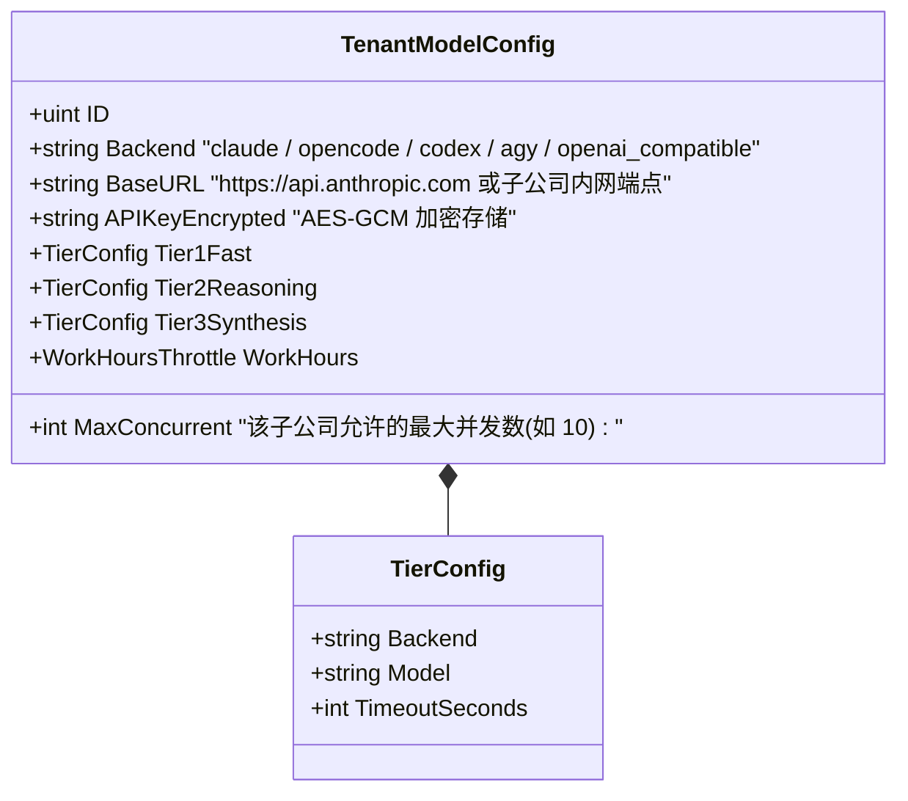
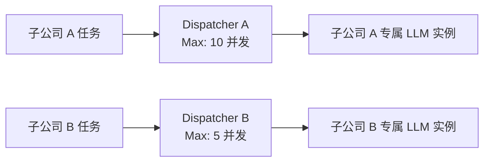

# 03-租户模型服务资源隔离与动态调度设计

## 1. 业务痛点与设计目标
在多子公司环境下，大模型（LLM）的资源消耗和算力归属具有强烈的隔离要求：
1. **自带模型服务（BYOM - Bring Your Own Model）**：子公司 A 自建内网部署的开源大模型（如 vLLM / Ollama），子公司 B 使用自购的商业云模型 API Key。
2. **算力配额独立保障**：各子公司的并发槽位相互独立，子公司 A 的批量扫描任务突发排队，绝不能挤占子公司 B 的日常代码检视算力。
3. **分级阶梯路由（Tiered Routing）自治**：各子公司可独立配置 Tier 1 快模型（初筛）、Tier 2 强推理（对抗辩论）和 Tier 3 汇总后端的具体模型映射。

---

## 2. 租户模型资源配置模型

各子公司的模型配置存储在其各自独立的租户数据库 `SystemConfig` / `TenantModelConfig` 表中，实现数据与敏感凭据的自治存储：



---

## 3. 多租户并发调度器 (`TenantDispatcherManager`)

原系统的 `ModelDispatcher` 是单例全局并发池。升级后，采用**租户并发池管理器**：



### 核心实现结构：
```go
package services

import (
	"code-shield/models"
	"context"
	"sync"
)

// TenantDispatcherManager 租户并发调度管理器
type TenantDispatcherManager struct {
	mu          sync.RWMutex
	dispatchers map[uint]*ModelDispatcher
}

var TenantDispatcher = &TenantDispatcherManager{
	dispatchers: make(map[uint]*ModelDispatcher),
}

// GetDispatcher 为指定租户获取或构建其独立的并发调度器
func (m *TenantDispatcherManager) GetDispatcher(tenantID uint) *ModelDispatcher {
	m.mu.RLock()
	d, exists := m.dispatchers[tenantID]
	m.mu.RUnlock()
	if exists {
		return d
	}

	m.mu.Lock()
	defer m.mu.Unlock()

	if d, exists := m.dispatchers[tenantID]; exists {
		return d
	}

	// 从租户数据库中加载该租户的模型配置与并发配额
	tenantDB, _ := models.DBManager.GetDB(tenantID)
	tenantAIConfig := LoadTenantAIConfig(tenantDB)

	newDispatcher := NewModelDispatcherFromConfig(tenantAIConfig)
	m.dispatchers[tenantID] = newDispatcher
	return newDispatcher
}
```

---

## 4. 任务执行阶段的租户模型调用生命周期

在 `TaskRunner` 执行扫描任务时：
1. **提取上下文**：`taskContext` 携带 `tenantID` 与当前任务的配置。
2. **获取租户 Dispatcher**：通过 `TenantDispatcher.GetDispatcher(ctx.tenantID)` 申请该租户的并发槽位。
3. **注入租户模型参数**：
   * 将该租户配置的 `API_KEY`、`BASE_URL`、`MODEL_NAME` 动态注入到子进程（如 Claude CLI / OpenCode CLI / Antigravity CLI）的环境变量中。
4. **执行与回收**：任务执行完成后释放槽位，并累加 Token 消耗到该租户的报表中。
