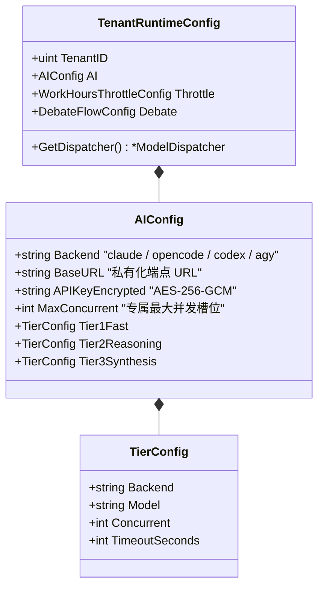
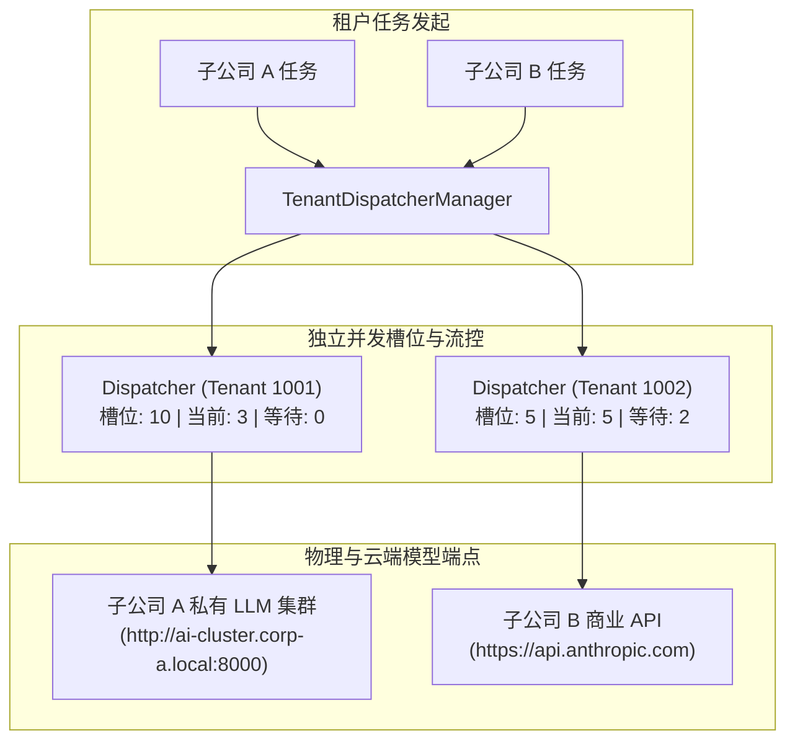
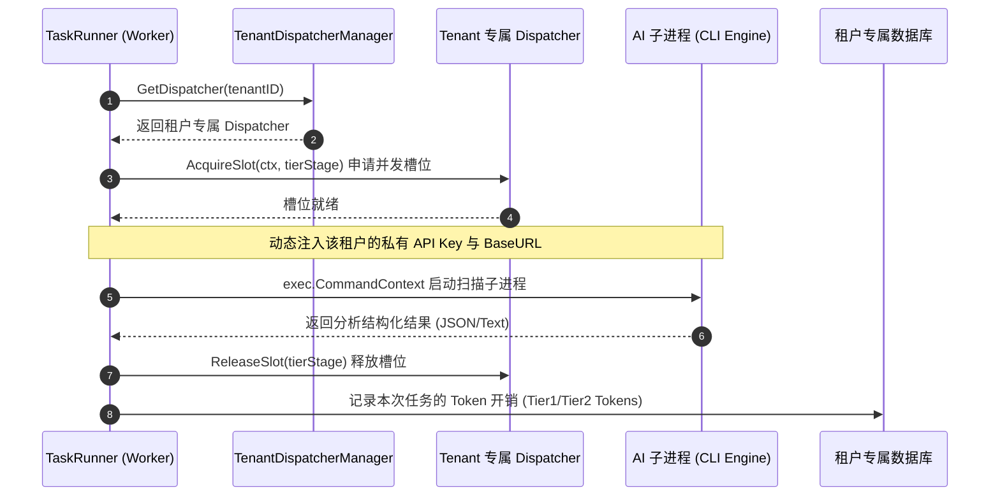

# 03-租户模型服务资源隔离与动态调度设计

## 1. 业务痛点与设计目标
在多子公司环境下，大模型（LLM）的资源消耗和算力归属具有强烈的隔离与自治诉求：
1. **自带模型服务（BYOM - Bring Your Own Model）**：子公司 A 自建内网部署的开源大模型集群（如 vLLM / Ollama / DeepSeek），子公司 B 使用自购的商业云模型 API Key（Claude / OpenAI）。
2. **算力配额独立保障**：各子公司的并发槽位与配额相互独立，子公司 A 的批量全仓扫描突发排队，绝不能挤占子公司 B 的日常代码检视算力。
3. **分级阶梯路由（Tiered Routing）自治**：各子公司可独立为其 Tier 1 快模型（初筛）、Tier 2 强推理（对抗辩论与裁决）和 Tier 3 汇总排版阶段绑定不同的私有模型。
4. **零停机动态热重载（Zero-Downtime Hot Reload）**：子公司管理员调整模型端点或并发数时，即时生效，无需重启平台后端服务。

---

## 2. 租户模型配置与三层继承体系

租户的模型配置统一遵循 [07-租户分层配置与动态热加载深度设计.md](./07-租户分层配置与动态热加载深度设计.md) 定义的三层体系：
* **平台基线（Fallback）**：`config.yaml` 定义全平台通用的默认模型后端与阶梯映射（供新租户开箱即用）。
* **租户自治（Override）**：各子公司的专属端点、加密 Key 与并发配额持久化在各自独立的租户数据库 `system_configs` 表中。



---

## 3. 多租户并发调度管理器 (`TenantDispatcherManager`)

原系统的 `ModelDispatcher` 为单例全局并发池。在多租户体系下，重构为**租户并发池管理器**，支持按租户隔离的槽位调度与热重载：



### 核心实现结构与热重载机制：

```go
package services

import (
	"code-shield/models"
	"context"
	"fmt"
	"log"
	"sync"
	"time"
)

// TenantDispatcherManager 租户并发调度管理器
type TenantDispatcherManager struct {
	mu          sync.RWMutex
	dispatchers map[uint]*ModelDispatcher
}

var TenantDispatcher = &TenantDispatcherManager{
	dispatchers: make(map[uint]*ModelDispatcher),
}

// GetDispatcher 获取指定租户的独立并发调度器（懒加载与级联配置构建）
func (m *TenantDispatcherManager) GetDispatcher(tenantID uint) *ModelDispatcher {
	m.mu.RLock()
	d, exists := m.dispatchers[tenantID]
	m.mu.RUnlock()
	if exists {
		return d
	}

	m.mu.Lock()
	defer m.mu.Unlock()

	if d, exists := m.dispatchers[tenantID]; exists {
		return d
	}

	// 1. 获取该租户的生效运行时配置（租户自定义优先，继承平台默认模板）
	cfg := models.GetTenantRuntimeConfig(tenantID)

	// 2. 根据该租户配置初始化专属 Dispatcher
	newDispatcher := NewModelDispatcherFromConfig(cfg.AI, cfg.Throttle)
	m.dispatchers[tenantID] = newDispatcher
	log.Printf("[TenantDispatcher] Initialized independent dispatcher for TenantID: %d (MaxConcurrent: %d)",
		tenantID, cfg.AI.Tiers.Tier1Fast.Concurrent)

	return newDispatcher
}

// Reload 当租户在 Web 界面修改了模型配置/并发上限时触发热重载
func (m *TenantDispatcherManager) Reload(tenantID uint) {
	m.mu.Lock()
	defer m.mu.Unlock()

	cfg := models.GetTenantRuntimeConfig(tenantID)
	newDispatcher := NewModelDispatcherFromConfig(cfg.AI, cfg.Throttle)

	// 平滑替换旧调度器
	if old, exists := m.dispatchers[tenantID]; exists {
		old.GracefulStop()
	}
	m.dispatchers[tenantID] = newDispatcher
	log.Printf("[TenantDispatcher] Hot-reloaded dispatcher for TenantID: %d successfully", tenantID)
}
```

---

## 4. 任务执行阶段的租户模型调用生命周期

在 `TaskRunner` 执行扫描任务时，全流程实现严格的租户上下文传递与动态环境变量隔离：



### (1) 运行时环境变量动态注入
执行子进程时，仅在当前进程上下文中设置环境变量，杜绝跨租户凭据污染：
```go
// 构建租户隔离的命令执行环境
func buildTenantEnv(tenantCfg models.TenantRuntimeConfig, baseEnv []string) []string {
	env := append([]string{}, baseEnv...)
	if tenantCfg.AI.BaseURL != "" {
		env = append(env, fmt.Sprintf("OPENAI_BASE_URL=%s", tenantCfg.AI.BaseURL))
		env = append(env, fmt.Sprintf("ANTHROPIC_BASE_URL=%s", tenantCfg.AI.BaseURL))
	}
	if decryptedKey := tenantCfg.AI.GetDecryptedAPIKey(); decryptedKey != "" {
		env = append(env, fmt.Sprintf("ANTHROPIC_API_KEY=%s", decryptedKey))
		env = append(env, fmt.Sprintf("OPENAI_API_KEY=%s", decryptedKey))
		env = append(env, fmt.Sprintf("AGY_API_KEY=%s", decryptedKey))
	}
	return env
}
```

---

## 5. Token 消耗统计与多租户配额审计

在多租户模型服务体系中，每一次扫描都会在各子公司的独立数据库中精确记录：
* `TaskReport.Tier1Tokens`：Tier 1 快模型初筛消耗的 Token 数。
* `TaskReport.Tier2Tokens`：Tier 2 强推理（辩论与仲裁）消耗的 Token 数。
* `TenantTokenDailySummary`：按日统计各子公司的模型调用总量与费用归集，便于集团对各子公司进行精确的算力成本核算与分摊。
