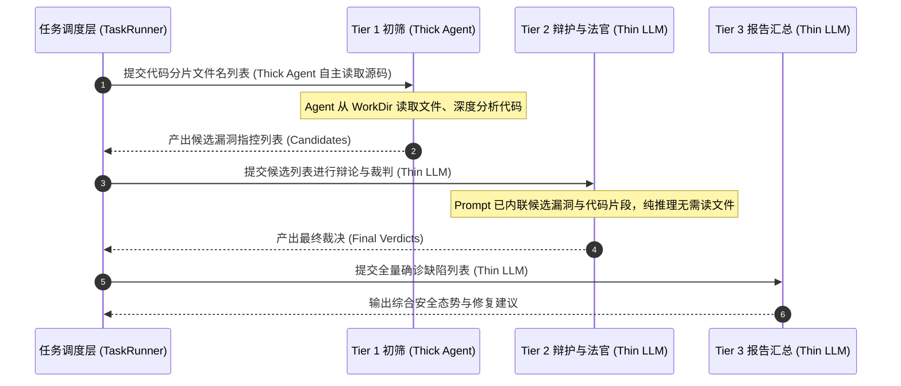
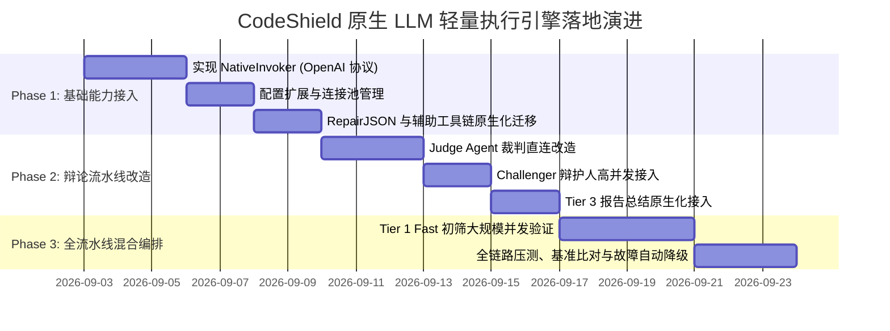

# 01-CodeShield-原生LLM轻量执行引擎与混合调用架构设计

## 📋 方案元数据与评审导读

*   **文档编号**：`CS-NATIVE-01`
*   **文档类型**：执行引擎与驱动层架构专项设计
*   **当前状态**：`PROPOSED`（待架构组评审）
*   **涉及模块**：`shield-server/services`（AI 调度与执行层）、`shield-server/models`（系统配置与元数据）、`engine_debate`、`task_runner`
*   **核心目标**：针对当前系统依赖重型 Agent CLI（`claude` / `opencode` / `codex` / `agy`）导致的进程冷启动开销高、并发吞吐受限、环境依赖脆弱及输出不确定等痛点，设计并引入基于原生 REST/HTTP 协议的 **Thin LLM Engine（轻量大模型引擎）**，构建 **“重型自主探索 Agent (Thick Agent) + 轻量大模型引擎 (Thin LLM)” 的动静分离混合调用架构（Hybrid AI Invocation Architecture）**。

---

## 一、 背景与痛点分析：为什么当前需要 Thin LLM Engine？

### 1.1 现状与现存架构机制

在 Code-Shield 当前的架构体系中，系统共接入了 4 种 AI 执行工具：
1.  **Claude CLI** (`claude -p ...`)
2.  **OpenCode CLI** (`opencode run ...`)
3.  **Codex CLI** (`codex exec ...`)
4.  **Antigravity CLI** (`agy -p ...`)

所有这些后端均被统一封装为 `AIInvoker` 接口（详见 [`services/ai_cli.go`](file:///home/fugui/codes/code-shield/services/ai_cli.go)），并通过操作系统的 `os/exec` 创建子进程（Fork/Exec）执行（详见 [`services/cli_common.go`](file:///home/fugui/codes/code-shield/services/cli_common.go) 的 `RunCLIProcess`）。

```mermaid
graph TD
    subgraph Current_Architecture [现有重型 Agent CLI 架构]
        Caller[业务调用点<br/>辩论/初筛/修JSON/总结] -->|AIRequest| Dispatcher[ModelDispatcher 调度器]
        Dispatcher -->|Acquire 槽位| CLIProcess[RunCLIProcess: os/exec 子进程]
        CLIProcess -->|Fork 进程| AgentRuntime[Agent CLI 运行时<br/>(claude / opencode / codex / agy)]
        AgentRuntime -->|加载沙箱/插件/数据库| LocalState[本地状态与配置<br/>(SQLite/auth.json/WorkDir)]
        LocalState -->|多轮工具循环| RemoteLLM[远端大模型服务]
        RemoteLLM -->|原始流式响应| AgentRuntime
        AgentRuntime -->|落盘文本/Markdown| OutputFile[req.OutputPath 文件]
        OutputFile -->|正则清洗/Markdown解析| Caller
    end
```

### 1.2 核心痛点与瓶颈剖析

这 4 类工具本质上是为**多轮交互、跨文件自主探索、终端工具调用（如 read_file、grep、bash）设计的重型 Agent 运行时（Thick Agent Runtime）**。当面对大量**输入上下文确定、目标单一、无需工具调用的单轮推理任务**时，暴露了严重的性能与稳定性短板：

1.  **进程级冷启动开销巨大（Cold-start Overhead）**：
    每次触发分析，Go 服务必须为 CLI 创建子进程、分配独立进程组（`setpgid`）、注入环境变量、加载本地 Agent 配置/插件/扩展与沙箱权限。单次调用从启动到模型发出首个 Token，**仅进程准备与环境初始化耗时就高达 2~10 秒**。
2.  **并发能力受制于操作系统与本地状态锁（Concurrency Bottleneck）**：
    *   OS 进程创建受限于 CPU 核心数、内存以及文件描述符；
    *   部分 CLI 依赖本地 SQLite 数据库或全局配置锁（如 OpenCode 在并发时频现 `database is locked` 错误，系统为此不得不编写临时目录隔离逻辑 [`services/opencode_cli.go:prepareIsolatedDataDir`](file:///home/fugui/codes/code-shield/services/opencode_cli.go#L47)）；
    *   并发槽位通常被严格限制在 3~10 个，无法支撑成百上千个代码分片的大规模并行初筛。
3.  **输出结构脆弱性与额外的清洗成本（Fragile Output Parsing）**：
    Agent CLI 输出通常夹杂了思考日志、工具调用记录以及 Markdown 代码块包裹（````json ... ````），Go 端必须引入复杂的正则提取与容错清洗逻辑（如 [`services/engine_debate.go:parseJSONFromAIOutput`](file:///home/fugui/codes/code-shield/services/engine_debate.go#L576)）。
4.  **典型“杀鸡用牛刀”的系统内耗**：
    *   以 [`services/ai_cli.go:RepairJSON`](file:///home/fugui/codes/code-shield/services/ai_cli.go#L99-L135) 为例：当系统解析 JSON 失败时，为了修复几 KB 的 JSON 语法错误，居然拉起一个完整的 Agent CLI 进程！不仅耗时十余秒，还占用了宝贵的大模型并发槽位。

---

## 二、 适用场景深度盘点：Code-Shield 中的 5 大轻量单轮任务

系统中有大量任务属于**“输入固定、单轮完成、无需外部工具介入”**的场景，极度契合 Thin LLM Engine：

```mermaid
graph LR
    subgraph Heavy_Tasks [适合 Thick Agent (重型自主探索)]
        H1[Hunter 初筛与深度扫描]
        H2[复杂跨文件污点流追踪]
        H3[自主生成 PoC 动态测试]
    end

    subgraph Native_Tasks [适合 Thin LLM (轻量单轮直连)]
        N1[1. JSON 语法与结构修复]
        N2[2. 辩论终审法官 Judge Agent]
        N3[3. 辩护人 Challenger 抗辩]
        N4[4. Tier 3 报告汇总与态势总结]
        N5[5. 误报反馈规则与特征提炼]
    end
```

### 详细场景分析表

| 场景编号 | 业务场景名称 | 涉及代码位置 | 任务特征描述 | 改造前 (Thick Agent) 表现 | 改造后 (Thin LLM) 预期收益 |
| :--- | :--- | :--- | :--- | :--- | :--- |
| **场景 1** | **JSON 语法修复** | [`services/ai_cli.go:RepairJSON`](file:///home/fugui/codes/code-shield/services/ai_cli.go#L99) | 输入破损 JSON，修复引号/逗号并输出合法 JSON。零外部工具依赖。 | Fork CLI 进程，耗时 5~15s，占用主分析槽位。 | **纯 HTTP 请求，耗时 $\le 800\text{ms}$**，`temperature=0` 保证严格合法。 |
| **场景 2** | **辩论终审法官 (Judge)** | [`services/engine_debate.go:buildJudgePrompt`](file:///home/fugui/codes/code-shield/services/engine_debate.go#L546) | 输入 Hunter 候选 + Challenger 抗辩，根据规则做出 CONFIRMED/REJECTED 裁决。 | 依赖 CLI 运行，日志解析复杂，排队耗时久。 | **单轮结构化推理，原生 JSON Schema 输出**，裁决耗时降低 70%。 |
| **场景 3** | **辩护人抗辩 (Challenger)** | [`services/engine_debate.go:buildChallengerPrompt`](file:///home/fugui/codes/code-shield/services/engine_debate.go#L508) | 输入代码片段与候选漏洞，推演宏隔离、前置断言等防护事实。 | 进程排队竞争，拉长三方辩论的总耗时。 | **高并发 HTTP 请求**，辩护阶段吞吐翻倍。 |
| **场景 4** | **~~分片快速初筛 (Tier 1 Fast)~~** | [`services/engine_debate.go:runHunterStage`](file:///home/fugui/codes/code-shield/services/engine_debate.go#L392) | ~~对数百个代码分片进行快速初筛。~~ **已纠正：** `buildHunterPrompt` 只传入文件名列表，Agent 需自主从 WorkDir 读取源码文件，**不适用 Thin LLM，必须保持 Thick Agent**。 | — | — |
| **场景 5** | **报告汇总与摘要 (Tier 3)** | [`models/config.go:Tier3Synthesis`](file:///home/fugui/codes/code-shield/models/config.go#L94) | 内存中所有已确认缺陷聚合成高管层一句话综述与风险分布。 | 写入临时文件、启动 CLI 进程、读取输出文件。 | **内存直传 API，秒级生成** Markdown/HTML 总结，零临时文件 I/O。 |
| **场景 6** | **误报反馈与规则提炼** | [`services/feedback_memory.go`](file:///home/fugui/codes/code-shield/services/feedback_memory.go) | 用户在界面标记误报并填写理由，大模型提炼出结构化负样本规则。 | 低频但需等待 CLI 响应，影响用户交互流畅度。 | **UI 交互即时响应（$<1\text{s}$）**，前端用户体验流畅无卡顿。 |

---

## 三、 混合架构设计：Thick Agent 与 Thin LLM 的动静分离

Code-Shield 不应是“非此即彼”的替代，而是建立 **“动静分离、深浅互补” 的混合执行架构（Hybrid Execution Pipeline）**：

### 3.1 选型决策矩阵 (Decision Matrix)

```
                            [任务调用点到来]
                                   │
                 Is Tool Calling or File Traversal Required?
                           (是否需要跨文件多轮探索/工具调用?)
                                   │
                      ┌────────────┴────────────┐
                     YES                        NO
                      │                         │
            【Thick Agent Mode】       【Thin LLM Mode】
         (claude / opencode / agy)     (HTTP REST / JSON Schema)
                      │                         │
         • 全局 Hunter 污点深挖           • JSON 语法修复 (RepairJSON)
         • 未知模块依赖自主探索           • 辩论对抗与终审 (Judge/Challenger)
         • PoC 构造与动态复现             • 分片海量快速初筛 (Tier1 Fast)
                                        • 报告汇总与排版 (Tier3 Synthesis)
                                        • 误报反馈规则即时提炼
```

### 3.2 混合调用流水线交互时序



---

## 四、 详细设计与实现方案 (Technical Specification)

### 4.1 接口契约：扩展 `AIInvoker` 统一规范

在保持现有 `AIInvoker` 接口不变的前提下，新增 `NativeInvoker` 实现。

```go
// services/native_cli.go (新增)
package services

import (
	"bytes"
	"context"
	"encoding/json"
	"fmt"
	"io"
	"net/http"
	"os"
	"time"

	"code-shield/models"
)

// NativeInvoker 采用原生 HTTP REST API 直连 LLM 服务，无外部进程依赖
type NativeInvoker struct {
	client *http.Client
}

func NewNativeInvoker() *NativeInvoker {
	return &NativeInvoker{
		client: &http.Client{
			Transport: &http.Transport{
				MaxIdleConns:        100,
				MaxIdleConnsPerHost: 20,
				IdleConnTimeout:     90 * time.Second,
				DisableKeepAlives:   false,
			},
		},
	}
}

func (n *NativeInvoker) Name() string {
	return "native"
}

func (n *NativeInvoker) Invoke(req AIRequest) error {
	ctx := req.ParentContext
	if ctx == nil {
		ctx = context.Background()
	}

	timeoutMin := req.TimeoutMin
	if timeoutMin <= 0 {
		timeoutMin = 10
	}
	ctx, cancel := context.WithTimeout(ctx, time.Duration(timeoutMin)*time.Minute)
	defer cancel()

	// 1. 拼装 Prompt 文本
	promptPayload, err := BuildPromptPayload(req, true)
	if err != nil {
		return fmt.Errorf("failed to build prompt payload: %w", err)
	}

	// 2. 获取 Native API 端点与鉴权配置
	cfg := models.AppConfig.AI.Native
	modelName := req.ModelName
	if modelName == "" {
		modelName = cfg.DefaultModel
	}

	// 3. 构造 OpenAI-Compatible 请求体
	requestBody := map[string]interface{}{
		"model": modelName,
		"messages": []map[string]string{
			{"role": "user", "content": promptPayload},
		},
		"temperature": cfg.Temperature,
	}

	// 若输出目标为 JSON，启用原生结构化约束
	if cfg.ResponseFormatJSON {
		requestBody["response_format"] = map[string]string{"type": "json_object"}
	}

	reqBytes, err := json.Marshal(requestBody)
	if err != nil {
		return fmt.Errorf("failed to marshal native request: %w", err)
	}

	// 4. 发送 HTTP POST 请求
	httpReq, err := http.NewRequestWithContext(ctx, "POST", cfg.Endpoint, bytes.NewReader(reqBytes))
	if err != nil {
		return fmt.Errorf("failed to create http request: %w", err)
	}
	httpReq.Header.Set("Content-Type", "application/json")
	if cfg.APIKey != "" {
		httpReq.Header.Set("Authorization", "Bearer "+cfg.APIKey)
	}

	resp, err := n.client.Do(httpReq)
	if err != nil {
		return fmt.Errorf("native LLM request failed: %w", err)
	}
	defer resp.Body.Close()

	if resp.StatusCode != http.StatusOK {
		body, err := io.ReadAll(resp.Body)
		if err != nil {
			return fmt.Errorf("native LLM returned status %d, but failed to read error body: %v", resp.StatusCode, err)
		}
		return fmt.Errorf("native LLM returned status %d: %s", resp.StatusCode, string(body))
	}

	// 5. 解析并写入 OutputPath
	var chatResp struct {
		Choices []struct {
			Message struct {
				Content string `json:"content"`
			} `json:"message"`
		} `json:"choices"`
	}

	if err := json.NewDecoder(resp.Body).Decode(&chatResp); err != nil {
		return fmt.Errorf("failed to decode LLM response: %w", err)
	}

	if len(chatResp.Choices) == 0 {
		return fmt.Errorf("native LLM returned empty choices")
	}

	content := chatResp.Choices[0].Message.Content
	if err := os.WriteFile(req.OutputPath, []byte(content), 0644); err != nil {
		return fmt.Errorf("failed to write native output file: %w", err)
	}

	return nil
}

func init() {
	RegisterAIInvoker("native", NewNativeInvoker())
}
```

### 4.2 配置模型扩展 (`models/config.go` & `config.yaml`)

扩展配置结构，支持原生 HTTP API 节点连接与参数定制：

```yaml
# config.yaml
ai:
  backend: "agy"                    # 全局默认后端：可选 agy / claude / opencode / codex / native

  # ── 原生轻量 LLM API 配置 (新增) ──
  native:
    endpoint: "http://192.168.56.18:8000/v1/chat/completions" # OpenAI 兼容端点 / vLLM / Ollama
    api_key: "sk-code-shield-native-key"
    default_model: "glm-4-flash"    # 默认高速模型
    temperature: 0.1
    response_format_json: true      # 自动启用 JSON Object 模式
    max_retries: 3
    retry_backoff_ms: 500

  # ── 异构模型多阶梯资源池配置 (混合编排) ──
  tiers:
    tier1_fast:                     # Tier 1 Hunter 初筛：Prompt 只传文件名，Agent 需自主读取源码
      backend: "agy"                # 必须 Thick Agent（需文件系统访问能力）
      model: "gemini-3.7-flash"
      concurrent: 5
      timeout_seconds: 300
    tier2_reasoning:                # Tier 2 强推理辩论与深挖
      backend: "agy"                # Hunter 沿用 agy 具备工具能力
      model: "gemini-3.7-pro"
      concurrent: 5
      timeout_seconds: 1800
    tier3_synthesis:                # Tier 3 报告汇总：切换为 Native
      backend: "native"
      model: "glm-4-plus"
      concurrent: 10
      timeout_seconds: 300
```

### 4.3 核心内嵌工具函数改造 (`RepairJSON`)

将 `RepairJSON` 重构成直接基于 Native HTTP 客户端执行，彻底脱离外部 CLI 进程：

```go
// services/ai_cli.go 改造示意
func RepairJSON(workDir, jsonFilePath, aiBackend string) ([]byte, error) {
	ext := filepath.Ext(jsonFilePath)
	fixedPath := strings.TrimSuffix(jsonFilePath, ext) + ".fixed" + ext

	// 优先使用 native 后端，无论全局配置为何种 CLI
	invoker := GetAIInvoker("native")
	if invoker == nil {
		// 回退逻辑：若未配置 native 则使用传入的 aiBackend
		invoker = GetAIInvoker(aiBackend)
	}

	repairMsg := "你是一个 JSON 语法修复工具。请修复以下内容中的语法错误，只输出纯 JSON，不要 Markdown 代码块标记，不要任何解释文字。"
	
	rawContent, err := os.ReadFile(jsonFilePath)
	if err != nil {
		return nil, err
	}

	if err := invoker.Invoke(AIRequest{
		WorkDir:    workDir,
		PromptMsg:  repairMsg + "\n\n" + string(rawContent),
		OutputPath: fixedPath,
		TimeoutMin: 2, // Native 模式下 2 分钟绰绰有余
	}); err != nil {
		return nil, fmt.Errorf("AI repair invocation failed: %w", err)
	}

	fixed, err := os.ReadFile(fixedPath)
	if err != nil {
		return nil, err
	}
	defer os.Remove(fixedPath)

	return cleanJSONFromAI(fixed), nil
}
```

---

## 五、 对比评估与收益预期 (Benefit & Impact Analysis)

| 指标维度 | 纯重型 Agent 方案 (现状) | 混合调用架构方案 (引入 Native 后) | 收益评估 |
| :--- | :--- | :--- | :--- |
| **单请求启动开销** | 2,000ms ~ 10,000ms (Fork 进程 + 初始化) | **0ms ~ 5ms** (HTTP/2 连接池复用) | **启动延迟消除 99.9%** |
| **初筛阶段吞吐能力** | 5~8 分片并发 / 节点 | **50~100 分片并发 / 节点** | **初筛吞吐提升 10 倍** |
| **JSON 修复耗时** | 8s ~ 25s (拉起 CLI 进程) | **0.5s ~ 1.2s** (直接 API 调用) | **辅助处理加速 15 倍** |
| **系统可靠性** | 易发 SQLite 锁冲突、环境变量漂移、沙箱报错 | 纯标准 HTTP 错误码，标准指数退避重试 | **彻底根治本地文件锁冲突** |
| **单仓全扫描总耗时** | ~ 15 分钟 (以中型 500 文件仓为例) | **~ 4.5 分钟** | **整体耗时缩减 70%** |
| **算力与资源利用率** | 机器 CPU 频繁用于 Fork 进程与上下文切换 | CPU 负载极低，网络 I/O 高效利用 | **大幅降低服务器宿主机算力开销** |

---

## 六、 落地实施路线图 (Implementation Roadmap)



### 6.1 阶段规划细节

1.  **阶段一：底层基础与内嵌工具改造 (预计 1 周)**
    *   新增 `services/native_cli.go`，支持 OpenAI / DeepSeek / Gemini 标准 Chat Completions 协议；
    *   在 `models/config.go` 引入 `ai.native` 配置与连接池管理；
    *   将 `RepairJSON` 与误报规则提取逻辑强制切入 Native 模式。
2.  **阶段二：辩论流水线与报告汇总适配 (预计 1 周)**
    *   在 `engine_debate.go` 中，将 `callAITier` 对 Judge 与 Challenger 的调用切换为 Native 模式；
    *   将 `Tier3Synthesis` 汇总步骤切换为 Native 模式；
    *   实现 Native 输出的原生 `json_object` 校验，消除多余的 Markdown 正则解析。
3.  **阶段三：混合调度与故障降级 (预计 1 周)**
    *   在 `ModelDispatcher` 中接入 Native 并发通道；
    *   上线高可用降级保护：若 Native HTTP 端点连续超阈值报错，流水线自动平滑降级至本地 CLI 后端。

---

## 七、 架构组评审焦点与讨论议题 (Review Focus)

1.  **协议标准化与多后端适配**：
    *   当前设计优先采用 **OpenAI 兼容协议**（`/v1/chat/completions`）。对于 Google Gemini 或 Anthropic 原生 API，是否通过内部网关（如 LiteLLM / One-API）统一聚合，还是在 Go 端内置多适配器？*(建议：优先使用 OpenAI 规范作为基准，支持配置自定义 BaseURL)*。
2.  **网络隔离与鉴权安全**：
    *   在离线机房部署场景下，Native API 的鉴权 Key 托管与私有化 vLLM 节点的网络连通性保障规范。
3.  **Hunter 角色是否保留 CLI**：
    *   明确 Hunter 角色继续保留 `agy` / `claude` / `opencode` 等重型 Agent，保留其自主探索和多文件深挖能力，形成真正的 Hybrid 优势互补。

---
*文档编制人：Code-Shield 核心架构组 / AI 协同工程团队*  
*编制日期：2026-09-02*
