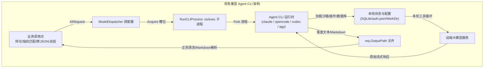
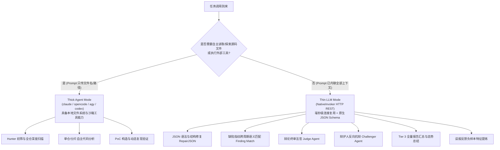
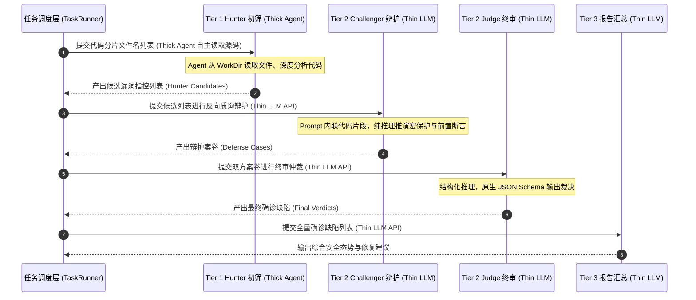
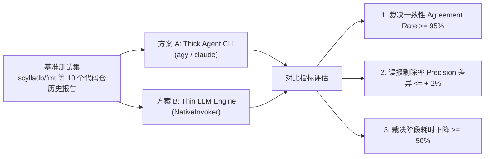
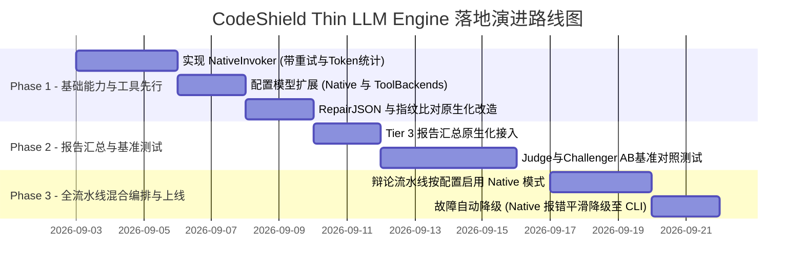
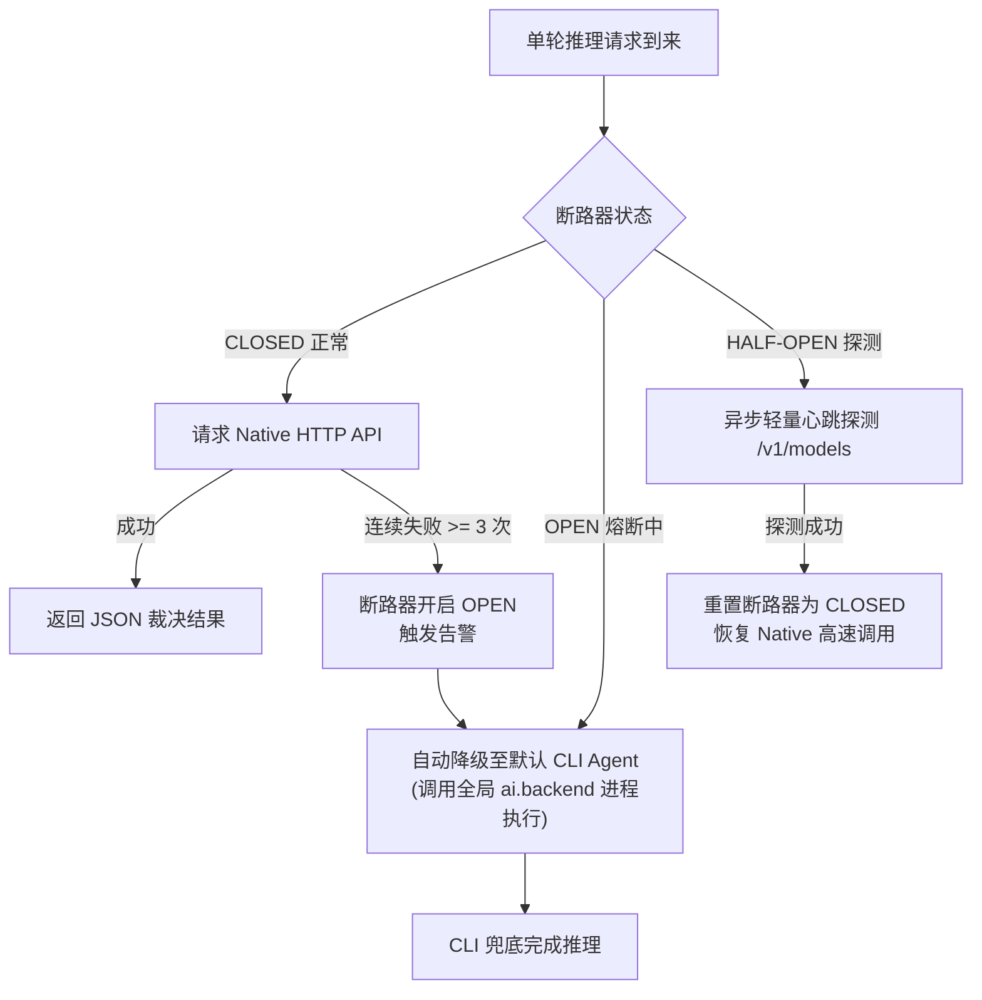

# 01-CodeShield-原生LLM轻量执行引擎与混合调用架构设计

## 📋 方案元数据与评审导读

*   **文档编号**：`CS-NATIVE-01`
*   **文档类型**：执行引擎与驱动层架构专项设计
*   **当前状态**：`PROPOSED`（已完成批判性审视与完备性刷新，提交架构组评审）
*   **涉及模块**：`shield-server/services`（AI 调度与执行层）、`shield-server/models`（系统配置与元数据）、`engine_debate`、`hooks`、`task_runner`
*   **核心目标**：针对当前系统依赖重型 Agent CLI（`claude` / `opencode` / `codex` / `agy`）导致的进程冷启动开销高、并发受限于本地状态锁、环境依赖脆弱及输出不确定等痛点，设计并引入基于原生 REST/HTTP 协议的 **Thin LLM Engine（轻量大模型引擎，NativeInvoker）**，构建 **“重型自主探索 Agent (Thick Agent) + 轻量大模型引擎 (Thin LLM)” 的动静分离混合调用架构（Hybrid AI Invocation Architecture）**，并提供场景级可配置化路由能力。

---

## 一、 背景与痛点分析：为什么需要引入 Thin LLM Engine？

### 1.1 现状与现存架构机制

在 Code-Shield 当前的架构体系中，系统共接入了 4 种 AI 执行工具：
1.  **Claude CLI** (`claude -p ...`)
2.  **OpenCode CLI** (`opencode run ...`)
3.  **Codex CLI** (`codex exec ...`)
4.  **Antigravity CLI** (`agy -p ...`)

所有这些后端均统一实现 `AIInvoker` 接口（详见 [`services/ai_cli.go`](file:///home/fugui/codes/code-shield/services/ai_cli.go)），并通过操作系统的 `os/exec` 创建子进程（Fork/Exec）执行（详见 [`services/cli_common.go`](file:///home/fugui/codes/code-shield/services/cli_common.go) 的 `RunCLIProcess`）。



### 1.2 核心痛点与瓶颈剖析

这 4 类工具本质上是为**多轮交互、跨文件自主探索、终端工具调用（如 read_file、grep、bash）设计的重型 Agent 运行时（Thick Agent Runtime）**。当面对大量**输入上下文确定、目标单一、无需外部工具介入的单轮推理任务**时，暴露出明显的系统内耗与脆弱性：

1.  **进程级冷启动开销巨大（Cold-start Overhead）**：
    每次触发分析，Go 服务必须为 CLI 创建子进程、分配独立进程组（`setpgid`）、注入环境变量、加载本地 Agent 配置/插件/扩展与沙箱权限。单次调用从启动到模型发出首个 Token，**仅进程准备与环境初始化耗时就高达 2~10 秒**。
2.  **本地状态锁与操作系统资源瓶颈（Local State Locks & OS Overhead）**：
    *   OS 进程创建受限于 CPU 核心数、内存以及文件描述符；
    *   部分 CLI 依赖本地 SQLite 数据库或全局配置锁。例如 OpenCode 在并发时频现 `database is locked` 错误，系统为此不得不编写临时目录隔离逻辑（[`services/opencode_cli.go:prepareIsolatedDataDir`](file:///home/fugui/codes/code-shield/services/opencode_cli.go#L47)）。
3.  **输出结构脆弱性与多重正则清洗（Fragile Output Parsing）**：
    Agent CLI 输出通常夹杂了思考日志、工具调用记录以及 Markdown 代码块包裹（````json ... ````），Go 端必须引入复杂的正则提取与容错清洗逻辑（如 [`services/engine_debate.go:parseJSONFromAIOutput`](file:///home/fugui/codes/code-shield/services/engine_debate.go#L576)）。
4.  **单轮确定性任务的“杀鸡用牛刀”**：
    *   **JSON 语法修复**（[`services/ai_cli.go:RepairJSON`](file:///home/fugui/codes/code-shield/services/ai_cli.go#L99)）：当 JSON 解析失败时，为了修复几 KB 的 JSON 语法错误，系统居然拉起一个完整的 Agent CLI 进程，耗时十余秒并占用了主分析槽位；
    *   **缺陷指纹语义比对**（[`services/hooks.go:askLLMIfSameFinding`](file:///home/fugui/codes/code-shield/services/hooks.go#L624)）：跨扫描周期判断两个缺陷是否属于同一问题，纯属简单的二分类 Prompt，却同样依赖 CLI 进程。

### 1.3 算力瓶颈归因澄清

需要特别指出的是，**系统端到端吞吐的天花板始终取决于远端 LLM 服务端（GPU/TPM/RPM）的算力供给**。引入 Thin LLM Engine 的真正核心价值在于：
*   **消除客户端 2~10 秒的 OS 进程创建与初始化延迟**；
*   **消除本地 SQLite 并发锁冲突与临时目录 I/O**；
*   **获得 HTTP/2 长连接池复用与原生 JSON Schema 强类型约束**；
*   **使客户端不再成为拖慢整体扫描的瓶颈点**。

---

## 二、 适用场景深度盘点：Thin 与 Thick 的清晰边界

系统中的任务根据**“是否需要自主探索文件系统与调用外部工具”**，可划分为明确的 Thin 与 Thick 边界：



### 2.1 适用场景详细分析表

| 场景编号 | 业务场景名称 | 涉及代码位置 | 核心特征与输入形态 | 推荐引擎模式 | 预期收益 / 注意事项 |
| :--- | :--- | :--- | :--- | :--- | :--- |
| **场景 1** | **JSON 语法修复** | [`services/ai_cli.go:RepairJSON`](file:///home/fugui/codes/code-shield/services/ai_cli.go#L99) | 输入破损 JSON 文本，修复语法并输出合法 JSON。零文件读取需求。 | **Thin LLM** (`native`) | 耗时由 5~15s 降至 $\le 800\text{ms}$，`temperature=0` + `json_object` 保证严格合法。 |
| **场景 2** | **缺陷指纹语义比对** | [`services/hooks.go:askLLMIfSameFinding`](file:///home/fugui/codes/code-shield/services/hooks.go#L624) | 输入 Old Finding 与 New Finding 详情，判断是否同一缺陷。纯文本二分类。 | **Thin LLM** (`native`) | 消除临时文件与 CLI 进程，单次比对毫秒级返回。 |
| **场景 3** | **辩论终审法官 (Judge)** | [`services/engine_debate.go:buildJudgePrompt`](file:///home/fugui/codes/code-shield/services/engine_debate.go#L546) | Prompt 已内联 Hunter 候选列表与 Challenger 抗辩列表，按规则裁决。 | **Thin LLM** (`native`) | 原生 JSON Schema 输出，消除 Markdown 清洗。*(注：需经 A/B 基准测试验证裁决深度)* |
| **场景 4** | **辩护人抗辩 (Challenger)** | [`services/engine_debate.go:buildChallengerPrompt`](file:///home/fugui/codes/code-shield/services/engine_debate.go#L508) | Prompt 已内联候选缺陷与代码片段，反向推演保护性代码。 | **Thin LLM** (`native`) | 辩护请求并发吞吐提升，消除排队等待。 |
| **场景 5** | **报告汇总与摘要 (Tier 3)** | [`models/config.go:Tier3Synthesis`](file:///home/fugui/codes/code-shield/models/config.go#L94) | 内存中所有确诊缺陷聚合生成高管层综述。纯文本汇总。 | **Thin LLM** (`native`) | 内存数据直传 API，秒级生成 Markdown/HTML，零磁盘 I/O。 |
| **场景 6** | **误报反馈规则提炼** | [`services/feedback_memory.go`](file:///home/fugui/codes/code-shield/services/feedback_memory.go) | 研发人员标记误报时，提炼出结构化负样本规则。Few-shot 抽取。 | **Thin LLM** (`native`) | UI 交互即时响应（$<1\text{s}$），前端无卡顿。 |
| **反例 1** | **Hunter 分片初筛 (Tier 1)** | [`services/engine_debate.go:buildHunterPrompt`](file:///home/fugui/codes/code-shield/services/engine_debate.go#L485) | `buildHunterPrompt` **仅传入文件名列表**，Agent 需自主从 WorkDir 读取源码。 | **Thick Agent** (`agy`/`claude`) | **必须 Thick**：Thin 无法读取磁盘代码文件。 |
| **反例 2** | **Single/Chunked 深度分析** | [`services/task_runner.go:executeAI`](file:///home/fugui/codes/code-shield/services/task_runner.go#L413) | 传统单仓或分片分析，Agent 需遍历读取 `InputFiles`。 | **Thick Agent** (`agy`/`claude`) | **必须 Thick**：依赖 Agent 的文件读取能力。 |

---

## 三、 混合调用架构设计：动静分离与场景级可配置化路由

### 3.1 架构设计理念：动静分离 (Hybrid Execution Pipeline)

Code-Shield 采取 **“重型探索 Agent + 轻量原生 LLM” 动静分离、深浅互补** 的混合调用架构：
*   **动（探索型 Thick Agent）**：承担 Hunter 角色，在代码仓工作区中自由穿透、阅读跨文件依赖、追踪调用链路；
*   **静（推理型 Thin LLM）**：承担裁判（Judge）、辩护（Challenger）、总结（Synthesis）、修复（RepairJSON）与匹配（FindingMatch）等已知上下文的确定性单轮推理任务。

### 3.2 混合调用流水线交互时序



### 3.3 场景级 Thin/Thick 可配置化路由架构

为避免将执行引擎硬编码，系统提供 **全局兜底 + 阶梯编排 (Tiers) + 工具级专有路由 (ToolBackends)** 的三层配置机制：

```
                      ┌────────────────────────────────────────┐
                      │           AI 请求入口 (AIRequest)       │
                      └───────────────────┬────────────────────┘
                                          │
                  ┌───────────────────────┴───────────────────────┐
                  ▼                                               ▼
      【流水线阶段请求 (Tier)】                        【内嵌工具请求 (Tool)】
    (tier1_fast / tier2 / tier3)              (repair_json / finding_match / ...)
                  │                                               │
                  ▼                                               ▼
      查询 ai.tiers.<tier>.backend                  查询 ai.tool_backends.<tool>
                  │                                               │
                  ├───────────────┐               ┌───────────────┤
                  ▼               ▼               ▼               ▼
              "native"       CLI 后端          "native"       CLI 后端
             (Thin LLM)    (Thick Agent)     (Thin LLM)    (Thick Agent)
                  │               │               │               │
                  ▼               ▼               ▼               ▼
           NativeInvoker    RunCLIProcess   NativeInvoker   RunCLIProcess
```

---

## 四、 详细技术方案与工程实现 (Technical Specification)

### 4.1 生产级 `NativeInvoker` 实现

`NativeInvoker` 实现 `AIInvoker` 接口，具备以下生产级特性：
1.  **System / User Prompt 严格分离**：提升大模型对系统指令的遵循度；
2.  **原生 JSON Schema 结构化约束**：通过 `response_format: { type: "json_object" }` 确保输出合法；
3.  **Token 用量精准追踪与上报**：解析 `usage` 字段中的 `total_tokens`；
4.  **指数退避重试（Exponential Backoff with Jitter）**：针对 429 / 5xx 错误自动重试；
5.  **HTTP/2 连接池复用**：长连接管理与超时控制。

```go
// services/native_cli.go
package services

import (
	"bytes"
	"context"
	"encoding/json"
	"fmt"
	"io"
	"log"
	"math/rand"
	"net/http"
	"os"
	"strings"
	"time"

	"code-shield/models"
)

// NativeInvoker 采用原生 HTTP REST API 直连 LLM 服务，无外部进程依赖
type NativeInvoker struct {
	client *http.Client
}

func NewNativeInvoker() *NativeInvoker {
	return &NativeInvoker{
		client: &http.Client{
			Transport: &http.Transport{
				MaxIdleConns:        100,
				MaxIdleConnsPerHost: 20,
				IdleConnTimeout:     90 * time.Second,
				DisableKeepAlives:   false,
			},
		},
	}
}

func (n *NativeInvoker) Name() string {
	return "native"
}

// resolveEndpoints 智能解析当前可用的异构端点候选列表
func (n *NativeInvoker) resolveEndpoints(targetModel string) []models.NativeEndpointConfig {
	cfg := models.AppConfig.AI.Native
	if len(cfg.Endpoints) > 0 {
		var matched []models.NativeEndpointConfig
		// 若指定了目标模型，优先筛选匹配该模型的端点
		if targetModel != "" {
			for _, ep := range cfg.Endpoints {
				if strings.EqualFold(ep.Model, targetModel) {
					matched = append(matched, ep)
				}
			}
		}
		if len(matched) > 0 {
			return matched
		}
		return cfg.Endpoints
	}

	// 兼容单端点简写配置
	endpoint := cfg.Endpoint
	if endpoint == "" {
		endpoint = cfg.BaseURL
	}
	if endpoint == "" {
		endpoint = "http://192.168.56.18:8000/v1/chat/completions"
	}
	model := targetModel
	if model == "" {
		model = cfg.DefaultModel
		if model == "" {
			model = "glm-4-flash"
		}
	}
	return []models.NativeEndpointConfig{
		{
			Name:     "default",
			BaseURL:  endpoint,
			APIKey:   cfg.APIKey,
			Model:    model,
			Weight:   100,
		},
	}
}

func (n *NativeInvoker) Invoke(req AIRequest) error {
	ctx := req.ParentContext
	if ctx == nil {
		ctx = context.Background()
	}

	timeoutMin := req.TimeoutMin
	if timeoutMin <= 0 {
		timeoutMin = 10
	}
	ctx, cancel := context.WithTimeout(ctx, time.Duration(timeoutMin)*time.Minute)
	defer cancel()

	cfg := models.AppConfig.AI.Native

	// 1. 拆分 System Prompt 与 User Prompt
	var messages []map[string]string
	if req.PromptFile != "" {
		if promptBytes, err := os.ReadFile(req.PromptFile); err == nil && len(promptBytes) > 0 {
			messages = append(messages, map[string]string{
				"role":    "system",
				"content": string(promptBytes),
			})
		}
	}
	messages = append(messages, map[string]string{
		"role":    "user",
		"content": req.PromptMsg,
	})

	// 2. 获取可用异构端点候选池 (支持独立 BaseURL, APIKey 与 Model)
	candidates := n.resolveEndpoints(req.ModelName)
	if len(candidates) == 0 {
		return fmt.Errorf("no available native LLM endpoints configured")
	}

	maxRetries := cfg.MaxRetries
	if maxRetries <= 0 {
		maxRetries = 3
	}
	baseBackoff := time.Duration(cfg.RetryBackoffMs) * time.Millisecond
	if baseBackoff <= 0 {
		baseBackoff = 500 * time.Millisecond
	}

	var respBody []byte
	var lastErr error

	// 3. 带异构节点故障转移 (Failover) 的指数退避重试循环
	for attempt := 0; attempt <= maxRetries; attempt++ {
		// 每次重试轮询切换到下一个备用端点 (使用端点自身的 BaseURL, APIKey 与 Model)
		ep := candidates[attempt%len(candidates)]

		if attempt > 0 {
			jitter := time.Duration(rand.Int63n(int64(baseBackoff / 2)))
			sleepDur := baseBackoff*(1<<uint(attempt-1)) + jitter
			log.Printf("[NativeInvoker] Retry attempt %d/%d switching to endpoint %q (%s, model: %s) after %v (last error: %v)\n",
				attempt, maxRetries, ep.Name, ep.BaseURL, ep.Model, sleepDur, lastErr)
			select {
			case <-ctx.Done():
				return ctx.Err()
			case <-time.After(sleepDur):
			}
		}

		// 构造当前端点绑定的请求体
		modelName := ep.Model
		if req.ModelName != "" {
			modelName = req.ModelName
		}
		requestBody := map[string]interface{}{
			"model":       modelName,
			"messages":    messages,
			"temperature": cfg.Temperature,
		}
		if cfg.ResponseFormatJSON {
			requestBody["response_format"] = map[string]string{"type": "json_object"}
		}
		if cfg.MaxTokens > 0 {
			requestBody["max_tokens"] = cfg.MaxTokens
		}

		reqBytes, err := json.Marshal(requestBody)
		if err != nil {
			return fmt.Errorf("failed to marshal native request: %w", err)
		}

		httpReq, err := http.NewRequestWithContext(ctx, "POST", ep.BaseURL, bytes.NewReader(reqBytes))
		if err != nil {
			return fmt.Errorf("failed to create http request: %w", err)
		}
		httpReq.Header.Set("Content-Type", "application/json")
		if ep.APIKey != "" {
			httpReq.Header.Set("Authorization", "Bearer "+ep.APIKey)
		}

		resp, err := n.client.Do(httpReq)
		if err != nil {
			lastErr = fmt.Errorf("endpoint %q (%s) connection failed: %w", ep.Name, ep.BaseURL, err)
			continue
		}

		respBody, err = io.ReadAll(resp.Body)
		resp.Body.Close()

		if err != nil {
			lastErr = fmt.Errorf("endpoint %q read response failed: %w", ep.Name, err)
			continue
		}

		if resp.StatusCode == http.StatusOK {
			lastErr = nil
			break
		}

		// 429 限流或 5xx 错误记录并尝试 Failover 切换备用端点
		lastErr = fmt.Errorf("endpoint %q returned status %d: %s", ep.Name, resp.StatusCode, string(respBody))
		if resp.StatusCode != http.StatusTooManyRequests && resp.StatusCode < 500 {
			return lastErr
		}
	}

	if lastErr != nil {
		return fmt.Errorf("all native LLM endpoints failed after %d retries: %w", maxRetries, lastErr)
	}

	// 4. 解析响应并写入目标文件
	var chatResp struct {
		Choices []struct {
			Message struct {
				Content string `json:"content"`
			} `json:"message"`
		} `json:"choices"`
		Usage struct {
			TotalTokens int64 `json:"total_tokens"`
		} `json:"usage"`
	}

	if err := json.Unmarshal(respBody, &chatResp); err != nil {
		return fmt.Errorf("failed to decode LLM response: %w (body: %s)", err, string(respBody))
	}

	if len(chatResp.Choices) == 0 {
		return fmt.Errorf("native LLM returned empty choices")
	}

	content := strings.TrimSpace(chatResp.Choices[0].Message.Content)
	if err := os.WriteFile(req.OutputPath, []byte(content), 0644); err != nil {
		return fmt.Errorf("failed to write native output file: %w", err)
	}

	return nil
}

func init() {
	RegisterAIInvoker("native", NewNativeInvoker())
}
```

### 4.2 配置模型扩展 (`models/config.go` & `config.yaml`)

```go
// models/config.go 扩展结构体

// NativeEndpointConfig 单个 Native LLM 算力节点配置 (独立 BaseURL, APIKey 与 Model)
type NativeEndpointConfig struct {
	Name        string  `yaml:"name" json:"name"`                 // 节点名称，如 "local-vllm-primary"
	BaseURL     string  `yaml:"base_url" json:"base_url"`         // API 地址，如 "http://192.168.56.18:8000/v1/chat/completions"
	APIKey      string  `yaml:"api_key" json:"api_key"`           // 该端点专有 API Key (可留空或从环境变量读取)
	Model       string  `yaml:"model" json:"model"`               // 该端点部署/绑定的模型名称，如 "glm-4-flash"
	Concurrent  int     `yaml:"concurrent" json:"concurrent"`     // 该节点最大并发槽位数 (默认 20)
	Weight      int     `yaml:"weight" json:"weight"`             // 负载权重 (1~100, 默认 10)
	Temperature float64 `yaml:"temperature" json:"temperature"`   // 节点级温度 (可选，缺省继承全局)
}

// NativeLLMConfig Native 引擎全局配置与多端点集群
type NativeLLMConfig struct {
	// ── 全局/向后兼容单端点简写配置 ──
	BaseURL            string  `yaml:"base_url" json:"base_url"`
	Endpoint           string  `yaml:"endpoint" json:"endpoint"` // 兼容 endpoint 别名
	APIKey             string  `yaml:"api_key" json:"api_key"`
	DefaultModel       string  `yaml:"default_model" json:"default_model"`
	Temperature        float64 `yaml:"temperature" json:"temperature"`
	MaxTokens          int     `yaml:"max_tokens" json:"max_tokens"`
	ResponseFormatJSON bool    `yaml:"response_format_json" json:"response_format_json"`
	MaxRetries         int     `yaml:"max_retries" json:"max_retries"`
	RetryBackoffMs     int     `yaml:"retry_backoff_ms" json:"retry_backoff_ms"`

	// ── 多异构端点集群列表 (Multi-Provider Cluster) ──
	Endpoints []NativeEndpointConfig `yaml:"endpoints" json:"endpoints"`
}

type ToolBackendsConfig struct {
	RepairJSON         string `yaml:"repair_json" json:"repair_json"`                 // 默认 "native"
	FindingMatch       string `yaml:"finding_match" json:"finding_match"`             // 默认 "native"
	FeedbackExtraction string `yaml:"feedback_extraction" json:"feedback_extraction"` // 默认 "native"
}
```

```yaml
# config.yaml 生产推荐配置
ai:
  backend: "agy"                    # 全局默认后端 (兜底用)

  # ── 原生轻量 LLM API 配置 (Thin LLM Engine) ──
  native:
    temperature: 0.1
    max_tokens: 4096
    response_format_json: true
    max_retries: 3
    retry_backoff_ms: 500

    # ── 多异构端点集群 (每个端点拥有独立的 BaseURL, APIKey, Model 与并发上限) ──
    endpoints:
      - name: "local-vllm-primary"
        base_url: "http://192.168.56.18:8000/v1/chat/completions"
        api_key: "sk-code-shield-internal"
        model: "glm-4-flash"
        concurrent: 30
        weight: 80

      - name: "local-vllm-backup"
        base_url: "http://192.168.56.19:8000/v1/chat/completions"
        api_key: "sk-code-shield-backup"
        model: "qwen-2.5-72b-instruct"
        concurrent: 15
        weight: 20

      - name: "cloud-fallback-gateway"
        base_url: "https://api.deepseek.com/v1/chat/completions"
        api_key: "sk-deepseek-prod-token"
        model: "deepseek-chat"
        concurrent: 5
        weight: 0                  # 权重 0 作为冷备降级节点

  # ── 异构模型多阶梯资源池配置 (流水线级编排) ──
  tiers:
    tier1_fast:                     # Tier 1 Hunter 初筛：Prompt 只传文件名，需自主读文件
      backend: "agy"                # → 必须使用 Thick Agent
      model: "gemini-3.7-flash"
      concurrent: 5
      timeout_seconds: 300
    tier2_reasoning:                # Tier 2 对抗辩论与裁决：Prompt 已内联代码片段
      backend: "native"             # → 使用 Thin LLM (需经 A/B 基准验证)
      model: "gemini-3.7-pro"
      concurrent: 10
      timeout_seconds: 600
    tier3_synthesis:                # Tier 3 报告汇总：纯文本聚合
      backend: "native"             # → 使用 Thin LLM
      model: "glm-4-plus"
      concurrent: 10
      timeout_seconds: 300

  # ── 内嵌工具场景级引擎配置 (工具级路由) ──
  tool_backends:
    repair_json: "native"           # JSON 语法修复 → 强制 Thin LLM
    finding_match: "native"         # 缺陷指纹语义比对 → 强制 Thin LLM
    feedback_extraction: "native"   # 误报负样本提炼 → 强制 Thin LLM
```

### 4.3 核心内嵌工具函数改造 (`RepairJSON`)

修正后的 `RepairJSON`，具备正确的后端路由与健壮的临时文件生命周期管理：

```go
// services/ai_cli.go 改造后
func RepairJSON(workDir, jsonFilePath, aiBackend string) ([]byte, error) {
	ext := filepath.Ext(jsonFilePath)
	fixedPath := strings.TrimSuffix(jsonFilePath, ext) + ".fixed" + ext

	// 1. 确定后端：优先取 tool_backends 配置，其次使用注册检查回退
	backend := models.AppConfig.AI.ToolBackends.RepairJSON
	if backend == "" {
		backend = "native"
	}
	if !IsValidAIBackend(backend) {
		backend = aiBackend
		if backend == "" {
			backend = models.AppConfig.AI.Backend
		}
	}

	invoker := GetAIInvoker(backend)
	log.Printf("[AI] Invoking %s to repair JSON: %s\n", invoker.Name(), jsonFilePath)

	rawContent, err := os.ReadFile(jsonFilePath)
	if err != nil {
		return nil, fmt.Errorf("failed to read malformed JSON: %w", err)
	}

	repairMsg := "你是一个 JSON 语法修复工具。请修复以下内容中的语法错误（未转义引号、多余逗号、括号缺失等）。" +
		"只输出纯 JSON，不要 Markdown 代码块标记，不要任何解释文字，保持原始数据结构不变。"

	req := AIRequest{
		WorkDir:    workDir,
		PromptMsg:  repairMsg + "\n\n" + string(rawContent),
		OutputPath: fixedPath,
		TimeoutMin: 2,
	}

	if err := invoker.Invoke(req); err != nil {
		return nil, fmt.Errorf("AI repair invocation failed: %w", err)
	}
	defer os.Remove(fixedPath) // 立即 defer 确保退出时清理

	fixed, err := os.ReadFile(fixedPath)
	if err != nil {
		return nil, fmt.Errorf("failed to read repaired JSON: %w", err)
	}

	return cleanJSONFromAI(fixed), nil
}
```

### 4.4 缺陷指纹语义比对改造 (`askLLMIfSameFinding`)

```go
// services/hooks.go 改造后
func getFindingMatchBackend(ctx *taskContext) string {
	if cfgBackend := models.AppConfig.AI.ToolBackends.FindingMatch; cfgBackend != "" {
		if IsValidAIBackend(cfgBackend) {
			return cfgBackend
		}
	}
	if IsValidAIBackend("native") {
		return "native"
	}
	if ctx.runParams.AIBackend != nil && *ctx.runParams.AIBackend != "" {
		return *ctx.runParams.AIBackend
	}
	return models.AppConfig.AI.Backend
}
```

---

## 五、 对比评估与基准验证 (Benefit & Benchmark Verification)

### 5.1 指标对比与量化评估

| 指标维度 | 纯重型 Agent 方案 (现状) | 混合调用架构方案 (引入 Thin LLM 后) | 收益定性与评估依据 |
| :--- | :--- | :--- | :--- |
| **单请求启动开销** | 2,000ms ~ 10,000ms (Fork 进程 + 初始化) | **0ms ~ 5ms** (HTTP/2 连接池复用) | **确定性收益**：彻底消除 OS 子进程启动与环境加载开销 |
| **JSON 修复耗时** | 8s ~ 25s (拉起 CLI 进程) | **0.5s ~ 1.2s** (直接 API 调用) | **确定性收益**：辅助工具响应提速 10~15 倍 |
| **指纹比对耗时** | 5s ~ 12s / 对比对 | **0.3s ~ 0.8s** / 对比对 | **确定性收益**：跨扫描周期缺陷去重耗时大幅缩减 |
| **系统健壮性** | 偶发 SQLite 锁冲突、临时目录残留 | 纯标准 HTTP 状态码 + 指数退避重试 | **确定性收益**：根治本地文件锁冲突与僵尸进程隐患 |
| **输出格式保证** | 依赖正则提取 Markdown 中的 JSON 代码块 | 原生 `response_format: json_object` 约束 | **确定性收益**：从协议层杜绝输出非 JSON 内容 |
| **辩论裁决质量** | 依赖 CLI 内部 Prompt 与上下文管理 | 依赖 API 端点模型推理质量 | **需 A/B 验证**：需验证推理深度与格式遵循度一致 |

### 5.2 辩论裁决 (Judge / Challenger) A/B 对照基准测试方案

在全面将 Judge 与 Challenger 切换为 Thin LLM 之前，必须在预发环境执行严格的 A/B 对照基准测试：



*   **准入条件**：方案 B 在测试集上的裁决一致性达到 $\ge 95\%$ 且无新增误报漏报，方可将 `ai.tiers.tier2_reasoning.backend` 默认值设为 `native`。

---

## 六、 落地实施路线图 (Implementation Roadmap)



### 6.1 分阶段实施细则

1.  **阶段一：底层基础与内嵌工具改造 (预计 1 周，风险极低)**
    *   新增 `services/native_cli.go`（支持 System Prompt 分离、Token Usage 统计、指数退避重试）；
    *   在 `models/config.go` 引入 `ai.native` 与 `ai.tool_backends`；
    *   将 `RepairJSON`、`askLLMIfSameFinding` 与误报反馈提取逻辑切换为 `native` 路由。
2.  **阶段二：报告汇总与辩论基准测试 (预计 1 周，受控验证)**
    *   将 `Tier3Synthesis` 汇总步骤切换为 `native`；
    *   针对 Judge 与 Challenger 开展 A/B 对照基准测试，建立裁决一致性评估基准。
3.  **阶段三：混合调度与故障降级 (预计 1 周，生产就绪)**
    *   在 `ModelDispatcher` 中完善 Native 并发通道与流控；
    *   上线自动降级保护：若 Native HTTP 端点在窗口期内连续报错（如网络中断），流水线自动平滑降级至本地 CLI 后端。

---

## 七、 架构组评审决议与高可用降级规范 (Architecture Decisions & HA)

### 7.1 架构组评审决议 (ADR)

经核心架构组评审与讨论，形成以下三项关键架构决议：

| 决议议题 | 架构组最终决议 | 落地实施规范 |
| :--- | :--- | :--- |
| **ADR-01: 协议选型** | **统一采用 OpenAI 兼容协议 (`/v1/chat/completions`)** | Go 服务端仅维护一套标准的 HTTP/REST 客户端实现。针对 Gemini、Claude 或私有模型，统一通过内网 LLM 网关（如 One-API / LiteLLM / vLLM）或标准兼容端点接入，保持 Go 服务底层协议极简。 |
| **ADR-02: Hunter 角色定位** | **Hunter 初筛与深度扫描角色默认使用 Thick Agent 引擎** | 确认 Hunter 必须具备自主文件系统探索与代码阅读能力。在 `ai.tiers.tier1_fast.backend` 中默认配置为 `agy` / `claude` / `opencode` 等重型 Agent，保留其环境穿透优势。 |
| **ADR-03: 鉴权与高可用降级** | **API Key 统一由 `config.yaml` 集中管理，上线多节点故障转移与断路器降级** | 鉴权 Key 支持 `config.yaml` 配置与系统环境变量注入；同时建立内网私有节点的断路器与自动降级机制，保障扫描任务永不中断。 |

---

### 7.2 内网私有化部署高可用与故障降级方案 (HA & Fallback)

在企业内网或私有化部署场景下，私有 LLM 算力节点（如自建 vLLM / Ollama 显卡服务器）可能因大并发显存 OOM、实例宕机或网络抖动出现短暂不可用。系统设计了以下双重高可用机制：

#### 1. 鉴权与配置规范 (API Key Management)
*   **集中配置文件**：在 `config.yaml` 中配置 `ai.native.api_key`，与系统现有的数据库密码、JWTSecret 等凭据保持一致；
*   **环境变量覆盖**：支持通过 `CODE_SHIELD_AI_NATIVE_API_KEY` 环境变量动态注入，方便 Docker 容器化编排与 CI/CD 密钥脱敏。

#### 2. 多异构端点集群与故障转移 (Multi-Endpoint Failover)
配置支持定义多个异构 LLM 算力节点。每个节点支持**独立配置其专属的 `base_url`、`api_key`、`model`、`concurrent` 与 `weight`**。当主节点发生网络超时、显存 OOM 或 5xx 错误时，系统在重试周期内自动按优先级切换到备用节点，并自动使用备用节点的 APIKey 与 Model 进行请求：

```yaml
ai:
  native:
    temperature: 0.1
    max_retries: 3
    retry_backoff_ms: 500
    endpoints:
      - name: "local-vllm-node1"                       # 内网主节点
        base_url: "http://192.168.56.18:8000/v1/chat/completions"
        api_key: "sk-vllm-primary-token"
        model: "glm-4-flash"
        concurrent: 30
        weight: 80

      - name: "local-vllm-node2"                       # 内网备用节点 (异构模型)
        base_url: "http://192.168.56.19:8000/v1/chat/completions"
        api_key: "sk-vllm-backup-token"
        model: "qwen-2.5-72b-instruct"
        concurrent: 15
        weight: 20

      - name: "cloud-gateway-fallback"                 # 外部网关兜底冷备
        base_url: "https://api.deepseek.com/v1/chat/completions"
        api_key: "sk-deepseek-prod-token"
        model: "deepseek-chat"
        concurrent: 5
        weight: 0
```

#### 3. 熔断器与平滑降级至 Thick Agent CLI (Circuit Breaker & CLI Fallback)
为了防止私有 LLM 集群全量宕机导致扫描流水线彻底卡死，`NativeInvoker` 内置断路器状态机：


*   **平滑降级保护**：当 Native 端点在滑动窗口内连续失败 $\ge 3$ 次（如连接被拒绝、持续 502/503），系统自动触发降级，将当前的 JSON 修复、裁决或总结请求无缝转交由本地配置的 `ai.backend`（如 `agy` CLI）兜底执行，**确保扫描任务 100% 成功交付**；
*   **异步自动恢复**：后台定时（如每 30 秒）向 Native 端点发送轻量探活请求，确认服务恢复后自动回切至高速 Native 模式。

---
*文档编制人：Code-Shield 核心架构组 / AI 协同工程团队*  
*最新修订日期：2026-09-02 (v2.1 架构决议与高可用完善版)*
