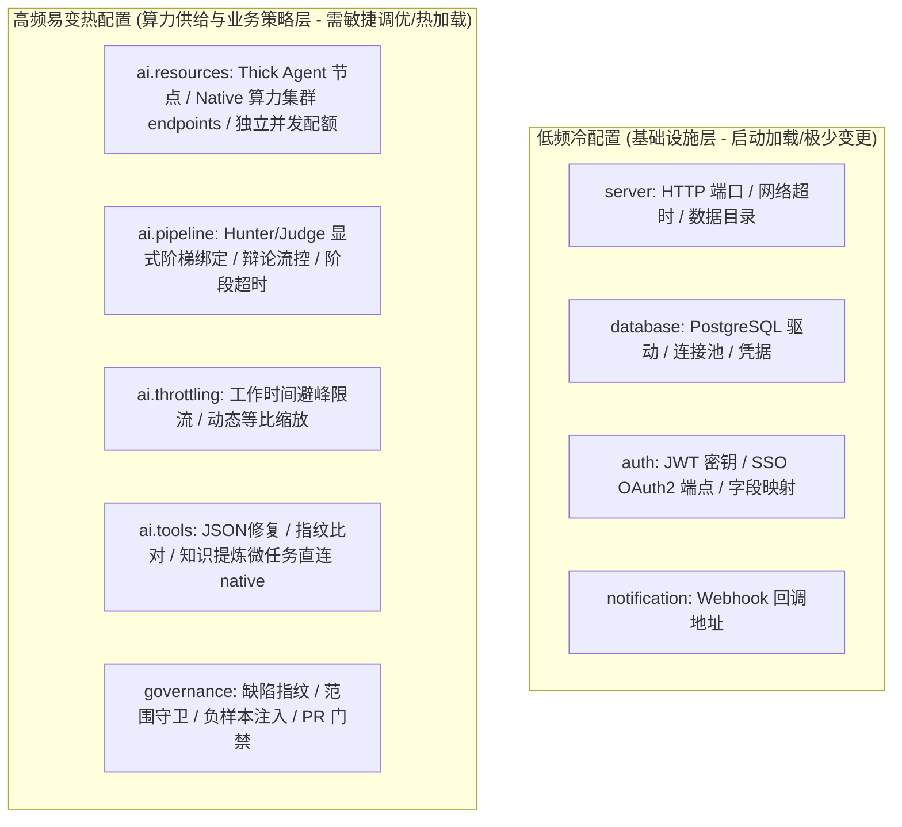
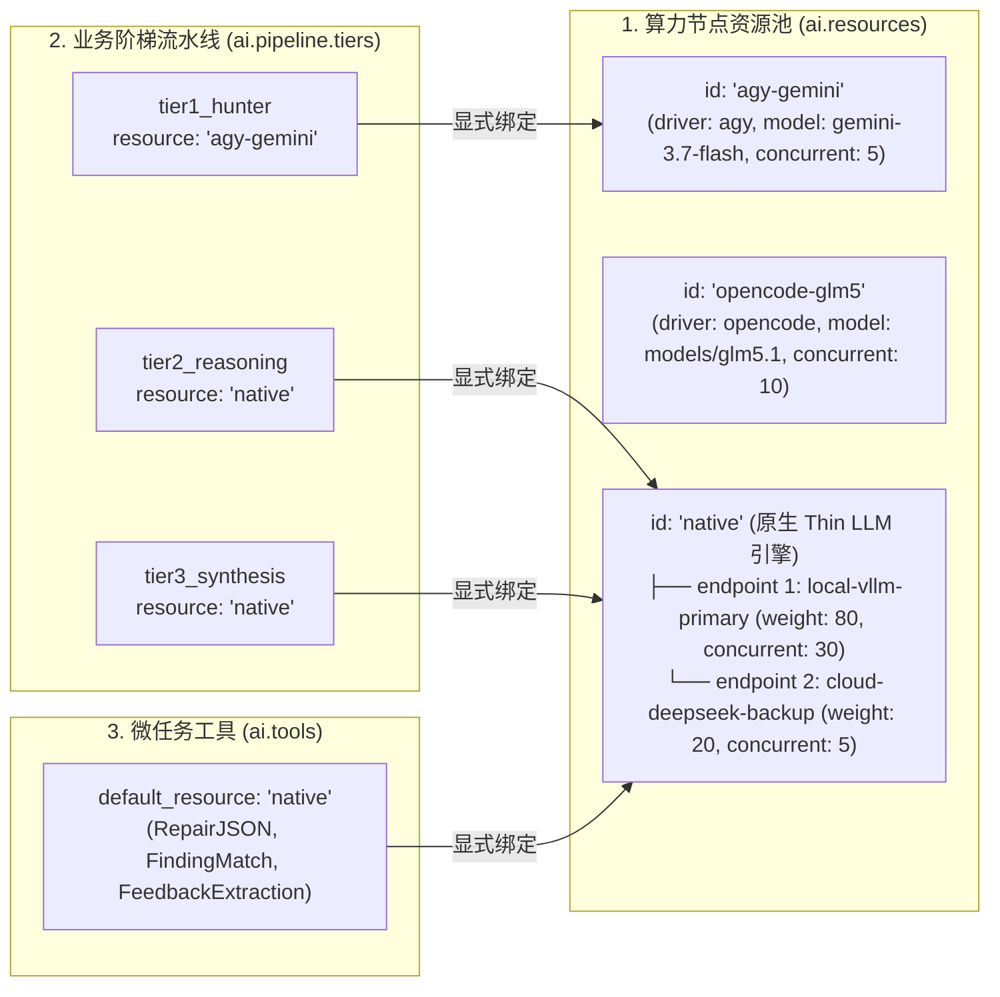
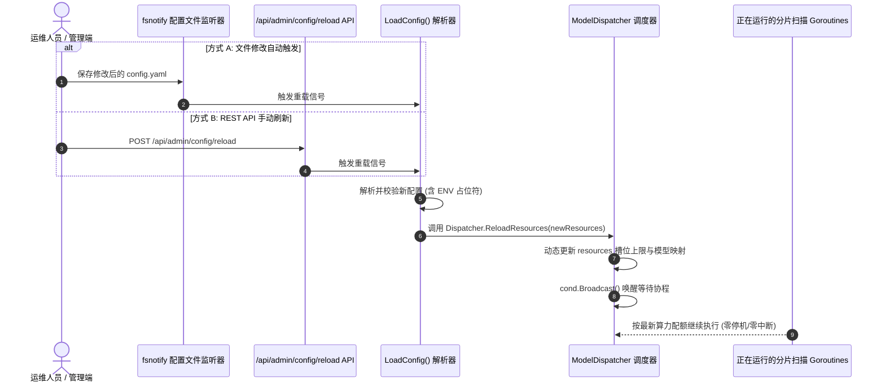

# 02-CodeShield-AI执行引擎与企业治理配置架构优化设计

## 📋 方案元数据与导读

*   **文档编号**：`CS-NATIVE-02`
*   **文档类型**：系统配置架构与算力治理专项设计
*   **当前状态**：`PROPOSED`（架构方案设计完成，待实施评审）
*   **涉及模块**：`models/config.go`、`config.yaml`、`services/dispatcher.go`、`services/native_cli.go`、`services/governance`
*   **核心目标**：针对 Code-Shield 随架构演进在 `ai`（AI 调度引擎）与 `governance`（企业治理闭环）模块中暴露出的“冷热配置混杂”、“算力供给与业务消费角色耦合”、“治理策略缺乏多级继承覆盖”、“配置修改需重启服务打断扫描”等痛点，提出以 **“显式精准算力池（Resources with Native Endpoints）+ 业务流水线阶梯（Pipeline Tiers）+ 微任务工具（Tools）+ 治理生命周期（Governance）”** 为核心的模块化配置重构方案，实现结构清晰、零歧义精准绑定，并完整保留多模型独立并发、Native 算力集群负载分流与工作时间自动避峰等核心能力。

---

## 一、 背景与现状剖析：为什么需要优化配置组织？

### 1.1 系统配置的“冷热属性”分界

随着 Code-Shield 从早期单纯依赖 CLI 进程的单一分析工具，演进为 **“重型探索 Agent (Thick Agent) + 轻量原生 LLM (Thin LLM)” 动静分离混合调用架构** 以及 **“跨扫描周期企业级多任务治理闭环”**，系统配置在生命周期与变更频率上呈现出明显的“冷热两极化”：



### 1.2 现行配置 (`config.yaml`) 的结构痛点

1. **算力供给端 (Compute Provider) 与 业务消费端 (Pipeline Tiers) 概念混杂**：
   * 现存配置中，`ai.backend`（全局 CLI）、`ai.native`（原生端点）、`ai.models`（CLI 多模型并发池）、`ai.tiers`（初筛/辩论/汇总业务角色）与 `ai.tool_backends`（场景工具）平铺在 `ai:` 根节点下。
   * 运维人员在新增物理算力节点或调整某阶段模型时，需跨越 `native`、`models`、`tiers` 等多处字段修改，概念割裂。
2. **Native 引擎的集群能力与消费绑定关系不够清晰**：
   * 原生 Thin LLM 引擎（`NativeInvoker`）在底层支持多 `endpoints` 权重分流与 Failover，但在顶层配置中与消费端（`tiers` / `tool_backends`）的对应关系不够直观；
   * 消费端期望直接以确定性的 `resource: "native"` 进行显式引用，由 Native 引擎自身内部闭环管理其多个算力节点。
3. **`ai.debate` 与 `ai.tiers` 的从属关系倒置**：
   * `debate`（辩论流控与背压）与 `tiers`（阶梯资源）是平级兄弟字段，但实际上 `tier1_hunter`、`tier2_reasoning` 正是对抗辩论流水线的执行阶梯，两者应收拢于统一的流水线编排中。
4. **企业治理策略缺乏多级继承与容量保护**：
   * `governance` 仅提供了 5 个平铺布尔开关，无法区分“全局默认基线”与“任务/项目级定制覆盖”；
   * 研发负样本反馈注入（`feedback_injection`）缺乏最大规则注入上限（Token 预算控制），在历史知识库庞大时存在 Prompt 溢出风险。
5. **运维安全与热加载诉求**：
   * 敏感 API Key 需支持 `${ENV:-default}` 动态占位符；
   * 算力与治理热配置的微调应当支持动态热生效（Hot Reloading），避免重启 `shield-server` 打断长耗时扫描。

---

## 二、 核心重构设计：显式精准绑定的四层解耦模型

优化后的配置体系遵循 **“职责单一、显式精准绑定、能力不减、平滑演进”** 的原则，将配置划分为清晰的 4 个子领域：



### 2.1 算力节点资源池 (`ai.resources`)
* **Thick Agent 节点**：每个 CLI 模型定义为一个确定的 resource 节点（包含唯一的 `id`、`driver`、`model`、`concurrent`）。
* **Native Thin LLM 引擎节点**：统一固定为 **`id: "native"`**，内部包含全局调用选项（`response_format_json`、`max_retries`、`retry_backoff_ms`），并通过 **`endpoints` 数组** 支持配置多个异构算力节点（各自拥有独立 `base_url`、`api_key`、`model`、`concurrent` 与权重 `weight`）。

### 2.2 业务流水线消费端 (`ai.pipeline.tiers`)
* **100% 显式精确绑定**：每个业务阶段（`tier1_hunter`、`tier2_reasoning`、`tier3_synthesis`）通过 **`resource: "<id>"`** 直接引用资源池中的节点 ID，彻底消除模糊匹配与暗箱猜测逻辑。
* **业务阶段超时与流控**：各阶段独立配置 `timeout_seconds`，流水线全局配置 `fast_pass_enabled`（0 候选快速放行）、`backpressure_threshold`（跨阶梯背压阈值）与 `stage_timeout_seconds`。

### 2.3 微任务工具消费端 (`ai.tools`)
* 专为确定性、单轮无上下文探索的内嵌辅助工具指定路由（如 `repair_json`、`finding_match`、`feedback_extraction`），统一默认指定 **`default_resource: "native"`**，直连原生集群实现 $<800\text{ms}$ 极速响应。

### 2.4 全局流控与避峰策略 (`ai.throttling`)
* **工作时间自动避峰**：在设定的工作日与时段内自动缩放并发（如 `scale: 0.10` 代表 10% 算力），夜间自动拉满 100%。
* **动态等比缩放**：采用 `calculateLimit(res.Concurrent, scale)` 计算每个算力节点的即时上限，配合后台自愈守护心跳实现秒级唤醒。

### 2.5 企业多任务治理与历史记忆闭环 (`governance`)
* **指纹防抖 (`fingerprint`)**：启用跨扫描周期的语义/AST 抗行号抖动指纹，配置相似度比对门限；
* **生命周期守卫 (`lifecycle`)**：扫描范围守卫（`scope_guard_enabled`）杜绝局部假修复，未出现缺陷自动归档（`auto_resolve_missing`），PR 门禁严格增量模式（`diff_gate_strict`）；
* **研发误报记忆 (`feedback_memory`)**：支持负样本规则自动注入 Prompt，并引入 `max_rules_injected`（单次最大注入规则数）防止 Prompt 上下文溢出。

---

## 三、 完整规范模版 (YAML Specification)

```yaml
# ==============================================================================
# Code-Shield 🛡️ 服务端配置规范 (重构推荐标准)
# ==============================================================================

# ── 1. HTTP 服务与数据库基础层 (低频冷配置) ──
server:
  port: ":8080"                         # HTTP 服务监听端口
  data_dir: "./data"                    # 运行时数据根目录 (自动存放 codes/ 与 reports/)
  # external_url: "http://192.168.56.18:8080" # 外部访问基准 URL (邮件与外链跳转)
  # worker_count: 5                     # 全局任务并发数 (缺省时自动按算力池总并发折中推导)
  # max_queue_size: 2000                # 待处理任务排队上限 (-1 为无上限)
  read_timeout: 120s                    # 读取请求超时
  write_timeout: 120s                   # 写入响应超时
  idle_timeout: 180s                    # 空闲连接保持超时

database:
  driver: "postgres"
  host: "127.0.0.1"
  port: 5432
  user: "code_shield"
  password: "${DB_PASSWORD:-code_shield_password}" # 支持环境变量动态注入
  dbname: "code_shield"
  sslmode: "disable"
  timezone: "Asia/Shanghai"
  max_open_conns: 50
  max_idle_conns: 10

# ==============================================================================
# 2. AI 执行引擎：算力池、流水线与工具 (高频易变热配置)
# ==============================================================================
ai:
  default_resource: "native"           # 全局兜底 Resource ID
  debug_logs: false                    # 是否输出底层调试交互日志
  mock_on_missing_cli: false           # CLI 未就绪时是否阻断或模拟 (生产建议 false)

  # ────────────────────────────────────────────────────────────────────────────
  # 2.1 算力节点资源池 (Compute Resources Pool)
  # 统一定义所有可用的物理/逻辑算力节点。每个节点拥有唯一的 id 与独立并发上限
  # ────────────────────────────────────────────────────────────────────────────
  resources:
    # 节点 1: Antigravity CLI 探索型 Thick Agent (初筛主力)
    - id: "agy-gemini"
      driver: "agy"                     # 驱动类型: agy / opencode / claude / codex / native
      model: "gemini-3.7-flash"
      concurrent: 5                     # 该节点最大物理并发槽位

    # 节点 2: OpenCode GLM5.1 算力节点 (备选 Thick Agent)
    - id: "opencode-glm5"
      driver: "opencode"
      model: "models/glm5.1"
      concurrent: 10

    # 节点 3: 原生 Thin LLM 执行引擎 (统一 ID 为 native，内含算力集群 endpoints)
    - id: "native"
      driver: "native"
      response_format_json: true       # 强制 JSON Mode 约束
      max_retries: 3                   # 最大重试次数
      retry_backoff_ms: 500            # 指数退避基准时长 (毫秒)

      # ── 多端点算力集群 (支持负载打散、权重分流与故障转移) ──
      endpoints:
        - name: "local-vllm-primary"    # 内网主 GPU 节点
          base_url: "http://192.168.56.18:8000/v1/chat/completions"
          api_key: "${NATIVE_PRIMARY_KEY:-sk-internal}"
          model: "glm-4-flash"
          concurrent: 30                # 专有 30 高并发槽位
          weight: 80                    # 负载权重 80%

        - name: "cloud-deepseek-backup"  # 云端备用推理节点 (异构大模型)
          base_url: "https://api.deepseek.com/v1/chat/completions"
          api_key: "${DEEPSEEK_API_KEY}"
          model: "deepseek-chat"
          concurrent: 5
          weight: 20

  # ────────────────────────────────────────────────────────────────────────────
  # 2.2 全局流控与避峰策略 (Throttling & Work Hours)
  # 联动所有 resources，按比例实时动态缩放各算力节点的 active 限制 (calculateLimit)
  # ────────────────────────────────────────────────────────────────────────────
  throttling:
    work_hours:
      enabled: true                    # 开启工作时间自动限流
      workdays: [1, 2, 3, 4, 5]        # 生效星期 (周一至周五)
      start_time: "09:00"              # 限流开始时刻
      end_time: "22:00"                # 限流结束时刻
      scale: 0.10                      # 工作时间算力比例 (0.10 代表 10%，0.0 代表暂停)

  # ────────────────────────────────────────────────────────────────────────────
  # 2.3 业务流水线编排：100% 显式指定 Resource ID
  # ────────────────────────────────────────────────────────────────────────────
  pipeline:
    mode: "debate"                     # 流水线模式：debate (对抗辩论) / single / chunked
    debate:
      fast_pass_enabled: true          # 0 候选快速放行 (节省 80%+ 辩论算力)
      max_candidates_per_chunk: 20     # 单分片最大仲裁候选数
      stage_timeout_seconds: 1800      # 单阶段全局硬超时兜底 (秒)
      backpressure_threshold: 30       # 跨 Tier 背压触发积压阈值
      backpressure_timeout_seconds: 120 # 背压超时兜底 (秒)
      log_retention_days: 30           # 辩论轨迹日志保留天数

    # 各阶段阶梯显式绑定 resource
    tiers:
      tier1_hunter:                    # Tier 1 快模型初筛 (必须 Thick Agent，自主遍历源码)
        resource: "agy-gemini"         # 显式精确绑定 agy-gemini 节点
        timeout_seconds: 1200          # 初筛单片超时 (秒)

      tier2_reasoning:                 # Tier 2 辩护与终审 (Challenger & Judge，深度逻辑推理)
        resource: "native"             # 显式精确绑定 native 原生集群
        timeout_seconds: 600           # 辩论仲裁单片超时 (秒)

      tier3_synthesis:                 # Tier 3 全仓报告汇总与态势总结 (纯文本聚合)
        resource: "native"             # 显式精确绑定 native 原生集群
        timeout_seconds: 300           # 报告汇总超时 (秒)

  # ────────────────────────────────────────────────────────────────────────────
  # 2.4 内置场景微任务路由 (Utility Tools Routing)
  # 确定性单轮无文件探索任务统一直连 native 原生集群
  # ────────────────────────────────────────────────────────────────────────────
  tools:
    default_resource: "native"         # 默认统一走 native
    overrides:                         # 特殊微任务可按需覆写
      repair_json: "native"
      finding_match: "native"
      feedback_extraction: "native"

# ==============================================================================
# 3. 企业多任务治理与历史记忆闭环 (Enterprise Governance & SSOT Memory)
# ==============================================================================
governance:
  # 3.1 跨扫描缺陷抗抖动指纹
  fingerprint:
    enabled: true                      # 启用抗行号抖动的语义缺陷指纹
    similarity_threshold: 0.85         # 跨版本模糊匹配相似度门限

  # 3.2 缺陷生命周期与门禁状态
  lifecycle:
    scope_guard_enabled: true          # 扫描范围守卫 (杜绝局部扫描产生的假修复)
    auto_resolve_missing: true         # 守卫范围内消失的缺陷自动标记为 RESOLVED
    diff_gate_strict: true             # PR/MR 门禁流水线仅阻断 [NEW] 增量缺陷

  # 3.3 研发误报记忆与反馈注入
  feedback_memory:
    injection_enabled: true            # 自动将研发标记的误报规则注入 Prompt
    max_rules_injected: 10             # 单次扫描最大注入负样本规则数 (防 Prompt 溢出)

# ==============================================================================
# 4. 通知与认证服务 (Notification & Enterprise SSO)
# ==============================================================================
notification:
  webhook: "http://127.0.0.1:8081/api/notify/email"

auth:
  standalone_mode: false               # 是否以独立系统模式运行
  jwt_secret: "${JWT_SECRET}"          # JWT 签名密钥
  password_login_enabled: true         # 是否启用密码登录
  oauth2:
    enabled: true                      # 企业 SSO 单点登录
    client_id: "code-shield"
    client_secret: "${OAUTH_SECRET}"
    auth_url: "https://sso.yourcompany.com/realms/main/protocol/openid-connect/auth"
    token_url: "https://sso.yourcompany.com/realms/main/protocol/openid-connect/token"
    userinfo_url: "https://sso.yourcompany.com/realms/main/protocol/openid-connect/userinfo"
    redirect_url: ""                   # 留空自动推导
    scopes: ["openid", "profile", "email"]
    admin_list: ["admin@company.com"]
    field_mapping:
      username: "preferred_username"
      email: "email"
      name: "name"
      employee_id: "employee_id"
      unique_id: "unique_id"
      employee_type: "employee_type"
```

---

## 四、 Go 结构体与向后兼容设计 (`models/config.go`)

为了确保平滑过渡，Go 数据结构定义采用“新版标准结构 + 旧版字段平滑兼容（UnmarshalYAML Fallback）”设计：

```go
package models

// ResourceEndpointConfig 原生算力端点配置
type ResourceEndpointConfig struct {
	Name        string  `yaml:"name" json:"name"`
	BaseURL     string  `yaml:"base_url" json:"base_url"`
	APIKey      string  `yaml:"api_key" json:"api_key"`
	Model       string  `yaml:"model" json:"model"`
	Concurrent  int     `yaml:"concurrent" json:"concurrent"`
	Weight      int     `yaml:"weight" json:"weight"`
	Temperature float64 `yaml:"temperature" json:"temperature"`
}

// ComputeResourceConfig 算力节点实体定义
type ComputeResourceConfig struct {
	ID                 string                   `yaml:"id" json:"id"`
	Driver             string                   `yaml:"driver" json:"driver"` // agy / opencode / claude / codex / native
	Model              string                   `yaml:"model" json:"model"`
	Concurrent         int                      `yaml:"concurrent" json:"concurrent"`
	BaseURL            string                   `yaml:"base_url" json:"base_url"`       // 单节点 native 简写
	APIKey             string                   `yaml:"api_key" json:"api_key"`         // 单节点 native 简写
	ResponseFormatJSON bool                     `yaml:"response_format_json" json:"response_format_json"`
	MaxRetries         int                      `yaml:"max_retries" json:"max_retries"`
	RetryBackoffMs     int                      `yaml:"retry_backoff_ms" json:"retry_backoff_ms"`
	Endpoints          []ResourceEndpointConfig `yaml:"endpoints" json:"endpoints"`     // native 集群端点
}

// TierBindingConfig 阶梯绑定配置
type TierBindingConfig struct {
	Resource       string `yaml:"resource" json:"resource"`               // 引用的 Resource ID
	TimeoutSeconds int    `yaml:"timeout_seconds" json:"timeout_seconds"` // 超时时限 (秒)
}

// PipelineTiersConfig 阶梯流水线配置
type PipelineTiersConfig struct {
	Tier1Hunter    TierBindingConfig `yaml:"tier1_hunter" json:"tier1_hunter"`
	Tier2Reasoning TierBindingConfig `yaml:"tier2_reasoning" json:"tier2_reasoning"`
	Tier3Synthesis TierBindingConfig `yaml:"tier3_synthesis" json:"tier3_synthesis"`
}

// PipelineConfig 业务流水线编排
type PipelineConfig struct {
	Mode   string              `yaml:"mode" json:"mode"`
	Debate DebateFlowConfig    `yaml:"debate" json:"debate"`
	Tiers  PipelineTiersConfig `yaml:"tiers" json:"tiers"`
}

// ToolsConfig 微任务工具路由
type ToolsConfig struct {
	DefaultResource string            `yaml:"default_resource" json:"default_resource"`
	Overrides       map[string]string `yaml:"overrides" json:"overrides"`
}
```

### 4.1 向后兼容处理（Backward Compatibility）
在 `LoadConfig` 中自动执行平滑映射：
1. 若配置文件包含旧版 `ai.models`，自动转换为 `ai.resources` 列表；
2. 若配置文件包含旧版 `ai.native`（含 `endpoints`），自动封装为 `id: "native"` 实体注入 `resources`；
3. 若配置文件包含旧版 `ai.tiers.tier1_fast`，自动转换为 `ai.pipeline.tiers.tier1_hunter`；
4. 若配置文件包含旧版 `ai.tool_backends`，自动同步为 `ai.tools`；
5. 若配置文件包含旧版平铺 `governance` 布尔值，自动映射到 `governance.fingerprint`、`governance.lifecycle` 与 `governance.feedback_memory`。

---

## 五、 高级演进：动态热重载机制 (Dynamic Hot Reloading)

为了解决“调算力、切模型需重启服务”的痛点，系统引入轻量级配置热重载架构：



1. **热加载安全范围**：
   * **允许热重载**：`ai.resources`（算力节点增删/并发调整）、`ai.throttling`（限流时段与比例）、`ai.pipeline.debate`（超时与背压门限）、`governance`（规则阈值）。
   * **需重启生效**：`server.port`、`database.*`。
2. **零中断保障**：`ReloadResources` 仅更新槽位定义与 `Limit`，已在执行中的子进程/HTTP 请求保持执行直到完成，新到请求立即使用最新算力池。

---

## 六、 方案收益总结对比

| 评估维度 | 现行配置架构 (`Current`) | 重构后配置架构 (`Proposed`) | 核心收益 |
| :--- | :--- | :--- | :--- |
| **算力资源管理** | `models` / `native.endpoints` 割裂，概念不清 | 统一收拢为 `ai.resources` 算力池，`native` 作为一等公民内聚 `endpoints` | 结构极简统一，内部原生支持权重分流与 Failover，外部显式引用。 |
| **流水线编排** | `debate` 与 `tiers` 平级，缺少上下文聚合 | 收拢为 `ai.pipeline` 流水线编排，各阶梯 100% 显式绑定 `resource: "<id>"` | 彻底消除模糊匹配与歧义，所见即所得，业务角色与算力清晰解耦。 |
| **微工具扩展** | 写死 3 个孤立场景 | 统一在 `ai.tools` 下指定 `default_resource: "native"` | 统一直连原生集群，具备极速 $<800\text{ms}$ 响应与极简覆盖语法。 |
| **企业治理策略** | 仅 5 个平铺布尔开关 | 分层为 `fingerprint`、`lifecycle`、`feedback_memory` | 增加 `max_rules_injected` 等保护参数，防止 Prompt 爆炸，支持项目级覆盖。 |
| **运维与安全性** | 敏感 Key 易明文泄露，改配置需重启 | 支持 `${ENV}` 占位符 + 动态配置热重载（Hot Reload） | 提高安全性，修改算力与阈值无需重启服务，扫描任务零中断。 |
