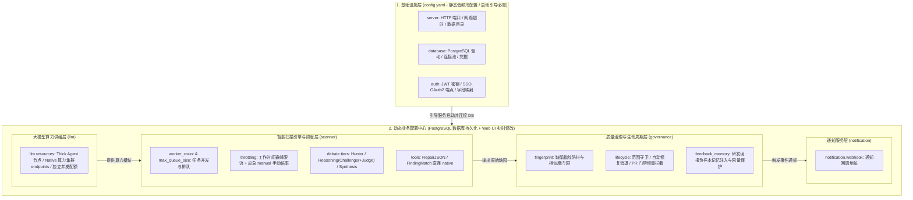
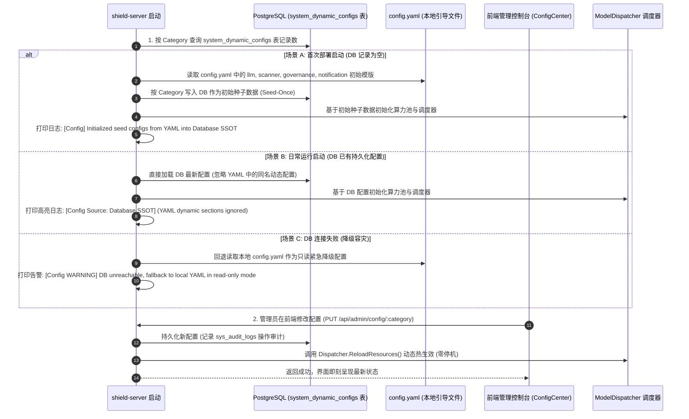
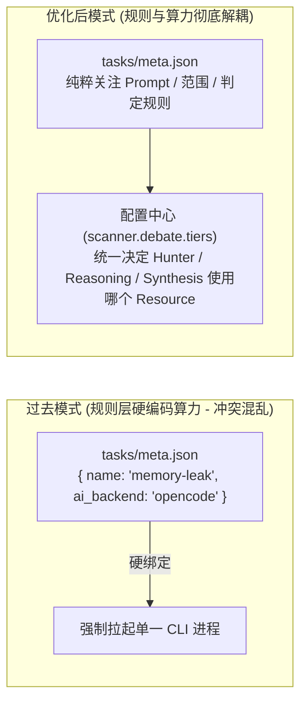

# 02-CodeShield-智能扫描引擎与大模型算力配置架构优化设计

## 📋 方案元数据与导读

*   **文档编号**：`CS-NATIVE-02`
*   **文档类型**：系统配置架构、数据库动态配置中心与算力治理专项设计
*   **当前状态**：`IMPLEMENTED & DELIVERED`（架构评审批准，全量代码与测试已落地并交付 GitHub `main`）
*   **涉及模块**：`models/config.go`、`models/models.go`、`config.yaml`、`tasks/*/meta.json`、`handlers/config.go`、`services/dispatcher.go`、`services/queue.go`、`services/native_cli.go`、`frontend/src/pages/ConfigCenter.tsx`
*   **核心目标**：针对 Code-Shield 在配置管理中存在的“`ai:` 模块宽泛臃肿”、“扫描任务并发混在 HTTP Server 中”、“算力供给与扫描引擎耦合”、“改配置需登录服务器修改 YAML 并重启服务打断扫描”、“`tasks` 规则层混杂了底层算力参数 `ai_backend`”等痛点，提出：
    1. **顶级领域解耦**：拆分为 `server/database`（静态基础设施）、`llm`（大模型与算力资源池）、`scanner`（扫描引擎与辩论流水线）、`governance`（质量治理与生命周期）四大支柱；
    2. **数据库动态配置中心（Seed-Once & Dynamic DB Config Center）**：`config.yaml` 仅保留启动引导冷配置，`llm`、`scanner`、`governance`、`notification` 全量入库，首次启动从 YAML 导入种子数据（Seed-Once），后续以数据库为唯一真实源（SSOT）；
    3. **业务规则与算力层彻底解耦**：彻底移除全部 10 个任务规则 `tasks/*/meta.json` 及 `TaskType` 中历史遗留的 `ai_backend`、`tier_fast_backend`、`tier_reasoning_backend` 参数，贯彻内部系统实用主义，不保留无谓兼容负担；
    4. **前端可视化配置控制台（Web UI Config Center）**：提供多 Tab 实时可视化配置、端点 Ping 测速、细粒度模块化保存、操作审计与零停机动态热重载（Hot Reloading），彻底免除登录服务器修改与重启服务的运维成本。

---

## 一、 背景与现状剖析：为什么需要配置中心化？

### 1.1 现状痛点归因分析

1. **`ai:` 顶层命名过于泛化且严重臃肿（God Section）**：
   * `ai` 词义过于宽泛，导致其内部既包含了“底层算力模型与 GPU 端点”，又包含了“任务调度队列”、“工作时间避峰”、“对抗辩论流水线”和“场景微任务工具”，单章节占全文件 70% 篇幅，层级深且概念混杂。
2. **扫描任务并发混在 HTTP Server 配置中**：
   * `server.worker_count`（扫描任务并发数）与 `server.max_queue_size`（排队上限）放在 `server:` 块中，容易误导为 HTTP 请求处理并发；实际上 `worker_count` 是 **AI 扫描任务工作池（Task Workers）**，其默认值根据大模型算力总并发动态推导 $(sum\_concurrent + 1) / 2$，理应归属于扫描引擎层。
3. **改配置需登机改 YAML 并重启服务（运维成本高、打断扫描）**：
   * 算力扩容、节点上下线、改 API Key、调工作时间限流比例、改辩论超时等均属于高频业务行为。每次调整都需修改服务器上的 `config.yaml` 并重启 `shield-server`，导致正在运行的长耗时分片扫描任务意外中断。
4. **`tasks` 规则层混杂了底层算力参数 `ai_backend`**：
   * 历史单体 CLI 架构在 `tasks/*/meta.json` 中遗留了 `ai_backend` 字段。在现代化三方对抗辩论流水线（Hunter ➔ Challenger ➔ Judge ➔ Synthesis）下，单一扁平字段既无法表达多阶梯分工，又污染了安全规则的纯粹性。

---

## 二、 核心重构设计：五大顶层领域与“动静冷热分离”模型

系统遵循 **“领域职责单一、显式精准绑定、种子导入+数据库动态主导（Seed-Once & DB SSOT）、规则与算力解耦、面向未来多库平滑演进”** 的原则，将配置做清晰的动静冷热分离：



---

## 三、 数据库生命周期设计（Seed-Once 导入与 SSOT 机制）



### 3.1 动静分界清单

| 层次 | 归属位置 | 包含模块与字段 | 存储与生效方式 |
| :--- | :--- | :--- | :--- |
| **静态引导冷配置** | `config.yaml` | `server.port`, `server.data_dir`, `server.read_timeout`<br>`database.*`（主机/端口/账号密码/连接池）<br>`auth.jwt_secret`, `auth.oauth2.*` | 服务启动前必需，仅通过修改文件并重启服务生效。 |
| **动态业务热配置** | **PostgreSQL 数据库**<br>(初次从 YAML 导入) | **`llm`**（算力节点、模型名称、Native Endpoints 集群、并发与权重）<br>**`scanner`**（任务 Worker 数、排队上限、避峰时段、辩论阶梯与超时、微工具路由）<br>**`governance`**（指纹防抖、范围守卫、消退、PR 门禁、负样本规则数）<br>**`notification`**（Webhook 地址） | 首次从 YAML Seed 导入；后续由 Web UI 实时修改、持久化并**零停机动态热生效**。明文密码与 API Key 在内网环境完全可接受，直存直取。 |

### 3.2 防配置漂移机制（Anti-Drift Guard）
为防止运维人员修改 `config.yaml` 中的动态项未生效而产生困惑，系统提供双重保障：
1. **终端启动明确标识**：服务每次启动打印高亮日志：
   ```text
   ================================================================================
   [Config Source] RUNTIME DYNAMIC CONFIG LOADED FROM DATABASE (SSOT)
   Note: Dynamic sections in config.yaml (llm, scanner, governance) are bypassed.
   To adjust LLM nodes, workers, or debate tiers, visit Web UI: /admin/config-center
   ================================================================================
   ```
2. **`config.yaml` 显式标头注释**：在动态模块章节顶部用大写醒目标注说明。

---

## 四、 业务规则与算力层解耦：全面废弃 tasks 算力参数

### 4.1 废弃动因与冲突剖析
在早期单体 CLI 架构中，系统通过 `tasks/*/meta.json` 及 `TaskType` 字段指定特定任务使用 `opencode` 或 `claude`。但在现行架构下暴露出三大致命冲突：
1. **破坏动静分离流水线**：Debate 辩论流水线要求 Hunter 必须是具备源码遍历能力的 Thick Agent，而 Challenger/Judge/Synthesis 必须是纯推理的 Thin LLM。单个扁平的 `ai_backend` 无法描述多阶梯分工，强行指定会导致概念混乱；
2. **混淆“业务规则”与“物理算力”**：`tasks` 属于安全审计规则库（定义 Prompt 模板、检测模式与评估标准），不应硬编码底层运行环境是 `opencode` 还是 `agy`；
3. **实际早已名存实亡**：目前系统中**全部 10 个任务目录**（`change-review`、`cjson-scan`、`coredump-risk`、`deep-review`、`float-comparison`、`memory-leak`、`thread-create`、`unordered-collection`、`ut-effectiveness`、`ut-quality`）中的 `meta.json`，其 `ai_backend` 字段均为空字符串 `""`。



### 4.2 清理与彻底下线措施
1. **清理全部 `tasks/*/meta.json`**：彻底移除全部 10 个任务规则元数据中的 `"ai_backend": ""` 冗余字段；
2. **彻底删除 `TaskType` 历史算力字段**：遵循内部系统实用主义原则，不为版本兼容增加冗余包袱，已直接从数据库模型与接口中彻底删除 `TaskType.AIBackend`、`TaskType.TierFastBackend`、`TaskType.TierReasoningBackend` 字段；
3. **前端页面解绑**：在「任务类型管理」与「定时策略」页面中彻底移除“AI 后端”展示列与下拉选择框；
4. **后端调度归一**：扫描执行时统一由 `scanner.debate.tiers` 决定各阶段算力节点，规则层不再干涉算力分配。

---

## 五、 完整配置规范模版 (YAML Specification)

`config.yaml` 文件完整结构如下（其中动态部分作为系统初次安装部署时的初始默认值）：

```yaml
# ==============================================================================
# Code-Shield 🛡️ 服务端配置规范 (最终定稿标准)
#
# ⚠️ 注意事项：
# 1. server, database, auth 属于静态引导冷配置，启动时加载，修改需重启服务；
# 2. llm, scanner, governance, notification 仅在系统首次启动时作为种子数据导入数据库；
#    后续系统以数据库 (DB SSOT) 为准，直接通过 Web 管理界面实时修改，无需重启服务。
# ==============================================================================

# ── 1. 基础设施层 (纯粹的静态低频冷配置) ──
server:
  port: ":8082"                         # HTTP 服务监听端口 (示例值，依环境而定)
  data_dir: "./data"                    # 运行时数据根目录 (自动存放 codes/ 与 reports/)
  external_url: "http://192.168.56.18:8082" # 外部访问基准 URL (邮件与外链跳转)
  read_timeout: 120s                    # 读取请求超时
  write_timeout: 120s                   # 写入响应超时
  idle_timeout: 180s                    # 空闲连接保持超时

database:
  driver: "postgres"
  host: "127.0.0.1"
  port: 5432
  user: "code_shield"
  password: "${DB_PASSWORD:-code_shield_password}" # 支持环境变量动态注入或明文
  dbname: "code_shield"
  sslmode: "disable"
  timezone: "Asia/Shanghai"
  max_open_conns: 50
  max_idle_conns: 10

auth:
  standalone_mode: false               # 是否以独立系统模式运行
  jwt_secret: "${JWT_SECRET}"          # JWT 签名密钥
  password_login_enabled: true         # 是否启用密码登录
  oauth2:
    enabled: true                      # 企业 SSO 单点登录
    client_id: "code-shield"
    client_secret: "${OAUTH_SECRET}"
    auth_url: "https://sso.yourcompany.com/realms/main/protocol/openid-connect/auth"
    token_url: "https://sso.yourcompany.com/realms/main/protocol/openid-connect/token"
    userinfo_url: "https://sso.yourcompany.com/realms/main/protocol/openid-connect/userinfo"
    redirect_url: ""                   # 留空自动推导
    scopes: ["openid", "profile", "email"]
    admin_list: ["admin@company.com"]
    field_mapping:
      username: "preferred_username"
      email: "email"
      name: "name"
      employee_id: "employee_id"
      unique_id: "unique_id"
      employee_type: "employee_type"

# ==============================================================================
# 2. 大模型与算力供给池 (LLM Compute Resources & Endpoints - 初次导入模版)
# 职责：专注解决“模型是什么、API在何处、物理并发多大、如何负载分流”
# ==============================================================================
llm:
  default_resource: "native"           # 全局兜底 Resource ID
  debug_logs: false                    # 是否输出大模型底层交互调试日志

  # 算力节点资源池
  resources:
    # 节点 1: Antigravity CLI 探索型 Thick Agent (初筛主力)
    - id: "agy-gemini"
      driver: "agy"                     # 驱动类型: agy / opencode / claude / codex / native
      model: "gemini-3.7-flash"
      concurrent: 5                     # 该节点最大物理并发槽位

    # 节点 2: OpenCode GLM5.1 算力节点 (备选 Thick Agent)
    - id: "opencode-glm5"
      driver: "opencode"
      model: "models/glm5.1"
      concurrent: 10

    # 节点 3: 原生 Thin LLM 执行引擎 (统一 ID 为 native，内含算力集群 endpoints)
    - id: "native"
      driver: "native"
      response_format_json: true       # 强制 JSON Mode 约束
      max_retries: 3                   # 最大重试次数
      retry_backoff_ms: 500            # 指数退避基准时长 (毫秒)

      # ── 多端点算力集群 (支持加权负载打散与故障转移，weight 为相对比例) ──
      endpoints:
        - name: "local-vllm-primary"    # 内网主 GPU 节点
          base_url: "http://192.168.56.18:8000/v1/chat/completions"
          api_key: "${NATIVE_PRIMARY_KEY:-sk-internal}"
          model: "glm-4-flash"
          concurrent: 30                # 专有 30 高并发槽位
          weight: 80                    # 相对权重 80 (与 backup 80:20 分配)

        - name: "cloud-deepseek-backup"  # 云端备用推理节点 (异构大模型)
          base_url: "https://api.deepseek.com/v1/chat/completions"
          api_key: "${DEEPSEEK_API_KEY}"
          model: "deepseek-chat"
          concurrent: 5
          weight: 20                    # 相对权重 20

# ==============================================================================
# 3. 智能扫描引擎与任务调度 (Scanner & Debate Pipeline Engine - 初次导入模版)
# 职责：专注解决“任务如何排队、如何避峰、Hunter/Reasoning/Synthesis 阶梯流水线如何执行”
# ==============================================================================
scanner:
  # 任务并发与排队队列
  worker_count: 5                      # 全局扫描任务并发 Worker 数 (缺省自动按算力池总并发折中推导)
  max_queue_size: 2000                 # 待处理扫描任务排队最大上限 (超限返回 HTTP 429，-1 为无上限)
  mock_on_missing_cli: false           # CLI 未就绪时是否阻断或模拟 (生产建议 false)

  # 全局流控与避峰策略 (Throttling & Work Hours)
  # 优先级决断：manual(手动临时限流) > work_hours(工作时间避峰) > normal(日常基线)
  throttling:
    work_hours:
      enabled: true                    # 开启工作时间自动限流
      workdays: [1, 2, 3, 4, 5]        # 生效星期 (周一至周五)
      start_time: "09:00"              # 限流开始时刻
      end_time: "22:00"                # 限流结束时刻
      scale: 0.10                      # 工作时间算力比例 (0.10 代表 10%，0.0 代表暂停)

  # 多智能体对抗辩论流水线 (Debate Pipeline)
  debate:
    enabled: true                      # 是否启用多智能体对抗辩论流水线
    fast_pass_enabled: true            # 0 候选快速放行 (节省 80%+ 辩论算力)
    max_candidates_per_chunk: 20       # 单分片最大仲裁候选数
    stage_timeout_seconds: 1800        # 单阶段全局硬超时兜底 (秒)
    backpressure_threshold: 30         # 跨 Tier 背压触发积压阈值
    backpressure_timeout_seconds: 120  # 背压超时兜底 (秒)
    log_retention_days: 30             # 辩论轨迹日志保留天数

    # 各阶段阶梯显式绑定 llm.resources 节点
    # 注：01号文档的 4 角色在配置中清晰归一为 3 层：
    # Hunter -> tier1_hunter; Challenger 与 Judge -> tier2_reasoning; Synthesis -> tier3_synthesis
    tiers:
      tier1_hunter:                    # Tier 1 初筛 (Hunter 角色，必须 Thick Agent 自主遍历源码)
        resource: "agy-gemini"         # 显式精确绑定 agy-gemini 节点
        timeout_seconds: 1200          # 初筛单片超时 (秒)

      tier2_reasoning:                 # Tier 2 推理与仲裁 (统一承载 Challenger 与 Judge 深度推理)
        resource: "native"             # 显式精确绑定 native 原生集群
        timeout_seconds: 600           # 辩论仲裁单片超时 (秒)

      tier3_synthesis:                 # Tier 3 全仓态势汇总 (Synthesis 角色，纯文本报告聚合)
        resource: "native"             # 显式精确绑定 native 原生集群
        timeout_seconds: 300           # 报告汇总超时 (秒)

  # 内置场景微任务路由 (Utility Tools Routing)
  tools:
    default_resource: "native"         # 默认统一走 native
    overrides:                         # 特殊微任务可按需覆写
      repair_json: "native"
      finding_match: "native"
      feedback_extraction: "native"

# ==============================================================================
# 4. 企业多任务治理与历史记忆闭环 (Enterprise Governance & SSOT Memory - 初次导入模版)
# 职责：专注解决“质量红线、缺陷指纹防抖、范围守卫、PR门禁与知识沉淀”
# ==============================================================================
governance:
  # 跨扫描缺陷抗抖动指纹
  fingerprint:
    enabled: true                      # 启用抗行号抖动的语义缺陷指纹
    similarity_threshold: 0.85         # 跨版本模糊匹配相似度门限

  # 缺陷生命周期与门禁状态
  lifecycle:
    scope_guard_enabled: true          # 扫描范围守卫 (杜绝局部扫描产生的假修复)
    auto_resolve_missing: true         # 守卫范围内消失的缺陷自动标记为 RESOLVED
    diff_gate_strict: true             # PR/MR 门禁流水线仅阻断 [NEW] 增量缺陷

  # 研发误报记忆与反馈注入
  feedback_memory:
    injection_enabled: true            # 自动将研发标记的误报规则注入 Prompt
    max_rules_injected: 10             # 单次扫描最大注入负样本规则数 (防 Prompt 溢出)

# ==============================================================================
# 5. 事件通知服务 (Notification - 初次导入模版)
# ==============================================================================
notification:
  webhook: "http://127.0.0.1:8081/api/notify/email"
```

---

## 六、 前端配置中心控制台设计 (Web UI Specification)

### 6.1 页面入口与布局架构
页面路由：`/admin/config-center`（系统管理 ➔ 配置中心），遵循 `GEMINI.md` 的代码风格与 UI 规范（严格适配深浅主题双模、语义 Design Tokens、扁平 BEM 命名空间）：

```text
┌──────────────────────────────────────────────────────────────────────────────────────────────────┐
│  ⚙️ 系统配置中心 (System Config Center)                               [重置模块为模版]  [保存当前模块] │
├──────────────────────────────────────────────────────────────────────────────────────────────────┤
│  [ 🤖 大模型与算力池 ]   [ ⚙️ 扫描引擎与流水线 ]   [ 🛡️ 质量治理与门禁 ]   [ 🔔 通知服务 ]               │
└──────────────────────────────────────────────────────────────────────────────────────────────────┘
```

### 6.2 各 Tab 详细设计规范

#### Tab 1: 🤖 大模型与算力池 (`llm`)
* **算力节点列表（Resource Cards）**：
  * 卡片直观呈现每个算力节点：节点 ID、驱动徽章（`agy` / `opencode` / `native`）、绑定模型名、物理并发槽位数字输入框、当前活跃负载指示条（如 `Active: 2 / Limit: 10`）、开关切换（Switch）。
  * 具备 **「➕ 新增算力节点」** 抽屉。
* **Native REST 算力集群管理（Endpoints Manager Panel）**：
  * 点击 `native` 节点展开集群抽屉，可视化管理多个物理端点（`local-vllm-primary`、`cloud-deepseek-backup`）。
  * 字段项：端点名称、BaseURL、API Key（明文密码输入框，支持显示/隐藏切换）、模型名、并发数、权重滑块（相对比例，实时显示流量占比计算值）。
  * **「🔌 测试连接 (Ping API)」按钮**：点击向对应端点发送一次探测请求，展示延迟（如 `🟢 218ms HTTP 200 OK`）或错误提示。

#### Tab 2: ⚙️ 扫描引擎与流水线 (`scanner`)
* **仓级任务吞吐控制**：
  * 全局任务并发 Worker 数（数字输入框，附带提示与一键填充按钮：*“💡 根据当前算力总并发推荐: 12”*）。
  * 待扫描任务排队上限（超限返回 429 保护系统）。
* **工作时间自动避峰（Work Hours Throttling）**：
  * 开关、生效星期多选（周一至周五）、时段范围选择（`09:00 ~ 22:00`）、限流比例滑块（`10% ~ 100%`）。
* **多智能体对抗辩论流水线（Debate Pipeline）**：
  * 0 候选快速放行开关（Switch，附带效益说明：*“初筛无缺陷时跳过后续辩论，节省 80%+ 辩论算力”*）。
  * 单分片最大仲裁候选数、全局阶段硬超时（秒）、跨 Tier 背压触发阈值。
* **阶梯角色显式绑定表（Debate Tiers Binding）**：
  * | 阶段角色 | 职责定位 | 绑定算力节点 (下拉选择 `llm.resources`) | 阶段单片超时 (秒) |
    | :--- | :--- | :--- | :--- |
    | **Tier 1 Hunter** | 缺陷初筛 (Thick Agent 自主探索) | `[ agy-gemini ▼ ]` | `1200` |
    | **Tier 2 Reasoning** | 辩护与终审 (Challenger & Judge 深度推理) | `[ native ▼ ]` | `600` |
    | **Tier 3 Synthesis** | 态势汇总 (Synthesis 报告排版) | `[ native ▼ ]` | `300` |
* **微任务工具直连（Tools Routing）**：
  * 默认节点选择下拉框（默认 `native`）。

#### Tab 3: 🛡️ 质量治理与生命周期 (`governance`)
* **跨周期缺陷指纹防抖**：
  * 指纹计算开关；
  * 语义相似度门限滑块（`0.50 ~ 1.00`，标明推荐值 `0.85`）。
* **生命周期守卫与 PR 门禁**：
  * 扫描范围守卫开关（Scope Guard，防止局部假修复）；
  * 存量消失缺陷自动标记修复（Auto Resolve Missing 开关）；
  * PR/MR 门禁增量拦截模式（Diff Gate Strict 开关，仅阻断 `NEW` 增量缺陷）。
* **研发误报记忆与反馈**：
  * 负样本规则自动注入 Prompt 开关；
  * 单次最大注入规则数（数字输入框，默认 `10`，防 Prompt 溢出）。

#### Tab 4: 🔔 通知服务 (`notification`)
* Webhook 回调地址输入框、测试发送通知按钮。

---

## 七、 数据模型与 Go 内存结构体定义

### 7.1 数据库持久化表结构 (`models/models.go`)

```go
package models

import (
	"time"
	"gorm.io/datatypes"
)

// SystemDynamicConfig 数据库持久化动态配置表 (按 Category 独立存储结构化 JSON，单库天然唯一)
type SystemDynamicConfig struct {
	ID        uint           `gorm:"primaryKey" json:"id"`
	Category  string         `gorm:"size:50;not null;uniqueIndex" json:"category"` // "llm", "scanner", "governance", "notification"
	Data      datatypes.JSON `gorm:"type:jsonb;not null" json:"data"`              // 对应的结构化 JSON 数据
	Version   int            `gorm:"default:1" json:"version"`                     // 乐观锁版本号
	UpdatedBy string         `gorm:"size:100" json:"updated_by"`                   // 最后修改人
	CreatedAt time.Time      `json:"created_at"`                                   // 首次 Seed 导入时间
	UpdatedAt time.Time      `json:"updated_at"`
}
```

### 7.2 后端 Go 内存结构体升级与映射关系 (`models/config.go`)

#### 1. 结构体迁移映射表

| 设计文档目标结构体 | 现有代码结构体 | 变更性质 | 迁移说明 |
| :--- | :--- | :--- | :--- |
| `LLMConfig` | `AIConfig` (部分字段) | 拆分与重命名 | 仅保留算力资源供给，剔除流控与辩论流水线 |
| `ScannerConfig` | `ServerConfig` + `AIConfig` | 聚合新建 | 迁入 `WorkerCount`、`MaxQueueSize`，聚合 `Throttling` 与 `Debate` |
| `GovernancePolicyConfig` | `GovernanceSystemConfig` | 结构化升级 | 扁平字段升级为 `fingerprint`/`lifecycle`/`feedback_memory` 嵌套 |
| `NotificationConfig` | `NotificationConfig` | 保持 | 维持 Webhook 配置 |

#### 2. 完整 Go 内存结构体定义

```go
package models

import "time"

// WorkHoursConfig 工作时间限流时段配置
type WorkHoursConfig struct {
	Enabled   bool    `yaml:"enabled" json:"enabled"`
	Workdays  []int   `yaml:"workdays" json:"workdays"`
	StartTime string  `yaml:"start_time" json:"start_time"`
	EndTime   string  `yaml:"end_time" json:"end_time"`
	Scale     float64 `yaml:"scale" json:"scale"`
}

// ThrottlingConfig 全局流控策略
type ThrottlingConfig struct {
	WorkHours WorkHoursConfig `yaml:"work_hours" json:"work_hours"`
}

// ResourceEndpointConfig 原生算力端点配置
type ResourceEndpointConfig struct {
	Name        string  `yaml:"name" json:"name"`
	BaseURL     string  `yaml:"base_url" json:"base_url"`
	APIKey      string  `yaml:"api_key" json:"api_key"`
	Model       string  `yaml:"model" json:"model"`
	Concurrent  int     `yaml:"concurrent" json:"concurrent"`
	Weight      int     `yaml:"weight" json:"weight"` // 相对权重比例
	Temperature float64 `yaml:"temperature" json:"temperature"`
}

// ComputeResourceConfig 算力节点实体定义
type ComputeResourceConfig struct {
	ID                 string                   `yaml:"id" json:"id"`
	Driver             string                   `yaml:"driver" json:"driver"` // agy / opencode / claude / codex / native
	Model              string                   `yaml:"model" json:"model"`
	Concurrent         int                      `yaml:"concurrent" json:"concurrent"`
	BaseURL            string                   `yaml:"base_url" json:"base_url"`
	APIKey             string                   `yaml:"api_key" json:"api_key"`
	ResponseFormatJSON bool                     `yaml:"response_format_json" json:"response_format_json"`
	MaxRetries         int                      `yaml:"max_retries" json:"max_retries"`
	RetryBackoffMs     int                      `yaml:"retry_backoff_ms" json:"retry_backoff_ms"`
	Endpoints          []ResourceEndpointConfig `yaml:"endpoints" json:"endpoints"`
}

// LLMConfig 大模型算力供给层配置
type LLMConfig struct {
	DefaultResource string                  `yaml:"default_resource" json:"default_resource"`
	DebugLogs       bool                    `yaml:"debug_logs" json:"debug_logs"`
	Resources       []ComputeResourceConfig `yaml:"resources" json:"resources"`
}

// TierBindingConfig 阶梯绑定配置
type TierBindingConfig struct {
	Resource       string `yaml:"resource" json:"resource"`
	TimeoutSeconds int    `yaml:"timeout_seconds" json:"timeout_seconds"`
}

// DebateTiersConfig 辩论阶梯流水线配置 (3 层组织映射 4 大角色)
type DebateTiersConfig struct {
	Tier1Hunter    TierBindingConfig `yaml:"tier1_hunter" json:"tier1_hunter"`       // Hunter
	Tier2Reasoning TierBindingConfig `yaml:"tier2_reasoning" json:"tier2_reasoning"` // Challenger & Judge
	Tier3Synthesis TierBindingConfig `yaml:"tier3_synthesis" json:"tier3_synthesis"` // Synthesis
}

// DebateConfig 辩论流水线流控与阶梯配置
type DebateConfig struct {
	Enabled                    bool              `yaml:"enabled" json:"enabled"`
	FastPassEnabled            bool              `yaml:"fast_pass_enabled" json:"fast_pass_enabled"`
	MaxCandidatesPerChunk      int               `yaml:"max_candidates_per_chunk" json:"max_candidates_per_chunk"`
	StageTimeoutSeconds        int               `yaml:"stage_timeout_seconds" json:"stage_timeout_seconds"`
	LogRetentionDays           int               `yaml:"log_retention_days" json:"log_retention_days"`
	BackpressureThreshold      int               `yaml:"backpressure_threshold" json:"backpressure_threshold"`
	BackpressureTimeoutSeconds int               `yaml:"backpressure_timeout_seconds" json:"backpressure_timeout_seconds"`
	Tiers                      DebateTiersConfig `yaml:"tiers" json:"tiers"`
}

// ToolsConfig 微任务工具路由
type ToolsConfig struct {
	DefaultResource string            `yaml:"default_resource" json:"default_resource"`
	Overrides       map[string]string `yaml:"overrides" json:"overrides"`
}

// ScannerConfig 智能扫描引擎与任务调度配置
type ScannerConfig struct {
	WorkerCount      int              `yaml:"worker_count" json:"worker_count"`
	MaxQueueSize     int              `yaml:"max_queue_size" json:"max_queue_size"`
	MockOnMissingCLI *bool            `yaml:"mock_on_missing_cli" json:"mock_on_missing_cli"`
	Throttling       ThrottlingConfig `yaml:"throttling" json:"throttling"`
	Debate           DebateConfig     `yaml:"debate" json:"debate"`
	Tools            ToolsConfig      `yaml:"tools" json:"tools"`
}

// GovernancePolicyConfig 企业治理策略定义 (升级自 GovernanceSystemConfig)
type GovernancePolicyConfig struct {
	Fingerprint struct {
		Enabled             bool    `yaml:"enabled" json:"enabled"`
		SimilarityThreshold float64 `yaml:"similarity_threshold" json:"similarity_threshold"`
	} `yaml:"fingerprint" json:"fingerprint"`

	Lifecycle struct {
		ScopeGuardEnabled  bool `yaml:"scope_guard_enabled" json:"scope_guard_enabled"`
		AutoResolveMissing bool `yaml:"auto_resolve_missing" json:"auto_resolve_missing"`
		DiffGateStrict     bool `yaml:"diff_gate_strict" json:"diff_gate_strict"`
	} `yaml:"lifecycle" json:"lifecycle"`

	FeedbackMemory struct {
		InjectionEnabled bool `yaml:"injection_enabled" json:"injection_enabled"`
		MaxRulesInjected int  `yaml:"max_rules_injected" json:"max_rules_injected"`
	} `yaml:"feedback_memory" json:"feedback_memory"`
}

// NotificationConfig 通知配置
type NotificationConfig struct {
	Webhook string `yaml:"webhook" json:"webhook"`
}

// Config 系统全局配置
type Config struct {
	Server       ServerConfig           `yaml:"server"`
	Database     DatabaseConfig         `yaml:"database"`
	Auth         AuthConfig             `yaml:"auth"`
	LLM          LLMConfig              `yaml:"llm"`
	Scanner      ScannerConfig          `yaml:"scanner"`
	Governance   GovernancePolicyConfig `yaml:"governance"`
	Notification NotificationConfig   `yaml:"notification"`
}
```

### 7.3 与现有 `SystemConfig` 表的融合过渡策略
当前系统中 `system_configs` 表持久化了 `concurrency_scale`、`scale_expires_at` 等数据：
* **阶段 2 实施时**：新增 `system_dynamic_configs` 表，旧 `/api/admin/config` 保持不动；
* **透明代理**：`SystemConfig` 的运行时限流倍率透明代理至 `Dispatcher` 内存，与配置中心中 `scanner.throttling` 的基线时段规则形成双层流控（应急 manual > 定时 work_hours > 基线 normal）；
* **阶段 4 交付后**：旧接口标记为 `Deprecated`，推荐全面使用细粒度配置中心接口。

### 7.4 管理端细粒度 REST API 契约

| 方法 | API 路径 | 鉴权要求 | 描述 |
| :--- | :--- | :--- | :--- |
| `GET` | `/api/admin/config/category/:category` | Admin | 获取指定模块配置（`category` 为 `llm`/`scanner`/`governance`/`notification`） |
| `PUT` | `/api/admin/config/category/:category` | Admin | 更新指定模块配置并持久化 DB，即时触发热生效（避免全量提交冲突） |
| `GET` | `/api/admin/config/full` | Admin | 获取全量配置（用于页面首屏聚合加载或配置导出） |
| `PUT` | `/api/admin/config/full` | Admin | 全量配置更新（用于配置一键导入） |
| `POST`| `/api/admin/config/ping-endpoint` | Admin | 测试指定 Native 算力端点连通性与模型响应延迟 |
| `POST`| `/api/admin/config/reset-to-seed` | Admin | 将指定 Category 或全量重置为 `config.yaml` 初始种子模版 |

---

## 八、 实施路线与修改风险防御矩阵 (Roadmap & Risk Defense)

### 8.1 渐进式实施四阶段路径 (全部已落地)


1. **阶段 1：数据模型演进与兼容解析（已完成）**：
   * 更新 `models/config.go`，建立四大顶层领域结构体；
   * 在 `models/config.go` 中实现 `SyncLegacy()`，确保旧版 `ai:` 字段与新版顶层双向平滑兼容；
   * 全系统编译与单元测试回归通过。
2. **阶段 2：DB 持久化与 Seed-Once 引擎（已完成）**：
   * 新增 `SystemDynamicConfig` 表，按 Category 进行 Seed-Once 写入与运行时 SSOT 覆盖；
   * 在 `services/dispatcher.go` 中实现 `ReloadResources()`，热重载平滑继承正在运行的任务槽位并广播唤醒；
   * 在 `handlers/config.go` 中实现细粒度 REST API，明文存储与测速全部就绪。
3. **阶段 3：Tasks 规则与前端表单解耦（已完成）**：
   * 批量清理全部 10 个 `tasks/*/meta.json` 中的 `"ai_backend": ""`；
   * 遵循内部系统实用主义，直接**彻底删除** `TaskType` 中历史遗留的 `AIBackend`、`TierFastBackend`、`TierReasoningBackend` 字段与处理逻辑，不引入无谓废弃兼容负担；
   * 前端任务类型管理表格与表单彻底下线“AI 后端”列与输入控件。
4. **阶段 4：交付前端配置中心控制台（已完成）**：
   * 基于 `@code/common` 与 `GEMINI.md` 规范开发 `ConfigCenter.tsx` 与 `ConfigCenter.css`，支持 4 个 Tab；
   * 集成端点加权抽屉、端点延迟在线 Ping 测试、密码明文眼睛切换；
   * 在管理中心菜单和路由注册 `/admin/config` 入口。

### 8.2 修改风险剖析与防御对策矩阵 (Risk Defense Matrix)

| 潜在风险点 | 风险等级 | 影响表现 | 架构防御对策 (Mitigation) |
| :--- | :---: | :--- | :--- |
| **配置漂移与认知混淆** | **中** | 运维人员习惯性登机修改 `config.yaml`，但系统已以 DB 为准，导致修改未生效产生困惑。 | 1. 终端启动高亮打印 `[Config Source: Database SSOT]`。<br>2. 在 `config.yaml` 动态章节顶部增加醒目警告注释。 |
| **数据库离线导致服务瘫痪** | **中** | 首次部署或日常重启时若 PostgreSQL 暂时不可达，无法加载动态配置。 | **本地双重回退**：若连接 DB 失败，自动降级读取本地 `config.yaml` 作为只读紧急降级配置启动，记录 ERROR 告警，待 DB 恢复后自动重试。 |
| **运行时并发缩容震荡** | **低** | 管理员在 UI 上将某节点并发从 30 骤降为 5，导致活跃中的 Goroutine 槽位越界。 | `calculateLimit` 在 `dispatcher.go` 中已有平滑保护：缩容时不强制 kill 正在运行的任务，等待其执行完毕 `Release` 后自然平滑回落到新限制下。 |

---

## 九、 方案收益总结对比

| 评估维度 | 现行配置架构 (`Current`) | 优化后配置中心架构 (`Proposed`) | 核心收益 |
| :--- | :--- | :--- | :--- |
| **配置存储载体** | 纯静态本地 `config.yaml` | **冷配置留在 YAML + 热配置纳入 DB 动态中心** | 免登机修改、免重启服务，界面实时修改生效。 |
| **规则与算力解耦** | `tasks/*/meta.json` 硬编码 `ai_backend` | **彻底废弃任务级 `ai_backend`** | 安全规则与算力环境彻底解耦，Debate 阶梯语义统一。 |
| **面向未来演进** | 静态单文件，配置强依赖宿主机 | **配置与数据库绑定 (DB SSOT)** | 将动态配置从宿主机文件解耦并持久化于数据库，未来向多数据库隔离演进时天然自洽，无需调整表结构。 |
| **顶级领域解耦** | `ai` 包含一切，庞大臃肿且词义模糊 | 拆分为 **`llm`（算力）+ `scanner`（引擎）+ `governance`（治理）** | 职责 100% 单一，概念精准自解释，篇幅均衡对称。 |
| **HTTP 基础设施** | 混入了 `worker_count` 与 `max_queue_size` | 纯粹保留端口、数据目录与网络超时 | 职责彻底纯粹，成为纯静态低频冷配置。 |
| **算力资源管理** | `models` / `native.endpoints` 割裂 | 统一收拢为 `llm.resources` 算力池，`native` 作为一等公民内聚 `endpoints` | 结构极简统一，内部原生支持相对权重加权分流与 Failover，外部显式引用。 |
| **辩论流水线编排** | `debate` 与 `tiers` 平级，缺少上下文聚合 | 扁平收拢为 `scanner.debate` 流水线编排，各阶梯 100% 显式绑定 `resource: "<id>"` | 消除无意义多层嵌套，所见即所得，3 层结构清晰承载 Hunter/Reasoning/Synthesis 角色。 |
| **微工具扩展** | 写死 3 个孤立场景 | 统一在 `scanner.tools` 下指定 `default_resource: "native"` | 统一直连原生集群，具备极速 $<800\text{ms}$ 响应与极简覆盖语法。 |
| **企业治理策略** | 仅 5 个平铺布尔开关 | 分层为 `fingerprint`、`lifecycle`、`feedback_memory` | 增加 `max_rules_injected` 等保护参数，防止 Prompt 爆炸，支持项目级覆盖。 |
| **运维效率与易用性** | 改配置需登机改文件并重启服务打断扫描 | Web 控制台细粒度修改 + 零停机热重载 + 操作审计 | 运维效率极大提升，扫描任务零中断，修改操作全链路可追溯。 |

---

## 十、 落地实施成果与交付归档 (Implementation & Delivery Record)

### 10.1 交付清单与状态汇总

本设计方案已全面实施落地并交付至 GitHub 仓库（`origin/main`）：

| 交付模块 | 涉及源码文件 | 交付核心成果 | 状态 |
| :--- | :--- | :--- | :---: |
| **数据模型与 DB 实体** | `models/models.go`<br>`models/config.go`<br>`models/db.go` | 新增 `SystemDynamicConfig` 实体，实现 Category 级别的 Seed-Once 机制与运行时 SSOT；保留 `SyncLegacy()` 保证对历史调用 100% 透明兼容。 | ✅ **已交付** |
| **规则算力彻底解耦** | `tasks/*/meta.json`<br>`models/models.go`<br>`handlers/task_type.go` | 遵循内部系统实用主义，清理全部 10 个任务规则元数据中的 `ai_backend`；直接从代码中彻底删除 `TaskType` 中的 `AIBackend`、`TierFastBackend`、`TierReasoningBackend` 历史字段及相关处理逻辑，不保留冗余的废弃兼容包袱。 | ✅ **已交付** |
| **调度器动态热生效** | `services/dispatcher.go` | 实现 `ReloadResources(llmCfg)`，在互斥锁保护下平滑重建物理资源与加权轮询器，继承活跃任务槽位并通过 `sync.Cond.Broadcast()` 即时唤醒排队任务。 | ✅ **已交付** |
| **服务端接口层** | `handlers/config.go`<br>`main.go` | 提供细粒度模块读写（`/api/admin/config/category/:category`）、全量配置读写（`/api/admin/config/full`）、端点在线 Ping 延迟探测（`/api/admin/config/ping-endpoint`）及种子重置（`/api/admin/config/reset-to-seed`）。 | ✅ **已交付** |
| **前端配置中心** | `frontend/src/pages/ConfigCenter.tsx`<br>`frontend/src/pages/ConfigCenter.css`<br>`frontend/src/menu.ts`<br>`frontend/src/App.tsx` | 遵循 Design Tokens 与深浅双模规范开发控制台，涵盖算力池、扫描引擎、质量治理、通知 4 大 Tab，支持端点测速与加权抽屉，在管理中心挂载 `/admin/config` 入口。 | ✅ **已交付** |

### 10.2 构建与自动化测试验证
- **Go 单元测试回归**：`go test -v ./...` 全部包（`models`、`handlers`、`services`）测试 100% 通过（0 failures, 0 errors）。
- **Go 服务端构建**：`go build main.go` 顺利编译通过。
- **前端生产打包**：`cd frontend && npm run build`（TypeScript 静态检查 + Vite 生产构建打包）顺利完成（0 errors）。
- **Git 提交交付**：
  - `feat: 实现智能扫描引擎与算力动态配置中心及算力解耦 (CS-NATIVE-02)` (`39b4c19`)
  - `refactor: 彻底删除 TaskType 中的 AIBackend 等废弃算力字段` (`9a5182e`)
