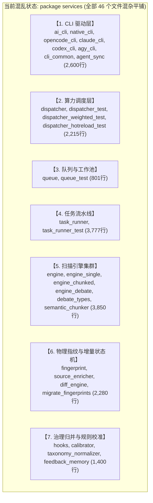

# Services 核心服务层代码现状全景与技术债务诊断报告

## 1. 现状全景体检画像

当前 `code-shield/services` 目录共有 **46 个 Go 源码文件**（包含业务代码与单元测试），代码行数总量高达 **16,421 行**。所有这 46 个文件全部声明在同一个 Go 根命名空间 `package services` 之下。

### 1.1 文件代码行数排行榜 (TOP 20)

| 排名 | 文件路径 | 代码行数 | 主要性质 / 功能 |
| :--- | :--- | :--- | :--- |
| 1 | `services/task_runner_test.go` | 1,934 行 | 任务流水线执行集成与单元测试 |
| 2 | `services/task_runner.go` | 1,843 行 | 任务生命周期总编排、Git拉取、JSON清洗、通知 |
| 3 | `services/engine_debate.go` | 1,247 行 | 多智能体三权分立对抗辩论扫描引擎 (Tier 1/2/3) |
| 4 | `services/dispatcher.go` | 1,183 行 | LLM 算力池动态加权轮询调度 (SWRR)、槽位租约 |
| 5 | `services/engine_chunked.go` | 869 行 | 分片并发分析引擎（含越权的断点续跑逻辑） |
| 6 | `services/hooks.go` | 743 行 | 专项治理 (Campaign) 归并引擎与自定义 Hook |
| 7 | `services/queue.go` | 603 行 | 任务调度队列、Worker 池与优雅排空 |
| 8 | `services/dispatcher_test.go` | 574 行 | 调度器单元测试 |
| 9 | `services/native_cli_test.go` | 563 行 | Native OpenAI 驱动测试 |
| 10 | `services/diff_engine_golden_test.go` | 525 行 | 增量比对状态机黄金用例测试 |
| 11 | `services/engine_debate_test.go` | 455 行 | 辩论引擎集成测试 |
| 12 | `services/native_cli.go` | 416 行 | Native OpenAI / Thin LLM 直连驱动实现 |
| 13 | `services/diff_engine.go` | 380 行 | 跨任务缺陷增量比对、状态机打标与平滑观察期 |
| 14 | `services/source_enricher.go` | 377 行 | 物理源码锚点提取、代码清洗与符号规范化 |
| 15 | `services/cli_common_test.go` | 364 行 | CLI 执行公共辅助测试 |
| 16 | `services/cli_common.go` | 292 行 | 跨 CLI 进程运行、超时捕获、工作目录准备 |
| 17 | `services/semantic_chunker.go` | 287 行 | 源码语义分片器、宏提取与同名头文件投影 |
| 18 | `services/diff_engine_guard_test.go` | 272 行 | 扫描范围守卫测试 |
| 19 | `services/dispatcher_weighted_test.go`| 260 行 | 动态加权轮询算法测试 |
| 20 | `services/ai_cli.go` | 202 行 | AIInvoker 接口、AIRequest、算力上下文注册表 |

---

## 2. 现有文件职责归类与领域分布

尽管在文件系统层面这 46 个文件完全挤在同一平级目录，但在业务逻辑与运行时层面，它们清晰地对应着 **7 大核心功能领域**：



### 领域 1：AI CLI 驱动与多模型适配层 (~2,600 行)
*   **职责**：封装底层各种 AI CLI 工具（Claude CLI、OpenCode CLI、Codex CLI、Agy CLI）及 Native OpenAI HTTP 直连协议。
*   **特性**：属于最底层的通用基础设施，与业务领域的代码静态扫描、缺陷治理毫无强耦合关系。
*   **现有文件**：`ai_cli.go`, `cli_common.go`, `native_cli.go`, `opencode_cli.go`, `claude_cli.go`, `codex_cli.go`, `agy_cli.go`, `agent_sync.go` 以及对应的测试文件。

### 领域 2：LLM 算力池调度与负载均衡 (~2,215 行)
*   **职责**：管理多台并发 LLM 服务器端点，实现平滑加权轮询（SWRR）算法，追踪活跃槽位租约（`LLMSlotLease`），负责实时看板监控与端点故障熔断降级。
*   **特性**：高度自治的资源调度子系统，具有自身完整的健康状态机与并发限流机制。
*   **现有文件**：`dispatcher.go` 及 3 个专项测试文件。

### 领域 3：任务调度与 Worker 队列 (~800 行)
*   **职责**：基于数据库排队任务的乐观锁抢占竞争、Worker 线程池维护、优雅排空（Drain Mode）与暂停派发控制。
*   **现有文件**：`queue.go`, `queue_test.go`。

### 领域 4：任务生命周期与流水线编排 (~3,777 行)
*   **职责**：承接上层请求，管理单次扫描任务从 Git 仓库拉取、分支同步、参数解析、触发分析、驱动后处理 Python 脚本、写出汇总报告到发送邮件通告的完整生命周期。
*   **现有文件**：`task_runner.go`, `task_runner_test.go`。

### 领域 5：AI 静态分析引擎集群 (~3,850 行)
*   **职责**：定义 `TaskEngine` 标准执行契约，包含 `single`（全量单仓）、`chunked`（分片并发）、`debate_full` / `debate_selective`（三权分立对抗辩论流水线），以及跨目录同名投影与语义感知分片（`semantic_chunker.go`）。
*   **现有文件**：`engine.go`, `engine_single.go`, `engine_chunked.go`, `engine_debate.go`, `debate_types.go`, `semantic_chunker.go` 及其测试。

### 领域 6：缺陷物理指纹、空间聚类与增量状态机 (~2,280 行)
*   **职责**：基于物理真实源提取 `SourceAnchor`，消除代码行号与自然语言发散抖动，计算抗漂移的确定性 L1 物理强指纹；在跨任务执行中提供扫描范围守卫、缺陷状态机平滑流转（新发/存量/已解决）与多轮观察期。
*   **现有文件**：`fingerprint.go`, `source_enricher.go`, `diff_engine.go`, `migrate_fingerprints.go` 及其测试。

### 领域 7：专项治理归并、规则校准与反馈沉淀 (~1,400 行)
*   **职责**：专项分析（Campaign）模式的统一归并引擎（全量覆写 vs 增量更新）、剥夺大模型自由裁量权的确定性严重度校准决策树（`CalibrateSeverityDeterministically`）、Category 分类白名单收敛与 CWE 映射（`SanitizeCategory`）、误报规则反馈沉淀（`feedback_memory.go`）。
*   **现有文件**：`hooks.go`, `calibrator.go`, `taxonomy_normalizer.go`, `feedback_memory.go` 及其测试。

---

## 3. 核心技术债务与架构坏味道深度剖析

### 3.1 坏味道一：扁平大单包反模式（Flat Monolith Anti-Pattern）
*   **现状**：46 个文件共 16,421 行代码全都贴在 `package services` 根命名空间下。
*   **危害**：
    1.  **可见性失控**：Go 语言中包私有（小驼峰命名）的变量与函数，在同一个 package 内部任意文件均可无约束访问。例如 `taskContext`、`activeTasksMu`、`workerNotifyChan`、`engineRegistry` 等内部状态直接暴露给所有 46 个文件。
    2.  **认知负荷极高**：任何新加入的开发者或维护人员打开 `services` 目录，看到的是浩浩荡荡 46 个同级文件，完全无法一眼建立系统的依赖层级模型。
    3.  **阻碍单元测试隔离**：在同一个包内编写单测时，很容易意外依赖到另一个不相干文件的全局状态。

### 3.2 坏味道二：上帝结构体 `taskContext` 导致的抽象泄露
*   **代码实录**（`task_runner.go:92`）：
    ```go
    type taskContext struct {
        ctx             context.Context
        cancel          context.CancelFunc
        report          models.TaskReport
        taskType        models.TaskType
        repo            models.Repository
        codesPath       string
        reportPath      string
        jsonPath        string
        autoNotify      bool
        runParams       models.RunParams
        Attempts        int
        hasFailedChunks bool
        Summary         TaskSummaryReport
        findings        []models.AnalysisFinding
    }
    ```
*   **问题核心**：
    `TaskEngine` 接口（`engine.go:13`）定义为：
    ```go
    type TaskEngine interface {
        Run(ctx *taskContext) error
    }
    ```
    `taskContext` 是一个内部私有结构体。它不仅包含了代码扫描所需的输入（`codesPath`、`runParams`），还杂糅了数据库实体（`report`、`taskType`、`repo`）、取消闭包（`cancel`）、日志统计对象（`Summary`）。
*   **后果**：
    因为 `taskContext` 是包私有的，所有实现 `TaskEngine` 的具体引擎（`SingleEngine`、`ChunkedEngine`、`DebateEngine`）以及后处理钩子（`hooks.go`）**被迫必须留在同一个 package services 根包下，无法迁移到子包中**。这是导致文件全部淤积在根目录的最根本元凶！

### 3.3 坏味道三：契约破坏与职责越权（Contract Violation）
*   **代码实录**：
    在 `engine.go:10` 中明确声明了引擎与流水线的隔离契约：
    > `// 引擎不得调用外层管线方法（runPostProcess、finalize、markFailed）`
*   **实证违规**（`engine_chunked.go:576~864`）：
    在 `engine_chunked.go` 后半部分，为了实现断点续跑 `ResumeFailedChunks(reportID uint)`：
    ```go
    // 违规 1: 引擎自身直接操作 activeTasks 全局锁
    activeTasksMu.Lock()
    activeTasks[reportID] = ctx
    activeTasksMu.Unlock()

    // 违规 2: 引擎自行执行外部 Git 同步
    if err := ctx.prepareAndSync(ctx.repo.URL); err != nil {
        ctx.markFailed(err.Error()) // 违规 3: 违背契约调用 markFailed
    }

    // 违规 4: 引擎自行触发外部流水线后处理与完成提交
    result := ctx.runPostProcess() // 违规调用 runPostProcess
    return ctx.finalize(result)    // 违规调用 finalize
    ```
*   **本质原因**：断点续跑本属于任务流水线（Task Runner）的生命周期调度范畴，却因为历史迭代仓促，被直接就近塞入 `engine_chunked.go` 中，严重破坏了分层契约。

### 3.4 坏味道四：违规雷同代码（严重违反无重复规范）
团队《GEMINI.md》规章明确规定：
> **代码精简原则**：始终保持代码极其简洁。**严禁 Copy-Paste 产生冗余雷同代码**，遇到无用或冗余代码应及时予以重构或彻底删除。

在对全部文件的审查中，发现了极其严重的 **1:1 复制粘贴雷同代码**：

| 代码元素 | 位置 A：`services/source_enricher.go` | 位置 B：`services/reconciliation/anchor.go` | 判定 |
| :--- | :--- | :--- | :--- |
| **`SourceAnchor` 结构体** | 第 16~23 行 | 第 17~24 行 | 字段完全一致（行号、Token、哈希等） |
| **`CleanSourceToken` 函数** | 第 26~46 行 (正则清洗注释、空白、引号) | 第 27~48 行 (正则清洗注释、空白、引号) | 核心算法与正则完全雷同（98% 文本相似度） |
| **`NormalizeScopeSymbol` 函数** | 第 50~80 行 (剥离外层符号、处理 lambda) | 第 51~80 行 (剥离外层符号、处理 lambda) | 核心逻辑与正则完全雷同（95% 文本相似度） |

此外，`services/fingerprint.go` 也对这些函数存在直接依赖。这种同一个物理源码锚点算法在系统里出现多份独立维护拷贝的现象，极易引发算法漂移与去重逻辑不一致的严重隐患。

### 3.5 坏味道五：巨型单文件过载（God Files）
*   `services/task_runner.go` 单文件代码多达 1,843 行，其测试多达 1,934 行。
*   它融合了过于宽泛的生命周期逻辑：
    1.  Git 进程执行与锁清理（`cleanStaleGitLocks`、`prepareAndSync`）；
    2.  底层 AI 进程启动与超时（`executeAI`、`execCommandWithProcessGroup`）；
    3.  低级字符串与 JSON 防御清洗（`cleanJSONFromAI`、`fixUnescapedQuotes`、`recoverAIOutput`）；
    4.  外部邮件通知（`NotifyTaskResult`）；
    5.  后处理脚本驱动（`runPostProcess`）。
*   任何一个环节的微调都会引发巨型文件的高频变更，增加 Git 代码合并冲突（Merge Conflict）概率。

### 3.6 坏味道六：死代码与运行期脏文件混杂
*   **孤立文件**：`services/rules/domain_rules.go`（103 行），定义了 `BuiltinThreadRules`、`BuiltinUnorderedRules` 等多语言代码规则库，但通过全项目检索发现，**没有任何外部或内部 Go 文件引用该 package 或结构体**，属于未被驱动接入的残留死代码。
*   **脏文件污染与根治方案**：`services/data/reports/` 目录下散落了 9 个 `code_review_early_fail_*` 文件。经排查，这些是 `task_runner_test.go` 运行单元测试时生成的临时崩溃记录。
    *   *问题根因*：测试代码使用了硬编码的相对路径，生成了未经清理的落盘文件；
    *   *根治措施*：不能仅靠 `.gitignore` 被动忽略，必须在重构阶段改造所有单元测试，强制使用 Go 标准库提供的 `t.TempDir()` 作为临时测试沙箱目录，测试完成后由操作系统自动回收，彻底从源头上杜绝脏文件残留。

---

## 4. 外部调用依赖现状（为何重构完全可控）

为了评估重构是否会对外部业务产生剧烈冲击，对外部调用点进行了精准统计：

```
引用 code-shield/services 的外部文件清单：
1. main.go                           -> 注册 AIInvoker、初始化 Worker 队列、启动定时同步
2. handlers/task.go                  -> 调用 CancelRunningTask、GetRunningTasks、NotifyWorker
3. handlers/config.go                -> 获取并配置 AI 后端合法性与默认值
4. handlers/debug.go                 -> 算力看板实时透视与并发槽位租约统计
5. handlers/schedule.go              -> 调度器控制开关
6. handlers/task_type.go             -> 引擎模式与配置校验
7. handlers/feedback_handler.go      -> 负样本规则提取
8. cron_jobs/jobs.go                 -> 触发定时任务入队
```

```

**结论**：
对 `code-shield/services` 的外部依赖总共只有 **8 个文件**，调用契约非常收敛（集中在任务生命周期控制、算力看板透视与后台入队）。
这表明：**只要我们在 `services` 顶层设计好向后兼容的门面层（Facade Pattern），本次重构对外部业务系统的影响为 0 风险，完全可控！**

---

## 5. 现网实证：业务主线（神似）与代码物理实现（形散）的深度比对

经过对现网真实调用链的逐行审查，我们发现了一个至关重要的事实：
**当前的业务执行主轴本来就是一条高度成熟的“流程大流水线”，团队的技术心智模型完全正确，但在快速迭代下，工程代码实现被击穿变形了。**

### 5.1 现网源码中的“流水线骨架”实证
在 `services/task_runner.go`（第 217~280 行）中，`RunTaskSync` 的真实代码严格按照如下时序串联：

```go
// 现网 task_runner.go:RunTaskSync 真实执行主轴
func RunTaskSync(reportID uint, repoURL string, taskTypeID uint, autoNotify bool, runParams models.RunParams) error {
    // 1. 加载配置与初始数据
    if err := ctx.load(reportID, taskTypeID); err != nil { return err }

    // 2. Git 物理环境准备与互斥排队 (Stage 1)
    if err := ctx.prepareAndSync(repoURL); err != nil { ... }

    // 3. 成本优化门禁检查：无代码变更优雅跳过 (Stage 2)
    if canSkip, err := ctx.checkPrecondition(); err != nil || canSkip { ... }

    // 4. 驱动静态分析引擎执行 (Stage 3 & 4)
    allFindings, err := ctx.executeAnalysis(fileList)

    // 5. 跨任务确定性物理指纹增量比对状态机 (Stage 5)
    allFindings, _ = DiffAndEnrichFindings(ctx.repo.ID, ctx.report.ID, ctx.taskType.ID, fileList, allFindings)

    // 6. 专项治理统一归并与自定义 Hook (Stage 5)
    ctx.executeHooks(allFindings)

    // 7. 执行用户配置的沙箱 Python 后处理脚本 (Stage 5)
    result := ctx.runPostProcess()

    // 8. 数据库事务提交、Summary 生成与状态完成 (Stage 6)
    if err := ctx.finalize(result); err != nil { ... }

    // 9. 邮件通告与 Webhook 交付 (Stage 6)
    NotifyTaskResult(ctx.repo, ctx.taskType, result, ...)
}
```

### 5.2 核心脱节与反差比对（“神似”而“形散”）

| 维度 | 业务设计的心智模型 (神) | 当前物理代码的真实惨状 (形) | 产生原因与隐患 |
| :--- | :--- | :--- | :--- |
| **整体架构** | 流水线作为总指挥，统筹各大工序 | 46 个文件无层级平铺在根目录，无包隔离边界 | 快速演进中缺乏子包归类意识，代码“就近堆放” |
| **模块上下文** | 引擎只接收只读的源码与配置 | 传递上帝结构体 `taskContext`，内含 DB、Git、Cancel 等所有私有数据 | 抽象泄露，导致各引擎与流水线产生物理代码死锁，无法拆解 |
| **断点续跑** | 流水线统一负责 Checkpoint 与补扫编排 | `engine_chunked.go` 内部违规重写了一整套 DB 加载、Git 同步、状态写入逻辑 | 典型的“职责越权”，形成两套逻辑分叉，后处理一旦变更极易漏改 |
| **物理源码锚点** | 全平台唯一的真实源 (SSOT) | `source_enricher.go` 与 `reconciliation/anchor.go` 出现近 1:1 的雷同重复代码 | Copy-Paste 产生技术债务，算法可能发生非预期漂移 |
| **调度职责** | 分清“业务生命周期调度”与“底层物理算力调度” | `task_runner.go` 与 `dispatcher.go` 大泥球化，掺杂大量低级 JSON 语法修补细节 | 职责未正交，单文件过重（超 1800 行），增加合并冲突风险 |

---

## 6. 核心诊断总结：工程正规化重构的紧迫性与低风险性

*   **紧迫性（为什么必须现在重构）**：
    随着三权分立辩论模式（Debate Engine）成为核心生产力、LLM 算力池多活加权调度成为刚需，未来还将进一步接入开源依赖分析（SCA）与 AST 规则扫描。若继续容忍 46 个文件在单个包内杂糅，系统的技术债务将发生“滚雪球效应”，后续任何功能微调都可能因包内全局可见性引发难以预测的回归缺陷。
*   **低风险性（为什么重构非常安全）**：
    1.  **业务脉络完全一致**：我们无需重构业务核心主轴，因为 `RunTaskSync` 已经验证了该流程的完全正确性；
    2.  **外部接口极度收敛**：外部只有 8 处引用，配合顶层 Facade 门面，重构过程对外**完全透明、零破坏**；
    3.  **单元测试保护网坚实**：当前全量测试套件保持 100% PASS，重构全过程具备即时验证防线。

**一句话定性：这是一次纯粹的“工程规范化与生产力解放”重构，是将本就正确的业务逻辑，迁入规整、解耦、长治久安的高质量架构容器！**

