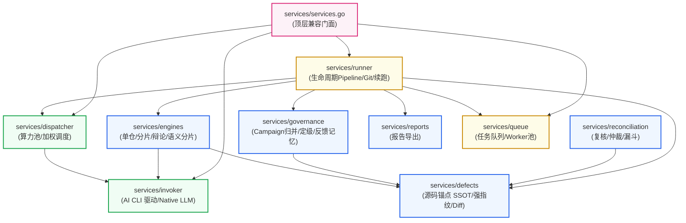
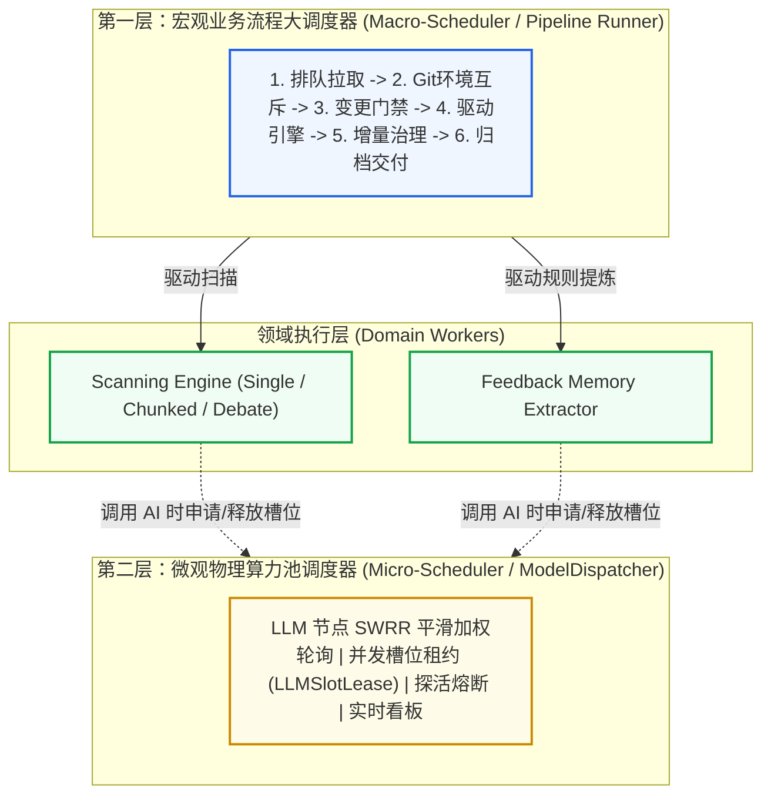

# Services 领域驱动子包化重构设计与契约规范

## 1. 重构指导思想与设计原则

针对当前 `code-shield/services` 扁平单包、职责杂糅与代码重复的现状，本设计方案遵循以下五大核心架构原则：

1. **领域驱动子包化 (Domain-Driven Subpackages)**：
   依据业务边界将系统划分为高内聚的自治子包。Go 语言的 package 是天然的物理访问边界，通过包隔离彻底杜绝私有变量乱串、状态隐式依赖与误调。
2. **契约显式解耦 (Explicit Contract Decoupling)**：
   终结“上帝结构体”`taskContext`。扫描引擎（Engine）与任务流水线（Runner）之间只通过结构清晰、字段严格最小化的 `EngineContext` 交互，彻底解除两者必须位于同一包内的物理锁死。
3. **单一真实源 (Single Source of Truth, SSOT)**：
   严格落实团队“*严禁 Copy-Paste 产生冗余雷同代码*”准则。将分散在 `source_enricher.go` 与 `reconciliation/anchor.go` 中的物理源码锚点提取算法收拢到统一的 `defects` 子包中。
4. **单向无环依赖 (Acyclic Dependency Principle, ADP)**：
   设计清晰的分层调用图，自底向上严格遵循：`invoker` $\to$ `defects` $\to$ `engines` $\to$ `governance` $\to$ `runner` $\to$ `services (Facade)`，从根本上杜绝 Go 语言的 `import cycle not allowed` 编译错误。
5. **门面模式向后兼容 (Facade Backward Compatibility)**：
   在 `services/` 顶层保留精简的门面导出（Facade），外部模块（`handlers/`, `cron_jobs/`, `main.go`）调用的公共入口保持签名兼容，业务层感知为“零破坏性重构”。

---

## 2. 目标拓扑架构与领域子包划分

重构后的目录拓扑如下：

```
code-shield/services/
├── invoker/             # 【CLI 驱动层】统一 AI CLI 进程守护与多模型直连适配器
│   ├── invoker.go       #   AIInvoker 统一接口、AIRequest、LLMWorkContext、注册表
│   ├── common.go        #   跨 CLI 进程运行、超时守护、工作区目录准备、环境变量
│   ├── native.go        #   Direct OpenAI / Thin LLM HTTP 直连协议实现
│   ├── opencode.go      #   OpenCode CLI 适配器
│   ├── claude.go        #   Claude CLI 适配器
│   ├── codex.go         #   Codex CLI 适配器
│   ├── agy.go           #   Antigravity CLI (agy) 适配器
│   └── agent_sync.go    #   OpenCode/Agy 基座 Agent 配置生成与磁盘同步
│
├── dispatcher/          # 【算力调度层】LLM 算力池负载均衡与动态并发管理
│   ├── dispatcher.go    #   ModelDispatcher、平滑加权轮询 (SWRR) 动态权重调度
│   ├── lease.go         #   LLMSlotLease 租约追踪与系统诊断算力看板透视
│   └── health.go        #   多端点健康探活、动态熔断降级与配置热重载
│
├── engines/             # 【扫描引擎集群】标准静态分析引擎实现与语义分片
│   ├── engine.go        #   TaskEngine 接口规范、全新解耦的 EngineContext 定义
│   ├── single/          #   全量单仓扫描引擎实现
│   ├── chunked/         #   分片并发扫描引擎实现（纯扫描逻辑，剔除续跑越权）
│   ├── debate/          #   多智能体三权分立对抗辩论引擎 (Tier 1/2/3 架构)
│   │   ├── engine.go    #     DebateEngine 主执行流
│   │   └── types.go     #     Hunter, Advocate, Judge 阶段输入输出数据结构
│   └── chunker/         #   语义感知分片器
│       ├── chunker.go   #     SemanticBundle、过滤与分片编排
│       ├── project.go   #     跨目录同名投影映射 (Cross-Directory Projection)
│       └── macro.go     #     构建宏定义与公用头文件声明摘要 (Header Outline)
│
├── defects/             # 【缺陷指纹与增量状态机】物理源码锚点与抗抖动增量跟踪 (SSOT)
│   ├── anchor.go        #   统一物理源码锚点（SourceAnchor、Token清洗、符号规范化）
│   ├── fingerprint.go   #   抗行号与上下文抖动的确定性 L1 物理强指纹算法
│   ├── diff_engine.go   #   跨任务增量比对状态机、扫描范围双层物理守卫与多轮平滑观察期
│   └── migration.go     #   历史数据强指纹幂等迁移工具
│
├── governance/          # 【专项治理与反馈沉淀】后处理收敛、规则树与知识沉淀
│   ├── campaign.go      #   专项分析 (Campaign) 统一归并引擎 (全量覆写 vs 增量更新)
│   ├── calibrator.go    #   剥夺大模型自然语言自由裁量权的确定性严重度校准决策树
│   ├── taxonomy.go      #   Category 白名单标准化收敛与 CWE 字典映射
│   └── feedback.go      #   研发人员误报反馈提炼与负样本知识记忆沉淀
│
├── queue/               # 【任务排队与工作池】并发任务调度与流控
│   ├── queue.go         #   TaskQueue、DB 乐观锁抢占出队、优雅排空 (Drain Mode)
│   └── types.go         #   Task 任务定义与状态控制通道
│
├── reconciliation/      # 【已有子包】多模型交叉复核、仲裁与漏斗对账引擎
├── reports/             # 【已有子包】多格式报告导出（Excel, Markdown, JSON, Archive）
│
├── runner/              # 【核心流水线】标准化扫描任务生命周期 Pipeline
│   ├── runner.go        #   RunTaskSync 主管线编排 (Git -> Engine -> PostProcess -> Notify)
│   ├── context.go       #   标准化 ExecutionContext 运行时数据载体
│   ├── git_sync.go      #   代码仓拉取、分支对齐、Git 锁清理与进程级隔离
│   ├── cleaner.go       #   AI 输出 JSON 防御性提取、语法容错与未闭合引号修复
│   ├── notifier.go      #   扫描结果邮件通知与自动化 Webhook 推送
│   └── resume.go        #   断点续跑 Pipeline (原分散在 engine_chunked 中的逻辑彻底归位!)
│
└── services.go          # 【顶层门面 Facade】向后兼容保留原有全局函数，保障调用方零成本平滑过渡
```

---

## 3. 分层依赖关系拓扑 (单向无环 DAG)

系统自底向上严格划分为四个清晰的依赖层级，单向依赖，从物理层面彻底杜绝 Go 语言循环引用（`import cycle not allowed`）：

1. **基础设施层 (Infrastructure)**：`services/invoker`（AI CLI / Native 驱动）、`services/dispatcher`（算力池动态加权与租约）；
2. **核心领域层 (Domain Core)**：`services/defects`（物理源码锚点 SSOT 与指纹比对）、`services/governance`（规则树与治理归并）、`services/reconciliation`（多模型复核对账）；
3. **扫描引擎层 (Analysis Engines)**：`services/engines`（单仓/分片/多智能体三权分立辩论引擎、语义感知分片器）；
4. **任务管线与调度层 (Pipeline & Orchestration)**：`services/queue`（Worker队列）、`services/runner`（生命周期大调度管线）、`services/reports`（多格式导出）；
5. **顶层门面 (Facade)**：`services/services.go`（保持向后兼容的无状态包装函数）。



---

## 4. 双层调度体系规范 (Two-Tier Scheduling Architecture)

在 Code-Shield 的模块化体系中，必须严格区分**宏观业务调度**与**微观算力调度**两个不同层次的调度器职责，防止概念混淆导致的架构回潮：



### 4.1 宏观业务流程大调度器（`services/runner`）
*   **定位**：**业务全生命周期的大管家**。
*   **职责**：负责按固定时序推进：任务状态机更新、本地 Git 仓库排队加锁与检出、Precondition 代码变更门禁判定、调用对应静态扫描引擎、比对历史指纹库、执行专项治理 Hook、触发沙箱 Python 后处理、导出报表及发送邮件通告。
*   **特点**：感知业务数据库、感知任务 ReportID 与业务状态、把控端到端业务闭环。

### 4.2 微观物理算力池调度器（`services/dispatcher`）
*   **定位**：**硬件资源与并发配额的精细化管理者**。
*   **职责**：负责管理配置的多台 LLM 服务器（如 DeepSeek-V3, Qwen-Flash, Claude 3.5, 本地 Ollama），运用平滑加权轮询（SWRR）算法平摊请求压力；追踪发放并发槽位租约（`LLMSlotLease`）；提供主动健康探活与故障节点熔断，并在系统诊断中心提供微任务算力透视。
*   **特点**：**不感知业务**（不知道什么叫 Git 分支、不知道什么叫扫描报告），它只负责“分配算力槽位”与“回收算力槽位”。

---

## 5. 关键契约与核心接口设计规范

### 5.1 契约一：解耦 `taskContext`，定义纯净的 `EngineContext` 与 `TaskEngine`
将原有臃肿的包私有 `taskContext` 提炼为面向引擎的纯数据参数契约 `EngineContext`，并遵循 Go 语言最佳实践将 `context.Context` 提升为函数的**第一参数**：

```go
package engines

import (
    "code-shield/models"
    "code-shield/services/invoker"
    "context"
    "encoding/json"
)

// ProgressCallback 用于引擎向外层管线汇报分片或环节进展
type ProgressCallback func(current, total int, stage, detail string)

// EngineContext 封装静态分析引擎执行所需的最小必要上下文（只读数据对象，剥离 DB 与生命周期控制）
type EngineContext struct {
    ReportID        uint             // 关联任务报告 ID（用于业务透视，非 DB 外键操作）
    RepoID          uint             // 代码仓 ID
    RepoName        string           // 仓库名称
    CodesPath       string           // 代码检出根目录（只读）
    IntermediateDir string           // 仅用于分片模式持久化局部 Checkpoint 缓存文件的临时目录
    TargetScope     string           // 扫描范围约束（"all" 或指定路径）
    RunParams       models.RunParams // 运行时合并参数
    EngineConfig    json.RawMessage  // 引擎私有扩展配置 JSON
    Invoker         invoker.AIInvoker// 底层 AI 调用器实例
    OnProgress      ProgressCallback // 进度汇报回调函数
}

// TaskEngine 定义所有静态扫描引擎的统一纯粹接口
type TaskEngine interface {
    // Mode 返回该引擎对应的执行模式名称（如 "debate_full", "chunked", "single"）
    Mode() string
    // Run 执行扫描分析，产出标准化 findings 列表并以纯内存形式交还流水线
    Run(ctx context.Context, engineCtx *EngineContext) ([]models.AnalysisFinding, error)
}
```

*   **架构收益与持久化分工**：
    1.  **首参规范**：遵循 Go 标准库规范，超时控制与外部取消信号统一通过 `ctx context.Context` 传递，避免将 `Context` 塞进结构体字段；
    2.  **持久化职责明确**：`TaskEngine` 只返回纯内存结果 `[]models.AnalysisFinding`。最终报告（`report.json`、`report.md`）的组装、序列化与落盘统一由外层管线（Runner）集中收口；`IntermediateDir` 仅供引擎在分片超大时做局部 Checkpoint 容灾使用；
    3.  **单元测试脱敏**：引擎不再接触 DB 连接与事物提交，使用构造的 `EngineContext` 即可实现毫秒级的内存单元测试。

### 5.2 契约二：物理源码锚点统一真实源 (SSOT)
在 `services/defects/anchor.go` 中统一定义物理源码锚点数据模型与清洗函数，废弃所有雷同拷贝：

```go
package defects

import (
    "crypto/sha256"
    "encoding/hex"
    "os"
    "path/filepath"
    "regexp"
    "strings"
)

// SourceAnchor 确定性物理源码锚点（缺陷的绝对物理身份证）
// 注：结构体字段的 json 标签为本次重构新增的架构增强点，用于支持分片中间产物的结构化序列化与分布式缓存。
type SourceAnchor struct {
    NormalizedPath  string `json:"normalized_path"`  // 相对仓根目录正斜杠小写路径
    NormalizedScope string `json:"normalized_scope"` // 规范化后的核心作用域 (剥离外部namespace)
    PhysicalToken   string `json:"physical_token"`   // 从物理源码清洗提取的核心语句
    StartLine       int    `json:"start_line"`       // 物理文件绝对起始行
    EndLine         int    `json:"end_line"`         // 物理文件绝对结束行
    ScopeBodyHash   string `json:"scope_body_hash"`  // 作用域代码块 SHA-256
}

// CleanSourceToken 对代码行进行 Token 级去噪清洗 (去除多语言注释、空白符、引号、分号并转小写)
func CleanSourceToken(line string) string {
    // 单一实现，严格收敛于此
    ...
}

// NormalizeScopeSymbol 规范化作用域符号，去除外层顶级命名空间与 lambda 差异
func NormalizeScopeSymbol(rawScope string) string {
    // 单一实现，严格收敛于此
    ...
}
```
*   **架构收益**：
    `services/reconciliation` 直接通过 `import "code-shield/services/defects"` 复用此定义，彻底消除近百行重复代码，并确保整个系统使用完全一致的代码清洗行为。

### 5.3 契约三：微观算力调度器契约 (`services/dispatcher`)
为了保证双层调度体系契约闭环，算力池对外暴露最小化的租约申请与状态透视接口：

```go
package dispatcher

import (
    "code-shield/services/invoker"
    "context"
)

// SlotLease 代表获取到的单次算力执行槽位租约
type SlotLease interface {
    // Release 释放当前槽位，归还并发计数
    Release()
    // ServerID 返回当前分配到的后端服务器节点标识
    ServerID() string
    // Model 返回当前节点实际承载的模型名称
    Model() string
}

// LLMDispatcher 定义算力调度池统一接口
type LLMDispatcher interface {
    // AcquireSlot 依据 SWRR 算法平滑加权申请一个可用并发槽位，支持 context 取消与排队阻塞
    AcquireSlot(ctx context.Context, backend string, workCtx *invoker.LLMWorkContext) (SlotLease, error)
    // Snapshot 返回当前算力池的活跃租约快照，供系统诊断看板使用
    Snapshot() []LLMSlotLease
    // ReloadConfig 动态热加载服务器配置，实现零停机运维
    ReloadConfig() error
}
```

### 5.4 契约四：专项治理与规则后处理契约 (`services/governance`)
统一治理引擎负责缺陷收敛、确定性定级与负样本记忆：

```go
package governance

import "code-shield/models"

// GovernanceEngine 专项治理核心契约
type GovernanceEngine interface {
    // MergeCampaignFindings 执行专项治理缺陷合并与状态机流转 (全量覆写 vs 增量更新)
    MergeCampaignFindings(repoID, taskTypeID, reportID uint, findings []models.AnalysisFinding) error
    // CalibrateSeverity 依据 CWE 与宏隔离规则树进行确定性定级，剥夺模型自由裁量权
    CalibrateSeverity(category, verdict, codeSnippet string) (severity string, ruleCode string)
    // SanitizeCategory 将大模型自由发散的类别收敛至受控白名单字典
    SanitizeCategory(rawCategory string, allowedCategories []string) string
}
```

### 5.5 契约五：断点续跑回归 Runner 管辖与可观测性 (`runner/resume.go`)
将原有混在 `engine_chunked.go` 中的续跑逻辑抽离，形成标准化的续跑执行器，并内置全链路阶段耗时指标（Metrics）：

```go
package runner

import (
    "code-shield/models"
    "code-shield/services/engines"
    "context"
    "fmt"
    "time"
)

// PipelineMetrics 收集单个任务执行在各个阶段的耗时与健康指标
type PipelineMetrics struct {
    GitSyncDurationSec    float64 `json:"git_sync_duration_sec"`
    EngineExecutionSec    float64 `json:"engine_execution_sec"`
    DiffEngineDurationSec float64 `json:"diff_engine_duration_sec"`
    PostProcessSec        float64 `json:"post_process_sec"`
    FinalizeDurationSec   float64 `json:"finalize_duration_sec"`
}

// ResumeTask 执行失败任务或部分分片失败任务的断点续跑
func (r *PipelineRunner) ResumeTask(ctx context.Context, reportID uint) error {
    // 1. 从 DB 加载任务与前序状态
    // 2. 检查 Git 仓库状态与环境互斥锁
    // 3. 读取已持久化的分片 Checkpoint，识别失败分片
    // 4. 组装 EngineContext，仅针对失败分片调用 engines 局部补扫
    // 5. 将补扫产物与历史成功分片聚合，触发 DiffEngine 与 Governance Hook
    // 6. 执行 PostProcess 脚本与 Finalize 事务提交
}
```
*   **架构收益**：
    1.  引擎专注“怎么扫”，Runner 专注“怎么调度与恢复”，职责严格正交；
    2.  内置阶段指标透视，任何一个 Stage（如 Git 锁卡死、Diff 耗时突增）均可被系统诊断中心精准捕获。

### 5.6 契约六：门面层向后兼容与安全包装设计 (`services/services.go`)
在 `services/` 根目录下，保留最薄的一层门面转发。**为防止全局可变变量（`var` 代理）在运行时被意外篡改或被注入恶意逻辑，全面采用无状态的显式函数包装转发（Thin Function Wrappers）**：

```go
package services

import (
    "code-shield/models"
    "code-shield/services/dispatcher"
    "code-shield/services/invoker"
    "code-shield/services/queue"
    "code-shield/services/runner"
    "context"
)

// 向后兼容类型别名（编译期完全透明映射）
type (
    Task            = queue.Task
    AIInvoker       = invoker.AIInvoker
    AIRequest       = invoker.AIRequest
    LLMWorkContext  = invoker.LLMWorkContext
    LLMSlotLease    = dispatcher.LLMSlotLease
    RunningTaskInfo = runner.RunningTaskInfo
)

// 向后兼容显式函数包装（安全转发，杜绝全局变量被篡改风险）
func RunTaskSync(reportID uint, repoURL string, taskTypeID uint, autoNotify bool, runParams models.RunParams) error {
    return runner.RunTaskSync(reportID, repoURL, taskTypeID, autoNotify, runParams)
}

func ResumeFailedChunks(reportID uint) error {
    return runner.ResumeFailedChunks(reportID)
}

func CancelRunningTask(reportID uint) bool {
    return runner.CancelRunningTask(reportID)
}

func CancelAllRunningTasks() {
    runner.CancelAllRunningTasks()
}

func GetRunningTasks() []RunningTaskInfo {
    return runner.GetRunningTasks()
}

func NotifyWorker() {
    queue.NotifyWorker()
}

func GetAIInvoker(name string) AIInvoker {
    return invoker.GetAIInvoker(name)
}

func IsValidAIBackend(name string) bool {
    return invoker.IsValidAIBackend(name)
}

func RegisterAIInvoker(name string, invoker AIInvoker) {
    invoker.RegisterAIInvoker(name, invoker)
}
```
*   **架构收益**：外部 8 个调用文件完全不受任何重构冲击，系统在重构全过程中既享有子包编译隔离的安全性，又拥有向前兼容的零迁移成本。
