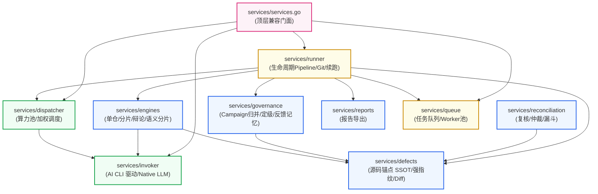
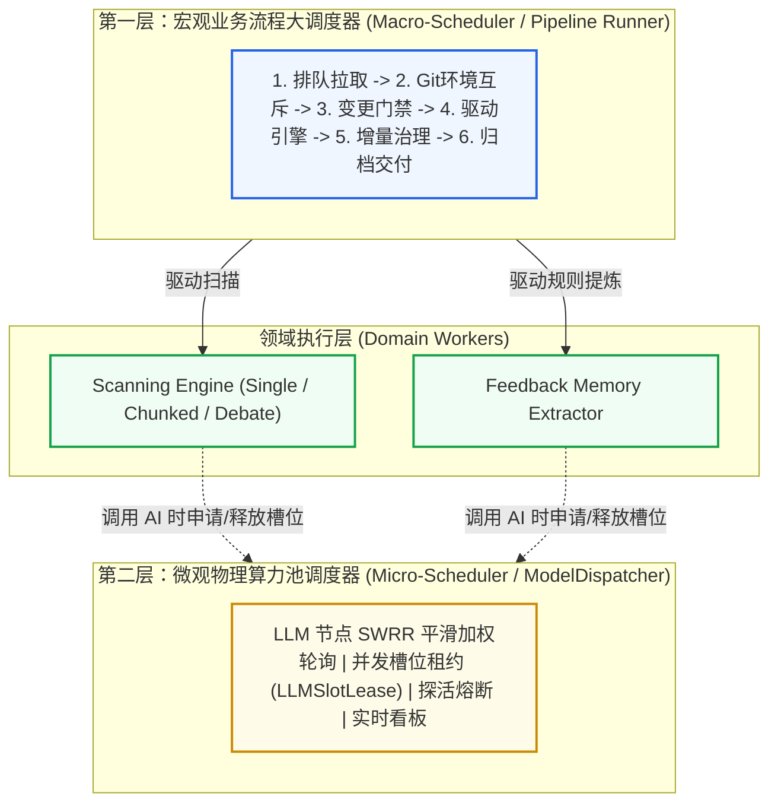

# Services 领域驱动子包化重构设计与契约规范

## 1. 重构指导思想与设计原则

针对当前 `code-shield/services` 扁平单包、职责杂糅与代码重复的现状，本设计方案遵循以下五大核心架构原则：

1. **领域驱动子包化 (Domain-Driven Subpackages)**：
   依据业务边界将系统划分为高内聚的自治子包。Go 语言的 package 是天然的物理访问边界，通过包隔离彻底杜绝私有变量乱串、状态隐式依赖与误调。
2. **契约显式解耦 (Explicit Contract Decoupling)**：
   终结“上帝结构体”`taskContext`。扫描引擎（Engine）与任务流水线（Runner）之间只通过结构清晰、字段严格最小化的 `EngineContext` 交互，彻底解除两者必须位于同一包内的物理锁死。
3. **单一真实源 (Single Source of Truth, SSOT)**：
   严格落实团队“*严禁 Copy-Paste 产生冗余雷同代码*”准则。将分散在 `source_enricher.go` 与 `reconciliation/anchor.go` 中的物理源码锚点提取算法收拢到统一的 `defects` 子包中。
4. **单向无环依赖 (Acyclic Dependency Principle, ADP)**：
   设计清晰的分层调用图，自底向上严格遵循：`invoker` $\to$ `defects` $\to$ `engines` $\to$ `governance` $\to$ `runner` $\to$ `services (Facade)`，从根本上杜绝 Go 语言的 `import cycle not allowed` 编译错误。
5. **门面模式向后兼容 (Facade Backward Compatibility)**：
   在 `services/` 顶层保留精简的门面导出（Facade），外部模块（`handlers/`, `cron_jobs/`, `main.go`）调用的公共入口保持签名兼容，业务层感知为“零破坏性重构”。

---

## 2. 目标拓扑架构与领域子包划分

重构后的目录拓扑如下：

```
code-shield/services/
├── invoker/             # 【CLI 驱动层】统一 AI CLI 进程守护与多模型直连适配器
│   ├── invoker.go       #   AIInvoker 统一接口、AIRequest、LLMWorkContext、注册表
│   ├── common.go        #   跨 CLI 进程运行、超时守护、工作区目录准备、环境变量
│   ├── native.go        #   Direct OpenAI / Thin LLM HTTP 直连协议实现
│   ├── opencode.go      #   OpenCode CLI 适配器
│   ├── claude.go        #   Claude CLI 适配器
│   ├── codex.go         #   Codex CLI 适配器
│   ├── agy.go           #   Antigravity CLI (agy) 适配器
│   └── agent_sync.go    #   OpenCode/Agy 基座 Agent 配置生成与磁盘同步
│
├── dispatcher/          # 【算力调度层】LLM 算力池负载均衡与动态并发管理
│   ├── dispatcher.go    #   ModelDispatcher、平滑加权轮询 (SWRR) 动态权重调度
│   ├── lease.go         #   LLMSlotLease 租约追踪与系统诊断算力看板透视
│   └── health.go        #   多端点健康探活、动态熔断降级与配置热重载
│
├── engines/             # 【扫描引擎集群】标准静态分析引擎实现与语义分片
│   ├── engine.go        #   TaskEngine 接口规范、全新解耦的 EngineContext 定义
│   ├── single/          #   全量单仓扫描引擎实现
│   ├── chunked/         #   分片并发扫描引擎实现（纯扫描逻辑，剔除续跑越权）
│   ├── debate/          #   多智能体三权分立对抗辩论引擎 (Tier 1/2/3 架构)
│   │   ├── engine.go    #     DebateEngine 主执行流
│   │   └── types.go     #     Hunter, Advocate, Judge 阶段输入输出数据结构
│   └── chunker/         #   语义感知分片器
│       ├── chunker.go   #     SemanticBundle、过滤与分片编排
│       ├── project.go   #     跨目录同名投影映射 (Cross-Directory Projection)
│       └── macro.go     #     构建宏定义与公用头文件声明摘要 (Header Outline)
│
├── defects/             # 【缺陷指纹与增量状态机】物理源码锚点与抗抖动增量跟踪 (SSOT)
│   ├── anchor.go        #   统一物理源码锚点（SourceAnchor、Token清洗、符号规范化）
│   ├── fingerprint.go   #   抗行号与上下文抖动的确定性 L1 物理强指纹算法
│   ├── diff_engine.go   #   跨任务增量比对状态机、扫描范围双层物理守卫与多轮平滑观察期
│   └── migration.go     #   历史数据强指纹幂等迁移工具
│
├── governance/          # 【专项治理与反馈沉淀】后处理收敛、规则树与知识沉淀
│   ├── campaign.go      #   专项分析 (Campaign) 统一归并引擎 (全量覆写 vs 增量更新)
│   ├── calibrator.go    #   剥夺大模型自然语言自由裁量权的确定性严重度校准决策树
│   ├── taxonomy.go      #   Category 白名单标准化收敛与 CWE 字典映射
│   └── feedback.go      #   研发人员误报反馈提炼与负样本知识记忆沉淀
│
├── queue/               # 【任务排队与工作池】并发任务调度与流控
│   ├── queue.go         #   TaskQueue、DB 乐观锁抢占出队、优雅排空 (Drain Mode)
│   └── types.go         #   Task 任务定义与状态控制通道
│
├── reconciliation/      # 【已有子包】多模型交叉复核、仲裁与漏斗对账引擎
├── reports/             # 【已有子包】多格式报告导出（Excel, Markdown, JSON, Archive）
│
├── runner/              # 【核心流水线】标准化扫描任务生命周期 Pipeline
│   ├── runner.go        #   RunTaskSync 主管线编排 (Git -> Engine -> PostProcess -> Notify)
│   ├── context.go       #   标准化 ExecutionContext 运行时数据载体
│   ├── git_sync.go      #   代码仓拉取、分支对齐、Git 锁清理与进程级隔离
│   ├── cleaner.go       #   AI 输出 JSON 防御性提取、语法容错与未闭合引号修复
│   ├── notifier.go      #   扫描结果邮件通知与自动化 Webhook 推送
│   └── resume.go        #   断点续跑 Pipeline (原分散在 engine_chunked 中的逻辑彻底归位!)
│
└── services.go          # 【顶层门面 Facade】向后兼容保留原有全局函数，保障调用方零成本平滑过渡
```

---

## 3. 分层依赖关系拓扑 (单向无环 DAG)

系统自底向上严格遵循单向依赖，杜绝循环引用：



---

## 4. 双层调度体系规范 (Two-Tier Scheduling Architecture)

在 Code-Shield 的模块化体系中，必须严格区分**宏观业务调度**与**微观算力调度**两个不同层次的调度器职责，防止概念混淆导致的架构回潮：



### 4.1 宏观业务流程大调度器（`services/runner`）
*   **定位**：**业务全生命周期的大管家**。
*   **职责**：负责按固定时序推进：任务状态机更新、本地 Git 仓库排队加锁与检出、Precondition 代码变更门禁判定、调用对应静态扫描引擎、比对历史指纹库、执行专项治理 Hook、触发沙箱 Python 后处理、导出报表及发送邮件通告。
*   **特点**：感知业务数据库、感知任务 ReportID 与业务状态、把控端到端业务闭环。

### 4.2 微观物理算力池调度器（`services/dispatcher`）
*   **定位**：**硬件资源与并发配额的精细化管理者**。
*   **职责**：负责管理配置的多台 LLM 服务器（如 DeepSeek-V3, Qwen-Flash, Claude 3.5, 本地 Ollama），运用平滑加权轮询（SWRR）算法平摊请求压力；追踪发放并发槽位租约（`LLMSlotLease`）；提供主动健康探活与故障节点熔断，并在系统诊断中心提供微任务算力透视。
*   **特点**：**不感知业务**（不知道什么叫 Git 分支、不知道什么叫扫描报告），它只负责“分配算力槽位”与“回收算力槽位”。

---

## 5. 关键契约与核心接口设计规范

### 5.1 契约一：解耦 `taskContext`，定义干净的 `EngineContext`
将原有臃肿的包私有 `taskContext` 提炼为面向引擎的公开参数契约 `EngineContext`：

```go
package engines

import (
    "code-shield/models"
    "code-shield/services/invoker"
    "context"
    "encoding/json"
)

// ProgressCallback 用于引擎向外层管线汇报分片或环节进展
type ProgressCallback func(current, total int, stage, detail string)

// EngineContext 封装静态分析引擎执行所需的最小必要上下文（只读环境，剥离生命周期控制）
type EngineContext struct {
    Ctx          context.Context
    ReportID     uint
    RepoID       uint
    RepoName     string
    CodesPath    string
    ReportPath   string
    JsonPath     string
    TargetScope  string
    RunParams    models.RunParams
    EngineConfig json.RawMessage
    Invoker      invoker.AIInvoker
    OnProgress   ProgressCallback
}

// TaskEngine 定义所有静态扫描引擎的统一纯粹接口
type TaskEngine interface {
    // Mode 返回该引擎对应的执行模式名称（如 "debate_full", "chunked", "single"）
    Mode() string
    // Run 执行扫描分析，产出标准化 findings 列表，写入中间文件并返回
    Run(ctx *EngineContext) ([]models.AnalysisFinding, error)
}
```

*   **架构收益**：
    1.  引擎不再接触 DB 连接与事务提交；
    2.  引擎不再接触外层的 `markFailed` 或 `finalize`；
    3.  引擎可使用模拟的 `EngineContext` 进行**纯粹的高速单元测试**，彻底摆脱外部数据库与 Git 依赖。

### 4.2 契约二：物理源码锚点统一真实源 (SSOT)
在 `services/defects/anchor.go` 中统一定义物理源码锚点数据模型与清洗函数，废弃所有雷同拷贝：

```go
package defects

import (
    "crypto/sha256"
    "encoding/hex"
    "os"
    "path/filepath"
    "regexp"
    "strings"
)

// SourceAnchor 确定性物理源码锚点（缺陷的绝对物理身份证）
type SourceAnchor struct {
    NormalizedPath  string `json:"normalized_path"`  // 相对仓根目录正斜杠小写路径
    NormalizedScope string `json:"normalized_scope"` // 规范化后的核心作用域 (剥离外部namespace)
    PhysicalToken   string `json:"physical_token"`   // 从物理源码清洗提取的核心语句
    StartLine       int    `json:"start_line"`       // 物理文件绝对起始行
    EndLine         int    `json:"end_line"`         // 物理文件绝对结束行
    ScopeBodyHash   string `json:"scope_body_hash"`  // 作用域代码块 SHA-256
}

// CleanSourceToken 对代码行进行 Token 级去噪清洗 (去除多语言注释、空白符、引号、分号并转小写)
func CleanSourceToken(line string) string {
    // 单一实现，严格收敛于此
    ...
}

// NormalizeScopeSymbol 规范化作用域符号，去除外层顶级命名空间与 lambda 差异
func NormalizeScopeSymbol(rawScope string) string {
    // 单一实现，严格收敛于此
    ...
}
```
*   **架构收益**：
    `services/reconciliation` 直接通过 `import "code-shield/services/defects"` 复用此定义，彻底消除近百行重复代码，并确保整个系统使用完全一致的代码清洗行为。

### 4.3 契约三：断点续跑回归 Runner 管辖 (`runner/resume.go`)
将原有混在 `engine_chunked.go` 中的续跑逻辑抽离，形成标准化的续跑执行器：

```go
package runner

import (
    "code-shield/models"
    "code-shield/services/engines"
    "fmt"
    "log"
)

// ResumeTask 执行失败任务或部分分片失败任务的断点续跑
func (r *PipelineRunner) ResumeTask(reportID uint) error {
    // 1. 从 DB 加载任务与前序状态
    // 2. 检查 Git 仓库状态与环境锁
    // 3. 读取已执行的 Chunk 记录，找出失败的分片
    // 4. 初始化 EngineContext，仅针对失败的分片调用 Engine 重新执行
    // 5. 重新聚合全量 Findings，触发 DiffEngine 与 Governance Hook
    // 6. 执行 PostProcess 脚本与 Finalize 提交
}
```
*   **架构收益**：
    引擎专注“怎么扫”，Runner 专注“怎么调度与恢复”，职责严格正交。

### 4.4 契约四：门面层向后兼容设计 (`services/services.go`)
在 `services/` 根目录下，保留最薄的一层门面转发，外部调用方（如 `handlers` 等）完全无须改动任何代码：

```go
package services

import (
    "code-shield/models"
    "code-shield/services/dispatcher"
    "code-shield/services/invoker"
    "code-shield/services/queue"
    "code-shield/services/runner"
)

// 向后兼容类型别名
type (
    Task            = queue.Task
    AIInvoker       = invoker.AIInvoker
    AIRequest       = invoker.AIRequest
    LLMWorkContext  = invoker.LLMWorkContext
    LLMSlotLease    = dispatcher.LLMSlotLease
    RunningTaskInfo = runner.RunningTaskInfo
)

// 向后兼容全局函数代理
var (
    RunTaskSync          = runner.RunTaskSync
    ResumeFailedChunks   = runner.ResumeFailedChunks
    CancelRunningTask    = runner.CancelRunningTask
    CancelAllRunningTasks = runner.CancelAllRunningTasks
    GetRunningTasks      = runner.GetRunningTasks
    NotifyWorker         = queue.NotifyWorker
    GetAIInvoker         = invoker.GetAIInvoker
    IsValidAIBackend     = invoker.IsValidAIBackend
    RegisterAIInvoker    = invoker.RegisterAIInvoker
)
```
*   **架构收益**：外部 8 个调用文件完全不受任何重构冲击，系统在重构全过程中始终具备可编译、可测试的平滑特性。
