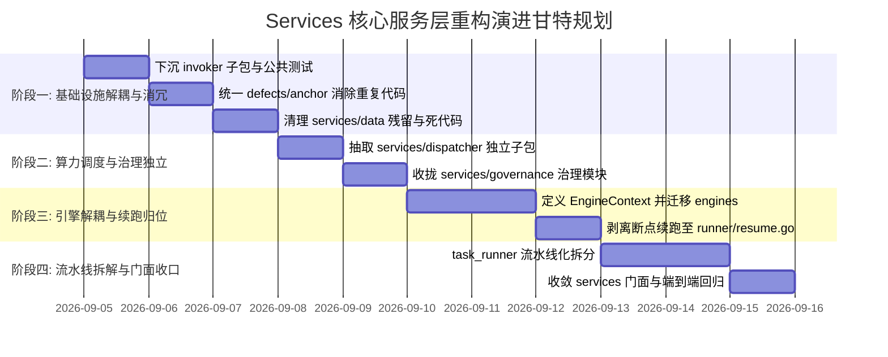

# 分阶段平滑演进路线图与安全落地实施方案

## 1. 演进原则与安全防线

系统重构最忌“大爆炸式重写（Big-Bang Rewrite）”。为了保证现网业务在重构全过程中**不中断、无回归、可追踪、可回滚**，本实施方案严格遵守以下安全红线：

1. **渐进式迁移 (Phased & Incremental)**：分 4 个独立阶段推进，每个阶段只触碰一个独立功能域，避免跨领域交错修改。
2. **每步构建与测试双绿灯 (Zero Regression Gate)**：每个阶段执行完成后，必须在本地运行全量后端编译（`make backend`）与完整单元测试套件（`go test ./...`），测试未 100% 通过严禁进入下一阶段。
3. **门面过渡保障 (Facade Smooth Transition)**：顶层 `services/` 通过 Facade 保持外部 API 兼容，不需要外部系统协同发版。
4. **Git 细粒度提交 (Conventional Commits)**：严格按照团队规范，每个独立子包迁移使用一个标准 commit（如 `refactor: 下沉 AI CLI 适配器至 services/invoker 子包`），便于精准追溯与原子回滚。

---

## 2. 四大演进阶段详细规划



---

### 阶段一：基础设施解耦、消冗与环境净化（预计工期：1~2 天）

*   **目标**：下沉独立性最高的底层 CLI 适配器（解耦 Dispatcher 装饰器以防循环依赖），消除源码物理锚点的重复代码，重构单测沙箱并净化测试残留。
*   **任务清单**：
    1.  **新建 `services/invoker/`（纯驱动层，零外部依赖）**：
        - 迁移纯驱动接口与上下文：`AIInvoker`、`AIRequest`、`LLMWorkContext` 至 `invoker/invoker.go`；
        - **[防循环依赖关键实施]**：`DispatchingInvoker` 与 `GetAIInvoker` 装饰逻辑暂留于 `services/` 根层（将在阶段二迁移至 `dispatcher/wrapper.go`），确保 `invoker` 成为纯净的底层，对 `dispatcher` 和 `services` 根包零依赖；
        - 迁移 `cli_common.go` $\to$ `invoker/common.go`；
        - 迁移 `native_cli.go` $\to$ `invoker/native.go`；
        - 迁移 `opencode_cli.go` $\to$ `invoker/opencode.go`；
        - 迁移 `claude_cli.go` $\to$ `invoker/claude.go`；
        - 迁移 `codex_cli.go` $\to$ `invoker/codex.go`；
        - 迁移 `agy_cli.go` $\to$ `invoker/agy.go`；
        - 迁移 `agent_sync.go` $\to$ `invoker/agent_sync.go`；
        - 平移对应的 6 个 CLI 测试文件入 `invoker/` 并确保独立通过。
    2.  **统一物理源码锚点 (消除雷同代码与算法漂移)**：
        - 新建 `services/defects/anchor.go`，将 `source_enricher.go` 与 `reconciliation/anchor.go` 中雷同且已产生漂移的 `SourceAnchor`、`CleanSourceToken`、`NormalizeScopeSymbol` 收敛至单一实现（SSOT）；
        - 改造 `services/reconciliation/`，使其直接引用 `code-shield/services/defects`，彻底删除其内部雷同副本。
    3.  **测试沙箱改造、环境净化与死代码清理**：
        - 改造 `task_runner_test.go` 与 `semantic_chunker_test.go`，全面强制采用标准库 `t.TempDir()` 作为测试报告沙箱，彻底根治硬编码相对路径污染；
        - 删除当前物理磁盘上遗留的 9 个 `services/data/reports/code_review_early_fail_*` 临时崩溃历史目录；
        - 在 `.gitignore` 中增加 `services/data/` 永久规避规则；
        - 归档并清理全工程零引用的死代码 `services/rules/domain_rules.go`。
*   **阶段验证命令**：
    ```bash
    cd /home/fugui/codes/code-shield
    go fmt ./...
    go test -v ./services/invoker/...
    go test -v ./services/reconciliation/...
    go test -v ./services/...
    ```

---

### 阶段二：算力调度与专项治理领域独立（预计工期：1~2 天）

*   **目标**：将 2,200 多行的 LLM 算力池负载均衡与 1,400 多行的治理归并模块独立为自治子包，闭环 Invoker 装饰器。
*   **任务清单**：
    1.  **新建 `services/dispatcher/`**：
        - 迁移 `dispatcher.go` 及对应 3 个测试文件到 `services/dispatcher/`；
        - 拆解为：
            - `dispatcher.go`（主调度与 SWRR 加权轮询算法）；
            - `lease.go`（并发槽位租约与算力看板快照）；
            - `health.go`（多端点探活与配置热重载）；
            - `wrapper.go`（正式收编阶段一的 `DispatchingInvoker`，提供 `WrapInvoker(inv invoker.AIInvoker)` 装饰方法，形成清晰的 `dispatcher -> invoker` 单向依赖）。
    2.  **新建 `services/governance/`**：
        - 迁移 `hooks.go` $\to$ `governance/campaign.go`（专项分析归并核心逻辑）；
        - 迁移 `calibrator.go` $\to$ `governance/calibrator.go`（确定性定级规则树）；
        - 迁移 `taxonomy_normalizer.go` $\to$ `governance/taxonomy.go`（Category 标准化与 CWE 映射）；
        - 迁移 `feedback_memory.go` $\to$ `governance/feedback.go`（研发反馈负样本提取与沉淀）。
*   **阶段验证命令**：
    ```bash
    go test -v ./services/dispatcher/...
    go test -v ./services/governance/...
    go test -v ./services/...
    ```

---

### 阶段三：扫描引擎规范化与断点续跑解耦（预计工期：2~3 天）

*   **目标**：引入 `EngineContext`（注入 NegativeRules）与 `EngineResult`（承载 Findings、DebateLogs、TokenUsage）彻底解耦 `taskContext`，提升 `ChunkConfig` 杜绝内部循环引用，并将断点续跑归位至 Runner。
*   **任务清单**：
    1.  **新建 `services/engines/`**：
        - 在 `engines/engine.go` 中定义 `TaskEngine`、`EngineContext` 与 `EngineResult` 契约；
        - 在 `engines/config.go` 中定义共享的 `ChunkConfig`（杜绝 `chunked` 与 `chunker` 间的同层互引）；
        - 迁移 `engine_single.go` $\to$ `engines/single/`；
        - 迁移 `engine_chunked.go`（纯扫描逻辑，剥离续跑与 DB 更新）$\to$ `engines/chunked/`；
        - 迁移 `engine_debate.go` 与 `debate_types.go` $\to$ `engines/debate/`（移除其内部直接读写 `models.DB` 操作，将生成的 `TaskDebateLog` 与 Token 消耗通过 `EngineResult` 纯内存返回）；
        - 迁移 `semantic_chunker.go` $\to$ `engines/chunker/`。
    2.  **断点续跑职责归位**：
        - 将原挤在 `engine_chunked.go:576~864` 的 `ResumeFailedChunks` 彻底剥离，移入待重构的 `runner/resume.go`，由 Runner 作为任务流编排进行 Checkpoint 读取与局部补扫调度。
*   **阶段验证命令**：
    ```bash
    go test -v ./services/engines/...
    go test -v ./services/...
    ```

---

### 阶段四：流水线拆解与顶层 Facade 门面收口（预计工期：1~2 天）

*   **目标**：将 3,700 多行的 `task_runner.go` 拆解为 6 大标准 Pipeline 流水线阶段，明确 `Queue -> Runner` 拓扑，并在 `services/` 顶层建立薄门面。
*   **任务清单**：
    1.  **新建 `services/runner/`**：
        - 将 `task_runner.go` 按照生命周期拆分为：
            - `runner.go`（主生命周期协调器，负责 Stage 1 到 Stage 6 编排）；
            - `context.go`（只读 `EngineContext` 组装器，Stage 3 预查 DB 注入 `NegativeRules`）；
            - `git_sync.go`（Git 拉取、锁清理、分支比对）；
            - `cleaner.go`（AI 输出 JSON 防御性提取、语法容错与引号修复）；
            - `notifier.go`（结果邮件与 Webhook 通告）；
            - `finalize.go`（Stage 6 统一开启单一事务，原子持久化 Findings、DebateLogs 与 Token 统计）；
            - `resume.go`（阶段三承接的断点续跑流程）；
            - `errors.go`（标准错误定义，下沉 `ErrSkipped` 供 Queue 引用）。
    2.  **重构 `services/queue/` 依赖**：
        - 明确由 `queue.worker` 单向引用并驱动 `runner.RunTaskSync` / `runner.ResumeFailedChunks`，彻底消除拓扑倒置。
    3.  **收敛顶层 `services/services.go`**：
        - 配置标准 Facade 别名与显式函数包装，`GetAIInvoker` 采用 `dispatcher.GetGlobal().WrapInvoker(...)` 安全装配，保持现有 `handlers/`、`main.go`、`cron_jobs/` 无须修改任何 import 路径。
*   **全系统最终验收命令**：
    ```bash
    # 1. 编译全系统
    make build
    # 2. 运行全量单元测试与竞态检查
    go test -race -v ./services/...
    # 3. 架构防腐静态门禁检查
    make lint-arch
    # 4. 前端与静态检查
    cd frontend && npm run lint
    ```

---

## 3. 回滚方案与应急处置预案 (Rollback Playbook)

由于采用了严格分阶段推进策略，任何阶段如果出现阻断性问题，均可执行**安全原子回滚与路由降级**（严禁在公共分支使用破坏历史的 `git reset --hard`）：

| 故障场景 | 影响阶段 | 处置策略与安全操作 |
| :--- | :--- | :--- |
| **编译期循环依赖 (`import cycle`)** | 阶段二 / 阶段三 | 1. 检查是否违反分层调用原则（如领域层反向依赖了管线层）；<br/>2. 将跨层数据交互提取为接口；<br/>3. 若需紧急回滚，使用 `git revert -m 1 <commit_hash>` 或针对子包生成反向提交，安全撤销改动。 |
| **断点续跑状态不一致** | 阶段三 | 1. 通过配置中的**特性开关（Feature Toggle）**：`features.use_modular_runner: false`，一秒切回旧版 Runner 流程；<br/>2. 验证 `runner/resume.go` 加载的前序 Chunk JSON 字段兼容性，修复后重新打开开关。 |
| **外部 Handler 调用报错** | 阶段四 | 检查 `services/services.go` 的 Facade 门面是否遗漏包装某公共函数，补齐包装函数后重新编译部署。 |

---

## 4. 架构防腐静态门禁 (Architecture Guard in CI)

为了防止未来新功能开发时“架构退化”（例如开发者在 `engines/` 内部偷偷调用 `models.DB.Save()` 重新引入双向依赖），在 CI 流水线中引入**编译期架构防腐静态检查门禁**：

```bash
# CI 架构防腐检查脚本示例 (可在 Makefile 中作为 make lint-arch 执行)
#!/usr/bin/env bash
set -e

echo "[ArchGuard] 检查引擎层与底层驱动是否发生 DB 抽象泄露..."

# 1. 扫描 engines 子包是否非法直接依赖全局 models.DB
ILLEGAL_DB_USAGE=$(grep -rn "models\.DB" services/engines/ || true)
if [ -n "$ILLEGAL_DB_USAGE" ]; then
    echo "❌ [ArchGuard 失败] 扫描引擎层严禁直接调用 models.DB 全局数据库实体："
    echo "$ILLEGAL_DB_USAGE"
    echo "💡 请将持久化与事务职责移交至流水线 (Runner) 处理，引擎必须保持纯内存计算。"
    exit 1
fi

# 2. 检查 invoker 驱动层是否逆向依赖了上层引擎或流水线
ILLEGAL_INVOKER_DEP=$(grep -rn "code-shield/services/engines\|code-shield/services/runner" services/invoker/ || true)
if [ -n "$ILLEGAL_INVOKER_DEP" ]; then
    echo "❌ [ArchGuard 失败] 底层驱动 invoker 严禁逆向依赖上层引擎或流水线："
    echo "$ILLEGAL_INVOKER_DEP"
    exit 1
fi

echo "✅ [ArchGuard 通过] 架构分层契约严整，无违规反向依赖。"
```
*   **收益**：将架构设计规范从“口头契约”升级为“机器强制保障”，杜绝架构腐化。
