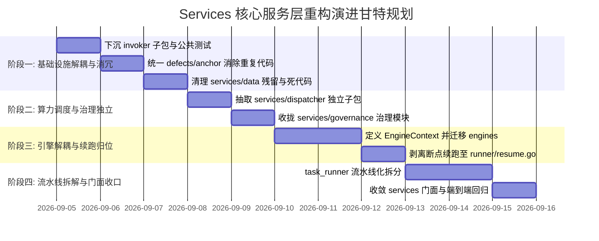

# 分阶段平滑演进路线图与安全落地实施方案

## 1. 演进原则与安全防线

系统重构最忌“大爆炸式重写（Big-Bang Rewrite）”。为了保证现网业务在重构全过程中**不中断、无回归、可追踪、可回滚**，本实施方案严格遵守以下安全红线：

1. **渐进式迁移 (Phased & Incremental)**：分 4 个独立阶段推进，每个阶段只触碰一个独立功能域，避免跨领域交错修改。
2. **每步构建与测试双绿灯 (Zero Regression Gate)**：每个阶段执行完成后，必须在本地运行全量后端编译（`make backend`）与完整单元测试套件（`go test ./...`），测试未 100% 通过严禁进入下一阶段。
3. **门面过渡保障 (Facade Smooth Transition)**：顶层 `services/` 通过 Facade 保持外部 API 兼容，不需要外部系统协同发版。
4. **Git 细粒度提交 (Conventional Commits)**：严格按照团队规范，每个独立子包迁移使用一个标准 commit（如 `refactor: 下沉 AI CLI 适配器至 services/invoker 子包`），便于精准追溯与原子回滚。

---

## 2. 四大演进阶段详细规划



---

### 阶段一：基础设施解耦、消冗与环境净化（预计工期：1~2 天）

*   **目标**：下沉独立性最高的底层 CLI 适配器，消除源码物理锚点的重复代码，净化工作区测试残留。
*   **任务清单**：
    1.  **新建 `services/invoker/`**：
        - 迁移 `ai_cli.go` $\to$ `invoker/invoker.go`
        - 迁移 `cli_common.go` $\to$ `invoker/common.go`
        - 迁移 `native_cli.go` $\to$ `invoker/native.go`
        - 迁移 `opencode_cli.go` $\to$ `invoker/opencode.go`
        - 迁移 `claude_cli.go` $\to$ `invoker/claude.go`
        - 迁移 `codex_cli.go` $\to$ `invoker/codex.go`
        - 迁移 `agy_cli.go` $\to$ `invoker/agy.go`
        - 迁移 `agent_sync.go` $\to$ `invoker/agent_sync.go`
        - 及其对应的 6 个测试文件平移入 `invoker/`。
    2.  **统一物理源码锚点 (消除雷同代码)**：
        - 新建 `services/defects/anchor.go`，将 `source_enricher.go` 与 `reconciliation/anchor.go` 中雷同的 `SourceAnchor`、`CleanSourceToken`、`NormalizeScopeSymbol` 收敛至单一实现。
        - 改造 `services/reconciliation/`，使其直接引用 `code-shield/services/defects`，删除其内部雷同实现。
    3.  **环境净化与死代码清理**：
        - 在 `.gitignore` 中增加 `services/data/` 规避规则，清理当前误提交/残留的临时崩溃报告。
        - 归档并清理无引用的 `services/rules/domain_rules.go`。
*   **阶段验证命令**：
    ```bash
    cd /home/fugui/codes/code-shield
    go fmt ./...
    go test -v ./services/invoker/...
    go test -v ./services/reconciliation/...
    go test -v ./services/...
    ```

---

### 阶段二：算力调度与专项治理领域独立（预计工期：1~2 天）

*   **目标**：将 2,200 多行的 LLM 算力池负载均衡与 1,400 多行的治理归并模块独立为自治子包。
*   **任务清单**：
    1.  **新建 `services/dispatcher/`**：
        - 迁移 `dispatcher.go` 及对应 3 个测试文件到 `services/dispatcher/`；
        - 拆解为 `dispatcher.go`（主调度与 SWRR 算法）、`lease.go`（并发槽位租约）、`health.go`（探活与热重载）。
    2.  **新建 `services/governance/`**：
        - 迁移 `hooks.go` $\to$ `governance/campaign.go`（专项分析归并核心逻辑）；
        - 迁移 `calibrator.go` $\to$ `governance/calibrator.go`（确定性定级规则树）；
        - 迁移 `taxonomy_normalizer.go` $\to$ `governance/taxonomy.go`（Category 标准化与 CWE 映射）；
        - 迁移 `feedback_memory.go` $\to$ `governance/feedback.go`（研发反馈负样本提取与沉淀）。
*   **阶段验证命令**：
    ```bash
    go test -v ./services/dispatcher/...
    go test -v ./services/governance/...
    go test -v ./services/...
    ```

---

### 阶段三：扫描引擎规范化与断点续跑解耦（预计工期：2~3 天）

*   **目标**：引入 `EngineContext` 彻底解耦 `taskContext`，收拢所有分析引擎，并将断点续跑归位至 Runner。
*   **任务清单**：
    1.  **新建 `services/engines/`**：
        - 在 `engines/engine.go` 中定义 `TaskEngine` 与全新解耦的 `EngineContext`；
        - 迁移 `engine_single.go` $\to$ `engines/single/`；
        - 迁移 `engine_chunked.go`（纯扫描逻辑）$\to$ `engines/chunked/`；
        - 迁移 `engine_debate.go` 与 `debate_types.go` $\to$ `engines/debate/`；
        - 迁移 `semantic_chunker.go` $\to$ `engines/chunker/`。
    2.  **断点续跑职责归位**：
        - 将原挤在 `engine_chunked.go:576~864` 的 `ResumeFailedChunks` 彻底剥离，移入待重构的 `runner/resume.go`，由 Runner 作为任务流编排进行恢复。
*   **阶段验证命令**：
    ```bash
    go test -v ./services/engines/...
    go test -v ./services/...
    ```

---

### 阶段四：流水线拆解与顶层 Facade 门面收口（预计工期：1~2 天）

*   **目标**：将 3,700 多行的 `task_runner.go` 拆解为职责明确的 Pipeline 流水线阶段，并在 `services/` 顶层建立薄门面。
*   **任务清单**：
    1.  **新建 `services/runner/`**：
        - 将 `task_runner.go` 按照生命周期拆分为：
            - `runner.go`（主生命周期协调器）
            - `context.go`（上下文数据封装）
            - `git_sync.go`（Git 拉取、锁清理、分支比对）
            - `cleaner.go`（JSON 防御提取、容错清理）
            - `notifier.go`（结果邮件与通知）
            - `resume.go`（阶段三承接的断点续跑流程）
    2.  **收敛顶层 `services/services.go`**：
        - 配置标准 Facade 别名与代理，保持现有 `handlers/`、`main.go`、`cron_jobs/` 无须修改任何 import 路径。
*   **全系统最终验收命令**：
    ```bash
    # 1. 编译全系统
    make build
    # 2. 运行全量单元测试
    go test -race -v ./services/...
    # 3. 前端与静态检查
    cd frontend && npm run lint
    ```

---

## 3. 回滚方案与应急处置预案 (Rollback Playbook)

由于采用了严格分阶段推进策略，任何阶段如果出现阻断性问题，均可执行**零污染原子回滚**：

| 故障场景 | 影响阶段 | 处置策略与操作 |
| :--- | :--- | :--- |
| **编译期循环依赖 (`import cycle`)** | 阶段二 / 阶段三 | 立即检查是否违反 ADP 单向无环原则；通过在底层定义 interface 解除双向依赖，若定位困难直接 `git reset --hard HEAD~1` 回退该子包提交。 |
| **断点续跑状态不一致** | 阶段三 | 验证 `runner/resume.go` 加载的前序 Chunk JSON 格式是否兼容。如有隐蔽字段不匹配，临时切回旧版逻辑单测对比，保持数据契约 100% 相同。 |
| **外部 Handler 调用报错** | 阶段四 | 检查 `services/services.go` 的 Facade 门面是否遗漏导出某变量或函数别名，补齐导出后重新编译。 |
