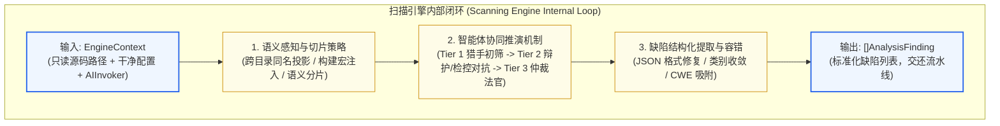
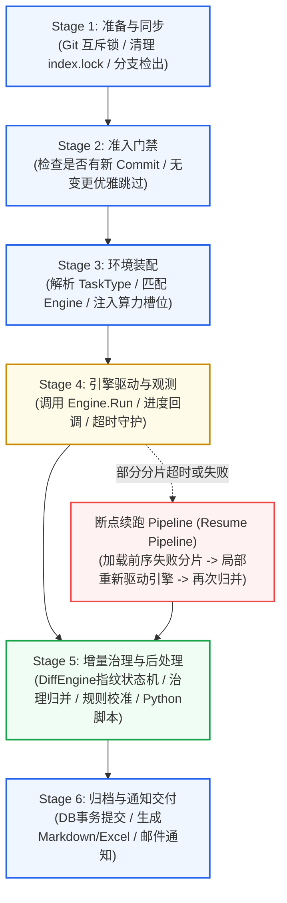
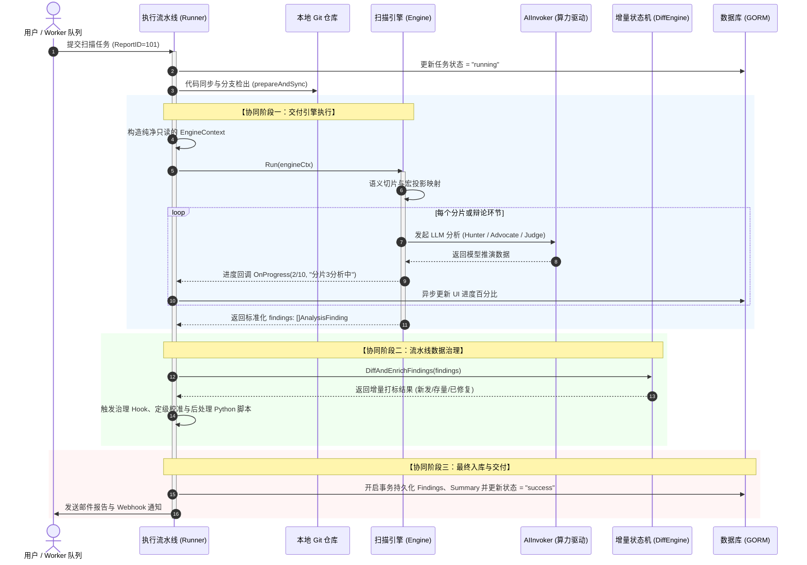

# 扫描引擎与执行流水线职责边界与协同模型深度设计

## 1. 架构背景与核心概念辨析

在 Code-Shield 静态代码安全分析平台的演进历程中，早期的任务处理逻辑较为简单，往往在一个过程式函数中同时完成 Git 拉取、AI 命令行调用、JSON 解析与数据库存储。但随着系统引入**分片并发扫描（Chunked）**、**多智能体三权分立对抗辩论（Debate Engine）**、**跨任务物理强指纹增量比对（Diff Engine）** 以及 **LLM 算力池动态加权调度（ModelDispatcher）**，原有的混杂结构导致系统职责边界急剧模糊，产生了严重的紧耦合与越权混乱。

为了从根本上理顺系统架构，必须在核心服务层明确划分两个根本不同维度的概念：**扫描引擎（Scanning Engine）** 与 **执行流水线（Execution Pipeline / Runner）**。

### 一句话核心定位
*   **扫描引擎（Scanning Engine）是“领域业务算法专家”**：
    聚焦于**“代码缺陷怎么找”**（How to find defects）。它完全专注于源代码语义感知、提示词工程构建、大模型推理推演、多智能体博弈与缺陷判定。
*   **执行流水线（Execution Pipeline / Runner）是“任务生命周期流程管家”**：
    聚焦于**“任务从哪来到哪去”**（How to orchestrate the lifecycle）。它完全专注于系统级任务的生命周期状态机推进、代码仓同步与进程隔离、资源调度、异常容错、断点续跑、数据治理与最终交付。

---

## 2. 职责边界清晰对比矩阵

下表总结了两者的定位、输入输出与设计约束差异：

| 架构维度 | 执行流水线 (Pipeline Runner) | 扫描引擎 (Scanning Engine) |
| :--- | :--- | :--- |
| **角色定位** | **系统编排与生命周期控制器 (Orchestrator)** | **领域核心分析与推演算法组件 (Algorithm Core)** |
| **关心的核心问题** | 任务何时调度？代码如何检出？超时如何熔断？挂了怎么断点续跑？结果怎么入库与发信？ | 这段代码是否存在越界？非默认宏是否保护？猎手与辩护人谁更可信？严重度如何确定？ |
| **核心输入** | `ReportID`、`RepoURL`、`TaskTypeID`、触发运行参数 | 源码绝对路径、待分析文件清单、AIInvoker 驱动、引擎特定配置 |
| **核心输出** | 最终任务报告 `TaskReport`、状态机流转、多格式导出、邮件通知 | 结构化的标准化缺陷列表 `[]models.AnalysisFinding` |
| **数据库/外部交互** | **强交互**：操作 GORM 数据库事务、读写配置表、发送 SMTP 邮件 | **零交互 (Pure Compute)**：绝不直接访问 DB，绝不直接调用邮件服务，保持纯内存逻辑 |
| **状态感知** | **全局生命周期状态** (`pending` $\to$ `running` $\to$ `success` / `failed`) | **局部推演进度** (`chunk 2/10`, `advocate stage`) |
| **多态与复用性** | 整个平台保持 **1 条标准通用的流水线骨架**（定义统一生命周期阶段） | 平台支持 **多种异构扫描引擎可插拔互换** (`single`, `chunked`, `debate`, 未来SCA/AST等) |
| **测试形态** | 流程集成测试（验证锁机制、事务回滚、超时取消与通知） | 高速单元测试（输入固定代码，毫秒级断言产出缺陷是否精准，无外部 DB/Git 依赖） |

---

## 3. 扫描引擎 (Scanning Engine) 深度架构与职责

扫描引擎是无状态（Stateless）的分析推演组件，严格实现统一的 `TaskEngine` 契约接口：

```go
type TaskEngine interface {
    Mode() string
    Run(ctx *EngineContext) ([]models.AnalysisFinding, error)
}
```



### 3.1 核心职责范围
1.  **代码感知与切片策略 (Code Slicing)**：
    *   根据配置决定是单仓全局分析（`SingleEngine`），还是按包/模块进行并发切片（`ChunkedEngine`）；
    *   通过 `SemanticChunker` 提取头文件声明摘要（Header Outline）与构建宏定义（Macro Context），建立跨目录配对投影，消除跨文件语义割裂盲区。
2.  **大模型推演与智能体协同 (Multi-Agent Reasoning)**：
    *   负责构造针对具体编程语言和漏洞场景的 System Prompt 与 User Message；
    *   调度多智能体博弈（如 `DebateEngine`）：
        *   **Tier 1（Hunter）**：低成本快模型高并发初筛可疑点；
        *   **Tier 2（Advocate vs Prosecutor）**：强推理模型对可疑点反向推演防御机制与触发路径；
        *   **Tier 3（Judge）**：法官仲裁，剔除误报。
3.  **标准化产物交付**：
    *   将 LLM 输出的原始自然语言/Markdown/JSON 清洗收敛为强类型的 `AnalysisFinding` 数组，作为纯计算结果返回。

> 🛑 **扫描引擎设计红线（严禁越权）**：
> 1. 引擎**严禁直接操作 GORM `models.DB`** 进行数据库更新或事务提交；
> 2. 引擎**严禁操作任务状态机**（如调用 `updateTaskStatus` 或 `markFailed`）；
> 3. 引擎**严禁侵入外层生命周期**（如自行调用 Git 同步、断点续跑调度或发送外部通知）。

---

## 4. 执行流水线 (Pipeline Runner) 深度架构与职责

执行流水线是整个分析任务的编排调度中枢，负责驱动单次扫描任务穿过 6 个标准化的生命周期阶段：



### 4.1 六大阶段具体职责
1.  **Stage 1: 准备与代码同步（Git Sync & Lock）**：
    *   维护仓库级并发读写互斥锁，避免针对同一个本地代码仓并发执行 Git 拉取导致仓库元数据损坏；
    *   主动清理磁盘遗留的 `.git/index.lock` 陈旧锁，拉取指定分支/Commit。
2.  **Stage 2: 准入门禁与变更前置检查（Preconditions）**：
    *   查询该仓库上一次成功扫描的 Commit Hash，比对当前是否有增量提交。无新代码提交时优雅跳过（`ErrSkipped`），避免空耗算力。
3.  **Stage 3: 引擎调度与上下文装配（Environment Assembly）**：
    *   依据任务类型配置中的 `engine_mode`（如 `debate_full`），通过引擎工厂实例化对应的 `TaskEngine`；
    *   组装只读且环境隔离的 `EngineContext`，将必要的模型配置与 `AIInvoker` 传递给引擎。
4.  **Stage 4: 引擎驱动与进度观测（Engine Execution & Telemetry）**：
    *   负责任务级 `context.Context` 生命周期控制与超时强杀；
    *   挂载 `OnProgress` 监听器，接收引擎回传的微进度，实时更新前端进度条与算力看板透视。
5.  **Stage 5: 增量治理与后处理（Post-Processing & Governance）**：
    *   **缺陷指纹匹配（`DiffEngine`）**：计算物理源码强指纹，比对历史缺陷，标记状态（`新发`、`存量`、`已修复`）；
    *   **专项治理（`Governance Hook`）**：合并专项 Campaign 缺陷生命周期；
    *   **确定性定级（`Calibrator`）**：按 CWE 破坏性与宏开关规则树收敛严重级别；
    *   **后处理脚本**：以沙箱进程执行任务类型中配置的自定义 Python 后处理脚本。
6.  **Stage 6: 事务提交与通告交付（Finalize & Notification）**：
    *   开启数据库事务批量持久化 Findings 与 TaskReport，写入任务总结元数据；
    *   驱动 `services/reports` 导出 Excel 与 Markdown 归档文件；
    *   发送结果邮件通告与 Webhook 告警，最后释放租约与临时资源。

### 4.2 错误编排与断点续跑（Resume Pipeline）
在分片并发扫描中，若部分分片因网络闪断或超时失败，**流水线（而非引擎）** 负责：
1.  保存包含部分成功分片结果的检查点元数据（Checkpoint）；
2.  在收到用户“重试/续跑”指令后，由流水线读取检查点，过滤出失败的 Chunk 列表；
3.  流水线重新向扫描引擎发起局部补扫请求，并将补扫得到的新 Findings 与历史成功分片合并，恢复并走完后续后处理流程。

---

## 5. 两者的协同协作机制（运行时时序）

扫描引擎与执行流水线之间在运行期通过清晰的接口契约交互，彼此互不知晓对方的内部私有状态：



---

## 6. 架构解耦的核心价值与工程收益

将“扫描引擎”与“执行流水线”进行严格正交解耦，为系统带来以下核心工程红利：

### 1. 彻底消除级联崩溃（Fault Isolation）
在重构前，断点续跑等流程逻辑混入 `engine_chunked.go`，导致引擎代码一旦发生死锁或 panic，整个流水线的错误兜底与报告归档机制直接瘫痪。解耦后，引擎是纯函数式的分析组件，即便模型输出严重畸变，流水线也能通过 `cleaner.go` 兜底恢复或标记单分片失败，保障主流程坚如磐石。

### 2. 单元测试效率百倍级提升（100x Faster Testing）
*   **引擎测试脱敏**：编写扫描引擎的单元测试时，测试用例只需准备几行 C++/Go 伪代码并构造一个内存 `EngineContext`，**不需要启动数据库，也不需要真实的 Git 远端仓库**，测试毫秒级完成。
*   **流水线测试解耦**：编写任务调度测试时，直接注入一个 `MockEngine`（直接返回预设的 3 个 Mock Finding），即可专注验证任务重试、并发限流、邮件模板渲染与事务回滚的健壮性。

### 3. 极速横向插拔扩展新引擎（Zero-Cost Engine Extensibility）
未来 Code-Shield 计划接入更多维度的代码分析手段（例如针对开源依赖漏洞的 **SCA 扫描引擎**、基于抽象语法树的 **Semgrep 规则扫描引擎**、针对大语言模型安全提示词注入的 **Prompt 注入防御引擎** 等）：
*   **流水线 1 行代码都不用改**！
*   新引入的分析工具只需封装为满足 `TaskEngine` 接口的子模块，立即天然享有 Code-Shield 平台提供的：代码仓拉取锁、异构算力池调度、断点续跑、确定性指纹去重、多格式报表导出与邮件推送的全套成熟能力。
